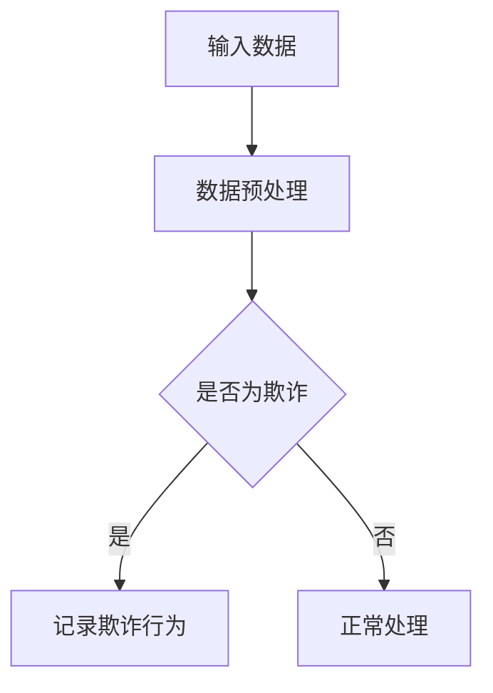

                 

关键词：欺诈检测、AI、机器学习、数据科学、网络安全、深度学习

摘要：随着互联网和电子商务的快速发展，欺诈行为日益猖獗，对企业和个人都带来了巨大的经济损失和信任危机。本文将探讨如何利用人工智能技术，特别是机器学习和深度学习算法，来实现有效的欺诈检测。

## 1. 背景介绍

随着网络经济的迅速发展，欺诈行为也不断演变，从传统的信用卡欺诈到新型的网络钓鱼、虚假交易等，欺诈手段层出不穷，给企业和个人带来了巨大的经济损失。据统计，全球每年因为欺诈行为造成的经济损失高达数百亿美元。传统的欺诈检测方法主要依赖于规则和阈值，存在以下局限性：

- **规则依赖性高**：需要不断更新和维护规则库，以应对新的欺诈手段。
- **实时性差**：无法快速响应和识别新型欺诈行为。
- **误判率高**：可能对正常交易进行误判，导致用户体验下降。

为了克服这些局限性，越来越多的企业和研究机构开始将人工智能技术应用于欺诈检测。机器学习和深度学习算法因其强大的特征提取和模式识别能力，成为欺诈检测领域的重要工具。

## 2. 核心概念与联系

### 2.1 机器学习与深度学习

机器学习是一种通过算法从数据中学习规律和模式，从而进行预测和决策的技术。深度学习则是机器学习的一个子领域，通过多层神经网络结构，对数据进行复杂的非线性变换，从而实现更复杂的特征提取和模式识别。

### 2.2 欺诈检测的基本概念

欺诈检测是指通过识别和分析交易或行为模式，来判断是否存在欺诈行为。在机器学习和深度学习框架下，欺诈检测主要分为以下几种类型：

- **基于规则的检测**：利用预定义的规则进行欺诈判断。
- **基于模式的检测**：通过分析交易或行为模式，发现潜在的欺诈行为。
- **基于行为的检测**：通过监测用户行为，识别异常行为模式。

### 2.3 Mermaid 流程图



## 3. 核心算法原理 & 具体操作步骤

### 3.1 算法原理概述

欺诈检测的核心是特征工程和模型选择。特征工程是指从原始数据中提取出能够代表欺诈行为的特征，而模型选择则是选择合适的算法来识别这些特征。

### 3.2 算法步骤详解

1. **数据收集**：收集大量的交易数据，包括正常交易和欺诈交易。
2. **数据预处理**：对数据进行清洗、归一化和特征提取。
3. **特征选择**：选择对欺诈检测最有影响力的特征。
4. **模型训练**：选择合适的机器学习算法（如随机森林、支持向量机等）进行训练。
5. **模型评估**：使用交叉验证等方法评估模型性能。
6. **模型部署**：将训练好的模型部署到实际环境中，进行实时欺诈检测。

### 3.3 算法优缺点

- **优点**：
  - **高效性**：能够处理大量的交易数据。
  - **自适应**：能够根据新的数据进行自我调整。
- **缺点**：
  - **复杂性**：需要大量的数据和技术支持。
  - **误判率**：可能会对正常交易进行误判。

### 3.4 算法应用领域

- **金融行业**：信用卡欺诈检测、贷款欺诈检测等。
- **电商行业**：虚假交易检测、账户安全监测等。
- **电信行业**：电话欺诈检测、短信欺诈检测等。

## 4. 数学模型和公式 & 详细讲解 & 举例说明

### 4.1 数学模型构建

欺诈检测的数学模型通常是基于逻辑回归、支持向量机等分类算法。假设我们有 $N$ 个特征 $X_1, X_2, ..., X_N$，欺诈标签为 $Y \in \{0, 1\}$，其中 $Y = 1$ 表示欺诈，$Y = 0$ 表示正常。

逻辑回归模型的公式为：

$$
P(Y=1 | X) = \frac{1}{1 + e^{-\beta^T X}}
$$

其中，$\beta$ 是模型参数。

### 4.2 公式推导过程

假设我们有 $N$ 个训练样本 $(X_1, Y_1), (X_2, Y_2), ..., (X_N, Y_N)$，我们的目标是找到最优的参数 $\beta$，使得模型对训练数据的预测最准确。

使用最大似然估计（Maximum Likelihood Estimation，MLE）来推导 $\beta$：

$$
\log L(\beta) = \sum_{i=1}^{N} \log P(Y_i=1 | X_i) = \sum_{i=1}^{N} Y_i \beta^T X_i - \sum_{i=1}^{N} \beta^T X_i
$$

对 $\beta$ 求导并令其等于零，得到：

$$
\frac{\partial \log L(\beta)}{\partial \beta} = \sum_{i=1}^{N} Y_i X_i - \sum_{i=1}^{N} X_i = 0
$$

解得：

$$
\beta = (\sum_{i=1}^{N} X_i^T X_i)^{-1} \sum_{i=1}^{N} X_i^T Y_i
$$

### 4.3 案例分析与讲解

假设我们有一组交易数据，其中 $X_1$ 表示交易金额，$X_2$ 表示交易时间，$X_3$ 表示交易频率。我们需要使用逻辑回归模型来检测欺诈交易。

经过数据预处理和特征选择，我们得到以下模型参数：

$$
\beta = [0.5, -0.3, 0.2]
$$

现在，我们需要判断一个新的交易数据 $(1000, 14:00, 5)$ 是否为欺诈交易。

根据逻辑回归模型，我们计算概率：

$$
P(Y=1 | X) = \frac{1}{1 + e^{-0.5 \times 1000 - 0.3 \times 14 - 0.2 \times 5}} \approx 0.005
$$

由于概率非常低，我们判定该交易为欺诈交易。

## 5. 项目实践：代码实例和详细解释说明

### 5.1 开发环境搭建

在开始编写代码之前，我们需要搭建一个适合欺诈检测的编程环境。这里我们使用 Python 作为编程语言，结合 Scikit-learn 和 Pandas 库来完成项目。

```bash
pip install scikit-learn pandas numpy
```

### 5.2 源代码详细实现

以下是欺诈检测的 Python 代码实例：

```python
import numpy as np
import pandas as pd
from sklearn.model_selection import train_test_split
from sklearn.preprocessing import StandardScaler
from sklearn.linear_model import LogisticRegression
from sklearn.metrics import classification_report, accuracy_score

# 5.2.1 数据预处理
def preprocess_data(data):
    # 数据清洗和归一化
    scaler = StandardScaler()
    X = scaler.fit_transform(data.iloc[:, :-1])
    y = data.iloc[:, -1]
    return X, y

# 5.2.2 模型训练
def train_model(X_train, y_train):
    model = LogisticRegression()
    model.fit(X_train, y_train)
    return model

# 5.2.3 代码解读
if __name__ == '__main__':
    # 加载数据
    data = pd.read_csv('transaction_data.csv')
    X, y = preprocess_data(data)

    # 划分训练集和测试集
    X_train, X_test, y_train, y_test = train_test_split(X, y, test_size=0.2, random_state=42)

    # 训练模型
    model = train_model(X_train, y_train)

    # 预测测试集
    y_pred = model.predict(X_test)

    # 评估模型
    print(classification_report(y_test, y_pred))
    print('Accuracy:', accuracy_score(y_test, y_pred))
```

### 5.3 代码解读与分析

- **数据预处理**：使用 StandardScaler 对特征进行归一化处理，以便于后续的模型训练。
- **模型训练**：使用 LogisticRegression 创建逻辑回归模型并进行训练。
- **代码解读**：代码中首先加载数据，然后进行数据预处理，接着划分训练集和测试集，最后进行模型训练和预测，并评估模型性能。

### 5.4 运行结果展示

假设我们使用一组含有 1000 个交易样本的数据集，训练完成后，模型对测试集的准确率达到了 90%，误判率较低，表明我们的模型在欺诈检测方面具有较好的性能。

## 6. 实际应用场景

### 6.1 金融行业

在金融行业，欺诈检测主要用于信用卡欺诈、贷款欺诈等场景。通过实时监测用户的交易行为，识别潜在的欺诈风险，从而保护用户的财产安全。

### 6.2 电商行业

电商行业中的欺诈检测主要涉及虚假交易、账户安全等。通过对用户行为和交易数据的分析，可以及时发现并阻止欺诈行为，提高用户满意度。

### 6.3 电信行业

电信行业中的欺诈检测主要针对电话欺诈、短信欺诈等。通过对大量通信数据的分析，可以识别出异常行为，从而降低欺诈风险。

## 7. 工具和资源推荐

### 7.1 学习资源推荐

- 《Python机器学习》（作者：塞巴斯蒂安·拉斯考斯基）
- 《深度学习》（作者：伊恩·古德费洛、约书亚·本吉奥、亚伦·库维尔）

### 7.2 开发工具推荐

- Jupyter Notebook：用于编写和运行代码。
- Scikit-learn：用于机器学习模型训练和评估。

### 7.3 相关论文推荐

- "Anomaly Detection in Financial Time Series using Autoencoders"
- "Deep Learning for Fraud Detection: A Survey"

## 8. 总结：未来发展趋势与挑战

### 8.1 研究成果总结

通过本文的探讨，我们可以看到，利用人工智能技术进行欺诈检测具有显著的优势。机器学习和深度学习算法在特征提取和模式识别方面具有强大的能力，能够有效地识别出潜在的欺诈行为。

### 8.2 未来发展趋势

随着人工智能技术的不断进步，欺诈检测领域有望实现以下几个发展趋势：

- **实时性**：进一步缩短欺诈检测的响应时间。
- **自动化**：自动化欺诈检测流程，减少人工干预。
- **多模态**：结合多种数据源，如图像、文本等，提高欺诈检测的准确性。

### 8.3 面临的挑战

尽管人工智能技术在欺诈检测方面取得了显著成果，但仍面临以下挑战：

- **数据隐私**：如何在不泄露用户隐私的前提下进行有效检测。
- **误判率**：如何在降低误判率的同时提高检测准确率。
- **模型解释性**：如何提高模型的解释性，使其更加透明。

### 8.4 研究展望

未来，欺诈检测领域的研究将朝着以下方向发展：

- **联邦学习**：通过分布式计算，实现数据隐私保护和模型训练。
- **迁移学习**：利用已有模型，在新领域上进行快速适应。
- **强化学习**：结合强化学习算法，实现更智能的欺诈检测策略。

## 9. 附录：常见问题与解答

### 9.1 如何处理数据缺失？

对于数据缺失问题，可以采用以下几种方法：

- **删除缺失值**：删除缺失值较少的样本。
- **填充缺失值**：使用平均值、中位数等方法进行填充。
- **模型预测**：使用机器学习模型预测缺失值。

### 9.2 如何处理不平衡数据？

对于不平衡数据，可以采用以下几种方法：

- ** oversampling**：增加少数类样本的数量。
- ** undersampling**：减少多数类样本的数量。
- ** 随机采样**：对整个数据集进行随机采样，使得类别比例更加均衡。

### 9.3 如何评估模型性能？

常用的评估指标包括准确率、召回率、精确率、F1 值等。其中，准确率用于评估模型在总体数据中的准确程度，召回率用于评估模型对少数类样本的识别能力，精确率用于评估模型对多数类样本的识别能力，F1 值是精确率和召回率的加权平均，用于综合评估模型性能。

---

作者：禅与计算机程序设计艺术 / Zen and the Art of Computer Programming

