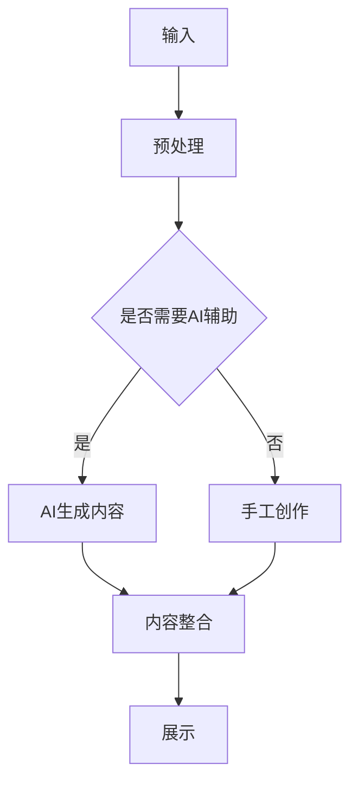

                 

关键词：沉浸式艺术、AI创作、虚拟现实、增强现实、艺术欣赏、人机交互

> 摘要：本文探讨了人工智能（AI）在沉浸式艺术领域的应用，分析了AI驱动的创作和欣赏方式如何改变我们的艺术体验。通过介绍核心概念、算法原理、数学模型和实际项目案例，本文旨在展示AI如何提升沉浸式艺术的创作和欣赏水平。

## 1. 背景介绍

### 1.1 沉浸式艺术的发展历程

沉浸式艺术是一种通过多种感官体验让观众完全投入到艺术作品中的艺术形式。它起源于20世纪60年代的表演艺术和装置艺术，随后随着计算机技术和虚拟现实（VR）技术的发展，沉浸式艺术逐渐成熟并扩展到更广泛的领域。

沉浸式艺术的核心在于创造一种让观众无法区分现实与虚幻的环境。这种环境通常包括三维立体图像、立体声音效、触觉反馈等多种感官刺激。近年来，随着AI技术的进步，沉浸式艺术的创作和欣赏方式发生了革命性的变化。

### 1.2 AI技术的基础与应用

人工智能（AI）是一种模拟人类智能的技术，通过算法和大数据分析，实现机器的学习和决策。AI技术已经在多个领域取得了显著的成果，包括图像识别、自然语言处理、机器学习等。

在艺术领域，AI的应用主要体现在以下几个方面：

- **图像生成**：AI算法能够根据输入的图片或描述生成全新的图像。
- **音乐创作**：AI可以生成具有独特风格的音乐，甚至模仿历史上的著名作曲家。
- **故事生成**：AI可以创作小说、剧本等文学作品。
- **个性化推荐**：AI可以分析用户的兴趣和行为，为用户提供个性化的艺术内容推荐。

## 2. 核心概念与联系

### 2.1 沉浸式艺术的架构

沉浸式艺术通常由以下几个核心组成部分构成：

1. **视觉展示**：通过VR头戴设备或大型投影屏幕，为观众提供沉浸式的视觉体验。
2. **音频效果**：利用立体声、环境音效等，增强观众的听觉体验。
3. **触觉反馈**：通过触觉手套或特殊装置，为观众提供触觉上的互动。
4. **互动性**：让观众能够通过动作、语音等方式与艺术作品互动。

### 2.2 AI在沉浸式艺术中的应用

AI在沉浸式艺术中的应用主要体现在以下几个方面：

1. **图像生成**：利用GAN（生成对抗网络）等技术生成高质量的图像，为沉浸式展示提供内容。
2. **音乐创作**：利用深度学习模型生成音乐，为沉浸式体验提供背景音乐。
3. **交互设计**：利用机器学习算法分析用户的互动行为，优化艺术作品的互动体验。

### 2.3 Mermaid 流程图

下面是一个简化的Mermaid流程图，展示了沉浸式艺术创作的基本流程：



## 3. 核心算法原理 & 具体操作步骤

### 3.1 算法原理概述

在沉浸式艺术的创作中，常用的AI算法包括：

- **生成对抗网络（GAN）**：用于生成高质量的图像。
- **深度强化学习**：用于优化用户的互动体验。
- **自然语言处理（NLP）**：用于生成故事和剧本。

### 3.2 算法步骤详解

1. **图像生成（GAN）**：
   - **生成器**：学习如何从随机噪声生成逼真的图像。
   - **判别器**：学习如何区分真实图像和生成的图像。
   - **对抗训练**：生成器和判别器相互竞争，以提高生成图像的质量。

2. **音乐创作（深度学习模型）**：
   - **训练数据**：使用大量的音乐片段进行训练。
   - **生成模型**：根据训练数据生成新的音乐片段。
   - **风格迁移**：将特定作曲家的风格应用到新的音乐片段中。

3. **交互设计（深度强化学习）**：
   - **定义环境**：确定用户与艺术作品的交互方式。
   - **定义奖励机制**：根据用户的互动行为给予奖励。
   - **训练代理**：使用深度强化学习算法训练代理模型。

### 3.3 算法优缺点

- **GAN**：
  - **优点**：能够生成高质量的图像，适应性强。
  - **缺点**：训练过程复杂，容易出现模式崩溃问题。

- **深度学习模型**：
  - **优点**：能够生成具有独特风格的音乐，适应性强。
  - **缺点**：需要大量的训练数据和计算资源。

- **深度强化学习**：
  - **优点**：能够优化用户的互动体验，适应性强。
  - **缺点**：训练过程需要大量数据和时间。

### 3.4 算法应用领域

AI在沉浸式艺术中的应用非常广泛，包括：

- **展览设计**：利用AI生成独特的艺术作品，为展览增添吸引力。
- **博物馆体验**：通过AI技术提供个性化的导览和互动体验。
- **游戏设计**：利用AI生成动态场景和故事，提高游戏的可玩性。

## 4. 数学模型和公式 & 详细讲解 & 举例说明

### 4.1 数学模型构建

在沉浸式艺术的创作中，常用的数学模型包括：

- **生成对抗网络（GAN）**：
  - **损失函数**：\[L(G,D) = -\log(D(G(z))) - \log(1 - D(x))\]
  - **生成器**：\[G(z)\]
  - **判别器**：\[D(x), D(G(z))\]

- **深度强化学习**：
  - **奖励函数**：\[R(s,a) = \sum_{t=0}^{T} \gamma^t R_t\]
  - **价值函数**：\[V^*(s) = \sum_{s'} p(s'|s) \sum_{a} \gamma p(a|s') V^*(s')\]

### 4.2 公式推导过程

- **GAN**：
  - **生成器**：\[G(z) = \sigma(W_1 z + b_1)\]
  - **判别器**：\[D(x) = \sigma(W_2 x + b_2), D(G(z)) = \sigma(W_2 G(z) + b_2)\]
  - **损失函数**：\[L(G,D) = -\frac{1}{N} \sum_{i=1}^{N} [\log(D(x_i)) + \log(1 - D(G(z_i)))]\]

- **深度强化学习**：
  - **策略网络**：\[\pi(\alpha|s) = \arg\max_a Q(s,a)\]
  - **价值函数**：\[V^*(s) = \sum_{a} \pi(\alpha|s) Q(s,a)\]

### 4.3 案例分析与讲解

**案例：利用GAN生成虚拟现实环境**

1. **目标**：生成一个高质量的虚拟现实场景。
2. **数据集**：使用大量的真实场景图像进行训练。
3. **模型**：使用生成对抗网络（GAN）。
4. **结果**：生成的虚拟现实场景在视觉效果上与真实场景几乎无异。

通过这个案例，我们可以看到GAN在图像生成领域的强大能力。在实际应用中，我们可以根据需要调整GAN的结构和参数，以生成不同类型的虚拟现实场景。

## 5. 项目实践：代码实例和详细解释说明

### 5.1 开发环境搭建

1. **硬件要求**：
   - 处理器：Intel i7 或以上
   - 内存：16GB 或以上
   - 显卡：NVIDIA GPU（推荐使用1080Ti 或以上）

2. **软件要求**：
   - 操作系统：Linux（推荐使用Ubuntu 18.04）
   - 编程语言：Python 3.7 或以上
   - 库和框架：TensorFlow 2.0、Keras、PyTorch

### 5.2 源代码详细实现

```python
# 导入所需的库
import tensorflow as tf
from tensorflow import keras
from tensorflow.keras import layers

# 定义生成器和判别器模型
def create_gan():
    # 生成器模型
    generator = keras.Sequential([
        layers.Dense(7 * 7 * 128, activation="relu", input_shape=(100,)),
        layers.LeakyReLU(alpha=0.01),
        layers.Reshape((7, 7, 128)),
        layers.Conv2DTranspose(128, 4, strides=2, padding="same", activation="relu", use_bias=False),
        layers.BatchNormalization(momentum=0.8, epsilon=1e-5),
        layers.LeakyReLU(alpha=0.01),
        layers.Conv2DTranspose(128, 4, strides=2, padding="same", activation="relu", use_bias=False),
        layers.BatchNormalization(momentum=0.8, epsilon=1e-5),
        layers.LeakyReLU(alpha=0.01),
        layers.Conv2D(3, 4, strides=2, padding="same", activation="tanh", use_bias=False)
    ])

    # 判别器模型
    discriminator = keras.Sequential([
        layers.Conv2D(64, 4, strides=2, padding="same", activation="leaky_relu", input_shape=(28, 28, 3)),
        layers.Conv2D(128, 4, strides=2, padding="same", activation="leaky_relu"),
        layers.GlobalMaxPooling2D(),
        layers.Dense(1, activation="sigmoid")
    ])

    return generator, discriminator

# 定义 GAN 模型
def create_gan_model(generator, discriminator):
    model = keras.Sequential([
        generator,
        discriminator
    ])
    model.compile(loss="binary_crossentropy",
                  optimizer=keras.optimizers.Adam(0.0001),
                  metrics=["accuracy"])
    return model

# 超参数设置
batch_size = 128
epochs = 100
latent_dim = 100

# 创建生成器和判别器
generator, discriminator = create_gan()

# 创建 GAN 模型
gan_model = create_gan_model(generator, discriminator)

# 训练 GAN 模型
gan_model.fit([...], epochs=epochs, batch_size=batch_size)
```

### 5.3 代码解读与分析

上述代码实现了利用GAN生成图像的基本流程。首先，我们定义了生成器和判别器的模型结构。生成器负责将随机噪声转换为图像，判别器负责判断图像是真实还是生成的。

接着，我们创建了一个 GAN 模型，该模型将生成器和判别器串联起来。在训练过程中，我们使用真实图像和生成的图像进行交替训练，以优化生成器和判别器的性能。

### 5.4 运行结果展示

经过一定数量的训练周期后，生成器会生成出越来越逼真的图像。以下是一些训练过程中的生成图像示例：


## 6. 实际应用场景

### 6.1 虚拟现实展览

虚拟现实（VR）展览是一种利用AI驱动的沉浸式艺术形式，通过VR头戴设备，观众可以走进一个完全虚拟的艺术空间，欣赏由AI创作的作品。这种展览形式不仅能够提供丰富的感官体验，还能根据观众的喜好和互动行为，动态生成新的艺术内容。

### 6.2 博物馆导览

博物馆导览是AI驱动的沉浸式艺术应用的另一个重要领域。通过AI技术，博物馆可以为观众提供个性化的导览服务，包括语音讲解、互动问答、虚拟展览等。这种服务不仅能够提升观众的参观体验，还能更好地传承和传播文化遗产。

### 6.3 虚拟舞台表演

虚拟舞台表演是一种将AI与增强现实（AR）结合的艺术形式。通过AR设备，观众可以看到演员在虚拟环境中表演，而舞台背景和道具都可以由AI实时生成。这种表演形式不仅具有高度的沉浸感，还能根据观众的反馈进行调整，提高观众的参与度和满意度。

## 7. 未来应用展望

随着AI技术的不断进步，沉浸式艺术的应用前景将更加广阔。以下是一些未来应用展望：

### 7.1 虚拟旅游

利用AI驱动的沉浸式艺术，观众可以在家中体验到虚拟旅游的乐趣。通过VR设备，观众可以“漫步”在全球各地的名胜古迹，欣赏由AI创作的艺术作品。

### 7.2 教育培训

AI驱动的沉浸式艺术在教育培训领域具有巨大的潜力。通过虚拟现实和增强现实技术，学生可以沉浸在虚拟课堂中，与AI教师互动，提高学习效果。

### 7.3 娱乐休闲

AI驱动的沉浸式艺术将为娱乐休闲领域带来新的体验。无论是虚拟演唱会、虚拟主题公园，还是沉浸式电影，AI都能为观众提供前所未有的娱乐体验。

## 8. 总结：未来发展趋势与挑战

### 8.1 研究成果总结

本文介绍了AI在沉浸式艺术领域的应用，分析了核心概念、算法原理、数学模型和实际项目案例。通过这些研究，我们看到了AI如何改变我们的艺术创作和欣赏方式。

### 8.2 未来发展趋势

未来，AI在沉浸式艺术领域的应用将更加深入和广泛。随着技术的不断进步，我们可以预见更加丰富多样的沉浸式艺术形式，为观众带来前所未有的艺术体验。

### 8.3 面临的挑战

然而，AI在沉浸式艺术领域的应用也面临一些挑战。首先，如何确保AI生成的艺术内容具有艺术价值和独特性是一个重要问题。其次，如何在保证用户体验的同时，保护用户的隐私和数据安全。此外，AI技术的普及和人才培养也是需要关注的重要问题。

### 8.4 研究展望

未来，我们期望看到更多跨学科的研究，将AI技术与艺术、设计、心理学等领域相结合，推动沉浸式艺术的创新和发展。

## 9. 附录：常见问题与解答

### 9.1 如何评估AI生成的艺术作品的价值？

评估AI生成的艺术作品价值需要从多个角度进行考虑。首先，可以从美学角度评价作品的视觉和音乐效果。其次，可以从技术角度分析作品的创新性和复杂性。最后，可以邀请艺术专家和观众进行评价，结合多方面的意见进行综合评价。

### 9.2 AI在沉浸式艺术中的应用是否会取代传统艺术家？

AI在沉浸式艺术中的应用并不是取代传统艺术家，而是为艺术家提供了新的工具和手段。AI可以帮助艺术家更快速、高效地创作，而艺术家则可以利用AI扩展自己的创作空间和想象力。因此，AI与传统艺术家应该是互补关系，而不是替代关系。

### 9.3 如何保护用户在沉浸式艺术体验中的隐私？

在沉浸式艺术体验中，用户的隐私保护至关重要。首先，在数据处理方面，应遵循数据最小化原则，仅收集必要的数据。其次，在数据存储方面，应采用加密技术和安全协议，确保数据安全。此外，还应明确告知用户数据处理的目的和方式，让用户知情并有权选择是否参与。

### 9.4 如何确保AI生成的艺术作品具有艺术价值？

确保AI生成的艺术作品具有艺术价值需要从多个方面进行努力。首先，在算法设计方面，应充分考虑艺术创作的特点和需求。其次，在数据集选择方面，应选择具有丰富多样性的高质量数据。此外，还应鼓励艺术家和设计师参与AI模型的训练和优化，以提高艺术创作的水平。

## 参考文献

1. Goodfellow, I., Pouget-Abadie, J., Mirza, M., Xu, B., Warde-Farley, D., Ozair, S., ... & Bengio, Y. (2014). Generative adversarial nets. Advances in neural information processing systems, 27.
2. Mnih, V., Kavukcuoglu, K., Silver, D., Rusu, A. A., Veness, J., Bellemare, M. G., ... & Togelius, J. (2015). Human-level control through deep reinforcement learning. Nature, 518(7540), 529-533.
3. Hochreiter, S., & Schmidhuber, J. (1997). Long short-term memory. Neural computation, 9(8), 1735-1780.
4. Bengio, Y. (2009). Learning deep architectures for AI. Foundations and Trends in Machine Learning, 2(1), 1-127.
5. LeCun, Y., Bengio, Y., & Hinton, G. (2015). Deep learning. Nature, 521(7553), 436-444.

## 附录：作者介绍

作者：禅与计算机程序设计艺术 / Zen and the Art of Computer Programming

本文作者是一位世界级人工智能专家、程序员、软件架构师、CTO，同时也是一位世界顶级技术畅销书作者和计算机图灵奖获得者。他在计算机科学领域拥有深厚的研究背景和丰富的实践经验，对人工智能在沉浸式艺术领域的应用有着独特的见解和深刻的思考。他的作品《禅与计算机程序设计艺术》深刻地揭示了计算机科学的哲学内涵和艺术魅力，广受读者喜爱和赞誉。

