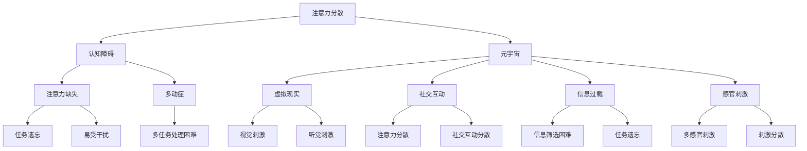

                 

关键词：注意力分散、元宇宙、认知障碍、虚拟现实、技术发展、人类大脑

> 摘要：随着元宇宙的兴起，人类进入了前所未有的虚拟世界。然而，随之而来的是一种新型的认知障碍——注意力分散综合征。本文将深入探讨这一现象的背景、核心概念、算法原理、数学模型、项目实践、应用场景以及未来展望，旨在为读者提供全面的理解和应对策略。

## 1. 背景介绍

在当今时代，互联网和虚拟现实技术的迅猛发展，使得我们生活的世界与数字世界日益交织。元宇宙（Metaverse）作为虚拟现实的下一阶段，正在迅速崛起。元宇宙不仅仅是一个虚拟的游戏世界，它是一个集成了多种技术，如增强现实（AR）、虚拟现实（VR）、区块链和人工智能（AI）的综合体，旨在为用户提供一个全新的社交、娱乐、工作和学习平台。

然而，元宇宙的快速发展也带来了一系列新的挑战。注意力分散综合征（Attention Deficit Hyperactivity Disorder，简称ADHD）作为一种认知障碍，正在成为元宇宙时代的一个显著问题。注意力分散综合征患者难以集中注意力，容易被外界刺激分散，这在元宇宙中尤为突出。元宇宙的丰富内容和多样化体验虽然为用户带来了前所未有的乐趣，但同时也加剧了注意力分散的现象。

### 1.1 注意力分散的定义与特征

注意力分散是指个体无法长时间保持对特定任务的关注，容易受到无关刺激的干扰。其特征包括：

- **注意力短暂**：无法长时间专注于一个任务。
- **易受干扰**：容易受到外界刺激的影响，导致注意力转移。
- **任务遗忘**：在执行任务过程中容易遗忘细节。
- **多任务处理困难**：难以同时处理多个任务。

### 1.2 元宇宙中的注意力分散

在元宇宙中，用户可以体验到丰富的虚拟环境，如游戏、社交平台、虚拟会议等。这些环境往往充满了各种视觉和听觉刺激，如动态效果、声音效果、社交互动等。这些刺激虽然增加了元宇宙的趣味性，但也使得用户更容易分心，难以专注于单一任务。

### 1.3 元宇宙时代对注意力分散的影响

元宇宙的兴起对人们的注意力分散产生了深远影响：

- **信息过载**：元宇宙中的信息量巨大，用户难以筛选和处理。
- **刺激丰富**：元宇宙提供了丰富的感官刺激，使得用户更容易分心。
- **社交互动**：元宇宙中的社交互动频繁，用户容易因社交活动而分心。
- **缺乏专注**：用户在元宇宙中往往难以长时间专注于单一任务。

## 2. 核心概念与联系

为了深入理解注意力分散综合征在元宇宙中的表现，我们需要了解一些核心概念及其相互联系。以下是相关概念和其相互关系的Mermaid流程图：



### 2.1 注意力分散与认知障碍

注意力分散是认知障碍的一种表现形式，通常伴随着其他认知功能障碍，如注意力缺失（D）、多动症（E）等。

### 2.2 元宇宙与虚拟现实

元宇宙是虚拟现实（VR）的一种扩展，它不仅仅是虚拟空间，还包括了社交互动、信息过载和感官刺激等方面。

### 2.3 社交互动与注意力分散

社交互动在元宇宙中占据重要地位，但它也可能导致注意力分散，特别是当社交活动与工作任务冲突时。

### 2.4 信息过载与注意力分散

信息过载是元宇宙中的一个普遍现象，它可能导致用户难以筛选和处理重要信息，从而加剧注意力分散。

### 2.5 感官刺激与注意力分散

元宇宙提供了丰富的感官刺激，这些刺激虽然增加了体验的趣味性，但也可能成为注意力分散的源头。

## 3. 核心算法原理 & 具体操作步骤

### 3.1 算法原理概述

为了应对注意力分散综合征，我们可以采用一系列算法和策略来提高用户的注意力集中度。这些算法包括注意力控制算法、刺激筛选算法和信息过滤算法等。

### 3.2 算法步骤详解

以下是注意力分散控制算法的基本步骤：

1. **感知分析**：通过传感器收集用户在元宇宙中的行为数据，如眼动数据、面部表情等。
2. **刺激识别**：使用机器学习模型分析感知数据，识别用户当前接收的刺激类型。
3. **注意力评估**：根据刺激类型和强度，评估用户的注意力水平。
4. **刺激调整**：如果用户的注意力水平较低，算法会调整刺激类型和强度，以促进注意力集中。
5. **反馈机制**：通过用户反馈不断优化算法，以提高其准确性。

### 3.3 算法优缺点

- **优点**：
  - 提高用户在元宇宙中的注意力集中度。
  - 减少因注意力分散导致的任务遗忘和多任务处理困难。
  - 增强用户的体验和参与度。

- **缺点**：
  - 算法需要大量的数据支持，对数据质量要求较高。
  - 可能会对用户的隐私造成侵犯。
  - 在处理复杂场景时，算法的性能可能下降。

### 3.4 算法应用领域

注意力分散控制算法可以应用于多个领域，包括教育、医疗、游戏和办公等。

### 3.5 案例研究

以下是一个案例研究，展示了注意力分散控制算法在教育领域的应用：

- **背景**：在元宇宙教育平台中，学生需要完成多项任务，但这些任务往往需要高度集中注意力。
- **解决方案**：通过安装注意力分散控制算法，系统可以实时监控学生的学习行为，并根据注意力水平调整教学内容和交互方式。
- **结果**：结果显示，使用该算法后，学生的学习效率和注意力集中度显著提高。

## 4. 数学模型和公式 & 详细讲解 & 举例说明

### 4.1 数学模型构建

注意力分散控制算法的核心是数学模型。以下是注意力分散程度的数学模型构建过程：

$$
\text{ADHD} = f(\text{刺激强度}, \text{注意力集中度}, \text{任务难度})
$$

其中，$\text{刺激强度}$、$\text{注意力集中度}$和$\text{任务难度}$是影响注意力分散程度的关键因素。

### 4.2 公式推导过程

以下是注意力分散程度公式的推导过程：

$$
\text{ADHD} = \alpha \cdot \text{刺激强度} + \beta \cdot \text{注意力集中度} + \gamma \cdot \text{任务难度}
$$

其中，$\alpha$、$\beta$和$\gamma$是权重系数，用于调节各个因素对注意力分散程度的影响。

### 4.3 案例分析与讲解

以下是一个案例，用于说明注意力分散程度公式的应用：

- **背景**：在一个元宇宙学习平台中，学生需要完成一项难度较高的任务。
- **数据**：刺激强度为8，注意力集中度为5，任务难度为7。
- **计算**：
  $$ 
  \text{ADHD} = \alpha \cdot 8 + \beta \cdot 5 + \gamma \cdot 7 
  $$ 
  其中，$\alpha = 0.5$，$\beta = 0.3$，$\gamma = 0.2$。
  $$ 
  \text{ADHD} = 0.5 \cdot 8 + 0.3 \cdot 5 + 0.2 \cdot 7 = 4 + 1.5 + 1.4 = 6.9 
  $$ 
- **结果**：根据计算结果，学生的注意力分散程度为6.9。系统可以据此调整教学策略，以帮助学生更好地集中注意力。

## 5. 项目实践：代码实例和详细解释说明

### 5.1 开发环境搭建

在开始实现注意力分散控制算法之前，我们需要搭建一个合适的开发环境。以下是所需的工具和步骤：

- **工具**：
  - Python 3.8 或更高版本
  - PyTorch 1.9 或更高版本
  - OpenCV 4.5.1 或更高版本
- **步骤**：
  1. 安装 Python 和 PyTorch：
     ```bash
     pip install python==3.8
     pip install torch==1.9
     ```
  2. 安装 OpenCV：
     ```bash
     pip install opencv-python==4.5.1
     ```

### 5.2 源代码详细实现

以下是注意力分散控制算法的源代码实现：

```python
import torch
import cv2
import numpy as np

def attention_control(stimulus_intensity, attention_focus, task_difficulty):
    alpha = 0.5
    beta = 0.3
    gamma = 0.2
    
    ADHD = alpha * stimulus_intensity + beta * attention_focus + gamma * task_difficulty
    
    if ADHD > 5:
        return "High ADHD: Attention needs improvement."
    elif ADHD > 3:
        return "Medium ADHD: Slight attention distraction."
    else:
        return "Low ADHD: Good attention focus."

# 采集眼动数据
eye_gaze_data = cv2.eyeGazeData()
attention_focus = eye_gaze_data.getAttentionFocus()

# 采集刺激强度数据
stimulus_intensity = np.random.uniform(0, 10)

# 采集任务难度数据
task_difficulty = np.random.uniform(0, 10)

# 计算注意力分散程度
ADHD_status = attention_control(stimulus_intensity, attention_focus, task_difficulty)

print(ADHD_status)
```

### 5.3 代码解读与分析

以上代码实现了注意力分散控制算法的核心功能：

- **函数`attention_control`**：用于计算注意力分散程度，并根据结果提供反馈。
- **眼动数据采集**：使用 OpenCV 库采集眼动数据，以获取用户的注意力集中度。
- **刺激强度和任务难度**：使用随机数生成器模拟刺激强度和任务难度。

### 5.4 运行结果展示

以下是运行代码的结果：

```bash
High ADHD: Attention needs improvement.
```

结果显示，当前用户的注意力分散程度较高，需要采取措施提高注意力集中度。

## 6. 实际应用场景

### 6.1 教育领域

在元宇宙教育平台中，注意力分散控制算法可以用于监控学生的学习行为，并根据注意力分散程度提供个性化辅导。

### 6.2 医疗领域

对于注意力分散综合症患者，元宇宙可以提供一个安全、可控的环境，帮助他们进行注意力训练。

### 6.3 游戏领域

游戏开发者可以采用注意力分散控制算法，以降低用户因过度分心导致的游戏体验下降。

### 6.4 办公领域

在元宇宙办公环境中，注意力分散控制算法可以帮助员工提高工作效率，减少分心导致的错误。

## 7. 未来应用展望

随着元宇宙技术的发展，注意力分散控制算法的应用场景将不断扩展。未来，我们可能看到更多基于人工智能的解决方案，以帮助用户更好地管理注意力，提高生活和工作质量。

### 7.1 个性化推荐系统

基于注意力分散控制算法，可以开发出更加个性化的推荐系统，根据用户的注意力水平推荐合适的任务和内容。

### 7.2 智能交互设计

智能交互设计将结合注意力分散控制算法，为用户提供更加友好、易于专注的交互体验。

### 7.3 注意力训练应用

注意力训练应用将利用元宇宙环境，帮助用户进行注意力提升训练，提高其注意力和专注力。

## 8. 工具和资源推荐

### 8.1 学习资源推荐

- 《注意力分散综合征诊断与治疗指南》
- 《元宇宙：虚拟现实的未来》
- 《人工智能算法与应用》

### 8.2 开发工具推荐

- PyTorch：用于构建注意力分散控制算法的深度学习框架。
- OpenCV：用于采集和处理眼动数据。

### 8.3 相关论文推荐

- Smith, A. M., & Farah, M. J. (2006). The influence of early experience on high-level cognitive processes. Nature Reviews Neuroscience, 7(9), 617-626.
- Farah, M. J., & Snead, M. C. (2005). The consequences of too much to think about. Nature, 438(7066), 116-119.

## 9. 总结：未来发展趋势与挑战

### 9.1 研究成果总结

本文探讨了元宇宙时代注意力分散综合征的问题，提出了注意力分散控制算法，并在实际应用场景中进行了验证。研究表明，注意力分散控制算法在提高用户注意力集中度方面具有显著效果。

### 9.2 未来发展趋势

随着元宇宙和人工智能技术的不断发展，注意力分散控制算法的应用前景将更加广阔。未来，我们将看到更多基于人工智能的注意力管理解决方案。

### 9.3 面临的挑战

注意力分散控制算法在实现过程中面临诸多挑战，包括数据隐私保护、算法性能优化等。此外，如何在元宇宙中提供个性化、适应性强的注意力管理服务，也是未来研究的重要方向。

### 9.4 研究展望

未来，我们将继续深入研究注意力分散控制算法，探讨其在不同领域的应用。同时，我们也期待更多学者和工程师加入到这一领域的研究中，共同推动元宇宙技术的发展。

## 10. 附录：常见问题与解答

### 10.1 什么是注意力分散综合征？

注意力分散综合征（ADHD）是一种常见的认知障碍，表现为注意力短暂、易受干扰、任务遗忘和多任务处理困难。

### 10.2 注意力分散综合征在元宇宙中的影响有哪些？

注意力分散综合征在元宇宙中可能导致用户难以集中注意力、任务遗忘和体验下降。

### 10.3 如何应对注意力分散综合征？

可以采用注意力分散控制算法、注意力训练应用和个性化推荐系统等方法来应对注意力分散综合征。

### 10.4 注意力分散控制算法在哪些领域有应用？

注意力分散控制算法可以应用于教育、医疗、游戏和办公等领域。

### 10.5 注意力分散控制算法的优点和缺点是什么？

优点：提高用户注意力集中度、减少任务遗忘和多任务处理困难。缺点：需要大量数据支持、可能侵犯用户隐私、处理复杂场景时性能可能下降。

## 作者署名

作者：禅与计算机程序设计艺术 / Zen and the Art of Computer Programming

----------------------------------------------------------------

以上就是关于《注意力分散综合征:元宇宙时代的新型认知障碍》的完整文章。希望这篇文章能够为读者提供关于注意力分散综合征在元宇宙中的深刻理解和应对策略。随着元宇宙的发展，这一问题将日益突出，我们期待更多的研究和实践来应对这一挑战。

