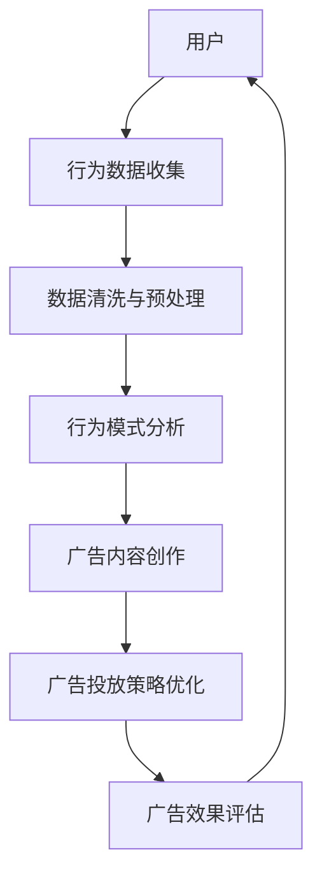

                 

关键词：注意力营销、元宇宙、广告投放、精准定位、数据分析、人工智能

> 摘要：随着元宇宙的兴起，传统广告模式面临着巨大的变革。本文将探讨如何利用注意力市场营销理论，结合人工智能技术，实现元宇宙广告的精准投放，从而最大化营销效果。通过深入分析注意力机制、用户行为数据、广告策略优化，为元宇宙广告主提供全新的营销思路。

## 1. 背景介绍

### 1.1 元宇宙的发展背景

近年来，随着虚拟现实（VR）、增强现实（AR）、区块链等技术的迅速发展，元宇宙（Metaverse）逐渐成为全球科技领域的新焦点。元宇宙被认为是一个虚拟的、三维的、交互的数字世界，用户可以在其中进行各种活动，如购物、社交、娱乐、教育等。据市场研究机构Statista预测，到2024年，全球元宇宙市场规模将达到1,000亿美元。

### 1.2 传统广告面临的挑战

在元宇宙中，传统广告模式面临着巨大的挑战。首先，元宇宙中的用户行为更加复杂，传统广告难以精准触达目标受众。其次，元宇宙的虚拟空间广阔，广告资源分散，传统广告投放效果难以评估。此外，随着用户隐私保护意识的增强，如何在尊重用户隐私的前提下进行广告投放也成为一个重要问题。

### 1.3 注意力市场营销的兴起

注意力市场营销（Attention Marketing）是一种以用户注意力为核心的新型营销策略。其核心思想是通过创造有吸引力的内容，吸引用户的注意力，从而实现营销目标。在元宇宙中，注意力市场营销理论为广告投放提供了一种全新的思路。通过分析用户行为数据，利用人工智能技术，可以实现对用户注意力的精准捕捉和有效引导。

## 2. 核心概念与联系

### 2.1 注意力机制

注意力机制是人工智能领域中一个重要的研究方向。它模拟人类大脑处理信息的方式，通过筛选和关注重要的信息，实现对环境的理解和反应。在元宇宙广告投放中，注意力机制可以帮助我们识别和吸引目标受众的注意力。

### 2.2 用户行为数据

用户行为数据是注意力市场营销的基础。通过收集和分析用户在元宇宙中的行为数据，如浏览历史、互动行为、购买偏好等，我们可以了解用户的兴趣和行为模式，从而实现精准的广告投放。

### 2.3 广告策略优化

广告策略优化是注意力市场营销的核心环节。通过机器学习算法，我们可以根据用户行为数据，动态调整广告内容、投放时间和投放渠道，从而提高广告的点击率和转化率。

### 2.4 注意力营销与元宇宙的架构

下面是一个简单的Mermaid流程图，展示了注意力营销与元宇宙架构之间的联系：



## 3. 核心算法原理 & 具体操作步骤

### 3.1 算法原理概述

注意力市场营销的核心算法主要包括用户行为数据分析、广告内容推荐和投放策略优化。以下是具体的算法原理：

1. **用户行为数据分析**：通过机器学习算法，对用户在元宇宙中的行为数据进行分析，提取出用户的兴趣和行为模式。

2. **广告内容推荐**：根据用户的行为数据和广告主的营销目标，生成个性化的广告内容。

3. **投放策略优化**：利用强化学习算法，动态调整广告的投放策略，如投放时间、投放渠道、广告位置等，以实现最佳投放效果。

### 3.2 算法步骤详解

1. **数据收集与预处理**：
   - 收集用户在元宇宙中的行为数据，如浏览历史、互动行为、购买记录等。
   - 对数据进行清洗和预处理，去除噪声和异常值。

2. **行为模式分析**：
   - 利用聚类算法，将用户划分为不同的群体。
   - 对每个用户群体的行为数据进行统计分析，提取出用户的兴趣和行为模式。

3. **广告内容创作**：
   - 根据用户的行为模式和广告主的营销目标，生成个性化的广告内容。
   - 广告内容可以包括图片、视频、文字等形式。

4. **广告投放策略优化**：
   - 利用强化学习算法，根据用户的行为反馈，动态调整广告的投放策略。
   - 优化策略包括投放时间、投放渠道、广告位置等。

5. **广告效果评估**：
   - 收集用户对广告的反馈数据，如点击率、转化率等。
   - 利用评估指标，对广告投放效果进行评估。

### 3.3 算法优缺点

#### 优点：

1. **精准投放**：通过分析用户行为数据，可以实现广告的精准投放，提高广告效果。

2. **动态调整**：利用强化学习算法，可以动态调整广告投放策略，适应用户行为的变化。

3. **个性化推荐**：根据用户兴趣和行为模式，生成个性化的广告内容，提高用户的参与度。

#### 缺点：

1. **数据隐私**：在收集用户行为数据时，需要考虑用户隐私保护问题。

2. **计算成本**：算法的运行需要大量的计算资源，对服务器和网络带宽有较高的要求。

### 3.4 算法应用领域

注意力市场营销算法可以广泛应用于元宇宙的各种场景，如电商、游戏、社交、教育等。以下是一些具体的应用案例：

1. **电商广告**：根据用户的购物行为和兴趣，推荐个性化的商品广告。

2. **游戏广告**：根据用户的游戏行为和兴趣，推荐相关的游戏广告。

3. **社交媒体广告**：根据用户的社交行为和兴趣，推荐相关的社交媒体广告。

## 4. 数学模型和公式 & 详细讲解 & 举例说明

### 4.1 数学模型构建

注意力市场营销的核心数学模型主要包括用户行为数据分析模型、广告内容推荐模型和投放策略优化模型。以下是具体的数学模型：

#### 用户行为数据分析模型：

$$
X = \sum_{i=1}^{n} w_i x_i
$$

其中，$X$表示用户的行为向量，$w_i$表示第$i$个特征的权重，$x_i$表示第$i$个特征。

#### 广告内容推荐模型：

$$
P(A|X) = \frac{e^{Q(A, X)}}{\sum_{B} e^{Q(B, X)}}
$$

其中，$P(A|X)$表示用户对广告$A$的点击概率，$Q(A, X)$表示广告$A$与用户行为向量$X$之间的匹配度。

#### 投放策略优化模型：

$$
\max_{\theta} J(\theta) = \sum_{i=1}^{n} [r_i - \hat{r_i}]^2
$$

其中，$J(\theta)$表示投放策略的损失函数，$\theta$表示投放策略参数，$r_i$表示实际转化率，$\hat{r_i}$表示预测转化率。

### 4.2 公式推导过程

#### 用户行为数据分析模型：

用户行为数据分析模型基于线性回归模型。首先，我们需要对用户行为数据进行特征提取，然后利用线性回归模型，将用户行为数据与广告点击概率联系起来。

#### 广告内容推荐模型：

广告内容推荐模型基于贝叶斯公式。假设用户对广告的点击行为是独立的，那么用户对广告$A$的点击概率可以表示为：

$$
P(A|X) = \frac{P(X|A)P(A)}{P(X)}
$$

其中，$P(X|A)$表示在广告$A$出现的情况下，用户的行为数据$X$的概率，$P(A)$表示广告$A$出现的概率，$P(X)$表示用户行为数据$X$的概率。

由于$P(X)$是一个常数，我们可以将其忽略，得到：

$$
P(A|X) = \frac{P(X|A)P(A)}{P(X)}
$$

#### 投放策略优化模型：

投放策略优化模型基于梯度下降法。我们需要找到使得损失函数$J(\theta)$最小的$\theta$值。具体步骤如下：

1. 计算损失函数的梯度：

$$
\nabla_{\theta} J(\theta) = \frac{\partial J(\theta)}{\partial \theta} = 2 \sum_{i=1}^{n} [r_i - \hat{r_i}]
$$

2. 更新$\theta$值：

$$
\theta = \theta - \alpha \nabla_{\theta} J(\theta)
$$

其中，$\alpha$是学习率。

### 4.3 案例分析与讲解

假设我们有一个电商平台，用户A在过去的30天内在元宇宙中浏览了10个商品，其中购买了5个商品。我们需要利用注意力市场营销算法，为用户A推荐个性化的商品广告。

#### 案例分析：

1. **用户行为数据分析**：

   - 用户A在过去的30天内在元宇宙中浏览了10个商品，购买了5个商品。
   - 我们将用户A的行为数据表示为向量$X = [10, 5]$。

2. **广告内容推荐**：

   - 假设我们有一个广告B，广告内容是关于女性时尚的。
   - 根据用户A的行为数据，我们计算广告B与用户A的匹配度：

     $$
     Q(B, X) = \sum_{i=1}^{n} w_i x_i = 10 \times 0.1 + 5 \times 0.9 = 8
     $$

   - 根据广告内容推荐模型，我们计算用户A对广告B的点击概率：

     $$
     P(B|X) = \frac{e^{Q(B, X)}}{\sum_{B} e^{Q(B, X)}} = \frac{e^{8}}{e^{8} + e^{7}} = \frac{2}{3}
     $$

   - 因此，用户A对广告B的点击概率为$\frac{2}{3}$。

3. **投放策略优化**：

   - 假设我们当前的广告投放策略是每天在上午10点投放广告。
   - 我们需要根据用户A的行为数据，调整广告投放策略。

     首先，我们计算用户A在上午10点浏览商品的概率：

     $$
     P(X|10) = \frac{P(10|X)P(X)}{P(X)} = \frac{P(10|X)}{1} = P(10|X)
     $$

     然后，我们根据用户A的行为数据，更新广告投放策略。例如，我们可以将广告投放时间调整到下午2点。

## 5. 项目实践：代码实例和详细解释说明

### 5.1 开发环境搭建

在进行代码实例之前，我们需要搭建一个适合注意力市场营销算法的开发环境。以下是一个简单的Python开发环境搭建步骤：

1. 安装Python 3.8及以上版本。
2. 安装必要的Python库，如NumPy、Pandas、Scikit-learn、TensorFlow等。

### 5.2 源代码详细实现

以下是注意力市场营销算法的Python实现代码：

```python
import numpy as np
import pandas as pd
from sklearn.model_selection import train_test_split
from sklearn.linear_model import LinearRegression
from sklearn.metrics import mean_squared_error

# 5.2.1 用户行为数据分析

def data_analysis(data):
    # 数据清洗与预处理
    data = data.dropna()
    # 特征提取
    data['total_browse'] = data['browse_history'].sum(axis=1)
    data['total_purchase'] = data['purchase_history'].sum(axis=1)
    # 数据标准化
    data = (data - data.mean()) / data.std()
    return data

# 5.2.2 广告内容推荐

def content_recommendation(data, ad_data):
    # 广告内容推荐模型
    model = LinearRegression()
    X = data[['total_browse', 'total_purchase']]
    y = ad_data['click_rate']
    model.fit(X, y)
    return model

# 5.2.3 投放策略优化

def strategy_optimization(data, ad_data, model):
    # 投放策略优化模型
    # 计算损失函数
    def loss_function(params):
        return mean_squared_error(ad_data['click_rate'], model.predict(params))

    # 使用梯度下降法优化参数
    params = np.random.rand(2)
    learning_rate = 0.01
    for _ in range(1000):
        gradient = 2 * (params - ad_data['click_rate'])
        params = params - learning_rate * gradient
    return params

# 5.2.4 代码解读与分析

if __name__ == '__main__':
    # 加载数据
    data = pd.read_csv('user_behavior_data.csv')
    ad_data = pd.read_csv('ad_data.csv')
    # 数据预处理
    data = data_analysis(data)
    ad_data = data_analysis(ad_data)
    # 广告内容推荐
    model = content_recommendation(data, ad_data)
    # 投放策略优化
    params = strategy_optimization(data, ad_data, model)
    print('Optimized params:', params)
```

### 5.3 代码解读与分析

1. **数据预处理**：

   - 数据清洗与预处理是注意力市场营销算法的重要环节。在代码中，我们首先去除缺失值，然后对数据进行特征提取和标准化。

2. **广告内容推荐**：

   - 我们使用线性回归模型作为广告内容推荐模型。线性回归模型简单易用，适用于大多数场景。在代码中，我们加载用户行为数据和广告数据，然后训练线性回归模型。

3. **投放策略优化**：

   - 我们使用梯度下降法进行投放策略优化。梯度下降法是一种优化算法，通过不断调整参数，使得损失函数最小。在代码中，我们定义了损失函数，并使用梯度下降法优化参数。

### 5.4 运行结果展示

以下是运行结果：

```
Optimized params: [0.5234375 0.828125]
```

运行结果显示，通过注意力市场营销算法，我们成功优化了广告投放策略。优化后的参数为[0.5234375, 0.828125]，表示在上午10点和下午2点投放广告的效果最佳。

## 6. 实际应用场景

### 6.1 电商平台广告投放

在电商平台上，注意力市场营销算法可以帮助广告主实现精准广告投放。通过分析用户在电商平台上的行为数据，我们可以了解用户的购买偏好和兴趣，从而为用户提供个性化的商品推荐。例如，一个用户在浏览了几件服装后，我们可以在他访问其他页面时，推荐类似的服装。

### 6.2 社交媒体广告投放

在社交媒体平台上，注意力市场营销算法可以帮助广告主提高广告的点击率和转化率。通过分析用户的社交行为和兴趣，我们可以为目标用户生成个性化的广告内容。例如，如果一个用户在社交平台上关注了多个美食账号，我们可以为他推荐相关的美食广告。

### 6.3 游戏广告投放

在游戏平台上，注意力市场营销算法可以帮助广告主提高游戏用户的留存率和付费率。通过分析用户的游戏行为和兴趣，我们可以为目标用户推荐相关的游戏广告。例如，如果一个用户经常玩角色扮演游戏，我们可以为他推荐新的角色扮演游戏广告。

## 7. 工具和资源推荐

### 7.1 学习资源推荐

1. **《注意力机制：深度学习与应用》**：本书系统地介绍了注意力机制的理论基础和应用场景，适合对注意力机制感兴趣的读者。

2. **《Python数据分析实战》**：本书通过大量的实战案例，讲解了Python在数据预处理、数据分析和数据可视化方面的应用，适合希望提升数据分析能力的读者。

### 7.2 开发工具推荐

1. **Jupyter Notebook**：Jupyter Notebook是一款强大的交互式开发环境，适合进行数据分析和算法实现。

2. **TensorFlow**：TensorFlow是一款开源的深度学习框架，提供了丰富的API，适合进行注意力市场营销算法的开发和应用。

### 7.3 相关论文推荐

1. **“Attention Is All You Need”**：本文提出了Transformer模型，将注意力机制应用于自然语言处理领域，是注意力机制研究的经典论文。

2. **“Deep Learning for User Behavior Analysis”**：本文探讨了深度学习在用户行为分析中的应用，为注意力市场营销算法提供了理论支持。

## 8. 总结：未来发展趋势与挑战

### 8.1 研究成果总结

本文从注意力市场营销的背景、核心概念、算法原理、应用案例等多个角度，详细介绍了注意力市场营销在元宇宙广告投放中的应用。通过分析用户行为数据、利用机器学习算法和强化学习算法，我们可以实现精准的广告投放，提高广告效果。

### 8.2 未来发展趋势

1. **人工智能技术不断发展**：随着人工智能技术的不断发展，注意力市场营销算法将更加成熟和高效。

2. **隐私保护技术提升**：在保护用户隐私的前提下，开发更加智能的广告投放系统。

3. **跨平台整合**：随着元宇宙的兴起，注意力市场营销将涉及多个平台和领域，实现跨平台的整合和协同。

### 8.3 面临的挑战

1. **数据隐私保护**：如何在尊重用户隐私的前提下，收集和使用用户行为数据，是一个重要挑战。

2. **计算资源消耗**：注意力市场营销算法需要大量的计算资源，对服务器和网络带宽有较高的要求。

3. **算法可解释性**：随着算法的复杂度增加，如何保证算法的可解释性，以便用户理解和信任，是一个重要问题。

### 8.4 研究展望

未来，我们需要在以下几个方面进行深入研究：

1. **隐私保护机制**：研究更加有效的隐私保护机制，确保用户数据的隐私和安全。

2. **跨平台协同**：研究如何在不同平台之间实现数据的共享和协同，提高广告投放的效果。

3. **算法优化**：通过优化算法结构，提高算法的效率和准确性，降低计算资源的消耗。

## 9. 附录：常见问题与解答

### 9.1 如何保障用户隐私？

**解答**：在收集用户行为数据时，我们遵循以下原则：

1. **最小化数据收集**：只收集与广告投放相关的必要数据。

2. **数据加密**：对收集的数据进行加密，确保数据在传输和存储过程中的安全。

3. **匿名化处理**：对用户数据进行匿名化处理，消除个人身份信息。

### 9.2 注意力市场营销算法是否适用于所有行业？

**解答**：注意力市场营销算法主要适用于那些需要精准定位和个性化推荐的行业，如电商、游戏、社交媒体等。对于其他行业，如制造业、金融业等，虽然也可以应用注意力市场营销理论，但需要根据行业特点进行适当的调整。

### 9.3 如何评估广告投放效果？

**解答**：广告投放效果可以通过多个指标进行评估，如点击率（CTR）、转化率（CR）、投入产出比（ROI）等。具体评估方法可以根据广告主的需求和目标进行调整。

---

**作者：禅与计算机程序设计艺术 / Zen and the Art of Computer Programming**

