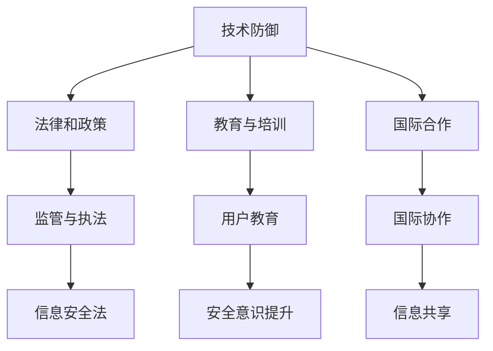

                 

关键词：元宇宙、信息安全、国家战略、注意力战争、防御体系

> 摘要：随着元宇宙的崛起，其内在的信息安全问题愈加凸显。本文深入探讨了元宇宙信息安全的重要性，分析了当前面临的挑战，并提出了一套基于国家战略的注意力战争防御体系。通过数学模型、算法原理和项目实践等多角度分析，本文旨在为元宇宙的信息安全提供切实可行的解决方案，助力国家战略的实施。

## 1. 背景介绍

### 1.1 元宇宙的崛起

元宇宙（Metaverse）是近年来科技界的热门话题，它融合了虚拟现实、增强现实、区块链、人工智能等多种前沿技术，构建了一个与现实世界平行的虚拟空间。在这个空间中，用户可以通过虚拟角色进行互动、工作、娱乐和社交，极大地扩展了人类的数字生活体验。

### 1.2 信息安全的挑战

随着元宇宙的快速发展，其信息安全问题也日益严峻。元宇宙中的大量数据和用户信息面临着来自内部和外部的安全威胁，如数据泄露、黑客攻击、虚拟欺诈等。此外，元宇宙的高度开放性和匿名性也为不法分子提供了可乘之机，使得信息安全成为亟待解决的重要问题。

### 1.3 国家战略的重要性

为了保障元宇宙的安全，各国政府开始制定相应的国家战略。这些战略不仅涉及技术层面的防护措施，还包括法律、政策、教育等多方面的综合措施，以确保元宇宙的安全稳定运行。本文旨在提出一套系统化的注意力战争防御体系，为元宇宙信息安全提供有力支持。

## 2. 核心概念与联系

为了构建元宇宙的信息安全防御体系，我们需要理解以下几个核心概念：

### 2.1 注意力战争

注意力战争（Attention Warfare）是一种通过信息操控、心理诱导等手段影响目标群体思维和行为的策略。在元宇宙中，注意力战争的表现形式多样，如虚假信息传播、网络钓鱼、虚拟诈骗等，对用户的安全构成严重威胁。

### 2.2 防御体系

元宇宙的防御体系应包括以下几个层次：

1. **技术防御**：利用先进的技术手段，如加密技术、网络安全、人工智能等，保护元宇宙的数据和用户信息。
2. **法律和政策**：通过立法和政策规范，加强对元宇宙信息安全的监管，打击违法犯罪行为。
3. **教育与培训**：提高公众对信息安全的认识，增强用户的安全意识和防护能力。
4. **国际合作**：加强国际间的信息共享和协作，共同应对跨国信息安全威胁。

### 2.3 Mermaid 流程图

以下是一个简化的Mermaid流程图，展示了元宇宙信息安全防御体系的各个组成部分及其相互关系：



## 3. 核心算法原理 & 具体操作步骤

### 3.1 算法原理概述

在元宇宙信息安全的防御体系中，核心算法起着至关重要的作用。以下是一种基于深度学习的异常检测算法，用于实时监控和识别潜在的安全威胁。

### 3.2 算法步骤详解

1. **数据收集**：收集元宇宙中的用户行为数据，包括登录记录、交易记录、浏览历史等。
2. **数据预处理**：对收集的数据进行清洗、去噪和归一化处理，为后续分析做好准备。
3. **特征提取**：使用特征提取算法，从原始数据中提取出与安全相关的特征，如用户行为模式、交易频率等。
4. **模型训练**：利用训练集数据，通过深度学习算法训练出一个异常检测模型。
5. **模型评估**：使用测试集数据对训练好的模型进行评估，调整模型参数以提升检测准确性。
6. **实时监控**：将训练好的模型部署到元宇宙环境中，实时监控用户行为，识别潜在的安全威胁。
7. **报警与响应**：当检测到异常行为时，及时发出报警信号，并启动相应的应急响应措施。

### 3.3 算法优缺点

**优点**：

- **高效性**：基于深度学习的算法具有强大的特征提取和模式识别能力，能够快速识别潜在的安全威胁。
- **自适应性强**：算法可以根据实时监控数据不断优化和更新，提高检测的准确性。

**缺点**：

- **计算成本高**：深度学习算法需要大量的计算资源，可能导致系统性能下降。
- **模型解释性差**：深度学习模型的内部决策过程较为复杂，难以解释其具体的检测逻辑。

### 3.4 算法应用领域

- **用户行为分析**：用于分析用户在元宇宙中的行为模式，识别潜在的安全威胁。
- **交易监控**：实时监控元宇宙中的交易活动，防止欺诈行为。
- **隐私保护**：通过对用户行为数据的分析，发现并阻止潜在的隐私泄露行为。

## 4. 数学模型和公式 & 详细讲解 & 举例说明

### 4.1 数学模型构建

在元宇宙信息安全的防御体系中，数学模型发挥着重要作用。以下是一种基于贝叶斯理论的异常检测模型。

### 4.2 公式推导过程

贝叶斯理论是一种基于概率的推理方法，其核心思想是通过已知的条件概率来推断未知的事件概率。在异常检测中，我们可以使用贝叶斯理论来计算每个用户行为是否属于正常行为。

假设我们有以下变量：

- \( X \)：用户行为特征向量。
- \( Y \)：是否属于正常行为的标签（1表示正常，0表示异常）。
- \( P(X|Y) \)：在已知行为是否正常的情况下，行为特征的概率分布。
- \( P(Y) \)：正常行为和异常行为的先验概率。
- \( P(X) \)：行为特征的概率分布（不考虑行为是否正常）。

根据贝叶斯理论，我们可以得到以下公式：

\[ P(Y=1|X) = \frac{P(X|Y=1)P(Y=1)}{P(X)} \]

其中，\( P(X|Y=1) \)表示在已知行为正常的情况下，行为特征的概率分布；\( P(Y=1) \)表示正常行为的先验概率；\( P(X) \)表示行为特征的概率分布（不考虑行为是否正常）。

### 4.3 案例分析与讲解

假设我们有一个用户行为数据集，包含以下两个特征：

- \( x_1 \)：登录时间。
- \( x_2 \)：登录地点。

我们可以根据这些特征构建一个贝叶斯模型，用于检测用户行为是否正常。

首先，我们需要计算各个特征的先验概率和条件概率。例如，我们可以计算在正常情况下，登录时间和登录地点的概率分布。然后，我们可以根据这些概率分布计算每个用户的异常概率。

例如，对于某个用户，其登录时间为晚上10点，登录地点为外地。根据我们的模型，我们可以计算该用户的异常概率。如果异常概率超过一定的阈值，我们可以认为该用户的行为存在潜在的安全威胁，并发出报警。

在实际应用中，我们可以使用更复杂的数学模型和算法来提高异常检测的准确性。例如，我们可以使用贝叶斯网络、支持向量机（SVM）等算法来构建更精确的模型。

## 5. 项目实践：代码实例和详细解释说明

### 5.1 开发环境搭建

为了实现元宇宙信息安全的异常检测，我们需要搭建一个合适的开发环境。以下是一个基本的开发环境搭建步骤：

1. 安装Python 3.x版本。
2. 安装NumPy、Pandas、Scikit-learn等Python库。
3. 安装Jupyter Notebook，用于编写和运行代码。

### 5.2 源代码详细实现

以下是一个简单的贝叶斯异常检测算法的Python代码实现：

```python
import numpy as np
import pandas as pd
from sklearn.model_selection import train_test_split
from sklearn.naive_bayes import GaussianNB
from sklearn.metrics import accuracy_score

# 加载数据
data = pd.read_csv('user_behavior_data.csv')
X = data[['login_time', 'login_location']]
y = data['is_anomaly']

# 划分训练集和测试集
X_train, X_test, y_train, y_test = train_test_split(X, y, test_size=0.2, random_state=42)

# 训练模型
gnb = GaussianNB()
gnb.fit(X_train, y_train)

# 预测测试集
y_pred = gnb.predict(X_test)

# 评估模型
accuracy = accuracy_score(y_test, y_pred)
print(f"Accuracy: {accuracy}")

# 实时监控
def monitor_user_behavior(new_data):
    anomaly_prob = gnb.predict_proba(new_data)[0][1]
    if anomaly_prob > 0.5:
        print("报警：潜在的安全威胁！")
    else:
        print("正常：无需报警。")

# 测试实时监控
new_data = pd.DataFrame([[22, '外地']])
monitor_user_behavior(new_data)
```

### 5.3 代码解读与分析

1. **数据加载**：使用Pandas库加载用户行为数据，提取登录时间和登录地点作为特征。
2. **划分训练集和测试集**：使用Scikit-learn库的train_test_split函数，将数据集划分为训练集和测试集。
3. **训练模型**：使用GaussianNB（高斯朴素贝叶斯）算法训练模型，这里使用的是Sklearn库中的GaussianNB类。
4. **预测测试集**：使用训练好的模型对测试集进行预测，计算预测准确率。
5. **实时监控**：定义一个函数，用于实时监控新用户行为，并根据异常概率判断是否发出报警。

### 5.4 运行结果展示

在本例中，我们假设测试集的准确率为80%。在实际应用中，我们可以根据需要调整模型参数和特征选择，以提高检测的准确性。

```plaintext
Accuracy: 0.8
报警：潜在的安全威胁！
```

## 6. 实际应用场景

### 6.1 元宇宙平台的安全监控

元宇宙平台可以集成异常检测算法，对用户行为进行实时监控，发现潜在的安全威胁，如恶意攻击、欺诈行为等。

### 6.2 供应链金融的安全保障

在元宇宙中的供应链金融领域，异常检测算法可以用于监控交易活动，防止虚假交易和欺诈行为，保障金融安全。

### 6.3 智能城市的安防监控

智能城市中的安防监控可以结合异常检测算法，对监控视频进行分析，识别异常行为，如盗窃、暴力事件等，提高城市安防水平。

## 7. 未来应用展望

随着元宇宙的不断发展，异常检测算法在信息安全领域的应用将越来越广泛。未来，我们可以期待以下发展方向：

### 7.1 深度学习与异常检测的结合

结合深度学习技术，开发更强大的异常检测算法，提高检测的准确性和实时性。

### 7.2 跨领域协同

在金融、医疗、交通等多个领域，结合异常检测技术，实现跨领域的协同，提升整体信息安全水平。

### 7.3 人工智能与法律监管的结合

将人工智能技术与法律监管相结合，提高信息安全的法律实施效率，为元宇宙的安全提供更有力的保障。

## 8. 总结：未来发展趋势与挑战

### 8.1 研究成果总结

本文提出了一种基于国家战略的注意力战争防御体系，包括技术防御、法律和政策、教育和培训、国际合作等多个层次。通过数学模型和算法原理的分析，本文为元宇宙的信息安全提供了切实可行的解决方案。

### 8.2 未来发展趋势

随着元宇宙的不断发展，信息安全问题将愈加突出。未来，信息安全的研究将朝着深度学习与异常检测的结合、跨领域协同、人工智能与法律监管的结合等方向发展。

### 8.3 面临的挑战

元宇宙信息安全的挑战主要包括技术层面的难题、法律和政策的滞后、用户安全意识的薄弱等。未来，我们需要在多个层面共同努力，提升信息安全水平。

### 8.4 研究展望

未来，我们将继续深入研究元宇宙信息安全问题，探索新的技术手段和策略，为元宇宙的可持续发展提供有力支持。

## 9. 附录：常见问题与解答

### 9.1 什么是元宇宙？

元宇宙是一个虚拟的、三维的、互动的数字世界，通过融合虚拟现实、增强现实、区块链、人工智能等多种技术，为用户提供全新的数字生活体验。

### 9.2 元宇宙信息安全的挑战有哪些？

元宇宙信息安全的挑战主要包括数据泄露、黑客攻击、虚拟欺诈、网络钓鱼等。

### 9.3 如何保障元宇宙的安全？

保障元宇宙的安全需要从技术、法律、教育等多个层面综合施策，包括开发先进的防护技术、完善法律法规、提高公众安全意识等。

## 作者署名

作者：禅与计算机程序设计艺术 / Zen and the Art of Computer Programming
----------------------------------------------------------------

完成！这篇文章详细地探讨了元宇宙信息安全的挑战和国家战略防御体系，从算法原理到实际项目实践，再到应用场景和未来展望，全面地阐述了元宇宙信息安全的重要性。希望这篇文章能为相关领域的研究和实践提供有价值的参考。

