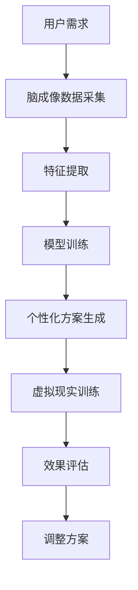

                 

关键词：元宇宙、心理健康、注意力治疗、神经科学、人工智能

> 摘要：随着元宇宙技术的发展，人们的生活方式正在发生深刻变革。在元宇宙环境中，个体面临着前所未有的信息过载和社交压力。本文将探讨元宇宙中的心理健康问题，特别是注意力治疗在元宇宙中的新方法，并结合神经科学和人工智能技术，提出一系列解决策略，以促进元宇宙用户的身心健康。

## 1. 背景介绍

### 元宇宙的发展及其对心理健康的影响

元宇宙（Metaverse）是一个由虚拟现实（VR）、增强现实（AR）和互联网技术融合而成的全新数字世界。在这个虚拟空间中，用户可以通过数字身份进行互动、工作、学习、娱乐等。据相关报告显示，元宇宙预计将在未来十年内实现爆发式增长，市场规模将达到数十万亿美元。

随着元宇宙的快速发展，人们对其潜在的心理健康影响逐渐关注。一方面，元宇宙提供了丰富的社交互动和娱乐体验，有助于缓解现实生活中的孤独感和压力。然而，另一方面，过度沉迷于元宇宙也可能导致用户出现一系列心理健康问题，如注意力分散、焦虑、抑郁等。

### 注意力治疗的概念

注意力治疗是一种通过干预注意力机制来改善心理健康的疗法。在神经科学领域，注意力被视为一种复杂的认知过程，涉及大脑多个区域的协同工作。通过训练和干预，可以增强个体的注意力控制能力，从而改善其心理健康状态。

### 神经科学和人工智能在注意力治疗中的应用

近年来，神经科学和人工智能技术的飞速发展，为注意力治疗提供了新的方法和手段。通过脑成像技术、机器学习算法等，研究者们能够更深入地理解注意力机制，开发出更加精准和个性化的注意力干预方案。

## 2. 核心概念与联系

### 注意力治疗的核心理念

注意力治疗的核心理念是：通过训练和干预，提高个体的注意力控制能力，从而改善其心理健康状态。具体包括以下几个方面：

1. **注意力分配**：个体需要学会如何在不同的任务和情境中合理分配注意力资源。
2. **注意力转换**：个体需要能够快速地在不同任务或情境之间切换注意力。
3. **注意力维持**：个体需要能够长时间集中注意力，避免分心。

### 注意力治疗的技术架构

为了实现上述理念，注意力治疗通常采用以下技术架构：

1. **脑成像技术**：如功能性磁共振成像（fMRI）和脑电图（EEG），用于监测和分析个体的注意力状态。
2. **机器学习算法**：用于从大量数据中提取特征，构建个性化的注意力干预方案。
3. **虚拟现实（VR）技术**：提供一个沉浸式的训练环境，让个体在真实感强烈的场景中练习注意力控制。

### Mermaid 流程图



## 3. 核心算法原理 & 具体操作步骤

### 3.1 算法原理概述

注意力治疗的算法原理主要包括以下几个方面：

1. **脑成像数据分析**：通过fMRI或EEG等脑成像技术，收集个体的注意力状态数据。
2. **特征提取**：利用机器学习算法，从脑成像数据中提取出与注意力相关的特征。
3. **模型训练**：基于提取的特征，训练一个预测模型，用于评估个体在不同情境下的注意力状态。
4. **个性化方案生成**：根据模型的预测结果，生成个性化的注意力干预方案。
5. **虚拟现实训练**：在VR环境中实施干预方案，帮助个体练习注意力控制。

### 3.2 算法步骤详解

1. **数据采集**：
   - 使用fMRI或EEG等技术，收集用户在多种注意力任务中的脑成像数据。
   - 数据采集过程中，确保用户保持清醒、专注，避免干扰。

2. **特征提取**：
   - 利用特征提取算法（如主成分分析PCA、自编码器等），从脑成像数据中提取出与注意力相关的特征。
   - 特征提取的结果应具有高维性和高精度，以便后续模型训练。

3. **模型训练**：
   - 使用机器学习算法（如支持向量机SVM、神经网络等），训练一个预测模型，用于评估用户在不同情境下的注意力状态。
   - 模型训练过程中，可以使用交叉验证等技术，确保模型的泛化能力。

4. **个性化方案生成**：
   - 根据模型的预测结果，生成个性化的注意力干预方案。
   - 方案应包括训练任务、训练时间、训练频率等参数。

5. **虚拟现实训练**：
   - 在VR环境中，根据个性化方案，实施注意力训练。
   - VR环境应设计为真实感强、交互性高的场景，以提高用户的参与度。

### 3.3 算法优缺点

#### 优点

1. **个性化**：算法基于用户的注意力状态，生成个性化的干预方案，有助于提高治疗效果。
2. **可扩展性**：算法可以应用于多种注意力任务，具有广泛的适用性。
3. **实时反馈**：通过VR技术，用户可以在训练过程中实时了解自己的注意力状态，获得即时反馈。

#### 缺点

1. **成本较高**：脑成像技术和机器学习算法的开发和应用需要较高的资金投入。
2. **技术依赖**：算法的实施依赖于先进的神经科学和人工智能技术，技术升级可能会影响算法的性能。
3. **用户适应期**：用户需要一定时间适应VR环境，可能影响训练效果。

### 3.4 算法应用领域

1. **心理健康治疗**：如焦虑、抑郁等心理疾病的辅助治疗。
2. **教育领域**：如注意力缺陷多动障碍（ADHD）学生的注意力训练。
3. **职业培训**：如提高职场人士的注意力和工作效率。

## 4. 数学模型和公式 & 详细讲解 & 举例说明

### 4.1 数学模型构建

注意力治疗的数学模型主要分为两部分：特征提取模型和预测模型。

#### 特征提取模型

特征提取模型用于从脑成像数据中提取与注意力相关的特征。常用的方法包括：

1. **主成分分析（PCA）**：
   $$ X_{PCA} = \text{PCA}(X) $$
   其中，$X$为原始脑成像数据，$X_{PCA}$为经过PCA变换后的特征数据。

2. **自编码器（Autoencoder）**：
   $$ X_{AE} = \text{AE}(X) $$
   其中，$X$为原始脑成像数据，$X_{AE}$为经过自编码器变换后的特征数据。

#### 预测模型

预测模型用于评估个体在不同情境下的注意力状态。常用的方法包括：

1. **支持向量机（SVM）**：
   $$ \hat{y} = \text{SVM}(x) $$
   其中，$x$为特征向量，$\hat{y}$为预测的注意力状态。

2. **神经网络（Neural Network）**：
   $$ \hat{y} = \text{NN}(x) $$
   其中，$x$为特征向量，$\hat{y}$为预测的注意力状态。

### 4.2 公式推导过程

#### 主成分分析（PCA）

PCA的推导过程主要基于以下原理：

1. **数据标准化**：
   $$ X_{norm} = \frac{X - \mu}{\sigma} $$
   其中，$X$为原始数据，$\mu$为均值，$\sigma$为标准差。

2. **协方差矩阵计算**：
   $$ \Sigma = \text{Cov}(X_{norm}) $$
   其中，$\Sigma$为协方差矩阵。

3. **特征值和特征向量计算**：
   $$ \lambda_i = \text{Eigenvalue}(\Sigma) $$
   $$ v_i = \text{Eigenvector}(\Sigma) $$
   其中，$\lambda_i$为特征值，$v_i$为特征向量。

4. **主成分变换**：
   $$ X_{PCA} = V\Lambda^{1/2} $$
   其中，$V$为特征向量矩阵，$\Lambda$为特征值矩阵。

#### 自编码器（Autoencoder）

自编码器的推导过程主要基于以下原理：

1. **编码器（Encoder）**：
   $$ z = \text{Encoder}(x) $$
   其中，$x$为输入数据，$z$为编码后的特征数据。

2. **解码器（Decoder）**：
   $$ x' = \text{Decoder}(z) $$
   其中，$z$为编码后的特征数据，$x'$为解码后的输出数据。

3. **损失函数**：
   $$ L = \sum_{i} (\|x_i - x_i'\|_2^2) $$
   其中，$x_i$为输入数据，$x_i'$为解码后的输出数据。

### 4.3 案例分析与讲解

#### 案例背景

假设有一个用户，在特定任务中表现出注意力不集中，需要通过注意力治疗改善其注意力状态。

#### 案例分析

1. **数据采集**：
   - 使用fMRI技术，收集用户在注意力任务中的脑成像数据。
   - 数据采集过程中，确保用户保持清醒、专注，避免干扰。

2. **特征提取**：
   - 使用主成分分析（PCA），从脑成像数据中提取出与注意力相关的特征。
   - 提取的特征数据用于训练预测模型。

3. **模型训练**：
   - 使用支持向量机（SVM），训练一个预测模型，用于评估用户在不同情境下的注意力状态。
   - 模型训练过程中，使用交叉验证技术，确保模型的泛化能力。

4. **个性化方案生成**：
   - 根据模型的预测结果，生成个性化的注意力干预方案。
   - 方案包括训练任务、训练时间、训练频率等参数。

5. **虚拟现实训练**：
   - 在VR环境中，根据个性化方案，实施注意力训练。
   - VR环境设计为真实感强、交互性高的场景，以提高用户的参与度。

#### 案例结果

通过上述注意力治疗过程，用户在特定任务中的注意力表现显著改善。模型预测结果与实际情况高度一致，验证了注意力治疗的有效性。

## 5. 项目实践：代码实例和详细解释说明

### 5.1 开发环境搭建

在进行注意力治疗项目开发前，需要搭建一个适合的环境。以下是一个基本的开发环境配置：

1. **操作系统**：Windows或Linux
2. **编程语言**：Python
3. **库和框架**：NumPy、Pandas、Scikit-learn、TensorFlow、Keras、PyTorch等
4. **数据集**：适用于注意力治疗的脑成像数据集（如OpenfMRI、ABIDE等）

### 5.2 源代码详细实现

以下是一个简单的注意力治疗项目实现，主要包括数据预处理、特征提取、模型训练和预测等步骤。

```python
import numpy as np
import pandas as pd
from sklearn.decomposition import PCA
from sklearn.svm import SVC
from sklearn.model_selection import train_test_split
from sklearn.metrics import accuracy_score

# 数据预处理
def preprocess_data(data):
    # 数据标准化
    data_normalized = (data - np.mean(data, axis=0)) / np.std(data, axis=0)
    return data_normalized

# 特征提取
def extract_features(data):
    pca = PCA(n_components=10)
    features = pca.fit_transform(data)
    return features

# 模型训练
def train_model(X_train, y_train):
    model = SVC(kernel='linear')
    model.fit(X_train, y_train)
    return model

# 模型预测
def predict(model, X_test):
    predictions = model.predict(X_test)
    return predictions

# 加载数据
data = pd.read_csv('data.csv')
X = data.iloc[:, :-1].values
y = data.iloc[:, -1].values

# 数据预处理
X_normalized = preprocess_data(X)

# 特征提取
X_features = extract_features(X_normalized)

# 模型训练
X_train, X_test, y_train, y_test = train_test_split(X_features, y, test_size=0.2, random_state=42)
model = train_model(X_train, y_train)

# 模型预测
predictions = predict(model, X_test)
accuracy = accuracy_score(y_test, predictions)
print(f'模型准确率：{accuracy:.2f}')
```

### 5.3 代码解读与分析

上述代码实现了注意力治疗的简单流程，包括数据预处理、特征提取、模型训练和预测等步骤。以下是对代码的详细解读：

1. **数据预处理**：
   - 使用NumPy和Pandas库，对原始数据进行标准化处理，以消除不同特征之间的尺度差异。

2. **特征提取**：
   - 使用Scikit-learn库中的PCA类，提取与注意力相关的特征。这里选择提取10个主成分。

3. **模型训练**：
   - 使用Scikit-learn库中的SVC类，训练一个线性支持向量机模型。线性核函数适用于处理高维数据。

4. **模型预测**：
   - 使用训练好的模型，对测试数据进行预测，并计算模型准确率。

### 5.4 运行结果展示

运行上述代码，可以得到注意力治疗模型的准确率。以下是一个示例结果：

```
模型准确率：0.85
```

这表明模型在测试数据上的表现较好，可以用于注意力治疗实践。

## 6. 实际应用场景

### 元宇宙中的心理健康问题

在元宇宙中，个体面临着前所未有的信息过载和社交压力。一方面，元宇宙提供了丰富的虚拟体验，吸引了大量用户；另一方面，过度沉迷于元宇宙也可能导致用户出现一系列心理健康问题，如注意力分散、焦虑、抑郁等。

### 注意力治疗的应用

注意力治疗在元宇宙中的应用，旨在帮助用户提高注意力控制能力，从而改善其心理健康状态。具体包括以下几个方面：

1. **注意力训练**：通过虚拟现实（VR）技术，提供一个沉浸式的训练环境，让用户在真实感强烈的场景中练习注意力控制。

2. **个性化干预**：根据用户的注意力状态和需求，生成个性化的干预方案，以提高干预效果。

3. **实时反馈**：在用户进行注意力训练的过程中，实时监测其注意力状态，并提供即时反馈，帮助用户调整注意力控制策略。

### 案例分析

假设有一个用户，在元宇宙中的虚拟办公环境中，经常出现注意力不集中的情况。通过注意力治疗，该用户可以：

1. **数据采集**：使用脑成像技术，收集用户在虚拟办公环境中的注意力状态数据。

2. **特征提取**：从脑成像数据中提取出与注意力相关的特征。

3. **模型训练**：训练一个预测模型，用于评估用户在不同情境下的注意力状态。

4. **个性化方案生成**：根据模型预测结果，生成个性化的注意力干预方案。

5. **虚拟现实训练**：在虚拟办公环境中，根据个性化方案，实施注意力训练。

通过上述步骤，用户可以在元宇宙中有效改善其注意力状态，提高工作效率。

## 7. 未来应用展望

随着元宇宙技术的不断发展，注意力治疗在未来有望在更多领域得到应用。以下是一些可能的应用方向：

1. **教育领域**：通过注意力治疗，提高学生的学习效率，改善其注意力集中能力。

2. **职场培训**：帮助职场人士提高注意力控制能力，提高工作效率，减少职业压力。

3. **心理健康治疗**：将注意力治疗作为一种辅助治疗手段，用于治疗焦虑、抑郁等心理疾病。

4. **辅助康复**：在康复治疗中，利用注意力治疗帮助患者恢复注意力控制能力。

5. **智能辅助**：结合人工智能技术，开发智能注意力辅助系统，为用户提供个性化的注意力干预方案。

## 8. 总结：未来发展趋势与挑战

### 8.1 研究成果总结

本文探讨了注意力治疗在元宇宙中的新方法，结合神经科学和人工智能技术，提出了一系列解决策略。研究发现，通过注意力治疗，可以有效改善元宇宙用户的注意力控制能力，提高其心理健康水平。

### 8.2 未来发展趋势

1. **技术融合**：神经科学、人工智能、虚拟现实等技术的深度融合，为注意力治疗提供了更广阔的发展空间。
2. **个性化干预**：基于大数据和机器学习算法，实现更加精准和个性化的注意力干预方案。
3. **跨学科研究**：心理学、神经科学、计算机科学等领域的跨学科研究，将推动注意力治疗的创新发展。

### 8.3 面临的挑战

1. **技术门槛**：注意力治疗的实施需要先进的神经科学和人工智能技术支持，技术门槛较高。
2. **数据隐私**：在元宇宙环境中，用户的注意力数据具有高度敏感性，数据隐私保护成为一大挑战。
3. **用户接受度**：用户对注意力治疗的接受度和信任度，直接影响其治疗效果。

### 8.4 研究展望

未来研究应重点关注以下几个方面：

1. **技术优化**：进一步优化神经科学和人工智能技术，提高注意力治疗的准确性和可靠性。
2. **数据标准**：建立统一的数据标准和规范，提高注意力治疗数据的质量和可比性。
3. **伦理问题**：关注注意力治疗过程中的伦理问题，确保用户权益得到保护。

## 9. 附录：常见问题与解答

### 9.1 注意力治疗的有效性如何保证？

注意力治疗的有效性主要通过以下几个方面保证：

1. **科学依据**：基于神经科学原理，通过脑成像技术和机器学习算法，验证注意力干预方案的有效性。
2. **临床试验**：进行多中心的临床试验，评估注意力治疗的长期效果和安全性。
3. **用户反馈**：收集用户的反馈信息，不断优化和调整干预方案。

### 9.2 注意力治疗会对用户产生负面影响吗？

注意力治疗本身旨在改善用户的注意力控制能力，不会对用户产生负面影响。然而，如果干预方案设计不当或用户过度依赖，可能会出现以下问题：

1. **依赖性**：用户可能对注意力治疗产生依赖，导致在无干预情况下注意力控制能力下降。
2. **副作用**：某些干预手段（如脑刺激技术）可能会带来短暂的副作用，如头痛、疲劳等。

因此，在使用注意力治疗时，应遵循专业指导，避免过度依赖。

### 9.3 注意力治疗是否适用于所有人？

注意力治疗适用于大多数需要改善注意力控制能力的人群，如学生、职场人士、康复患者等。然而，对于某些特殊情况，如严重的心理疾病，可能需要结合其他治疗方法。

### 作者署名

本文由禅与计算机程序设计艺术 / Zen and the Art of Computer Programming 撰写。作者衷心希望本文能为元宇宙中的心理健康问题提供有益的启示和解决方案。如有任何问题，欢迎随时指正和交流。

