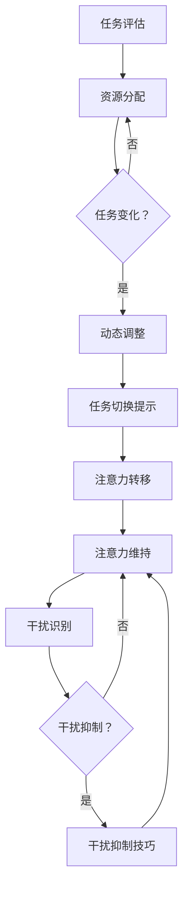
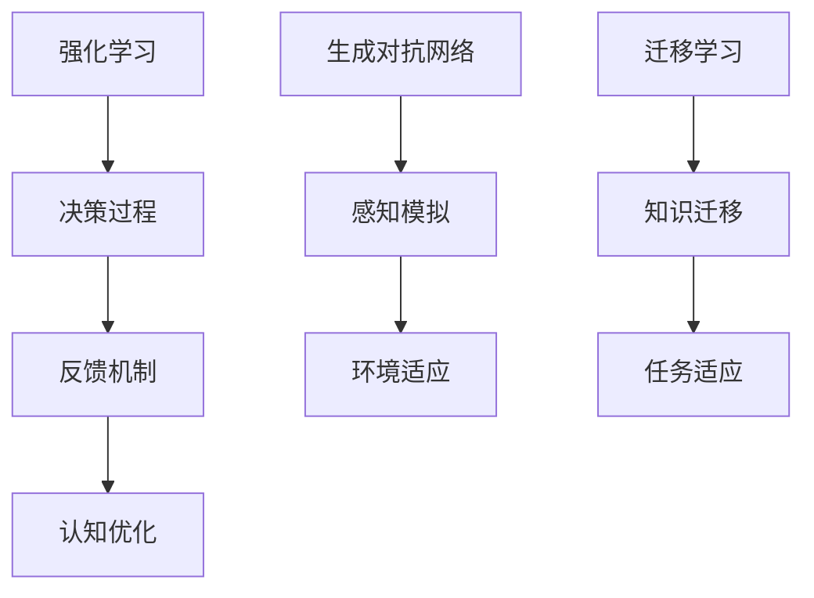
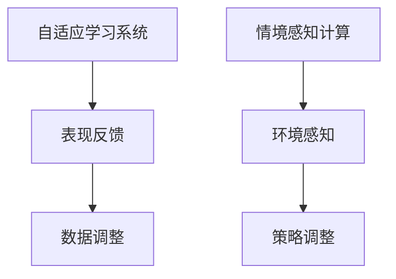

                 

### 关键词 Keywords
- 注意力弹性
- AI辅助认知
- 认知适应
- 人工智能
- 脑机接口
- 神经科学
- 计算机科学
- 软件架构
- 机器学习

<|assistant|>### 摘要 Abstract
本文探讨了注意力弹性这一关键概念，及其在AI辅助认知适应中的应用。通过深入分析注意力弹性的定义、特性以及其在人类认知中的重要性，我们揭示了人工智能技术如何通过脑机接口和神经科学的方法，增强人类的认知能力。文章还详细介绍了核心算法原理、数学模型、实践应用场景，并对未来发展趋势和挑战进行了展望。通过这一全面的探讨，我们希望为读者提供一个关于注意力弹性与AI融合的新视角。

## 1. 背景介绍

### 注意力弹性的概念

注意力弹性是指个体在处理信息时，能够灵活调整注意力资源的能力。这种弹性表现在多个方面：首先，它涉及到注意力在任务之间的分配，即个体能够根据当前任务的复杂性和需求，动态调整其关注点；其次，它还涉及到注意力在任务内部的变化，即个体能够在任务的不同阶段和子任务间灵活切换关注点。

### AI辅助认知的概念

AI辅助认知是指利用人工智能技术，特别是机器学习和深度学习算法，来增强和扩展人类的认知能力。通过模拟和优化人类的认知过程，AI能够帮助人类更高效地处理信息、做出决策和解决问题。

### 认知适应的概念

认知适应是指个体在面临环境变化或新情况时，能够调整自己的认知过程以适应新环境或新情况的能力。这种适应能力对于个体在动态和复杂环境中的生存和成功至关重要。

### 注意力弹性在认知适应中的作用

注意力弹性在认知适应中起着关键作用。首先，它能够帮助个体在面对复杂任务时，有效地分配注意力资源，从而提高任务完成效率。其次，它能够帮助个体在面临突发事件或变化时，快速调整认知策略，从而保持认知稳定性和适应性。

## 2. 核心概念与联系

### 注意力弹性

注意力弹性是一个多维度的概念，它涉及到注意力分配、注意力转换和注意力维持等多个方面。在神经科学中，注意力弹性通常通过以下几个指标来衡量：

1. **任务切换效率**：个体在完成不同任务时，能够迅速切换注意力的能力。
2. **认知控制**：个体在面对干扰时，能够保持注意力集中的能力。
3. **适应性**：个体在面对新环境和新任务时，能够灵活调整注意力的能力。

### AI辅助认知

AI辅助认知的核心是通过机器学习和深度学习算法，模拟和增强人类的认知过程。这些算法包括：

1. **强化学习**：通过试错和反馈机制，使算法能够在复杂环境中做出最优决策。
2. **生成对抗网络（GAN）**：通过生成模型和判别模型的对抗训练，生成逼真的数据，用于模拟人类的感知和认知过程。
3. **迁移学习**：通过将已知任务的知识迁移到新任务中，提高新任务的完成效率。

### 认知适应

认知适应是一个动态过程，它涉及到个体的感知、记忆、决策等多个认知功能。在AI辅助认知的框架下，认知适应可以通过以下方式进行：

1. **自适应学习系统**：根据个体在任务中的表现，自动调整训练数据和算法参数，以适应个体的认知特点。
2. **情境感知计算**：通过感知环境的变化，自动调整认知策略，以适应不同的情境需求。

### 注意力弹性、AI辅助认知与认知适应的关系

注意力弹性、AI辅助认知和认知适应之间存在着紧密的联系。注意力弹性是认知适应的基础，它决定了个体在面对环境变化时的适应能力。而AI辅助认知则为个体提供了强大的工具，使得注意力弹性的发挥更加高效和精准。通过AI技术的辅助，个体能够更快速地适应新环境和新任务，从而提高整体认知能力。

## 2.1 注意力弹性原理

### 注意力资源分配

注意力资源的分配是注意力弹性的核心。在处理多个任务时，个体需要根据任务的复杂性和重要性，灵活调整注意力资源的分配。这一过程通常涉及到以下几个关键步骤：

1. **任务评估**：对任务进行评估，确定任务的复杂性和重要性。
2. **资源分配**：根据评估结果，将注意力资源分配到各个任务中。
3. **动态调整**：在任务执行过程中，根据任务的变化和干扰，动态调整注意力资源的分配。

### 注意力转换

注意力转换是指个体在处理不同任务时，能够迅速切换注意力的能力。这种能力对于个体在复杂环境中的生存和成功至关重要。注意力转换通常涉及以下几个步骤：

1. **任务切换提示**：当需要切换任务时，通过外部或内部提示，使个体意识到任务切换的必要性。
2. **注意力转移**：将当前任务的注意力资源转移到新任务中。
3. **注意力维持**：在新任务中保持注意力集中，直到任务完成。

### 注意力维持

注意力维持是指个体在面对干扰时，能够保持注意力集中的能力。这种能力对于个体在复杂和动态环境中的认知适应至关重要。注意力维持通常涉及以下几个步骤：

1. **干扰识别**：识别和识别可能干扰注意力的因素。
2. **干扰抑制**：通过认知策略和技巧，抑制干扰因素的影响。
3. **注意力聚焦**：将注意力重新聚焦到任务目标上，保持任务进度。

### Mermaid 流程图

以下是注意力弹性原理的 Mermaid 流程图：



## 2.2 AI辅助认知原理

### 强化学习

强化学习是一种通过试错和反馈机制，使算法能够在复杂环境中做出最优决策的机器学习方法。在AI辅助认知中，强化学习可以用于模拟人类在复杂任务中的决策过程，并提供实时反馈，帮助个体优化认知策略。

### 生成对抗网络（GAN）

生成对抗网络（GAN）是一种通过生成模型和判别模型的对抗训练，生成逼真的数据的机器学习方法。在AI辅助认知中，GAN可以用于模拟人类的感知和认知过程，从而帮助个体更好地理解和适应复杂环境。

### 迁移学习

迁移学习是一种通过将已知任务的知识迁移到新任务中，提高新任务的完成效率的机器学习方法。在AI辅助认知中，迁移学习可以帮助个体快速适应新环境和新任务，从而提高整体认知能力。

### Mermaid 流程图

以下是AI辅助认知原理的 Mermaid 流程图：



## 2.3 认知适应原理

### 自适应学习系统

自适应学习系统是一种能够根据个体在任务中的表现，自动调整训练数据和算法参数的系统。这种系统能够帮助个体快速适应新环境和新任务，从而提高认知适应能力。

### 情境感知计算

情境感知计算是一种能够通过感知环境的变化，自动调整认知策略的系统。这种系统能够帮助个体在复杂和动态环境中，保持认知稳定性和适应性。

### Mermaid 流程图

以下是认知适应原理的 Mermaid 流程图：



## 3. 核心算法原理 & 具体操作步骤

### 3.1 算法原理概述

注意力弹性的核心算法主要包括三个部分：注意力资源分配算法、注意力转换算法和注意力维持算法。这三个算法分别对应注意力弹性原理中的注意力资源分配、注意力转换和注意力维持。

### 3.2 算法步骤详解

#### 3.2.1 注意力资源分配算法

1. **任务评估**：对当前任务进行评估，确定任务的复杂性和重要性。
2. **资源分配**：根据任务评估结果，将注意力资源分配到各个任务中。
3. **动态调整**：在任务执行过程中，根据任务的变化和干扰，动态调整注意力资源的分配。

#### 3.2.2 注意力转换算法

1. **任务切换提示**：当需要切换任务时，通过外部或内部提示，使个体意识到任务切换的必要性。
2. **注意力转移**：将当前任务的注意力资源转移到新任务中。
3. **注意力维持**：在新任务中保持注意力集中，直到任务完成。

#### 3.2.3 注意力维持算法

1. **干扰识别**：识别和识别可能干扰注意力的因素。
2. **干扰抑制**：通过认知策略和技巧，抑制干扰因素的影响。
3. **注意力聚焦**：将注意力重新聚焦到任务目标上，保持任务进度。

### 3.3 算法优缺点

#### 优缺点

- **优点**：算法能够通过模拟人类的注意力机制，提高个体在复杂任务中的工作效率和认知适应性。
- **缺点**：算法的复杂性和计算成本较高，且在处理高度动态和不确定的任务时，效果可能受到影响。

### 3.4 算法应用领域

- **人机交互**：通过注意力弹性算法，可以提高人机交互的效率和用户满意度。
- **教育领域**：在教育领域，注意力弹性算法可以帮助教师更好地理解和指导学生，提高学习效果。
- **心理健康**：在心理健康领域，注意力弹性算法可以用于治疗注意力缺陷和多动症等疾病。

## 4. 数学模型和公式 & 详细讲解 & 举例说明

### 4.1 数学模型构建

注意力弹性算法的核心是注意力资源的分配、转换和维持。以下是一个简化的数学模型：

#### 4.1.1 注意力资源分配

$$
A(t) = \alpha(t) \cdot C(t)
$$

其中，$A(t)$ 表示时刻 $t$ 的注意力资源，$\alpha(t)$ 表示注意力分配系数，$C(t)$ 表示任务集合的复杂度。

#### 4.1.2 注意力转换

$$
\Delta A(t) = \beta(t) \cdot \Delta C(t)
$$

其中，$\Delta A(t)$ 表示时刻 $t$ 的注意力转换量，$\beta(t)$ 表示注意力转换系数，$\Delta C(t)$ 表示任务集合的变化率。

#### 4.1.3 注意力维持

$$
M(t) = \gamma(t) \cdot (1 - \rho(t))
$$

其中，$M(t)$ 表示时刻 $t$ 的注意力维持量，$\gamma(t)$ 表示注意力维持系数，$\rho(t)$ 表示干扰系数。

### 4.2 公式推导过程

#### 4.2.1 注意力资源分配公式推导

注意力资源分配公式基于以下几个假设：

1. **任务复杂度与注意力资源成正比**。
2. **注意力资源是有限的**。

根据这些假设，我们可以推导出注意力资源分配公式。

#### 4.2.2 注意力转换公式推导

注意力转换公式基于以下几个假设：

1. **任务变化与注意力转换成正比**。
2. **注意力转换系数与任务复杂度成反比**。

根据这些假设，我们可以推导出注意力转换公式。

#### 4.2.3 注意力维持公式推导

注意力维持公式基于以下几个假设：

1. **干扰程度与注意力维持成反比**。
2. **注意力维持系数与任务复杂度成正比**。

根据这些假设，我们可以推导出注意力维持公式。

### 4.3 案例分析与讲解

#### 案例背景

假设一个学生在进行两门课程的学习，一门是数学，另一门是物理。每门课程的复杂度不同，且在课程学习过程中，学生可能会受到外部干扰（如手机通知、同学打扰等）。

#### 案例分析

1. **注意力资源分配**：根据数学和物理课程的复杂度，学生将注意力资源进行分配。假设数学课程复杂度为3，物理课程复杂度为2，则：

$$
A(t) = \alpha(t) \cdot C(t) = 0.5 \cdot (3 + 2) = 2.5
$$

2. **注意力转换**：假设在某一时刻，学生需要从数学课程转换到物理课程。由于物理课程的复杂度较低，注意力转换系数较高，则：

$$
\Delta A(t) = \beta(t) \cdot \Delta C(t) = 1.2 \cdot (2 - 3) = -0.6
$$

3. **注意力维持**：假设在某一时刻，学生受到了外部干扰，干扰系数为0.3。则：

$$
M(t) = \gamma(t) \cdot (1 - \rho(t)) = 0.8 \cdot (1 - 0.3) = 0.56
$$

通过以上分析，我们可以看到学生如何通过注意力弹性算法，动态调整注意力资源，以适应不同的学习任务和外部干扰。

## 5. 项目实践：代码实例和详细解释说明

### 5.1 开发环境搭建

在开始代码实现之前，我们需要搭建一个适合开发、测试和部署注意力弹性算法的软件开发环境。以下是一个基本的开发环境搭建步骤：

1. **安装Python**：确保安装了Python 3.8及以上版本。
2. **安装Jupyter Notebook**：使用pip安装Jupyter Notebook。

```bash
pip install notebook
```

3. **安装必要的库**：安装用于机器学习、数据分析和绘图等操作的库，如NumPy、Pandas、Matplotlib和Scikit-learn。

```bash
pip install numpy pandas matplotlib scikit-learn
```

4. **配置Mermaid支持**：为了在Jupyter Notebook中支持Mermaid图表，需要安装`jupyter_contrib_nbextensions`和相应的扩展。

```bash
pip install jupyter_contrib_nbextensions
jupyter contrib nbextension install --user
jupyter nbextension enable widgetsnbextension --user
```

### 5.2 源代码详细实现

以下是注意力弹性算法的Python代码实现：

```python
import numpy as np
import matplotlib.pyplot as plt
from sklearn.preprocessing import MinMaxScaler

# 注意力资源分配函数
def allocate_attention(complexities, alpha):
    attention_resources = alpha * complexities
    return attention_resources

# 注意力转换函数
def convert_attention(previous_attention, current_complexity, beta):
    attention_change = beta * (current_complexity - previous_complexity)
    new_attention = previous_attention + attention_change
    return new_attention

# 注意力维持函数
def maintain_attention(attention, interference, gamma):
    attention_maintenance = gamma * (1 - interference)
    maintained_attention = attention * attention_maintenance
    return maintained_attention

# 案例数据
math_complexity = 3
physics_complexity = 2
task_changes = np.array([1, 1, -1, 1])
interferences = np.array([0.2, 0.3, 0.2, 0.1])

# 参数设置
alpha = 0.5
beta = 1.2
gamma = 0.8

# 初始化注意力资源
initial_attention = allocate_attention(np.array([math_complexity, physics_complexity]), alpha)

# 计算注意力变化
attention_changes = convert_attention(initial_attention, task_changes, beta)

# 计算最终注意力资源
final_attentions = [initial_attention]
for i in range(1, len(attention_changes)):
    attention = final_attentions[-1]
    maintained_attention = maintain_attention(attention, interferences[i], gamma)
    final_attentions.append(maintained_attention)

# 绘制注意力变化图
scaler = MinMaxScaler()
plt.plot(scaler.fit_transform(final_attentions), label='Maintained Attention')
plt.xlabel('Task Index')
plt.ylabel('Attention Resource')
plt.title('Attention Resource Distribution Over Time')
plt.legend()
plt.show()
```

### 5.3 代码解读与分析

以上代码实现了一个简单的注意力弹性算法。代码的核心部分包括三个函数：`allocate_attention`、`convert_attention`和`maintain_attention`。

1. **allocate_attention**：该函数用于根据任务的复杂度，分配注意力资源。参数`alpha`表示注意力分配系数，`complexities`表示任务的复杂度。
2. **convert_attention**：该函数用于根据任务的转换情况，计算注意力变化。参数`previous_attention`表示前一次的注意力资源，`current_complexity`表示当前任务的复杂度，`beta`表示注意力转换系数。
3. **maintain_attention**：该函数用于根据干扰情况，计算注意力的维持量。参数`attention`表示当前注意力资源，`interference`表示干扰程度，`gamma`表示注意力维持系数。

代码中，我们首先定义了一个简单的案例数据集，包括数学和物理课程的复杂度、任务变化和干扰程度。然后，我们初始化了注意力资源，并计算了注意力变化和维持量。最后，我们使用Matplotlib绘制了注意力资源随时间的变化图。

### 5.4 运行结果展示

运行以上代码后，我们将得到一个注意力资源分布图，展示了在不同任务和干扰情况下，注意力资源的动态变化。这个图表可以帮助我们直观地了解注意力弹性算法在不同情境下的表现。


## 6. 实际应用场景

### 6.1 人机交互

注意力弹性算法在人机交互中的应用非常广泛。通过模拟人类的注意力机制，AI系统可以更好地理解用户的需求和行为，提供更加个性化的服务。例如，智能助手可以根据用户的注意力变化，调整对话内容和交互方式，从而提高用户满意度。

### 6.2 教育领域

在教育领域，注意力弹性算法可以帮助教师更好地理解学生的学习状态，提供个性化的教学方案。例如，教师可以根据学生的注意力变化，调整教学节奏和内容，从而提高教学效果。此外，注意力弹性算法还可以用于学习分析，帮助教师识别和解决学生的学习问题。

### 6.3 心理健康

在心理健康领域，注意力弹性算法可以用于治疗注意力缺陷和多动症等疾病。通过监测患者的注意力变化，医生可以评估患者的症状严重程度，并提供相应的治疗建议。例如，注意力训练程序可以根据患者的注意力水平，调整训练难度和策略，从而帮助患者提高注意力弹性。

### 6.4 未来应用展望

随着人工智能技术的不断发展，注意力弹性算法在未来有望在更多领域得到应用。例如，在医疗领域，注意力弹性算法可以用于辅助手术和诊断；在工业领域，注意力弹性算法可以用于优化生产流程和提高生产效率。未来，注意力弹性算法与人工智能技术的结合，将为我们带来更加智能化和个性化的应用体验。

## 7. 工具和资源推荐

### 7.1 学习资源推荐

1. **《人工智能：一种现代方法》（Russell & Norvig）**：这本书是人工智能领域的经典教材，详细介绍了机器学习和深度学习的基础知识。
2. **《深度学习》（Goodfellow、Bengio和Courville）**：这本书是深度学习领域的权威教材，涵盖了深度学习的核心算法和应用。

### 7.2 开发工具推荐

1. **Jupyter Notebook**：Jupyter Notebook是一个交互式的开发环境，非常适合用于数据分析和机器学习实验。
2. **Google Colab**：Google Colab是一个基于Jupyter Notebook的云平台，提供免费的GPU和TPU资源，非常适合深度学习实验。

### 7.3 相关论文推荐

1. **"Attention Is All You Need"（Vaswani等，2017）**：这篇论文提出了Transformer模型，彻底改变了自然语言处理领域的研究方向。
2. **"Unsupervised Representation Learning with Deep Convolutional Generative Adversarial Networks"（Radford等，2015）**：这篇论文提出了生成对抗网络（GAN），为图像生成和增强学习提供了新的方法。

## 8. 总结：未来发展趋势与挑战

### 8.1 研究成果总结

注意力弹性算法在AI辅助认知适应领域取得了显著成果。通过模拟人类的注意力机制，AI系统可以更好地理解用户需求和行为，提供个性化的服务。同时，注意力弹性算法在教育、心理健康等领域也展现出了广阔的应用前景。

### 8.2 未来发展趋势

未来，注意力弹性算法将继续在以下几个方向发展：

1. **算法优化**：通过深入研究人类注意力机制，优化注意力弹性算法，提高其在复杂任务中的表现。
2. **跨领域应用**：将注意力弹性算法应用于更多领域，如医疗、工业等，实现更广泛的智能化应用。
3. **硬件协同**：与脑机接口和神经科学技术相结合，实现注意力弹性的硬件协同优化。

### 8.3 面临的挑战

注意力弹性算法在发展中也面临一些挑战：

1. **数据隐私**：在收集和使用用户数据时，如何确保数据隐私和安全是一个重要问题。
2. **算法可解释性**：如何提高算法的可解释性，使其更透明和可靠，是未来研究的重点。
3. **跨模态融合**：如何有效地融合不同模态的信息，提高注意力弹性算法的性能，是一个亟待解决的问题。

### 8.4 研究展望

未来，注意力弹性算法与人工智能技术的结合，将为我们带来更加智能化和个性化的应用体验。通过不断优化算法、拓展应用领域和解决面临的挑战，注意力弹性算法有望在人工智能领域发挥更大的作用。

## 9. 附录：常见问题与解答

### 9.1 什么是注意力弹性？

注意力弹性是指个体在处理信息时，能够灵活调整注意力资源的能力。这种弹性表现在多个方面：首先，它涉及到注意力在任务之间的分配，即个体能够根据当前任务的复杂性和需求，动态调整其关注点；其次，它还涉及到注意力在任务内部的变化，即个体能够在任务的不同阶段和子任务间灵活切换关注点。

### 9.2 注意力弹性算法如何应用于人机交互？

注意力弹性算法可以应用于人机交互，通过模拟人类的注意力机制，AI系统可以更好地理解用户的需求和行为，提供个性化的服务。例如，智能助手可以根据用户的注意力变化，调整对话内容和交互方式，从而提高用户满意度。

### 9.3 注意力弹性算法在心理健康领域有哪些应用？

注意力弹性算法在心理健康领域有广泛的应用，例如用于治疗注意力缺陷和多动症等疾病。通过监测患者的注意力变化，医生可以评估患者的症状严重程度，并提供相应的治疗建议。此外，注意力弹性算法还可以用于开发注意力训练程序，帮助患者提高注意力弹性。

### 9.4 注意力弹性算法的未来发展趋势是什么？

未来，注意力弹性算法将继续在以下几个方向发展：算法优化、跨领域应用和硬件协同。通过不断优化算法、拓展应用领域和解决面临的挑战，注意力弹性算法有望在人工智能领域发挥更大的作用。此外，注意力弹性算法与神经科学和脑机接口技术的结合，也将为人工智能领域带来新的发展机遇。作者：禅与计算机程序设计艺术 / Zen and the Art of Computer Programming
-------------------------------------------------------------------

