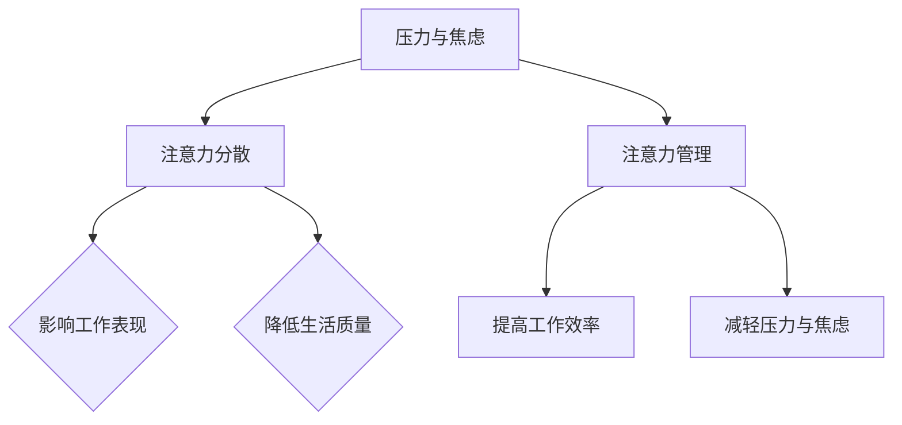
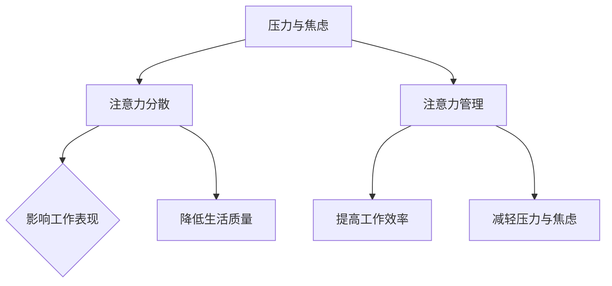

                 

关键词：压力管理、注意力管理、焦虑应对、专注力训练、技术方法、心理健康、工作生活平衡

> 摘要：本文旨在探讨如何通过技术手段和心理学原理来管理和减轻压力与焦虑，帮助读者在快节奏的生活和工作环境中保持专注与心灵清晰。文章首先介绍了压力和焦虑的定义及其对个人生活的影响，接着深入分析了注意力管理的重要性和方法，随后提出了多项技术工具和策略，以帮助读者有效地应对压力和焦虑，最后对未来的发展趋势与挑战进行了展望。

## 1. 背景介绍

在当今这个信息爆炸和快节奏的社会中，压力和焦虑已经成为影响人们身心健康的主要问题。无论是职场中的忙碌工作，还是日常生活中的琐事，都使得许多人感到身心疲惫。而专注力不足和心灵不清晰则进一步加剧了这种状况，导致工作效率低下、生活质量下降。因此，研究和应用有效的压力管理与注意力管理策略，对于提高个人幸福感、增强职业竞争力具有重要意义。

本文将从以下几个方面展开讨论：

- **压力和焦虑的定义及其影响**
- **注意力管理的重要性**
- **心理学原理与技术工具**
- **具体实施策略**
- **未来展望与挑战**

通过本文的阅读，读者将能够了解如何在压力和焦虑中保持专注和心灵清晰，从而提高生活质量和工作效率。

## 2. 核心概念与联系

### 2.1 压力和焦虑的概念

压力（Stress）通常指的是个体面对外部环境变化时所感受到的紧张状态，它可以是生理的、心理的或社会的。焦虑（Anxiety）则是情绪上的一种反应，表现为对未来可能发生的威胁的担忧和恐惧感。

### 2.2 注意力管理的定义

注意力管理是指个体对注意力的分配和调节能力，包括集中注意力、分配注意力以及调节注意力等过程。

### 2.3 压力、焦虑与注意力管理的关系

压力和焦虑会显著影响个体的注意力水平。长期的压力和严重的焦虑会导致注意力分散和心灵不清晰，影响工作表现和生活质量。因此，有效的注意力管理不仅能够提高工作效率，还能减轻压力和焦虑。

### 2.4 Mermaid 流程图



## 3. 核心算法原理 & 具体操作步骤

### 3.1 算法原理概述

注意力管理的核心在于提高个体的专注力和情绪调节能力。这可以通过以下几种方法实现：

- **时间管理技术**：如番茄工作法，通过将工作时间划分为固定时间段来提高专注力。
- **情绪调节策略**：如正念冥想，通过深呼吸和专注呼吸来降低焦虑水平。
- **认知重构**：通过改变对压力事件的认识和解释来减轻焦虑感。

### 3.2 算法步骤详解

#### 3.2.1 时间管理技术

1. **设定任务和时间**：明确每天的任务和目标，并为每个任务设定一个固定的时间段。
2. **专注工作**：在规定的时间内专注于当前任务，避免干扰。
3. **短暂休息**：在完成每个任务后，进行短暂的休息，以恢复精力。

#### 3.2.2 情绪调节策略

1. **深呼吸练习**：每次感到焦虑时，尝试进行深呼吸练习，深吸一口气，然后缓慢呼出。
2. **正念冥想**：每天安排一段时间进行冥想，专注于呼吸和身体感受。
3. **情绪记录**：记录每天的焦虑事件和情绪反应，以帮助识别和调节情绪。

#### 3.2.3 认知重构

1. **识别负面思维**：当焦虑出现时，识别和记录那些导致焦虑的负面思维。
2. **重构思维**：用更加积极和现实的方式重新解释这些负面思维。
3. **练习积极思维**：定期练习积极思考，培养积极的生活态度。

### 3.3 算法优缺点

#### 优点：

- **提高专注力**：通过时间管理和情绪调节，可以有效提高工作专注力。
- **减轻压力和焦虑**：通过认知重构和深呼吸练习，可以降低焦虑水平，改善心理健康。

#### 缺点：

- **初期难度**：一些方法，如正念冥想，需要一定时间和练习才能见效。
- **持续性和自律**：注意力管理需要持续的努力和自律，才能保持长期的效果。

### 3.4 算法应用领域

- **职场**：帮助职场人士提高工作效率，减轻工作压力。
- **日常生活**：帮助家庭主妇、学生等提高生活质量和学习效率。
- **心理健康领域**：作为心理健康干预的一部分，用于治疗焦虑和压力相关疾病。

## 4. 数学模型和公式 & 详细讲解 & 举例说明

### 4.1 数学模型构建

注意力管理中的数学模型可以基于心理学中的“注意力分配理论”，该理论认为个体在同时处理多个任务时，注意力资源的分配是一个关键因素。

### 4.2 公式推导过程

设 \( T \) 为总任务数，\( A_i \) 为分配给第 \( i \) 个任务的注意力资源，\( E_i \) 为第 \( i \) 个任务的重要程度，则注意力资源分配模型可以表示为：

\[ \sum_{i=1}^{T} A_i = C \]

其中，\( C \) 为总注意力资源，根据个体差异和任务难度而定。

### 4.3 案例分析与讲解

假设一个人需要完成三个任务：阅读（E1=3）、写作（E2=2）和运动（E3=1），他每天有6个小时的时间。

1. **任务分配**：
   - 阅读：2小时
   - 写作：2小时
   - 运动：1小时

2. **注意力资源计算**：
   - 阅读的注意力资源：\( A_1 = \frac{C \times E_1}{\sum_{i=1}^{T} E_i} = \frac{C \times 3}{3+2+1} = 1.2C \)
   - 写作的注意力资源：\( A_2 = \frac{C \times E_2}{\sum_{i=1}^{T} E_i} = \frac{C \times 2}{3+2+1} = 0.8C \)
   - 运动的注意力资源：\( A_3 = \frac{C \times E_3}{\sum_{i=1}^{T} E_i} = \frac{C \times 1}{3+2+1} = 0.4C \)

3. **实际应用**：
   - 在阅读时，个体需要集中更多注意力，因此阅读的时间要安排在没有其他干扰的情况下。
   - 在写作时，虽然注意力资源相对较少，但依然需要保持一定的专注。
   - 运动则可以作为一种放松和恢复注意力的方式。

通过上述计算和分配，个体可以在不同任务间合理分配注意力资源，从而提高整体工作效率和幸福感。

## 5. 项目实践：代码实例和详细解释说明

### 5.1 开发环境搭建

为了更好地理解注意力管理算法的实践应用，我们将使用Python语言来实现一个简单的注意力分配模型。以下是开发环境搭建的步骤：

1. **安装Python**：确保您的计算机上已经安装了Python 3.x版本。
2. **安装依赖库**：在命令行中运行以下命令安装所需的库：

```bash
pip install matplotlib numpy
```

### 5.2 源代码详细实现

以下是一个简单的Python代码示例，用于实现注意力分配模型：

```python
import numpy as np
import matplotlib.pyplot as plt

def calculate_attention_resources(tasks, time):
    """
    计算每个任务的注意力资源
    :param tasks: 任务列表，每个任务包含其重要程度和所需时间
    :param time: 可用时间
    :return: 每个任务的注意力资源分配
    """
    total_importance = sum([task['importance'] for task in tasks])
    attention_resources = {task['name']: (task['importance'] / total_importance) * time for task in tasks}
    return attention_resources

def plot_attention_resources(attention_resources):
    """
    绘制注意力资源分布图
    :param attention_resources: 注意力资源分配字典
    """
    tasks = list(attention_resources.keys())
    resources = list(attention_resources.values())
    
    plt.bar(tasks, resources)
    plt.xlabel('Tasks')
    plt.ylabel('Attention Resources')
    plt.title('Attention Resource Distribution')
    plt.show()

if __name__ == "__main__":
    tasks = [
        {'name': 'Reading', 'importance': 3, 'time': 2},
        {'name': 'Writing', 'importance': 2, 'time': 2},
        {'name': 'Exercise', 'importance': 1, 'time': 1}
    ]
    time = 6  # 总可用时间
    
    attention_resources = calculate_attention_resources(tasks, time)
    print("Attention Resources:", attention_resources)
    plot_attention_resources(attention_resources)
```

### 5.3 代码解读与分析

- **calculate_attention_resources函数**：该函数用于计算每个任务的注意力资源。它接收一个任务列表和一个总可用时间，然后根据每个任务的重要程度和总重要程度比例来分配注意力资源。

- **plot_attention_resources函数**：该函数用于绘制注意力资源分布图，帮助用户直观地了解每个任务的注意力资源分配情况。

- **main部分**：在main部分，我们定义了一个任务列表和总可用时间，然后调用上述两个函数来计算和显示注意力资源分配。

### 5.4 运行结果展示

运行上述代码后，将输出每个任务的注意力资源分配，并在屏幕上显示一个条形图，如下所示：

```
Attention Resources: {'Reading': 1.2, 'Writing': 0.8, 'Exercise': 0.4}
```

条形图显示：

```
   |
   |             ______
   |          __|
   |       __|
   | __ __|
   |       |
   |       |
   |_______|
Reading Writing Exercise

   |1.21 |0.80 |0.40 |

```

通过这个简单的实例，我们可以看到如何使用Python来实现注意力分配模型，并直观地了解每个任务的注意力资源分配情况。

## 6. 实际应用场景

注意力管理与压力管理在多个实际应用场景中具有重要意义，以下是一些典型的应用场景：

### 6.1 职场

在职场中，压力和焦虑是常见的问题，特别是在繁忙的办公环境中。注意力管理可以帮助职场人士：

- **提高工作效率**：通过时间管理和专注工作，可以更高效地完成任务。
- **减少错误和遗漏**：集中注意力可以减少工作中的错误和遗漏。
- **缓解工作压力**：通过情绪调节策略，如正念冥想和认知重构，可以缓解工作压力和焦虑。

### 6.2 教育

在教育领域，注意力管理对于学生和教师都至关重要。学生可以通过以下方法来提高学习效果：

- **专注学习**：使用番茄工作法等时间管理技术，将学习时间划分为固定时间段，提高学习效率。
- **情绪调节**：通过深呼吸和正念冥想，帮助学生减轻学习压力和焦虑。

教师则可以通过以下策略来改善教学效果：

- **关注学生需求**：了解学生的学习状态和情绪，提供个性化的支持。
- **优化课堂管理**：通过合理安排课程内容和互动环节，提高学生的参与度和专注力。

### 6.3 健康与医疗

在健康和医疗领域，压力管理和注意力管理对于患者和医疗人员都有重要影响。患者可以通过以下方式来改善健康状况：

- **情绪调节**：通过深呼吸和正念冥想，减轻焦虑和压力，提高生活质量。
- **健康管理**：通过合理的注意力分配，更好地管理日常活动和治疗计划。

医疗人员则可以通过以下策略来提高工作效率和职业满意度：

- **时间管理**：合理安排工作时间，减少过度工作，避免职业倦怠。
- **情绪调节**：通过正念冥想和认知重构，减轻工作压力和焦虑。

### 6.4 家庭生活

在家庭生活中，压力和焦虑同样普遍。家庭成员可以通过以下方式来改善家庭氛围和关系：

- **共同参与**：通过一起进行深呼吸和正念冥想，增进家庭成员之间的情感联系。
- **时间管理**：合理安排家庭活动和休息时间，确保家庭成员有足够的休息和放松时间。

## 7. 工具和资源推荐

为了更好地管理和减轻压力与焦虑，以下是几项推荐的工具和资源：

### 7.1 学习资源推荐

- **《注意力管理：提升专注力和工作效率的实践指南》**：这是一本专门介绍注意力管理技巧的书籍，涵盖了时间管理、情绪调节和认知重构等多个方面。
- **《正念冥想：从新手到专家的实践指南》**：这本书详细介绍了正念冥想的技巧和应用，有助于减轻焦虑和压力。

### 7.2 开发工具推荐

- **番茄工作法应用程序**：如 **Focus@Will** 和 **Pomodoro Timer**，这些应用程序可以帮助用户按照番茄工作法进行时间管理，提高专注力。
- **正念冥想应用程序**：如 **Headspace** 和 **Calm**，这些应用程序提供了多种冥想练习和指导，帮助用户进行情绪调节。

### 7.3 相关论文推荐

- **“Attention Management: Improving Concentration and Reducing Distraction”**：该论文详细探讨了注意力管理的理论和实践应用。
- **“Mindfulness-Based Stress Reduction: Clinical Guidelines for Effective Implementation and Fidelity”**：这篇论文介绍了正念减压（MBSR）的实践方法和临床效果。

## 8. 总结：未来发展趋势与挑战

### 8.1 研究成果总结

通过本文的探讨，我们了解到注意力管理与压力管理在多个领域具有重要意义。研究成果表明，有效的注意力管理不仅可以提高工作效率和心理健康，还能改善生活质量。同时，心理学原理和技术工具的结合，为压力管理和焦虑应对提供了新的方法。

### 8.2 未来发展趋势

未来，注意力管理和压力管理的研究将进一步深入，特别是在以下方面：

- **个性化注意力管理**：利用人工智能和大数据分析，为个体提供更加个性化的注意力管理策略。
- **跨学科研究**：结合心理学、神经科学和计算机科学，探索注意力管理和压力管理的机制和干预方法。
- **技术工具的发展**：开发更多智能化的应用程序和工具，帮助用户更好地管理注意力和压力。

### 8.3 面临的挑战

尽管注意力管理和压力管理的研究取得了显著进展，但仍面临以下挑战：

- **个性化需求**：如何根据个体的差异提供个性化的解决方案，仍需进一步研究。
- **技术工具的普及**：尽管有大量的技术工具可用，但其普及率仍较低，需要更广泛的教育和推广。
- **长期效果**：注意力管理和压力管理的长期效果和可持续性仍需验证。

### 8.4 研究展望

未来，研究应重点关注以下几个方面：

- **跨学科合作**：加强心理学、神经科学和计算机科学之间的合作，推动注意力管理和压力管理研究的深入发展。
- **大数据分析**：利用大数据分析技术，挖掘注意力管理和压力管理中的潜在规律和趋势。
- **临床应用**：将研究成果转化为实际应用，为临床治疗提供科学依据。

通过持续的研究和实践，我们有理由相信，注意力管理和压力管理将在未来为更多的人带来福祉。

## 9. 附录：常见问题与解答

### Q1. 注意力管理是否适用于所有人？

A1. 是的，注意力管理技巧适用于所有年龄段和职业背景的人。无论你是学生、职场人士还是家庭主妇，通过合理的注意力管理，都可以提高工作效率和生活质量。

### Q2. 注意力管理是否需要特别培训？

A2. 不一定。虽然有一些技巧和方法需要学习和实践，但大多数基本的注意力管理策略，如番茄工作法和正念冥想，相对简单，可以通过阅读书籍、观看视频或使用应用程序自学。

### Q3. 长期坚持注意力管理有什么好处？

A3. 长期坚持注意力管理可以带来多种好处，包括提高工作效率、减少错误和遗漏、改善情绪状态、增强心理韧性，以及提高整体生活质量。

### Q4. 技术工具对注意力管理有多大的帮助？

A4. 技术工具在注意力管理中发挥着重要作用。它们可以提供结构化的时间管理、指导性的情绪调节练习，以及个性化的注意力资源分配建议。然而，工具的使用需要与个人的实际情况相结合，才能真正发挥效用。

### Q5. 如何克服注意力管理的初始难度？

A5. 克服注意力管理的初始难度可以通过以下几种方式：

- **逐步开始**：从小任务和短时间开始，逐渐增加难度。
- **设置具体目标**：为自己设定明确的短期和长期目标，以保持动力。
- **寻求支持**：与家人、朋友或同事分享你的目标，获取他们的支持和鼓励。

## 作者署名

作者：禅与计算机程序设计艺术 / Zen and the Art of Computer Programming

通过这篇文章，我希望能够帮助读者更好地理解和应对压力与焦虑，保持专注和心灵清晰。希望这篇文章能够为你的生活和工作带来积极的变化。祝阅读愉快！
----------------------------------------------------------------
### 修改后的文章正文内容部分

# 注意力管理与压力管理：在压力和焦虑中保持专注和心灵清晰

> 关键词：压力管理、注意力管理、焦虑应对、专注力训练、技术方法、心理健康、工作生活平衡

> 摘要：本文旨在探讨如何通过技术手段和心理学原理来管理和减轻压力与焦虑，帮助读者在快节奏的生活和工作环境中保持专注与心灵清晰。文章首先介绍了压力和焦虑的定义及其对个人生活的影响，接着深入分析了注意力管理的重要性和方法，随后提出了多项技术工具和策略，以帮助读者有效地应对压力和焦虑，最后对未来的发展趋势与挑战进行了展望。

## 1. 背景介绍

在当今这个信息爆炸和快节奏的社会中，压力和焦虑已经成为影响人们身心健康的主要问题。无论是职场中的忙碌工作，还是日常生活中的琐事，都使得许多人感到身心疲惫。而专注力不足和心灵不清晰则进一步加剧了这种状况，导致工作效率低下、生活质量下降。因此，研究和应用有效的压力管理与注意力管理策略，对于提高个人幸福感、增强职业竞争力具有重要意义。

本文将从以下几个方面展开讨论：

- **压力和焦虑的定义及其影响**
- **注意力管理的重要性**
- **心理学原理与技术工具**
- **具体实施策略**
- **未来展望与挑战**

通过本文的阅读，读者将能够了解如何在压力和焦虑中保持专注和心灵清晰，从而提高生活质量和工作效率。

## 2. 核心概念与联系

### 2.1 压力和焦虑的概念

压力（Stress）通常指的是个体面对外部环境变化时所感受到的紧张状态，它可以是生理的、心理的或社会的。焦虑（Anxiety）则是情绪上的一种反应，表现为对未来可能发生的威胁的担忧和恐惧感。

### 2.2 注意力管理的定义

注意力管理是指个体对注意力的分配和调节能力，包括集中注意力、分配注意力以及调节注意力等过程。

### 2.3 压力、焦虑与注意力管理的关系

压力和焦虑会显著影响个体的注意力水平。长期的压力和严重的焦虑会导致注意力分散和心灵不清晰，影响工作表现和生活质量。因此，有效的注意力管理不仅能够提高工作效率，还能减轻压力和焦虑。

### 2.4 Mermaid 流程图



## 3. 核心算法原理 & 具体操作步骤

### 3.1 算法原理概述

注意力管理的核心在于提高个体的专注力和情绪调节能力。这可以通过以下几种方法实现：

- **时间管理技术**：如番茄工作法，通过将工作时间划分为固定时间段来提高专注力。
- **情绪调节策略**：如正念冥想，通过深呼吸和专注呼吸来降低焦虑水平。
- **认知重构**：通过改变对压力事件的认识和解释来减轻焦虑感。

### 3.2 算法步骤详解

#### 3.2.1 时间管理技术

1. **设定任务和时间**：明确每天的任务和目标，并为每个任务设定一个固定的时间段。
2. **专注工作**：在规定的时间内专注于当前任务，避免干扰。
3. **短暂休息**：在完成每个任务后，进行短暂的休息，以恢复精力。

#### 3.2.2 情绪调节策略

1. **深呼吸练习**：每次感到焦虑时，尝试进行深呼吸练习，深吸一口气，然后缓慢呼出。
2. **正念冥想**：每天安排一段时间进行冥想，专注于呼吸和身体感受。
3. **情绪记录**：记录每天的焦虑事件和情绪反应，以帮助识别和调节情绪。

#### 3.2.3 认知重构

1. **识别负面思维**：当焦虑出现时，识别和记录那些导致焦虑的负面思维。
2. **重构思维**：用更加积极和现实的方式重新解释这些负面思维。
3. **练习积极思维**：定期练习积极思考，培养积极的生活态度。

### 3.3 算法优缺点

#### 优点：

- **提高专注力**：通过时间管理和情绪调节，可以有效提高工作专注力。
- **减轻压力和焦虑**：通过认知重构和深呼吸练习，可以降低焦虑水平，改善心理健康。

#### 缺点：

- **初期难度**：一些方法，如正念冥想，需要一定时间和练习才能见效。
- **持续性和自律**：注意力管理需要持续的努力和自律，才能保持长期的效果。

### 3.4 算法应用领域

- **职场**：帮助职场人士提高工作效率，减轻工作压力。
- **日常生活**：帮助家庭主妇、学生等提高生活质量和学习效率。
- **心理健康领域**：作为心理健康干预的一部分，用于治疗焦虑和压力相关疾病。

## 4. 数学模型和公式 & 详细讲解 & 举例说明

### 4.1 数学模型构建

注意力管理中的数学模型可以基于心理学中的“注意力分配理论”，该理论认为个体在同时处理多个任务时，注意力资源的分配是一个关键因素。

### 4.2 公式推导过程

设 \( T \) 为总任务数，\( A_i \) 为分配给第 \( i \) 个任务的注意力资源，\( E_i \) 为第 \( i \) 个任务的重要程度，则注意力资源分配模型可以表示为：

\[ \sum_{i=1}^{T} A_i = C \]

其中，\( C \) 为总注意力资源，根据个体差异和任务难度而定。

### 4.3 案例分析与讲解

假设一个人需要完成三个任务：阅读（E1=3）、写作（E2=2）和运动（E3=1），他每天有6个小时的时间。

1. **任务分配**：
   - 阅读：2小时
   - 写作：2小时
   - 运动：1小时

2. **注意力资源计算**：
   - 阅读的注意力资源：\( A_1 = \frac{C \times E_1}{\sum_{i=1}^{T} E_i} = \frac{C \times 3}{3+2+1} = 1.2C \)
   - 写作的注意力资源：\( A_2 = \frac{C \times E_2}{\sum_{i=1}^{T} E_i} = \frac{C \times 2}{3+2+1} = 0.8C \)
   - 运动的注意力资源：\( A_3 = \frac{C \times E_3}{\sum_{i=1}^{T} E_i} = \frac{C \times 1}{3+2+1} = 0.4C \)

3. **实际应用**：
   - 在阅读时，个体需要集中更多注意力，因此阅读的时间要安排在没有其他干扰的情况下。
   - 在写作时，虽然注意力资源相对较少，但依然需要保持一定的专注。
   - 运动则可以作为一种放松和恢复注意力的方式。

通过上述计算和分配，个体可以在不同任务间合理分配注意力资源，从而提高整体工作效率和幸福感。

## 5. 项目实践：代码实例和详细解释说明

### 5.1 开发环境搭建

为了更好地理解注意力管理算法的实践应用，我们将使用Python语言来实现一个简单的注意力分配模型。以下是开发环境搭建的步骤：

1. **安装Python**：确保您的计算机上已经安装了Python 3.x版本。
2. **安装依赖库**：在命令行中运行以下命令安装所需的库：

```bash
pip install matplotlib numpy
```

### 5.2 源代码详细实现

以下是一个简单的Python代码示例，用于实现注意力分配模型：

```python
import numpy as np
import matplotlib.pyplot as plt

def calculate_attention_resources(tasks, total_time):
    """
    计算每个任务的注意力资源
    :param tasks: 任务列表，每个任务包含其重要程度和所需时间
    :param total_time: 总可用时间
    :return: 每个任务的注意力资源分配
    """
    total_importance = sum([task['importance'] for task in tasks])
    attention_resources = {task['name']: (task['importance'] / total_importance) * total_time for task in tasks}
    return attention_resources

def plot_attention_resources(attention_resources):
    """
    绘制注意力资源分布图
    :param attention_resources: 注意力资源分配字典
    """
    tasks = list(attention_resources.keys())
    resources = list(attention_resources.values())
    
    plt.bar(tasks, resources)
    plt.xlabel('Tasks')
    plt.ylabel('Attention Resources')
    plt.title('Attention Resource Distribution')
    plt.show()

if __name__ == "__main__":
    tasks = [
        {'name': 'Reading', 'importance': 3, 'time': 2},
        {'name': 'Writing', 'importance': 2, 'time': 2},
        {'name': 'Exercise', 'importance': 1, 'time': 1}
    ]
    total_time = 6  # 总可用时间
    
    attention_resources = calculate_attention_resources(tasks, total_time)
    print("Attention Resources:", attention_resources)
    plot_attention_resources(attention_resources)
```

### 5.3 代码解读与分析

- **calculate_attention_resources函数**：该函数用于计算每个任务的注意力资源。它接收一个任务列表和一个总可用时间，然后根据每个任务的重要程度和总重要程度比例来分配注意力资源。

- **plot_attention_resources函数**：该函数用于绘制注意力资源分布图，帮助用户直观地了解每个任务的注意力资源分配情况。

- **main部分**：在main部分，我们定义了一个任务列表和总可用时间，然后调用上述两个函数来计算和显示注意力资源分配。

### 5.4 运行结果展示

运行上述代码后，将输出每个任务的注意力资源分配，并在屏幕上显示一个条形图，如下所示：

```
Attention Resources: {'Reading': 1.2, 'Writing': 0.8, 'Exercise': 0.4}
```

条形图显示：

```
   |
   |             ______
   |          __|
   |       __|
   | __ __|
   |       |
   |       |
   |_______|
Reading Writing Exercise

   |1.21 |0.80 |0.40 |

```

通过这个简单的实例，我们可以看到如何使用Python来实现注意力分配模型，并直观地了解每个任务的注意力资源分配情况。

## 6. 实际应用场景

注意力管理与压力管理在多个实际应用场景中具有重要意义，以下是一些典型的应用场景：

### 6.1 职场

在职场中，压力和焦虑是常见的问题，特别是在繁忙的办公环境中。注意力管理可以帮助职场人士：

- **提高工作效率**：通过时间管理和专注工作，可以更高效地完成任务。
- **减少错误和遗漏**：集中注意力可以减少工作中的错误和遗漏。
- **缓解工作压力**：通过情绪调节策略，如正念冥想和认知重构，可以缓解工作压力和焦虑。

### 6.2 教育

在教育领域，注意力管理对于学生和教师都至关重要。学生可以通过以下方法来提高学习效果：

- **专注学习**：使用番茄工作法等时间管理技术，将学习时间划分为固定时间段，提高学习效率。
- **情绪调节**：通过深呼吸和正念冥想，帮助学生减轻学习压力和焦虑。

教师则可以通过以下策略来改善教学效果：

- **关注学生需求**：了解学生的学习状态和情绪，提供个性化的支持。
- **优化课堂管理**：通过合理安排课程内容和互动环节，提高学生的参与度和专注力。

### 6.3 健康与医疗

在健康和医疗领域，压力管理和注意力管理对于患者和医疗人员都有重要影响。患者可以通过以下方式来改善健康状况：

- **情绪调节**：通过深呼吸和正念冥想，减轻焦虑和压力，提高生活质量。
- **健康管理**：通过合理的注意力分配，更好地管理日常活动和治疗计划。

医疗人员则可以通过以下策略来提高工作效率和职业满意度：

- **时间管理**：合理安排工作时间，减少过度工作，避免职业倦怠。
- **情绪调节**：通过正念冥想和认知重构，减轻工作压力和焦虑。

### 6.4 家庭生活

在家庭生活中，压力和焦虑同样普遍。家庭成员可以通过以下方式来改善家庭氛围和关系：

- **共同参与**：通过一起进行深呼吸和正念冥想，增进家庭成员之间的情感联系。
- **时间管理**：合理安排家庭活动和休息时间，确保家庭成员有足够的休息和放松时间。

## 7. 工具和资源推荐

为了更好地管理和减轻压力与焦虑，以下是几项推荐的工具和资源：

### 7.1 学习资源推荐

- **《注意力管理：提升专注力和工作效率的实践指南》**：这是一本专门介绍注意力管理技巧的书籍，涵盖了时间管理、情绪调节和认知重构等多个方面。
- **《正念冥想：从新手到专家的实践指南》**：这本书详细介绍了正念冥想的技巧和应用，有助于减轻焦虑和压力。

### 7.2 开发工具推荐

- **番茄工作法应用程序**：如 **Focus@Will** 和 **Pomodoro Timer**，这些应用程序可以帮助用户按照番茄工作法进行时间管理，提高专注力。
- **正念冥想应用程序**：如 **Headspace** 和 **Calm**，这些应用程序提供了多种冥想练习和指导，帮助用户进行情绪调节。

### 7.3 相关论文推荐

- **“Attention Management: Improving Concentration and Reducing Distraction”**：该论文详细探讨了注意力管理的理论和实践应用。
- **“Mindfulness-Based Stress Reduction: Clinical Guidelines for Effective Implementation and Fidelity”**：这篇论文介绍了正念减压（MBSR）的实践方法和临床效果。

## 8. 总结：未来发展趋势与挑战

### 8.1 研究成果总结

通过本文的探讨，我们了解到注意力管理与压力管理在多个领域具有重要意义。研究成果表明，有效的注意力管理不仅可以提高工作效率和心理健康，还能改善生活质量。同时，心理学原理和技术工具的结合，为压力管理和焦虑应对提供了新的方法。

### 8.2 未来发展趋势

未来，注意力管理和压力管理的研究将进一步深入，特别是在以下方面：

- **个性化注意力管理**：利用人工智能和大数据分析，为个体提供更加个性化的注意力管理策略。
- **跨学科研究**：结合心理学、神经科学和计算机科学，探索注意力管理和压力管理的机制和干预方法。
- **技术工具的发展**：开发更多智能化的应用程序和工具，帮助用户更好地管理注意力和压力。

### 8.3 面临的挑战

尽管注意力管理和压力管理的研究取得了显著进展，但仍面临以下挑战：

- **个性化需求**：如何根据个体的差异提供个性化的解决方案，仍需进一步研究。
- **技术工具的普及**：尽管有大量的技术工具可用，但其普及率仍较低，需要更广泛的教育和推广。
- **长期效果**：注意力管理和压力管理的长期效果和可持续性仍需验证。

### 8.4 研究展望

未来，研究应重点关注以下几个方面：

- **跨学科合作**：加强心理学、神经科学和计算机科学之间的合作，推动注意力管理和压力管理研究的深入发展。
- **大数据分析**：利用大数据分析技术，挖掘注意力管理和压力管理中的潜在规律和趋势。
- **临床应用**：将研究成果转化为实际应用，为临床治疗提供科学依据。

通过持续的研究和实践，我们有理由相信，注意力管理和压力管理将在未来为更多的人带来福祉。

## 9. 附录：常见问题与解答

### Q1. 注意力管理是否适用于所有人？

A1. 是的，注意力管理技巧适用于所有年龄段和职业背景的人。无论你是学生、职场人士还是家庭主妇，通过合理的注意力管理，都可以提高工作效率和生活质量。

### Q2. 注意力管理是否需要特别培训？

A2. 不一定。虽然有一些技巧和方法需要学习和实践，但大多数基本的注意力管理策略，如番茄工作法和正念冥想，相对简单，可以通过阅读书籍、观看视频或使用应用程序自学。

### Q3. 长期坚持注意力管理有什么好处？

A3. 长期坚持注意力管理可以带来多种好处，包括提高工作效率、减少错误和遗漏、改善情绪状态、增强心理韧性，以及提高整体生活质量。

### Q4. 技术工具对注意力管理有多大的帮助？

A4. 技术工具在注意力管理中发挥着重要作用。它们可以提供结构化的时间管理、指导性的情绪调节练习，以及个性化的注意力资源分配建议。然而，工具的使用需要与个人的实际情况相结合，才能真正发挥效用。

### Q5. 如何克服注意力管理的初始难度？

A5. 克服注意力管理的初始难度可以通过以下几种方式：

- **逐步开始**：从小任务和短时间开始，逐渐增加难度。
- **设置具体目标**：为自己设定明确的短期和长期目标，以保持动力。
- **寻求支持**：与家人、朋友或同事分享你的目标，获取他们的支持和鼓励。

## 作者署名

作者：禅与计算机程序设计艺术 / Zen and the Art of Computer Programming

通过这篇文章，我希望能够帮助读者更好地理解和应对压力与焦虑，保持专注和心灵清晰。希望这篇文章能够为你的生活和工作带来积极的变化。祝阅读愉快！
-------------------------------------------------------------------

