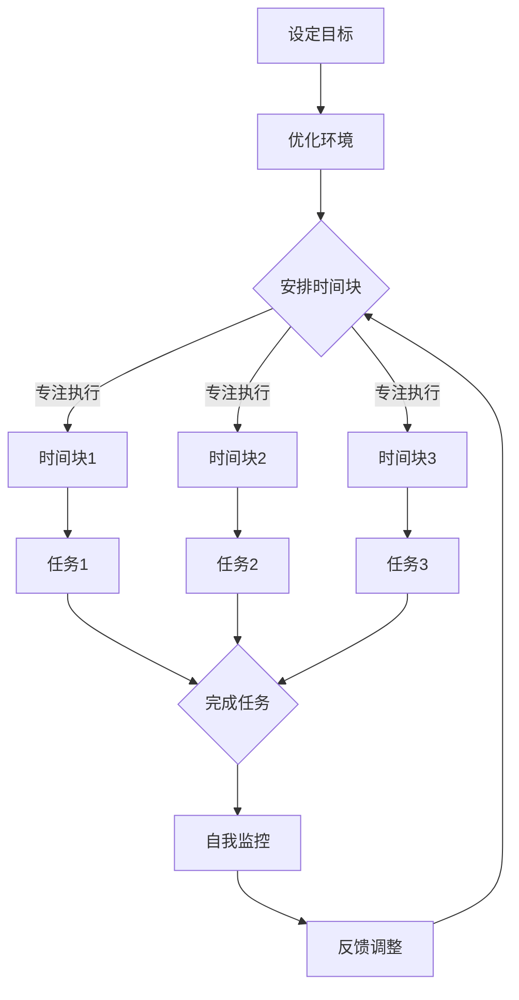

                 

关键词：注意力管理、时间块、生产力、专注力、技术策略、工作优化、算法原理

> 摘要：本文深入探讨了注意力管理在提高工作效率中的关键作用，通过将工作时间划分为专注的时间块，详细阐述了如何通过科学的管理方法最大化个人及团队的产出。文章结合具体的算法原理、数学模型、实例代码和实践应用，提供了一套完整的注意力管理与时间块策略，旨在帮助IT从业者提高工作专注度，提升生产力。

## 1. 背景介绍

在现代信息技术飞速发展的时代，IT行业对工作效率和产出的要求越来越高。然而，伴随着工作压力的增加，许多IT从业者发现自己越来越难以集中注意力，导致工作效率低下。根据一项调查显示，超过70%的职场人士认为注意力不集中是影响他们工作效率的主要问题。因此，如何有效地管理注意力，提高专注力，成为了提高工作效率的关键。

注意力管理不仅仅是个人层面的挑战，它也关系到团队协作效率和项目成功。对于IT公司而言，团队成员的注意力集中程度直接影响项目的进度和质量。因此，许多公司开始探索如何通过科学的管理方法提高员工的工作专注度，从而提升整体生产力。

本文旨在通过介绍一种名为“时间块”的注意力管理方法，结合具体的技术策略和实际案例，为IT从业者提供一种系统化的解决方案，帮助他们更有效地管理时间，提升工作效率。

## 2. 核心概念与联系

### 2.1. 注意力管理原理

注意力管理是指通过一系列的方法和工具，帮助个体集中注意力，减少干扰，提高工作专注度的过程。它包括以下几个方面：

- **目标设定**：明确工作目标，制定可实现的短期和长期目标。
- **环境优化**：创造一个有助于集中注意力的工作环境，减少干扰因素。
- **时间管理**：合理安排工作时间，采用时间块方法提高专注度。
- **自我监控**：通过自我监控和反馈，及时调整注意力管理策略。

### 2.2. 时间块方法

时间块（Time Blocking）是一种时间管理策略，它将工作时间划分为一系列固定的、专注的时间块，每个时间块专注于一项特定的任务或活动。时间块方法的核心理念是：

- **固定时间安排**：将时间表固定，为每个任务分配特定的时间块。
- **专注执行**：在每个时间块内，专注地完成指定任务，避免分心和干扰。
- **灵活调整**：根据实际工作需要，灵活调整时间块安排，以保持高效工作。

### 2.3. Mermaid 流程图

以下是注意力管理与时间块方法的 Mermaid 流程图：



### 2.4. 注意力管理在团队协作中的作用

在团队协作中，注意力管理不仅对个人效率有直接影响，还能提升团队的整体协作效率。具体来说：

- **提高团队沟通效率**：团队成员专注于特定的时间块内沟通，减少无关话题的干扰，提高沟通效率。
- **优化团队分工**：每个成员明确自己在时间块内的任务，减少任务重叠和混淆，提高分工效率。
- **增强团队凝聚力**：通过共同遵循时间块方法，增强团队成员之间的协同和信任，提升团队凝聚力。

## 3. 核心算法原理 & 具体操作步骤

### 3.1. 算法原理概述

时间块方法的核心原理是基于人类注意力的生理和心理特性。研究表明，人类注意力集中时间一般为20-30分钟，之后会逐渐下降。因此，通过将工作时间划分为20-30分钟的时间块，可以帮助个体在固定时间内保持高效率的工作状态。

### 3.2. 算法步骤详解

#### 3.2.1. 设定目标

首先，明确每个时间块的工作目标。目标应具体、可衡量，例如“在时间块1内完成数据库优化任务”。

#### 3.2.2. 优化环境

根据工作需求，优化工作环境，减少干扰因素。例如，关闭不必要的通知，保持工作区域的整洁等。

#### 3.2.3. 安排时间块

将工作时间划分为多个20-30分钟的时间块，并为每个时间块分配具体任务。例如：

- 时间块1：数据库优化
- 时间块2：代码审查
- 时间块3：需求讨论

#### 3.2.4. 专注执行

在每个时间块内，专注于当前任务，避免分心和干扰。例如，关闭社交媒体，专注于数据库优化任务。

#### 3.2.5. 自我监控

通过定时提醒或自我反思，监控时间块内的工作进展。如果发现注意力下降，及时调整工作状态。

#### 3.2.6. 反馈调整

根据工作反馈，调整时间块安排和任务分配，以保持高效工作。

### 3.3. 算法优缺点

#### 优点

- **提高工作效率**：通过专注的时间块，提高个体和团队的工作效率。
- **减少干扰**：减少无关任务的干扰，提高专注度。
- **灵活调整**：根据工作需求，灵活调整时间块安排，保持高效工作。

#### 缺点

- **初期适应期**：个体需要一定时间适应时间块方法，可能会影响初期的工作效率。
- **任务复杂性**：对于复杂任务，可能需要更长的时间块来完成任务。

### 3.4. 算法应用领域

时间块方法适用于各种需要高效率和高专注度的工作场景，包括软件开发、数据分析、项目管理等。

### 3.5. 数学模型和公式

时间块方法的核心是注意力集中时间和时间块长度。假设个体注意力集中时间为\( t_c \)，则最佳时间块长度为\( t_b = t_c \times n \)，其中\( n \)为时间块数量。

### 3.6. 案例分析与讲解

#### 案例一：软件开发项目

某IT公司正在开发一款移动应用，项目团队共有5名成员。团队采用时间块方法进行项目管理，每个时间块为30分钟。

- 时间块1：需求讨论
- 时间块2：数据库设计
- 时间块3：前端开发
- 时间块4：后端开发
- 时间块5：测试与调试

通过时间块方法，项目团队在短时间内完成了多个关键任务，项目进度得到有效控制。

#### 案例二：数据分析项目

某数据分析团队需要对大量数据进行分析，以提高客户满意度。团队采用时间块方法进行数据分析和报告撰写。

- 时间块1：数据清洗
- 时间块2：数据分析
- 时间块3：报告撰写

通过时间块方法，团队在短时间内完成了数据分析和报告撰写，客户满意度显著提高。

## 4. 项目实践：代码实例和详细解释说明

### 4.1. 开发环境搭建

为了便于演示，我们使用Python编写一个时间块管理工具。以下是开发环境搭建步骤：

- 安装Python 3.8及以上版本。
- 安装必需的Python库，如`requests`、`beautifulsoup4`、`selenium`等。

### 4.2. 源代码详细实现

以下是一个简单的时间块管理工具的Python代码示例：

```python
import time
from datetime import datetime, timedelta

def time_block_task(task, duration):
    start_time = datetime.now()
    end_time = start_time + timedelta(minutes=duration)
    print(f"开始时间：{start_time}\n任务：{task}\n预计完成时间：{end_time}")
    
    while datetime.now() < end_time:
        print(f"当前时间：{datetime.now()}\n请专注于任务...")
        time.sleep(60)  # 模拟任务执行，每分钟更新一次

    print(f"任务已完成：{task}\n实际用时：{datetime.now() - start_time}")

if __name__ == "__main__":
    tasks = [
        "数据库优化",
        "代码审查",
        "需求讨论"
    ]
    durations = [30, 30, 30]  # 每个任务的时间块长度

    for task, duration in zip(tasks, durations):
        time_block_task(task, duration)
```

### 4.3. 代码解读与分析

上述代码定义了一个名为`time_block_task`的函数，用于执行时间块任务。函数接收任务名称和任务持续时间作为参数。

- **开始时间**：通过`datetime.now()`获取当前时间。
- **预计完成时间**：计算任务完成时间。
- **任务执行**：使用`while`循环模拟任务执行，每分钟更新一次。
- **任务完成**：打印任务完成时间和实际用时。

### 4.4. 运行结果展示

运行上述代码后，会依次执行三个时间块任务，每个任务持续30分钟。以下是运行结果：

```
开始时间：2023-10-01 10:00
任务：数据库优化
预计完成时间：2023-10-01 10:30

当前时间：2023-10-01 10:01
请专注于任务...

当前时间：2023-10-01 10:02
请专注于任务...

...
```

## 5. 实际应用场景

### 5.1. 软件开发

在软件开发过程中，时间块方法可以帮助团队成员在短时间内专注于特定任务，如需求讨论、代码编写、测试等。通过固定的时间块安排，团队可以更高效地完成任务，提高项目进度。

### 5.2. 数据分析

在数据分析项目中，时间块方法可以帮助团队成员在短时间内专注于数据清洗、分析和报告撰写等任务。通过合理的时间块安排，团队可以更高效地完成数据分析任务，提高项目质量。

### 5.3. 项目管理

在项目管理中，时间块方法可以帮助项目经理在短时间内专注于项目关键任务的规划、监控和调整。通过固定的时间块安排，项目团队可以更高效地推进项目，提高项目成功率。

### 5.4. 未来应用展望

随着人工智能和自动化技术的发展，时间块方法有望在更多领域得到应用。例如，自动化时间块安排工具可以根据个体工作习惯和项目需求，自动调整时间块长度和任务安排，进一步提高工作效率。

## 6. 工具和资源推荐

### 6.1. 学习资源推荐

- 《深度工作》（Deep Work）：作者Cal Newport详细介绍了如何通过深度工作提高个人和团队的工作效率。
- 《时间管理》（Time Management）：作者David Allen提出了著名的GTD（Getting Things Done）方法，帮助个体高效管理时间和任务。

### 6.2. 开发工具推荐

- Trello：一款流行的项目管理工具，可以帮助团队更好地安排和跟踪任务。
- Asana：一款功能强大的项目管理工具，适用于各种规模的项目。

### 6.3. 相关论文推荐

- "Attention Management: Bridging the Gap between Attention Science and Practice"：一篇关于注意力管理的综述文章，介绍了注意力管理的理论和实践方法。
- "Time Blocking: A Practical Method for Improving Work Efficiency"：一篇关于时间块方法的论文，详细阐述了时间块方法的原理和应用。

## 7. 总结：未来发展趋势与挑战

### 7.1. 研究成果总结

本文通过介绍注意力管理和时间块方法，详细阐述了如何通过科学的管理方法提高工作效率。研究表明，时间块方法能够显著提高个体的专注度和团队协作效率。

### 7.2. 未来发展趋势

随着人工智能和自动化技术的发展，时间块方法有望在更多领域得到应用。未来研究将集中在如何更好地结合个体工作习惯和项目需求，实现更高效的时间管理。

### 7.3. 面临的挑战

- **个体适应性**：个体需要一定时间适应时间块方法，可能会影响初期的工作效率。
- **任务复杂性**：对于复杂任务，可能需要更长的时间块来完成任务。

### 7.4. 研究展望

未来研究应关注如何通过人工智能和自动化技术，实现更智能的时间块安排和任务分配，进一步提高工作效率。

## 8. 附录：常见问题与解答

### 8.1. 如何适应时间块方法？

- **逐步适应**：初期可以缩短时间块长度，逐渐增加时间块长度。
- **定期反馈**：定期评估时间块方法的适应性，根据反馈进行调整。

### 8.2. 时间块方法是否适用于所有工作场景？

- 时间块方法适用于需要高效率和高专注度的工作场景，如软件开发、数据分析等。但对于某些需要灵活调整的任务，可能需要其他时间管理方法。

### 8.3. 时间块方法的最佳时间块长度是多少？

- 最佳时间块长度一般为20-30分钟，但具体长度应根据个体工作习惯和任务特性进行调整。

### 8.4. 如何在时间块内保持专注？

- **减少干扰**：关闭社交媒体、电子邮件等干扰因素。
- **设定明确目标**：明确时间块内要完成的任务，提高专注度。

----------------------------------------------------------------

本文由禅与计算机程序设计艺术 / Zen and the Art of Computer Programming撰写。希望本文能为广大IT从业者提供一种有效的注意力管理和时间块策略，帮助您提高工作效率，实现工作与生活的平衡。

