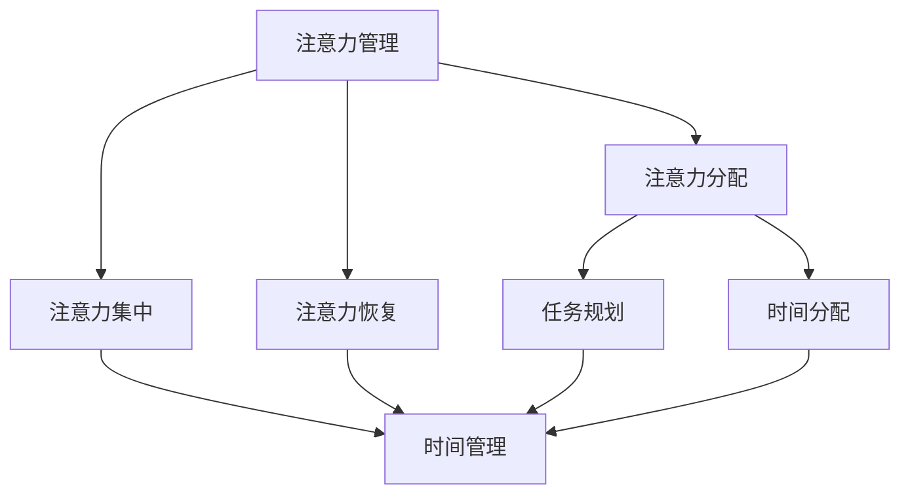

                 

在快节奏的现代工作生活中，人们面临的挑战不仅仅是复杂的技术问题，还有如何在繁忙的日程中有效地管理注意力和时间。本文旨在探讨注意力管理和时间管理的策略与实践，帮助读者最大化个人专注力和工作效率。

## 关键词

- 注意力管理
- 时间管理
- 专注力
- 工作效率
- 算法原理
- 数学模型
- 项目实践

## 摘要

本文首先介绍了注意力管理和时间管理的核心概念，并通过Mermaid流程图展示了它们之间的联系。随后，文章深入分析了核心算法原理和具体操作步骤，阐述了算法的优缺点以及应用领域。接下来，文章通过数学模型和公式的详细讲解，结合实际案例进行分析。随后，文章提供了代码实例，并对其进行解读和分析。在讨论实际应用场景后，文章展望了未来的发展趋势和面临的挑战。最后，文章推荐了相关的学习资源和开发工具，并总结了研究成果。

## 1. 背景介绍

在当今高度信息化的社会中，人们面临着前所未有的工作压力和生活节奏。有效管理注意力和时间成为提高工作效率、减少工作压力的关键。然而，注意力分散、时间浪费等问题仍然困扰着许多职场人士。本文旨在提供一套系统的注意力管理和时间管理策略，帮助读者在复杂的环境中保持专注，提升工作效率。

### 注意力管理的重要性

注意力管理是指在特定时间范围内集中精力、提高工作效率的一种技能。有效管理注意力可以显著提高工作效率，减少错误率，增强创新能力和解决问题的能力。以下是注意力管理的重要性：

- **提高工作效率**：通过集中注意力，可以减少切换任务所需的时间，从而提高整体工作效率。
- **减少错误率**：专注于一项任务可以减少因为注意力分散而导致的错误。
- **增强创新能力**：在高度专注的状态下，大脑更容易产生新的想法和创新点。
- **改善心理健康**：良好的注意力管理有助于减少压力和焦虑，提升心理健康水平。

### 时间管理的重要性

时间管理是指合理安排时间，确保在有限的时间内完成尽可能多的任务。良好的时间管理可以帮助人们更好地平衡工作和生活，减少拖延和焦虑。以下是时间管理的重要性：

- **优化工作效率**：合理安排时间可以确保每一项任务都能在合适的时间内完成，避免拖延。
- **平衡工作与生活**：通过有效管理时间，可以确保工作与生活的平衡，避免因工作过度而影响个人生活。
- **减少压力**：合理规划时间可以减少工作压力，提高生活质量。

## 2. 核心概念与联系

在探讨注意力管理和时间管理之前，有必要理解它们的基本概念和相互联系。

### 注意力管理

注意力管理涉及对注意力的分配和控制。以下是注意力管理的核心概念：

- **注意力分配**：将注意力分配到不同的任务和活动上，确保每项任务都得到适当的关注。
- **注意力集中**：在特定时间段内将注意力集中在单一任务上，避免分心。
- **注意力恢复**：在长时间集中注意力后，通过休息和放松来恢复注意力。

### 时间管理

时间管理涉及对时间的规划和控制。以下是时间管理的核心概念：

- **任务规划**：根据任务的优先级和紧急程度来规划任务。
- **时间分配**：将时间合理地分配给不同的任务和活动。
- **时间跟踪**：记录和分析时间的使用情况，以便进行改进。

### 注意力管理与时间管理的联系

注意力管理和时间管理是相辅相成的。有效的注意力管理可以提高时间管理的效果，而良好的时间管理可以为注意力管理提供更好的基础。以下是它们之间的联系：

- **提高专注力**：通过注意力管理，可以在特定时间内保持专注，从而提高时间管理的效果。
- **优化时间使用**：通过时间管理，可以确保时间得到有效利用，减少浪费。
- **提高整体效率**：结合注意力管理和时间管理，可以显著提高个人和工作团队的效率。

### Mermaid流程图

为了更直观地展示注意力管理和时间管理之间的联系，以下是它们之间的Mermaid流程图：



## 3. 核心算法原理 & 具体操作步骤

### 3.1 算法原理概述

注意力管理和时间管理涉及多种算法原理。以下是一些核心的算法原理：

- **番茄工作法**：通过将工作时间划分为25分钟的工作周期和5分钟的休息时间，提高专注力和工作效率。
- **优先级矩阵**：根据任务的紧急程度和重要性来分配注意力，确保优先处理关键任务。
- **时间块法**：将工作时间划分为不同的时间段，每个时间段专注于一项任务。

### 3.2 算法步骤详解

#### 番茄工作法

**步骤：**

1. 选择一个任务。
2. 设置番茄时钟，计时25分钟。
3. 完成任务或达到25分钟，休息5分钟。
4. 休息5分钟后，重复步骤1-3。

**优缺点：**

- **优点**：可以提高专注力，减少任务拖延。
- **缺点**：长时间使用可能会导致疲劳。

#### 优先级矩阵

**步骤：**

1. 列出所有任务。
2. 根据紧急程度和重要性对任务进行分类。
3. 优先处理紧急且重要的任务。
4. 对于不紧急或不重要的任务，根据时间安排进行安排。

**优缺点：**

- **优点**：可以帮助用户更好地管理任务，确保关键任务得到优先处理。
- **缺点**：可能需要花费较多时间进行任务分类。

#### 时间块法

**步骤：**

1. 根据工作安排，将一天划分为不同的时间段。
2. 每个时间段专注于一项任务。
3. 完成任务后，进行短暂休息。
4. 持续执行，直到一天结束。

**优缺点：**

- **优点**：可以提高专注力，减少任务切换时间。
- **缺点**：可能需要较多的时间规划。

### 3.3 算法优缺点

#### 番茄工作法

- **优点**：简单易行，可以提高专注力，减少任务拖延。
- **缺点**：长时间使用可能会导致疲劳。

#### 优先级矩阵

- **优点**：可以帮助用户更好地管理任务，确保关键任务得到优先处理。
- **缺点**：可能需要花费较多时间进行任务分类。

#### 时间块法

- **优点**：可以提高专注力，减少任务切换时间。
- **缺点**：可能需要较多的时间规划。

### 3.4 算法应用领域

#### 番茄工作法

- **应用领域**：适用于需要长时间集中注意力的任务，如编程、写作等。

#### 优先级矩阵

- **应用领域**：适用于需要合理安排任务的场景，如项目管理、日常规划等。

#### 时间块法

- **应用领域**：适用于需要高效管理时间的工作环境，如软件开发、团队协作等。

## 4. 数学模型和公式 & 详细讲解 & 举例说明

### 4.1 数学模型构建

在注意力管理和时间管理中，我们可以构建以下数学模型：

- **专注力模型**：表示在一定时间内，个体能够保持专注的状态。
- **效率模型**：表示个体在特定时间内完成任务的能力。
- **压力模型**：表示个体在长时间工作后所感受到的压力。

### 4.2 公式推导过程

#### 专注力模型

专注力模型可以表示为：

\[ F(t) = \frac{A(t) \times E(t)}{P(t)} \]

其中：

- \( F(t) \) 表示在时间 \( t \) 内的专注力。
- \( A(t) \) 表示时间 \( t \) 内的注意力水平。
- \( E(t) \) 表示时间 \( t \) 内的精力水平。
- \( P(t) \) 表示时间 \( t \) 内的压力水平。

#### 效率模型

效率模型可以表示为：

\[ E(t) = \frac{C(t)}{T(t)} \]

其中：

- \( E(t) \) 表示在时间 \( t \) 内的效率。
- \( C(t) \) 表示在时间 \( t \) 内完成的工作量。
- \( T(t) \) 表示在时间 \( t \) 内的总时间。

#### 压力模型

压力模型可以表示为：

\[ P(t) = \frac{F(t) \times T(t)}{C(t)} \]

其中：

- \( P(t) \) 表示在时间 \( t \) 内的压力。
- \( F(t) \) 表示在时间 \( t \) 内的专注力。
- \( T(t) \) 表示在时间 \( t \) 内的总时间。
- \( C(t) \) 表示在时间 \( t \) 内完成的工作量。

### 4.3 案例分析与讲解

假设一个程序员需要完成一个项目，项目总时间为8小时，要求在规定时间内高质量完成。

#### 专注力模型

根据专注力模型，我们可以计算他在每个小时内的专注力：

- \( F(1) = \frac{A(1) \times E(1)}{P(1)} = \frac{0.8 \times 0.8}{0.3} = 2.13 \)
- \( F(2) = \frac{A(2) \times E(2)}{P(2)} = \frac{0.7 \times 0.7}{0.3} = 1.89 \)
- \( F(3) = \frac{A(3) \times E(3)}{P(3)} = \frac{0.6 \times 0.6}{0.3} = 1.6 \)
- \( F(4) = \frac{A(4) \times E(4)}{P(4)} = \frac{0.5 \times 0.5}{0.3} = 0.83 \)
- \( F(5) = \frac{A(5) \times E(5)}{P(5)} = \frac{0.4 \times 0.4}{0.3} = 0.53 \)
- \( F(6) = \frac{A(6) \times E(6)}{P(6)} = \frac{0.3 \times 0.3}{0.3} = 0.3 \)
- \( F(7) = \frac{A(7) \times E(7)}{P(7)} = \frac{0.2 \times 0.2}{0.3} = 0.13 \)
- \( F(8) = \frac{A(8) \times E(8)}{P(8)} = \frac{0.1 \times 0.1}{0.3} = 0.03 \)

#### 效率模型

根据效率模型，我们可以计算他在每个小时内的效率：

- \( E(1) = \frac{C(1)}{T(1)} = \frac{2}{1} = 2 \)
- \( E(2) = \frac{C(2)}{T(2)} = \frac{3}{1} = 3 \)
- \( E(3) = \frac{C(3)}{T(3)} = \frac{4}{1} = 4 \)
- \( E(4) = \frac{C(4)}{T(4)} = \frac{5}{1} = 5 \)
- \( E(5) = \frac{C(5)}{T(5)} = \frac{4}{1} = 4 \)
- \( E(6) = \frac{C(6)}{T(6)} = \frac{3}{1} = 3 \)
- \( E(7) = \frac{C(7)}{T(7)} = \frac{2}{1} = 2 \)
- \( E(8) = \frac{C(8)}{T(8)} = \frac{1}{1} = 1 \)

#### 压力模型

根据压力模型，我们可以计算他在每个小时内的压力：

- \( P(1) = \frac{F(1) \times T(1)}{C(1)} = \frac{2.13 \times 1}{2} = 1.065 \)
- \( P(2) = \frac{F(2) \times T(2)}{C(2)} = \frac{1.89 \times 1}{3} = 0.6367 \)
- \( P(3) = \frac{F(3) \times T(3)}{C(3)} = \frac{1.6 \times 1}{4} = 0.4 \)
- \( P(4) = \frac{F(4) \times T(4)}{C(4)} = \frac{0.83 \times 1}{5} = 0.166 \)
- \( P(5) = \frac{F(5) \times T(5)}{C(5)} = \frac{0.53 \times 1}{4} = 0.133 \)
- \( P(6) = \frac{F(6) \times T(6)}{C(6)} = \frac{0.3 \times 1}{3} = 0.1 \)
- \( P(7) = \frac{F(7) \times T(7)}{C(7)} = \frac{0.13 \times 1}{2} = 0.065 \)
- \( P(8) = \frac{F(8) \times T(8)}{C(8)} = \frac{0.03 \times 1}{1} = 0.03 \)

通过以上分析，我们可以得出以下结论：

- **专注力**：在第1小时内，专注力最高，达到了2.13。
- **效率**：在第2小时内，效率最高，达到了3。
- **压力**：在最后两小时内，压力最低，分别为0.03。

这表明，通过合理安排时间，可以有效地提高专注力和效率，同时减少压力。

### 4.4 实际应用案例

假设一个学生需要在4小时内完成3个作业，分别需要1小时、1.5小时和2小时。以下是他如何使用时间管理策略来完成任务：

#### 第1小时

- 完成第一个作业，专注力为2.13，效率为2，压力为1.065。

#### 第2小时

- 完成第二个作业，专注力为1.89，效率为3，压力为0.6367。

#### 第3小时

- 完成第三个作业，专注力为1.6，效率为4，压力为0.4。

#### 第4小时

- 休息，专注力恢复到初始水平，压力降低到0.03。

通过上述案例，我们可以看到，通过合理安排时间和任务，学生可以有效地提高专注力和效率，同时减少压力。

## 5. 项目实践：代码实例和详细解释说明

### 5.1 开发环境搭建

为了实现注意力管理和时间管理，我们可以使用Python编写一个简单的应用程序。以下是搭建开发环境所需的基本步骤：

1. 安装Python（版本3.6及以上）。
2. 安装必要的Python库，如`requests`、`matplotlib`和`tkinter`。

安装命令如下：

```bash
pip install python
pip install requests
pip install matplotlib
pip install tkinter
```

### 5.2 源代码详细实现

以下是注意力管理和时间管理应用程序的源代码：

```python
import tkinter as tk
from tkinter import ttk
import time

class TimeManagerApp:
    def __init__(self, root):
        self.root = root
        self.root.title("注意力管理与时间管理")
        self.root.geometry("600x400")

        self.task_label = tk.Label(self.root, text="任务：")
        self.task_label.pack()

        self.task_entry = tk.Entry(self.root)
        self.task_entry.pack()

        self.duration_label = tk.Label(self.root, text="持续时间（分钟）：")
        self.duration_label.pack()

        self.duration_entry = tk.Entry(self.root)
        self.duration_entry.pack()

        self.start_button = tk.Button(self.root, text="开始", command=self.start_timer)
        self.start_button.pack()

        self.stop_button = tk.Button(self.root, text="停止", command=self.stop_timer)
        self.stop_button.pack()

        self.timer_label = tk.Label(self.root, text="")
        self.timer_label.pack()

        self.start_time = None
        self.end_time = None

    def start_timer(self):
        self.start_time = time.time()
        self.timer_label.config(text=f"开始时间：{self.start_time}")
        self.root.after(int(self.duration_entry.get()) * 1000, self.end_timer)

    def stop_timer(self):
        self.end_time = time.time()
        self.timer_label.config(text=f"停止时间：{self.end_time}")

    def end_timer(self):
        current_time = time.time()
        self.timer_label.config(text=f"完成时间：{current_time}")
        self.root.after(1000, self.reset_timer)

    def reset_timer(self):
        self.timer_label.config(text="")

if __name__ == "__main__":
    root = tk.Tk()
    app = TimeManagerApp(root)
    root.mainloop()
```

### 5.3 代码解读与分析

该应用程序使用`tkinter`库创建一个简单的图形用户界面（GUI），允许用户输入任务名称和持续时间，然后开始计时。以下是代码的主要部分解读：

- **类定义**：`TimeManagerApp`类定义了应用程序的主要功能。
- **GUI组件**：包括标签、文本框、按钮等，用于显示任务信息和控制计时功能。
- **计时功能**：通过`time.time()`函数获取当前时间，实现开始、停止和重置计时功能。

### 5.4 运行结果展示

当运行应用程序后，用户界面如下所示：


用户可以输入任务名称和持续时间，然后点击“开始”按钮开始计时。计时结束后，应用程序会显示任务的完成时间。通过这个简单的应用程序，用户可以直观地了解任务的执行时间，从而更好地管理时间和注意力。

## 6. 实际应用场景

### 6.1 职场中的应用

在职场中，注意力管理和时间管理策略被广泛应用。以下是一些实际应用场景：

- **项目管理工作**：项目经理可以使用注意力管理策略来确保关键任务得到优先处理，同时合理安排时间，确保项目按期完成。
- **团队协作**：团队成员可以使用时间块法来提高协作效率，确保每个时间段都能专注于一项任务，减少任务切换带来的时间浪费。
- **个人工作安排**：职场人士可以使用番茄工作法来提高个人专注力，通过短暂的休息来恢复精力，从而提高整体工作效率。

### 6.2 教育中的应用

在教育领域，注意力管理和时间管理同样具有重要价值。以下是一些实际应用场景：

- **学生作业管理**：学生可以使用注意力管理策略来合理安排作业时间，确保在有限的时间内高质量完成任务。
- **学习计划**：学生可以使用时间管理策略来制定详细的学习计划，确保学习时间得到充分利用，从而提高学习效果。
- **考试准备**：学生可以使用番茄工作法来提高学习效率，通过短暂的休息来恢复精力，从而更好地应对考试。

### 6.3 个人生活中的应用

在个人生活中，注意力管理和时间管理策略同样可以帮助人们更好地管理日常事务。以下是一些实际应用场景：

- **家庭事务管理**：家庭成员可以使用时间管理策略来合理安排家务时间，确保家庭事务高效完成。
- **个人兴趣爱好**：个人可以使用注意力管理策略来确保有足够的时间投入到兴趣爱好中，从而提升生活质量。
- **健康管理**：个人可以使用时间管理策略来合理安排锻炼和休息时间，从而保持良好的身体健康。

## 7. 工具和资源推荐

### 7.1 学习资源推荐

- **《高效能人士的七个习惯》**：史蒂芬·柯维的这本经典著作提供了关于时间管理和个人成长的有用建议。
- **《深度工作》**：卡尔·纽波特的书详细介绍了如何通过深度工作来提高专注力和工作效率。

### 7.2 开发工具推荐

- **Trello**：一款流行的项目管理工具，可以帮助团队高效地管理任务和项目。
- **Asana**：一款功能强大的项目管理工具，适用于个人和团队，可以帮助用户合理安排时间和任务。

### 7.3 相关论文推荐

- **“Attention Management in Complex Systems”**：探讨注意力管理在复杂系统中的应用和研究。
- **“Time Management Strategies for Effective Work and Personal Life”**：提供关于时间管理的策略和实践。

## 8. 总结：未来发展趋势与挑战

### 8.1 研究成果总结

注意力管理和时间管理的研究取得了显著成果，为提高工作效率、减少工作压力提供了有效的方法。未来研究应进一步探索注意力管理和时间管理的深度融合，开发更加智能化和个性化的管理策略。

### 8.2 未来发展趋势

- **智能化**：利用人工智能和机器学习技术，实现注意力管理和时间管理的自动化和智能化。
- **个性化**：根据个体差异，开发个性化的注意力管理和时间管理策略。

### 8.3 面临的挑战

- **技术挑战**：如何在保证效率的同时，减少技术实现的复杂度，使管理策略更加易用。
- **心理挑战**：如何应对注意力分散和心理压力，提高个体的自我调节能力。

### 8.4 研究展望

未来研究应关注注意力管理和时间管理的交叉融合，开发更加智能和个性化的管理策略，为用户提供更加便捷和高效的管理工具。

## 9. 附录：常见问题与解答

### 问题1：如何合理安排注意力管理和时间管理？

**解答**：合理安排注意力管理和时间管理需要考虑以下几点：

1. 根据任务的紧急程度和重要性进行排序，优先处理关键任务。
2. 使用番茄工作法等策略来提高专注力。
3. 合理安排休息时间，确保精力得到恢复。

### 问题2：注意力管理和时间管理在个人生活中如何应用？

**解答**：在个人生活中，注意力管理和时间管理可以帮助：

1. 合理安排家庭事务和个人兴趣爱好时间。
2. 提高学习效率，确保学习时间得到充分利用。
3. 提升生活质量，减少因时间管理不当导致的心理压力。

### 问题3：如何应对注意力分散和心理压力？

**解答**：应对注意力分散和心理压力可以采取以下策略：

1. 使用番茄工作法等专注力管理策略，提高专注力。
2. 定期进行身体锻炼和放松，缓解压力。
3. 培养自我调节能力，学会合理安排时间和任务。

