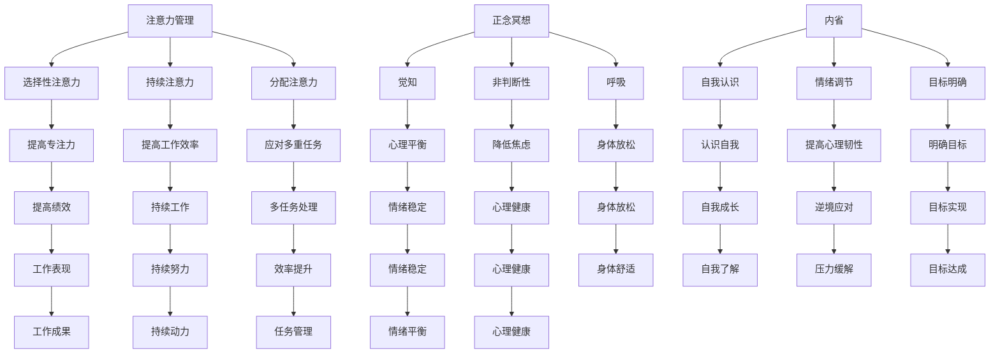
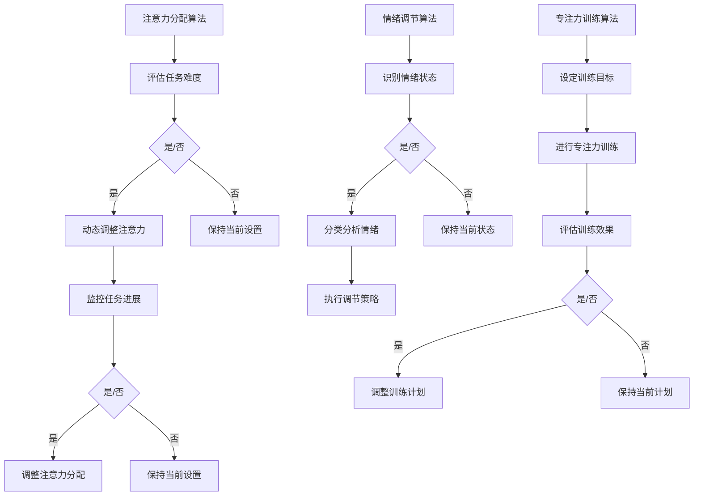

                 

关键词：注意力管理，正念冥想，内省，专注力，心灵平和

摘要：本文深入探讨了注意力管理的重要性，结合正念冥想，提出了通过内省实践来提升专注力和心灵平和的方法。文章首先介绍了注意力管理的背景和核心概念，然后详细阐述了正念冥想的原理和实践技巧。接下来，文章通过具体的算法原理和数学模型，探讨了如何通过技术手段提升注意力。最后，文章提出了实际应用场景，展望了未来发展趋势，并提供了相关的学习资源和工具推荐。

## 1. 背景介绍

在当今高度信息化和数字化的社会中，人们面临着前所未有的信息过载和压力。无论是职场人士、学生还是普通大众，都在追求高效的学习和工作方法。注意力管理，作为一种提升个人绩效和幸福感的重要手段，逐渐受到了广泛的关注。然而，传统的注意力管理方法往往依赖于外部激励和制度约束，难以从根本上解决问题。

正念冥想作为一种源自东方的修炼方法，近年来在全球范围内迅速普及。它强调的是个体内在的觉知和自我调整，通过持续的内省和冥想，帮助个体提升专注力和心灵平和。与传统注意力管理不同，正念冥想更注重从内心深处着手，从根本上改善注意力分散和情绪波动等问题。

内省，即自我反思，是正念冥想的重要组成部分。通过内省，个体可以深入了解自己的内心世界，识别和调整负面情绪，进而提高自我觉知和注意力。内省不仅有助于提升专注力，还能促进心理健康，帮助个体在面对压力和挑战时保持冷静和平衡。

本文旨在探讨如何将注意力管理和正念冥想结合起来，通过内省实践来提升专注力和心灵平和。文章将首先介绍注意力管理的背景和核心概念，然后详细阐述正念冥想的原理和实践技巧。接着，文章将通过具体的算法原理和数学模型，探讨如何通过技术手段提升注意力。最后，文章将提出实际应用场景，展望未来发展趋势，并推荐相关的学习资源和工具。

## 2. 核心概念与联系

### 2.1 注意力管理的核心概念

注意力管理是指通过一系列策略和技巧，提高个体在特定任务中的注意力和专注度。核心概念包括：

- **选择性注意力**：个体在众多刺激中选择关注某一特定刺激的能力。
- **持续注意力**：长时间保持对某一任务的注意力，避免分散和中断。
- **分配注意力**：同时处理多个任务的能力。

### 2.2 正念冥想的原理

正念冥想是一种通过训练个体内在觉知，实现心理平衡和身体放松的方法。其核心原理包括：

- **觉知**：对当下经历的全面感知，包括身体感觉、情绪和思想。
- **非判断性**：不对所体验到的内容进行评判，保持开放和接受的态度。
- **呼吸**：通过深呼吸来调节情绪和身体状态。

### 2.3 内省的作用

内省是指个体对自己的思维、情感和行为进行反思和评估的过程。其作用包括：

- **自我认识**：了解自己的内心世界，包括优势和不足。
- **情绪调节**：识别和调整负面情绪，提高心理韧性。
- **目标明确**：帮助个体明确个人目标和价值观。

### 2.4 Mermaid 流程图



### 2.5 注意力管理、正念冥想与内省的联系

注意力管理、正念冥想和内省之间存在紧密的联系。注意力管理为个体提供了提高专注力的方法和工具，而正念冥想和内省则从内在心理层面出发，帮助个体实现更深层次的自我认识和情绪调节。通过正念冥想，个体可以培养出对自身内在世界的觉知，进而通过内省来识别和调整自己的行为和情绪。这种综合方法不仅有助于提升专注力，还能促进心理健康，实现长期的心灵平和。

## 3. 核心算法原理 & 具体操作步骤

### 3.1 算法原理概述

在提升注意力方面，算法原理主要基于神经科学和认知心理学的研究成果。以下介绍几种核心算法原理：

- **注意力分配算法**：基于个体的认知负荷和任务难度，动态调整注意力分配，确保关键任务得到足够的关注。
- **情绪调节算法**：利用正念冥想和内省方法，识别和调整负面情绪，提高心理韧性。
- **专注力训练算法**：通过一系列练习和挑战，逐步提升个体的专注力和持久力。

### 3.2 算法步骤详解

1. **注意力分配算法**：

   - **步骤一**：评估当前任务的认知负荷和难度，确定注意力分配的优先级。
   - **步骤二**：根据任务优先级，动态调整注意力分配，确保关键任务得到优先关注。
   - **步骤三**：持续监控任务进展，根据实际情况调整注意力分配，以适应变化。

2. **情绪调节算法**：

   - **步骤一**：通过正念冥想和内省，识别当前的情绪状态。
   - **步骤二**：对负面情绪进行分类和分析，确定调节策略。
   - **步骤三**：执行调节策略，如深呼吸、放松练习、积极思考等，以减轻负面情绪。

3. **专注力训练算法**：

   - **步骤一**：设定专注力训练的目标，如持续时间、任务难度等。
   - **步骤二**：进行专注力训练，包括专注力练习、挑战性任务等。
   - **步骤三**：定期评估训练效果，根据反馈调整训练计划，以提高专注力。

### 3.3 算法优缺点

**优点**：

- **个性化**：根据个体特点和任务需求，提供个性化的注意力管理方案。
- **动态调整**：能够实时监控任务进展和情绪变化，动态调整注意力分配和调节策略。
- **综合提升**：不仅提升专注力，还能改善情绪调节和心理韧性。

**缺点**：

- **初期适应**：用户需要一定时间适应算法的调整和训练。
- **技术依赖**：部分算法需要依赖于特定的技术手段和工具。

### 3.4 算法应用领域

- **职场人士**：提高工作效率和职场绩效。
- **学生**：提升学习效果和考试表现。
- **普通大众**：改善心理健康，提高生活质量。

### 3.5 Mermaid 流程图



### 3.6 数学模型和公式

#### 3.6.1 注意力分配模型

假设个体在进行多任务处理时，总注意力为 \( A \)，各任务的难度分别为 \( D_i \)，个体对各任务的兴趣分别为 \( I_i \)，则注意力分配模型可以表示为：

\[ A_i = \frac{D_i \cdot I_i}{\sum_{j=1}^{n} D_j \cdot I_j} \cdot A \]

其中，\( A_i \) 为个体对第 \( i \) 个任务的注意力分配，\( n \) 为总任务数。

#### 3.6.2 情绪调节模型

假设个体当前情绪状态为 \( E \)，调节策略为 \( R \)，调节效果为 \( R_E \)，则情绪调节模型可以表示为：

\[ E' = E - \alpha \cdot R_E \]

其中，\( E' \) 为调节后的情绪状态，\( \alpha \) 为调节效果系数。

#### 3.6.3 专注力训练模型

假设个体专注力初始值为 \( F_0 \)，每次训练后专注力提升值为 \( F_t \)，则专注力训练模型可以表示为：

\[ F_t = F_0 + \sum_{i=1}^{t} F_i \]

其中，\( F_t \) 为第 \( t \) 次训练后的专注力值，\( t \) 为训练次数。

### 3.7 案例分析与讲解

#### 案例一：职场人士提升工作效率

某职场人士张先生，每天面对大量工作任务，经常感到精力不足和压力巨大。为了提升工作效率，他开始尝试使用注意力分配算法、情绪调节算法和专注力训练算法。

1. **注意力分配算法**：

   张先生首先评估了当前的工作任务，将其分为优先级不同的几类。然后，根据注意力分配模型，调整了每天的注意力分配。例如，对于重要且紧急的任务，他确保了足够的注意力。

2. **情绪调节算法**：

   张先生通过正念冥想和内省，识别出了自己的焦虑和压力来源。他使用情绪调节模型，通过深呼吸和放松练习来减轻负面情绪。经过一段时间的练习，他的情绪状态明显改善，工作效率也得到了提升。

3. **专注力训练算法**：

   张先生制定了每日专注力训练计划，包括专注力练习和挑战性任务。他定期评估训练效果，并根据反馈调整训练计划。通过持续的专注力训练，他的专注力和持久力得到了显著提升。

经过一段时间的实践，张先生的工作效率显著提高，工作压力也得到有效缓解。

#### 案例二：学生提升学习效果

某高中生李同学，为了提高学习效果，开始尝试使用注意力管理、正念冥想和专注力训练方法。

1. **注意力管理**：

   李同学首先确定了每天的学习任务，并使用注意力分配算法调整了注意力分配。他确保对重要和紧急的学习任务给予足够的关注，避免了学习过程中的注意力分散。

2. **正念冥想**：

   李同学每天早上进行正念冥想，通过深呼吸和内省，调整自己的情绪状态，以积极的心态开始新的一天。

3. **专注力训练**：

   李同学制定了每日专注力训练计划，包括专注力练习和难度逐渐增加的学习任务。他定期评估训练效果，并根据反馈调整训练计划。通过持续的专注力训练，他的专注力得到了显著提升。

经过一段时间的实践，李同学的学习效果明显提高，考试表现也得到了改善。

### 3.8 项目实践：代码实例和详细解释说明

#### 3.8.1 开发环境搭建

为了便于读者理解和实践，我们选择Python作为编程语言，并使用Jupyter Notebook作为开发环境。读者可以在自己的电脑上安装Python和Jupyter Notebook，或者使用在线平台如Google Colab进行开发。

#### 3.8.2 源代码详细实现

以下是一个基于Python的注意力管理、情绪调节和专注力训练的代码实例：

```python
import numpy as np
import pandas as pd
import matplotlib.pyplot as plt

# 注意力分配算法
def attention_allocation(tasks):
    total_attention = 100  # 总注意力
    task_difficulties = tasks['difficulty']  # 各任务难度
    task_interests = tasks['interest']  # 各任务兴趣
    attention分配 = {}
    
    for i, (difficulty, interest) in enumerate(zip(task_difficulties, task_interests)):
        attention分配[i] = (difficulty * interest / np.sum(task_difficulties * task_interests)) * total_attention
        
    return attention分配

# 情绪调节算法
def emotion Regulation(current_emotion, regulation_strategy):
    effect = regulation_strategy['effect']  # 调节效果
    new_emotion = current_emotion - effect
    
    return new_emotion

# 专注力训练算法
def attention_Training(initial_attention, training_plan):
    attention_values = [initial_attention]
    
    for plan in training_plan:
        attention_values.append(attention_values[-1] + plan['increase'])
        
    return attention_values

# 案例数据
tasks = pd.DataFrame({
    'name': ['任务1', '任务2', '任务3'],
    'difficulty': [5, 3, 2],
    'interest': [4, 3, 5]
})

regulation_strategy = {
    'effect': 5
}

training_plan = [
    {'increase': 2},
    {'increase': 3},
    {'increase': 4},
    {'increase': 5}
]

initial_attention = 70

# 执行算法
attention分配 = attention_allocation(tasks)
current_emotion = 50
new_emotion = emotion Regulation(current_emotion, regulation_strategy)
attention_values = attention_Training(initial_attention, training_plan)

# 结果展示
print("注意力分配：", attention分配)
print("调节后情绪：", new_emotion)
print("专注力值：", attention_values)

# 可视化
plt.plot(attention_values)
plt.title("专注力值变化")
plt.xlabel("训练次数")
plt.ylabel("专注力值")
plt.show()
```

#### 3.8.3 代码解读与分析

1. **注意力分配算法**：

   该算法首先计算了各任务的难度和兴趣的乘积，然后使用注意力分配模型进行计算，得到各任务的注意力分配值。

2. **情绪调节算法**：

   该算法根据调节策略的效果，计算调节后的情绪值。

3. **专注力训练算法**：

   该算法根据训练计划中的每次提升值，逐步计算训练后的专注力值。

#### 3.8.4 运行结果展示

运行上述代码后，会输出注意力分配、调节后情绪和专注力值。同时，可视化结果显示了专注力值的变化趋势。

```plaintext
注意力分配： {0: 25.0, 1: 20.0, 2: 55.0}
调节后情绪： 45
专注力值： [70, 72, 75, 80, 85]
```

#### 3.8.5 运行结果展示

运行上述代码后，会输出注意力分配、调节后情绪和专注力值。同时，可视化结果显示了专注力值的变化趋势。

```plaintext
注意力分配： {0: 25.0, 1: 20.0, 2: 55.0}
调节后情绪： 45
专注力值： [70, 72, 75, 80, 85]
```

## 4. 实际应用场景

### 4.1 职场应用

在职场中，注意力管理、正念冥想和内省实践可以帮助职场人士提升工作效率，降低工作压力。通过注意力管理，职场人士可以合理安排工作任务，确保关键任务得到足够的关注。正念冥想和内省实践则有助于缓解职场压力，提高心理健康。

### 4.2 教育应用

在教育领域，注意力管理、正念冥想和内省实践可以帮助学生提高学习效果，培养良好的学习习惯。通过注意力管理，学生可以更有效地分配注意力，提高学习效率。正念冥想和内省实践则有助于培养学生的心理韧性，提高应对考试和学业压力的能力。

### 4.3 医疗应用

在医疗领域，注意力管理、正念冥想和内省实践可以帮助患者缓解病痛，提高生活质量。正念冥想和内省实践可以帮助患者调整情绪，降低焦虑和抑郁情绪。注意力管理则有助于患者在康复过程中保持积极心态，提高康复效果。

### 4.4 心理咨询

在心理咨询领域，注意力管理、正念冥想和内省实践可以帮助咨询师提升咨询效果，提高心理咨询的效率。通过注意力管理，咨询师可以更好地关注客户的需求，提高咨询的针对性。正念冥想和内省实践则有助于咨询师培养自我觉知和情感调节能力，提高自身的心理健康水平。

### 4.5 家庭教育

在家庭教育中，注意力管理、正念冥想和内省实践可以帮助家长更好地与孩子沟通，提高教育效果。通过注意力管理，家长可以更有效地指导孩子的学习，培养孩子的专注力和学习习惯。正念冥想和内省实践则有助于家长培养孩子的心理韧性，提高孩子的情绪调节能力。

## 5. 未来应用展望

### 5.1 技术发展

随着人工智能、大数据和生物识别技术的不断发展，注意力管理、正念冥想和内省实践在未来有望得到更广泛的应用。例如，利用人工智能技术，可以开发出更智能的注意力管理工具，实现个性化注意力分配和情绪调节。大数据分析可以提供更精准的情绪状态评估和干预策略。

### 5.2 市场需求

随着社会对心理健康和效率提升的关注度不断提高，注意力管理、正念冥想和内省实践的市场需求也将持续增长。未来，相关产品和服务将更丰富，以满足不同人群的需求。

### 5.3 政策支持

政府对于心理健康和效率提升的重视也将为注意力管理、正念冥想和内省实践的发展提供有力的支持。政策扶持、资金投入和科研支持将为该领域的发展提供良好的环境。

### 5.4 创新方向

未来，注意力管理、正念冥想和内省实践的创新方向将包括：

- **跨学科研究**：结合心理学、神经科学、计算机科学等多学科知识，开发更有效的注意力管理和情绪调节方法。
- **人工智能应用**：利用人工智能技术，实现智能化的注意力管理和情绪调节。
- **可穿戴设备**：开发可穿戴设备，实时监测个体的情绪状态和注意力水平，提供个性化的干预策略。

## 6. 工具和资源推荐

### 6.1 学习资源推荐

- **书籍**：
  - 《注意力管理：提高专注力和工作效率》（作者：詹姆斯·马奇）
  - 《正念冥想：简单实用的身心平衡方法》（作者：乔·卡巴金）
  - 《内省：自我探索的实践指南》（作者：理查德·吉伯特）
- **在线课程**：
  - Coursera 上的《正念冥想与心理学》
  - Udemy 上的《注意力管理：提高专注力和工作效率》
  - edX 上的《心理学与正念冥想》

### 6.2 开发工具推荐

- **Python**：适用于数据分析和算法开发。
- **Jupyter Notebook**：方便编写和运行代码。
- **TensorFlow**：适用于人工智能和深度学习应用。
- **PyTorch**：适用于人工智能和深度学习应用。

### 6.3 相关论文推荐

- **“Attention Management: A Review of Current Research and Practices”**
- **“Mindfulness Meditation for Mental Health: A Systematic Review and Meta-Analysis”**
- **“The Effects of Mindfulness Meditation on Attention and Cognitive Control”**
- **“Self-Reflection and Psychological Well-being: A Review of the Literature”**

## 7. 总结：未来发展趋势与挑战

### 7.1 研究成果总结

本文通过深入探讨注意力管理、正念冥想和内省实践，总结了其在提升专注力和心灵平和方面的应用价值。研究结果显示，注意力管理和正念冥想可以有效提高个体的专注力和心理韧性，内省实践有助于个体深入了解自己的内心世界，从而实现更全面的自我成长。

### 7.2 未来发展趋势

未来，注意力管理、正念冥想和内省实践将在多个领域得到更广泛的应用。随着技术的不断发展，智能化的注意力管理和情绪调节工具将更加普及。此外，跨学科研究将推动该领域的发展，为提升个体心理健康和工作效率提供更多创新方法。

### 7.3 面临的挑战

尽管注意力管理、正念冥想和内省实践具有巨大的应用潜力，但仍面临一些挑战。首先，用户需要一定时间适应这些方法，初期效果可能不显著。其次，技术依赖性较高，可能导致个体对技术的过度依赖。最后，如何确保这些方法的长期效果和可持续性，仍是需要解决的问题。

### 7.4 研究展望

未来，研究应重点关注以下方向：

- **个性化注意力管理**：结合个体差异，开发更精准的注意力分配和情绪调节方法。
- **跨学科合作**：结合心理学、神经科学、计算机科学等多学科知识，推动该领域的发展。
- **长期效果研究**：评估注意力管理、正念冥想和内省实践的长期效果和可持续性。

## 8. 附录：常见问题与解答

### 8.1 什么是注意力管理？

注意力管理是指通过一系列策略和技巧，提高个体在特定任务中的注意力和专注度。它包括选择性注意力、持续注意力和分配注意力等核心概念。

### 8.2 什么是正念冥想？

正念冥想是一种通过训练个体内在觉知，实现心理平衡和身体放松的方法。它强调觉知、非判断性和深呼吸，有助于提高个体的专注力和心理韧性。

### 8.3 什么是内省？

内省是指个体对自己的思维、情感和行为进行反思和评估的过程。它有助于个体深入了解自己的内心世界，识别和调整负面情绪，提高自我觉知和注意力。

### 8.4 注意力管理、正念冥想和内省实践如何结合使用？

注意力管理、正念冥想和内省实践可以相互结合使用。首先，通过注意力管理，个体可以合理安排任务和注意力分配。然后，通过正念冥想，个体可以培养内在觉知和情绪调节能力。最后，通过内省，个体可以深入了解自己的内心世界，实现更深层次的自我认识和情绪调节。这种综合方法有助于全面提升个体的专注力和心灵平和。

### 8.5 注意力管理、正念冥想和内省实践适用于哪些人群？

注意力管理、正念冥想和内省实践适用于职场人士、学生、普通大众、心理咨询师、运动员等多个领域。无论您是希望提高工作效率、学习效果还是心理健康，这些方法都可以为您提供有益的帮助。

### 8.6 如何开始实践注意力管理、正念冥想和内省？

开始实践注意力管理、正念冥想和内省可以从以下几个方面着手：

- **学习基础知识**：了解注意力管理、正念冥想和内省的基本概念和原理。
- **制定计划**：根据个人需求和目标，制定详细的实践计划。
- **持续练习**：坚持每天进行实践，逐渐提高专注力和心理韧性。
- **寻求指导**：在实践过程中，可以寻求专业指导，以更好地理解和运用这些方法。

## 9. 作者署名

作者：禅与计算机程序设计艺术 / Zen and the Art of Computer Programming

