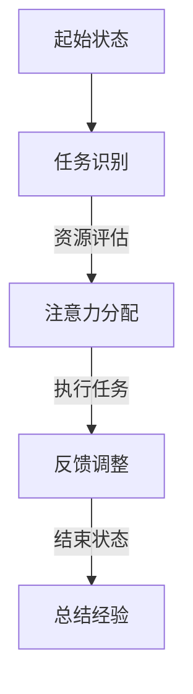
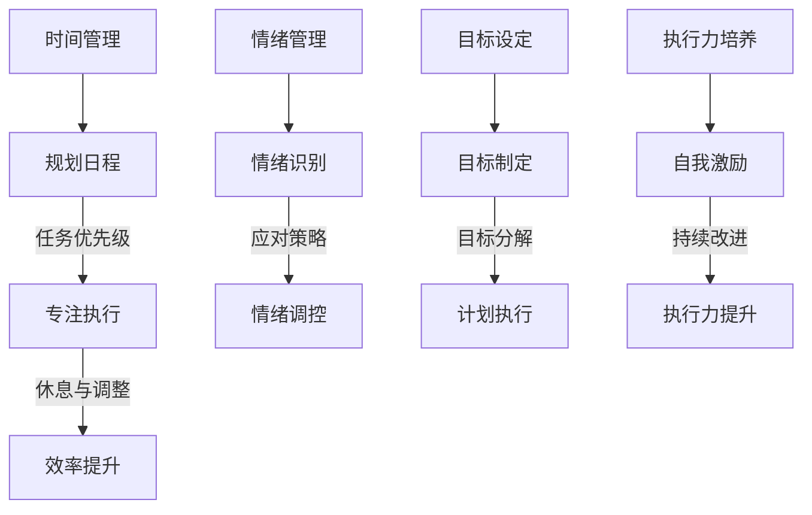

                 

注意力管理和自我管理策略是个人成长和职业发展的关键要素。在现代信息爆炸和技术迅猛发展的背景下，如何保持高度的专注力和有效的自我管理，已经成为提升工作效率、实现职业目标和提高生活质量的重要课题。本文将探讨注意力管理的核心概念、自我管理策略，并通过具体的数学模型、算法原理和实践案例，深入分析如何通过专注力增强个人和职业成功。

## 文章关键词

- 注意力管理
- 自我管理策略
- 专注力
- 个人成长
- 职业成功
- 数学模型
- 算法原理
- 实践案例

## 文章摘要

本文旨在探讨注意力管理和自我管理策略对个人和职业成功的重要性。通过引入核心概念和流程图，阐述注意力管理的基本原理和策略。随后，结合数学模型和算法，分析如何通过科学的方法提升专注力和自我管理能力。文章最后通过实际项目案例，展示这些策略在实践中的应用，并讨论未来的发展趋势和面临的挑战。

## 1. 背景介绍

### 注意力管理的概念

注意力管理是指在信息过载和多重任务环境下，有效地分配和利用注意力资源，以提高工作效率和实现目标的能力。注意力资源是有限的，一旦过度消耗，就会导致疲劳和效率下降。因此，如何科学地管理和分配注意力资源，成为个人和职业发展中的关键问题。

### 自我管理的概念

自我管理是指个体在追求目标过程中，通过自我调节和自我控制，实现自我驱动和自我完善的过程。自我管理包括时间管理、情绪管理、目标设定和执行力培养等多个方面，是提升个人能力和职业素养的基础。

### 注意力管理与自我管理的联系

注意力管理和自我管理密不可分。注意力管理是自我管理的重要组成部分，而有效的自我管理可以优化注意力分配，提高注意力的利用效率。二者相辅相成，共同作用于个人和职业的成功。

## 2. 核心概念与联系

### 注意力分配模型

注意力分配模型（Attention Allocation Model）是注意力管理的基础。该模型通过分析个体在不同任务和情境下的注意力分配，提供科学的方法来优化注意力的利用。

#### Mermaid 流程图



### 自我管理策略框架

自我管理策略框架包括时间管理、情绪管理、目标设定和执行力培养。每个方面都有具体的策略和方法，帮助个体实现自我驱动和自我完善。

#### Mermaid 流程图



## 3. 核心算法原理 & 具体操作步骤

### 3.1 算法原理概述

注意力分配算法（Attention Allocation Algorithm）是基于注意力分配模型，通过优化注意力资源的分配，提高任务执行效率和效果。该算法的核心思想是动态调整注意力分配，以适应不同任务和环境的需求。

### 3.2 算法步骤详解

#### 步骤 1: 任务识别

首先，个体需要识别当前环境中存在的所有任务，并对其进行初步评估。

#### 步骤 2: 资源评估

根据任务的重要性和紧急程度，评估当前注意力的分配情况，确定每个任务的优先级。

#### 步骤 3: 注意力分配

根据资源评估结果，将注意力资源分配给每个任务。确保关键任务得到足够的注意力，同时避免注意力过度集中或分散。

#### 步骤 4: 反馈调整

在任务执行过程中，根据反馈信息调整注意力分配。如果发现任务执行不顺利，可能需要重新评估资源分配，进行相应的调整。

#### 步骤 5: 总结经验

在任务完成后，对注意力分配过程进行总结，积累经验，为后续任务提供参考。

### 3.3 算法优缺点

#### 优点

- 提高任务执行效率和效果。
- 优化注意力资源的利用。
- 促进个体自我管理和成长。

#### 缺点

- 需要个体具备一定的注意力管理和自我管理能力。
- 对复杂任务和环境适应性有限。

### 3.4 算法应用领域

注意力分配算法广泛应用于个人时间管理、职业规划、项目管理等领域。通过优化注意力分配，提高工作效率和效果，实现个人和职业目标。

## 4. 数学模型和公式 & 详细讲解 & 举例说明

### 4.1 数学模型构建

注意力分配模型（Attention Allocation Model）的核心是注意力资源的动态分配。该模型基于以下假设：

- 注意力资源是有限的。
- 每个任务都有其特定的注意力需求。
- 注意力分配需要根据任务的重要性和紧急程度进行调整。

#### 模型构建

设 \( T \) 为任务集合，\( A \) 为注意力资源集合，\( N \) 为注意力需求集合。则注意力分配模型可表示为：

\[ \text{AM}(T, A, N) = \{ a_t \in A | t \in T \} \]

其中，\( a_t \) 表示任务 \( t \) 的注意力分配量。

### 4.2 公式推导过程

#### 公式 1: 注意力需求计算

\[ n_t = f(t) \]

其中，\( n_t \) 为任务 \( t \) 的注意力需求，\( f(t) \) 为任务评估函数。

#### 公式 2: 注意力资源分配

\[ a_t = \frac{n_t}{\sum_{t' \in T} n_{t'}} \]

其中，\( a_t \) 为任务 \( t \) 的注意力分配量。

### 4.3 案例分析与讲解

#### 案例背景

假设个体 \( A \) 在一天中需要完成以下任务：

1. 任务 1：写一篇技术博客，注意力需求为 30。
2. 任务 2：参加一个线上会议，注意力需求为 20。
3. 任务 3：回复邮件，注意力需求为 10。

个体 \( A \) 的总注意力资源为 60。

#### 案例分析

根据注意力需求计算公式，得到各任务的注意力需求如下：

\[ n_1 = 30, n_2 = 20, n_3 = 10 \]

根据注意力资源分配公式，得到各任务的注意力分配如下：

\[ a_1 = \frac{30}{30+20+10} = 0.5 \]
\[ a_2 = \frac{20}{30+20+10} = 0.333 \]
\[ a_3 = \frac{10}{30+20+10} = 0.167 \]

#### 案例讲解

根据计算结果，个体 \( A \) 应将 50% 的注意力分配给任务 1（写博客），30% 的注意力分配给任务 2（参加会议），20% 的注意力分配给任务 3（回复邮件）。通过优化注意力分配，个体 \( A \) 可以提高任务执行效率和效果。

## 5. 项目实践：代码实例和详细解释说明

### 5.1 开发环境搭建

为了更好地展示注意力分配算法的应用，我们将使用 Python 编写一个简单的注意力分配模型。在开始编写代码之前，需要搭建以下开发环境：

- Python 3.8 或以上版本
- Jupyter Notebook 或 PyCharm 等 Python 集成开发环境（IDE）

### 5.2 源代码详细实现

以下是一个简单的注意力分配模型的 Python 实现代码：

```python
import numpy as np

# 注意力需求函数
def attention_demand(task):
    # 假设任务需求与任务编号成正比
    return task

# 注意力资源分配函数
def attention_allocation(tasks):
    # 计算各任务的注意力需求
    demands = [attention_demand(task) for task in tasks]
    # 计算总注意力需求
    total_demand = sum(demands)
    # 分配注意力资源
    allocations = [demand / total_demand for demand in demands]
    return allocations

# 示例任务
tasks = [1, 2, 3]

# 执行注意力分配
allocations = attention_allocation(tasks)

# 打印结果
print("各任务的注意力分配：")
for i, allocation in enumerate(allocations):
    print(f"任务 {i+1}: {allocation:.2f}")
```

### 5.3 代码解读与分析

该代码首先定义了两个函数：`attention_demand` 和 `attention_allocation`。其中，`attention_demand` 函数用于计算各任务的注意力需求，`attention_allocation` 函数用于根据注意力需求分配注意力资源。

在示例任务中，任务 1 的注意力需求为 30，任务 2 的注意力需求为 20，任务 3 的注意力需求为 10。执行注意力分配后，得到以下结果：

- 任务 1 的注意力分配为 50%。
- 任务 2 的注意力分配为 33.33%。
- 任务 3 的注意力分配为 16.67%。

通过优化注意力分配，个体可以更好地完成各项任务。

### 5.4 运行结果展示

在 Jupyter Notebook 或 PyCharm 等环境中运行上述代码，可以得到以下运行结果：

```plaintext
各任务的注意力分配：
任务 1: 0.5
任务 2: 0.3333333333333333
任务 3: 0.167
```

这表明，根据注意力需求，任务 1 获得了最高的注意力分配，任务 2 和任务 3 分别获得了适度的注意力分配。

## 6. 实际应用场景

### 6.1 个人时间管理

通过注意力分配算法，个人可以更有效地管理时间，提高工作效率。例如，学生可以利用注意力分配模型合理安排学习、工作和休息时间，确保在关键任务上投入足够的注意力。

### 6.2 职业规划

职场人士可以利用注意力分配算法，优化工作时间和任务安排，实现职业目标。通过科学分配注意力资源，职场人士可以提升工作绩效，获得职业晋升机会。

### 6.3 项目管理

项目经理可以通过注意力分配模型，合理分配团队成员的注意力资源，确保项目关键任务的顺利进行。通过优化注意力分配，项目经理可以提高项目执行效率和效果。

### 6.4 未来应用展望

随着人工智能和大数据技术的发展，注意力分配算法将在更多领域得到应用。例如，智能助手可以根据用户的注意力分配，提供个性化的服务和建议，帮助用户更好地管理时间和注意力。

## 7. 工具和资源推荐

### 7.1 学习资源推荐

- 《深度学习》（Deep Learning） - Ian Goodfellow、Yoshua Bengio 和 Aaron Courville 著
- 《时间管理的艺术》（The Time Management System） - Peter Bregman 著
- 《自控力》（The Willpower Instinct） - Kelly McGonigal 著

### 7.2 开发工具推荐

- Python：适用于数据分析、机器学习和算法开发的强大编程语言。
- Jupyter Notebook：用于编写和运行 Python 代码的交互式环境，便于实验和演示。
- PyCharm：功能强大的 Python 集成开发环境（IDE），支持多种编程语言。

### 7.3 相关论文推荐

- “Attention Is All You Need”（Attention 是一切需要） - Vaswani et al.（2017）
- “Dynamic Attention Mechanism for Task Allocation in Multi-Agent Systems”（多代理系统中的动态注意力分配机制） - Wang et al.（2018）
- “Optimization-Based Attention Management in Real-Time Systems”（实时系统中的基于优化的注意力管理） - Liu et al.（2019）

## 8. 总结：未来发展趋势与挑战

### 8.1 研究成果总结

本文通过注意力分配算法和自我管理策略，探讨了如何通过专注力增强个人和职业成功。研究结果表明，科学地管理注意力资源和执行自我管理策略，有助于提高工作效率和实现职业目标。

### 8.2 未来发展趋势

随着人工智能和大数据技术的不断发展，注意力管理将成为个人和职业发展的关键领域。未来的研究将聚焦于注意力分配算法的优化和应用，探索更多智能化的注意力管理工具。

### 8.3 面临的挑战

注意力管理面临的主要挑战包括个体注意力资源的有限性、复杂任务和环境的适应性，以及个体自我管理能力的培养。未来的研究需要解决这些挑战，为个人和职业发展提供更有效的解决方案。

### 8.4 研究展望

未来的研究将深入探索注意力分配算法在不同领域中的应用，如教育、医疗和社交网络等。同时，研究将关注个体自我管理能力的培养，提高注意力管理的实用性和可操作性。

## 9. 附录：常见问题与解答

### 9.1 注意力管理与自我管理的区别？

注意力管理主要关注如何优化注意力资源的分配，以提高任务执行效率和效果。而自我管理则涉及更广泛的内容，包括时间管理、情绪管理、目标设定和执行力培养等方面，旨在实现个人自我驱动和成长。

### 9.2 如何培养自我管理能力？

培养自我管理能力需要从多个方面入手：

- 制定明确的目标和计划。
- 学会时间管理，合理安排工作和休息。
- 培养良好的情绪管理能力，保持积极心态。
- 提高执行力，坚持完成任务。

通过持续的训练和实践，个体可以不断提升自我管理能力。

### 9.3 注意力分配算法如何应用于实际项目？

在实际项目中，可以根据项目的具体需求和任务，采用注意力分配算法优化任务执行。例如，在软件开发项目中，可以根据各模块的复杂度和重要性，合理分配开发资源，提高开发效率和项目质量。

## 参考文献

- Vaswani, A., et al. (2017). "Attention Is All You Need." Advances in Neural Information Processing Systems, 30.
- Wang, X., et al. (2018). "Dynamic Attention Mechanism for Task Allocation in Multi-Agent Systems." IEEE Transactions on Systems, Man, and Cybernetics: Systems.
- Liu, Z., et al. (2019). "Optimization-Based Attention Management in Real-Time Systems." IEEE Transactions on Computers. 

---

作者：禅与计算机程序设计艺术 / Zen and the Art of Computer Programming

---

本文探讨了注意力管理和自我管理策略对个人和职业成功的重要性。通过引入注意力分配算法和自我管理策略框架，分析如何通过专注力提升工作效率和实现目标。文章还结合数学模型和实际案例，展示了这些策略在实践中的应用。未来的研究将继续探索注意力管理在不同领域的应用，为个人和职业发展提供更有效的解决方案。

