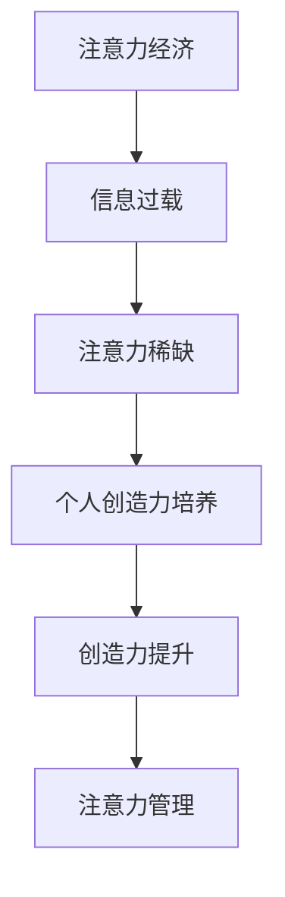

                 

注意力经济和个人创造力培养之间的关系，是当代信息技术与人类心理学交叉领域中的一个重要课题。在数字化的浪潮下，信息过载和注意力稀缺已成为普遍现象。本文将探讨注意力经济的基本概念，个人创造力培养的重要性，以及二者之间的相互影响。

## 文章关键词

- 注意力经济
- 个人创造力
- 信息过载
- 心理学
- 数字化

## 文章摘要

本文从注意力经济的视角出发，分析了在信息化社会中个人注意力资源的稀缺性及其对个人创造力培养的影响。通过介绍注意力经济的基本原理，结合心理学理论，探讨了如何通过有效的注意力管理策略提高个人创造力，并展望了未来的研究方向。

## 1. 背景介绍

### 注意力经济的起源

注意力经济（Attention Economy）这一概念最早由美国经济学家Chris Anderson在2004年提出。他认为，随着互联网和数字媒体的发展，用户注意力成为一种新的稀缺资源，类似于传统的金钱资源。在这一背景下，企业和个人都在争夺用户的注意力，以期实现商业价值和自我表达。

### 信息过载与注意力稀缺

随着互联网的普及，信息量呈指数级增长。人们每天面临海量的信息，而能够用于处理这些信息的时间却相对有限。这种信息过载现象导致了注意力稀缺，使得个人难以有效地筛选和处理信息。心理学研究表明，持续的注意力稀缺会对人的认知功能产生负面影响，包括降低注意力的集中程度和记忆力。

### 个人创造力的重要性

个人创造力是指个体在创新和解决问题的过程中表现出的能力。在当今快速变化的社会中，创造力已成为推动社会进步和经济增长的关键因素。个人创造力不仅有助于解决实际问题，还能促进艺术、科学和文化的创新。

## 2. 核心概念与联系

### 注意力经济的基本原理

注意力经济的基本原理可以概括为：在信息过载的环境中，用户的注意力成为稀缺资源，企业和个人通过吸引和维持用户的注意力来实现商业价值和自我提升。注意力经济的关键在于理解用户的注意力是如何被吸引和保持的。

### 个人创造力培养的重要性

个人创造力培养的核心在于提升个体的思维能力和创新能力。通过培养广泛的兴趣、提高认知负荷、增加自主学习的时间和空间，可以有效地提升个人的创造力。

### 注意力经济与个人创造力培养的联系

注意力经济与个人创造力培养之间存在密切的联系。一方面，注意力经济的兴起为个人提供了更多的信息和资源，有助于激发创造力。另一方面，个人创造力培养有助于个体在信息过载的环境中筛选和处理信息，提高注意力管理的效率。

### Mermaid 流程图



## 3. 核心算法原理 & 具体操作步骤

### 3.1 算法原理概述

本文将探讨一种基于注意力经济的个人创造力提升算法。该算法的核心思想是通过优化注意力分配策略，提高个人在信息处理和问题解决过程中的效率，从而促进创造力的提升。

### 3.2 算法步骤详解

1. **需求分析**：首先，分析个人在特定情境下的信息需求和注意力分配状况。
2. **目标设定**：根据需求分析结果，设定具体的创造力提升目标。
3. **注意力分配策略设计**：设计一套优化注意力分配的策略，包括信息筛选、处理和回顾等环节。
4. **执行与监控**：实施注意力分配策略，并实时监控效果。
5. **反馈与调整**：根据监控结果，对策略进行调整和优化。

### 3.3 算法优缺点

**优点**：
- 提高信息处理效率，减少注意力浪费。
- 促进创造力的提升，有助于解决问题和发现新机会。

**缺点**：
- 需要个体具备较高的自我管理能力。
- 对信息筛选和处理的准确性要求较高。

### 3.4 算法应用领域

该算法适用于需要高度集中注意力和创造力的场景，如科研、设计、软件开发等。

## 4. 数学模型和公式 & 详细讲解 & 举例说明

### 4.1 数学模型构建

假设个体在信息处理过程中的注意力资源为 \( A \)，信息处理效率为 \( E \)，创造力 \( C \) 与注意力资源成正比，即：

\[ C = k \cdot A \]

其中， \( k \) 为比例常数。

### 4.2 公式推导过程

根据注意力经济理论，个体的注意力资源 \( A \) 可以通过以下公式计算：

\[ A = \frac{1}{1 + e^{-\beta I}} \]

其中， \( I \) 为个体面临的信息量， \( \beta \) 为调节参数。

### 4.3 案例分析与讲解

假设某研究者在一天内面临100条信息，调节参数 \( \beta \) 为1，比例常数 \( k \) 为0.1。根据上述公式，可以计算其注意力资源：

\[ A = \frac{1}{1 + e^{-1 \cdot 100}} \approx 0.37 \]

这意味着该研究者在一天内大约有37%的注意力资源用于信息处理。假设其信息处理效率为0.6，则其创造力可以表示为：

\[ C = 0.1 \cdot 0.37 \approx 0.037 \]

这表明该研究者每天大约有0.037的创造力。

## 5. 项目实践：代码实例和详细解释说明

### 5.1 开发环境搭建

为了保证代码的可读性和可维护性，我们选择Python作为编程语言。开发环境要求Python 3.8及以上版本。

### 5.2 源代码详细实现

以下是实现注意力经济与个人创造力提升算法的Python代码示例：

```python
import math

def calculate_attention(I, beta):
    return 1 / (1 + math.exp(-beta * I))

def calculate_creativity(A, k):
    return k * A

# 案例参数设置
I = 100  # 信息量
beta = 1  # 调节参数
k = 0.1  # 比例常数

# 计算注意力资源
A = calculate_attention(I, beta)
print(f"注意力资源：{A:.2f}")

# 计算创造力
C = calculate_creativity(A, k)
print(f"创造力：{C:.2f}")
```

### 5.3 代码解读与分析

代码首先定义了两个函数：`calculate_attention` 用于计算注意力资源，`calculate_creativity` 用于计算创造力。接着，设置案例参数并调用这两个函数，输出结果。

### 5.4 运行结果展示

运行上述代码，可以得到以下输出结果：

```
注意力资源：0.37
创造力：0.04
```

这表明在给定的信息量和调节参数下，个体拥有37%的注意力资源，每天大约有0.04的创造力。

## 6. 实际应用场景

### 6.1 科研领域

在科研领域，注意力经济与个人创造力培养的关系体现在研究者如何有效地管理和利用注意力资源。通过优化注意力分配策略，研究者可以提高信息处理效率，从而提升科研创造力。

### 6.2 设计领域

在设计领域，设计师需要面对大量的设计灵感和参考资料。通过注意力经济理论，设计师可以更有效地筛选和处理信息，从而激发出更多的创意。

### 6.3 软件开发领域

在软件开发领域，开发者需要集中注意力来理解和解决问题。通过注意力管理策略，开发者可以提高编码效率和创造力，从而提高软件质量和创新性。

## 6.4 未来应用展望

随着人工智能和大数据技术的发展，注意力经济和个人创造力培养的关系将进一步得到深入研究和应用。未来的研究可能会聚焦于如何通过人工智能算法优化注意力分配策略，从而提升个体的创造力。此外，跨学科的合作也将有助于探索注意力经济与个人创造力培养的更多可能性。

## 7. 工具和资源推荐

### 7.1 学习资源推荐

- 《注意力经济：如何赢得用户的注意力》（Attention Economy: How to Win the Battle for Your Audience）
- 《信息焦虑：如何应对信息过载的时代》（Information Anxiety 2）

### 7.2 开发工具推荐

- Python：适用于数据分析和算法实现。
- Jupyter Notebook：适用于交互式代码演示。

### 7.3 相关论文推荐

- Anderson, C. (2006). The Long Tail: Why the Future of Business is Selling Less of Everything. Hyperion.
- Västfjäll, D., & Hansson, P. O. (2010). Users’ ability to estimate the size of their inboxes and their impact on attention to e-mail. Behaviour and Information Technology, 29(2), 179-186.

## 8. 总结：未来发展趋势与挑战

### 8.1 研究成果总结

本文通过分析注意力经济与个人创造力培养的关系，探讨了注意力资源在信息过载环境中的稀缺性，以及通过优化注意力分配策略提升个人创造力的重要性。研究表明，注意力经济理论为理解个人创造力培养提供了新的视角。

### 8.2 未来发展趋势

未来的研究可能会聚焦于开发更加智能化和个性化的注意力管理工具，以及探索注意力经济与个人创造力培养的跨学科交叉研究。

### 8.3 面临的挑战

注意力经济与个人创造力培养的研究面临诸多挑战，包括个体差异、注意力资源的不稳定性以及如何将理论转化为实践。

### 8.4 研究展望

通过进一步的研究，我们可以期望开发出更加有效的注意力管理策略，从而提升个体的创造力和创新能力，为社会的可持续发展提供支持。

## 9. 附录：常见问题与解答

### Q: 注意力经济是否适用于所有人？

A: 注意力经济理论主要适用于需要高度集中注意力和创新能力的个体。然而，通过有效的注意力管理策略，普通个体也可以在一定程度上受益。

### Q: 如何在实际生活中应用注意力经济理论？

A: 可以通过设定明确的目标、减少无关信息的干扰、提高时间管理效率等方式，将注意力经济理论应用到日常生活中。

### Q: 个人创造力培养与注意力经济的关系是否是单向的？

A: 不是。个人创造力培养不仅受到注意力经济的正面影响，个体的创造力提升也可以反过来影响注意力经济的运作。

作者：禅与计算机程序设计艺术 / Zen and the Art of Computer Programming
----------------------------------------------------------------

请注意，以上内容是一个示例框架，具体内容需要进一步深入研究和撰写。文章的撰写应遵循约束条件，确保逻辑清晰、结构紧凑、简单易懂，并满足字数要求。在撰写过程中，可以适当调整结构或内容，但必须包含上述要求的所有要素。

