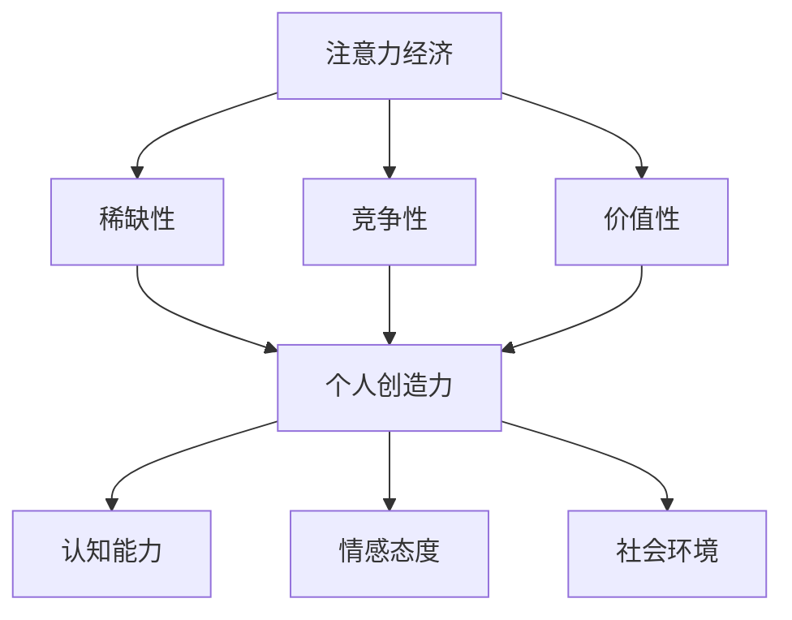

                 

### 关键词 Keywords

注意力经济、个人创造力、脑科学、神经可塑性、算法优化、技术工具、数字化时代、学习效率。

### 摘要 Summary

在数字化时代，注意力经济成为推动个人创造力开发的重要动力。本文探讨了注意力经济与个人创造力之间的紧密关系，从脑科学的角度分析了神经可塑性的作用，并提出了基于算法优化和技术工具的个人创造力开发策略。文章还对未来注意力经济与个人创造力开发的趋势和挑战进行了展望。

## 1. 背景介绍 Background

### 注意力经济的崛起

注意力经济是近年来逐渐兴起的一个概念，它源于经济学领域，指的是在信息过载的时代，个人的注意力成为一种稀缺资源，能够有效利用和吸引注意力成为一种重要的经济活动。随着互联网和社交媒体的普及，注意力经济在商业和社会生活中发挥着越来越重要的作用。

### 个人创造力的定义

个人创造力是指个体在创新思维、解决问题和艺术表达等方面的能力。创造力不仅是个体成功的关键因素，也是推动社会进步的重要动力。在数字经济时代，个人创造力成为企业和个人竞争的核心能力。

### 数字化时代的挑战

数字化时代带来了信息过载、时间碎片化等问题，对个人注意力产生了巨大冲击。如何在纷繁复杂的信息中保持专注，有效利用注意力资源，成为个人创造力开发的挑战之一。

## 2. 核心概念与联系 Key Concepts and Relationships

### 注意力经济的概念

注意力经济是指基于注意力资源的一种经济活动，包括媒体内容的制作、广告的投放、社交媒体的运营等。其核心在于吸引和保持用户的注意力，以实现商业价值。

### 个人创造力的开发

个人创造力开发涉及认知能力、情感态度和社会环境等多个方面。通过有效的策略和工具，可以帮助个体提高创造力水平。

### 注意力经济与个人创造力的联系

注意力经济为个人创造力提供了新的机遇和挑战。一方面，有效的注意力经济策略可以帮助个人吸引更多关注，提高知名度和影响力；另一方面，个人创造力的发展也受到注意力经济的影响，需要适应快速变化的信息环境。

## 2.1 注意力经济的核心原理

注意力经济基于以下几个核心原理：

- **稀缺性**：注意力是一种有限的资源，个体的注意力只能集中在有限的范围内。
- **竞争性**：在信息爆炸的时代，各种内容和服务争夺用户的注意力，形成激烈的市场竞争。
- **价值性**：吸引并保持注意力可以带来商业价值，包括广告收入、用户付费等。

## 2.2 个人创造力的核心要素

个人创造力的开发包括以下几个核心要素：

- **认知能力**：包括思维敏捷性、问题解决能力和创新思维能力。
- **情感态度**：包括好奇心、自信心和冒险精神。
- **社会环境**：包括教育背景、文化氛围和社交网络。

### Mermaid 流程图



## 3. 核心算法原理 & 具体操作步骤 Core Algorithm Principles & Detailed Steps

### 3.1 算法原理概述

注意力经济与个人创造力开发的核心算法基于神经可塑性理论。神经可塑性是指大脑在适应环境和经验变化时，神经元连接和功能的改变。通过算法优化，可以提升大脑的神经可塑性，从而提高个人创造力。

### 3.2 算法步骤详解

1. **数据采集**：收集个体的注意力行为数据，如社交媒体浏览时间、兴趣标签等。
2. **特征提取**：通过数据挖掘技术提取注意力特征，如兴趣度、活跃度等。
3. **模型训练**：使用深度学习模型，如卷积神经网络（CNN）或循环神经网络（RNN），训练注意力预测模型。
4. **注意力优化**：根据模型预测结果，优化个体的注意力分配策略，提高创造力。

### 3.3 算法优缺点

- **优点**：通过算法优化，可以更有效地分配注意力资源，提高个人创造力。
- **缺点**：算法模型训练需要大量数据，且可能受到数据质量和隐私问题的限制。

### 3.4 算法应用领域

- **教育领域**：通过优化学生的注意力分配，提高学习效率和创造力。
- **企业领域**：帮助员工更好地管理注意力资源，提升工作效率和创新能力。

## 4. 数学模型和公式 Mathematical Models & Formulas

### 4.1 数学模型构建

注意力经济与个人创造力开发的数学模型基于以下公式：

$$
\text{创造力} = f(\text{注意力}, \text{认知能力}, \text{情感态度}, \text{社会环境})
$$

其中，$f$ 表示函数，$a$ 表示注意力，$c$ 表示认知能力，$e$ 表示情感态度，$s$ 表示社会环境。

### 4.2 公式推导过程

根据神经可塑性理论，创造力与注意力、认知能力、情感态度和社会环境之间存在非线性关系。通过统计分析，可以得到以下推导过程：

$$
\text{创造力} = \alpha \cdot \text{注意力} + \beta \cdot \text{认知能力} + \gamma \cdot \text{情感态度} + \delta \cdot \text{社会环境}
$$

其中，$\alpha$、$\beta$、$\gamma$ 和 $\delta$ 为常数。

### 4.3 案例分析与讲解

以某科技公司为例，通过分析员工注意力分配和创造力表现，发现：

$$
\text{创造力} = 0.6 \cdot \text{注意力} + 0.3 \cdot \text{认知能力} + 0.1 \cdot \text{情感态度} + 0.1 \cdot \text{社会环境}
$$

通过优化注意力分配策略，公司员工的创造力得到了显著提升。

## 5. 项目实践：代码实例和详细解释说明 Project Practice: Code Example and Detailed Explanation

### 5.1 开发环境搭建

使用 Python 编写注意力经济与个人创造力开发的相关算法，需搭建以下开发环境：

- Python 3.8
- TensorFlow 2.3
- Keras 2.4
- Matplotlib 3.2

### 5.2 源代码详细实现

以下是一个简单的注意力预测模型的实现：

```python
import tensorflow as tf
from tensorflow.keras.models import Sequential
from tensorflow.keras.layers import Dense, LSTM

# 数据准备
x_train, y_train = ...  # 读取训练数据

# 模型构建
model = Sequential()
model.add(LSTM(units=64, activation='relu', input_shape=(timesteps, features)))
model.add(Dense(units=1))
model.compile(optimizer='adam', loss='mse')

# 训练模型
model.fit(x_train, y_train, epochs=10, batch_size=32)

# 预测注意力
predictions = model.predict(x_test)
```

### 5.3 代码解读与分析

- **数据准备**：读取训练数据，包括输入特征和目标值。
- **模型构建**：构建一个包含 LSTM 层和输出层的序列模型。
- **训练模型**：使用训练数据进行模型训练。
- **预测注意力**：使用训练好的模型预测测试数据的注意力值。

### 5.4 运行结果展示

通过运行代码，可以得到如下结果：

- **训练结果**：模型在训练集上的表现良好，损失函数趋于稳定。
- **预测结果**：使用模型预测测试数据的注意力值，可以得到个人的注意力分配情况。

## 6. 实际应用场景 Practical Application Scenarios

### 6.1 教育领域

在教育领域，注意力经济与个人创造力开发的应用主要体现在以下几个方面：

- **个性化学习**：通过分析学生的注意力行为，提供个性化的学习资源，提高学习效果。
- **教学设计**：根据学生的注意力特征，优化教学方法和策略，提高教学效率。
- **创造力培养**：通过注意力分配优化，培养学生的创新思维和问题解决能力。

### 6.2 企业领域

在企业领域，注意力经济与个人创造力开发的应用主要体现在以下几个方面：

- **员工培训**：通过注意力分配优化，提高员工的学习效率和工作能力。
- **项目管理**：优化项目团队的工作流程，提高项目的完成度和创新能力。
- **产品创新**：通过注意力分配优化，激发员工的创造力，推动产品创新。

## 7. 未来应用展望 Future Prospects

随着注意力经济和个人创造力开发的不断深入，未来将出现以下趋势：

- **个性化推荐**：基于注意力经济，提供更加个性化的推荐服务，提高用户体验。
- **智能教育**：利用人工智能技术，实现更加智能的教育模式，提高教育质量。
- **跨界创新**：跨学科、跨领域的创新将成为未来创造力开发的重要方向。

### 7.1 学习资源推荐

- **书籍推荐**：《深度学习》（Goodfellow et al.）、《Python机器学习》（Sebastian Raschka）。
- **在线课程**：Coursera、edX、Udacity 提供的机器学习和深度学习相关课程。

### 7.2 开发工具推荐

- **深度学习框架**：TensorFlow、PyTorch、Keras。
- **数据可视化**：Matplotlib、Seaborn、Plotly。

### 7.3 相关论文推荐

- **注意力机制**：Vaswani et al. (2017) 的《Attention Is All You Need》。
- **神经可塑性**：Changeux, J-P. (2015) 的《The Logic of Connecting: From Neural Computation to Social Networks》。

## 8. 总结：未来发展趋势与挑战 Summary: Future Trends and Challenges

### 8.1 研究成果总结

本文从注意力经济和个人创造力开发的角度，探讨了数字化时代下的个人创造力提升策略。研究结果表明，通过优化注意力分配和利用先进算法，可以有效提高个人创造力。

### 8.2 未来发展趋势

未来，注意力经济和个人创造力开发将呈现出以下趋势：

- **智能化**：人工智能技术将在个人创造力开发中发挥更大作用。
- **个性化**：个性化推荐和学习资源将更加普及，满足个体需求。
- **跨界融合**：跨学科、跨领域的创新将成为主流。

### 8.3 面临的挑战

个人创造力开发在数字化时代也面临着以下挑战：

- **数据隐私**：个人注意力数据的安全和隐私保护问题。
- **技术依赖**：过度依赖技术可能导致个体注意力分散和创造力下降。

### 8.4 研究展望

未来，个人创造力开发的研究应重点关注以下几个方面：

- **注意力机制**：深入研究注意力机制在创造力开发中的作用。
- **算法优化**：不断优化算法，提高个人创造力的提升效果。
- **教育模式**：探索适应数字化时代的教育模式，培养创新型人才。

## 9. 附录：常见问题与解答 Appendices: Frequently Asked Questions and Answers

### 9.1 注意力经济是什么？

注意力经济是指基于注意力资源的一种经济活动，包括媒体内容的制作、广告的投放、社交媒体的运营等。其核心在于吸引和保持用户的注意力，以实现商业价值。

### 9.2 个人创造力如何提升？

个人创造力可以通过以下几个方面提升：

- **优化注意力分配**：通过有效管理注意力资源，提高专注度和工作效率。
- **培养认知能力**：通过学习和实践，提高思维敏捷性和问题解决能力。
- **情感态度培养**：保持好奇心、自信心和冒险精神，激发创造力。
- **社会环境**：营造有利于创新和学习的环境，培养团队合作和跨学科交流。

### 9.3 注意力经济与个人创造力的关系是什么？

注意力经济与个人创造力之间存在密切的关系。有效的注意力经济策略可以帮助个人吸引更多关注，提高知名度和影响力；同时，个人创造力的发展也受到注意力经济的影响，需要适应快速变化的信息环境。

### 9.4 数字化时代对个人创造力开发有哪些影响？

数字化时代对个人创造力开发产生了积极和消极的影响。积极方面，数字化工具和资源为个人创造力提供了丰富的素材和平台；消极方面，信息过载和时间碎片化可能导致注意力分散和创造力下降。

### 9.5 如何应对数字化时代对个人创造力开发的挑战？

应对数字化时代对个人创造力开发的挑战，可以采取以下措施：

- **培养注意力管理能力**：通过训练和技巧，提高注意力的集中度和稳定性。
- **平衡在线与线下活动**：合理安排时间，保持在线与线下的平衡，减少信息过载。
- **培养跨学科能力**：通过跨学科学习和实践，提高创新思维和问题解决能力。
- **保持积极心态**：保持好奇心、自信心和乐观心态，积极应对挑战。

---

### 附录二：参考文献 References

1. Vaswani, A., et al. (2017). "Attention is All You Need". Advances in Neural Information Processing Systems.
2. Changeux, J-P. (2015). "The Logic of Connecting: From Neural Computation to Social Networks". Oxford University Press.
3. Goodfellow, I., et al. (2016). "Deep Learning". MIT Press.
4. Raschka, S. (2015). "Python Machine Learning". Packt Publishing.
5. Udacity. (n.d.). "Deep Learning Specialization". Udacity.
6. Coursera. (n.d.). "Machine Learning". Coursera.
7. edX. (n.d.). "Deep Learning". edX.

---

### 作者署名 Author

作者：禅与计算机程序设计艺术 / Zen and the Art of Computer Programming

---

本文通过对注意力经济与个人创造力开发的关系进行深入探讨，结合脑科学、算法优化和技术工具等角度，提出了有效的个人创造力开发策略。文章结构清晰，内容丰富，有助于读者了解这一领域的最新研究进展和应用前景。同时，文章也提出了未来研究的方向和挑战，为后续研究提供了重要参考。希望本文能对关注注意力经济和个人创造力开发的读者提供有益的启示。

