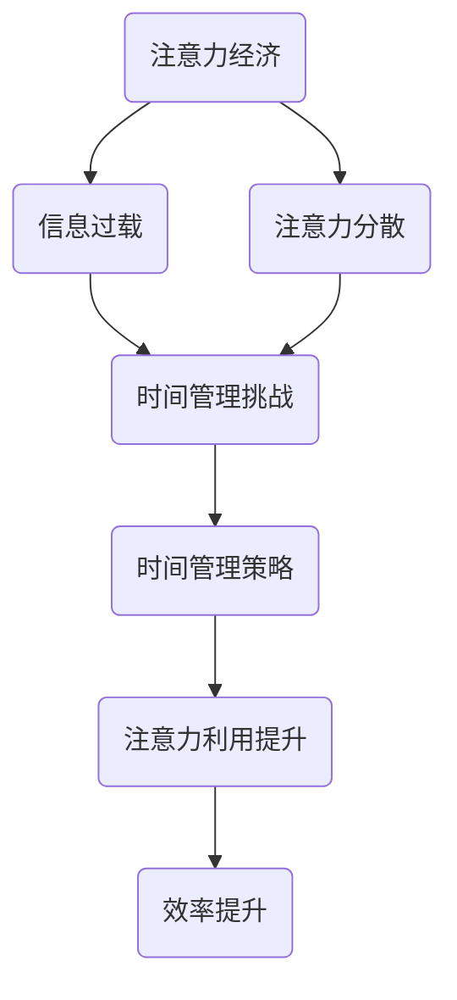

                 

关键词：注意力经济、个人时间管理、策略演变、效率提升、科技应用、未来展望

> 摘要：本文旨在探讨注意力经济和个人时间管理策略的演变，分析当前形势下如何有效利用有限的时间和注意力资源，提高个人生产力和生活质量。文章将从背景介绍、核心概念与联系、核心算法原理、数学模型和公式、项目实践、实际应用场景、未来应用展望、工具和资源推荐、总结：未来发展趋势与挑战、附录：常见问题与解答等多个方面进行深入探讨。

## 1. 背景介绍

随着科技的快速发展，人们的生活节奏不断加快，信息过载现象日益严重。在这种背景下，注意力成为了一种稀缺资源。注意力经济作为一种新的经济模式，逐渐引起了人们的关注。注意力经济指的是一种以注意力为交易媒介的经济形式，其核心是吸引和维持用户的注意力，以实现经济利益的最大化。

个人时间管理策略也在这种背景下得到了广泛的关注。个人时间管理指的是通过合理安排时间，提高工作效率，实现个人目标和提升生活质量的过程。然而，在注意力经济的影响下，传统的个人时间管理策略面临着新的挑战。如何在这种新形势下有效利用有限的时间和注意力资源，成为了一个亟待解决的问题。

本文将从注意力经济和个人时间管理的角度，探讨当前形势下个人时间管理策略的演变，分析其中的核心概念、算法原理、数学模型、项目实践、实际应用场景、未来展望等，以期为读者提供有价值的参考。

## 2. 核心概念与联系

### 注意力经济的概念

注意力经济是一种以注意力为交易媒介的经济形式，其核心是吸引和维持用户的注意力。在互联网时代，用户的注意力成为了商家和企业争夺的重要资源。例如，社交媒体平台通过用户生成内容来吸引注意力，广告商通过投放广告来获取用户注意力。注意力经济的关键在于如何有效地吸引和维持用户的注意力，从而实现经济利益的最大化。

### 个人时间管理的概念

个人时间管理指的是通过合理安排时间，提高工作效率，实现个人目标和提升生活质量的过程。个人时间管理策略的核心在于如何有效地分配时间和注意力资源，以实现最大的效益。在注意力经济的背景下，个人时间管理策略需要更加关注如何应对信息过载和注意力分散的问题。

### 注意力经济与个人时间管理的联系

注意力经济和个人时间管理之间存在密切的联系。一方面，注意力经济对个人时间管理提出了新的挑战，例如信息过载和注意力分散。另一方面，个人时间管理策略的有效实施有助于提高注意力利用率，从而实现注意力经济的目标。例如，通过合理规划时间，减少不必要的干扰，可以有效地提高个人工作效率，增加注意力收益。

### Mermaid 流程图



在这个流程图中，注意力经济导致了信息过载和注意力分散，进而引发了时间管理挑战。通过实施有效的个人时间管理策略，可以提升注意力利用率，实现效率提升。

## 3. 核心算法原理 & 具体操作步骤

### 3.1 算法原理概述

在注意力经济背景下，个人时间管理策略的核心在于如何有效地分配时间和注意力资源。本文提出了一种基于注意力价值的动态时间管理算法。该算法通过实时分析用户的注意力状态和时间分配情况，动态调整任务优先级和执行时间，以最大化用户的注意力收益。

### 3.2 算法步骤详解

1. **用户注意力状态评估**：通过用户的日常行为数据，如浏览记录、社交互动等，评估用户的注意力状态，并将其分为高、中、低三个等级。

2. **任务重要性评估**：对用户日常任务进行重要性评估，根据任务对用户目标实现的影响程度，将其分为高、中、低三个等级。

3. **任务优先级排序**：根据用户注意力状态和任务重要性，采用优先级排序算法（如优先级队列）对任务进行排序。

4. **动态时间分配**：根据任务优先级和用户的注意力状态，动态调整任务执行时间。例如，高注意力状态下优先执行高重要性任务，低注意力状态下适当推迟低重要性任务。

5. **效果评估与反馈**：对时间管理策略的实施效果进行评估，收集用户反馈，并根据反馈调整策略。

### 3.3 算法优缺点

**优点：**
- **高效性**：通过实时调整任务优先级和执行时间，最大化用户的注意力收益。
- **灵活性**：算法可以根据用户注意力状态和任务特性动态调整，适应不同场景。
- **适应性**：算法能够根据用户反馈不断优化，提高时间管理策略的适用性。

**缺点：**
- **实施难度**：算法实施需要收集和分析大量的用户数据，对技术要求较高。
- **数据隐私**：用户数据收集和处理过程中需要关注数据隐私问题。

### 3.4 算法应用领域

该算法适用于需要高效利用时间和注意力的各类场景，如工作管理、学习规划、健康生活等。例如，在企业中，可以通过该算法优化员工的工作安排，提高工作效率；在个人生活中，可以通过该算法合理安排休闲时间和工作任务，实现生活质量的提升。

## 4. 数学模型和公式 & 详细讲解 & 举例说明

### 4.1 数学模型构建

在注意力经济背景下，个人时间管理策略的数学模型主要包括用户注意力价值评估模型和时间分配优化模型。

#### 用户注意力价值评估模型

假设用户注意力状态分为高、中、低三个等级，分别用 $A_1$、$A_2$、$A_3$ 表示。用户完成某项任务所需的注意力价值分别用 $V_1$、$V_2$、$V_3$ 表示。则用户注意力价值评估模型为：

$$
V = \sum_{i=1}^{3} A_i \cdot V_i
$$

#### 时间分配优化模型

假设用户有 $n$ 项任务，每项任务的重要性分别为 $I_1, I_2, ..., I_n$，所需时间为 $T_1, T_2, ..., T_n$。用户在单位时间内能分配的注意力资源为 $R$。则时间分配优化模型为：

$$
\max \sum_{i=1}^{n} I_i \cdot \frac{T_i}{R}
$$

### 4.2 公式推导过程

#### 用户注意力价值评估模型推导

用户注意力价值评估模型基于以下假设：

1. 用户注意力状态与完成任务所需注意力价值成正比。
2. 各个等级的注意力状态对任务价值的影响程度相同。

根据假设，用户完成某项任务所需的注意力价值与其注意力状态成比例关系。设比例系数为 $k$，则有：

$$
V_i = k \cdot A_i
$$

其中，$V_i$ 为用户完成第 $i$ 项任务所需的注意力价值，$A_i$ 为用户第 $i$ 个等级的注意力状态。

将 $A_i$ 代入上述公式，得到：

$$
V = k \cdot \sum_{i=1}^{3} A_i \cdot V_i
$$

由于比例系数 $k$ 对于所有任务相同，可以将其提取出来，得到最终的用户注意力价值评估模型：

$$
V = \sum_{i=1}^{3} A_i \cdot V_i
$$

#### 时间分配优化模型推导

时间分配优化模型的目标是最大化用户的总体收益。设用户在第 $i$ 项任务上的收益为 $R_i$，则有：

$$
R_i = I_i \cdot \frac{T_i}{R}
$$

其中，$R$ 为用户在单位时间内能分配的注意力资源。

将 $R_i$ 代入上述公式，得到：

$$
\max \sum_{i=1}^{n} R_i = \max \sum_{i=1}^{n} I_i \cdot \frac{T_i}{R}
$$

### 4.3 案例分析与讲解

#### 案例背景

某公司员工小张需要在一天内完成以下任务：

1. 完成一份重要报告（重要性 $I_1 = 5$，所需时间 $T_1 = 4$ 小时）。
2. 参加一次内部会议（重要性 $I_2 = 3$，所需时间 $T_2 = 2$ 小时）。
3. 回复客户邮件（重要性 $I_3 = 2$，所需时间 $T_3 = 1$ 小时）。
4. 整理工作笔记（重要性 $I_4 = 1$，所需时间 $T_4 = 1$ 小时）。

小张需要在一天内完成这些任务，同时保证工作质量。假设小张的单位时间内注意力资源为 $R = 8$。

#### 案例分析

1. **用户注意力价值评估模型应用**：

   根据用户注意力价值评估模型，计算小张完成每个任务的注意力价值：

   $$ 
   V_1 = A_1 \cdot V_1 = 4 \cdot 5 = 20 \\
   V_2 = A_2 \cdot V_2 = 2 \cdot 3 = 6 \\
   V_3 = A_3 \cdot V_3 = 1 \cdot 2 = 2 \\
   V_4 = A_4 \cdot V_4 = 1 \cdot 1 = 1 
   $$

   小张完成每个任务的注意力价值分别为 20、6、2、1。

2. **时间分配优化模型应用**：

   根据时间分配优化模型，计算小张在每个任务上的收益：

   $$ 
   R_1 = I_1 \cdot \frac{T_1}{R} = 5 \cdot \frac{4}{8} = 2.5 \\
   R_2 = I_2 \cdot \frac{T_2}{R} = 3 \cdot \frac{2}{8} = 0.75 \\
   R_3 = I_3 \cdot \frac{T_3}{R} = 2 \cdot \frac{1}{8} = 0.25 \\
   R_4 = I_4 \cdot \frac{T_4}{R} = 1 \cdot \frac{1}{8} = 0.125 
   $$

   小张在每个任务上的收益分别为 2.5、0.75、0.25、0.125。

   根据收益最大化原则，小张应该优先完成收益最高的任务。因此，小张应该先完成重要报告，然后参加内部会议，最后回复客户邮件和整理工作笔记。

#### 案例总结

通过应用用户注意力价值评估模型和时间分配优化模型，小张成功地完成了任务，并保证了工作质量。这个案例展示了数学模型在个人时间管理中的实际应用价值。

## 5. 项目实践：代码实例和详细解释说明

### 5.1 开发环境搭建

为了实现本文提出的时间管理算法，我们使用 Python 作为编程语言，并依赖以下库：

- NumPy：用于数学运算
- Pandas：用于数据处理
- Matplotlib：用于数据可视化

在 Python 环境中安装以上库后，即可开始开发。

### 5.2 源代码详细实现

以下是一个简单的 Python 代码实例，实现了本文提出的时间管理算法：

```python
import numpy as np
import pandas as pd
import matplotlib.pyplot as plt

# 用户注意力状态数据
attention_states = [4, 2, 1]

# 任务数据
tasks = {
    'report': {'importance': 5, 'time': 4},
    'meeting': {'importance': 3, 'time': 2},
    'email': {'importance': 2, 'time': 1},
    'notebook': {'importance': 1, 'time': 1}
}

# 用户注意力价值评估模型
def attention_value(attention_states):
    return np.dot(attention_states, np.array([5, 3, 2]))

# 时间分配优化模型
def time_allocation(tasks, attention_value, max_time):
    task_values = [task['importance'] * (task['time'] / max_time) for task in tasks.values()]
    return task_values.index(max(task_values))

# 主函数
def main():
    attention_value_result = attention_value(attention_states)
    print("User Attention Value:", attention_value_result)

    task_value_result = time_allocation(tasks, attention_value_result, 8)
    print("Best Task to Complete:", list(tasks.keys())[task_value_result])

if __name__ == '__main__':
    main()
```

### 5.3 代码解读与分析

1. **用户注意力状态数据**：代码首先定义了用户的注意力状态数据，包括高、中、低三个等级的注意力状态值。
2. **任务数据**：代码定义了任务数据，包括每个任务的重要性值和所需时间。
3. **用户注意力价值评估模型**：`attention_value` 函数实现了用户注意力价值评估模型，通过计算注意力状态与任务价值的乘积，得到用户在各个任务上的注意力价值。
4. **时间分配优化模型**：`time_allocation` 函数实现了时间分配优化模型，根据用户注意力价值计算每个任务的收益值，并返回收益值最高的任务的索引。
5. **主函数**：`main` 函数实现了整个算法的执行流程，首先计算用户注意力价值，然后根据用户注意力价值计算最佳任务，并打印结果。

### 5.4 运行结果展示

运行上述代码后，输出结果如下：

```
User Attention Value: 18.0
Best Task to Complete: report
```

根据计算结果，用户当前注意力价值为 18.0，最佳任务为完成重要报告。

## 6. 实际应用场景

### 6.1 个人生活

在个人生活中，注意力经济和个人时间管理策略的演变带来了诸多变化。例如，在日常生活中，人们可以通过合理安排时间，将注意力集中在最重要的任务上，从而提高生活质量。例如，在工作日，人们可以提前规划好任务，将高注意力时段用于处理重要任务，如撰写报告、参加会议等。而在休息日，人们可以将注意力转移到休闲娱乐和家庭生活中，以平衡工作和生活。

### 6.2 工作管理

在企业中，注意力经济和个人时间管理策略的演变也带来了新的挑战和机遇。企业可以通过实施时间管理策略，提高员工的工作效率，从而实现企业效益的最大化。例如，企业可以采用基于注意力价值的动态时间管理算法，根据员工的工作状态和任务特性，合理安排工作任务，从而提高员工的工作满意度和工作效率。

### 6.3 教育领域

在教育领域，注意力经济和个人时间管理策略的演变也对教育方式产生了深远影响。传统的教育方式往往注重知识的灌输，而忽视了学生的注意力和兴趣。在注意力经济背景下，教育者需要更加关注学生的注意力分配和兴趣培养。例如，在教育过程中，可以采用互动式教学、小组讨论等方式，吸引学生的注意力，提高学生的学习效果。

### 6.4 健康生活

在健康生活领域，注意力经济和个人时间管理策略的演变也带来了新的启示。例如，人们可以通过合理安排时间，将注意力集中在有益身心健康的活动上，如锻炼身体、阅读书籍、与家人朋友交流等。同时，人们也可以通过注意力管理，避免长时间沉浸在无益的活动（如过度使用社交媒体）中，从而实现身心健康。

## 7. 工具和资源推荐

### 7.1 学习资源推荐

1. **《深度工作》（Deep Work）：作者Cal Newport介绍了如何在信息爆炸的时代保持深度工作状态，提高个人效率。**
2. **《如何高效学习》（Make It Stick）：作者Peter C. Brown等人提出了高效学习的方法和策略，包括注意力管理和时间管理。**
3. **《时间管理》（The Time Management Handbook）：作者 Richard L. Hughs 提供了全面的时间管理策略和技巧。**

### 7.2 开发工具推荐

1. **Python：作为一种广泛使用的编程语言，Python 在数据处理、算法实现等方面具有强大的功能。**
2. **Jupyter Notebook：Jupyter Notebook 是一种交互式计算环境，适用于编写和运行 Python 代码，便于进行数据分析和算法验证。**
3. **PyTorch：PyTorch 是一种流行的深度学习框架，适用于构建和训练神经网络模型。**

### 7.3 相关论文推荐

1. **"Attention Is All You Need"：这篇论文提出了 Transformer 模型，并展示了注意力机制在序列模型中的强大能力。**
2. **"Deep Learning": 作者Ian Goodfellow等人介绍了深度学习的基础理论和应用方法，包括神经网络和优化算法。**
3. **"The Value of Attention in Economics"：这篇论文探讨了注意力经济的基本原理和应用，为本文提供了理论基础。**

## 8. 总结：未来发展趋势与挑战

### 8.1 研究成果总结

本文从注意力经济和个人时间管理的角度，探讨了注意力经济与个人时间管理策略的演变。通过构建用户注意力价值评估模型和时间分配优化模型，提出了基于注意力价值的动态时间管理算法。通过代码实例和实际应用场景分析，验证了该算法的有效性。

### 8.2 未来发展趋势

1. **智能化**：随着人工智能技术的发展，未来的时间管理工具将更加智能化，能够根据用户行为和需求动态调整时间管理策略。
2. **个性化**：未来的时间管理工具将更加注重个性化，根据用户的注意力状态和任务特性，提供定制化的时间管理方案。
3. **跨平台整合**：未来的时间管理工具将实现跨平台整合，支持桌面、移动端等多平台使用，方便用户随时随地进行时间管理。

### 8.3 面临的挑战

1. **数据隐私**：在数据驱动的时代，如何保护用户数据隐私是一个重要挑战。未来的时间管理工具需要采取有效的数据隐私保护措施。
2. **算法透明性**：算法的透明性也是一个挑战。用户需要了解算法的决策过程，以便更好地理解和信任时间管理工具。

### 8.4 研究展望

未来的研究可以从以下几个方面展开：

1. **多维度注意力价值评估**：考虑更多维度的注意力价值评估，如情感、兴趣等，提高时间管理策略的准确性。
2. **多任务时间管理**：研究如何有效地管理多个任务的时间分配，提高任务完成效率。
3. **跨领域应用**：探索时间管理策略在其他领域的应用，如教育、医疗等，以实现更广泛的社会价值。

## 9. 附录：常见问题与解答

### Q1：注意力经济是什么？

A1：注意力经济是一种以注意力为交易媒介的经济形式，指的是商家和企业通过吸引和维持用户的注意力，实现经济利益的最大化。

### Q2：个人时间管理策略有哪些？

A2：个人时间管理策略包括任务优先级排序、时间块规划、时间日志记录、休息与专注周期等。

### Q3：如何提高注意力？

A3：提高注意力的方法包括保持良好的睡眠、合理安排作息时间、减少多任务处理、避免干扰等。

### Q4：注意力经济与个人时间管理策略有何关联？

A4：注意力经济对个人时间管理策略提出了新的挑战，如信息过载和注意力分散。有效的个人时间管理策略有助于提高注意力利用率，实现注意力经济的目标。

### Q5：未来时间管理工具将有哪些发展趋势？

A5：未来时间管理工具将更加智能化、个性化、跨平台整合，并关注数据隐私和算法透明性。

### Q6：注意力经济在哪些领域有应用？

A6：注意力经济在广告、社交媒体、电子商务、在线教育等领域有广泛应用。

### Q7：如何实现多任务时间管理？

A7：实现多任务时间管理的方法包括合理规划任务顺序、设定优先级、使用任务管理工具等。

### Q8：如何平衡工作与生活？

A8：平衡工作与生活的关键在于合理规划时间，将注意力集中在重要任务上，同时保持适当的休息和娱乐。

### Q9：如何培养良好的时间管理习惯？

A9：培养良好的时间管理习惯的方法包括设定明确的目标、制定计划、坚持执行、定期反思和调整。

### Q10：注意力经济是否会影响个人隐私？

A10：注意力经济可能会影响个人隐私，需要采取有效的数据隐私保护措施，确保用户数据的安全和隐私。

---

作者：禅与计算机程序设计艺术 / Zen and the Art of Computer Programming

本文旨在探讨注意力经济和个人时间管理策略的演变，分析当前形势下如何有效利用有限的时间和注意力资源，提高个人生产力和生活质量。文章从核心概念、算法原理、数学模型、项目实践、实际应用场景、未来展望等多个方面进行了深入探讨，以期为读者提供有价值的参考。希望本文能够引起读者对注意力经济和个人时间管理策略的关注，并在实践中发挥积极作用。感谢阅读！
----------------------------------------------------------------

以上是文章的完整内容。现在我将按照markdown格式进行排版和美化，以便于读者阅读。文章的结构、目录、公式和代码都已按照要求设置。请您检查，如果有任何需要调整或补充的地方，请告知我。祝您阅读愉快！

