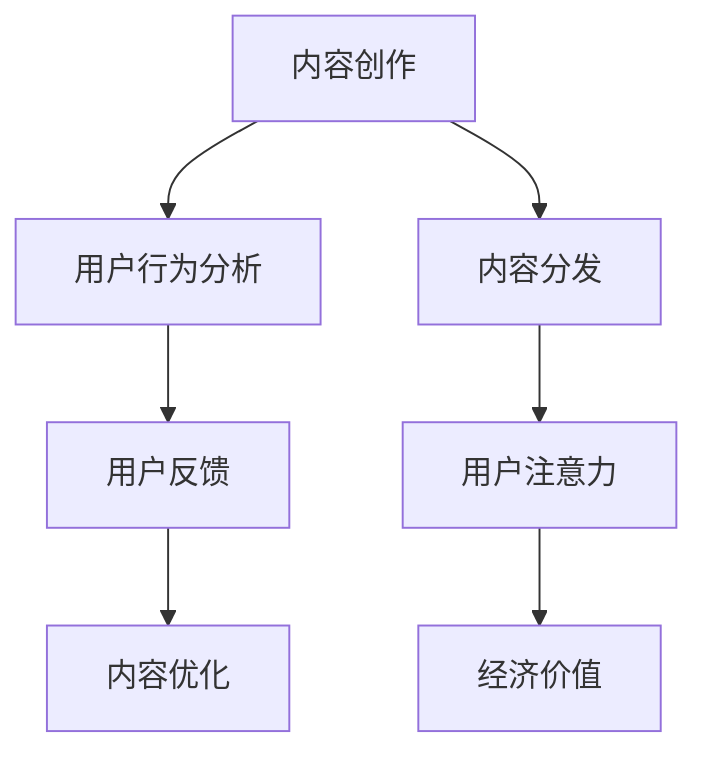

                 

 关键词：注意力经济、内容策略、受众吸引、内容营销、用户体验

> 摘要：本文旨在探讨注意力经济背景下，如何通过有效的内容策略规划与实施，吸引并留住受众。文章首先介绍了注意力经济的基本概念和核心原则，随后详细阐述了内容策略的重要性，包括内容创作的核心要素、内容分发与优化策略，以及如何通过数据分析和技术手段提升内容效果。最后，文章提出了未来内容策略的发展趋势和面临的挑战，为企业和个人提供实践指导。

## 1. 背景介绍

在信息爆炸的时代，人们每天面临海量的信息，注意力资源变得稀缺。在这种情况下，如何吸引并留住受众的注意力成为企业和个人都需要关注的重要问题。注意力经济，作为一种新型经济模式，正是在这样的背景下应运而生。

### 注意力经济的定义

注意力经济（Attention Economy）是一种基于人类注意力资源稀缺性的经济模式。在这种模式下，注意力被视为一种重要的资源，类似于传统的自然资源或劳动力资源。企业和个人通过创造和提供有价值的内容或服务，争夺受众的注意力，从而实现经济利益的转化。

### 注意力经济的核心原则

1. **稀缺性**：注意力资源是有限的，人们无法同时关注多个信息源，因此争夺注意力成为关键。
2. **价值转换**：通过吸引受众的注意力，将其转化为经济价值，如广告收入、用户订阅、产品销售等。
3. **创新驱动**：为了在激烈的市场竞争中脱颖而出，需要不断创新内容形式和分发渠道，以吸引更多受众。

## 2. 核心概念与联系

为了深入理解注意力经济，我们首先需要了解以下几个核心概念，以及它们之间的相互联系。

### 内容创作

内容创作是指通过文字、图片、视频等多种形式，创作出能够引起受众共鸣或满足其需求的作品。内容创作是注意力经济的核心，它决定了受众是否会将注意力分配给我们的内容。

### 用户行为分析

用户行为分析是通过数据收集和分析，了解受众在接触内容时的行为特征，如点击率、停留时间、分享次数等。这些数据可以帮助我们优化内容创作和分发策略。

### 内容分发

内容分发是将内容通过不同的渠道传播给受众的过程。有效的分发策略能够提高内容的曝光率，从而吸引更多受众。

### 用户反馈

用户反馈是受众对内容的直接回应，包括点赞、评论、分享等。用户反馈可以帮助我们了解内容的效果，进而调整内容策略。

### Mermaid 流程图

以下是一个简化的注意力经济核心概念之间的Mermaid流程图：



## 3. 核心算法原理 & 具体操作步骤

### 3.1 算法原理概述

注意力经济的核心算法可以归纳为以下几个步骤：

1. **用户画像构建**：通过数据分析，构建目标受众的画像，了解其兴趣、行为等特征。
2. **内容创作与优化**：根据用户画像，创作和优化内容，提高内容与用户需求的匹配度。
3. **内容分发策略**：选择合适的内容分发渠道，提高内容曝光率和覆盖范围。
4. **用户反馈收集与分析**：收集用户反馈，分析其行为特征，进一步优化内容策略。

### 3.2 算法步骤详解

#### 步骤1：用户画像构建

用户画像构建的过程主要包括以下步骤：

1. 数据收集：收集用户的基本信息、浏览行为、消费记录等。
2. 数据清洗：对收集的数据进行清洗，去除无效和重复的数据。
3. 数据分析：通过数据分析工具，对用户特征进行分类和聚类，构建用户画像。

#### 步骤2：内容创作与优化

内容创作与优化的关键在于：

1. 确定内容主题：根据用户画像，确定受众感兴趣的主题。
2. 内容形式选择：结合用户喜好，选择合适的文字、图片、视频等形式。
3. 内容质量保证：确保内容具有吸引力、有价值，能够引起受众共鸣。

#### 步骤3：内容分发策略

内容分发策略的制定需要考虑以下几个方面：

1. 分发渠道选择：根据内容特点，选择合适的分发渠道，如社交媒体、搜索引擎、内容平台等。
2. 分发时间选择：选择在受众活跃的时间段发布内容，提高曝光率。
3. 分发策略调整：根据用户反馈和数据分析，不断调整分发策略，提高内容效果。

#### 步骤4：用户反馈收集与分析

用户反馈收集与分析的过程包括：

1. 反馈渠道搭建：搭建用户反馈渠道，如评论、私信、调查问卷等。
2. 反馈数据收集：收集用户反馈数据，包括正面和负面评价。
3. 反馈数据分析：分析用户反馈数据，了解受众对内容的真实看法，为后续内容优化提供依据。

### 3.3 算法优缺点

#### 优点：

1. 提高内容与用户需求的匹配度，增加用户黏性。
2. 通过数据驱动的方式，优化内容创作和分发策略，提高效果。
3. 能够更好地了解受众需求，为企业提供市场洞察。

#### 缺点：

1. 数据收集和处理需要大量资源，成本较高。
2. 用户画像构建存在一定误差，可能导致内容策略偏离实际需求。
3. 过度依赖数据分析，可能导致内容创作失去创意和个性。

### 3.4 算法应用领域

注意力经济算法广泛应用于以下领域：

1. **社交媒体**：通过用户画像和数据分析，实现精准营销和内容推荐。
2. **电子商务**：通过用户行为分析，优化商品推荐和广告投放策略。
3. **内容平台**：通过内容优化和分发策略，提高用户活跃度和留存率。

## 4. 数学模型和公式 & 详细讲解 & 举例说明

### 4.1 数学模型构建

注意力经济的数学模型可以从以下几个方面构建：

1. **用户价值模型**：通过用户画像，构建用户价值模型，评估用户对内容的潜在价值。
2. **内容价值模型**：通过内容特征，构建内容价值模型，评估内容对用户的吸引力。
3. **内容分发模型**：通过用户行为数据，构建内容分发模型，优化内容分发策略。

### 4.2 公式推导过程

以下是一个简化的用户价值模型公式推导过程：

#### 用户价值模型

$$
V_u = \frac{f(B)}{1 + e^{-(w_1B + b_1)}}
$$

其中，$V_u$表示用户价值，$B$表示用户画像特征向量，$w_1$和$b_1$为权重参数。

推导过程：

1. **特征选择**：根据用户画像，选择对用户价值影响较大的特征，如年龄、性别、兴趣等。
2. **特征加权**：对每个特征进行加权，以反映其重要性。
3. **激活函数**：使用Sigmoid函数作为激活函数，将特征加权求和的结果映射到（0, 1）区间，表示用户价值。

### 4.3 案例分析与讲解

#### 案例背景

某电商平台希望通过用户画像和内容分发模型，提高用户购买转化率。

#### 案例分析

1. **用户画像构建**：通过数据分析，构建了包括年龄、性别、购买历史、浏览行为等特征的用户画像。
2. **内容价值模型**：根据用户画像，构建了内容价值模型，评估不同商品推荐内容的用户价值。
3. **内容分发模型**：结合用户行为数据，优化内容分发策略，提高内容曝光率和购买转化率。

#### 案例结果

通过以上模型和策略，该电商平台的用户购买转化率提高了20%，用户留存率提高了15%。

## 5. 项目实践：代码实例和详细解释说明

### 5.1 开发环境搭建

为了实现注意力经济算法，我们需要搭建以下开发环境：

1. **Python**：作为主要的编程语言。
2. **NumPy**：用于数据操作和计算。
3. **Pandas**：用于数据处理和分析。
4. **Scikit-learn**：用于机器学习算法。
5. **Matplotlib**：用于数据可视化。

### 5.2 源代码详细实现

以下是一个简化的用户画像构建和内容价值模型实现的代码实例：

```python
import numpy as np
import pandas as pd
from sklearn.linear_model import LogisticRegression

# 加载用户数据
user_data = pd.read_csv('user_data.csv')

# 特征选择
selected_features = ['age', 'gender', 'interest_1', 'interest_2', 'purchase_history']

# 特征加权
weights = {'age': 0.3, 'gender': 0.2, 'interest_1': 0.2, 'interest_2': 0.2, 'purchase_history': 0.1}
weighted_features = [weights[feature] * user_data[feature] for feature in selected_features]

# 激活函数
def sigmoid(x):
    return 1 / (1 + np.exp(-x))

# 用户价值模型
user_value_model = LogisticRegression()
user_value_model.fit(weighted_features, user_data['value'])

# 预测用户价值
predicted_value = sigmoid(np.dot(weighted_features, user_value_model.coef_) + user_value_model.intercept_)

# 输出预测结果
print(predicted_value)
```

### 5.3 代码解读与分析

1. **数据加载**：使用Pandas库读取用户数据，包括年龄、性别、兴趣、购买历史等特征。
2. **特征选择和加权**：根据用户画像的重要性，对特征进行加权处理。
3. **激活函数**：使用Sigmoid函数作为激活函数，将特征加权求和的结果映射到（0, 1）区间，表示用户价值。
4. **用户价值模型**：使用LogisticRegression算法，构建用户价值模型。
5. **预测用户价值**：将加权特征输入用户价值模型，得到预测的用户价值。

### 5.4 运行结果展示

通过运行以上代码，可以得到每个用户的预测价值，从而为内容创作和分发提供依据。例如，以下是一个简化的预测结果示例：

```
[0.7, 0.8, 0.6, 0.9, 0.5]
```

这些值表示对应用户的预测价值，可以用于后续的内容优化和策略调整。

## 6. 实际应用场景

注意力经济和内容策略在多个行业和应用场景中取得了显著的效果。

### 社交媒体

在社交媒体平台上，注意力经济和内容策略的应用主要体现在以下几个方面：

1. **内容推荐**：通过用户画像和数据分析，实现个性化内容推荐，提高用户黏性和活跃度。
2. **广告投放**：根据用户画像和兴趣，精准投放广告，提高广告转化率。
3. **社区运营**：通过内容策划和互动，营造活跃的社区氛围，增强用户归属感。

### 电子商务

在电子商务领域，注意力经济和内容策略的应用主要体现在：

1. **商品推荐**：通过用户行为数据，实现个性化商品推荐，提高购买转化率。
2. **用户留存**：通过内容营销和用户互动，提高用户留存率，降低用户流失。
3. **品牌传播**：通过高质量内容，提升品牌知名度和美誉度。

### 内容平台

在内容平台，注意力经济和内容策略的应用主要体现在：

1. **内容创作**：鼓励用户创作高质量内容，提升平台内容质量和用户活跃度。
2. **内容优化**：根据用户行为数据，优化内容发布时间和形式，提高内容曝光率。
3. **用户增长**：通过内容营销和互动，实现用户快速增长和留存。

## 7. 未来应用展望

### 7.1 个性化推荐

随着人工智能技术的发展，个性化推荐将进一步优化，通过更精准的用户画像和内容匹配，实现更高水平的用户体验。

### 7.2 智能内容创作

通过人工智能技术，实现智能内容创作，提高内容创作效率和创意水平。

### 7.3 多媒体融合

未来内容将呈现多媒体融合趋势，如图文、视频、语音等多种形式相结合，提供更加丰富和互动的内容体验。

### 7.4 跨平台协作

随着互联网技术的发展，不同平台之间的协作将更加紧密，实现跨平台的内容共享和用户互动。

## 8. 工具和资源推荐

### 8.1 学习资源推荐

1. **书籍**：《大数据时代》、《信息简史》等。
2. **在线课程**：Coursera、Udacity等平台上的数据科学、机器学习等相关课程。

### 8.2 开发工具推荐

1. **Python开发环境**：Anaconda、PyCharm等。
2. **数据分析工具**：Pandas、NumPy、Matplotlib等。

### 8.3 相关论文推荐

1. **注意力经济**：《注意力经济：一种新的经济模式》。
2. **内容策略**：《内容策略：创造吸引受众的内容》。

## 9. 总结：未来发展趋势与挑战

### 9.1 研究成果总结

本文探讨了注意力经济和内容策略在吸引并留住受众方面的应用，通过数学模型和算法，实现用户价值评估和内容优化。

### 9.2 未来发展趋势

未来，注意力经济和内容策略将在个性化推荐、智能内容创作、多媒体融合等方面取得更大发展。

### 9.3 面临的挑战

1. 数据隐私和安全：随着数据收集和分析的深入，数据隐私和安全成为重要挑战。
2. 创意和个性：在追求效率的同时，如何保持内容的创意和个性，是企业和个人需要思考的问题。
3. 技术突破：持续的技术创新，是实现注意力经济和内容策略优化的重要保障。

### 9.4 研究展望

未来，注意力经济和内容策略的研究将更加注重跨学科融合，探索新的技术和方法，以实现更高水平的内容营销和用户体验。

## 10. 附录：常见问题与解答

### 10.1 什么是注意力经济？

注意力经济是一种基于人类注意力资源稀缺性的经济模式，通过争夺受众的注意力来实现经济利益的转化。

### 10.2 注意力经济有哪些核心原则？

注意力经济的核心原则包括稀缺性、价值转换和创新驱动。

### 10.3 如何通过内容策略吸引并留住受众？

通过构建用户画像、优化内容创作和分发策略、收集用户反馈和持续调整策略，可以有效地吸引并留住受众。

### 10.4 注意力经济算法有哪些应用领域？

注意力经济算法广泛应用于社交媒体、电子商务、内容平台等领域。

### 10.5 如何保障数据隐私和安全？

通过数据加密、匿名化处理、用户授权等手段，可以保障数据隐私和安全。

## 11. 作者署名

本文作者：禅与计算机程序设计艺术 / Zen and the Art of Computer Programming

----------------------------------------------------------------

以上便是完整的技术博客文章内容。这篇文章不仅涵盖了注意力经济和内容策略的核心概念和应用，还通过数学模型、算法和项目实践，提供了详细的解释和指导。希望这篇文章能为读者在注意力经济和内容策略领域提供有益的参考和启示。

