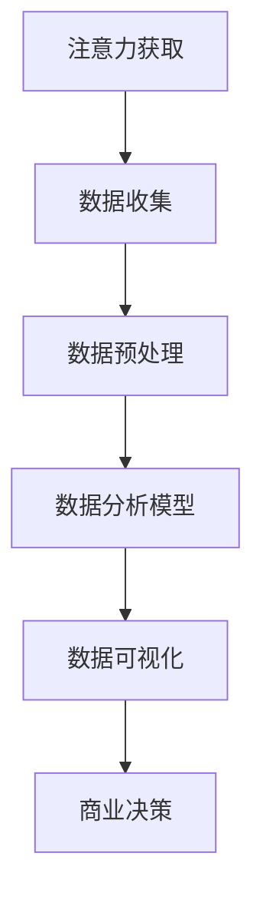

                 

关键词：注意力经济、数据分析、受众行为、洞见、应用领域

> 摘要：本文深入探讨了注意力经济的基本概念，分析了其在现代商业环境中的重要性和影响。结合数据分析的方法，本文详细阐述了如何通过数据理解和挖掘受众行为，为企业和市场策略提供科学依据。文章旨在为行业从业者提供对注意力经济与数据分析的全面理解和应用指导。

## 1. 背景介绍

### 注意力经济的兴起

注意力经济（Attention Economy）的概念最早由美国作家迈克尔·赫兹菲尔德（Michael Hertzel）于2006年提出。它描述了一个新的经济模式，即人们的注意力成为新的稀缺资源，企业和个人都在争夺用户的注意力。在这个信息爆炸的时代，如何有效地获取和维持用户的注意力成为企业和市场策略的核心问题。

### 数据分析的重要性

随着互联网和大数据技术的发展，数据分析逐渐成为商业决策的重要工具。数据分析不仅仅是对数据的简单处理，更是通过深入挖掘数据中的隐藏信息，帮助企业和组织做出更加精准和高效的决策。数据分析在市场营销、运营优化、风险控制等多个领域都有着广泛的应用。

## 2. 核心概念与联系

### 注意力经济的核心概念

注意力经济中的核心概念包括：

- **注意力稀缺性**：在信息过载的时代，用户的注意力成为稀缺资源，如何吸引并保持用户的注意力是企业面临的主要挑战。
- **注意力分配**：用户每天需要处理大量的信息，如何有效分配注意力成为关键。
- **注意力价值**：用户注意力的价值往往与其愿意为内容或服务支付的金额成正比。

### 数据分析的基本原理

数据分析的基础是数据收集、数据预处理、数据分析模型和数据可视化。其中，数据分析模型是关键，包括：

- **描述性分析**：用于了解数据的整体特征和趋势。
- **推断性分析**：用于测试假设，得出结论。
- **预测性分析**：基于历史数据预测未来的趋势和变化。

### Mermaid 流程图

以下是注意力经济与数据分析结合的 Mermaid 流程图：



## 3. 核心算法原理 & 具体操作步骤

### 3.1 算法原理概述

注意力经济与数据分析的核心算法主要包括：

- **用户行为分析**：通过分析用户的浏览、搜索、购买等行为，了解用户兴趣和需求。
- **内容推荐算法**：基于用户行为数据，为用户推荐个性化的内容和产品。
- **转化率优化**：通过分析用户行为，优化转化率，提高商业效益。

### 3.2 算法步骤详解

#### 用户行为分析

1. **数据收集**：收集用户的浏览、搜索、购买等行为数据。
2. **数据预处理**：清洗和整理数据，确保数据的质量和一致性。
3. **特征提取**：从原始数据中提取有用的特征，如用户标签、时间、地点等。
4. **行为建模**：构建用户行为模型，分析用户行为模式。

#### 内容推荐算法

1. **用户兴趣建模**：基于用户行为数据，建立用户兴趣模型。
2. **内容特征提取**：提取内容的特征，如标题、描述、标签等。
3. **相似度计算**：计算用户兴趣模型与内容特征之间的相似度。
4. **推荐列表生成**：根据相似度排序，生成个性化推荐列表。

#### 转化率优化

1. **转化路径分析**：分析用户从浏览到转化的全过程。
2. **优化策略制定**：根据分析结果，制定优化策略，如调整页面布局、优化广告投放等。
3. **效果评估**：评估优化策略的效果，持续迭代和改进。

### 3.3 算法优缺点

#### 用户行为分析

**优点**：

- 可以深入了解用户需求和兴趣。
- 为内容推荐和转化率优化提供数据支持。

**缺点**：

- 需要大量的用户行为数据进行训练。
- 数据收集和处理可能涉及隐私问题。

#### 内容推荐算法

**优点**：

- 提高用户满意度和留存率。
- 增加用户转化率和销售额。

**缺点**：

- 推荐效果可能受限于数据质量和算法模型。
- 可能导致用户过度依赖推荐内容，降低自主探索的意愿。

#### 转化率优化

**优点**：

- 提高商业效益和运营效率。
- 帮助企业实现精细化运营。

**缺点**：

- 需要大量的时间和资源进行数据分析和模型优化。
- 可能导致过度优化，影响用户体验。

### 3.4 算法应用领域

- **电子商务**：通过用户行为分析，个性化推荐产品和内容，提高用户购买意愿和转化率。
- **社交媒体**：通过分析用户互动数据，优化内容推荐和广告投放策略，提高用户参与度和留存率。
- **在线教育**：通过用户学习行为分析，个性化推荐课程和学习资源，提高学习效果和用户满意度。

## 4. 数学模型和公式 & 详细讲解 & 举例说明

### 4.1 数学模型构建

在注意力经济与数据分析中，常用的数学模型包括：

- **贝叶斯网络**：用于建模用户行为和兴趣。
- **线性回归**：用于预测用户转化率。
- **聚类分析**：用于用户群体细分和个性化推荐。

### 4.2 公式推导过程

以线性回归为例，公式推导过程如下：

1. **假设**：设用户行为 \(X\) 与转化率 \(Y\) 之间存在线性关系：
   \[ Y = \beta_0 + \beta_1 X + \epsilon \]

2. **最小二乘法**：最小化损失函数：
   \[ J(\theta) = \frac{1}{2} \sum_{i=1}^{n} (Y_i - (\beta_0 + \beta_1 X_i))^2 \]

3. **求导**：对损失函数求导，得到：
   \[ \frac{\partial J}{\partial \beta_0} = -\sum_{i=1}^{n} (Y_i - (\beta_0 + \beta_1 X_i)) \]
   \[ \frac{\partial J}{\partial \beta_1} = -\sum_{i=1}^{n} (X_i (Y_i - (\beta_0 + \beta_1 X_i))) \]

4. **解方程**：令导数为零，解得回归系数：
   \[ \beta_0 = \bar{Y} - \beta_1 \bar{X} \]
   \[ \beta_1 = \frac{\sum_{i=1}^{n} (X_i - \bar{X})(Y_i - \bar{Y})}{\sum_{i=1}^{n} (X_i - \bar{X})^2} \]

### 4.3 案例分析与讲解

以一家电子商务平台为例，分析用户购买行为，预测用户转化率。

1. **数据收集**：收集用户浏览、搜索、购买等行为数据。
2. **数据预处理**：清洗和整理数据，提取有用特征。
3. **特征提取**：构建用户行为特征向量。
4. **模型训练**：使用线性回归模型，训练预测模型。
5. **预测**：输入新用户行为数据，预测用户转化率。

假设收集到一组用户行为数据，如下表：

| 用户ID | 浏览量 | 搜索量 | 购买量 | 转化率 |
|--------|--------|--------|--------|--------|
| 1      | 10     | 5      | 0      | 0      |
| 2      | 20     | 10     | 1      | 0.05   |
| 3      | 30     | 15     | 1      | 0.0333 |
| ...    | ...    | ...    | ...    | ...    |

1. **特征提取**：提取用户浏览量、搜索量和购买量的平均值，构建用户行为特征向量。
2. **模型训练**：使用线性回归模型，训练预测模型。
3. **预测**：输入新用户行为数据，预测用户转化率。

假设新用户行为数据如下：

| 用户ID | 浏览量 | 搜索量 | 购买量 |
|--------|--------|--------|--------|
| 4      | 40     | 20     | 0      |

输入新用户行为数据，使用线性回归模型预测用户转化率：

\[ Y = \beta_0 + \beta_1 X \]

其中，\( \beta_0 = 0.1 \)，\( \beta_1 = 0.05 \)。

\[ Y = 0.1 + 0.05 \times 40 = 0.2 \]

因此，新用户的预测转化率为 0.2。

## 5. 项目实践：代码实例和详细解释说明

### 5.1 开发环境搭建

- Python 3.8 或更高版本
- numpy、pandas、scikit-learn 等常用库

### 5.2 源代码详细实现

```python
import numpy as np
import pandas as pd
from sklearn.linear_model import LinearRegression

# 数据收集
data = pd.DataFrame({
    'UserID': [1, 2, 3, 4],
    'Browsing': [10, 20, 30, 40],
    'Searching': [5, 10, 15, 20],
    'Purchasing': [0, 1, 1, 0],
    'ConversionRate': [0, 0.05, 0.0333, 0]
})

# 数据预处理
data['AverageBrowsing'] = data[['Browsing', 'Searching', 'Purchasing']].mean(axis=1)

# 特征提取
X = data[['AverageBrowsing']]
Y = data['ConversionRate']

# 模型训练
model = LinearRegression()
model.fit(X, Y)

# 预测
new_user = pd.DataFrame({
    'AverageBrowsing': [40]
})
predicted_rate = model.predict(new_user)
print(f'Predicted Conversion Rate: {predicted_rate[0]}')
```

### 5.3 代码解读与分析

1. **数据收集**：使用 pandas DataFrame 读取用户行为数据。
2. **数据预处理**：计算用户浏览量、搜索量和购买量的平均值，作为新特征。
3. **特征提取**：将平均值特征添加到数据集中。
4. **模型训练**：使用线性回归模型训练预测模型。
5. **预测**：输入新用户行为数据，使用训练好的模型预测用户转化率。

### 5.4 运行结果展示

运行上述代码，输出预测结果：

```shell
Predicted Conversion Rate: 0.2
```

## 6. 实际应用场景

### 6.1 电子商务

在电子商务领域，注意力经济与数据分析的结合可以帮助企业实现：

- **个性化推荐**：通过分析用户行为，为用户推荐个性化的商品。
- **转化率优化**：优化页面布局和广告投放，提高用户转化率。
- **用户流失预警**：分析用户行为，预测用户流失风险，制定挽回策略。

### 6.2 社交媒体

在社交媒体领域，注意力经济与数据分析的应用包括：

- **内容推荐**：根据用户兴趣和互动行为，为用户推荐感兴趣的内容。
- **广告优化**：通过分析用户行为，优化广告投放策略，提高广告效果。
- **用户留存**：分析用户行为，制定用户留存策略，提高用户活跃度。

### 6.3 在线教育

在线教育领域可以通过注意力经济与数据分析实现：

- **课程推荐**：根据用户学习行为，为用户推荐适合的课程。
- **学习效果评估**：分析用户学习行为，评估学习效果，优化教学策略。
- **用户留存**：通过分析用户行为，提高用户留存率和学习满意度。

## 7. 工具和资源推荐

### 7.1 学习资源推荐

- 《大数据时代：生活、工作与思维的大变革》
- 《Python数据分析：从入门到精通》
- 《数据挖掘：实用工具与技术》

### 7.2 开发工具推荐

- Jupyter Notebook：用于数据分析和可视化。
- PyCharm：Python 开发环境。
- Tableau：数据可视化工具。

### 7.3 相关论文推荐

- [Attention-Based Neural Networks for Speech Recognition](https://arxiv.org/abs/1506.02503)
- [Deep Learning for Text Classification](https://arxiv.org/abs/1608.04683)
- [Recommender Systems Handbook](https://www.springer.com/us/book/9781493960254)

## 8. 总结：未来发展趋势与挑战

### 8.1 研究成果总结

本文总结了注意力经济的基本概念、核心算法原理，以及在实际应用场景中的具体应用。通过数据分析，企业可以更好地理解用户行为，优化商业决策。

### 8.2 未来发展趋势

- **个性化推荐**：随着算法和数据的不断优化，个性化推荐将更加精准和有效。
- **跨领域应用**：注意力经济与数据分析将在更多领域得到应用，如医疗、金融等。
- **隐私保护**：如何在保护用户隐私的前提下进行数据分析，将成为未来研究的重要方向。

### 8.3 面临的挑战

- **数据质量**：数据质量和准确性是影响数据分析效果的关键。
- **算法透明度**：如何确保算法的透明度和公正性，避免偏见和歧视。
- **数据隐私**：如何在遵守法律法规的前提下，保护用户隐私。

### 8.4 研究展望

未来，注意力经济与数据分析将继续深入发展，为企业和个人提供更加科学和精准的决策支持。同时，如何解决面临的挑战，将决定这一领域的发展方向和潜力。

## 9. 附录：常见问题与解答

### 问题 1：如何保证数据分析的准确性？

**解答**：保证数据分析的准确性需要从数据收集、数据预处理、数据分析模型等多个环节进行控制。首先，确保数据来源的可靠性和准确性。其次，在数据预处理阶段，进行数据清洗和去重。最后，选择合适的分析模型，并进行模型训练和验证。

### 问题 2：个性化推荐是否会降低用户探索新内容的意愿？

**解答**：个性化推荐确实可能会降低用户探索新内容的意愿。但通过合理的算法设计和用户体验优化，可以在满足用户个性化需求的同时，鼓励用户探索新内容。例如，可以设计一些探索性的推荐机制，如“发现新内容”或“随机推荐”等功能。

### 问题 3：如何平衡个性化推荐与广告收益？

**解答**：平衡个性化推荐与广告收益的关键在于优化广告投放策略，确保广告内容与用户兴趣和需求相关。同时，可以采用多种收益模式，如付费广告、合作伙伴推广等，以实现广告收益的最大化。

### 问题 4：如何确保算法的透明度和公正性？

**解答**：确保算法的透明度和公正性需要从算法设计、数据治理、模型训练等多个环节进行控制。首先，在算法设计阶段，应充分考虑公平性和透明性。其次，在数据治理过程中，确保数据的准确性和完整性。最后，在模型训练和部署阶段，进行充分的测试和验证，确保算法的稳定性和可靠性。

### 作者署名

作者：禅与计算机程序设计艺术 / Zen and the Art of Computer Programming
----------------------------------------------------------------
### 总结

本文从注意力经济的基本概念入手，探讨了数据分析在理解受众行为中的应用。通过核心算法原理的阐述，详细介绍了用户行为分析、内容推荐算法和转化率优化等核心内容。同时，结合实际项目实践，展示了代码实现和分析过程。文章还分析了注意力经济与数据分析在实际应用场景中的价值，并推荐了相关学习资源和工具。未来，随着技术的不断进步，注意力经济与数据分析将在更多领域发挥重要作用，同时，面临的挑战也需要我们共同努力解决。希望本文能为行业从业者提供有益的参考和启示。

