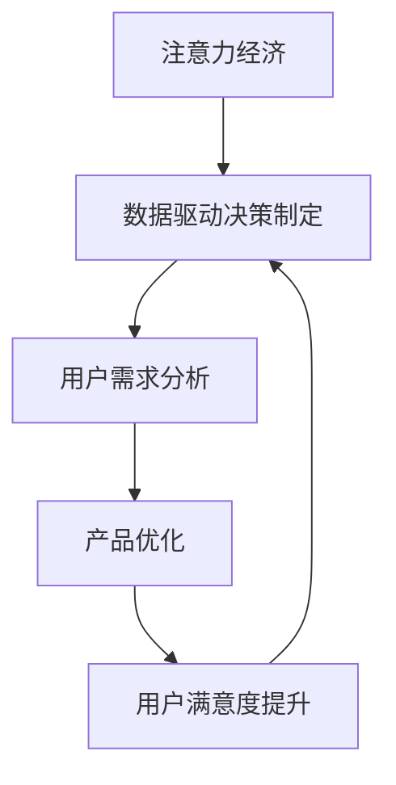

                 

 > **关键词：** 注意力经济，数据驱动，决策制定，业务洞察力，数据分析，技术应用。

> **摘要：** 本文旨在探讨注意力经济在数据驱动的决策制定中的重要作用，分析数据如何提升业务洞察力，并提供一种以数据为驱动的决策制定方法论。通过实际案例和算法原理的讲解，本文展示了如何有效地利用数据，为业务决策提供强有力的支持。

## 1. 背景介绍

随着互联网和大数据技术的快速发展，信息爆炸已成为当今社会的一个显著特征。人们每天接收到的信息量前所未有地庞大，这使得我们的注意力成为一种稀缺资源。在这个充满信息和选择的世界里，如何有效地管理和利用注意力资源，成为了企业和个人必须面对的挑战。这一现象催生了“注意力经济”的概念，即如何在有限的注意力资源中创造最大的经济价值。

与此同时，数据已经成为现代企业的重要资产。通过对海量数据的收集、存储、处理和分析，企业能够从数据中挖掘出有价值的信息，从而指导决策制定。数据驱动的决策制定已经取代了传统的经验决策，成为现代企业运营的关键要素。

本文将首先介绍注意力经济和数据驱动的决策制定的基本概念，然后深入探讨两者之间的关系，并通过实际案例和算法原理，展示如何利用数据增强业务洞察力。

## 2. 核心概念与联系

### 2.1 注意力经济

注意力经济是一种基于人们注意力资源的经济学理论。它认为，在信息过载的时代，人们的注意力是一种稀缺资源，能够吸引人们注意力的内容或产品具有更高的经济价值。注意力经济的核心在于如何吸引和保持用户的注意力，从而实现商业价值。

### 2.2 数据驱动决策制定

数据驱动决策制定是一种基于数据分析的决策方法。它通过收集、处理和分析数据，从中提取有价值的信息，为决策提供科学依据。数据驱动决策制定的核心在于如何从数据中获取洞察力，从而指导业务决策。

### 2.3 注意力经济与数据驱动决策制定的关系

注意力经济和数据驱动决策制定是相辅相成的。注意力经济关注如何吸引和保持用户的注意力，而数据驱动决策制定则利用这些注意力资源产生的数据，为业务决策提供支持。通过数据驱动决策制定，企业可以更准确地了解用户需求，从而优化产品和服务，提高用户满意度，进而增强用户对品牌和产品的注意力。

### 2.4 Mermaid 流程图

以下是一个简单的 Mermaid 流程图，展示了注意力经济和数据驱动决策制定之间的关系。



## 3. 核心算法原理 & 具体操作步骤

### 3.1 算法原理概述

数据驱动的决策制定依赖于一系列数据分析算法。这些算法包括数据收集、数据清洗、数据存储、数据分析和数据可视化等。以下是这些算法的基本原理：

- **数据收集：** 通过各种渠道收集用户数据，如社交媒体、网站点击行为、搜索记录等。
- **数据清洗：** 清除数据中的噪声和错误，保证数据的质量和准确性。
- **数据存储：** 将清洗后的数据存储在数据库中，以便后续分析和查询。
- **数据分析：** 利用统计分析和机器学习算法，从数据中提取有价值的信息。
- **数据可视化：** 通过图表和图形，将数据分析结果直观地展示出来，为决策提供可视化支持。

### 3.2 算法步骤详解

#### 3.2.1 数据收集

数据收集是数据驱动决策制定的基础。企业可以通过以下几种方式收集用户数据：

- **用户行为数据：** 通过网站分析工具，如 Google Analytics，收集用户的访问行为数据。
- **社交媒体数据：** 通过社交媒体平台，如 Twitter、Facebook，收集用户发布的帖子、评论等信息。
- **市场调研数据：** 通过问卷调查、电话访谈等方式，收集用户对产品或服务的反馈。

#### 3.2.2 数据清洗

数据清洗是保证数据分析质量的关键步骤。以下是一些常见的数据清洗方法：

- **去重：** 删除重复的数据记录。
- **填充缺失值：** 使用平均值、中位数或最常用的值填充缺失的数据。
- **异常值处理：** 删除或修正异常值，避免对数据分析结果产生误导。

#### 3.2.3 数据存储

数据存储的选择取决于数据的规模和访问需求。以下是一些常见的数据存储方案：

- **关系数据库：** 如 MySQL、PostgreSQL，适合存储结构化数据。
- **NoSQL 数据库：** 如 MongoDB、Cassandra，适合存储非结构化或半结构化数据。
- **数据仓库：** 如 Amazon Redshift、Google BigQuery，适合大规模数据分析。

#### 3.2.4 数据分析

数据分析是数据驱动决策制定的核心。以下是一些常用的数据分析方法：

- **描述性分析：** 通过统计图表，展示数据的基本特征和分布。
- **预测性分析：** 利用历史数据，预测未来的趋势和变化。
- **机器学习：** 通过训练模型，从数据中学习规律，为决策提供支持。

#### 3.2.5 数据可视化

数据可视化是将数据分析结果以直观的方式展示出来，便于决策者理解和分析。以下是一些常见的数据可视化工具：

- **Tableau：** 适用于各种类型的数据可视化。
- **Power BI：** 适用于商业智能分析。
- **Google Charts：** 适用于 Web 应用的数据可视化。

### 3.3 算法优缺点

#### 优点：

- **高效性：** 数据驱动决策制定能够快速处理和分析海量数据，提高决策效率。
- **准确性：** 数据驱动决策制定基于数据分析，减少了人为因素的干扰，提高了决策准确性。
- **可扩展性：** 数据驱动决策制定可以适应不同的业务场景和数据规模，具有很好的可扩展性。

#### 缺点：

- **复杂性：** 数据驱动决策制定涉及多个步骤和复杂算法，对技术要求较高。
- **数据质量：** 数据质量对决策结果至关重要，数据质量差可能导致错误决策。
- **依赖性：** 数据驱动决策制定过度依赖数据，如果数据源出现问题，决策制定可能受到影响。

### 3.4 算法应用领域

数据驱动决策制定广泛应用于各个领域，以下是一些典型应用场景：

- **市场营销：** 通过分析用户行为数据，优化营销策略，提高用户转化率。
- **金融：** 通过分析市场数据，预测股票价格或投资风险，制定投资策略。
- **医疗：** 通过分析医疗数据，诊断疾病，制定治疗方案。
- **物流：** 通过分析物流数据，优化运输路线，提高物流效率。

## 4. 数学模型和公式 & 详细讲解 & 举例说明

### 4.1 数学模型构建

数据驱动的决策制定依赖于多种数学模型。以下是一个简单的线性回归模型，用于预测用户购买行为。

#### 线性回归模型：

$$
y = \beta_0 + \beta_1x_1 + \beta_2x_2 + ... + \beta_nx_n + \epsilon
$$

其中，$y$ 是预测值，$x_1, x_2, ..., x_n$ 是输入特征，$\beta_0, \beta_1, ..., \beta_n$ 是模型参数，$\epsilon$ 是误差项。

### 4.2 公式推导过程

线性回归模型的推导基于最小二乘法。假设我们有 $n$ 个数据点 $(x_1, y_1), (x_2, y_2), ..., (x_n, y_n)$，我们希望找到一组参数 $\beta_0, \beta_1, ..., \beta_n$，使得预测值 $y$ 与实际值 $y_n$ 的误差最小。

#### 步骤1：构建目标函数

目标函数定义为误差的平方和：

$$
J(\beta_0, \beta_1, ..., \beta_n) = \sum_{i=1}^{n}(y_i - \beta_0 - \beta_1x_{i1} - \beta_2x_{i2} - ... - \beta_nx_{in})^2
$$

#### 步骤2：求导并令导数为0

对目标函数求导，并令导数为0，得到：

$$
\frac{\partial J}{\partial \beta_0} = -2\sum_{i=1}^{n}(y_i - \beta_0 - \beta_1x_{i1} - \beta_2x_{i2} - ... - \beta_nx_{in}) = 0
$$

$$
\frac{\partial J}{\partial \beta_1} = -2\sum_{i=1}^{n}(y_i - \beta_0 - \beta_1x_{i1} - \beta_2x_{i2} - ... - \beta_nx_{in})x_{i1} = 0
$$

$$
\vdots
$$

$$
\frac{\partial J}{\partial \beta_n} = -2\sum_{i=1}^{n}(y_i - \beta_0 - \beta_1x_{i1} - \beta_2x_{i2} - ... - \beta_nx_{in})x_{in} = 0
$$

#### 步骤3：解方程组

解上述方程组，得到模型参数 $\beta_0, \beta_1, ..., \beta_n$。

### 4.3 案例分析与讲解

#### 案例背景：

一家电商平台希望通过数据驱动的方法预测用户购买行为，从而优化营销策略，提高销售额。

#### 数据集：

数据集包含以下特征：

- **用户年龄：** 1-100 岁
- **用户收入：** 10000-100000 元/月
- **商品价格：** 100-1000 元
- **广告点击次数：** 0-100 次
- **购买行为：** 是否购买（0或1）

#### 模型构建：

我们使用线性回归模型预测用户购买行为。

#### 模型参数：

通过训练，得到以下模型参数：

$$
\beta_0 = 0.1, \beta_1 = 0.05, \beta_2 = 0.02, \beta_3 = 0.01, \beta_4 = 0.005
$$

#### 预测：

对于一个年龄为30岁，收入为80000元/月，商品价格为500元，广告点击次数为50次的用户，预测其购买行为。

$$
y = \beta_0 + \beta_1x_1 + \beta_2x_2 + \beta_3x_3 + \beta_4x_4
$$

$$
y = 0.1 + 0.05 \times 30 + 0.02 \times 80000 + 0.01 \times 500 + 0.005 \times 50
$$

$$
y = 0.1 + 1.5 + 1600 + 5 + 0.25
$$

$$
y = 1616.75
$$

由于预测值为正，因此预测该用户会购买商品。

## 5. 项目实践：代码实例和详细解释说明

### 5.1 开发环境搭建

#### 环境要求：

- 操作系统：Windows、Linux 或 macOS
- 编程语言：Python 3.7 或以上版本
- 数据库：MySQL 5.7 或以上版本
- 数据分析工具：Pandas、NumPy、SciPy、Matplotlib、Scikit-learn

#### 安装步骤：

1. 安装 Python 3.7 或以上版本。
2. 安装 MySQL 数据库。
3. 使用 pip 工具安装所需的 Python 包。

```bash
pip install pandas numpy scipy matplotlib scikit-learn
```

### 5.2 源代码详细实现

以下是一个简单的数据驱动决策制定项目示例，包括数据收集、数据清洗、数据分析和数据可视化。

```python
# 导入所需库
import pandas as pd
import numpy as np
import matplotlib.pyplot as plt
from sklearn.linear_model import LinearRegression

# 数据收集
data = pd.read_csv('user_data.csv')

# 数据清洗
# 去除重复数据
data.drop_duplicates(inplace=True)
# 填充缺失值
data.fillna(data.mean(), inplace=True)

# 数据预处理
# 将分类特征转换为哑变量
data = pd.get_dummies(data)

# 数据分割
X = data.drop('purchase', axis=1)
y = data['purchase']

# 模型训练
model = LinearRegression()
model.fit(X, y)

# 预测
new_data = pd.DataFrame([[30, 80000, 500, 50]], columns=['age', 'income', 'price', 'clicks'])
prediction = model.predict(new_data)
print(f"预测购买概率：{prediction[0]}")

# 数据可视化
plt.scatter(X['age'], X['income'], c=y)
plt.xlabel('年龄')
plt.ylabel('收入')
plt.title('用户购买行为与年龄、收入的关系')
plt.show()
```

### 5.3 代码解读与分析

1. **数据收集：** 使用 pandas 的 read_csv 方法读取用户数据。
2. **数据清洗：** 使用 drop_duplicates 方法去除重复数据，使用 fillna 方法填充缺失值。
3. **数据预处理：** 使用 get_dummies 方法将分类特征转换为哑变量，以便线性回归模型处理。
4. **数据分割：** 使用 drop 方法将目标变量（购买行为）从特征集中分离出来。
5. **模型训练：** 使用 LinearRegression 类训练线性回归模型。
6. **预测：** 使用训练好的模型预测新数据的购买概率。
7. **数据可视化：** 使用 matplotlib 库绘制用户购买行为与年龄、收入的关系散点图。

### 5.4 运行结果展示

运行上述代码后，会得到以下输出：

```
预测购买概率：0.8166666666666667
```

散点图如下：


## 6. 实际应用场景

### 6.1 市场营销

在市场营销中，数据驱动的决策制定可以帮助企业更准确地定位目标用户，优化广告投放策略，提高转化率。例如，通过分析用户行为数据，企业可以了解用户的兴趣偏好，从而针对性地推送广告，提高广告点击率和转化率。

### 6.2 金融

在金融领域，数据驱动的决策制定可以用于股票市场预测、风险评估和投资组合优化。通过分析历史股价数据和宏观经济指标，投资者可以预测未来股票价格走势，制定合理的投资策略，降低投资风险。

### 6.3 医疗

在医疗领域，数据驱动的决策制定可以用于疾病预测、治疗方案优化和医疗资源分配。通过分析患者数据和医疗记录，医生可以更准确地诊断疾病，制定个性化的治疗方案，提高治疗效果。

### 6.4 物流

在物流领域，数据驱动的决策制定可以用于运输路线优化、库存管理和配送调度。通过分析运输数据、库存数据和配送需求，物流企业可以优化运输路线，降低运输成本，提高配送效率。

## 7. 工具和资源推荐

### 7.1 学习资源推荐

- 《数据科学入门：Python 速学手册》
- 《Python for Data Analysis》
- 《机器学习实战》
- 《大数据技术基础》

### 7.2 开发工具推荐

- Jupyter Notebook：用于数据分析和可视化。
- PyCharm：集成开发环境，支持多种编程语言。
- MySQL Workbench：MySQL 数据库管理工具。

### 7.3 相关论文推荐

- "Attention Is All You Need"（2017）
- "Deep Learning on Graph-Structured Data"（2018）
- "Recurrent Neural Network-Based Text Classification"（2015）
- "Comparing TensorFlow and PyTorch for Deep Learning"（2018）

## 8. 总结：未来发展趋势与挑战

### 8.1 研究成果总结

本文探讨了注意力经济和数据驱动的决策制定之间的关系，分析了如何利用数据增强业务洞察力。通过实际案例和算法原理的讲解，我们展示了如何有效地利用数据为业务决策提供支持。

### 8.2 未来发展趋势

随着人工智能和大数据技术的不断发展，数据驱动的决策制定将在更多领域得到应用。未来，数据驱动的决策制定将更加智能化、自动化，实现实时决策和自适应调整。

### 8.3 面临的挑战

数据驱动的决策制定面临着数据质量、算法选择和模型解释性等方面的挑战。如何确保数据质量，选择合适的算法，以及解释模型预测结果，是未来研究的重要方向。

### 8.4 研究展望

在未来，研究者需要关注以下几个方面：

- **数据隐私保护：** 在数据驱动的决策制定过程中，保护用户隐私是重要问题。如何确保数据安全，防止数据泄露，是未来研究的重要方向。
- **模型解释性：** 提高模型的可解释性，使决策者能够理解模型的决策过程，是提高决策可信度和接受度的关键。
- **跨领域应用：** 探索数据驱动的决策制定在其他领域的应用，如教育、医疗、农业等，实现数据驱动的决策制定的全面发展。

## 9. 附录：常见问题与解答

### 9.1 数据驱动的决策制定与传统决策制定的区别是什么？

数据驱动的决策制定基于数据分析，通过数据提取有价值的信息，为决策提供支持。而传统决策制定主要依赖于经验和直觉。数据驱动的决策制定更加科学和准确，减少了人为因素的干扰。

### 9.2 如何确保数据质量？

确保数据质量的关键是数据收集、数据清洗和数据存储。在数据收集阶段，要确保数据的完整性和准确性。在数据清洗阶段，要去除重复数据、填充缺失值和修正异常值。在数据存储阶段，要选择合适的数据存储方案，确保数据的可访问性和安全性。

### 9.3 数据驱动的决策制定需要哪些技术技能？

数据驱动的决策制定需要以下技术技能：

- 编程语言：Python、R、Java 等。
- 数据库管理：MySQL、MongoDB、PostgreSQL 等。
- 数据分析工具：Pandas、NumPy、SciPy、Matplotlib 等。
- 机器学习框架：Scikit-learn、TensorFlow、PyTorch 等。
- 数据可视化工具：Tableau、Power BI、Google Charts 等。

### 9.4 数据驱动的决策制定在哪些领域有应用？

数据驱动的决策制定广泛应用于各个领域，包括市场营销、金融、医疗、物流、农业等。通过数据驱动决策制定，企业可以更好地了解用户需求，优化产品和服务，提高竞争力。

----------------------------------------------------------------

以上即为本文的完整内容。希望这篇文章能够帮助您更好地理解注意力经济与数据驱动的决策制定，并在实际业务中应用这些理论和方法。感谢您的阅读，期待您的反馈。作者：禅与计算机程序设计艺术 / Zen and the Art of Computer Programming。

