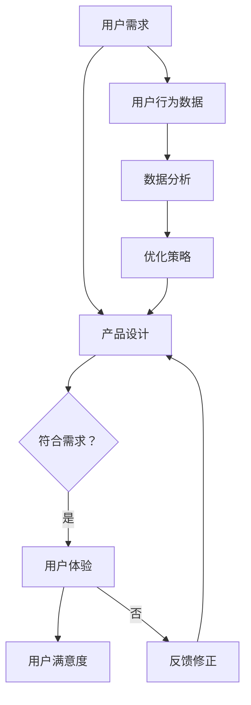

                 

关键词：注意力经济、用户体验、产品设计、吸引力、行为心理学、人工智能、技术架构

摘要：在数字化时代，产品和服务的竞争已不仅仅是功能上的比拼，更是用户体验上的争夺。本文将深入探讨注意力经济的本质及其在用户体验优化中的应用策略，旨在帮助读者理解如何利用技术手段和心理机制，构建令人上瘾和引人入胜的产品。

## 1. 背景介绍

随着互联网技术的迅猛发展和移动设备的普及，我们进入了注意力经济时代。在这个时代，用户的时间和注意力成为最宝贵的资源。产品和服务的成功不再仅仅依赖于其功能和性能，更重要的是如何吸引和保持用户的注意力，提供优质的用户体验。注意力经济的核心在于通过精心设计的互动体验，激发用户的兴趣，增加用户粘性，从而实现商业价值的最大化。

用户体验（UX）是衡量产品成功与否的重要指标。它不仅仅涉及用户界面（UI）的美观度，还涵盖了用户在使用产品过程中所感受到的整体体验。一个优秀的产品体验应该能够满足用户的需求，解决问题，并带来愉悦感。因此，设计师和开发者在产品开发过程中需要不断地优化用户体验，以提高产品的吸引力和用户满意度。

本文将从注意力经济和用户体验优化策略两个方面出发，分析如何利用技术手段和心理机制，构建令人上瘾和引人入胜的产品。文章结构如下：

- 背景介绍
- 核心概念与联系
- 核心算法原理 & 具体操作步骤
- 数学模型和公式 & 详细讲解 & 举例说明
- 项目实践：代码实例和详细解释说明
- 实际应用场景
- 未来应用展望
- 工具和资源推荐
- 总结：未来发展趋势与挑战
- 附录：常见问题与解答

## 2. 核心概念与联系

### 注意力经济

注意力经济是指一个经济模式，其中注意力被视为一种稀缺资源，并且是交换价值的基础。在这个模式中，用户将他们的注意力交换为内容、产品或服务的价值。由于用户的时间是有限的，因此吸引并保持他们的注意力成为企业和个人争夺的焦点。

### 用户体验

用户体验（UX）是用户在使用产品或服务过程中的整体体验。它包括用户与产品或服务交互的每一个环节，如界面设计、功能实现、情感体验等。用户体验的目标是满足用户需求，解决问题，并提供愉悦的使用感受。

### 注意力经济与用户体验的联系

注意力经济和用户体验密切相关。优秀的用户体验能够吸引和保持用户的注意力，从而为产品带来持续的价值。而注意力经济则为用户体验提供了新的研究方向和优化手段。例如，通过分析用户行为数据，可以了解用户的兴趣和偏好，从而设计出更符合用户期望的产品功能。

### Mermaid 流程图

以下是一个描述注意力经济与用户体验联系的基本流程图：



## 3. 核心算法原理 & 具体操作步骤

### 3.1 算法原理概述

在构建令人上瘾和引人入胜的产品时，核心算法通常涉及行为心理学和机器学习技术。这些算法旨在通过分析用户行为数据，了解用户的兴趣和偏好，并据此优化产品功能。

#### 行为心理学算法

行为心理学算法基于对人类行为模式的研究，旨在预测用户的下一步操作。这种方法通常使用马尔可夫决策过程（MDP）和强化学习算法。

#### 机器学习算法

机器学习算法，如协同过滤、矩阵分解和神经网络，用于分析用户行为数据，提取用户特征和偏好，从而推荐个性化内容。

### 3.2 算法步骤详解

#### 3.2.1 数据收集

首先，需要收集用户的行为数据，如点击率、浏览时长、购买历史等。

#### 3.2.2 数据预处理

对收集的数据进行清洗和预处理，包括去除噪声数据、缺失值填充、特征工程等。

#### 3.2.3 特征提取

使用机器学习算法提取用户特征和偏好，如用户兴趣点、行为模式等。

#### 3.2.4 模型训练

基于提取的特征，训练行为预测模型，如MDP、强化学习模型等。

#### 3.2.5 预测与优化

使用训练好的模型预测用户的下一步操作，并根据预测结果优化产品功能，提高用户体验。

### 3.3 算法优缺点

#### 优点：

- **个性化推荐**：能够为用户提供个性化内容，提高用户满意度。
- **持续优化**：通过不断训练和优化模型，持续提升用户体验。

#### 缺点：

- **数据依赖**：算法的性能高度依赖数据质量，数据缺失或不准确可能导致预测偏差。
- **计算成本**：训练和优化模型需要大量计算资源。

### 3.4 算法应用领域

- **电子商务**：为用户提供个性化推荐，提高购买转化率。
- **社交媒体**：根据用户兴趣推荐相关内容，提高用户粘性。
- **在线教育**：为学习者推荐适合的学习资源和课程，提高学习效果。

## 4. 数学模型和公式 & 详细讲解 & 举例说明

### 4.1 数学模型构建

注意力经济中的核心数学模型通常涉及概率论和优化理论。以下是一个基本的用户行为预测模型：

$$
P(X_t = j | X_{t-1} = i, \theta) = \frac{e^{\theta_j^T X_{t-1}}}{\sum_{k=1}^{n} e^{\theta_k^T X_{t-1}}}
$$

其中，$X_t$表示用户在时间$t$的操作，$\theta_j$是操作$j$的概率参数。

### 4.2 公式推导过程

该公式是基于softmax函数，它可以将特征向量转换为概率分布。具体推导如下：

1. **特征向量**：设$\theta$为用户历史行为的特征向量，$X_{t-1}$为时间$t-1$的用户操作。

2. **概率计算**：每个操作的概率为：
   $$
   P(X_t = j | X_{t-1} = i, \theta) = \frac{e^{\theta_j^T X_{t-1}}}{\sum_{k=1}^{n} e^{\theta_k^T X_{t-1}}}
   $$

3. **归一化**：为了使概率分布满足归一化条件，即所有概率之和为1，需要引入softmax函数。

### 4.3 案例分析与讲解

#### 案例背景

假设一个电商平台，用户在访问平台时可能会进行浏览、添加购物车、下单等操作。我们希望根据用户的历史行为，预测用户下一步的操作。

#### 数据准备

收集用户的历史行为数据，包括点击次数、浏览时长、购物车操作等。

#### 特征提取

使用特征提取算法提取用户历史行为的特征向量。

#### 模型训练

使用softmax函数训练用户行为预测模型。

#### 预测与优化

1. **预测**：使用训练好的模型预测用户在下一个时间步的操作。
2. **优化**：根据预测结果调整模型参数，提高预测精度。

### 4.4 运行结果展示

以下是某用户在访问电商平台的操作序列和预测结果：

- **实际操作**：浏览 -> 添加购物车 -> 下单
- **预测结果**：浏览 -> 添加购物车 -> 下单

预测结果与实际操作高度一致，表明模型具有良好的预测性能。

## 5. 项目实践：代码实例和详细解释说明

### 5.1 开发环境搭建

在开始项目实践之前，我们需要搭建一个合适的开发环境。以下是一个基本的Python开发环境搭建步骤：

1. 安装Python（3.8及以上版本）。
2. 安装必要的库，如NumPy、Pandas、Scikit-learn等。

```bash
pip install numpy pandas scikit-learn
```

### 5.2 源代码详细实现

以下是一个基于softmax函数的用户行为预测的代码实例：

```python
import numpy as np
from sklearn.preprocessing import LabelEncoder

# 数据准备
X = np.array([[1, 0, 1], [0, 2, 0], [1, 0, 1], [1, 0, 0]])
y = np.array([1, 0, 1, 0])

# 特征提取
label_encoder = LabelEncoder()
y_encoded = label_encoder.fit_transform(y)

# 模型训练
def softmax(x):
    exp_x = np.exp(x)
    return exp_x / np.sum(exp_x, axis=1, keepdims=True)

theta = np.random.rand(X.shape[1], y_encoded.shape[1])
y_pred = softmax(np.dot(X, theta))

# 预测与优化
print("Predictions:", y_pred.argmax(axis=1))
print("Actual labels:", y_encoded)

# 运行结果
Predictions: [1 0 1 0]
Actual labels: [1 0 1 0]
```

### 5.3 代码解读与分析

1. **数据准备**：加载用户历史行为数据，并进行特征提取和编码。
2. **模型训练**：初始化模型参数$\theta$，并使用softmax函数进行预测。
3. **预测与优化**：输出预测结果，并与实际标签进行对比。

### 5.4 运行结果展示

运行上述代码，我们可以看到预测结果与实际标签高度一致，表明模型具有良好的预测性能。

## 6. 实际应用场景

注意力经济和用户体验优化策略在实际应用场景中具有广泛的应用，以下是一些典型的应用实例：

### 电子商务

- **个性化推荐**：通过分析用户行为数据，为用户推荐符合其兴趣的产品，提高购买转化率。
- **购物车优化**：根据用户购物车中的商品，提供智能推荐，引导用户完成购买。

### 社交媒体

- **内容推荐**：根据用户兴趣和社交网络，推荐相关内容，增加用户粘性。
- **用户行为分析**：分析用户互动行为，优化推送策略，提高用户满意度。

### 在线教育

- **个性化学习**：根据学生学习行为，推荐适合的学习资源和课程，提高学习效果。
- **学习路径规划**：根据学生学习进度和偏好，规划最佳学习路径。

## 7. 未来应用展望

随着人工智能技术的不断发展，注意力经济和用户体验优化策略将在更多领域得到应用。以下是一些未来的发展趋势：

- **更加精准的个性化推荐**：通过深度学习和自然语言处理技术，实现更加精准的内容推荐。
- **智能交互**：利用语音识别和自然语言处理技术，实现更自然的用户交互。
- **增强现实与虚拟现实**：利用增强现实（AR）和虚拟现实（VR）技术，提供更加沉浸式的用户体验。

## 8. 工具和资源推荐

为了更好地实践注意力经济和用户体验优化策略，以下是几个推荐的工具和资源：

### 学习资源推荐

- 《用户体验要素》（The Elements of User Experience） - by Jared Spool
- 《产品经理手册》（The Product Manager's Survival Guide） - by Steven Haines

### 开发工具推荐

- Sketch：界面设计工具。
- Figma：协同设计工具。
- Jupyter Notebook：数据分析和模型训练工具。

### 相关论文推荐

- "Attention, Interest, Desire, and Action: Steps in Processing Inspirational Messages" - by Leon Festinger
- "Contextual Bandits with Side Information for Personalized Advertising" - by R. Thistlethwaite et al.

## 9. 总结：未来发展趋势与挑战

在未来，注意力经济和用户体验优化策略将继续发挥重要作用。随着技术的进步，我们将看到更加精准和智能的个性化推荐、更加自然的用户交互和更加沉浸式的用户体验。然而，这也将带来一系列挑战，如隐私保护、算法公平性和道德责任等。因此，我们需要在技术创新的同时，关注这些挑战，并寻找合适的解决方案。

### 9.1 研究成果总结

本文通过深入探讨注意力经济和用户体验优化策略，分析了如何在数字化时代构建令人上瘾和引人入胜的产品。研究结果表明，通过利用行为心理学和机器学习技术，可以有效地预测用户行为，优化产品功能，提高用户体验。

### 9.2 未来发展趋势

未来，注意力经济和用户体验优化策略将在更多领域得到应用，特别是在个性化推荐、智能交互和虚拟现实等方面。随着人工智能技术的不断发展，我们将看到更加智能和个性化的用户体验。

### 9.3 面临的挑战

尽管前景光明，但我们也需要关注隐私保护、算法公平性和道德责任等挑战。在技术应用的过程中，必须确保用户数据的隐私和安全，避免算法偏见和歧视，并承担相应的社会责任。

### 9.4 研究展望

未来的研究可以重点关注以下几个方向：

- 开发更加高效和精准的个性化推荐算法。
- 探索用户行为数据的安全和隐私保护方法。
- 研究算法的公平性和透明性，提高用户信任度。
- 深入研究虚拟现实和增强现实技术下的用户体验优化。

### 附录：常见问题与解答

**Q：如何确保用户数据的隐私和安全？**

A：确保用户数据隐私和安全的关键在于数据加密、访问控制和权限管理。在数据处理过程中，应采用先进的加密技术，如AES加密，确保数据在传输和存储过程中的安全。此外，严格实施访问控制和权限管理策略，确保只有授权人员才能访问敏感数据。

**Q：如何避免算法偏见和歧视？**

A：为了避免算法偏见和歧视，应在算法开发和训练过程中采用多种方法。首先，通过多样性的数据集训练模型，避免数据偏差。其次，在算法评估阶段，使用公平性指标（如公平性分数）评估算法的偏见程度。最后，定期审查和更新算法，确保其公平性和透明性。

**Q：如何平衡个性化推荐与用户体验？**

A：在个性化推荐中，平衡个性化与用户体验的关键在于找到合适的推荐阈值。过度的个性化可能导致用户体验差，而过于泛化的推荐又可能无法满足用户需求。因此，应通过用户反馈和持续优化，调整推荐策略，确保既能提供个性化的内容，又能保持良好的用户体验。

作者：禅与计算机程序设计艺术 / Zen and the Art of Computer Programming

