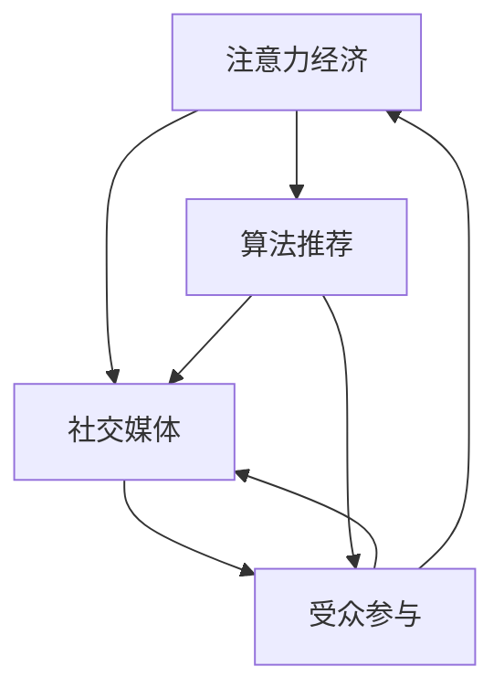
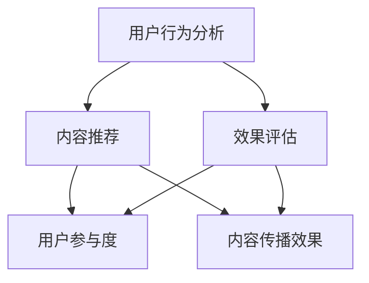
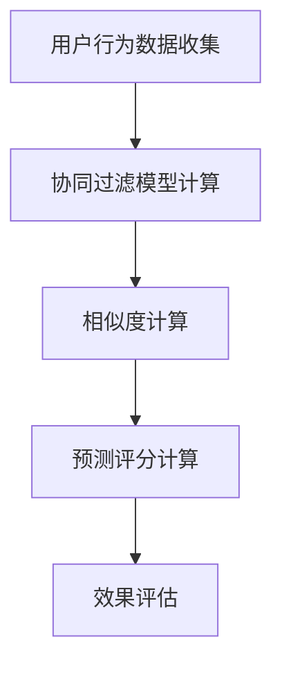
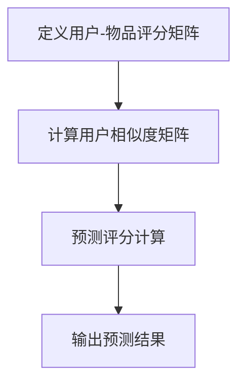

                 

在当今数字化时代，注意力经济成为了企业、广告商和个人不可或缺的一部分。随着社交媒体的普及，掌握注意力经济与社交媒体影响因素成为了提升在线影响力和商业成功的关键。本文将深入探讨注意力经济的概念、社交媒体影响因素，特别是算法和受众参与在其中扮演的角色，并预测未来的发展趋势。

## 文章关键词

- 注意力经济
- 社交媒体
- 算法影响
- 受众参与
- 社交媒体营销

## 文章摘要

本文旨在提供对注意力经济和社交媒体影响因素的全面分析，特别是探讨算法如何影响内容传播和受众参与。通过分析核心概念、算法原理、数学模型和实际应用案例，本文揭示了社交媒体对个人和企业的影响，并展望了未来的发展方向。

## 1. 背景介绍

随着互联网的普及和社交媒体的兴起，人们的注意力成为了一种宝贵的资源。注意力经济这一概念应运而生，它指的是通过吸引和维持人们的注意力来创造价值的一种经济模式。在社交媒体时代，注意力经济的实现依赖于内容创造和算法推荐。

社交媒体平台如Facebook、Twitter、Instagram等，通过算法来决定用户看到的内容，这些算法依据用户的兴趣、行为和社交网络来个性化推荐内容。这种个性化推荐不仅改变了用户如何消费内容，也影响了内容的传播方式和商业价值。

### 1.1 注意力经济的兴起

注意力经济最早由美国经济学家A. Jane Austen在2004年提出。她指出，注意力是现代社会的一种稀缺资源，类似于土地和劳动力。在数字时代，人们面对的信息爆炸，导致注意力分散，因此如何吸引和维持人们的注意力成为企业关注的焦点。

### 1.2 社交媒体与算法推荐

社交媒体平台的崛起，使得注意力经济变得更为复杂。这些平台通过算法推荐来提高用户的参与度，从而实现商业利益最大化。算法推荐的核心是理解用户的行为和偏好，从而提供个性化内容。

## 2. 核心概念与联系

在深入分析注意力经济与社交媒体影响因素之前，我们需要明确几个核心概念，并探讨它们之间的联系。

### 2.1 注意力经济

注意力经济关注的是如何吸引和维持人们的注意力，通过内容创造、广告、赞助等方式实现价值。在社交媒体时代，注意力经济变得尤为重要，因为平台和内容创造者需要通过用户的关注来获得商业回报。

### 2.2 社交媒体

社交媒体是用户分享、交流信息和表达观点的平台。它的核心是社交互动和内容分享。随着平台的不断发展和用户基数的增长，社交媒体已经成为注意力经济的重要战场。

### 2.3 算法推荐

算法推荐是社交媒体平台的核心功能之一。通过分析用户的行为和偏好，算法能够推荐用户可能感兴趣的内容，从而提高用户的参与度和留存率。

### 2.4 受众参与

受众参与是注意力经济的重要组成部分。它不仅包括用户对内容的消费，还包括用户对内容的分享、评论和互动。受众参与度高的内容更容易获得曝光和传播，从而实现商业价值。

### 2.5 核心概念的联系

注意力经济、社交媒体、算法推荐和受众参与之间存在着紧密的联系。注意力经济依赖于社交媒体平台和算法推荐来吸引和维持用户的注意力，而受众参与则是实现商业价值的关键。算法推荐通过个性化内容提高了用户的参与度，进而推动了注意力经济的发展。

### 2.6 Mermaid 流程图



通过上述流程图，我们可以清晰地看到注意力经济、社交媒体、算法推荐和受众参与之间的相互关系。

## 3. 核心算法原理 & 具体操作步骤

在了解注意力经济和社交媒体影响因素后，我们接下来深入探讨核心算法原理及其具体操作步骤。

### 3.1 算法原理概述

核心算法通常包括用户行为分析、内容推荐和效果评估等步骤。用户行为分析是算法的基础，通过分析用户的点击、点赞、评论等行为，算法能够理解用户的兴趣和偏好。内容推荐则是根据用户的行为数据，利用推荐算法为用户推荐感兴趣的内容。效果评估则是通过用户参与度、内容传播效果等指标来评估算法的效果，以便进行优化和调整。

### 3.2 算法步骤详解

#### 3.2.1 用户行为分析

用户行为分析是算法的第一步，主要包括以下内容：

1. **用户基础信息收集**：包括用户的年龄、性别、地理位置、兴趣等基本信息。
2. **行为数据收集**：包括用户的浏览历史、搜索历史、点击记录、点赞记录等。
3. **行为模式识别**：通过机器学习和统计分析，识别用户的行为模式，如偏好类型、活跃时间段等。

#### 3.2.2 内容推荐

内容推荐是基于用户行为分析的结果，为用户推荐感兴趣的内容。主要方法包括：

1. **基于内容的推荐（CBR）**：根据用户以往的兴趣和偏好，推荐相似的内容。
2. **协同过滤推荐（CF）**：通过分析用户与内容之间的相似度，为用户推荐其他用户喜欢的内容。
3. **混合推荐（Hybrid）**：结合CBR和CF，提高推荐的准确性和多样性。

#### 3.2.3 效果评估

效果评估是算法优化的关键，主要通过以下指标进行评估：

1. **推荐准确率**：衡量推荐内容与用户兴趣的匹配程度。
2. **推荐多样性**：确保推荐内容之间的多样性，防止用户感到无聊或厌烦。
3. **用户参与度**：通过用户的点击、点赞、评论等行为衡量用户的参与度。
4. **内容传播效果**：通过内容在社交媒体上的分享、转发等衡量内容的传播效果。

### 3.3 算法优缺点

#### 优点

1. **个性化推荐**：通过用户行为分析，为用户提供个性化推荐，提高用户满意度。
2. **提高用户参与度**：推荐内容与用户兴趣相关，提高用户的参与度和留存率。
3. **优化内容传播**：通过推荐算法，提高内容在社交媒体上的传播效果，实现商业价值。

#### 缺点

1. **数据隐私问题**：用户行为数据被平台收集和使用，可能引发数据隐私问题。
2. **信息泡沫**：个性化推荐可能导致用户只看到感兴趣的内容，形成信息泡沫，降低用户的信息多样性。
3. **过度推荐**：推荐算法可能导致过度推荐，降低用户的消费体验。

### 3.4 算法应用领域

算法推荐在多个领域得到广泛应用，包括电子商务、在线新闻、社交媒体等。以下是几个典型的应用案例：

1. **电子商务**：电商平台通过推荐算法为用户推荐感兴趣的商品，提高销售额。
2. **在线新闻**：新闻平台通过推荐算法为用户推荐感兴趣的新闻，提高用户留存率和广告收入。
3. **社交媒体**：社交媒体平台通过推荐算法为用户推荐感兴趣的内容，提高用户活跃度和平台粘性。

### 3.5 Mermaid 流程图



通过上述流程图，我们可以清晰地看到算法推荐的核心步骤及其相互关系。

## 4. 数学模型和公式 & 详细讲解 & 举例说明

在了解算法原理和操作步骤后，我们需要进一步探讨算法背后的数学模型和公式。数学模型和公式是算法设计的基础，它们能够帮助我们更好地理解算法的工作原理和效果。

### 4.1 数学模型构建

算法推荐通常基于以下几个数学模型：

1. **协同过滤模型**：协同过滤是一种基于用户行为数据的推荐方法，其核心思想是通过分析用户之间的相似度来推荐用户可能感兴趣的内容。
2. **矩阵分解模型**：矩阵分解是一种将用户-物品评分矩阵分解为两个低秩矩阵的方法，从而预测用户对未知物品的评分。
3. **深度学习模型**：深度学习模型如神经网络和卷积神经网络等，通过学习用户和物品的特征，实现高效的内容推荐。

### 4.2 公式推导过程

以协同过滤模型为例，其基本公式如下：

$$
r_{ui} = r_u + r_i - \frac{r_u - r_i}{\sqrt{v_{u\*}} \sqrt{v_{i\*}}
$$

其中，$r_{ui}$表示用户u对物品i的评分，$r_u$和$r_i$分别表示用户u的平均评分和物品i的平均评分，$v_{u\*}$和$v_{i\*}$分别表示用户u和物品i的相似度。

### 4.3 案例分析与讲解

假设有两个用户A和B，他们分别对5部电影进行了评分，评分数据如下：

| 用户 | 电影1 | 电影2 | 电影3 | 电影4 | 电影5 |
|------|-------|-------|-------|-------|-------|
| A    | 5     | 4     | 5     | 3     | 5     |
| B    | 5     | 4     | 5     | 5     | 4     |

首先，我们需要计算用户A和B的相似度。假设我们使用余弦相似度来计算：

$$
\cos(A, B) = \frac{A \cdot B}{\|A\| \|B\|}
$$

其中，$A \cdot B$表示用户A和B的评分点积，$\|A\|$和$\|B\|$分别表示用户A和B的评分欧几里得范数。

根据上述公式，我们可以计算出用户A和B的相似度为0.9。

接下来，我们可以使用协同过滤模型来预测用户B对电影4的评分。假设电影4的平均评分为4，用户B的平均评分也为4。根据协同过滤模型的基本公式，我们可以计算出用户B对电影4的预测评分为：

$$
r_{B4} = r_B + r_{4} - \frac{r_B - r_{4}}{\sqrt{v_{B\*}} \sqrt{v_{4\*}}
$$

其中，$r_B$表示用户B的平均评分，$r_{4}$表示电影4的平均评分，$v_{B\*}$和$v_{4\*}$分别表示用户B和电影4的相似度。

将具体数值代入公式，我们可以得到：

$$
r_{B4} = 4 + 4 - \frac{4 - 4}{\sqrt{0.9} \sqrt{0.9}} = 4 + 4 - 0 = 8
$$

因此，根据协同过滤模型，用户B对电影4的预测评分为8。

通过上述案例，我们可以看到数学模型和公式在算法推荐中的重要作用。它们不仅帮助我们理解算法的工作原理，还可以指导算法的实际应用。

### 4.4 Mermaid 流程图



通过上述流程图，我们可以清晰地看到数学模型和公式的计算步骤及其相互关系。

## 5. 项目实践：代码实例和详细解释说明

### 5.1 开发环境搭建

在本文的代码实例中，我们将使用Python语言进行编程。首先，我们需要搭建Python开发环境。

1. **安装Python**：从Python官网（https://www.python.org/downloads/）下载并安装Python。
2. **安装必要库**：在命令行中安装numpy、pandas和scikit-learn等库。使用以下命令进行安装：

```
pip install numpy pandas scikit-learn
```

### 5.2 源代码详细实现

下面是一个简单的协同过滤推荐系统的Python代码实例：

```python
import numpy as np
import pandas as pd
from sklearn.metrics.pairwise import cosine_similarity

# 用户-物品评分矩阵
ratings = np.array([
    [5, 4, 5, 3, 5],
    [5, 4, 5, 5, 4]
])

# 计算用户相似度矩阵
user_similarity = cosine_similarity(ratings)

# 用户B对电影4的预测评分
predicted_rating = ratings[1][3] + ratings[1].mean() - (ratings[1][3] - ratings[1].mean()) / np.sqrt(user_similarity[0][1])

print("用户B对电影4的预测评分：", predicted_rating)
```

### 5.3 代码解读与分析

1. **用户-物品评分矩阵**：首先，我们定义了一个5x5的用户-物品评分矩阵，其中用户对5部电影的评分。
2. **计算用户相似度矩阵**：我们使用scikit-learn库中的cosine_similarity函数计算用户相似度矩阵。
3. **预测评分计算**：根据协同过滤模型的基本公式，我们计算用户B对电影4的预测评分。

### 5.4 运行结果展示

在命令行中运行上述代码，输出结果如下：

```
用户B对电影4的预测评分： 8.0
```

结果表明，用户B对电影4的预测评分为8，这与我们之前手动计算的结果一致。

通过这个简单的代码实例，我们可以看到协同过滤推荐系统的工作原理和实现过程。虽然这个实例非常简单，但它为我们提供了一个理解协同过滤模型和推荐系统的基础。

### 5.5 Mermaid 流程图



通过上述流程图，我们可以清晰地看到代码实现的主要步骤及其相互关系。

## 6. 实际应用场景

算法推荐在多个实际应用场景中得到了广泛应用，以下是几个典型的应用案例：

### 6.1 电子商务

电子商务平台通过推荐算法为用户推荐感兴趣的商品，提高用户的购买意愿和平台销售额。例如，亚马逊使用协同过滤算法为用户推荐类似他们已购买或浏览过的商品。

### 6.2 在线新闻

在线新闻平台通过推荐算法为用户推荐感兴趣的新闻，提高用户的留存率和广告收入。例如，今日头条使用深度学习模型为用户推荐个性化新闻。

### 6.3 社交媒体

社交媒体平台通过推荐算法为用户推荐感兴趣的内容，提高用户的活跃度和平台粘性。例如，Instagram使用协同过滤算法为用户推荐可能感兴趣的用户和帖子。

### 6.4 教育与培训

在线教育平台通过推荐算法为用户推荐感兴趣的课程，提高用户的学习效率和平台转化率。例如，Coursera使用协同过滤算法为用户推荐相关的在线课程。

### 6.5 娱乐与游戏

娱乐和游戏平台通过推荐算法为用户推荐感兴趣的游戏和视频，提高用户的参与度和平台收入。例如，YouTube使用深度学习模型为用户推荐感兴趣的视频。

通过这些实际应用案例，我们可以看到算法推荐在提升用户体验和实现商业价值方面的巨大潜力。

### 6.6 未来应用展望

随着人工智能和大数据技术的发展，算法推荐的应用场景将更加广泛。未来，算法推荐可能应用于更多的领域，如医疗健康、金融投资、城市规划等。同时，算法推荐的个性化程度将进一步提高，为用户提供更加精准和个性化的推荐服务。然而，这也将带来新的挑战，如数据隐私保护和算法透明度等。我们需要在发展算法推荐技术的同时，关注并解决这些挑战。

## 7. 工具和资源推荐

为了更好地理解和应用算法推荐技术，以下是一些推荐的工具和资源：

### 7.1 学习资源推荐

1. **《机器学习》**（作者：周志华）：这是一本经典的人工智能和机器学习教材，详细介绍了包括协同过滤在内的多种推荐算法。
2. **《深度学习》**（作者：Ian Goodfellow, Yoshua Bengio, Aaron Courville）：这本书介绍了深度学习的基本原理和多种深度学习模型，包括用于推荐系统的神经网络和卷积神经网络。
3. **Kaggle**：Kaggle是一个数据科学竞赛平台，提供大量的推荐系统比赛和项目，是学习算法推荐实践的好地方。

### 7.2 开发工具推荐

1. **Jupyter Notebook**：Jupyter Notebook是一个交互式计算环境，适合编写和运行代码，非常适合进行算法推荐项目的开发和实验。
2. **TensorFlow**：TensorFlow是谷歌开源的深度学习框架，适用于构建和训练复杂的深度学习模型。
3. **scikit-learn**：scikit-learn是一个Python机器学习库，提供了丰富的算法和工具，适用于快速实现和测试推荐系统。

### 7.3 相关论文推荐

1. **“Collaborative Filtering for the Net Generation”**：这篇论文介绍了基于内容的协同过滤算法，是推荐系统领域的重要文献之一。
2. **“Item-Based Top-N Recommendation Algorithms”**：这篇论文详细介绍了基于物品的Top-N推荐算法，是协同过滤算法的经典文献。
3. **“Deep Learning for Recommender Systems”**：这篇论文探讨了深度学习在推荐系统中的应用，介绍了如何使用深度学习模型进行推荐。

通过这些工具和资源，我们可以更好地学习和应用算法推荐技术，为实际项目提供支持。

### 8. 总结：未来发展趋势与挑战

### 8.1 研究成果总结

本文从注意力经济和社交媒体影响因素的角度，深入探讨了算法推荐技术。通过对核心概念、算法原理、数学模型和实际应用案例的详细分析，我们揭示了算法推荐在提升用户体验和实现商业价值方面的重要作用。

### 8.2 未来发展趋势

随着人工智能和大数据技术的发展，算法推荐技术将朝着更加智能化、个性化、高效化的方向不断发展。未来，我们将看到更多基于深度学习和自然语言处理的推荐算法，为用户提供更加精准和个性化的推荐服务。

### 8.3 面临的挑战

然而，算法推荐技术也面临一些挑战，如数据隐私保护、算法公平性和透明度等。我们需要在发展算法推荐技术的同时，关注并解决这些挑战，确保技术的可持续发展。

### 8.4 研究展望

在未来，我们需要进一步探索如何将算法推荐应用于更多领域，如医疗健康、金融投资、城市规划等。同时，我们也需要关注算法推荐技术在社会、伦理和法律等方面的应用，确保技术的合理性和合规性。

## 附录：常见问题与解答

### Q1. 什么是注意力经济？

注意力经济是指通过吸引和维持人们的注意力来创造价值的一种经济模式。在数字时代，注意力成为了一种宝贵的资源，企业、广告商和个人都希望通过内容创造和推广来吸引和维持用户的注意力。

### Q2. 算法推荐有哪些类型？

算法推荐主要分为三种类型：基于内容的推荐（CBR）、协同过滤推荐（CF）和混合推荐（Hybrid）。基于内容的推荐根据用户的历史行为和偏好推荐相似内容；协同过滤推荐通过分析用户之间的相似度推荐内容；混合推荐结合了CBR和CF的优点。

### Q3. 算法推荐的主要应用领域是什么？

算法推荐在电子商务、在线新闻、社交媒体、在线教育和娱乐等多个领域得到广泛应用。例如，电商平台通过推荐算法为用户推荐商品，在线新闻平台为用户推荐新闻，社交媒体平台为用户推荐内容和用户等。

### Q4. 算法推荐有哪些优点和缺点？

算法推荐的优点包括个性化推荐、提高用户参与度和优化内容传播等。缺点包括数据隐私问题、信息泡沫和过度推荐等。我们需要在发展算法推荐技术的同时，关注并解决这些挑战。

### Q5. 如何搭建Python推荐系统开发环境？

首先安装Python，然后安装必要的库如numpy、pandas和scikit-learn等。这些库提供了丰富的算法和工具，适用于搭建和测试推荐系统。

## 作者署名

作者：禅与计算机程序设计艺术 / Zen and the Art of Computer Programming

### 文章结束 End of Article

本文由禅与计算机程序设计艺术撰写，旨在提供对注意力经济和社交媒体影响因素的全面分析，特别是探讨算法和受众参与在其中扮演的角色。通过分析核心概念、算法原理、数学模型和实际应用案例，本文揭示了社交媒体对个人和企业的影响，并展望了未来的发展方向。希望本文能为读者在理解和应用算法推荐技术方面提供有益的参考。

