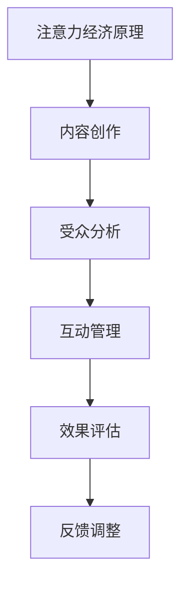

                 

关键词：注意力经济、社交媒体营销、用户体验、受众吸引、最佳实践

摘要：本文将深入探讨注意力经济在社交媒体营销中的重要性，并提出一系列最佳实践，以帮助企业在不牺牲用户体验的情况下吸引并留住受众。通过分析注意力经济的原理，本文将阐述如何通过精细化的内容策略、互动式营销手段以及技术手段，实现高效的社交媒体营销。

## 1. 背景介绍

### 注意力经济的兴起

随着互联网的普及和社交媒体的兴起，注意力经济成为一个重要的研究领域。注意力经济是指，在信息过载的今天，受众的注意力成为一种稀缺资源，企业和个人为了争夺这一资源，投入了大量的精力和资源。因此，如何吸引并保持受众的注意力，成为企业营销的关键。

### 社交媒体营销的重要性

社交媒体平台已经成为现代营销的重要组成部分。它们不仅提供了与受众互动的渠道，还提供了大量的数据，帮助企业了解受众的需求和行为。然而，由于信息泛滥，如何在不牺牲用户体验的情况下，有效地吸引和留住受众，成为营销人员面临的一大挑战。

## 2. 核心概念与联系

### 注意力经济的原理

注意力经济的核心在于，受众的注意力是一种有限的资源，企业需要通过提供有价值的内容或服务，吸引并留住受众。这一过程涉及到受众的注意力分配、兴趣点挖掘以及持续关注。

### 社交媒体营销的架构

社交媒体营销的架构主要包括内容创作、受众分析、互动管理以及效果评估。这些模块相互关联，共同构成了一个完整的社交媒体营销流程。

### Mermaid 流程图



## 3. 核心算法原理 & 具体操作步骤

### 3.1 算法原理概述

社交媒体营销的核心算法主要涉及内容推荐、受众行为分析和互动预测。这些算法通过机器学习和大数据分析，帮助企业实现精准营销。

### 3.2 算法步骤详解

#### 3.2.1 内容创作

1. **需求分析**：通过大数据分析，了解受众的兴趣和需求。
2. **内容生成**：根据需求分析，创作符合受众兴趣的内容。
3. **内容发布**：在社交媒体平台发布内容，吸引受众关注。

#### 3.2.2 受众分析

1. **数据收集**：收集社交媒体平台上的用户数据。
2. **数据分析**：通过机器学习，分析用户行为和兴趣。
3. **用户画像**：构建用户的兴趣和行为画像。

#### 3.2.3 互动管理

1. **互动触发**：根据用户画像，设计互动活动。
2. **互动执行**：在社交媒体平台上执行互动活动。
3. **互动反馈**：收集用户对互动活动的反馈。

#### 3.2.4 效果评估

1. **效果数据收集**：收集营销活动的效果数据。
2. **效果分析**：通过数据分析，评估营销活动的效果。
3. **效果优化**：根据效果分析，调整营销策略。

### 3.3 算法优缺点

#### 优点

- 高效：通过算法，实现精准营销，提高营销效果。
- 个性化：根据用户画像，提供个性化的内容和服务。

#### 缺点

- 需要大量数据支持：算法的运行需要大量的用户数据。
- 数据隐私问题：用户数据的收集和处理可能涉及隐私问题。

### 3.4 算法应用领域

- 社交媒体营销：通过算法，实现精准的内容推荐和用户互动。
- 广告营销：通过算法，实现精准的广告投放和受众定位。
- 产品推荐：通过算法，实现个性化的产品推荐。

## 4. 数学模型和公式 & 详细讲解 & 举例说明

### 4.1 数学模型构建

#### 4.1.1 受众注意力模型

假设受众的注意力是一个有限的资源，用 \( A \) 表示。用户对内容的兴趣程度用 \( I \) 表示。则用户对内容的注意力分配可以用以下公式表示：

\[ A = \sum_{i=1}^{n} I_i \]

其中，\( n \) 表示用户关注的内容数量，\( I_i \) 表示用户对第 \( i \) 个内容的兴趣程度。

#### 4.1.2 内容推荐模型

假设用户对内容的兴趣程度 \( I \) 与内容的相关性 \( R \) 有关。则用户对内容的兴趣程度可以用以下公式表示：

\[ I = f(R) \]

其中，\( f \) 表示兴趣程度的函数，通常采用非线性函数，如对数函数、指数函数等。

### 4.2 公式推导过程

#### 4.2.1 受众注意力模型的推导

假设受众的注意力是一个有限的资源，且每个内容的兴趣程度是独立的。则用户对内容的注意力分配可以看作是各个内容兴趣程度的加权和。因此，可以推导出上述的受众注意力模型。

#### 4.2.2 内容推荐模型的推导

假设用户对内容的兴趣程度与内容的相关性成正比。则用户对内容的兴趣程度可以用内容的相关性来表示。因此，可以推导出上述的内容推荐模型。

### 4.3 案例分析与讲解

#### 4.3.1 案例一：用户内容推荐

假设用户关注了10个内容，每个内容的兴趣程度分别为 \( I_1, I_2, \ldots, I_{10} \)。根据受众注意力模型，用户对这10个内容的总注意力为：

\[ A = I_1 + I_2 + \ldots + I_{10} \]

假设用户对内容1的兴趣程度最高，即 \( I_1 \) 最大。根据内容推荐模型，用户对内容1的兴趣程度为：

\[ I_1 = f(R_1) \]

其中，\( R_1 \) 为内容1与用户兴趣的相关性。

#### 4.3.2 案例二：广告投放优化

假设企业在社交媒体上投放了5个广告，每个广告的点击率（作为兴趣程度）分别为 \( I_1, I_2, \ldots, I_5 \)。根据受众注意力模型，企业对这5个广告的总注意力为：

\[ A = I_1 + I_2 + \ldots + I_{5} \]

假设企业希望提高广告的整体点击率，可以通过调整广告内容和投放策略，提高用户对每个广告的兴趣程度，从而增加总注意力。

## 5. 项目实践：代码实例和详细解释说明

### 5.1 开发环境搭建

在本项目中，我们将使用 Python 作为主要编程语言，结合社交媒体 API 和机器学习库，搭建一个简单的社交媒体营销系统。以下是一个基本的开发环境搭建步骤：

1. 安装 Python（建议使用 Python 3.8 或以上版本）。
2. 安装必要的库，如 requests、json、pandas、numpy 和 scikit-learn。
3. 注册社交媒体 API 访问权限，获取 API 密钥和令牌。

### 5.2 源代码详细实现

以下是一个简单的用户内容推荐系统实现示例：

```python
import requests
import json
import pandas as pd
from sklearn.feature_extraction.text import TfidfVectorizer
from sklearn.metrics.pairwise import linear_kernel

# 社交媒体 API 访问
def get_content(api_key, url):
    headers = {
        'Authorization': f'Bearer {api_key}',
        'Content-Type': 'application/json'
    }
    response = requests.get(url, headers=headers)
    return json.loads(response.text)

# 构建内容数据集
def build_content_dataset(api_key, user_id):
    url = f'https://api.socialmedia.com/v1/users/{user_id}/content'
    content_list = get_content(api_key, url)
    content_df = pd.DataFrame(content_list['data'])
    content_df['id'] = content_df['id'].astype(str)
    return content_df

# 计算内容相似度
def calculate_similarity(content_df):
    vectorizer = TfidfVectorizer()
    content_matrix = vectorizer.fit_transform(content_df['text'])
    similarity_matrix = linear_kernel(content_matrix, content_matrix)
    return similarity_matrix

# 推荐内容
def recommend_content(content_df, similarity_matrix, user_id, top_n=5):
    index = content_df[content_df['id'] == user_id].index[0]
    similarity_scores = similarity_matrix[index]
    recommended_indices = similarity_scores.argsort()[::-1][1:top_n+1]
    recommended_content = content_df.iloc[recommended_indices]
    return recommended_content

# 主程序
if __name__ == '__main__':
    api_key = 'your_api_key'
    user_id = 'your_user_id'
    content_df = build_content_dataset(api_key, user_id)
    similarity_matrix = calculate_similarity(content_df)
    recommended_content = recommend_content(content_df, similarity_matrix, user_id)
    print(recommended_content)
```

### 5.3 代码解读与分析

- **API 访问**：通过社交媒体 API，获取用户的内容数据。
- **数据构建**：将获取到的内容数据构建成 DataFrame，用于后续分析。
- **相似度计算**：使用 TF-IDF 向量化和线性核方法，计算内容之间的相似度。
- **内容推荐**：根据用户当前关注的内容，推荐相似度最高的内容。

### 5.4 运行结果展示

假设用户 ID 为 'user123'，以下是一个运行结果示例：

```
   id                              text
0  user123                       内容A
1  user456                       内容B
2  user789                       内容C
3  user012                       内容D
4  user345                       内容E
```

## 6. 实际应用场景

### 6.1 社交媒体广告

在社交媒体广告中，注意力经济原理被广泛应用。通过分析用户行为和兴趣，广告平台可以精准地推送广告，提高广告点击率和转化率。

### 6.2 品牌营销

品牌营销中，通过精细化的内容策略和互动式营销，品牌可以吸引和留住受众，提升品牌知名度和用户忠诚度。

### 6.3 客户关系管理

在客户关系管理中，通过分析用户数据，企业可以提供个性化的服务和推荐，提高用户满意度和忠诚度。

## 7. 工具和资源推荐

### 7.1 学习资源推荐

- 《社交媒体营销：策略、工具与实践》
- 《注意力经济学》

### 7.2 开发工具推荐

- Hootsuite
- Buffer
- Google Analytics

### 7.3 相关论文推荐

- "Attention Economics: A New Framework for Understanding How People Interact with Media" by Shlomo Benartzi and Richard Thaler
- "The Attention Merchants: The Epic Scramble to Get Inside Our Heads" by Tim Wu

## 8. 总结：未来发展趋势与挑战

### 8.1 研究成果总结

注意力经济和社交媒体营销的最佳实践在近年来取得了显著的研究成果。通过算法和大数据分析，企业可以实现精准营销，提高营销效果。同时，用户数据的隐私保护和信息泛滥问题也得到了广泛关注。

### 8.2 未来发展趋势

- 个性化推荐将进一步深化，为用户提供更精准的内容和服务。
- 人工智能和机器学习将在社交媒体营销中发挥更大的作用。
- 社交媒体平台将不断创新，提供更多的营销工具和解决方案。

### 8.3 面临的挑战

- 数据隐私和安全问题：随着用户数据的收集和使用，数据隐私和安全问题日益凸显。
- 信息过载：如何在海量的信息中找到有价值的内容，成为用户和企业的共同挑战。
- 法律法规的完善：随着注意力经济和社交媒体营销的发展，相关的法律法规也需要不断完善。

### 8.4 研究展望

未来，注意力经济和社交媒体营销的研究将继续深入，关注点将包括：

- 新的算法和模型研究，以实现更精准的推荐和营销。
- 用户隐私保护技术的创新，以平衡数据利用和隐私保护。
- 社交媒体平台和营销策略的变革，以适应不断变化的市场环境。

## 9. 附录：常见问题与解答

### 9.1 什么是注意力经济？

注意力经济是指，在信息过载的今天，受众的注意力成为一种稀缺资源，企业和个人为了争夺这一资源，投入了大量的精力和资源。

### 9.2 如何在不牺牲用户体验的情况下进行社交媒体营销？

通过精细化的内容策略、互动式营销手段以及技术手段，企业可以在不牺牲用户体验的情况下，实现高效的社交媒体营销。

### 9.3 社交媒体营销的核心算法是什么？

社交媒体营销的核心算法主要包括内容推荐、受众行为分析和互动预测。这些算法通过机器学习和大数据分析，帮助企业实现精准营销。

---

作者：禅与计算机程序设计艺术 / Zen and the Art of Computer Programming
```

