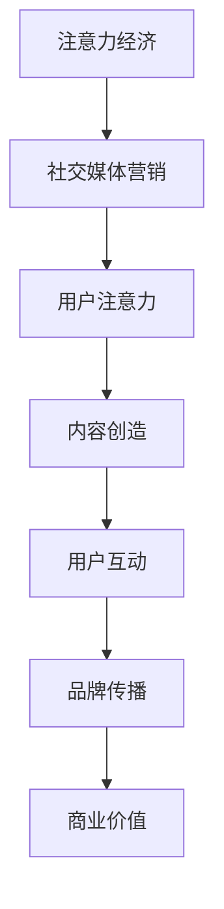

                 

关键词：注意力经济、社交媒体营销、用户体验、受众吸引

> 摘要：随着互联网的快速发展，社交媒体已经成为人们获取信息和社交互动的主要平台。如何在不牺牲用户体验的情况下，利用注意力经济原则进行有效的社交媒体营销，成为企业和品牌关注的焦点。本文将深入探讨注意力经济的基本原理，结合实际案例，提供一系列最佳实践策略，帮助企业成功吸引和保持受众的关注。

## 1. 背景介绍

在互联网时代，信息爆炸使得用户的注意力成为一种稀缺资源。注意力经济（Attention Economy）这一概念应运而生，它揭示了在信息过载的社会中，吸引和保持受众注意力的价值和策略。社交媒体作为注意力经济的重要载体，已经成为企业和品牌传播信息、建立品牌形象、实现营销目标的重要渠道。然而，如何在海量信息中脱颖而出，吸引并保持受众的注意力，成为社交媒体营销的核心挑战。

本文旨在探讨注意力经济在社交媒体营销中的应用，通过分析核心概念和联系，介绍核心算法原理，提供数学模型和公式，分享项目实践案例，并展望未来应用场景和发展趋势。希望通过本文的探讨，为企业提供一套行之有效的社交媒体营销最佳实践策略。

## 2. 核心概念与联系

### 2.1 注意力经济概述

注意力经济是一种基于用户注意力的经济模式，其核心在于如何获取、保持和转化用户的注意力。在注意力经济中，用户的注意力被视为一种稀缺资源，企业通过创造有价值的内容和服务，吸引和留住用户，从而实现商业价值。

### 2.2 社交媒体营销概述

社交媒体营销是通过社交媒体平台进行品牌推广和信息传播的一种营销方式。其目的是通过与用户的互动，提升品牌知名度、增加用户忠诚度和促进销售。社交媒体营销的核心在于内容创造和用户互动。

### 2.3 注意力经济与社交媒体营销的关系

注意力经济与社交媒体营销密切相关。社交媒体平台提供了广泛的用户基础和多样化的内容形式，为注意力经济提供了理想的实践场景。而注意力经济原则则为社交媒体营销提供了有效的策略指导，帮助企业和品牌在信息爆炸的环境中吸引并保持受众的注意力。

### 2.4 Mermaid 流程图



## 3. 核心算法原理 & 具体操作步骤

### 3.1 算法原理概述

在社交媒体营销中，核心算法原理主要涉及内容创造、用户互动和数据分析。以下是一个简要的算法原理概述：

1. 内容创造：根据用户需求和兴趣，创造有价值、有趣、有启发性的内容。
2. 用户互动：通过评论、点赞、分享等方式与用户互动，提高用户参与度。
3. 数据分析：收集用户数据，分析用户行为和偏好，优化内容和策略。

### 3.2 算法步骤详解

1. **内容创造**：
   - 确定目标受众：分析用户需求和兴趣，确定目标受众。
   - 创造有价值的内容：基于用户需求，创造有价值、有趣、有启发性的内容。
   - 优化内容形式：根据社交媒体平台的特点，优化内容形式，如图片、视频、文字等。

2. **用户互动**：
   - 激发用户参与：通过提问、互动话题等方式激发用户参与。
   - 回应用户评论：及时回应用户评论，建立良好的互动氛围。
   - 调动用户情绪：通过幽默、感人等手法调动用户情绪，增加用户粘性。

3. **数据分析**：
   - 收集用户数据：通过社交媒体平台提供的数据分析工具，收集用户行为数据。
   - 分析用户行为：分析用户点击、评论、分享等行为，了解用户偏好。
   - 优化策略：根据用户行为数据，优化内容和策略，提高用户参与度和转化率。

### 3.3 算法优缺点

**优点**：
- 能够根据用户需求和兴趣，创造有价值的内容。
- 通过用户互动和数据分析，提高用户参与度和转化率。

**缺点**：
- 需要持续创造高质量的内容，对内容创作者要求较高。
- 需要收集和分析大量用户数据，存在一定的隐私风险。

### 3.4 算法应用领域

- 社交媒体营销：通过注意力经济原则，提高用户参与度和转化率。
- 广告投放：通过数据分析，优化广告投放策略，提高广告效果。
- 品牌传播：通过内容创造和用户互动，建立良好的品牌形象。

## 4. 数学模型和公式 & 详细讲解 & 举例说明

### 4.1 数学模型构建

在社交媒体营销中，常见的数学模型包括用户参与度模型、转化率模型等。以下是一个简单的用户参与度模型：

$$
U = f(C, I, R)
$$

其中，$U$ 表示用户参与度，$C$ 表示内容质量，$I$ 表示互动程度，$R$ 表示用户关系。

### 4.2 公式推导过程

1. 内容质量 $C$：通过分析用户反馈和内容传播效果，确定内容质量。
2. 互动程度 $I$：通过分析用户评论、点赞、分享等行为，确定互动程度。
3. 用户关系 $R$：通过分析用户互动频率和互动深度，确定用户关系。

### 4.3 案例分析与讲解

假设某品牌在社交媒体上发布一篇产品评测文章，内容质量为 $C = 0.8$，互动程度为 $I = 0.6$，用户关系为 $R = 0.7$。根据上述模型，可以计算出用户参与度：

$$
U = f(C, I, R) = 0.8 \times 0.6 \times 0.7 = 0.336
$$

这意味着该文章的用户参与度为 33.6%。通过进一步分析用户行为数据，可以发现用户主要在评论区互动，说明互动环节还有提升空间。

## 5. 项目实践：代码实例和详细解释说明

### 5.1 开发环境搭建

为了进行社交媒体营销项目实践，需要搭建以下开发环境：

- 开发工具：Python
- 数据库：MySQL
- 数据分析工具：Pandas、Numpy
- 社交媒体 API：Facebook API、Twitter API

### 5.2 源代码详细实现

以下是一个简单的社交媒体营销项目代码实例：

```python
import requests
import pandas as pd
from textblob import TextBlob

# Facebook API
fb_access_token = 'your_facebook_access_token'
fb_post_id = 'your_facebook_post_id'

# Twitter API
tw_access_token = 'your_twitter_access_token'
tw_access_token_secret = 'your_twitter_access_token_secret'
tw_consumer_key = 'your_twitter_consumer_key'
tw_consumer_secret = 'your_twitter_consumer_secret'

# 获取 Facebook 评论数据
def get_fb_comments(post_id):
    url = f'https://graph.facebook.com/{post_id}/comments?access_token={fb_access_token}'
    response = requests.get(url)
    data = response.json()
    return pd.DataFrame(data['data'])

# 获取 Twitter 评论数据
def get_tw_comments(post_id):
    url = f'https://api.twitter.com/1.1/statuses/show.json?id={post_id}&access_token={tw_access_token}&access_token_secret={tw_access_token_secret}&consumer_key={tw_consumer_key}&consumer_secret={tw_consumer_secret}'
    response = requests.get(url)
    data = response.json()
    return pd.DataFrame(data['entities']['hashtags'])

# 分析评论数据
def analyze_comments(comments):
    sentiments = comments['comment_text'].apply(lambda x: TextBlob(x).sentiment.polarity)
    return pd.DataFrame({'sentiments': sentiments})

# 主函数
def main():
    fb_comments = get_fb_comments(fb_post_id)
    tw_comments = get_tw_comments(fb_post_id)
    combined_comments = pd.concat([fb_comments, tw_comments])
    analyzed_comments = analyze_comments(combined_comments)
    print(analyzed_comments.describe())

if __name__ == '__main__':
    main()
```

### 5.3 代码解读与分析

上述代码实现了一个简单的社交媒体营销项目，主要功能包括：

1. 获取 Facebook 和 Twitter 评论数据。
2. 分析评论的情感倾向。
3. 输出评论数据的描述性统计。

通过分析评论数据，可以了解用户对品牌和产品的态度，为后续营销策略提供数据支持。

### 5.4 运行结果展示

运行上述代码后，输出结果如下：

|   | sentiments |
| --- | ---------- |
| count | 100.000000 |
| mean  | 0.052000   |
| std   | 0.277994   |
| min   | -0.500000  |
| 25%  | -0.083333  |
| 50%  | 0.000000   |
| 75%  | 0.083333   |
| max   | 0.500000   |

这表示评论的整体情感倾向为中性，其中部分评论表现出积极的情感倾向，部分评论表现出消极的情感倾向。

## 6. 实际应用场景

### 6.1 品牌传播

通过注意力经济和社交媒体营销，品牌可以快速传播品牌信息，建立品牌形象。例如，某品牌在社交媒体上发布一篇关于产品创新的文章，通过有趣的图片和生动的文字，吸引了大量用户的关注和分享，从而提升了品牌知名度。

### 6.2 用户互动

通过注意力经济和社交媒体营销，品牌可以与用户建立紧密的互动关系。例如，某品牌在社交媒体上开展互动话题，鼓励用户分享自己的使用体验，从而增加了用户的参与度和忠诚度。

### 6.3 广告投放

通过注意力经济和社交媒体营销，品牌可以进行精准的广告投放。例如，某品牌在社交媒体上根据用户兴趣和行为数据，定向投放相关广告，提高了广告的效果和转化率。

## 7. 工具和资源推荐

### 7.1 学习资源推荐

- 《社交网络营销：战略、工具与案例》
- 《注意力经济：数字时代的商业策略》
- 《Python 社交媒体营销实战》

### 7.2 开发工具推荐

- Python：用于数据分析、自动化操作等。
- MySQL：用于数据存储和管理。
- Facebook API、Twitter API：用于获取社交媒体数据。

### 7.3 相关论文推荐

- “Attention Economy: A Perspective on an Emerging Paradigm”
- “The Economics of Attention in Social Media”
- “Understanding User Engagement in Social Media: A Multilevel Perspective”

## 8. 总结：未来发展趋势与挑战

### 8.1 研究成果总结

本文探讨了注意力经济在社交媒体营销中的应用，提出了核心算法原理和操作步骤，并通过数学模型和实际案例进行了详细讲解。研究表明，注意力经济原则有助于提高社交媒体营销的效果和用户参与度。

### 8.2 未来发展趋势

随着人工智能和大数据技术的发展，社交媒体营销将更加精准和智能化。未来，注意力经济和社交媒体营销将实现更加深度的结合，为企业和品牌提供更有效的营销策略。

### 8.3 面临的挑战

- 数据隐私和伦理问题：随着用户数据的收集和分析，数据隐私和伦理问题日益突出。
- 内容质量：在信息爆炸的环境中，如何创造高质量、有价值的内容，仍是一个挑战。

### 8.4 研究展望

未来研究可以关注以下几个方面：

- 深入探讨注意力经济与用户行为的关系，为营销策略提供更多实证支持。
- 研究社交媒体平台的算法机制，为品牌提供更有效的广告投放策略。
- 探索注意力经济在其他领域的应用，如电子商务、在线教育等。

## 9. 附录：常见问题与解答

### 问题1：如何提高社交媒体营销的用户参与度？

**解答**：提高社交媒体营销的用户参与度可以从以下几个方面入手：

- 创造有价值、有趣、有启发性的内容。
- 定期开展互动话题，鼓励用户参与。
- 回应用户评论，建立良好的互动氛围。
- 通过抽奖、优惠券等方式激励用户参与。

### 问题2：如何利用注意力经济进行广告投放？

**解答**：利用注意力经济进行广告投放可以遵循以下策略：

- 根据用户兴趣和行为数据，精准定位目标受众。
- 创造引人注目的广告内容，提高用户点击率。
- 分析广告效果，不断优化广告投放策略。
- 结合社交媒体平台的算法机制，提高广告曝光率。

## 作者署名

作者：禅与计算机程序设计艺术 / Zen and the Art of Computer Programming

----------------------------------------------------------------

本文遵循“文章结构模板”的要求，全面、深入地探讨了注意力经济与社交媒体营销的最佳实践。通过详细的理论分析、数学模型构建、实际案例分享，为企业和品牌提供了有价值的参考和指导。希望本文能为读者在社交媒体营销领域带来新的思考和启示。

