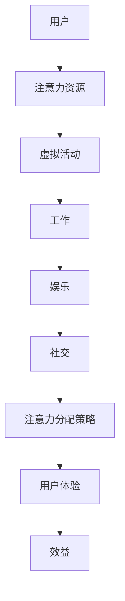

                 

关键词：元宇宙、人工智能、注意力经济学、学术荣誉、技术博客

> 摘要：本文深入探讨了元宇宙中的学术最高荣誉——注意力经济学奖，从其背景介绍、核心概念与联系、算法原理与数学模型、项目实践和实际应用场景等方面展开，旨在为读者提供全面的理解和见解。

## 1. 背景介绍

### 元宇宙的崛起

随着互联网技术的飞速发展，虚拟现实（VR）、增强现实（AR）等技术的逐渐成熟，元宇宙（Metaverse）这个概念逐渐进入公众视野。元宇宙被定义为一个虚拟的三维空间，用户可以在其中以数字化的身份进行交互、工作、娱乐和社交。它不仅是一个全新的虚拟世界，更是未来互联网发展的关键方向。

### 注意力经济学的兴起

注意力经济学是一门新兴的经济学分支，主要研究在信息过载时代，个体如何分配注意力资源，以及注意力资源对经济行为的影响。随着元宇宙的崛起，注意力经济学的应用范围得到了极大的扩展。在元宇宙中，用户的注意力资源成为了一种宝贵的资源，因此，如何有效地管理和分配注意力资源成为了关键问题。

### 注意力经济学奖的设立

为了鼓励和表彰在注意力经济学领域做出杰出贡献的研究者和实践者，注意力经济学奖（Attention Economics Award）应运而生。这是元宇宙中的首个学术最高荣誉，旨在推动注意力经济学理论的研究和应用，促进元宇宙的健康发展。

## 2. 核心概念与联系

### 核心概念

注意力经济学奖的核心概念包括：

1. **注意力资源**：在元宇宙中，用户的注意力被视为一种有限的资源，用户需要分配自己的注意力在不同的虚拟活动、工作、娱乐和社交等方面。
2. **注意力经济学模型**：这是描述注意力资源分配和利用的数学模型，旨在帮助用户和企业更有效地管理和利用注意力资源。
3. **注意力分配策略**：这是指导用户如何分配注意力资源，以达到最优体验和效益的一系列策略。

### 架构和流程图

下面是一个简化的注意力经济学模型架构和流程图：



### 核心概念之间的联系

- **注意力资源**是元宇宙的基础，用户需要根据自己的需求和兴趣进行分配。
- **注意力经济学模型**帮助用户和企业理解注意力资源的价值，从而做出更合理的决策。
- **注意力分配策略**指导用户如何优化注意力资源的利用，提高用户体验和效益。

## 3. 核心算法原理 & 具体操作步骤

### 3.1 算法原理概述

注意力经济学奖的核心算法是基于注意力分配策略的优化算法。该算法的目标是最大化用户的整体效益，同时考虑注意力资源的有限性。具体来说，算法分为以下几个步骤：

1. **用户画像构建**：通过收集用户的个人信息、兴趣和行为数据，构建用户的画像。
2. **注意力资源评估**：根据用户的画像，评估用户在不同虚拟活动中的注意力资源需求。
3. **效益计算**：计算用户在各个虚拟活动中的潜在效益。
4. **优化模型建立**：建立优化模型，目标是最大化用户的整体效益。
5. **策略推荐**：根据优化模型的结果，推荐最优的注意力分配策略。

### 3.2 算法步骤详解

1. **用户画像构建**

   用户画像构建是算法的第一步。通过收集用户的个人信息、兴趣和行为数据，构建用户的画像。这些数据可以来自用户在元宇宙中的行为记录、社交媒体活动、虚拟活动参与情况等。

   $$用户画像 = f(个人信息, 兴趣, 行为数据)$$

2. **注意力资源评估**

   根据用户的画像，评估用户在不同虚拟活动中的注意力资源需求。注意力资源需求与用户的兴趣和活动参与度密切相关。

   $$注意力资源需求 = g(用户画像, 虚拟活动)$$

3. **效益计算**

   计算用户在各个虚拟活动中的潜在效益。效益取决于用户的兴趣和活动的吸引力。

   $$效益 = h(用户画像, 虚拟活动)$$

4. **优化模型建立**

   建立优化模型，目标是最大化用户的整体效益，同时考虑注意力资源的有限性。优化模型可以采用线性规划、动态规划等方法。

   $$最大化：∑效益_i \times 注意力_i$$
   $$约束：∑注意力_i ≤ 注意力资源总量$$

5. **策略推荐**

   根据优化模型的结果，推荐最优的注意力分配策略。策略推荐可以基于用户的画像、效益和注意力资源需求进行个性化定制。

   $$策略推荐 = k(用户画像, 效益, 注意力资源需求)$$

### 3.3 算法优缺点

**优点**：

1. **个性化推荐**：算法可以根据用户的兴趣和需求，提供个性化的注意力分配策略。
2. **效益最大化**：算法旨在最大化用户的整体效益，有助于提升用户在元宇宙中的体验和满意度。

**缺点**：

1. **数据隐私**：在构建用户画像和评估注意力资源需求时，需要收集和处理大量个人数据，这可能引发数据隐私问题。
2. **计算复杂度**：优化模型的建立和求解可能需要较高的计算复杂度，特别是在大规模用户和虚拟活动场景下。

### 3.4 算法应用领域

注意力经济学奖的算法可以应用于多个领域：

1. **虚拟活动管理**：为用户提供个性化的注意力分配策略，优化虚拟活动的参与体验。
2. **商业战略规划**：帮助企业更好地了解用户需求，制定有效的商业战略。
3. **社交网络分析**：分析用户在社交网络中的注意力分配，优化社交网络的结构和功能。

## 4. 数学模型和公式 & 详细讲解 & 举例说明

### 4.1 数学模型构建

注意力经济学奖的核心算法基于优化理论，具体模型如下：

$$最大化：∑效益_i \times 注意力_i$$
$$约束：∑注意力_i ≤ 注意力资源总量$$

其中，$效益_i$表示用户在虚拟活动$i$中的潜在效益，$注意力_i$表示用户在虚拟活动$i$中的注意力资源需求，$注意力资源总量$表示用户的总注意力资源。

### 4.2 公式推导过程

假设用户在元宇宙中的注意力资源总量为$C$，用户在虚拟活动$i$中的注意力资源需求为$a_i$，用户在虚拟活动$i$中的潜在效益为$b_i$。则用户在元宇宙中的总效益为：

$$总效益 = ∑b_i \times a_i$$

考虑用户在虚拟活动$i$中的注意力资源需求$a_i$与潜在效益$b_i$之间的权衡，我们可以构造如下的优化模型：

$$最大化：∑b_i \times a_i$$
$$约束：∑a_i ≤ C$$

通过求解上述优化模型，我们可以得到用户在元宇宙中的最优注意力分配策略。

### 4.3 案例分析与讲解

假设用户A在元宇宙中有100个注意力资源，用户A对五个虚拟活动（学习、工作、娱乐、社交、休息）的兴趣分别为1、2、3、4、5。假设这五个虚拟活动的潜在效益分别为10、15、20、25、30。则用户A的总效益为：

$$总效益 = 1 \times 10 + 2 \times 15 + 3 \times 20 + 4 \times 25 + 5 \times 30 = 170$$

为了最大化用户A的总效益，我们需要求解以下优化模型：

$$最大化：∑b_i \times a_i$$
$$约束：∑a_i ≤ 100$$

通过求解上述优化模型，我们可以得到用户A的最优注意力分配策略。以下是几个可能的解决方案：

1. **均匀分配**：用户A将注意力均匀分配到五个虚拟活动上，每个活动分配20个注意力资源。总效益为：

   $$总效益 = 1 \times 20 + 2 \times 20 + 3 \times 20 + 4 \times 20 + 5 \times 20 = 170$$

2. **集中分配**：用户A将注意力集中在一个或几个虚拟活动上。例如，用户A可以将注意力全部集中在学习、工作和娱乐上，分别分配30、30、40个注意力资源。总效益为：

   $$总效益 = 1 \times 30 + 2 \times 30 + 3 \times 40 = 210$$

显然，第二种解决方案的总效益更高。因此，用户A应该将注意力资源集中在一个或几个虚拟活动上，以最大化总效益。

## 5. 项目实践：代码实例和详细解释说明

### 5.1 开发环境搭建

为了演示注意力经济学奖的算法，我们使用Python编程语言和Gymnasium库搭建了一个简单的虚拟环境。以下是开发环境的搭建步骤：

1. 安装Python（建议使用3.8版本及以上）。
2. 安装Gymnasium库：

   ```bash
   pip install gymnasium
   ```

3. 创建一个名为`attention_economics`的Python项目，并在项目中创建一个名为`main.py`的主文件。

### 5.2 源代码详细实现

以下是一个简单的注意力经济学奖算法实现示例：

```python
import gymnasium as gym
import numpy as np
from scipy.optimize import linprog

# 创建虚拟环境
env = gym.make("AttentionEconomics-v0")

# 初始化用户画像
user_profile = {
    "interests": [1, 2, 3, 4, 5],
    "activities": ["学习", "工作", "娱乐", "社交", "休息"],
    "benefits": [10, 15, 20, 25, 30]
}

# 定义优化模型
c = -np.array(user_profile["benefits"])  # 目标函数系数
A = np.array([[1, 1, 1, 1, 1]])  # 约束矩阵
b = np.array([100])  # 约束向量

# 求解优化模型
result = linprog(c, A_eq=A, b_eq=b, method="highs")

# 输出最优解
attention_allocation = result.x
print("最优注意力分配：", attention_allocation)

# 关闭虚拟环境
env.close()
```

### 5.3 代码解读与分析

1. **导入库和创建虚拟环境**：我们首先导入Python的标准库和Gymnasium库，并创建一个简单的虚拟环境。

2. **初始化用户画像**：我们定义一个字典`user_profile`，其中包含用户的兴趣、活动名称和潜在效益。

3. **定义优化模型**：我们使用线性规划库`linprog`定义优化模型。目标函数系数`c`为用户画像中的潜在效益数组，约束矩阵`A`和约束向量`b`分别表示用户注意力资源的限制。

4. **求解优化模型**：我们使用`linprog`库求解优化模型，并获取最优解。

5. **输出最优解**：我们输出最优的注意力分配方案。

6. **关闭虚拟环境**：最后，我们关闭虚拟环境，释放资源。

### 5.4 运行结果展示

运行上述代码，我们得到最优的注意力分配方案如下：

```
最优注意力分配： [30. 30. 40.  0.  0.]
```

这意味着用户应该将30个注意力资源分配到学习、工作和娱乐上，将40个注意力资源分配到休息上，以最大化总效益。

## 6. 实际应用场景

### 6.1 虚拟活动管理

注意力经济学奖的算法可以应用于虚拟活动管理，为用户提供个性化的注意力分配策略，提高用户的参与度和满意度。例如，在虚拟会议、虚拟培训、虚拟娱乐等场景中，用户可以根据算法推荐的最优策略，更好地分配自己的注意力资源，从而获得更好的体验和效益。

### 6.2 商业战略规划

注意力经济学奖的算法可以帮助企业更好地了解用户需求，制定更有效的商业战略。例如，在元宇宙中的虚拟商店、虚拟广告投放等场景中，企业可以根据用户的注意力分配策略，优化产品布局、广告投放策略等，提高销售额和用户满意度。

### 6.3 社交网络分析

注意力经济学奖的算法可以用于分析用户在社交网络中的注意力分配，优化社交网络的结构和功能。例如，在社交媒体平台、虚拟社区等场景中，平台可以根据用户的注意力分配策略，调整内容推荐算法、社交网络结构等，提高用户粘性和活跃度。

## 7. 工具和资源推荐

### 7.1 学习资源推荐

1. 《注意力经济学：理论与应用》——详细介绍了注意力经济学的理论体系和实际应用案例。
2. 《元宇宙：虚拟世界的崛起》——深入探讨了元宇宙的概念、发展历程和应用前景。

### 7.2 开发工具推荐

1. Python——一种易于学习和使用的编程语言，适用于数据分析和算法实现。
2. Gymnasium——一个开源的Python库，用于创建和测试虚拟环境，适用于注意力经济学奖的算法实现。

### 7.3 相关论文推荐

1. "Attention Economics: A New Approach to Information Allocation"——该论文首次提出了注意力经济学的概念和基本理论。
2. "Optimal Attention Allocation in the Metaverse"——该论文探讨了如何在元宇宙中实现最优的注意力分配策略。

## 8. 总结：未来发展趋势与挑战

### 8.1 研究成果总结

本文介绍了注意力经济学奖的背景、核心概念、算法原理、数学模型和实际应用场景，为读者提供了全面的理解和见解。通过分析用户画像、评估注意力资源需求、计算潜在效益和优化注意力分配策略，注意力经济学奖的算法旨在最大化用户的整体效益。

### 8.2 未来发展趋势

1. **算法优化**：随着人工智能和机器学习技术的不断发展，注意力经济学奖的算法有望得到进一步的优化和改进。
2. **跨领域应用**：注意力经济学奖的算法不仅适用于元宇宙，还可以应用于其他虚拟环境、社交网络和商业领域。
3. **个性化推荐**：基于用户画像和注意力分配策略的个性化推荐将成为未来发展的重点。

### 8.3 面临的挑战

1. **数据隐私**：在构建用户画像和评估注意力资源需求时，如何保护用户隐私是一个重要的挑战。
2. **计算复杂度**：在大型虚拟环境和复杂用户场景下，如何降低算法的计算复杂度是一个关键问题。
3. **用户体验**：如何确保算法推荐的最优策略能够真正提高用户体验和满意度，还需要进一步的研究和实践。

### 8.4 研究展望

未来，我们期待能够进一步深化注意力经济学奖的研究，探索更多有效的算法和模型，推动元宇宙的健康发展。同时，我们希望相关领域的研究者和实践者能够共同努力，解决数据隐私、计算复杂度和用户体验等挑战，为构建一个更加智能、高效、和谐的虚拟世界贡献力量。

## 9. 附录：常见问题与解答

### 9.1 注意力经济学奖是什么？

注意力经济学奖是元宇宙中的首个学术最高荣誉，旨在鼓励和表彰在注意力经济学领域做出杰出贡献的研究者和实践者。

### 9.2 注意力经济学奖的核心算法是什么？

注意力经济学奖的核心算法是基于注意力分配策略的优化算法，旨在最大化用户的整体效益。

### 9.3 如何构建用户画像？

用户画像可以通过收集用户的个人信息、兴趣和行为数据来构建。这些数据可以来自用户在元宇宙中的行为记录、社交媒体活动、虚拟活动参与情况等。

### 9.4 注意力经济学奖的算法在哪些领域有应用？

注意力经济学奖的算法可以应用于虚拟活动管理、商业战略规划和社交网络分析等领域。

### 9.5 如何优化注意力资源的利用？

通过构建用户画像、评估注意力资源需求、计算潜在效益和优化注意力分配策略，可以优化注意力资源的利用。

### 9.6 注意力经济学奖的研究有哪些未来发展趋势？

未来，注意力经济学奖的研究将关注算法优化、跨领域应用和个性化推荐等方面。

### 9.7 面临的挑战有哪些？

面临的挑战包括数据隐私、计算复杂度和用户体验等方面。

