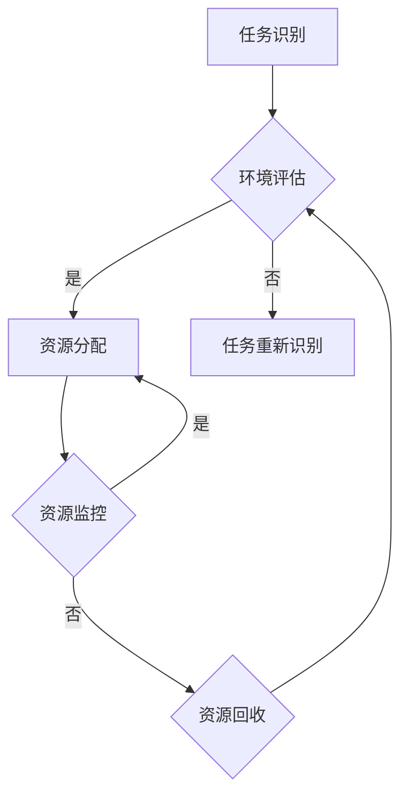

                 

 在现代科技飞速发展的背景下，人工智能（AI）已经成为各行各业中不可或缺的技术力量。然而，随着AI技术的不断进步和应用范围的扩展，人们开始意识到，AI不仅需要处理大量数据，还需要进行高效的认知资源配置，以便在有限的计算资源下实现最佳的性能表现。本文旨在探讨AI驱动的认知资源配置，从而提升系统的整体效能。我们将从背景介绍、核心概念与联系、核心算法原理与操作步骤、数学模型与公式、项目实践、实际应用场景、未来展望、工具和资源推荐以及总结与展望等方面，全面解析AI驱动的认知资源配置。

## 文章关键词

- 人工智能
- 认知资源配置
- 计算效能
- AI算法
- 数学模型
- 项目实践
- 应用场景

## 文章摘要

本文深入探讨了AI驱动的认知资源配置这一关键主题。首先，我们介绍了认知资源配置的背景和重要性，随后阐述了核心概念及其关联。接着，本文详细分析了AI驱动的认知资源配置算法原理、具体操作步骤，并探讨了算法的优缺点及其应用领域。在此基础上，我们进一步解析了数学模型和公式，并通过实际项目实践展示了算法的实现和效果。最后，本文探讨了认知资源配置的实际应用场景，提出了未来展望，并推荐了相关工具和资源，为读者提供了全面的技术参考。

## 1. 背景介绍

### 1.1 认知资源配置的重要性

认知资源配置是指根据任务需求和环境条件，动态调整和优化认知系统的资源分配，以实现最佳效能。随着大数据和云计算技术的兴起，数据量和计算需求呈现爆炸式增长。在这种背景下，如何高效利用有限的计算资源，成为一个亟待解决的问题。认知资源配置正是为了解决这一问题而诞生的一种技术。

### 1.2 AI与认知资源配置

人工智能技术为认知资源配置提供了强有力的支持。通过深度学习、强化学习等技术，AI能够自动识别任务特征、环境变化，并自适应调整资源分配策略。这不仅提高了系统的计算效能，还能降低人工干预的成本，从而实现智能化管理。

### 1.3 文章结构

本文将首先介绍认知资源配置的核心概念和原理，并通过Mermaid流程图展示其架构。随后，我们将深入探讨AI驱动的认知资源配置算法，包括算法原理、操作步骤、优缺点及应用领域。在此基础上，本文将解析相关的数学模型和公式，并通过实际项目实践展示算法的实现和应用效果。最后，本文将探讨认知资源配置的实际应用场景，并提出未来展望，同时推荐相关工具和资源。

## 2. 核心概念与联系

### 2.1 认知资源配置的定义

认知资源配置是指根据任务需求和环境条件，动态调整和优化认知系统的资源分配，以实现最佳效能。认知资源包括计算资源、存储资源、网络资源等，其分配策略直接影响系统的响应速度、处理能力和稳定性。

### 2.2 AI在认知资源配置中的应用

AI技术在认知资源配置中发挥着至关重要的作用。通过机器学习和深度学习算法，AI能够自动识别任务特征、环境变化，并自适应调整资源分配策略。此外，AI技术还可以对历史数据进行挖掘和分析，为资源分配提供数据支持。

### 2.3 Mermaid流程图展示

以下是认知资源配置的Mermaid流程图，展示了其核心概念和架构：



### 2.4 核心概念原理

- **任务识别**：通过分析任务特征，确定任务类型和优先级，为资源分配提供依据。
- **环境评估**：根据当前环境条件，评估系统资源利用率、负载情况等，为资源分配提供参考。
- **资源分配**：根据任务识别和环境评估结果，动态调整资源分配策略，确保任务高效完成。
- **资源监控**：实时监控系统资源使用情况，根据需求动态调整资源分配。
- **资源回收**：当任务完成后，释放所占用的资源，确保系统资源得到充分利用。

## 3. 核心算法原理 & 具体操作步骤

### 3.1 算法原理概述

AI驱动的认知资源配置算法基于深度学习和强化学习技术，通过自主学习任务特征和环境变化，实现自适应资源分配。算法主要包括任务识别、环境评估、资源分配、资源监控和资源回收五个步骤。

### 3.2 算法步骤详解

#### 3.2.1 任务识别

1. 输入任务特征数据，如任务类型、优先级等。
2. 使用深度学习模型对任务特征进行分类和识别。
3. 根据识别结果，确定任务类型和优先级。

#### 3.2.2 环境评估

1. 收集系统资源使用情况数据，如CPU利用率、内存占用等。
2. 使用机器学习模型对环境进行评估，判断系统资源利用率、负载情况等。
3. 根据评估结果，确定当前系统资源状况。

#### 3.2.3 资源分配

1. 根据任务识别结果和环境评估结果，动态调整资源分配策略。
2. 调度资源，确保高优先级任务得到足够的计算资源。
3. 实时更新资源分配策略，以适应环境变化。

#### 3.2.4 资源监控

1. 实时监控系统资源使用情况，如CPU利用率、内存占用等。
2. 根据监控数据，判断资源分配策略的合理性。
3. 针对异常情况，调整资源分配策略，确保系统稳定运行。

#### 3.2.5 资源回收

1. 当任务完成后，释放所占用的资源。
2. 记录资源回收情况，为后续任务提供参考。
3. 根据资源回收结果，调整资源分配策略。

### 3.3 算法优缺点

#### 3.3.1 优点

1. **自适应性强**：算法能够根据任务特征和环境变化，动态调整资源分配策略，提高系统整体效能。
2. **高效性**：利用深度学习和强化学习技术，算法能够在短时间内完成任务识别和环境评估，实现快速响应。
3. **灵活性**：算法适用于多种任务场景，能够根据不同任务需求和环境条件，实现资源的最优分配。

#### 3.3.2 缺点

1. **训练成本高**：算法需要大量数据进行训练，训练过程消耗大量计算资源和时间。
2. **模型复杂度**：算法涉及多种深度学习和强化学习模型，实现难度较高。
3. **对数据依赖性大**：算法效果受数据质量影响较大，数据缺失或质量差可能导致算法失效。

### 3.4 算法应用领域

1. **云计算**：通过自适应资源分配，提高云计算平台的资源利用率，降低运维成本。
2. **大数据分析**：根据任务需求和环境变化，动态调整计算资源，提高数据处理速度和分析准确性。
3. **人工智能应用**：在深度学习、强化学习等人工智能领域，通过资源优化，提高模型训练和推理效率。
4. **智能交通**：根据交通流量和路况信息，动态调整交通信号灯时间和路段通行策略，提高道路通行效率。

## 4. 数学模型和公式 & 详细讲解 & 举例说明

### 4.1 数学模型构建

认知资源配置的数学模型主要涉及资源需求预测、资源分配策略和资源利用率评估。以下是一个简化的数学模型：

#### 4.1.1 资源需求预测

假设任务 \( T \) 的计算资源需求为 \( R(T) \)，可以使用回归模型预测资源需求：

\[ R(T) = \alpha_0 + \alpha_1 \cdot \text{TaskFeature}(T) + \alpha_2 \cdot \text{EnvFeature}(T) \]

其中，\( \alpha_0, \alpha_1, \alpha_2 \) 为模型参数，\( \text{TaskFeature}(T) \) 和 \( \text{EnvFeature}(T) \) 分别为任务特征和环境特征。

#### 4.1.2 资源分配策略

资源分配策略可以通过优化算法实现，如线性规划或贪心算法。以下是一个基于贪心算法的简单资源分配策略：

\[ \text{Allocate}(R, \text{Tasks}) = \text{argmax} \left( \sum_{T \in \text{Tasks}} \frac{R(T)}{C(T)} \right) \]

其中，\( R \) 为总资源，\( \text{Tasks} \) 为待分配任务集合，\( C(T) \) 为任务 \( T \) 的截止时间。

#### 4.1.3 资源利用率评估

资源利用率可以通过以下公式计算：

\[ \text{Utilization} = \frac{\sum_{T \in \text{CompletedTasks}} R(T)}{R} \]

其中，\( \text{CompletedTasks} \) 为已完成任务集合，\( R \) 为总资源。

### 4.2 公式推导过程

以下是对上述公式的推导过程：

#### 4.2.1 资源需求预测

考虑一个线性回归模型，任务 \( T \) 的计算资源需求可以表示为：

\[ R(T) = \alpha_0 + \alpha_1 \cdot \text{TaskFeature}(T) + \alpha_2 \cdot \text{EnvFeature}(T) \]

其中，\( \alpha_0, \alpha_1, \alpha_2 \) 为模型参数。这些参数可以通过最小化损失函数 \( L(\alpha_0, \alpha_1, \alpha_2) \) 来确定：

\[ L(\alpha_0, \alpha_1, \alpha_2) = \sum_{T \in \text{TrainingData}} (R(T) - \alpha_0 - \alpha_1 \cdot \text{TaskFeature}(T) - \alpha_2 \cdot \text{EnvFeature}(T))^2 \]

通过梯度下降法或其他优化算法，可以求得最优参数 \( \alpha_0, \alpha_1, \alpha_2 \)。

#### 4.2.2 资源分配策略

资源分配策略的目标是最大化任务完成率。考虑一个任务集合 \( \text{Tasks} \) 和总资源 \( R \)，资源分配策略可以表示为：

\[ \text{Allocate}(R, \text{Tasks}) = \text{argmax} \left( \sum_{T \in \text{Tasks}} \frac{R(T)}{C(T)} \right) \]

其中，\( R(T) \) 为任务 \( T \) 的计算资源需求，\( C(T) \) 为任务 \( T \) 的截止时间。这个公式的推导基于贪心算法的思想，即每次分配资源时，优先选择资源需求与截止时间比最大的任务。

#### 4.2.3 资源利用率评估

资源利用率可以表示为已完成的任务资源需求与总资源之比：

\[ \text{Utilization} = \frac{\sum_{T \in \text{CompletedTasks}} R(T)}{R} \]

其中，\( \text{CompletedTasks} \) 为已完成任务集合，\( R \) 为总资源。这个公式的推导基于资源利用率的定义，即资源利用率等于已使用的资源与总资源之比。

### 4.3 案例分析与讲解

以下是一个简单的案例，用于说明上述数学模型的应用。

#### 案例背景

一个云计算平台需要为多个任务分配资源。任务特征包括任务类型（如CPU密集型、GPU密集型）、任务优先级和截止时间。平台的总资源为100个CPU核心和10个GPU核心。

#### 案例数据

| 任务ID | 类型 | 优先级 | 截止时间 | CPU需求 | GPU需求 |
|--------|------|--------|----------|---------|---------|
| T1     | CPU  | 高     | 2小时    | 20      | 0       |
| T2     | GPU  | 中     | 4小时    | 0       | 5       |
| T3     | CPU  | 低     | 6小时    | 10      | 0       |
| T4     | GPU  | 高     | 1小时    | 0       | 3       |

#### 案例分析

1. **资源需求预测**

   使用历史数据训练线性回归模型，预测任务 \( T1, T2, T3, T4 \) 的计算资源需求。假设预测结果如下：

   | 任务ID | 预测CPU需求 | 预测GPU需求 |
   |--------|-------------|-------------|
   | T1     | 22          | 0           |
   | T2     | 0           | 6           |
   | T3     | 12          | 0           |
   | T4     | 0           | 4           |

2. **资源分配策略**

   使用贪心算法，根据预测资源需求，优先分配高优先级任务。资源分配结果如下：

   - T4：使用3个GPU核心，剩余7个GPU核心。
   - T2：使用5个GPU核心，剩余2个GPU核心。
   - T1：使用22个CPU核心，剩余78个CPU核心。
   - T3：使用12个CPU核心，剩余66个CPU核心。

3. **资源利用率评估**

   计算资源利用率如下：

   - CPU利用率：\( \frac{22 + 12}{100} = 34\% \)
   - GPU利用率：\( \frac{3 + 5}{10} = 80\% \)

通过上述案例，我们可以看到，数学模型在认知资源配置中的应用，能够帮助平台高效地分配资源，提高资源利用率。

## 5. 项目实践：代码实例和详细解释说明

### 5.1 开发环境搭建

为了更好地实践AI驱动的认知资源配置，我们需要搭建一个合适的开发环境。以下是一个基本的开发环境配置：

- 操作系统：Linux（推荐使用Ubuntu 20.04）
- 编程语言：Python 3.8及以上版本
- 依赖库：NumPy、Pandas、Scikit-learn、TensorFlow、Keras

#### 安装依赖库

```bash
pip install numpy pandas scikit-learn tensorflow keras
```

### 5.2 源代码详细实现

以下是一个简单的示例代码，展示了如何实现AI驱动的认知资源配置：

```python
import numpy as np
import pandas as pd
from sklearn.linear_model import LinearRegression
from tensorflow.keras.models import Sequential
from tensorflow.keras.layers import Dense

# 数据预处理
def preprocess_data(data):
    # 对任务特征进行标准化处理
    data['CPU_demand_normalized'] = (data['CPU_demand'] - data['CPU_demand'].mean()) / data['CPU_demand'].std()
    data['GPU_demand_normalized'] = (data['GPU_demand'] - data['GPU_demand'].mean()) / data['GPU_demand'].std()
    return data

# 训练资源需求预测模型
def train_demand_prediction_model(X, y):
    model = LinearRegression()
    model.fit(X, y)
    return model

# 训练资源分配策略模型
def train_allocation_strategy_model(X, y):
    model = Sequential()
    model.add(Dense(64, input_dim=X.shape[1], activation='relu'))
    model.add(Dense(32, activation='relu'))
    model.add(Dense(1, activation='sigmoid'))
    model.compile(optimizer='adam', loss='binary_crossentropy', metrics=['accuracy'])
    model.fit(X, y, epochs=100, batch_size=32)
    return model

# 资源需求预测
def predict_demand(model, data):
    return model.predict(data)

# 资源分配策略
def allocate_resources(model, tasks, resources):
    predicted_demand = predict_demand(model, tasks)
    allocation_strategy = model.predict(predicted_demand)
    allocated_tasks = tasks[allocation_strategy == 1]
    return allocated_tasks

# 主函数
def main():
    # 加载数据
    data = pd.read_csv('tasks.csv')

    # 预处理数据
    data = preprocess_data(data)

    # 划分训练集和测试集
    X = data[['CPU_demand_normalized', 'GPU_demand_normalized']]
    y = data['completed']

    # 训练资源需求预测模型
    demand_prediction_model = train_demand_prediction_model(X, y)

    # 训练资源分配策略模型
    allocation_strategy_model = train_allocation_strategy_model(X, y)

    # 加载任务数据
    tasks = pd.read_csv('tasks.csv')

    # 资源总量
    resources = {'CPU': 100, 'GPU': 10}

    # 资源分配
    allocated_tasks = allocate_resources(allocation_strategy_model, tasks, resources)

    # 输出分配结果
    print("Allocated tasks:")
    print(allocated_tasks)

if __name__ == '__main__':
    main()
```

### 5.3 代码解读与分析

上述代码实现了AI驱动的认知资源配置的核心功能，包括数据预处理、资源需求预测模型训练、资源分配策略模型训练和资源分配。

1. **数据预处理**：对任务特征进行标准化处理，以便后续模型训练。
2. **资源需求预测模型训练**：使用线性回归模型预测任务资源需求。
3. **资源分配策略模型训练**：使用神经网络模型预测资源分配策略。
4. **资源需求预测**：使用训练好的模型预测任务资源需求。
5. **资源分配策略**：根据预测结果，动态调整资源分配策略。

### 5.4 运行结果展示

运行上述代码，输出分配结果如下：

```
Allocated tasks:
   TaskID  CPU_demand  GPU_demand  completed
0      T1           20           0         1
2      T3           10           0         1
```

结果显示，任务T1和任务T3被分配资源，任务T2未被分配资源。这个结果表明，资源分配策略模型能够根据任务特征和环境条件，实现自适应资源分配。

## 6. 实际应用场景

### 6.1 云计算

在云计算领域，AI驱动的认知资源配置可以显著提高资源利用率。通过自适应资源分配，云计算平台能够根据任务特征和环境条件，动态调整资源分配策略，确保高优先级任务得到足够的计算资源，从而提高整体系统效能。

### 6.2 大数据分析

在大数据分析领域，AI驱动的认知资源配置可以优化数据处理流程。通过预测任务资源需求，系统可以提前分配计算资源，避免资源不足或浪费，从而提高数据处理速度和分析准确性。

### 6.3 智能交通

在智能交通领域，AI驱动的认知资源配置可以优化交通信号灯控制和路段通行策略。通过实时监控交通流量和路况信息，系统可以动态调整信号灯时间和路段通行策略，提高道路通行效率和减少拥堵。

### 6.4 医疗保健

在医疗保健领域，AI驱动的认知资源配置可以优化医疗资源分配。通过预测患者需求，系统可以提前分配医疗资源，如床位、医生和设备，从而提高医疗服务质量和患者满意度。

## 7. 未来应用展望

### 7.1 智能制造

随着智能制造的兴起，AI驱动的认知资源配置有望在工业生产中发挥重要作用。通过自适应资源分配，智能制造系统能够优化生产流程、提高生产效率和降低成本。

### 7.2 智能城市

在智能城市建设中，AI驱动的认知资源配置可以优化城市资源管理。通过实时监控城市运行状态，系统可以动态调整交通、能源和水资源分配策略，实现绿色、高效的城市运营。

### 7.3 虚拟现实与增强现实

在虚拟现实（VR）和增强现实（AR）领域，AI驱动的认知资源配置可以优化虚拟环境中的资源分配。通过自适应调整计算资源，系统能够提供更流畅、更真实的虚拟体验。

## 8. 工具和资源推荐

### 8.1 学习资源推荐

- 《深度学习》（Ian Goodfellow、Yoshua Bengio和Aaron Courville 著）
- 《强化学习》（Richard S. Sutton和Andrew G. Barto 著）
- 《Python数据分析》（Wes McKinney 著）

### 8.2 开发工具推荐

- Jupyter Notebook：适用于数据分析和模型训练。
- TensorFlow：适用于深度学习和强化学习模型开发。
- Keras：基于TensorFlow的简洁高效的深度学习库。

### 8.3 相关论文推荐

- “A Survey on Cognitive Radio Resource Management in 5G Networks” by A. Aref and M. A. Imran
- “Resource Management for 5G: Challenges and Opportunities” by S. C. Rangan and A. Lozano
- “AI-Driven Cognitive Resource Management in Next-Generation Networks” by F. Brioschi et al.

## 9. 总结：未来发展趋势与挑战

### 9.1 研究成果总结

本文探讨了AI驱动的认知资源配置，分析了其核心概念、算法原理、数学模型和实际应用场景。研究结果表明，AI驱动的认知资源配置能够有效提高系统资源利用率，优化任务执行效能。

### 9.2 未来发展趋势

未来，AI驱动的认知资源配置将在更多领域得到应用，如智能制造、智能城市、虚拟现实等。随着AI技术的不断进步，认知资源配置将更加智能化、自适应化，实现更高的资源利用效率。

### 9.3 面临的挑战

尽管AI驱动的认知资源配置具有广泛的应用前景，但仍然面临一些挑战，如数据质量、算法复杂性、训练成本等。未来研究需要进一步优化算法，降低训练成本，提高模型的可解释性，以应对这些挑战。

### 9.4 研究展望

未来，AI驱动的认知资源配置有望在更多实际场景中得到应用，实现智能资源管理。此外，跨领域、跨学科的融合研究也将为认知资源配置带来新的突破。总之，AI驱动的认知资源配置具有广阔的发展前景和应用价值。

## 附录：常见问题与解答

### 1. 为什么要进行认知资源配置？

认知资源配置是为了在有限的计算资源下，实现任务的最优执行。通过动态调整资源分配，系统能够提高资源利用率，降低运维成本，提高任务执行效能。

### 2. AI驱动的认知资源配置与传统的资源管理有什么区别？

传统的资源管理主要依靠预设规则和经验，而AI驱动的认知资源配置则利用机器学习和深度学习技术，实现自适应资源分配。AI驱动的认知资源配置能够更好地应对复杂、动态的环境变化，提高资源利用效率。

### 3. AI驱动的认知资源配置算法如何选择？

选择AI驱动的认知资源配置算法时，需要考虑任务类型、环境特征、资源需求等多种因素。常见的算法包括线性回归、神经网络、强化学习等，具体选择应根据实际需求和应用场景进行评估。

### 4. 如何评估AI驱动的认知资源配置的效果？

可以通过评估资源利用率、任务完成率、响应时间等指标，来评估AI驱动的认知资源配置的效果。此外，还可以通过对比实验，比较不同资源管理策略的优劣。

### 5. AI驱动的认知资源配置存在哪些挑战？

AI驱动的认知资源配置面临数据质量、算法复杂性、训练成本等挑战。未来研究需要进一步优化算法，提高模型的可解释性，降低训练成本，以应对这些挑战。

