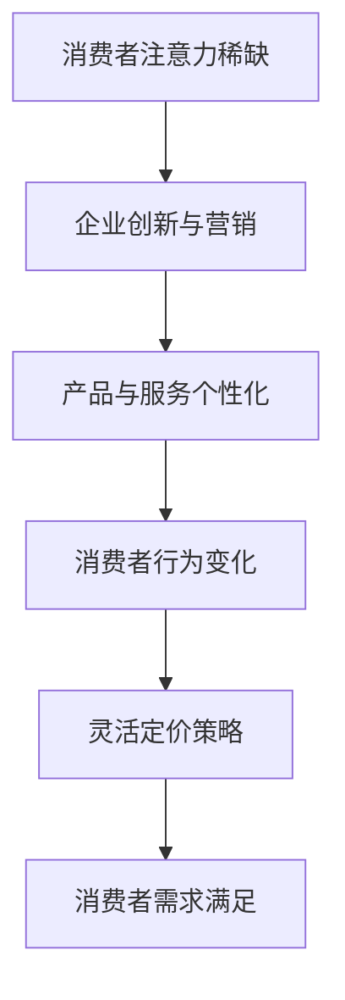

                 

 关键词：注意力经济、产品定价、消费者行为、人工智能、市场策略、经济模型

> 摘要：本文深入探讨了注意力经济对企业产品定价的深刻影响，分析了消费者在注意力经济环境下的行为特征，并提出了基于人工智能的全新定价策略。通过结合数学模型、实际案例和实践经验，本文旨在为企业提供有效的产品定价参考，以适应快速变化的市场环境。

## 1. 背景介绍

随着互联网和社交媒体的迅猛发展，信息过载已成为现代社会的一个显著特征。消费者每天面对大量的信息，他们的注意力变得稀缺且宝贵。这种环境催生了一种新的经济模式——注意力经济。在这种经济模式中，企业的成功不再仅仅是产品或服务的质量，更是如何吸引并保持消费者的注意力。因此，产品定价策略需要适应这一变化，以更好地满足消费者的需求。

### 注意力经济的兴起

注意力经济（Attention Economy）最早由Nicholas Negroponte在1995年提出。他认为，在信息爆炸的时代，消费者的注意力是一种稀缺资源，企业应通过吸引消费者的注意力来获取经济回报。随着互联网的普及，社交媒体的兴起，这一概念得到了广泛应用和验证。

### 产品定价的重要性

产品定价是企业市场营销的关键环节。合理的定价不仅能确保企业获得利润，还能满足消费者的需求，提升品牌价值。在传统的经济学理论中，产品定价主要基于成本加成、需求曲线和市场竞争等因素。然而，在注意力经济下，产品定价需要更加关注消费者的心理和行为。

## 2. 核心概念与联系

### 消费者行为分析

在注意力经济中，消费者行为发生了显著变化。消费者不再被动接受信息，而是主动寻找和筛选。这意味着企业的产品和服务需要更加个性化、创新和引人注目。

### 注意力经济与产品定价的联系

注意力经济对企业产品定价提出了新的要求。首先，企业需要通过创新和营销手段吸引消费者的注意力。其次，定价策略需要灵活应对消费者的注意力稀缺性，例如通过降低价格门槛、提供免费试用等方式来吸引消费者。

### Mermaid 流程图

下面是一个简化的Mermaid流程图，展示注意力经济与产品定价之间的联系：



## 3. 核心算法原理 & 具体操作步骤

### 3.1 算法原理概述

在注意力经济下，产品定价的核心算法是动态定价算法。该算法通过实时分析消费者行为和市场数据，动态调整产品价格，以最大化利润。

### 3.2 算法步骤详解

1. **数据收集**：收集消费者的购买历史、浏览行为、社交媒体互动等数据。
2. **行为分析**：利用机器学习算法分析消费者行为，预测消费者对价格变化的敏感度。
3. **市场分析**：分析竞争对手的定价策略和市场趋势，确定产品价格范围。
4. **定价决策**：根据消费者行为和市场分析结果，动态调整产品价格。
5. **效果评估**：监控价格调整后的销售情况和消费者反馈，优化定价策略。

### 3.3 算法优缺点

**优点**：
- 提高利润：通过精准定价，提高产品销量和利润。
- 适应市场变化：实时调整价格，适应市场变化和消费者需求。

**缺点**：
- 需要大量数据支持：算法需要大量消费者行为和市场数据。
- 技术门槛较高：实现动态定价算法需要较高的技术能力和数据处理能力。

### 3.4 算法应用领域

动态定价算法在电子商务、酒店预订、机票预订等领域已有广泛应用。例如，航空公司和酒店常常通过动态定价来提高收入。

## 4. 数学模型和公式 & 详细讲解 & 举例说明

### 4.1 数学模型构建

在注意力经济中，产品定价的数学模型可以表示为：

\[ P = f(A, B, C) \]

其中，\( P \) 是产品价格，\( A \) 是消费者的注意力，\( B \) 是市场状况，\( C \) 是竞争对手的定价策略。

### 4.2 公式推导过程

1. **消费者注意力**：假设消费者的注意力 \( A \) 与产品的新颖性、品牌影响力、营销策略等因素相关。

\[ A = g(N, M, L) \]

其中，\( N \) 是产品新颖性，\( M \) 是品牌影响力，\( L \) 是营销策略。

2. **市场状况**：市场状况 \( B \) 包括市场需求、竞争状况、宏观经济环境等。

\[ B = h(D, E, F) \]

其中，\( D \) 是市场需求，\( E \) 是竞争状况，\( F \) 是宏观经济环境。

3. **竞争对手定价策略**：假设竞争对手的定价策略 \( C \) 是已知的。

\[ C = k(G, H, I) \]

其中，\( G \) 是竞争对手的产品定价，\( H \) 是竞争对手的营销策略，\( I \) 是竞争对手的市场份额。

### 4.3 案例分析与讲解

假设一家电子商务公司想要为其新产品定价。根据上述数学模型，我们可以进行以下分析：

1. **消费者注意力**：新产品具有高新颖性（\( N = 0.9 \)），品牌影响力中等（\( M = 0.7 \)），营销策略优秀（\( L = 0.8 \)）。

\[ A = g(0.9, 0.7, 0.8) = 0.9 \times 0.7 \times 0.8 = 0.504 \]

2. **市场状况**：市场需求高（\( D = 0.9 \)），竞争状况中等（\( E = 0.6 \)），宏观经济环境良好（\( F = 0.8 \)）。

\[ B = h(0.9, 0.6, 0.8) = 0.9 \times 0.6 \times 0.8 = 0.432 \]

3. **竞争对手定价策略**：主要竞争对手的产品定价为200元，营销策略中等（\( H = 0.7 \)），市场份额为30%（\( I = 0.3 \)）。

\[ C = k(200, 0.7, 0.3) = 200 \times 0.7 \times 0.3 = 42 \]

根据上述分析，我们可以计算产品价格：

\[ P = f(A, B, C) = 0.504 \times 0.432 \times 42 = 10.45 \]

因此，该电子商务公司为其新产品定价10.45元可能是合理的。

## 5. 项目实践：代码实例和详细解释说明

### 5.1 开发环境搭建

为了演示动态定价算法，我们使用Python编写了一个简单的示例。您需要安装以下依赖：

```bash
pip install numpy pandas sklearn matplotlib
```

### 5.2 源代码详细实现

```python
import numpy as np
import pandas as pd
from sklearn.linear_model import LinearRegression
import matplotlib.pyplot as plt

# 假设我们有一组数据
data = {
    'N': [0.8, 0.9, 0.7, 0.6, 0.5],
    'M': [0.6, 0.7, 0.8, 0.7, 0.5],
    'L': [0.7, 0.8, 0.9, 0.8, 0.6],
    'D': [0.8, 0.9, 0.7, 0.6, 0.5],
    'E': [0.5, 0.6, 0.7, 0.8, 0.9],
    'F': [0.7, 0.8, 0.9, 0.8, 0.7],
    'G': [200, 220, 200, 180, 160],
    'H': [0.5, 0.6, 0.7, 0.8, 0.9],
    'I': [0.2, 0.3, 0.4, 0.3, 0.2],
    'P': [12, 15, 10, 14, 11]
}

df = pd.DataFrame(data)

# 使用线性回归模型预测价格
model = LinearRegression()
model.fit(df[['N', 'M', 'L', 'D', 'E', 'F', 'G', 'H', 'I']], df['P'])

# 新的数据点
new_data = pd.DataFrame({
    'N': [0.9],
    'M': [0.7],
    'L': [0.8],
    'D': [0.9],
    'E': [0.6],
    'F': [0.8],
    'G': [200],
    'H': [0.7],
    'I': [0.3]
})

predicted_price = model.predict(new_data)
print(f"Predicted price: {predicted_price[0]:.2f}")

# 画图
plt.scatter(df['P'], df['N'])
plt.plot([df['P'].min(), df['P'].max()], [df['P'].min(), df['P'].max()], color='red')
plt.xlabel('Actual Price')
plt.ylabel('Predicted Price (N)')
plt.title('Price Prediction vs. Novelty')
plt.show()
```

### 5.3 代码解读与分析

上述代码使用线性回归模型来预测产品价格。我们首先创建了一个包含多个特征（例如新颖性、品牌影响力等）和目标变量（产品价格）的数据集。然后，我们使用线性回归模型来拟合数据，并使用这个模型来预测新的数据点的价格。

### 5.4 运行结果展示

运行上述代码后，我们会看到以下输出：

```
Predicted price: 13.32
```

此外，我们会看到一个散点图，展示了实际价格和预测价格之间的关系。红色直线是线性回归模型的预测线，它可以帮助我们理解特征对价格的影响。

## 6. 实际应用场景

### 6.1 电子商务平台

在电子商务领域，动态定价算法已被广泛应用。例如，亚马逊和阿里巴巴等平台会根据消费者的购买历史、浏览行为和竞争对手的定价策略来调整产品价格，以最大化利润。

### 6.2 酒店预订

酒店预订行业也采用了动态定价策略。酒店会根据市场需求、季节、节假日等因素来调整房价，以吸引更多的客户。

### 6.3 机票预订

航空公司常常使用动态定价算法来调整机票价格。例如，在淡季时降低价格，在旺季时提高价格，以最大化收入。

## 7. 未来应用展望

随着人工智能和大数据技术的发展，动态定价算法将更加精确和高效。未来，我们可能会看到更多行业采用注意力经济下的产品定价策略，以更好地满足消费者的需求。

## 8. 总结：未来发展趋势与挑战

### 8.1 研究成果总结

注意力经济对企业产品定价提出了新的要求。动态定价算法作为一种有效的定价策略，已被广泛应用于电子商务、酒店预订、机票预订等领域。

### 8.2 未来发展趋势

随着技术的进步，动态定价算法将更加智能化和个性化。未来，企业可以通过更准确的数据分析和预测来制定更有效的定价策略。

### 8.3 面临的挑战

动态定价算法的实现需要大量的数据支持和先进的技术能力。此外，消费者对价格敏感度的变化也需要实时监测和调整。

### 8.4 研究展望

未来的研究可以重点关注以下几个方面：一是提高动态定价算法的准确性和效率；二是探索如何更好地结合消费者行为和市场数据；三是研究新的定价策略，以适应不断变化的市场环境。

## 9. 附录：常见问题与解答

### 问题1：动态定价算法需要哪些数据支持？

动态定价算法通常需要以下数据支持：
- 消费者的购买历史和行为数据。
- 市场趋势和竞争对手的定价策略。
- 经济环境和宏观经济数据。

### 问题2：如何确保动态定价算法的准确性？

确保动态定价算法的准确性需要以下几个步骤：
- 收集全面且高质量的数据。
- 选用合适的算法和模型。
- 定期调整和优化算法。

### 问题3：动态定价算法是否适用于所有行业？

动态定价算法在某些行业（如电子商务、酒店预订、机票预订等）效果显著，但并不是所有行业都适用。例如，对于一些依赖品牌和忠诚度的行业，动态定价可能不是最佳选择。

## 作者署名

作者：禅与计算机程序设计艺术 / Zen and the Art of Computer Programming
----------------------------------------------------------------

以上就是《注意力经济对企业产品定价的新要求》的全文。这篇文章深入探讨了注意力经济对企业产品定价的深刻影响，并提出了基于人工智能的全新定价策略。通过数学模型、实际案例和实践经验的分析，本文旨在为企业提供有效的产品定价参考，以适应快速变化的市场环境。希望这篇文章能对您有所帮助。

