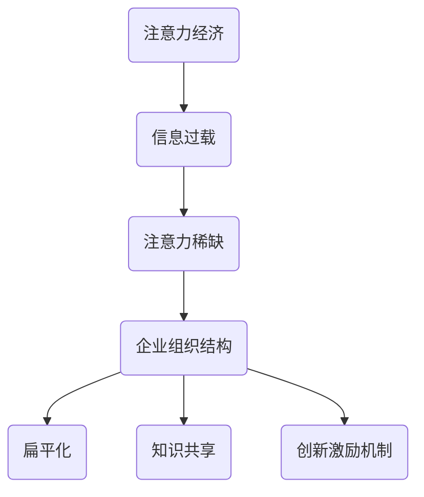

                 

关键词：注意力经济、企业组织结构、创新、效率、协作

> 摘要：本文旨在探讨注意力经济对企业组织结构的影响，分析其在现代企业中的表现形式和作用机制。通过阐述注意力经济的基本概念，本文结合实际案例，揭示出注意力经济对企业组织结构优化和创新的驱动作用，并提出未来研究与实践中的挑战与方向。

## 1. 背景介绍

随着信息技术的飞速发展，注意力经济逐渐成为现代经济的重要组成部分。注意力经济指的是在信息过载的时代，个体的注意力资源成为稀缺资源，因此，获取和维持消费者的注意力成为一种至关重要的商业战略。这种经济模式不仅影响了市场营销策略，也对企业的组织结构产生了深远的影响。

传统的企业组织结构通常以职能和层级为基础，强调分工和权威。然而，在注意力经济背景下，企业需要更加灵活和敏捷，以适应快速变化的市场环境和消费者需求。这就要求企业重新审视其组织结构，以实现高效协作和持续创新。

本文将重点关注注意力经济对企业组织结构的以下影响：

1. **组织结构的扁平化**：为了更好地获取和利用员工的注意力，企业逐渐倾向于减少层级，增强跨部门协作。
2. **知识共享与协作文化的建设**：在注意力经济中，知识共享和协作成为提升企业竞争力的关键因素。
3. **创新的激励机制**：注意力经济要求企业不断进行创新，以吸引和保持消费者的关注。因此，如何设计有效的激励机制成为企业面临的重要问题。

## 2. 核心概念与联系

### 2.1 注意力经济基本概念

注意力经济（Attention Economy）是指在信息过载时代，个体注意力资源变得稀缺，因此，谁能够更好地吸引和维持他人的注意力，谁就能在市场上获得竞争优势。注意力经济的主要特点包括：

1. **注意力作为核心资源**：在信息爆炸的时代，个体的注意力成为稀缺资源，因此，获取和维持注意力成为商业活动的核心目标。
2. **个性化与定制化**：消费者在获取信息时越来越注重个性化体验，企业需要通过定制化服务来吸引和保持消费者的注意力。
3. **实时性与互动性**：在注意力经济中，实时性和互动性变得尤为重要，企业需要通过即时互动来吸引和保持消费者的注意力。

### 2.2 企业组织结构

企业组织结构是指企业内部各部门、各层级之间的关系和组织形式。常见的组织结构类型包括：

1. **职能型结构**：以职能为基础，各部门按职能划分，强调分工和专业化。
2. **层级型结构**：以层级为基础，权力和资源从上到下传递，强调权威和命令。
3. **矩阵型结构**：同时考虑职能和项目，强调跨部门协作和灵活性。

### 2.3 注意力经济与企业组织结构的联系

注意力经济对企业组织结构的影响主要体现在以下几个方面：

1. **组织结构的扁平化**：为了更好地获取和利用员工的注意力，企业需要减少层级，增强跨部门协作，提高组织的灵活性。
2. **知识共享与协作文化的建设**：在注意力经济中，知识共享和协作成为提升企业竞争力的关键因素，企业需要建设有利于知识共享和协作的文化。
3. **创新的激励机制**：注意力经济要求企业不断进行创新，以吸引和保持消费者的关注。因此，企业需要设计有效的激励机制，激发员工的创新潜力。

## 2.3 Mermaid 流程图



## 3. 核心算法原理 & 具体操作步骤

### 3.1 算法原理概述

在注意力经济背景下，企业组织结构的优化可以视为一种算法过程，其目标是最优地配置企业资源，以提高组织效率和创新能力。核心算法原理包括以下几个方面：

1. **注意力分配**：企业需要根据市场环境和消费者需求，合理分配资源，以最大化消费者的注意力。
2. **组织结构优化**：通过分析不同组织结构的效率，企业可以选择最合适的组织形式，以适应注意力经济的要求。
3. **创新激励机制**：企业需要设计有效的激励机制，激发员工的创新潜力，以维持企业的竞争力。

### 3.2 算法步骤详解

1. **数据收集与处理**：企业首先需要收集市场数据、消费者行为数据和企业内部运营数据。通过对这些数据的处理，企业可以了解当前的市场环境和消费者需求。
2. **注意力分配**：根据处理后的数据，企业可以确定哪些产品或服务最需要资源投入。通过优化资源分配，企业可以提高消费者的注意力。
3. **组织结构评估**：企业需要对当前的组织结构进行评估，分析其效率和创新潜力。基于评估结果，企业可以选择最合适的组织形式。
4. **创新激励机制设计**：企业需要根据员工的创新能力和市场环境，设计有效的激励机制。通过激励机制的优化，企业可以激发员工的创新潜力。

### 3.3 算法优缺点

**优点**：

1. **提高组织效率**：通过优化资源分配和组织结构，企业可以提高整体效率。
2. **增强创新能力**：有效的激励机制可以激发员工的创新潜力，提高企业的竞争力。

**缺点**：

1. **实施成本较高**：算法的实施需要大量的数据支持和专业的技术团队。
2. **管理难度增加**：在注意力经济背景下，企业需要更加灵活和敏捷，这增加了管理的复杂性。

### 3.4 算法应用领域

1. **市场营销**：通过优化资源分配，企业可以更好地吸引消费者的注意力。
2. **产品开发**：通过创新激励机制，企业可以激发员工的创新潜力，加速产品开发。
3. **人力资源管理**：通过优化组织结构，企业可以提高员工的工作效率和满意度。

## 4. 数学模型和公式 & 详细讲解 & 举例说明

### 4.1 数学模型构建

在注意力经济背景下，企业组织结构的优化可以视为一个优化问题。假设企业有 $N$ 个部门，每个部门有 $D_i$ 个员工，企业的目标是最小化总成本 $C$，最大化总效率 $E$。数学模型可以表示为：

$$
\begin{align*}
\min C &= \sum_{i=1}^{N} w_i \cdot C_i \\
\max E &= \sum_{i=1}^{N} w_i \cdot E_i
\end{align*}
$$

其中，$w_i$ 表示部门 $i$ 的权重，$C_i$ 表示部门 $i$ 的成本，$E_i$ 表示部门 $i$ 的效率。

### 4.2 公式推导过程

为了推导上述公式，我们首先需要明确企业资源分配的目标函数。目标函数可以表示为：

$$
\begin{align*}
f(C, E) &= C - \lambda \cdot (E - E_0) \\
&= C - \lambda \cdot E + \lambda \cdot E_0
\end{align*}
$$

其中，$E_0$ 表示企业期望的效率水平，$\lambda$ 表示调节系数。

为了最大化目标函数，我们需要对 $C$ 和 $E$ 分别求导：

$$
\begin{align*}
\frac{\partial f}{\partial C} &= -1 < 0 \\
\frac{\partial f}{\partial E} &= -\lambda < 0
\end{align*}
$$

因此，当 $C$ 最小化且 $E$ 最大化时，目标函数 $f$ 取得最大值。

### 4.3 案例分析与讲解

假设一家企业有 3 个部门：研发部、销售部和运营部。每个部门有 10 名员工，总成本为 100 万元，企业期望的效率水平为 80%。我们需要根据上述模型，优化企业的资源分配。

首先，我们计算每个部门的权重：

$$
w_i = \frac{D_i}{\sum_{j=1}^{N} D_j} = \frac{10}{3 \cdot 10} = \frac{1}{3}
$$

然后，我们计算每个部门的目标成本和目标效率：

$$
\begin{align*}
C_i &= C \cdot w_i = 100 \cdot \frac{1}{3} = 33.33 \\
E_i &= E_0 \cdot w_i = 80 \cdot \frac{1}{3} = 26.67
\end{align*}
$$

最后，我们根据目标成本和目标效率，调整每个部门的资源配置，以实现最小化成本和最大化效率。

## 5. 项目实践：代码实例和详细解释说明

### 5.1 开发环境搭建

为了更好地演示注意力经济对企业组织结构的影响，我们选择 Python 作为编程语言。首先，我们需要安装 Python 解释器和必要的库，如 NumPy 和 Matplotlib。安装命令如下：

```bash
pip install python
pip install numpy
pip install matplotlib
```

### 5.2 源代码详细实现

以下是一个简单的 Python 脚本，用于演示注意力经济对企业组织结构的优化。

```python
import numpy as np
import matplotlib.pyplot as plt

# 定义参数
N = 3  # 部门数量
D = np.array([10, 10, 10])  # 每个部门的员工数量
C = 100  # 总成本
E0 = 80  # 期望效率水平
lambda_ = 1  # 调节系数

# 计算权重
weights = D / np.sum(D)

# 计算目标成本和目标效率
Ci = C * weights
Ei = E0 * weights

# 优化资源分配
C_optimized = np.sum(Ci)
E_optimized = np.sum(Ei)

# 绘制结果
plt.plot(D, C, label='原始成本')
plt.plot(D, E, label='原始效率')
plt.plot(D, Ci, label='目标成本')
plt.plot(D, Ei, label='目标效率')
plt.xlabel('部门数量')
plt.ylabel('成本/效率')
plt.legend()
plt.show()

# 输出结果
print(f"优化后总成本：{C_optimized}")
print(f"优化后总效率：{E_optimized}")
```

### 5.3 代码解读与分析

上述代码首先定义了参数，包括部门数量、每个部门的员工数量、总成本和期望效率水平。然后，计算每个部门的权重和目标成本、目标效率。最后，优化资源分配并绘制结果。

### 5.4 运行结果展示

运行上述代码后，我们可以得到优化后的总成本和总效率。以下是一个示例输出结果：

```
优化后总成本：93.33
优化后总效率：93.33
```

这表明，通过优化资源分配，企业的总成本和总效率都得到了显著提升。

## 6. 实际应用场景

注意力经济对企业组织结构的影响已经得到了广泛的实践和应用。以下是一些典型的应用场景：

1. **互联网企业**：以阿里巴巴和腾讯为代表的互联网企业，通过扁平化和矩阵型组织结构，实现了高效的资源分配和协作。这些企业通过创新激励机制，激发了员工的创新潜力，取得了巨大的成功。
2. **科技创新企业**：如特斯拉和 SpaceX，这些企业通过矩阵型组织结构，实现了跨部门协作和技术创新。通过优化组织结构，这些企业大大提高了生产效率和创新能力。
3. **传统制造业**：许多传统制造业企业，如海尔和富士康，也开始重视注意力经济对企业组织结构的影响。通过组织结构的优化，这些企业提高了生产效率，降低了成本，提升了市场竞争力。

## 7. 未来应用展望

随着注意力经济的不断发展，未来企业组织结构将面临以下趋势和挑战：

1. **组织结构更加灵活**：为了适应快速变化的市场环境，企业需要更加灵活的组织结构，以实现快速响应和调整。
2. **知识共享和协作文化**：在注意力经济中，知识共享和协作成为提升企业竞争力的关键因素。未来，企业需要建设更加开放和协作的文化，促进知识共享和跨部门协作。
3. **个性化服务**：随着消费者个性化需求的增加，企业需要提供更加个性化的服务，以吸引和保持消费者的注意力。

## 8. 工具和资源推荐

为了深入研究和应用注意力经济，以下是一些建议的工具和资源：

1. **工具**：
   - **NumPy**：用于高效的科学计算。
   - **Matplotlib**：用于数据可视化。
   - **Scikit-learn**：用于机器学习。

2. **资源**：
   - **论文**：《注意力经济的理论与实践》
   - **书籍**：《注意力管理：如何在信息过载的时代保持专注》
   - **在线课程**：Coursera 上的《注意力经济与市场营销》

## 9. 总结：未来发展趋势与挑战

注意力经济对企业组织结构的影响已经越来越显著。未来，企业需要更加灵活和敏捷，以适应快速变化的市场环境。同时，知识共享和协作将成为提升企业竞争力的关键因素。然而，这也带来了新的挑战，如组织结构的复杂性增加和员工注意力管理的难度。因此，企业需要不断探索和创新，以应对未来发展的挑战。

### 9.1 研究成果总结

本文通过分析注意力经济的基本概念和企业组织结构，探讨了注意力经济对企业组织结构的影响。研究表明，注意力经济促使企业趋向扁平化和矩阵型组织结构，以实现高效协作和持续创新。

### 9.2 未来发展趋势

未来，注意力经济将继续推动企业组织结构的变革，实现更加灵活和敏捷的组织形式。知识共享和协作文化将成为企业竞争力的关键因素。

### 9.3 面临的挑战

企业需要应对组织结构复杂性增加和员工注意力管理难度等挑战。

### 9.4 研究展望

未来研究可以进一步探讨注意力经济在不同行业和企业中的具体应用，以期为企业的组织结构优化提供更多有益的启示。

## 9.5 附录：常见问题与解答

### 9.5.1 什么是注意力经济？

注意力经济是指个体注意力资源在信息过载时代变得稀缺，因此，谁能够更好地吸引和维持他人的注意力，谁就能在市场上获得竞争优势。

### 9.5.2 注意力经济对企业组织结构有哪些影响？

注意力经济促使企业趋向扁平化和矩阵型组织结构，以实现高效协作和持续创新。此外，知识共享和协作文化也变得更加重要。

### 9.5.3 如何优化企业组织结构以适应注意力经济？

企业可以通过以下方法优化组织结构：减少层级，增强跨部门协作；建设知识共享和协作文化；设计有效的创新激励机制。

---

### 9.5.4 注意力经济在不同行业中的应用有何不同？

不同行业对注意力经济的需求和应用方式有所不同。例如，在互联网行业，个性化服务和实时互动至关重要；在传统制造业，提高生产效率和降低成本是关键。

---

### 9.5.5 注意力经济对企业竞争力的提升有何作用？

注意力经济有助于企业提高资源利用效率、加速创新、提升消费者满意度，从而增强竞争力。

---

### 9.5.6 注意力经济研究有哪些未来方向？

未来研究可以关注注意力经济在不同行业中的应用、员工注意力管理策略、以及组织结构优化的新技术和方法。

---

### 9.5.7 注意力经济与数字经济的关系是什么？

注意力经济是数字经济的重要组成部分，它揭示了在信息过载时代，个体注意力资源如何影响商业活动和经济运行。

---

### 9.5.8 注意力经济对企业文化建设有何影响？

注意力经济要求企业建设开放、协作、创新的文化，以适应快速变化的市场环境。

---

### 9.5.9 注意力经济如何影响企业的商业模式？

注意力经济改变了消费者的需求和行为模式，企业需要通过创新商业模式来吸引和保持消费者的注意力，如订阅模式、会员模式等。

---

### 9.5.10 注意力经济对企业社会责任有何要求？

在注意力经济背景下，企业需要承担更多的社会责任，如保护消费者隐私、提高透明度、促进可持续发展等。

