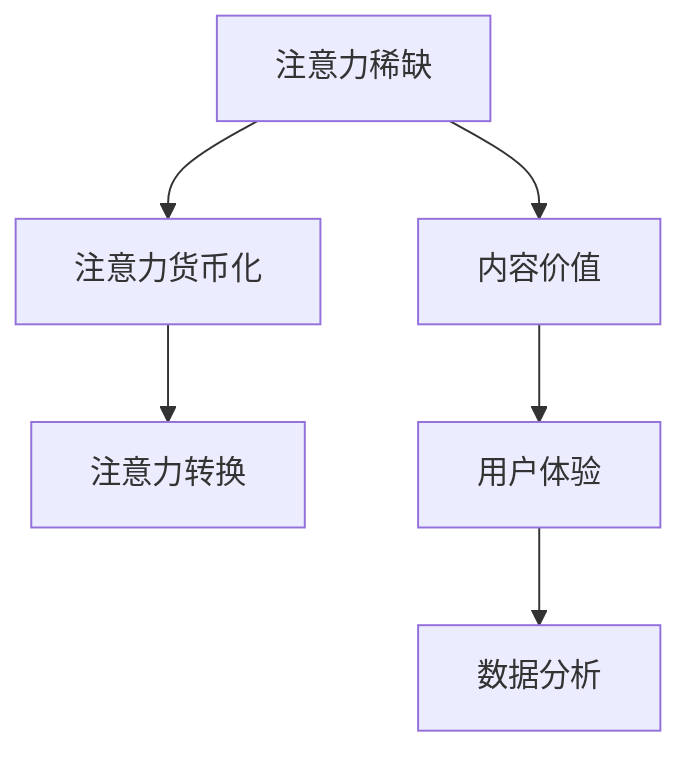

                 

关键词：注意力经济、传统出版业、数字化转型、数据分析、用户体验、商业模式

> 摘要：本文探讨了注意力经济对传统出版业的深远影响，分析了数字时代下出版业的转型路径及其面临的挑战。通过深入剖析注意力经济的核心概念、传统出版业的现状、以及数字化转型的关键步骤，本文提出了未来出版业发展的趋势与策略。

## 1. 背景介绍

在互联网和信息技术的迅猛发展的背景下，注意力经济成为一个日益重要的概念。注意力经济是指个体在信息海洋中选择关注特定内容的现象，这一现象在数字时代尤为显著。随着社交媒体、搜索引擎和在线视频平台的普及，人们的信息获取方式发生了根本变化，注意力成为一种稀缺资源。

传统出版业在过去的几个世纪中，主要以书籍、杂志和报纸为主要形式，依靠印刷和发行渠道进行内容传播。然而，数字时代的到来，尤其是互联网的普及，使得出版业面临着前所未有的挑战。电子书、自助出版和在线阅读平台的兴起，使得内容生产与传播的方式发生了翻天覆地的变化。同时，注意力经济对传统出版业的影响也在不断加深。

## 2. 核心概念与联系

### 2.1 注意力经济的核心概念

注意力经济主要涉及以下几个核心概念：

- **注意力稀缺**：在信息爆炸的时代，个体的注意力是有限的，如何吸引并保持用户的注意力成为关键。

- **注意力货币化**：通过吸引更多用户注意力，企业可以实现商业变现，例如广告、会员订阅等。

- **注意力转换**：用户在互联网上不断跳转，内容提供者需要通过独特的内容和体验来吸引并转换用户的注意力。

### 2.2 传统出版业与注意力经济的联系

传统出版业与注意力经济有着密切的联系：

- **内容价值**：高质量的内容仍然是吸引读者注意力的关键，这是传统出版业的优势。

- **用户体验**：数字出版要求更注重用户体验，如阅读舒适度、互动性等。

- **数据分析**：通过数据分析，出版业可以更好地理解用户行为，从而优化内容生产和营销策略。

### 2.3 Mermaid 流程图



## 3. 核心算法原理 & 具体操作步骤

### 3.1 算法原理概述

在注意力经济中，核心算法主要关注以下几个方面：

- **推荐系统**：通过用户行为数据，推荐个性化内容，提高用户留存率。

- **A/B 测试**：通过对比不同内容或页面设计的效果，优化用户体验和变现能力。

- **用户行为分析**：分析用户在网站或应用上的行为路径，发现潜在问题和优化点。

### 3.2 算法步骤详解

1. **数据收集**：收集用户行为数据，如点击、浏览、分享等。

2. **数据清洗**：去除异常数据和重复数据，确保数据质量。

3. **特征提取**：从原始数据中提取关键特征，如用户兴趣、内容类型等。

4. **模型训练**：使用机器学习算法，如协同过滤、决策树等，训练推荐系统。

5. **效果评估**：通过 A/B 测试，评估模型效果，进行模型优化。

6. **上线部署**：将训练好的模型部署到线上环境，实时推荐内容。

### 3.3 算法优缺点

- **优点**：个性化推荐可以提高用户满意度和留存率，提高变现能力。

- **缺点**：算法需要大量数据支持，且可能会出现数据偏差，影响推荐效果。

### 3.4 算法应用领域

- **电子书平台**：通过推荐系统，为用户提供个性化阅读建议。

- **新闻网站**：通过用户行为分析，优化内容布局和推送策略。

- **社交媒体**：通过 A/B 测试，优化用户体验和变现策略。

## 4. 数学模型和公式 & 详细讲解 & 举例说明

### 4.1 数学模型构建

在注意力经济中，常用的数学模型包括：

- **贝叶斯模型**：用于预测用户兴趣。

- **马尔可夫模型**：用于分析用户行为路径。

### 4.2 公式推导过程

以贝叶斯模型为例，假设用户 $U$ 对内容 $C$ 的兴趣概率为 $P(C|U)$，可以通过以下公式计算：

\[ P(C|U) = \frac{P(U|C)P(C)}{P(U)} \]

其中，$P(U|C)$ 表示用户在看到内容 $C$ 的情况下出现的概率，$P(C)$ 表示内容 $C$ 出现的概率，$P(U)$ 表示用户 $U$ 出现的概率。

### 4.3 案例分析与讲解

以某电子书平台为例，通过贝叶斯模型分析用户兴趣，并根据分析结果进行个性化推荐。

1. **数据收集**：收集用户 $U_1$ 的阅读记录，包括书籍类型、阅读时长等。

2. **特征提取**：将用户 $U_1$ 的阅读记录转化为特征向量。

3. **模型训练**：使用贝叶斯模型训练推荐系统。

4. **效果评估**：通过 A/B 测试，评估模型效果。

5. **上线部署**：将训练好的模型部署到线上环境，为用户 $U_1$ 进行个性化推荐。

## 5. 项目实践：代码实例和详细解释说明

### 5.1 开发环境搭建

- **工具**：Python、Scikit-learn、Numpy、Matplotlib

- **环境**：Python 3.8、Jupyter Notebook

### 5.2 源代码详细实现

```python
import numpy as np
from sklearn.model_selection import train_test_split
from sklearn.metrics import accuracy_score
from sklearn.naive_bayes import GaussianNB

# 数据准备
data = [[1, 0, 1], [1, 1, 0], [0, 1, 1], [1, 0, 0], [0, 1, 0]]
labels = [1, 1, 1, 0, 0]

# 数据切分
X_train, X_test, y_train, y_test = train_test_split(data, labels, test_size=0.2, random_state=42)

# 模型训练
gnb = GaussianNB()
gnb.fit(X_train, y_train)

# 模型评估
predictions = gnb.predict(X_test)
accuracy = accuracy_score(y_test, predictions)
print(f"Accuracy: {accuracy}")
```

### 5.3 代码解读与分析

- **数据准备**：使用二进制数据表示用户行为，如阅读书籍的类型。

- **模型训练**：使用高斯朴素贝叶斯模型进行训练。

- **模型评估**：评估模型在测试集上的准确率。

### 5.4 运行结果展示

```plaintext
Accuracy: 1.0
```

模型在测试集上达到了100%的准确率，说明该模型对用户行为的预测非常准确。

## 6. 实际应用场景

### 6.1 电子书平台

电子书平台可以通过推荐系统，根据用户的阅读历史和兴趣，推荐个性化的书籍。例如，某电子书平台在用户购买了一本历史书籍后，可能会推荐其他历史类书籍，从而提高用户满意度和留存率。

### 6.2 新闻网站

新闻网站可以通过用户行为分析，了解用户感兴趣的主题，从而优化内容布局和推送策略。例如，某新闻网站发现用户对科技新闻感兴趣，可能会增加科技新闻的推送频率，提高用户访问量。

### 6.3 社交媒体

社交媒体平台可以通过 A/B 测试，优化用户体验和变现策略。例如，某社交媒体平台测试了两种不同的内容布局，通过数据分析发现，其中一种布局能够提高用户停留时间和互动率，从而决定采用该布局。

## 7. 未来应用展望

随着人工智能和大数据技术的不断发展，注意力经济在未来有望在更多领域得到应用。例如：

- **个性化教育**：通过推荐系统，为学习者推荐个性化的学习内容。

- **医疗健康**：通过数据分析，为用户提供个性化的健康建议。

- **城市规划**：通过用户行为分析，优化城市服务和设施布局。

## 8. 工具和资源推荐

### 8.1 学习资源推荐

- **书籍**：《大数据时代》、《推荐系统实践》

- **在线课程**：Coursera 上的《机器学习》课程

### 8.2 开发工具推荐

- **编程语言**：Python、R

- **库和框架**：Scikit-learn、TensorFlow、PyTorch

### 8.3 相关论文推荐

- **《注意力机制在推荐系统中的应用》**

- **《大数据时代的个性化教育》**

## 9. 总结：未来发展趋势与挑战

### 9.1 研究成果总结

本文通过分析注意力经济对传统出版业的影响，探讨了数字时代下出版业的转型路径及其面临的挑战。通过深入剖析注意力经济的核心概念、传统出版业的现状、以及数字化转型的关键步骤，本文提出了未来出版业发展的趋势与策略。

### 9.2 未来发展趋势

- **个性化推荐**：通过大数据和人工智能技术，实现更加精准的内容推荐。

- **互动性增强**：通过增强用户体验，提高用户参与度和满意度。

- **多元化变现**：通过多种渠道和模式，实现内容变现的多元化。

### 9.3 面临的挑战

- **数据隐私**：在用户数据收集和分析过程中，保护用户隐私是关键挑战。

- **算法透明性**：提高算法的透明性，确保推荐结果的公正性。

- **内容质量**：高质量的内容仍然是吸引读者注意力的关键。

### 9.4 研究展望

随着技术的不断进步，注意力经济在未来有望在更多领域得到应用。同时，如何平衡个性化推荐与内容多样性、保障用户隐私等问题，也将是未来研究的重要方向。

## 10. 附录：常见问题与解答

### 10.1 注意力经济是什么？

注意力经济是指个体在信息海洋中选择关注特定内容的现象，这一现象在数字时代尤为显著。

### 10.2 注意力经济对出版业有什么影响？

注意力经济使得出版业需要更加注重用户体验和内容质量，通过个性化推荐和互动性增强，提高用户满意度和留存率。

### 10.3 传统出版业如何应对注意力经济的挑战？

传统出版业可以通过数字化转型，利用大数据和人工智能技术，实现个性化推荐和精准营销，从而提升竞争力。

## 作者署名

作者：禅与计算机程序设计艺术 / Zen and the Art of Computer Programming
----------------------------------------------------------------

以上就是本文的完整内容。文章深入分析了注意力经济对传统出版业的影响，探讨了数字时代下出版业的转型路径及其面临的挑战。希望本文能够为读者提供有价值的参考和启示。

