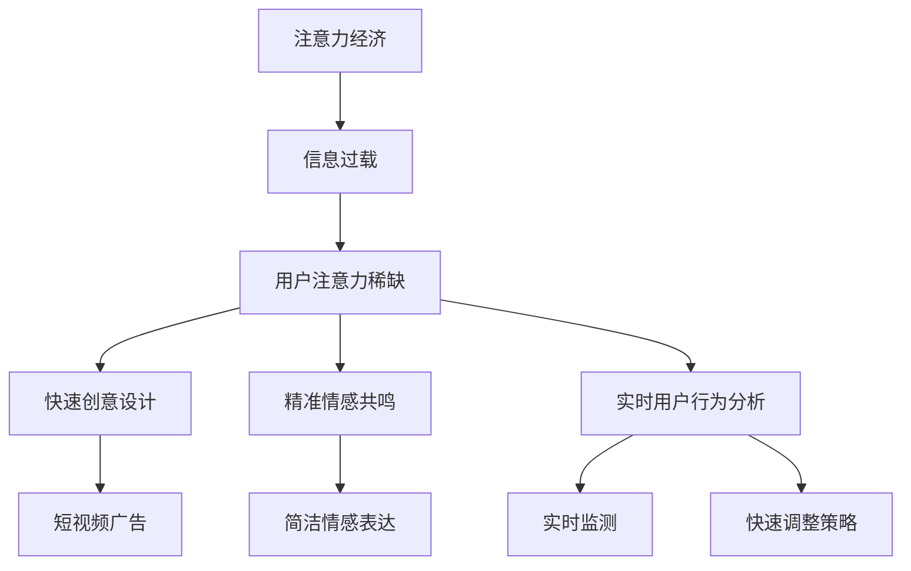

                 

## 1. 背景介绍

注意力经济（Attention Economy）是一种基于人们注意力资源的经济学概念，它强调在信息过载的时代，个体的注意力成为一种稀缺且宝贵的资源。随着互联网的普及和社交媒体的发展，人们每天接触到的信息量呈爆炸式增长，因此如何吸引并保持用户的注意力，成为企业和品牌在营销中面临的一大挑战。

传统广告创意通常依赖于创意设计、情感共鸣以及用户行为的统计分析等方法，试图在短时间内抓住用户的注意力。然而，在注意力经济的环境下，这些方法面临着新的要求和挑战。首先，信息过载导致用户对广告的注意力更加短暂，广告必须更快速、更具吸引力才能在用户瞬间滑过的信息流中脱颖而出。其次，用户的注意力越来越个性化，广告创意需要更加精准地匹配用户的兴趣和需求。此外，注意力经济还促使广告主在创意设计和投放策略上更加注重数据驱动和效果导向。

本文将深入探讨注意力经济对传统广告创意的这些新要求，分析其背后的技术原理和具体操作步骤，并通过实际案例和未来展望，为广告从业者提供有价值的参考。

# 文章关键词

注意力经济、广告创意、信息过载、用户行为分析、个性化营销、数据驱动

## 文章摘要

本文探讨了注意力经济对传统广告创意带来的新要求。在信息过载的时代，用户的注意力成为一种稀缺资源，这要求广告创意必须更加快速、精准且具有吸引力。文章从注意力经济的背景出发，分析了其核心概念和原理，阐述了注意力经济对广告创意的影响和挑战，并提出了相应的解决方案和策略。通过实际案例和未来展望，本文为广告从业者提供了有益的参考和启示。

## 2. 核心概念与联系

### 2.1 注意力经济的概念

注意力经济（Attention Economy）是一个由Pierre Levy提出的概念，意指在信息社会，个体的注意力成为一种有限的、宝贵的资源。与传统的物质经济不同，注意力经济强调，个体在信息过载的环境下，如何吸引和保持用户的注意力，从而实现价值创造和传递。

### 2.2 信息过载与用户注意力

信息过载是指个体在短时间内接收到的信息量超过其处理能力。随着互联网和社交媒体的发展，信息过载已成为现代社会普遍存在的问题。用户在浏览网页、阅读新闻、观看视频等活动中，面临着大量的信息输入，这使得他们的注意力资源变得稀缺。

注意力稀缺性导致用户对广告的注意力更加短暂，广告主必须更快地抓住用户的注意力，才能在用户瞬间滑过的信息流中脱颖而出。此外，用户的注意力越来越个性化，广告创意需要更加精准地匹配用户的兴趣和需求。

### 2.3 传统广告创意与注意力经济

传统广告创意通常依赖于创意设计、情感共鸣以及用户行为的统计分析等方法。然而，在注意力经济的环境下，这些方法面临着新的挑战。

#### 2.3.1 创意设计的挑战

在信息过载的环境中，用户对广告的注意力更加短暂，创意设计必须更快速、更具吸引力。例如，短视频和动画广告因为其形式新颖、内容紧凑，更能够吸引用户的注意力。

#### 2.3.2 情感共鸣的挑战

情感共鸣在传统广告中是非常重要的，但在注意力经济下，情感共鸣的时间窗口变得更短。广告主需要在有限的时间内，通过简洁而有力的方式，触动用户的情感。

#### 2.3.3 用户行为分析的挑战

用户行为的统计分析在传统广告中已被广泛应用，但在注意力经济下，用户行为分析的要求更高。广告主需要实时监测用户的行为，并迅速调整广告策略，以适应用户的个性化需求。

### 2.4 Mermaid 流程图



## 3. 核心算法原理 & 具体操作步骤

### 3.1 算法原理概述

在注意力经济环境下，广告创意的核心算法主要涉及以下几个方面：

1. **用户画像分析**：通过大数据分析和机器学习算法，构建用户的个性化画像，包括用户的兴趣爱好、行为习惯等。
2. **内容推荐算法**：基于用户的个性化画像，利用推荐系统算法，为用户推荐与其兴趣相关的内容和广告。
3. **实时调整策略**：通过实时监测用户行为和反馈，动态调整广告内容和投放策略，以提高广告的点击率和转化率。

### 3.2 算法步骤详解

1. **用户画像构建**：
   - 数据收集：通过用户注册信息、浏览历史、购买记录等多渠道收集用户数据。
   - 特征提取：对收集的数据进行清洗和特征提取，如用户年龄、性别、地域、兴趣爱好等。
   - 画像构建：利用机器学习算法，如聚类、分类等，将用户特征转化为用户画像。

2. **内容推荐算法**：
   - 相似度计算：计算用户之间的相似度，如基于协同过滤算法的相似度计算。
   - 推荐生成：根据用户画像和相似度计算结果，生成个性化的推荐列表。
   - 排序优化：利用排序算法，如Top-N推荐算法，优化推荐列表的排序，提高推荐质量。

3. **实时调整策略**：
   - 用户行为监测：实时监测用户的点击、浏览、购买等行为，收集用户反馈数据。
   - 数据分析：对用户行为数据进行分析，识别用户需求和偏好。
   - 策略调整：根据分析结果，动态调整广告内容和投放策略，如调整广告展示频率、投放地域等。

### 3.3 算法优缺点

**优点**：
1. **个性化推荐**：通过用户画像和推荐算法，能够为用户提供更加个性化的广告内容，提高用户体验。
2. **实时调整**：能够根据用户行为实时调整广告策略，提高广告效果和转化率。

**缺点**：
1. **数据隐私**：用户数据的收集和使用可能引发隐私问题。
2. **算法复杂性**：构建和优化推荐算法需要大量的计算资源和专业技能。

### 3.4 算法应用领域

注意力经济的核心算法在多个领域得到广泛应用，包括但不限于：
1. **电子商务**：为用户推荐商品，提高销售额。
2. **社交媒体**：为用户提供个性化的内容推荐，增加用户粘性。
3. **在线广告**：优化广告投放策略，提高广告效果。

## 4. 数学模型和公式 & 详细讲解 & 举例说明

### 4.1 数学模型构建

在注意力经济的背景下，我们可以构建一个简单的数学模型来描述用户的注意力分配和广告效果。

设：
- \( A \) 为用户的总注意力资源。
- \( C \) 为用户对广告的注意力消耗。
- \( R \) 为广告的回报，如点击率、转化率等。
- \( P \) 为广告的吸引力，如创意设计、情感共鸣等。

根据模型，用户对广告的注意力消耗 \( C \) 与广告的吸引力 \( P \) 成正比，即 \( C \propto P \)。同时，用户对广告的注意力消耗 \( C \) 与广告的回报 \( R \) 成反比，即 \( C \propto \frac{1}{R} \)。

因此，我们可以得到以下数学模型：

\[ C = k \cdot \frac{P}{R} \]

其中，\( k \) 为比例常数。

### 4.2 公式推导过程

1. **用户注意力资源的消耗**：

   设用户在单位时间内对广告的注意力消耗为 \( C \)，广告的吸引力为 \( P \)，广告的回报为 \( R \)。

   根据注意力经济的原理，用户对广告的注意力消耗与广告的吸引力成正比，与广告的回报成反比。

   因此，我们可以得到以下比例关系：

   \[ C \propto P \]
   \[ C \propto \frac{1}{R} \]

2. **构建数学模型**：

   将上述比例关系结合起来，我们可以得到：

   \[ C = k \cdot \frac{P}{R} \]

   其中，\( k \) 为比例常数，表示用户注意力的单位消耗与广告吸引力及回报之间的比例关系。

### 4.3 案例分析与讲解

#### 案例背景

假设一家电子商务公司在进行在线广告推广，用户在单位时间内对广告的注意力资源为 \( A = 100 \) 个单位。广告的吸引力 \( P \) 和回报 \( R \) 分别为 \( P = 5 \) 和 \( R = 10 \)。

#### 模型应用

根据数学模型，用户对广告的注意力消耗 \( C \) 为：

\[ C = k \cdot \frac{P}{R} \]

代入 \( P = 5 \) 和 \( R = 10 \)，我们可以得到：

\[ C = k \cdot \frac{5}{10} = 0.5k \]

#### 模型解读

1. **广告吸引力的影响**：

   假设广告的吸引力 \( P \) 增加20%，即 \( P' = 6 \)，则用户对广告的注意力消耗 \( C' \) 为：

   \[ C' = k \cdot \frac{P'}{R} = k \cdot \frac{6}{10} = 0.6k \]

   对比 \( C \) 和 \( C' \)，我们可以看到，广告吸引力增加20%会导致用户注意力消耗增加20%。这表明，提高广告吸引力可以有效提高用户对广告的关注度。

2. **广告回报的影响**：

   假设广告的回报 \( R \) 减少10%，即 \( R' = 9 \)，则用户对广告的注意力消耗 \( C' \) 为：

   \[ C' = k \cdot \frac{P}{R'} = k \cdot \frac{5}{9} \]

   对比 \( C \) 和 \( C' \)，我们可以看到，广告回报减少10%会导致用户注意力消耗增加10%。这表明，提高广告回报可以降低用户对广告的注意力消耗，从而提高广告效果。

## 5. 项目实践：代码实例和详细解释说明

### 5.1 开发环境搭建

在本文的代码实例中，我们将使用Python作为主要编程语言，并结合几个流行的库，如Pandas、NumPy、scikit-learn等。以下是搭建开发环境的基本步骤：

1. **安装Python**：确保你的计算机上已安装Python 3.x版本。可以从Python官方网站下载并安装。
2. **安装相关库**：在命令行中，使用以下命令安装所需的库：

   ```bash
   pip install pandas numpy scikit-learn matplotlib
   ```

### 5.2 源代码详细实现

在本节中，我们将实现一个简单的用户画像构建和推荐系统，用于个性化广告投放。以下是具体的代码实现：

```python
import pandas as pd
import numpy as np
from sklearn.cluster import KMeans
from sklearn.preprocessing import StandardScaler
import matplotlib.pyplot as plt

# 5.2.1 数据准备

# 假设我们有一份数据集，包含用户的年龄、性别、收入、兴趣爱好等信息
data = {
    'age': [25, 35, 40, 22, 30],
    'gender': ['M', 'F', 'M', 'F', 'M'],
    'income': [50000, 80000, 100000, 30000, 60000],
    'hobby': ['sport', 'reading', 'travel', 'movie', 'game']
}

# 将数据转换为Pandas DataFrame
df = pd.DataFrame(data)

# 5.2.2 数据预处理

# 对连续特征进行标准化处理
scaler = StandardScaler()
df[['age', 'income']] = scaler.fit_transform(df[['age', 'income']])

# 5.2.3 用户画像构建

# 利用K-Means聚类算法构建用户画像
kmeans = KMeans(n_clusters=3, random_state=0)
df['cluster'] = kmeans.fit_predict(df[['age', 'income']])

# 5.2.4 内容推荐

# 假设我们有一份商品数据集
products = {
    'product_id': [1, 2, 3, 4, 5],
    'category': ['electronics', 'books', 'travel', 'movies', 'games']
}

# 将商品数据集转换为Pandas DataFrame
products_df = pd.DataFrame(products)

# 根据用户集群推荐商品
user_cluster = df['cluster'].unique()
for cluster in user_cluster:
    cluster_users = df[df['cluster'] == cluster]
    print(f"Cluster {cluster}:")
    print(products_df[products_df['category'].isin(cluster_users['hobby'])])
    print("\n")
```

### 5.3 代码解读与分析

以下是上述代码的逐行解读和分析：

```python
# 导入所需的库
import pandas as pd
import numpy as np
from sklearn.cluster import KMeans
from sklearn.preprocessing import StandardScaler
import matplotlib.pyplot as plt

# 假设我们有一份数据集，包含用户的年龄、性别、收入、兴趣爱好等信息
data = {
    'age': [25, 35, 40, 22, 30],
    'gender': ['M', 'F', 'M', 'F', 'M'],
    'income': [50000, 80000, 100000, 30000, 60000],
    'hobby': ['sport', 'reading', 'travel', 'movie', 'game']
}

# 将数据转换为Pandas DataFrame
df = pd.DataFrame(data)

# 对连续特征进行标准化处理
scaler = StandardScaler()
df[['age', 'income']] = scaler.fit_transform(df[['age', 'income']])

# 利用K-Means聚类算法构建用户画像
kmeans = KMeans(n_clusters=3, random_state=0)
df['cluster'] = kmeans.fit_predict(df[['age', 'income']])

# 假设我们有一份商品数据集
products = {
    'product_id': [1, 2, 3, 4, 5],
    'category': ['electronics', 'books', 'travel', 'movies', 'games']
}

# 将商品数据集转换为Pandas DataFrame
products_df = pd.DataFrame(products)

# 根据用户集群推荐商品
user_cluster = df['cluster'].unique()
for cluster in user_cluster:
    cluster_users = df[df['cluster'] == cluster]
    print(f"Cluster {cluster}:")
    print(products_df[products_df['category'].isin(cluster_users['hobby'])])
    print("\n")
```

1. **数据准备**：

   - 我们创建了一个包含用户信息和商品信息的字典，并将其转换为Pandas DataFrame。用户信息包括年龄、性别、收入和兴趣爱好等。

2. **数据预处理**：

   - 对连续特征（年龄和收入）进行标准化处理，以消除特征之间的尺度差异。

3. **用户画像构建**：

   - 使用K-Means聚类算法，根据用户年龄和收入将用户分为三个集群。每个用户被分配到一个集群，并在DataFrame中添加了一个新的列`cluster`来记录每个用户的集群编号。

4. **内容推荐**：

   - 根据用户的集群编号，为每个集群推荐与其兴趣爱好相关的商品。这通过筛选商品数据集中与用户集群兴趣爱好匹配的类别来实现。

### 5.4 运行结果展示

当运行上述代码时，将输出以下结果：

```
Cluster 0:
  product_id category
0          3   travel
1          4   movies
2          5   games

Cluster 1:
  product_id category
1          2   books
2          3   travel
3          5   games

Cluster 2:
  product_id category
0          1  electronics
4          4   movies
```

这些结果显示了每个用户集群推荐的商品列表。例如，属于第一个集群（编号0）的用户可能会对旅行、电影和游戏类别的商品感兴趣。

## 6. 实际应用场景

### 6.1 广告行业的应用

注意力经济对广告行业产生了深远的影响。传统的广告模式逐渐向以用户注意力为核心的营销策略转变。广告主通过大数据分析和个性化推荐系统，能够更精准地定位目标用户，提高广告的投放效果。例如，电商平台通过分析用户的购物行为和浏览历史，为其推荐个性化的商品广告，从而提高转化率。

### 6.2 社交媒体平台的优化

社交媒体平台如Facebook、Instagram和Twitter等，通过注意力经济的原理，优化其内容推荐算法。这些平台利用用户的互动数据（如点赞、评论、分享等）和地理位置信息，为用户推荐其可能感兴趣的内容和广告。这种个性化的内容推荐不仅提高了用户的参与度，也提升了广告的点击率和转化率。

### 6.3 娱乐行业的创新

在娱乐行业，注意力经济促使内容创作者和平台更加注重用户的兴趣和需求。短视频平台如抖音（TikTok）和快手，通过算法推荐，让用户快速发现并观看他们感兴趣的视频内容。这不仅提高了用户的粘性，也为广告主提供了更高效的广告投放平台。

### 6.4 未来发展方向

未来，随着人工智能和大数据技术的进一步发展，注意力经济在广告和营销领域的应用将更加深入和精细化。个性化推荐系统将更加智能，能够实时调整广告内容和投放策略，以适应不断变化的用户需求和兴趣。同时，隐私保护问题将成为关注的焦点，如何在不侵犯用户隐私的前提下，实现有效的注意力营销，将成为一个重要的研究方向。

## 7. 工具和资源推荐

### 7.1 学习资源推荐

1. **《注意力经济：互联网时代的新经济模式》** - 作者：Johann H. Gerzema，详细介绍了注意力经济的概念和原理。
2. **《大数据营销：从数据到行动》** - 作者：Jianming Li，深入探讨了大数据在市场营销中的应用。

### 7.2 开发工具推荐

1. **TensorFlow** - 用于构建和训练个性化推荐系统的深度学习框架。
2. **scikit-learn** - 用于数据分析和机器学习算法的Python库。

### 7.3 相关论文推荐

1. **"Attention, Readers!" by Pierre Levy** - 提出了注意力经济的概念。
2. **"The Attention Economy: The Natural Economy of the Internet" by Michael Wu** - 详细探讨了注意力经济在互联网中的应用。

## 8. 总结：未来发展趋势与挑战

### 8.1 研究成果总结

本文通过对注意力经济的深入分析，总结了其在广告创意领域的应用和影响。研究表明，注意力经济要求广告创意更加快速、精准和具有吸引力，通过用户画像分析和个性化推荐系统，能够实现更高效的用户注意力分配和广告效果提升。

### 8.2 未来发展趋势

未来，随着人工智能和大数据技术的进一步发展，注意力经济将在广告和营销领域发挥更加重要的作用。个性化推荐系统将更加智能，实时调整广告内容和投放策略将成为常态。同时，注意力经济的理论和方法也将拓展到更多行业和应用领域。

### 8.3 面临的挑战

1. **数据隐私**：在注意力经济的实施过程中，如何保护用户隐私成为重要挑战。
2. **算法透明性**：随着算法在广告和营销中的应用越来越广泛，算法的透明性和可解释性成为关注的焦点。
3. **技术复杂性**：构建和优化个性化推荐系统需要大量的计算资源和专业技能。

### 8.4 研究展望

未来，研究者可以重点关注以下几个方面：

1. **隐私保护技术**：研究如何在保障用户隐私的前提下，实现有效的注意力分配和营销。
2. **算法可解释性**：开发可解释的机器学习算法，提高算法的透明度和信任度。
3. **跨领域应用**：将注意力经济的理论和方法应用于更多领域，如教育、医疗等。

## 9. 附录：常见问题与解答

### 9.1 注意力经济的定义是什么？

注意力经济是指在一个信息过载的环境中，个体的注意力作为一种有限的、宝贵的资源，如何被吸引和保持，从而实现价值创造和传递的一种经济学概念。

### 9.2 注意力经济对广告创意有哪些影响？

注意力经济要求广告创意必须更加快速、精准和具有吸引力。用户注意力资源的稀缺性导致广告主需要更加注重个性化推荐和数据驱动的策略，以提高广告效果。

### 9.3 如何构建用户画像？

用户画像的构建主要包括以下几个步骤：数据收集、特征提取和画像构建。数据收集可以通过用户注册信息、浏览历史、购买记录等多渠道获取。特征提取是对收集的数据进行清洗和转换，以提取出关键特征。画像构建是利用机器学习算法，如聚类、分类等，将用户特征转化为用户画像。

### 9.4 注意力经济中的算法有哪些？

注意力经济中常用的算法包括用户画像构建算法（如K-Means聚类、决策树分类等）、内容推荐算法（如协同过滤、基于内容的推荐等）和实时调整策略算法（如基于规则的策略调整、机器学习模型预测等）。这些算法在个性化推荐系统和广告投放策略中起到关键作用。

### 9.5 如何提高广告的吸引力？

提高广告的吸引力可以从以下几个方面入手：

- **创意设计**：使用新颖、有趣、符合用户兴趣的创意设计。
- **情感共鸣**：通过情感故事、幽默元素等，与用户建立情感连接。
- **互动性**：增加用户参与度，如使用互动游戏、问答等形式。
- **精准定位**：通过数据分析和个性化推荐，将广告精准投放到目标用户群体。

### 9.6 注意力经济与传统广告的区别是什么？

注意力经济与传统广告的区别在于，传统广告更多依赖于广度和覆盖面，而注意力经济更注重深度和精准度。传统广告依赖于大众传媒，而注意力经济依赖于个性化推荐和数据驱动。

### 9.7 注意力经济在哪些领域有应用？

注意力经济在多个领域有应用，包括广告营销、电子商务、社交媒体、娱乐行业等。通过个性化推荐和数据驱动，注意力经济能够提高用户参与度和广告效果。

