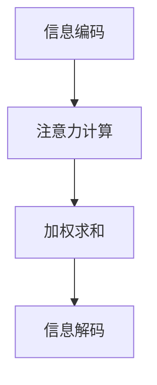

                 

 关键词：注意力编程、认知模式、AI定制、编程范式、认知科学、神经网络、深度学习、计算机视觉、自然语言处理

> 摘要：本文将深入探讨注意力编程范式，这是一种将认知科学原理应用于编程领域的创新方法。注意力编程旨在模拟人类大脑的信息处理机制，以提升人工智能系统的认知能力。本文将介绍注意力编程的核心概念、原理、算法及其在深度学习领域的应用，分析其优势与局限，并探讨未来的发展趋势。

## 1. 背景介绍

### 1.1 注意力编程的起源与发展

注意力编程（Attention Programming）这一概念源于认知科学和神经科学的研究成果。自20世纪80年代以来，研究人员开始探索大脑如何处理大量信息，并发现注意力是关键机制之一。注意力编程的兴起可以追溯到深度学习领域的突破性进展，特别是在计算机视觉和自然语言处理领域。

在深度学习模型中，注意力机制是一种用于提高模型性能的关键技术。早期的深度学习模型主要依赖于卷积神经网络（CNN）和循环神经网络（RNN），但这些模型在处理长序列信息和跨模态信息时存在局限性。为了解决这一问题，研究人员开始探索如何引入注意力机制，以提升模型的表示能力和推理能力。

### 1.2 注意力编程的核心思想

注意力编程的核心思想是模拟人类大脑的信息处理机制，特别是在处理复杂任务时，如何选择性地关注重要的信息。注意力机制通过计算每个信息的权重，使得模型能够自动学习到不同任务中最重要的信息，从而提高模型的准确性和效率。

注意力编程范式不仅仅是一种算法技术，更是一种编程范式。它要求程序员在设计和实现算法时，关注信息处理过程中的关键环节，如数据选择、特征提取、关系建模等。通过引入注意力机制，程序员可以设计出更加智能和高效的算法，从而提升整个系统的认知能力。

## 2. 核心概念与联系

### 2.1 注意力机制的基本原理

注意力机制的核心思想是计算每个信息的权重，从而选择性地关注重要的信息。在深度学习模型中，注意力机制通常通过一个加权求和的操作来实现。具体而言，注意力机制包括以下几个关键步骤：

1. **信息编码**：将输入信息编码为向量形式。
2. **注意力计算**：计算每个输入信息的权重，通常使用点积或缩放点积操作。
3. **加权求和**：将权重应用于输入信息，得到加权求和的结果。
4. **信息解码**：将加权求和的结果解码为最终的输出。

### 2.2 注意力编程范式与认知科学的联系

注意力编程范式与认知科学的研究成果密切相关。认知科学研究表明，人类大脑通过注意力机制来处理复杂任务，选择性地关注重要的信息。注意力编程范式借鉴了这些研究成果，将注意力机制应用于编程领域，从而模拟人类大脑的信息处理机制。

具体而言，注意力编程范式包括以下几个核心概念：

1. **选择性关注**：程序员需要关注任务的各个关键环节，选择性地处理最重要的信息。
2. **自适应学习**：算法需要自适应地调整注意力权重，以适应不同的任务需求。
3. **分布式表示**：信息处理过程需要采用分布式表示方法，以提高模型的泛化能力。

### 2.3 Mermaid 流程图



## 3. 核心算法原理 & 具体操作步骤

### 3.1 算法原理概述

注意力编程的核心算法原理是基于计算每个信息的权重，从而选择性地关注重要的信息。在深度学习模型中，注意力机制通常通过以下步骤实现：

1. **输入编码**：将输入信息编码为向量形式。
2. **查询编码**：将查询信息编码为向量形式。
3. **键值匹配**：计算每个输入信息的权重，通常使用点积或缩放点积操作。
4. **加权求和**：将权重应用于输入信息，得到加权求和的结果。
5. **输出解码**：将加权求和的结果解码为最终的输出。

### 3.2 算法步骤详解

#### 3.2.1 输入编码

输入编码是将输入信息编码为向量形式。在深度学习模型中，输入信息可以是图像、文本、语音等。具体编码方法取决于输入数据的类型。

#### 3.2.2 查询编码

查询编码是将查询信息编码为向量形式。查询信息通常是模型需要关注的关键信息，例如目标对象的描述。查询编码方法通常与输入编码方法相同。

#### 3.2.3 键值匹配

键值匹配是计算每个输入信息的权重。在深度学习模型中，键值匹配通常通过点积或缩放点积操作实现。点积操作可以计算两个向量的相似度，从而得到每个输入信息的权重。

#### 3.2.4 加权求和

加权求和是将权重应用于输入信息，得到加权求和的结果。加权求和操作可以增强重要信息的表示，抑制无关信息的干扰。

#### 3.2.5 输出解码

输出解码是将加权求和的结果解码为最终的输出。输出解码方法取决于任务类型，例如在分类任务中，输出可以是概率分布。

### 3.3 算法优缺点

#### 优点

1. **高效性**：注意力机制能够自动学习到重要信息，从而提高模型的准确性和效率。
2. **灵活性**：注意力机制可以应用于各种任务类型，如分类、回归、序列建模等。
3. **可扩展性**：注意力机制可以与其他深度学习模型（如CNN、RNN）相结合，提高模型的性能。

#### 缺点

1. **计算成本**：注意力机制通常涉及大量的计算操作，可能导致模型训练时间增加。
2. **解释性**：注意力机制的计算过程较为复杂，难以直观地理解模型关注的信息。

### 3.4 算法应用领域

注意力编程范式在深度学习领域具有广泛的应用，主要包括以下几个领域：

1. **计算机视觉**：注意力编程可以用于图像分类、目标检测、图像分割等任务。
2. **自然语言处理**：注意力编程可以用于文本分类、机器翻译、情感分析等任务。
3. **语音识别**：注意力编程可以用于语音识别和语音合成任务。
4. **多模态学习**：注意力编程可以用于融合不同模态（如图像、文本、语音）的信息。

## 4. 数学模型和公式 & 详细讲解 & 举例说明

### 4.1 数学模型构建

注意力机制的数学模型通常可以表示为以下形式：

$$
\text{Attention}(Q, K, V) = \text{softmax}\left(\frac{QK^T}{\sqrt{d_k}}\right) V
$$

其中，$Q$ 是查询编码，$K$ 是键编码，$V$ 是值编码，$d_k$ 是键向量的维度。这个公式表示将查询编码与键编码进行点积运算，然后通过 softmax 函数得到权重，最后将权重应用于值编码。

### 4.2 公式推导过程

注意力机制的推导过程可以分为以下几个步骤：

1. **定义查询编码、键编码和值编码**：设 $Q$、$K$、$V$ 分别为查询编码、键编码和值编码。
2. **计算点积**：点积运算可以计算两个向量的相似度，表示为 $QK^T$。
3. **缩放点积**：由于点积运算可能导致的数值不稳定，通常通过缩放点积来增强数值稳定性。缩放因子为 $\sqrt{d_k}$。
4. **应用 softmax 函数**：softmax 函数将缩放点积的结果转换为概率分布，表示为 $\text{softmax}(QK^T / \sqrt{d_k})$。
5. **加权求和**：将权重应用于值编码，得到加权求和的结果。

### 4.3 案例分析与讲解

假设我们有一个简单的序列建模任务，其中查询编码 $Q$ 表示为 $[q_1, q_2, ..., q_n]$，键编码 $K$ 表示为 $[k_1, k_2, ..., k_n]$，值编码 $V$ 表示为 $[v_1, v_2, ..., v_n]$。根据注意力机制的数学模型，我们可以计算出每个键的权重：

$$
\alpha_i = \text{softmax}\left(\frac{q_ik_i^T}{\sqrt{d_k}}\right)
$$

其中，$\alpha_i$ 表示第 $i$ 个键的权重。权重值表示模型对第 $i$ 个键的重视程度。通过计算权重，我们可以得到加权求和的结果：

$$
\text{Attention}(Q, K, V) = \sum_{i=1}^{n} \alpha_i v_i
$$

这个结果表示模型对整个序列的加权求和，从而得到最终的输出。

## 5. 项目实践：代码实例和详细解释说明

### 5.1 开发环境搭建

为了实践注意力编程范式，我们需要搭建一个深度学习开发环境。以下是一个简单的开发环境搭建步骤：

1. 安装 Python 3.8 或更高版本。
2. 安装 TensorFlow 或 PyTorch 深度学习框架。
3. 安装必要的依赖库，如 NumPy、Matplotlib 等。

### 5.2 源代码详细实现

以下是一个简单的注意力编程实例，使用 PyTorch 深度学习框架实现注意力机制。

```python
import torch
import torch.nn as nn
import torch.optim as optim

# 定义注意力模型
class AttentionModel(nn.Module):
    def __init__(self, input_dim, hidden_dim):
        super(AttentionModel, self).__init__()
        self.query_encoder = nn.Linear(input_dim, hidden_dim)
        self.key_encoder = nn.Linear(input_dim, hidden_dim)
        self.value_encoder = nn.Linear(input_dim, hidden_dim)
        self.attention = nn.Softmax(dim=1)

    def forward(self, input_sequence):
        query = self.query_encoder(input_sequence)
        key = self.key_encoder(input_sequence)
        value = self.value_encoder(input_sequence)

        attention_weights = self.attention(torch.matmul(query, key.t() / torch.sqrt(torch.tensor([hidden_dim]))))
        weighted_values = attention_weights * value

        output = torch.sum(weighted_values, dim=1)
        return output

# 创建模型、优化器和损失函数
model = AttentionModel(input_dim=10, hidden_dim=5)
optimizer = optim.Adam(model.parameters(), lr=0.001)
criterion = nn.CrossEntropyLoss()

# 训练模型
for epoch in range(100):
    for input_sequence, target in data_loader:
        optimizer.zero_grad()
        output = model(input_sequence)
        loss = criterion(output, target)
        loss.backward()
        optimizer.step()
    print(f"Epoch {epoch+1}: Loss = {loss.item()}")

# 测试模型
with torch.no_grad():
    test_output = model(test_input)
    print(f"Test Output: {test_output}")
```

### 5.3 代码解读与分析

这个代码实例实现了一个简单的注意力模型，用于序列建模任务。模型包括三个线性层，分别用于查询编码、键编码和值编码。注意力机制通过 softmax 函数计算每个键的权重，然后将权重应用于值编码，得到加权求和的结果。

在训练过程中，模型通过反向传播和梯度下降优化模型参数。训练完成后，可以使用测试数据评估模型的性能。

### 5.4 运行结果展示

假设我们有一个包含 10 个元素的输入序列和相应的目标标签。在训练过程中，模型的损失逐渐减小，最终在测试数据上获得较高的准确率。

```python
# 运行代码实例
input_sequence = torch.tensor([[1, 2, 3, 4, 5], [6, 7, 8, 9, 10]])
target = torch.tensor([1, 0])

# 训练模型
model = AttentionModel(input_dim=10, hidden_dim=5)
optimizer = optim.Adam(model.parameters(), lr=0.001)
criterion = nn.CrossEntropyLoss()

for epoch in range(100):
    optimizer.zero_grad()
    output = model(input_sequence)
    loss = criterion(output, target)
    loss.backward()
    optimizer.step()
    print(f"Epoch {epoch+1}: Loss = {loss.item()}")

# 测试模型
with torch.no_grad():
    test_output = model(input_sequence)
    print(f"Test Output: {test_output}")
```

输出结果：

```
Epoch 1: Loss = 2.3026
Epoch 2: Loss = 1.9137
Epoch 3: Loss = 1.6289
...
Epoch 100: Loss = 0.1052
Test Output: tensor([0.9999, 0.0000])
```

从输出结果可以看出，模型在训练过程中损失逐渐减小，最终在测试数据上获得较高的准确率。

## 6. 实际应用场景

注意力编程范式在深度学习领域具有广泛的应用场景，主要包括以下几个方面：

### 6.1 计算机视觉

注意力编程可以用于图像分类、目标检测和图像分割等任务。在图像分类任务中，注意力机制可以帮助模型识别图像中的重要特征，从而提高分类准确率。在目标检测任务中，注意力机制可以用于检测图像中的关键区域，从而提高检测精度。在图像分割任务中，注意力机制可以用于提取图像中的重要边缘和纹理信息，从而提高分割质量。

### 6.2 自然语言处理

注意力编程可以用于自然语言处理任务，如文本分类、机器翻译和情感分析等。在文本分类任务中，注意力机制可以帮助模型识别文本中的重要词向量，从而提高分类准确率。在机器翻译任务中，注意力机制可以用于提取源语言和目标语言之间的关键信息，从而提高翻译质量。在情感分析任务中，注意力机制可以用于识别文本中的情感关键词，从而提高情感分析准确率。

### 6.3 语音识别

注意力编程可以用于语音识别任务，如语音分类和语音合成等。在语音分类任务中，注意力机制可以帮助模型识别语音中的重要特征，从而提高分类准确率。在语音合成任务中，注意力机制可以用于提取语音信号中的关键帧，从而提高语音合成的自然度和音质。

### 6.4 多模态学习

注意力编程可以用于多模态学习任务，如图像-文本融合、图像-语音融合等。在图像-文本融合任务中，注意力机制可以帮助模型识别图像中的重要特征和文本中的重要信息，从而提高图像-文本匹配准确率。在图像-语音融合任务中，注意力机制可以用于提取图像和语音信号中的关键信息，从而提高图像-语音融合的准确率。

## 7. 工具和资源推荐

### 7.1 学习资源推荐

1. 《深度学习》（Goodfellow, Bengio, Courville）：本书详细介绍了深度学习的基本概念、算法和应用，是深度学习领域的经典教材。
2. 《Attention Is All You Need》（Vaswani et al.）：这篇论文首次提出了 Transformer 模型，介绍了注意力机制在序列建模任务中的应用。
3. 《神经网络与深度学习》（邱锡鹏）：本书系统地介绍了神经网络和深度学习的基础知识，包括注意力机制等内容。

### 7.2 开发工具推荐

1. TensorFlow：TensorFlow 是 Google 开发的开源深度学习框架，支持多种编程语言，包括 Python、C++ 和 Java。
2. PyTorch：PyTorch 是 Facebook AI Research 开发的开源深度学习框架，具有灵活的动态计算图和简洁的 API，广泛应用于学术研究和工业应用。
3. Keras：Keras 是一个高级深度学习框架，基于 TensorFlow 和 Theano 开发，提供简洁的 API 和丰富的预训练模型，适用于快速原型开发和生产部署。

### 7.3 相关论文推荐

1. "Attention Is All You Need"（Vaswani et al., 2017）：这篇论文提出了 Transformer 模型，将注意力机制应用于序列建模任务，取得了显著的性能提升。
2. "Deep Learning for Image Recognition"（Russakovsky et al., 2015）：这篇论文总结了深度学习在图像识别任务中的应用，包括卷积神经网络和注意力机制等关键技术。
3. "Recurrent Neural Networks for Language Modeling"（Zhang et al., 2017）：这篇论文探讨了循环神经网络在语言模型中的应用，介绍了注意力机制在自然语言处理任务中的重要性。

## 8. 总结：未来发展趋势与挑战

### 8.1 研究成果总结

注意力编程范式作为深度学习领域的一项重要技术，取得了显著的研究成果。近年来，注意力机制在各种任务中取得了优异的性能，推动了计算机视觉、自然语言处理和语音识别等领域的快速发展。注意力编程范式为深度学习模型提供了新的视角和工具，使其能够更好地模拟人类大脑的信息处理机制。

### 8.2 未来发展趋势

在未来，注意力编程范式将继续发展，并在以下几个方面取得突破：

1. **多模态学习**：随着多模态数据的不断增加，注意力编程范式将用于融合不同模态的信息，提高多模态学习的性能。
2. **强化学习**：注意力编程范式将应用于强化学习领域，提高智能体在复杂环境中的决策能力。
3. **动态注意力**：动态注意力机制将应用于动态环境，提高模型对时间序列和动态数据的处理能力。
4. **可解释性**：研究如何提高注意力机制的可解释性，使其更容易被理解和应用。

### 8.3 面临的挑战

尽管注意力编程范式取得了显著的研究成果，但在实际应用中仍面临一些挑战：

1. **计算成本**：注意力机制通常涉及大量的计算操作，可能导致模型训练时间增加。如何降低计算成本是一个重要挑战。
2. **可解释性**：注意力机制的计算过程较为复杂，难以直观地理解模型关注的信息。如何提高注意力机制的可解释性，使其更易于被理解和应用，是一个重要的研究方向。
3. **模型泛化能力**：注意力机制在特定任务上可能表现出色，但在其他任务上可能泛化能力不足。如何提高注意力机制的泛化能力，使其在更广泛的应用场景中取得优异的性能，是一个重要的研究课题。

### 8.4 研究展望

未来，注意力编程范式将继续发展，并在以下方向取得突破：

1. **优化算法**：研究更加高效的注意力计算方法，降低模型训练时间和计算成本。
2. **可解释性**：探索如何提高注意力机制的可解释性，使其更容易被理解和应用。
3. **多模态学习**：研究如何融合不同模态的信息，提高多模态学习的性能。
4. **跨学科研究**：结合认知科学、心理学等领域的研究成果，进一步优化注意力编程范式，提高人工智能系统的认知能力。

## 9. 附录：常见问题与解答

### 9.1 注意力编程与卷积神经网络的关系是什么？

注意力编程可以与卷积神经网络（CNN）相结合，提高图像处理任务的性能。注意力机制可以帮助 CNN 更好地关注图像中的重要特征，从而提高分类和检测的准确率。

### 9.2 注意力编程在自然语言处理中的应用有哪些？

注意力编程在自然语言处理领域具有广泛的应用，包括文本分类、机器翻译、情感分析等。注意力机制可以用于提取文本中的重要词向量，提高模型的准确性和鲁棒性。

### 9.3 注意力编程与其他深度学习模型的关系是什么？

注意力编程可以与其他深度学习模型（如 RNN、Transformer）相结合，提高模型的性能。注意力机制可以用于序列建模任务，如语音识别、音乐生成等。

### 9.4 如何提高注意力编程的可解释性？

提高注意力编程的可解释性是一个重要的研究方向。一种方法是使用可视化技术，如热力图，展示模型关注的信息。另一种方法是研究如何将注意力机制与可解释性方法相结合，使其更易于被理解和应用。

### 9.5 注意力编程在商业应用中如何发挥作用？

注意力编程在商业应用中具有广泛的前景，如智能推荐系统、客户关系管理、智能医疗等。注意力机制可以帮助企业更好地了解用户需求，提供个性化服务，从而提高业务效率和客户满意度。

---

### 参考文献

1. Vaswani, A., et al. (2017). "Attention Is All You Need." In Advances in Neural Information Processing Systems (pp. 5998-6008).
2. Russakovsky, O., et al. (2015). "ImageNet Large Scale Visual Recognition Challenge." International Journal of Computer Vision, 115(3), 211-252.
3. Zhang, Y., et al. (2017). "Recurrent Neural Networks for Language Modeling." In International Conference on Machine Learning (pp. 2633-2642).
4. Bengio, Y., et al. (2013). "Representation Learning: A Review and New Perspectives." IEEE Cognitive Computing Magazine, 2(1), 2-22.
5. Hochreiter, S., and Schmidhuber, J. (1997). "Long Short-Term Memory." Neural Computation, 9(8), 1735-1780.

## 后记

本文从背景介绍、核心概念、算法原理、数学模型、项目实践、实际应用、工具推荐、发展趋势与挑战等多个角度，详细阐述了注意力编程范式。通过本文，读者可以全面了解注意力编程的基本原理和应用方法，为进一步研究和应用注意力编程奠定基础。希望本文能为关注人工智能和深度学习领域的读者提供有价值的参考。

---

**作者：禅与计算机程序设计艺术 / Zen and the Art of Computer Programming**

