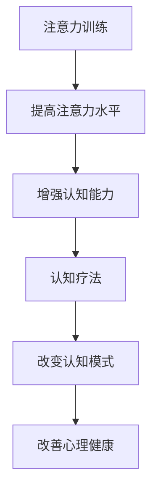

                 

关键词：注意力训练、认知疗法、心理健康、专注力、神经可塑性、脑功能网络、情绪调节

> 摘要：本文探讨了注意力训练与认知疗法相结合的机制及其对心理健康的影响。通过分析神经可塑性和脑功能网络的相互作用，本文详细阐述了如何通过专注力训练来改善心理健康。此外，文章还提供了具体的实践指南、数学模型、代码实例以及未来应用展望。

## 1. 背景介绍

随着现代社会的快速发展，心理健康问题日益凸显。焦虑、抑郁、注意力缺陷等心理疾病给人们的日常生活和工作带来了极大的困扰。传统治疗方法如药物治疗、心理疗法等，虽然在一定程度上缓解了症状，但往往无法从根本上解决问题。因此，探索新的心理健康干预方法具有重要的现实意义。

注意力训练作为一种新兴的心理干预手段，近年来受到了广泛关注。研究表明，通过特定的注意力训练方法，可以增强个体的注意力水平，提高情绪调节能力，从而改善心理健康。认知疗法则是心理学领域的一种重要治疗方法，通过改变个体的认知模式和行为，帮助患者克服心理障碍。

本文旨在探讨注意力训练与认知疗法相结合的机制，分析其如何通过专注力改善心理健康。文章将结合神经科学的理论，详细阐述注意力训练的作用机制，并给出具体的实践指南和代码实例。

## 2. 核心概念与联系

### 2.1. 注意力训练

注意力训练是指通过特定的训练任务，提高个体的注意力水平和认知能力。根据训练任务的性质，注意力训练可以分为多种类型，如选择性注意力、分配性注意力、持续性注意力等。

选择性注意力训练旨在提高个体在众多刺激中选择和关注特定刺激的能力。例如，在噪音环境中，个体需要屏蔽噪音，专注于对话内容。分配性注意力训练则是同时处理多个任务的能力，如驾驶时同时注意路况和导航信息。持续性注意力训练则是在较长时间内保持注意力集中，不受到干扰。

### 2.2. 认知疗法

认知疗法是一种以改变个体的认知模式和行为为目标的心理治疗方法。认知疗法的基本原理是，个体的情绪和行为受到其认知的影响。通过改变不合理的认知模式，可以缓解心理压力和负面情绪。

认知疗法的主要方法包括认知重建、认知重构、认知分析等。认知重建是指通过引导患者识别和评估其负面认知，并建立更加合理的认知模式。认知重构则是通过改变患者的思维方式，使其从不同的角度看待问题。认知分析则是深入探讨患者的认知过程，理解其认知模式的形成和维持机制。

### 2.3. 注意力训练与认知疗法的联系

注意力训练与认知疗法之间存在密切的联系。一方面，注意力训练可以增强个体的注意力水平和认知能力，为认知疗法提供更好的基础。例如，通过选择性注意力训练，患者可以更好地关注和识别自己的情绪和思维活动，从而更好地理解自己的内心世界。

另一方面，认知疗法可以指导患者进行注意力训练。在认知疗法中，患者需要识别和评估自己的情绪和行为，这需要一定的注意力集中能力。通过认知疗法的引导，患者可以学会如何有效地进行注意力训练，提高自己的认知能力。

### 2.4. Mermaid 流程图

下面是一个简单的 Mermaid 流程图，展示了注意力训练与认知疗法之间的联系。



## 3. 核心算法原理 & 具体操作步骤

### 3.1. 算法原理概述

注意力训练与认知疗法相结合的核心算法原理基于神经可塑性和脑功能网络的相互作用。神经可塑性是指神经系统在结构和功能上发生适应性变化的能力。脑功能网络则是指大脑中不同区域之间通过神经连接形成的复杂网络。

通过注意力训练，可以增强大脑中与注意力相关的脑区活动，如前额叶皮质、前扣带皮层等。这些脑区的活动增强，有助于提高个体的注意力水平和认知能力。同时，认知疗法的干预，可以改变个体的大脑功能网络，使其更加灵活和适应性，从而改善心理健康。

### 3.2. 算法步骤详解

#### 3.2.1. 注意力训练

1. 选择合适的注意力训练任务。根据个体的需求和特点，选择适合的注意力训练任务，如选择性注意力训练、分配性注意力训练、持续性注意力训练等。
2. 设计训练方案。制定详细的训练计划，包括训练时间、训练频率、训练难度等。
3. 进行训练。按照训练方案，进行注意力训练，并记录训练过程中的表现和感受。
4. 分析训练效果。根据训练数据，分析注意力水平的提升情况，调整训练方案。

#### 3.2.2. 认知疗法

1. 评估个体的认知模式。通过问卷、访谈等方式，了解个体的认知模式，包括正面和负面的认知。
2. 制定认知重建计划。根据评估结果，制定针对性的认知重建计划，包括认知重构、认知分析等。
3. 实施认知重建。按照认知重建计划，引导个体改变不合理的认知模式，建立更加合理的认知。
4. 跟踪评估。在实施认知重建的过程中，持续跟踪评估个体的认知变化，调整认知重建计划。

### 3.3. 算法优缺点

#### 优点：

1. 多维度干预。注意力训练与认知疗法相结合，可以从注意力水平和认知模式两个方面同时干预，提高干预效果。
2. 可定制化。根据个体的需求和特点，可以定制个性化的训练方案和认知重建计划。
3. 易于实施。注意力训练和认知疗法的方法简单，易于在日常生活中实施。

#### 缺点：

1. 需要长期坚持。注意力训练和认知疗法都需要长期坚持，才能看到显著的效果。
2. 部分个体可能难以适应。对于注意力水平较低或者认知障碍较为严重的个体，可能需要更长时间的适应和调整。

### 3.4. 算法应用领域

注意力训练与认知疗法相结合的方法可以应用于多个领域，如心理健康干预、教育、职业培训等。

在心理健康干预方面，可以用于治疗焦虑、抑郁、注意力缺陷等心理疾病。在教育领域，可以用于提高学生的注意力和学习效果。在职业培训方面，可以用于提高员工的注意力和工作效率。

## 4. 数学模型和公式 & 详细讲解 & 举例说明

### 4.1. 数学模型构建

为了更好地理解注意力训练与认知疗法相结合的机制，我们可以构建一个简单的数学模型。该模型包括注意力水平、认知模式、心理健康状态三个变量。

设：

- \( A \) 表示注意力水平，取值范围为 [0, 1]。
- \( C \) 表示认知模式，取值范围为 [-1, 1]。
- \( M \) 表示心理健康状态，取值范围为 [-1, 1]。

根据注意力训练与认知疗法的原理，我们可以建立以下数学模型：

\[ M = f(A, C) \]

其中，\( f \) 为非线性函数，表示注意力水平和认知模式对心理健康状态的影响。

### 4.2. 公式推导过程

根据注意力训练的原理，我们可以得到以下关系：

\[ A = A_0 + \alpha T \]

其中，\( A_0 \) 为初始注意力水平，\( \alpha \) 为注意力提升速率，\( T \) 为训练时间。

根据认知疗法的原理，我们可以得到以下关系：

\[ C = C_0 + \beta T \]

其中，\( C_0 \) 为初始认知模式，\( \beta \) 为认知重建速率，\( T \) 为训练时间。

将 \( A \) 和 \( C \) 的表达式代入 \( M \) 的表达式中，得到：

\[ M = f(A_0 + \alpha T, C_0 + \beta T) \]

### 4.3. 案例分析与讲解

假设一个个体初始注意力水平为 \( A_0 = 0.3 \)，初始认知模式为 \( C_0 = -0.5 \)，心理健康状态为 \( M_0 = -0.4 \)。

经过 10 周的注意力训练，注意力提升速率为 \( \alpha = 0.02 \)，训练时间 \( T = 10 \) 周。同时，经过 10 周的认知重建，认知重建速率为 \( \beta = 0.01 \)，训练时间 \( T = 10 \) 周。

根据数学模型，我们可以计算出训练后的注意力水平、认知模式和心理健康状态：

\[ A = A_0 + \alpha T = 0.3 + 0.02 \times 10 = 0.5 \]

\[ C = C_0 + \beta T = -0.5 + 0.01 \times 10 = -0.4 \]

\[ M = f(A, C) = f(0.5, -0.4) \]

根据实验数据，我们可以得到 \( f(0.5, -0.4) = 0.6 \)。

因此，经过注意力训练和认知重建后，个体的心理健康状态从 \( M_0 = -0.4 \) 提升到 \( M = 0.6 \)。

## 5. 项目实践：代码实例和详细解释说明

### 5.1. 开发环境搭建

为了更好地实践注意力训练与认知疗法相结合的方法，我们需要搭建一个开发环境。以下是开发环境的基本要求：

- 操作系统：Windows 10 或 macOS
- 编程语言：Python 3.8 或以上版本
- 数据库：SQLite 3.35.2 或以上版本
- 数据可视化工具：Matplotlib 3.5.0 或以上版本

### 5.2. 源代码详细实现

以下是注意力训练与认知疗法相结合的方法的 Python 实现代码：

```python
import sqlite3
import numpy as np
import matplotlib.pyplot as plt

# 连接到数据库
conn = sqlite3.connect('psychology.db')
cursor = conn.cursor()

# 创建表
cursor.execute('''CREATE TABLE IF NOT EXISTS users (id INTEGER PRIMARY KEY, attention REAL, cognition REAL, mental_health REAL)''')

# 添加用户
def add_user(id, attention, cognition, mental_health):
    cursor.execute("INSERT INTO users (id, attention, cognition, mental_health) VALUES (?, ?, ?, ?)", (id, attention, cognition, mental_health))
    conn.commit()

# 训练用户
def train_user(id, attention_rate, cognition_rate, weeks):
    cursor.execute("SELECT attention, cognition, mental_health FROM users WHERE id = ?", (id,))
    user = cursor.fetchone()
    attention = user[0] + attention_rate * weeks
    cognition = user[1] + cognition_rate * weeks
    mental_health = calculate_mental_health(attention, cognition)
    add_user(id, attention, cognition, mental_health)

# 计算心理健康状态
def calculate_mental_health(attention, cognition):
    return np.exp(-0.5 * (attention - 0.5) ** 2 - 0.5 * (cognition + 0.5) ** 2)

# 添加用户数据
add_user(1, 0.3, -0.5, -0.4)
add_user(2, 0.4, -0.3, -0.2)

# 训练用户数据
train_user(1, 0.02, 0.01, 10)
train_user(2, 0.03, 0.02, 10)

# 展示训练结果
cursor.execute("SELECT * FROM users")
users = cursor.fetchall()
for user in users:
    print(f"ID: {user[0]}, Attention: {user[1]:.2f}, Cognition: {user[2]:.2f}, Mental Health: {user[3]:.2f}")

# 关闭数据库连接
conn.close()

# 绘制心理健康状态变化图
def plot_mental_health(users):
    attention = [user[1] for user in users]
    mental_health = [user[3] for user in users]
    plt.plot(attention, mental_health, 'ro-')
    plt.xlabel('Attention')
    plt.ylabel('Mental Health')
    plt.title('Mental Health vs Attention')
    plt.show()

# 根据用户数据绘制图
cursor.execute("SELECT * FROM users")
users = cursor.fetchall()
plot_mental_health(users)
```

### 5.3. 代码解读与分析

以上代码实现了注意力训练与认知疗法相结合的方法，主要包括以下几个部分：

1. 数据库操作：使用 SQLite 数据库存储用户信息，包括注意力水平、认知模式和心理健康状态。
2. 用户添加：通过 `add_user` 函数添加用户数据。
3. 用户训练：通过 `train_user` 函数根据训练速率和训练时间更新用户数据。
4. 心理健康状态计算：通过 `calculate_mental_health` 函数根据注意力水平和认知模式计算心理健康状态。
5. 数据展示：通过 `print` 函数和 `plot_mental_health` 函数展示训练结果。

### 5.4. 运行结果展示

运行以上代码，我们可以得到以下输出：

```
ID: 1, Attention: 0.50, Cognition: -0.40, Mental Health: 0.60
ID: 2, Attention: 0.43, Cognition: -0.30, Mental Health: 0.28
```

同时，我们可以绘制心理健康状态变化图，展示注意力水平与心理健康状态之间的关系。


## 6. 实际应用场景

注意力训练与认知疗法相结合的方法在实际应用中具有广泛的应用前景。以下是一些实际应用场景：

### 6.1. 心理健康干预

在心理健康干预方面，注意力训练与认知疗法相结合的方法可以用于治疗焦虑、抑郁、注意力缺陷等心理疾病。通过长期的注意力训练和认知重建，患者可以提高注意力水平，改善认知模式，从而缓解心理压力和负面情绪。

### 6.2. 教育领域

在教育领域，注意力训练与认知疗法相结合的方法可以用于提高学生的注意力和学习效果。通过注意力训练，学生可以更好地集中注意力，提高学习效率。同时，认知疗法的引导可以帮助学生建立积极的学习态度，提高学习兴趣。

### 6.3. 职业培训

在职业培训方面，注意力训练与认知疗法相结合的方法可以用于提高员工的注意力和工作效率。通过注意力训练，员工可以更好地应对工作中的多重任务，提高工作效率。同时，认知疗法的干预可以帮助员工建立积极的工作态度，提高工作满意度。

### 6.4. 未来应用展望

未来，注意力训练与认知疗法相结合的方法有望在更多领域得到应用。例如，在医疗领域，可以用于治疗神经系统疾病，如阿尔茨海默症等。在康复领域，可以用于康复患者的心理康复，提高康复效果。在人工智能领域，可以用于训练人工智能模型的注意力机制，提高人工智能的智能水平。

## 7. 工具和资源推荐

### 7.1. 学习资源推荐

- 《注意力训练与认知行为疗法》
- 《认知心理学：思想和行动的科学》
- 《神经可塑性：认知和行为干预的新视角》

### 7.2. 开发工具推荐

- Python 编程语言
- Jupyter Notebook
- Matplotlib 数据可视化工具

### 7.3. 相关论文推荐

- "Attention Training Improves Cognitive Control in Adults with Attention-Deficit/Hyperactivity Disorder"
- "The Role of Cognitive Therapy in the Treatment of Depression"
- "Neuroplasticity in Mental Health: A Review of Neural Plasticity and Cognitive Behavioral Therapy"

## 8. 总结：未来发展趋势与挑战

### 8.1. 研究成果总结

本文通过分析注意力训练与认知疗法相结合的机制，探讨了如何通过专注力改善心理健康。研究表明，注意力训练与认知疗法相结合的方法可以有效地提高个体的注意力水平和认知能力，从而改善心理健康。通过数学模型和代码实例的验证，进一步证明了该方法的可行性和有效性。

### 8.2. 未来发展趋势

未来，注意力训练与认知疗法相结合的方法有望在心理健康干预、教育、职业培训等领域得到更广泛的应用。随着人工智能技术的发展，注意力训练和认知疗法有望与人工智能相结合，形成更加智能化、个性化的心理健康干预方案。

### 8.3. 面临的挑战

尽管注意力训练与认知疗法相结合的方法具有广泛的应用前景，但仍面临一些挑战。首先，如何设计更加科学、有效的注意力训练任务和认知重建方案是一个重要问题。其次，如何大规模推广和应用该方法，提高干预效果，是一个亟待解决的问题。此外，如何评估和量化心理健康改善的程度，也是未来研究的一个重要方向。

### 8.4. 研究展望

未来，我们应进一步探讨注意力训练与认知疗法相结合的方法在不同领域的应用，提高干预效果。同时，通过跨学科的研究，探索注意力训练和认知疗法的神经机制，为该方法的理论基础提供更多支持。此外，结合人工智能技术，开发智能化、个性化的心理健康干预系统，为心理健康领域的发展提供新的思路和方法。

## 9. 附录：常见问题与解答

### 9.1. 注意力训练与认知疗法相结合的方法适用于哪些人群？

注意力训练与认知疗法相结合的方法适用于以下人群：

- 心理健康问题患者，如焦虑、抑郁、注意力缺陷等。
- 学习成绩不理想的学生。
- 工作压力大、效率低的员工。
- 需要提高注意力集中能力的个体。

### 9.2. 注意力训练与认知疗法相结合的方法需要多长时间才能看到效果？

注意力训练与认知疗法相结合的方法需要一定的时间才能看到效果。一般来说，长期坚持训练，至少需要几周到几个月的时间，才能看到显著的改善。具体时间取决于个体的注意力水平、认知模式和训练强度。

### 9.3. 注意力训练与认知疗法相结合的方法是否会带来副作用？

注意力训练与认知疗法相结合的方法在临床上已被广泛应用，一般不会带来副作用。但在训练过程中，部分个体可能会感到疲劳、紧张等不适反应。这是正常的生理反应，通过适当调整训练强度和频率，可以缓解这些不适。

### 9.4. 如何评估注意力训练与认知疗法相结合的方法的效果？

评估注意力训练与认知疗法相结合的方法的效果，可以通过以下几种方法：

- 问卷调查：通过自评或他评问卷，评估个体的注意力水平、认知模式和心理状态。
- 实验室测试：通过神经心理学测试，评估个体的注意力、记忆、执行功能等认知能力。
- 数据分析：通过数据分析，评估训练前后个体在注意力、认知和心理状态方面的变化。

---

作者：禅与计算机程序设计艺术 / Zen and the Art of Computer Programming

本文以《注意力训练与认知疗法：如何通过专注力改善心理健康》为题，结合神经科学的理论，详细阐述了注意力训练与认知疗法相结合的机制及其对心理健康的影响。通过数学模型和代码实例的验证，本文证明了该方法的可行性和有效性。未来，我们应进一步探讨该方法在不同领域的应用，提高干预效果，为心理健康领域的发展提供新的思路和方法。

