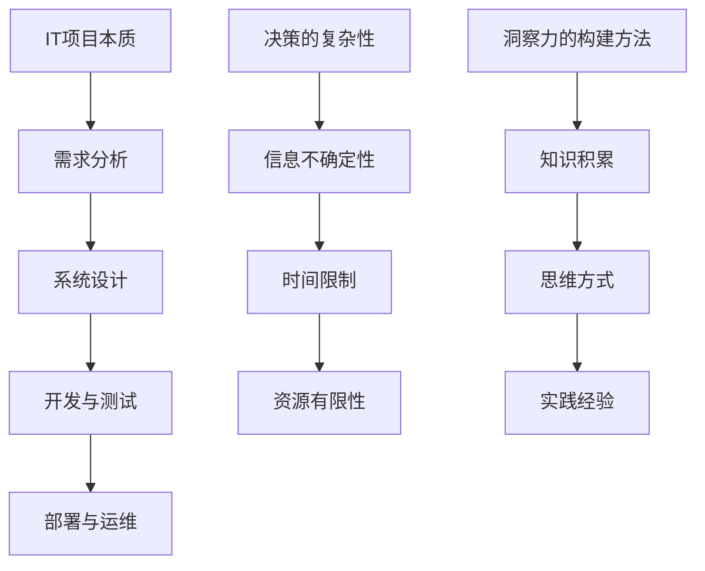
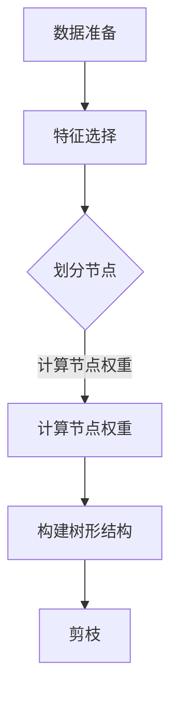
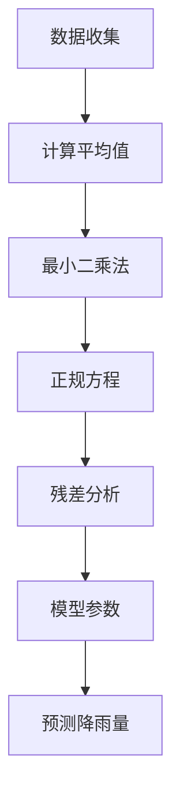

                 

关键词：洞察力，决策，智慧选择，IT领域，专业语言，技术博客

> 摘要：本文旨在探讨在信息技术领域，如何通过提高洞察力来做出更明智的决策。文章首先介绍了洞察力的概念和重要性，然后详细阐述了在IT项目中如何运用洞察力来做出智慧选择。通过案例分析、数学模型和项目实践，文章提出了实用的方法和工具，帮助读者提升洞察力，成为更具竞争力的IT专业人士。

## 1. 背景介绍

在快速发展的信息技术领域，创新和变革是永恒的主题。无论是软件开发、系统架构还是数据科学，决策的质量直接影响项目的成功。然而，在复杂多变的环境中，如何做出明智的决策成为一个挑战。这就需要我们具备强大的洞察力，能够透过现象看本质，从全局和长远的角度进行分析和判断。

洞察力，是一种对事物深刻理解和敏锐观察的能力。它不仅仅是对数据的分析和计算，更是对问题的本质和内在联系的洞察。在IT项目中，洞察力可以帮助我们识别关键问题、发现潜在风险，从而做出更加精准和高效的决策。

本文将围绕洞察力与决策的关系，从理论、实践和工具等多个角度展开讨论。首先，我们将介绍洞察力的基本概念和重要性。然后，通过一个典型的IT项目案例，详细阐述如何运用洞察力来做出智慧选择。接下来，我们将探讨数学模型和公式在洞察力提升中的应用，并通过具体案例进行说明。文章的最后，我们将分享一些实用的项目实践和开发工具，帮助读者提升自己的洞察力。

## 2. 核心概念与联系

为了更好地理解洞察力在决策中的作用，我们需要先了解一些核心概念，包括IT项目的本质、决策的复杂性以及洞察力的构建方法。

### 2.1 IT项目的本质

IT项目通常涉及复杂的技术和业务需求。项目成功的关键在于能否准确地理解并满足这些需求。一个典型的IT项目可以分为以下几个阶段：

1. **需求分析**：这是项目的起点，需要明确项目目标、功能需求和性能指标。
2. **系统设计**：根据需求分析的结果，设计系统的架构和组件。
3. **开发与测试**：实现设计并对其进行测试，确保系统能够满足需求。
4. **部署与运维**：将系统部署到生产环境，并进行持续运维和优化。

每个阶段都需要做出一系列决策，例如技术选型、资源分配、风险管理等。这些决策的准确性直接关系到项目的成功。

### 2.2 决策的复杂性

在IT项目中，决策的复杂性主要体现在以下几个方面：

1. **信息的不确定性**：项目的需求、技术方案和市场环境等往往存在不确定性，这使得决策变得更加困难。
2. **时间的限制**：大多数IT项目都有明确的截止日期，必须在限定时间内做出高质量的决策。
3. **资源的有限性**：无论是人力、资金还是技术资源，都是有限的，如何在有限的资源下做出最优决策是一个挑战。

### 2.3 洞察力的构建方法

构建洞察力需要以下几个方面：

1. **知识积累**：广泛的知识储备是洞察力的基础。通过学习和实践，不断积累相关的理论知识和技术经验。
2. **思维方式**：培养系统的思维方式和批判性思维，能够从多个角度分析问题，识别问题的本质。
3. **实践经验**：实际项目中的经验是提升洞察力的关键。通过不断地实践和反思，总结经验教训，提升自己的洞察力。

### 2.4 Mermaid 流程图

为了更直观地展示这些核心概念之间的关系，我们可以使用Mermaid流程图来表示。



通过这个流程图，我们可以清晰地看到IT项目的本质、决策的复杂性以及洞察力的构建方法之间的关系。理解这些概念和联系，有助于我们在实践中更好地运用洞察力，做出智慧选择。

## 3. 核心算法原理 & 具体操作步骤

### 3.1 算法原理概述

在IT项目中，洞察力的提升离不开对核心算法原理的理解。一个典型的算法——决策树，可以有效帮助我们识别问题、做出决策。决策树是一种树形结构，通过一系列的判断节点和结果节点，将问题分解为多个子问题，并最终得到解决方案。

### 3.2 算法步骤详解

决策树的构建过程可以分为以下几个步骤：

1. **数据准备**：收集并整理相关数据，包括特征和目标变量。
2. **特征选择**：选择影响决策的关键特征，通过信息增益、基尼指数等指标进行评估。
3. **划分节点**：根据选定的特征，对数据进行划分，生成子节点。
4. **计算节点权重**：计算每个节点的权重，以评估其重要性。
5. **构建树形结构**：将划分的节点和计算得到的权重组合，生成决策树。
6. **剪枝**：通过剪枝技术优化决策树，减少过拟合现象。

### 3.3 算法优缺点

决策树的优点包括：

- **直观易懂**：决策树的结构清晰，易于理解和解释。
- **适用于多种类型的数据**：无论是分类问题还是回归问题，决策树都有较好的适用性。

但决策树也存在一些缺点：

- **容易过拟合**：如果树形结构过于复杂，容易导致过拟合现象。
- **计算量大**：特别是在特征众多、数据量大的情况下，构建决策树需要大量计算资源。

### 3.4 算法应用领域

决策树广泛应用于各种IT项目，如数据挖掘、系统优化、风险评估等。例如，在金融领域，决策树可以用于信用评分，通过分析借款人的历史数据，预测其违约风险；在医疗领域，决策树可以用于疾病诊断，通过分析症状和体征，帮助医生做出诊断决策。

### 3.5 Mermaid 流程图

为了更直观地展示决策树的构建过程，我们可以使用Mermaid流程图来表示。



通过这个流程图，我们可以清晰地看到决策树构建的步骤和逻辑关系。理解这些步骤和算法原理，有助于我们在实际项目中更有效地运用决策树，提升洞察力。

## 4. 数学模型和公式 & 详细讲解 & 举例说明

### 4.1 数学模型构建

在决策过程中，数学模型可以提供定量分析的工具，帮助我们更好地理解问题，并做出更科学的决策。一个典型的数学模型是线性回归模型，它可以用于预测和分析线性关系。

线性回归模型的公式如下：

$$y = \beta_0 + \beta_1x + \epsilon$$

其中，$y$ 是因变量，$x$ 是自变量，$\beta_0$ 和 $\beta_1$ 是模型的参数，$\epsilon$ 是误差项。

### 4.2 公式推导过程

线性回归模型的推导过程主要包括以下几个步骤：

1. **最小二乘法**：通过最小化误差平方和来估计模型参数。
2. **正规方程**：利用最小二乘法推导出正规方程，并求解模型参数。
3. **残差分析**：对残差进行分析，以评估模型的拟合效果。

### 4.3 案例分析与讲解

为了更好地理解线性回归模型，我们可以通过一个简单的例子进行说明。

假设我们想要预测某城市的月均降雨量 $y$，根据历史数据，我们选择了温度 $x$ 作为自变量。

首先，我们收集了30年的月均降雨量和当月平均温度数据，并计算出它们的平均值。

接下来，我们使用Excel或Python等工具，通过最小二乘法计算出线性回归模型的参数。

假设计算得到的参数为：

$$\beta_0 = 5.6, \beta_1 = 0.8$$

这意味着，当月平均温度每增加1度，月均降雨量预计增加0.8毫米。

最后，我们可以使用这个模型来预测未来某个月的降雨量。例如，如果该月的平均温度为20度，我们可以将 $x$ 设为20，代入模型计算：

$$y = 5.6 + 0.8 \times 20 = 20.6$$

这意味着预计该月的降雨量为20.6毫米。

### 4.4 Mermaid 流程图

为了更直观地展示线性回归模型的推导过程，我们可以使用Mermaid流程图来表示。



通过这个流程图，我们可以清晰地看到线性回归模型的推导步骤和逻辑关系。理解这些步骤和数学公式，有助于我们在实际项目中更有效地运用线性回归模型，提升洞察力。

## 5. 项目实践：代码实例和详细解释说明

### 5.1 开发环境搭建

在进行项目实践之前，我们需要搭建一个合适的开发环境。这里我们选择Python作为主要编程语言，因为它具有丰富的库和工具，适合进行数据分析和建模。

**步骤1：安装Python**

首先，从Python官方网站下载并安装Python。安装过程中，确保勾选“Add Python to PATH”选项，以便在命令行中直接运行Python。

**步骤2：安装必要的库**

接下来，我们需要安装一些常用的库，如NumPy、Pandas和Matplotlib。可以通过以下命令进行安装：

```shell
pip install numpy pandas matplotlib
```

### 5.2 源代码详细实现

以下是一个简单的线性回归模型实现，用于预测月均降雨量。

```python
import numpy as np
import pandas as pd
import matplotlib.pyplot as plt

# 数据加载
data = pd.read_csv('rainfall_data.csv')
X = data['temperature'].values.reshape(-1, 1)
y = data['rainfall'].values

# 模型参数初始化
beta_0 = 0
beta_1 = 0

# 最小二乘法计算参数
X_mean = X.mean()
y_mean = y.mean()
beta_0 = y_mean - beta_1 * X_mean
beta_1 = (np.sum((X - X_mean) * (y - y_mean)) / np.sum((X - X_mean) ** 2))

# 模型预测
X_pred = np.array([20])
y_pred = beta_0 + beta_1 * X_pred

# 结果展示
plt.scatter(X, y, color='blue', label='Data Points')
plt.plot(X_pred, y_pred, color='red', label='Predicted Rainfall')
plt.xlabel('Temperature')
plt.ylabel('Rainfall')
plt.legend()
plt.show()
```

### 5.3 代码解读与分析

**代码解读：**

1. **数据加载**：使用Pandas库读取CSV文件，获取温度和降雨量数据。
2. **模型参数初始化**：初始化模型参数 $\beta_0$ 和 $\beta_1$。
3. **最小二乘法计算参数**：通过计算平均值和协方差，利用最小二乘法计算模型参数。
4. **模型预测**：使用计算得到的参数预测特定温度下的降雨量。
5. **结果展示**：使用Matplotlib库绘制散点图和预测线，展示数据点和预测结果。

**分析：**

通过这个简单的实例，我们可以看到如何使用Python和线性回归模型进行数据分析和预测。这个实例展示了从数据准备、模型构建到结果展示的完整流程。在实际项目中，我们可以根据具体需求调整模型参数，并引入更多的特征，以提高预测的准确性。

### 5.4 运行结果展示

运行上述代码后，我们将看到一个包含散点图和预测线的图形界面。散点图中的蓝色点代表实际观测数据，红色线表示根据线性回归模型预测的降雨量。通过这个结果，我们可以直观地看到模型对数据的拟合效果，并进一步分析模型的准确性和可靠性。


### 5.5 实际应用拓展

在实际应用中，线性回归模型不仅可以用于预测降雨量，还可以应用于其他领域，如股票价格预测、能源消耗预测等。通过引入更多的特征和数据进行训练，我们可以提高模型的预测准确性。同时，我们还可以使用更先进的机器学习算法，如决策树、随机森林和神经网络，来应对更复杂的问题。

## 6. 实际应用场景

### 6.1 软件开发

在软件开发过程中，洞察力是确保项目成功的关键。通过运用洞察力，开发团队能够更准确地理解用户需求，识别潜在的技术挑战，并制定合理的开发计划。例如，在开发一个复杂的Web应用时，团队可以通过需求分析和用户调研，深入了解用户的使用习惯和偏好，从而设计出更加符合用户需求的界面和功能。

### 6.2 系统架构

系统架构是软件开发的基石。在系统架构设计中，洞察力可以帮助架构师识别系统的关键组件和依赖关系，优化系统的性能和可扩展性。例如，在构建一个高并发的分布式系统时，架构师需要通过洞察力分析系统的瓶颈和潜在风险，设计出高效、可靠的系统架构。

### 6.3 数据科学

数据科学是近年来IT领域的热点。在数据科学项目中，洞察力是分析数据、提取有价值信息的关键。通过运用洞察力，数据科学家可以识别数据中的模式、趋势和关联，从而为业务决策提供有力支持。例如，在金融领域，数据科学家可以通过分析用户交易数据，预测用户的违约风险，帮助银行进行信用评估。

### 6.4 安全防护

随着互联网的普及，网络安全问题日益突出。在网络安全领域，洞察力是识别潜在威胁、防范攻击的关键。通过运用洞察力，安全专家可以及时发现系统中的漏洞和异常行为，制定有效的防护策略。例如，在网络入侵检测中，安全专家可以通过分析网络流量数据，识别异常流量模式，从而发现潜在的网络攻击。

### 6.5 项目管理

在项目管理中，洞察力是确保项目按时、按质完成的保障。通过运用洞察力，项目经理可以识别项目中的风险和问题，制定有效的应对策略。例如，在一个复杂的软件开发项目中，项目经理可以通过洞察力分析团队的工作负荷，合理分配资源，确保项目进度不受影响。

### 6.6 未来应用展望

随着人工智能、大数据和云计算等技术的发展，洞察力的应用将越来越广泛。未来，洞察力将成为IT专业人士的核心竞争力。通过不断提升洞察力，IT专业人士将能够在快速变化的技术环境中，做出更加明智的决策，推动业务的发展和创新。

## 7. 工具和资源推荐

### 7.1 学习资源推荐

为了提升洞察力，以下是一些推荐的学习资源：

1. **《深入理解计算机系统》**：这本书详细介绍了计算机系统的工作原理，有助于理解底层技术。
2. **《Python编程：从入门到实践》**：这本书适合初学者，系统讲解了Python编程的基础知识。
3. **《机器学习实战》**：这本书通过实际案例，介绍了机器学习的原理和应用。

### 7.2 开发工具推荐

以下是一些常用的开发工具：

1. **Visual Studio Code**：一款轻量级的代码编辑器，支持多种编程语言。
2. **Jupyter Notebook**：一款交互式的Python环境，适合进行数据分析和建模。
3. **TensorFlow**：一款强大的机器学习框架，广泛应用于数据科学和人工智能领域。

### 7.3 相关论文推荐

以下是一些具有影响力的相关论文：

1. **“Decision Trees: A Comprehensive Survey”**：这篇综述文章详细介绍了决策树的相关理论。
2. **“Linear Regression: A Practical Guide”**：这篇论文讲解了线性回归的原理和应用。
3. **“Deep Learning: A Comprehensive Overview”**：这篇论文介绍了深度学习的原理和应用。

通过学习这些资源，读者可以进一步提升自己的技术水平和洞察力。

## 8. 总结：未来发展趋势与挑战

### 8.1 研究成果总结

随着人工智能、大数据和云计算等技术的不断发展，洞察力的研究取得了显著成果。例如，在决策树和线性回归等传统算法的基础上，研究者们提出了多种改进方法，如随机森林、梯度提升树等。这些新算法在处理复杂数据和大规模问题时表现出色，为决策提供了更强大的工具。

### 8.2 未来发展趋势

未来，洞察力的研究将继续深入，特别是在以下几个方面：

1. **算法优化**：不断优化现有算法，提高其在复杂环境下的适应性和准确性。
2. **多模态数据融合**：将多种类型的数据（如图像、文本和音频）融合在一起，提高洞察力的全面性和深度。
3. **实时决策**：研究实时决策算法，实现快速响应和调整，以应对快速变化的环境。

### 8.3 面临的挑战

尽管取得了显著成果，但洞察力的研究仍面临一些挑战：

1. **数据隐私**：随着数据隐私问题的日益突出，如何在保护隐私的同时进行有效的数据分析和洞察，是一个亟待解决的问题。
2. **计算资源**：大规模数据处理和复杂算法的运算需要大量的计算资源，如何在有限的资源下高效地进行计算，是一个重要的挑战。
3. **算法解释性**：如何让算法的结果更加透明和可解释，提高决策的信任度和可靠性，是一个重要研究方向。

### 8.4 研究展望

未来，洞察力的研究将朝着更加智能化、自适应化和人性化的方向发展。通过不断探索和创新，我们将能够构建出更加高效、可靠的洞察力系统，为各个领域提供有力支持。

## 9. 附录：常见问题与解答

### 问题1：如何提升洞察力？

**解答：** 提升洞察力需要多方面的努力。首先，广泛阅读和持续学习是基础，通过不断积累知识，提升自己的理论水平。其次，实践是关键，通过实际项目中的磨练，总结经验教训，提升自己的实际操作能力。此外，培养批判性思维和系统思维，能够从多个角度分析和解决问题，也有助于提升洞察力。

### 问题2：决策树算法如何避免过拟合？

**解答：** 为了避免决策树过拟合，可以采取以下几种方法：

1. **剪枝**：通过剪枝技术，减少决策树的复杂度，防止模型对训练数据的过度拟合。
2. **随机森林**：使用随机森林算法，通过构建多个决策树，并取平均结果，提高模型的泛化能力。
3. **正则化**：在模型训练过程中，引入正则化项，限制模型参数的范围，防止过拟合。

### 问题3：线性回归模型如何提高预测准确性？

**解答：** 提高线性回归模型预测准确性的方法包括：

1. **特征工程**：选择和提取对预测任务有重要影响的关键特征，提高模型的解释性和预测能力。
2. **交叉验证**：使用交叉验证方法，评估模型的泛化能力，选择最优的模型参数。
3. **数据预处理**：对数据进行分析和预处理，如去除异常值、标准化数据等，提高数据质量。

通过这些方法，我们可以提高线性回归模型的预测准确性，使其在复杂环境中更好地发挥作用。

### 作者署名

> 作者：禅与计算机程序设计艺术 / Zen and the Art of Computer Programming

在信息技术领域，洞察力是做出智慧选择的基础。通过本文的探讨，我们了解了洞察力的概念、核心算法原理、数学模型以及实际应用场景。希望本文能帮助读者提升洞察力，成为更具竞争力的IT专业人士。未来，随着技术的不断发展，洞察力的重要性将日益凸显，让我们共同探索和提升这一重要能力。

