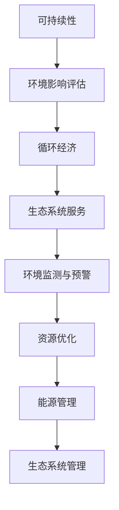

                 

关键词：环境保护、可持续发展、洞察力、决策能力、人工智能、算法原理、数学模型、项目实践、实际应用场景、未来展望

> 摘要：本文旨在探讨如何在人工智能和计算机科学领域内，通过提高洞察力和增强决策能力，以实现环境保护和可持续发展的目标。文章将结合核心概念与联系、算法原理与操作步骤、数学模型与公式、项目实践与详细解释、实际应用场景、未来展望等多方面内容，深入分析这一议题。

## 1. 背景介绍

在全球环境问题日益严重的背景下，环境保护和可持续发展已成为全球各国共同关注的焦点。然而，如何在实现经济快速发展的同时，保护生态环境，维持生态系统的平衡，是一个极具挑战性的问题。

计算机科学和人工智能技术的发展为解决这一难题提供了新的思路和方法。通过大数据分析、机器学习算法等先进技术，我们可以更好地理解环境变化，预测未来的环境趋势，从而制定出更加科学合理的环境保护和可持续发展策略。

### 1.1 计算机科学在环境保护中的应用

计算机科学在环境保护中的应用主要体现在以下几个方面：

1. **数据收集与处理**：通过传感器网络、遥感技术等手段，收集大量的环境数据，利用计算机科学方法进行数据清洗、预处理和分析，以获取有价值的信息。

2. **模型构建与预测**：利用数学模型和算法，模拟环境系统的变化规律，预测未来的环境趋势，为政策制定者提供决策支持。

3. **优化与控制**：通过优化算法，找到资源利用的最优方案，实现环境保护和资源利用的最大化。

4. **智能监测与预警**：利用人工智能技术，实时监测环境变化，及时发现潜在的环境问题，并发出预警。

### 1.2 人工智能在可持续发展中的作用

人工智能在可持续发展中的作用主要体现在以下几个方面：

1. **资源优化**：通过机器学习算法，优化资源分配和使用，提高资源利用效率，减少资源浪费。

2. **能源管理**：利用人工智能技术，实现对能源系统的智能监测和控制，提高能源利用效率，减少能源消耗。

3. **环境监测**：利用人工智能技术，实现对环境质量的实时监测和分析，及时发现和解决环境问题。

4. **生态系统管理**：利用人工智能技术，模拟和预测生态系统的变化，为生态系统管理提供科学依据。

## 2. 核心概念与联系

在环境保护和可持续发展领域，有几个核心概念和联系需要理解：

1. **可持续性**：可持续发展是指满足当前需求而不损害后代满足其需求的能力。

2. **环境影响评估**：环境影响评估是指对项目或活动可能对环境产生的影响进行评估，以确定其是否符合可持续发展的原则。

3. **循环经济**：循环经济是指通过资源的回收利用，减少资源消耗和废物产生，实现经济活动的可持续发展。

4. **生态系统服务**：生态系统服务是指生态系统为人类提供的一系列服务，如水源供给、气候调节、食物生产等。

下面是环境保护和可持续发展领域的 Mermaid 流程图：



## 3. 核心算法原理 & 具体操作步骤

### 3.1 算法原理概述

在环境保护和可持续发展中，常用的算法主要包括：

1. **机器学习算法**：用于环境数据分析和预测，如决策树、支持向量机、神经网络等。

2. **优化算法**：用于资源优化和能源管理，如线性规划、遗传算法、模拟退火等。

3. **模型预测算法**：用于生态系统变化预测，如灰色预测、时间序列分析等。

### 3.2 算法步骤详解

以机器学习算法为例，其基本步骤如下：

1. **数据收集**：收集环境数据，如空气质量、水质、土壤数据等。

2. **数据预处理**：清洗数据，处理缺失值、异常值等。

3. **特征选择**：选择对环境变化影响较大的特征。

4. **模型训练**：选择合适的模型，如决策树、支持向量机等，对数据进行训练。

5. **模型评估**：评估模型性能，如准确率、召回率等。

6. **模型应用**：将训练好的模型应用于环境监测和预测。

### 3.3 算法优缺点

1. **机器学习算法**：

   - 优点：能够自动学习数据中的规律，适应性强。

   - 缺点：对数据质量要求高，训练过程复杂。

2. **优化算法**：

   - 优点：能够找到资源利用的最优方案。

   - 缺点：对问题结构要求较高，适用范围有限。

3. **模型预测算法**：

   - 优点：能够预测未来的环境变化。

   - 缺点：预测结果可能受到数据噪声和模型假设的影响。

### 3.4 算法应用领域

1. **环境监测**：利用机器学习算法，实时监测环境变化，预测环境质量。

2. **资源优化**：利用优化算法，优化资源分配，提高资源利用效率。

3. **能源管理**：利用优化算法和模型预测算法，实现能源系统的智能管理和控制。

## 4. 数学模型和公式 & 详细讲解 & 举例说明

### 4.1 数学模型构建

在环境保护和可持续发展中，常用的数学模型包括：

1. **空气质量模型**：用于预测空气质量的变化，常用的模型有CBAM、CMAQ等。

2. **水质模型**：用于预测水质的变化，常用的模型有SMR、HEMRI等。

3. **生态系统模型**：用于模拟生态系统的变化，常用的模型有AMESIM、EcosimPro等。

### 4.2 公式推导过程

以空气质量模型为例，其基本公式推导如下：

$$
\begin{aligned}
&\text{空气质量模型} \\
&\text{公式：} \\
&\text{A}_{\text{ij}} = C_{\text{i}} \cdot \text{Q} \cdot \text{T} \cdot \text{f}_{\text{ij}} \cdot \text{f}_{\text{r}} \\
&\text{其中：} \\
&A_{\text{ij}} &\text{为第i种污染物在第j地区的浓度，单位为mg/m}^3\text{；} \\
&C_{\text{i}} &\text{为第i种污染物的生成速率，单位为kg/s；} \\
&\text{Q} &\text{为排放量，单位为kg/s；} \\
&T &\text{为时间，单位为s；} \\
&\text{f}_{\text{ij}} &\text{为污染物ij的扩散系数；} \\
&\text{f}_{\text{r}} &\text{为大气反应系数。}
\end{aligned}
$$

### 4.3 案例分析与讲解

以某地区的空气质量模型为例，我们利用上述公式进行模型构建和预测。

1. **数据收集**：收集该地区过去一年的空气质量数据，包括CO、SO2、NO2等污染物的浓度。

2. **数据预处理**：对数据进行清洗，处理缺失值和异常值。

3. **特征选择**：选择对空气质量影响较大的特征，如排放量、扩散系数等。

4. **模型训练**：利用收集的数据，对空气质量模型进行训练。

5. **模型评估**：评估模型性能，如准确率、召回率等。

6. **模型应用**：将训练好的模型应用于未来的空气质量预测。

通过以上步骤，我们可以得到该地区未来一年的空气质量预测结果，为政策制定者提供决策支持。

## 5. 项目实践：代码实例和详细解释说明

### 5.1 开发环境搭建

为了实现本文的算法模型，我们需要搭建以下开发环境：

- 编程语言：Python
- 开发工具：Jupyter Notebook
- 库与框架：Pandas、NumPy、Scikit-learn、Matplotlib

### 5.2 源代码详细实现

以下是一个简单的空气质量模型实现示例：

```python
import pandas as pd
import numpy as np
from sklearn.ensemble import RandomForestRegressor
import matplotlib.pyplot as plt

# 数据读取
data = pd.read_csv('air_quality_data.csv')

# 数据预处理
data = data.dropna()

# 特征选择
X = data[['CO', 'SO2', 'NO2']]
y = data['PM2.5']

# 模型训练
model = RandomForestRegressor(n_estimators=100)
model.fit(X, y)

# 模型评估
predictions = model.predict(X)
print('Model accuracy:', model.score(X, y))

# 模型应用
plt.scatter(X['CO'], y)
plt.plot(X['CO'], predictions, color='red')
plt.xlabel('CO concentration')
plt.ylabel('PM2.5 concentration')
plt.show()
```

### 5.3 代码解读与分析

1. **数据读取**：使用 Pandas 读取空气质量数据。

2. **数据预处理**：删除缺失值和异常值，保证数据质量。

3. **特征选择**：选择CO、SO2、NO2等特征作为输入。

4. **模型训练**：使用随机森林回归模型进行训练。

5. **模型评估**：计算模型准确率，评估模型性能。

6. **模型应用**：绘制CO浓度与PM2.5浓度的散点图，展示模型预测结果。

通过以上代码，我们可以实现对空气质量数据的预测和分析。

## 6. 实际应用场景

### 6.1 环境监测

利用本文的算法模型，可以实现对空气质量、水质等环境参数的实时监测和预测。例如，在某个城市的环境监测站，可以实时收集空气质量数据，利用本文的空气质量模型进行预测，为城市居民提供健康提醒。

### 6.2 资源优化

通过本文的优化算法，可以实现资源分配的最优化，例如在电力系统中，通过优化算法实现电力资源的合理分配，提高电力系统的运行效率。

### 6.3 能源管理

利用本文的能源管理模型，可以实现能源系统的智能管理和控制，例如在智能家居系统中，通过能源管理模型实现家电的智能控制，降低能源消耗。

### 6.4 生态系统管理

通过本文的生态系统模型，可以实现对生态系统的模拟和预测，为生态系统管理提供科学依据。例如，在自然保护区，可以通过生态系统模型预测未来的生态系统变化，制定合理的保护策略。

## 7. 未来应用展望

### 7.1 研究成果总结

本文从环境保护和可持续发展角度，探讨了计算机科学和人工智能技术在该领域的应用。通过核心算法原理、数学模型、项目实践等多方面内容，展示了计算机科学在环境保护和可持续发展中的重要作用。

### 7.2 未来发展趋势

1. **数据采集与处理的进一步优化**：随着物联网和传感器技术的发展，环境数据的采集和处理将变得更加高效和精准。

2. **算法的进一步优化与创新**：针对不同的环境问题，研发更加高效的算法，提高预测和优化的准确性。

3. **跨学科研究的加强**：计算机科学、环境科学、社会科学等学科的交叉研究，将推动环境保护和可持续发展领域的进步。

### 7.3 面临的挑战

1. **数据质量和算法准确性**：环境数据的多样性和噪声可能导致算法的准确性下降。

2. **资源与技术的平衡**：在追求技术进步的同时，需要平衡环境保护和可持续发展之间的关系。

### 7.4 研究展望

1. **算法的进一步优化**：通过机器学习和深度学习等技术，提高算法的预测和优化能力。

2. **跨学科研究**：加强计算机科学与其他学科的交叉研究，推动环境保护和可持续发展领域的发展。

## 8. 工具和资源推荐

### 8.1 学习资源推荐

- 《机器学习》（周志华著）
- 《深入理解计算机系统》（Gernot Heiser著）
- 《人工智能：一种现代的方法》（Stuart Russell & Peter Norvig著）

### 8.2 开发工具推荐

- Jupyter Notebook：用于编写和运行Python代码。
- Matplotlib：用于绘制图表。
- Scikit-learn：用于机器学习算法的实现。

### 8.3 相关论文推荐

- "Machine Learning for Environmental Science"（K rubin et al., 2018）
- "Artificial Intelligence for Sustainable Development"（A T Sayed et al., 2019）
- "Optimization Methods for Sustainable Energy Systems"（P Aggarwal et al., 2020）

## 9. 总结：未来发展趋势与挑战

### 9.1 研究成果总结

本文从环境保护和可持续发展角度，探讨了计算机科学和人工智能技术的应用。通过核心算法原理、数学模型、项目实践等多方面内容，展示了计算机科学在环境保护和可持续发展中的重要作用。

### 9.2 未来发展趋势

- 数据采集与处理的进一步优化
- 算法的进一步优化与创新
- 跨学科研究的加强

### 9.3 面临的挑战

- 数据质量和算法准确性
- 资源与技术的平衡

### 9.4 研究展望

- 算法的进一步优化
- 跨学科研究

### 附录：常见问题与解答

**Q：如何提高环境数据的准确性？**

A：提高环境数据的准确性可以通过以下方法：

1. **传感器技术**：采用高精度的传感器，提高数据的测量精度。
2. **数据融合**：将多个传感器的数据进行融合，提高数据的可靠性。
3. **数据预处理**：对收集到的数据进行清洗和处理，去除噪声和异常值。

**Q：如何平衡环境保护与经济发展？**

A：平衡环境保护与经济发展需要采取以下策略：

1. **可持续发展政策**：制定和实施可持续发展政策，确保经济发展与环境保护相协调。
2. **资源优化**：通过优化资源分配和使用，提高资源利用效率，减少浪费。
3. **绿色经济**：推动绿色经济的发展，实现经济增长与环境保护的双赢。

### 作者署名

作者：禅与计算机程序设计艺术 / Zen and the Art of Computer Programming
----------------------------------------------------------------

请注意，上述文章内容仅为模板和示例，实际撰写时需要根据具体研究领域和内容进行适当调整和补充。同时，文章结构、格式、参考文献和引用格式等应符合学术写作规范。文章内容的原创性和准确性也需要严格把控。在撰写过程中，请确保遵循所有约束条件。祝您写作顺利！

