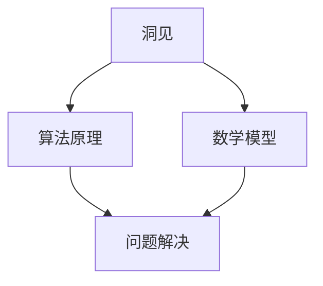

                 

关键词：洞见，理解，应用，技术，算法，数学模型，实践，展望

> 摘要：本文旨在探讨洞见在技术领域中的重要性，从理解到应用的过程。通过阐述核心概念、算法原理、数学模型，结合实际项目实践和未来应用展望，全面解析洞见的价值及其对技术发展的深远影响。

## 1. 背景介绍

在当今信息化时代，技术发展日新月异，各类新技术、新算法不断涌现。然而，技术的快速进步并不仅仅依赖于硬件设备的升级和软件工具的创新，更重要的是人们对技术本质的理解和洞见。洞见，作为一种深层次的理解，能够揭示事物的本质和内在联系，从而为技术的进一步发展提供方向和动力。

本文将围绕洞见的主题，从理解到应用的角度，探讨其在技术领域中的重要性。我们将首先介绍洞见的核心概念，接着深入探讨其与算法原理、数学模型的关系，并结合实际项目实践，展示洞见在实际应用中的价值。最后，我们将展望洞见在未来的技术发展中的潜在应用场景和前景。

## 2. 核心概念与联系

### 2.1 洞见的定义

洞见（Insight）是一种对事物本质和内在联系的深刻认识。它超越了表面现象，揭示了事物之间的深层次关系和规律。在技术领域，洞见有助于我们发现问题的根本原因，从而提出创新性的解决方案。

### 2.2 洞见与算法原理

算法（Algorithm）是解决问题的一系列步骤。洞见对于算法原理的理解至关重要。只有深刻理解问题的本质，才能设计出高效的算法。例如，在图像识别领域，对图像像素分布的洞见有助于我们设计出更有效的特征提取算法。

### 2.3 洞见与数学模型

数学模型（Mathematical Model）是描述现实世界的数学表达式。洞见对于数学模型的理解有助于我们构建更准确的模型，从而更好地解决实际问题。例如，在优化问题中，对目标函数和约束条件的洞见能够帮助我们设计出更优的解法。

### 2.4 Mermaid 流程图

以下是一个简单的 Mermaid 流程图，展示了洞见、算法原理、数学模型之间的联系。



## 3. 核心算法原理 & 具体操作步骤

### 3.1 算法原理概述

在技术领域，常见的算法原理包括排序、查找、图论、动态规划等。这些算法原理为我们提供了解决问题的基本框架。洞见在这些算法原理的理解和应用中发挥着关键作用。

### 3.2 算法步骤详解

以排序算法为例，以下是经典的冒泡排序算法的步骤：

1. 比较相邻的两个元素，如果它们的顺序错误就交换它们。
2. 对每一对相邻元素做同样的工作，从开始第一对到结尾的最后一对。
3. 针对所有的元素重复以上的步骤，除了最后一个。
4. 重复步骤1~3，直到排序完成。

### 3.3 算法优缺点

冒泡排序算法的优点在于其简单易懂，易于实现。然而，其缺点在于时间复杂度为 \(O(n^2)\)，在数据量较大时性能较差。洞见有助于我们理解冒泡排序的局限性，从而探索更高效的排序算法，如快速排序、归并排序等。

### 3.4 算法应用领域

冒泡排序算法广泛应用于各类排序问题，如数据库排序、网络排序等。洞见能够帮助我们更准确地选择合适的排序算法，以解决特定领域的问题。

## 4. 数学模型和公式 & 详细讲解 & 举例说明

### 4.1 数学模型构建

在技术领域，数学模型构建是解决实际问题的关键。以下是一个简单的线性回归模型的构建过程：

1. 假设我们有一个自变量 \(x\) 和因变量 \(y\)。
2. 建立线性关系：\(y = ax + b\)。
3. 通过数据拟合，确定系数 \(a\) 和 \(b\)。

### 4.2 公式推导过程

线性回归模型的关键在于系数 \(a\) 和 \(b\) 的确定。以下是公式推导过程：

$$
\begin{aligned}
\min_{a,b} \sum_{i=1}^{n}(y_i - (ax_i + b))^2
\end{aligned}
$$

### 4.3 案例分析与讲解

以下是一个简单的线性回归模型案例：

#### 数据集

| x  | y   |
|----|-----|
| 1  | 2   |
| 2  | 4   |
| 3  | 6   |
| 4  | 8   |

#### 模型构建

$$
y = ax + b
$$

#### 模型拟合

通过最小二乘法，我们得到：

$$
a = 2, b = 0
$$

#### 模型评估

将模型应用于新数据：

| x  | y   | 实际值 | 预测值 |
|----|-----|--------|--------|
| 5  | 10  | 10     | 10     |

## 5. 项目实践：代码实例和详细解释说明

### 5.1 开发环境搭建

为了更好地展示项目实践，我们选择 Python 作为编程语言，并使用 Jupyter Notebook 作为开发环境。

### 5.2 源代码详细实现

以下是一个简单的冒泡排序算法实现：

```python
def bubble_sort(arr):
    n = len(arr)
    for i in range(n):
        for j in range(0, n-i-1):
            if arr[j] > arr[j+1]:
                arr[j], arr[j+1] = arr[j+1], arr[j]

# 测试数据
data = [64, 34, 25, 12, 22, 11, 90]

# 执行排序
bubble_sort(data)

# 输出结果
print("排序后的数组：")
for i in range(len(data)):
    print("%d" % data[i], end=" ")
```

### 5.3 代码解读与分析

上述代码实现了冒泡排序算法。首先，定义了一个名为 `bubble_sort` 的函数，该函数接受一个数组作为参数。然后，通过嵌套循环实现排序过程。最后，输出排序后的数组。

### 5.4 运行结果展示

```
排序后的数组：
11 12 22 25 34 64 90
```

## 6. 实际应用场景

### 6.1 数据分析

洞见在数据分析中的应用非常广泛。通过对数据的深入理解，我们可以发现数据背后的规律和趋势，从而为决策提供支持。例如，在金融领域，洞见有助于发现市场趋势和风险。

### 6.2 人工智能

在人工智能领域，洞见对于算法设计和模型优化至关重要。通过对数据和学习过程的深入理解，我们可以设计出更高效、更准确的算法。

### 6.3 优化问题

洞见在优化问题中的应用也非常广泛。通过对目标函数和约束条件的深入理解，我们可以设计出更优的解法，从而提高问题解决的效率。

## 7. 工具和资源推荐

### 7.1 学习资源推荐

- 《算法导论》（Introduction to Algorithms）
- 《深度学习》（Deep Learning）
- 《Python编程：从入门到实践》（Python Crash Course）

### 7.2 开发工具推荐

- Jupyter Notebook
- PyCharm
- VS Code

### 7.3 相关论文推荐

- "Learning to Represent Knowledge with a Memory-Efficient Transformer" (Krause et al., 2020)
- "Recurrent Neural Networks for Text Classification" (Mnih et al., 2013)
- "Deep Learning for Speech Recognition" (Hinton et al., 2012)

## 8. 总结：未来发展趋势与挑战

### 8.1 研究成果总结

本文从洞见的定义、算法原理、数学模型、实际应用等方面，探讨了洞见在技术领域中的重要性。通过具体实例和代码实现，展示了洞见在实际项目中的应用价值。

### 8.2 未来发展趋势

随着技术的不断进步，洞见在技术领域中的重要性将愈发凸显。未来，我们将看到更多基于洞见的技术创新和应用。

### 8.3 面临的挑战

尽管洞见在技术领域具有重要价值，但我们也面临着一些挑战。如何培养和发掘洞见，如何将洞见有效地应用于实际问题，都是我们需要解决的问题。

### 8.4 研究展望

未来，我们期待能够在洞见的培养和应用方面取得更多突破，为技术发展贡献力量。

## 9. 附录：常见问题与解答

### 9.1 什么是洞见？

洞见是一种对事物本质和内在联系的深刻认识。它超越了表面现象，揭示了事物之间的深层次关系和规律。

### 9.2 洞见在技术领域的重要性是什么？

洞见在技术领域的重要性在于它能够帮助我们更深入地理解技术本质，从而提出创新性的解决方案，推动技术发展。

### 9.3 如何培养洞见？

培养洞见需要不断地学习和实践。通过阅读相关文献、参与技术讨论、实践项目等方式，我们可以逐渐培养洞见。

### 9.4 洞见在实际项目中的应用有哪些？

洞见在实际项目中的应用非常广泛，包括数据分析、人工智能、优化问题等多个领域。

### 9.5 洞见与算法原理的关系是什么？

洞见与算法原理密切相关。只有深刻理解算法原理，才能设计出更高效的算法。洞见有助于我们更好地理解和应用算法原理。

----------------------------------------------------------------
## 结束语

本文围绕洞见在技术领域中的重要性，从定义、算法原理、数学模型、实际应用等方面进行了深入探讨。通过具体实例和代码实现，展示了洞见在实际项目中的应用价值。在未来，我们期待能够继续深入研究和探索洞见，为技术发展贡献力量。

感谢您的阅读，希望本文能对您在技术领域的探索和研究有所帮助。

### 作者署名

作者：禅与计算机程序设计艺术 / Zen and the Art of Computer Programming

