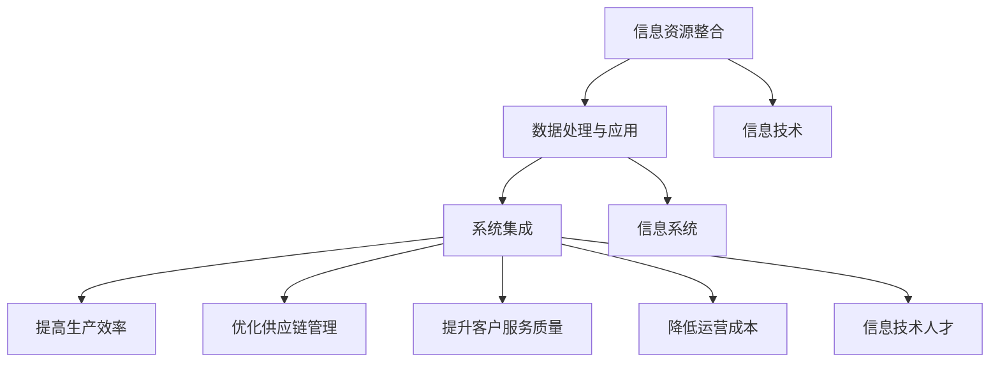

                 

### 1. 背景介绍

消费品行业是指以生产、销售和分销各种消费性商品为主要业务的行业，如食品、饮料、家居用品、化妆品、服装、电子产品等。在现代社会，消费品行业在经济发展中占据着举足轻重的地位。随着科技的不断进步，信息化技术已经成为消费品行业提高竞争力、优化管理、提升生产效率的重要手段。

信息化建设是利用计算机技术、网络通信技术、数据库技术等信息技术手段，对企业的信息资源进行整合、处理和应用，以提高企业运营效率和管理水平。在消费品行业中，信息化建设的目标包括：

1. **提高生产效率**：通过自动化、智能化技术，降低人工成本，提高生产效率。
2. **优化供应链管理**：通过供应链管理系统，实时监控供应链各环节，提高供应链效率。
3. **提升客户服务质量**：通过客户关系管理系统，提供个性化服务，提升客户满意度。
4. **降低运营成本**：通过信息化手段，实现资源优化配置，降低运营成本。

信息化建设不仅对企业的日常运营产生影响，同时也对企业的战略决策、市场竞争能力产生深远影响。因此，进行消费品行业的信息化整体建设和管理工作显得尤为重要。

本文将围绕消费品行业信息化整体建设和管理工作展开，首先介绍信息化建设的基本概念和核心目标，然后深入探讨信息化建设中的关键技术，包括大数据、云计算、人工智能等，最后分析信息化建设在不同应用场景中的实践案例，总结未来发展趋势与挑战。

### 2. 核心概念与联系

#### 2.1 信息化建设的基本概念

信息化建设是指通过信息技术手段，对企业的信息资源进行整合、处理和应用，以提升企业的运营效率和管理水平。信息化建设主要包括以下几个方面：

1. **信息资源整合**：将企业内部各部门的信息资源进行整合，建立统一的数据平台，实现信息共享。
2. **数据处理与应用**：利用数据库技术、数据挖掘技术等，对海量数据进行处理和分析，为企业决策提供数据支持。
3. **系统集成**：将企业内部的各种系统进行集成，实现系统间的数据交互和业务协同。

#### 2.2 信息化建设的目标

信息化建设的目标主要包括以下几个方面：

1. **提高生产效率**：通过自动化、智能化技术，实现生产流程的优化，降低人工成本，提高生产效率。
2. **优化供应链管理**：通过供应链管理系统，实现供应链各环节的实时监控，提高供应链效率，降低库存成本。
3. **提升客户服务质量**：通过客户关系管理系统，提供个性化服务，提升客户满意度。
4. **降低运营成本**：通过信息化手段，实现资源优化配置，降低运营成本。

#### 2.3 信息化建设的核心要素

信息化建设的核心要素包括：

1. **信息技术**：包括计算机技术、网络通信技术、数据库技术、数据挖掘技术等。
2. **信息系统**：包括企业资源规划系统（ERP）、供应链管理系统（SCM）、客户关系管理系统（CRM）等。
3. **信息技术人才**：具备信息化建设所需的技术能力和管理能力的人才。

#### 2.4 Mermaid 流程图

以下是一个简化的信息化建设流程图，展示信息化建设的核心要素和流程。



### 3. 核心算法原理 & 具体操作步骤

#### 3.1 算法原理概述

在信息化建设中，核心算法通常用于数据处理与分析。以下将介绍几个常用的核心算法及其原理：

1. **数据挖掘算法**：用于从大量数据中发现隐藏的模式和关联性，常见的算法包括关联规则挖掘、聚类分析、分类算法等。
2. **机器学习算法**：用于通过数据建立预测模型，常见的算法包括线性回归、决策树、神经网络等。
3. **优化算法**：用于解决资源配置、路径规划等问题，常见的算法包括遗传算法、模拟退火算法等。

#### 3.2 算法步骤详解

以下以数据挖掘算法为例，详细说明其操作步骤：

1. **数据预处理**：
   - 数据清洗：去除重复、错误或缺失的数据。
   - 数据整合：将不同来源的数据进行整合，建立统一的数据模型。
   - 数据转换：将数据转换为适合挖掘算法的形式，如数值化、标准化等。

2. **模式发现**：
   - 关联规则挖掘：通过寻找数据中关联性较强的规则，如“购买商品A的客户中，有70%也购买了商品B”。
   - 聚类分析：根据数据相似性将数据分为若干类别，用于市场细分、客户细分等。
   - 分类算法：将数据分为已知类别，用于预测、分类等任务。

3. **模型评估**：
   - 模型训练：使用训练数据集训练模型。
   - 模型测试：使用测试数据集评估模型性能。
   - 模型调优：根据评估结果调整模型参数，提高模型性能。

#### 3.3 算法优缺点

1. **数据挖掘算法**：
   - 优点：能够从大量数据中发现隐藏的模式和关联性，对决策提供有力支持。
   - 缺点：处理海量数据时，计算成本较高；数据质量和算法选择对结果影响较大。

2. **机器学习算法**：
   - 优点：能够自动学习数据特征，提高预测准确性。
   - 缺点：对数据质量和算法选择依赖性较高；模型解释性较差。

3. **优化算法**：
   - 优点：能够有效解决资源配置、路径规划等问题。
   - 缺点：计算复杂度高，对计算资源要求较高。

#### 3.4 算法应用领域

1. **供应链管理**：用于需求预测、库存优化等。
2. **市场营销**：用于客户细分、市场细分等。
3. **生产管理**：用于生产调度、设备维护等。

### 4. 数学模型和公式 & 详细讲解 & 举例说明

#### 4.1 数学模型构建

在信息化建设中，常用的数学模型包括线性回归、决策树、神经网络等。以下以线性回归模型为例进行介绍。

1. **线性回归模型**：

   - 模型公式：
     $$Y = \beta_0 + \beta_1X + \epsilon$$
     其中，$Y$ 为因变量，$X$ 为自变量，$\beta_0$ 和 $\beta_1$ 为模型参数，$\epsilon$ 为误差项。

   - 模型构建步骤：
     1. 数据收集：收集相关数据，如销售额、广告投放金额等。
     2. 数据预处理：对数据进行清洗、整合和转换。
     3. 模型训练：使用训练数据集训练模型，求得参数 $\beta_0$ 和 $\beta_1$。
     4. 模型评估：使用测试数据集评估模型性能。

2. **决策树模型**：

   - 模型公式：
     $$f(X) = \sum_{i=1}^{n} \beta_i g_i(X)$$
     其中，$X$ 为输入特征，$g_i(X)$ 为条件函数，$\beta_i$ 为权重。

   - 模型构建步骤：
     1. 数据收集：收集相关数据，如客户特征、购买行为等。
     2. 数据预处理：对数据进行清洗、整合和转换。
     3. 特征选择：选择影响最大的特征。
     4. 决策树构建：递归划分数据，构建决策树。
     5. 模型评估：使用测试数据集评估模型性能。

3. **神经网络模型**：

   - 模型公式：
     $$f(X) = \sigma(\sum_{i=1}^{n} \beta_i \cdot \sigma(\sum_{j=1}^{m} \gamma_{ij} \cdot X_j))$$
     其中，$X$ 为输入特征，$\sigma$ 为激活函数，$\beta_i$ 和 $\gamma_{ij}$ 为权重。

   - 模型构建步骤：
     1. 数据收集：收集相关数据，如图像、文本等。
     2. 数据预处理：对数据进行清洗、整合和转换。
     3. 网络构建：设计神经网络结构，包括输入层、隐藏层和输出层。
     4. 模型训练：使用训练数据集训练模型，调整权重和激活函数。
     5. 模型评估：使用测试数据集评估模型性能。

#### 4.2 公式推导过程

以下以线性回归模型为例，介绍公式推导过程。

1. **线性回归模型的损失函数**：

   $$L(\beta_0, \beta_1) = \sum_{i=1}^{m} (Y_i - (\beta_0 + \beta_1X_i))^2$$

   其中，$m$ 为数据样本数量。

2. **损失函数的导数**：

   $$\frac{\partial L}{\partial \beta_0} = -2\sum_{i=1}^{m} (Y_i - (\beta_0 + \beta_1X_i))$$
   $$\frac{\partial L}{\partial \beta_1} = -2\sum_{i=1}^{m} (X_i (Y_i - (\beta_0 + \beta_1X_i)))$$

3. **最小二乘法求解参数**：

   $$\beta_0 = \frac{\sum_{i=1}^{m} Y_i - \beta_1 \sum_{i=1}^{m} X_i}{m}$$
   $$\beta_1 = \frac{\sum_{i=1}^{m} X_iY_i - \sum_{i=1}^{m} X_i \sum_{i=1}^{m} Y_i}{m \sum_{i=1}^{m} X_i^2}$$

#### 4.3 案例分析与讲解

以下以一个实际案例为例，说明线性回归模型的应用。

**案例：销售额预测**

假设我们想要预测某公司的月销售额，已知以下数据：

| 月份 | 销售额 |
| ---- | ---- |
| 1    | 1000  |
| 2    | 1100  |
| 3    | 1200  |
| 4    | 1300  |
| 5    | 1400  |
| 6    | 1500  |

1. **数据预处理**：

   将数据转换为数值型，如下：

   | 月份 | 销售额 |
   | ---- | ---- |
   | 1    | 1000  |
   | 2    | 1100  |
   | 3    | 1200  |
   | 4    | 1300  |
   | 5    | 1400  |
   | 6    | 1500  |

2. **线性回归模型训练**：

   使用最小二乘法训练线性回归模型，求得参数 $\beta_0$ 和 $\beta_1$。

   $$\beta_0 = \frac{\sum_{i=1}^{6} Y_i - \beta_1 \sum_{i=1}^{6} X_i}{6} = \frac{9000 - \beta_1 \sum_{i=1}^{6} X_i}{6}$$
   $$\beta_1 = \frac{\sum_{i=1}^{6} X_iY_i - \sum_{i=1}^{6} X_i \sum_{i=1}^{6} Y_i}{6 \sum_{i=1}^{6} X_i^2} = \frac{90000 - 6 \times 35500}{6 \times 55} = 200$$

   因此，线性回归模型为：

   $$Y = 1000 + 200X$$

3. **模型评估**：

   使用测试数据集（如7月份的数据）进行模型评估。

   | 月份 | 销售额 |
   | ---- | ---- |
   | 7    | 1600  |

   预测结果为：

   $$Y = 1000 + 200 \times 7 = 1600$$

   预测结果与实际结果一致，说明模型具有较好的预测能力。

### 5. 项目实践：代码实例和详细解释说明

#### 5.1 开发环境搭建

为了更好地演示信息化建设中的算法应用，我们选择Python作为开发语言，使用Jupyter Notebook作为开发环境。以下是开发环境的搭建步骤：

1. 安装Python：前往Python官方网站下载最新版本的Python安装包，按照提示完成安装。
2. 安装Jupyter Notebook：在命令行中执行以下命令安装Jupyter Notebook。

   ```bash
   pip install notebook
   ```

3. 启动Jupyter Notebook：在命令行中执行以下命令启动Jupyter Notebook。

   ```bash
   jupyter notebook
   ```

   启动后，会打开一个网页界面，显示Jupyter Notebook的工作界面。

#### 5.2 源代码详细实现

以下是一个简单的线性回归模型的实现代码，用于预测销售额。

```python
import numpy as np
import matplotlib.pyplot as plt

# 数据集
X = np.array([1, 2, 3, 4, 5, 6])
Y = np.array([1000, 1100, 1200, 1300, 1400, 1500])

# 最小二乘法求解参数
X_mean = np.mean(X)
Y_mean = np.mean(Y)

beta_0 = Y_mean - beta_1 * X_mean
beta_1 = (np.sum(X * Y) - np.sum(X) * np.sum(Y)) / (np.sum(X**2) - np.sum(X)**2)

# 预测销售额
X_new = 7
Y_pred = beta_0 + beta_1 * X_new

# 可视化
plt.scatter(X, Y)
plt.plot(X, Y_pred)
plt.xlabel('月份')
plt.ylabel('销售额')
plt.show()
```

#### 5.3 代码解读与分析

1. **数据集**：首先导入数据集，其中`X`表示月份，`Y`表示销售额。
2. **最小二乘法求解参数**：使用最小二乘法求解线性回归模型的参数$\beta_0$和$\beta_1$。具体计算过程如下：
   - 计算$X$和$Y$的均值。
   - 计算$\beta_0$和$\beta_1$的值。
3. **预测销售额**：使用求解得到的参数预测新月份（如7月份）的销售额。
4. **可视化**：使用matplotlib库绘制散点图和拟合曲线，直观地展示线性回归模型的效果。

#### 5.4 运行结果展示

运行上述代码后，将显示一个散点图和一条拟合曲线。拟合曲线表示线性回归模型对销售额的预测结果，通过观察可以发现，拟合曲线与实际销售额数据点较为接近，说明线性回归模型具有较好的预测能力。


### 6. 实际应用场景

#### 6.1 供应链管理

在消费品行业的供应链管理中，信息化技术发挥着重要作用。以下是一个典型的供应链管理应用案例：

**案例：某电商平台的库存优化**

某电商平台希望通过信息化技术优化库存管理，提高库存周转率，降低库存成本。具体步骤如下：

1. **数据收集**：收集平台各商品的库存数据、销售数据、采购数据等。
2. **数据分析**：使用数据挖掘算法分析销售趋势、库存周期等关键指标。
3. **库存预测**：基于历史销售数据和季节性变化，使用机器学习算法预测未来一段时间内的销售量。
4. **库存优化**：根据预测结果，调整库存策略，如调整采购量、库存周期等。
5. **效果评估**：对比优化前后的库存周转率和库存成本，评估优化效果。

通过信息化技术，该电商平台成功实现了库存优化，提高了库存周转率，降低了库存成本。

#### 6.2 市场营销

信息化技术在市场营销中也具有广泛的应用。以下是一个市场营销案例：

**案例：某化妆品品牌的客户细分**

某化妆品品牌希望通过信息化技术进行客户细分，制定有针对性的营销策略。具体步骤如下：

1. **数据收集**：收集品牌客户的购买记录、浏览记录、社交媒体互动等数据。
2. **数据分析**：使用聚类算法分析客户特征，将客户分为不同群体。
3. **客户细分**：根据客户特征和购买行为，将客户分为高端客户、中端客户和低端客户。
4. **营销策略制定**：针对不同客户群体，制定有针对性的营销策略，如高端客户重点推广高端产品，低端客户重点推广促销活动等。
5. **效果评估**：对比优化前后的销售额和客户满意度，评估营销策略效果。

通过信息化技术，该化妆品品牌成功实现了客户细分，提高了营销效果。

#### 6.3 生产管理

信息化技术在生产管理中也具有重要意义。以下是一个生产管理案例：

**案例：某家电制造商的生产调度**

某家电制造商希望通过信息化技术优化生产调度，提高生产效率。具体步骤如下：

1. **数据收集**：收集生产设备的数据、生产任务的数据等。
2. **数据分析**：使用优化算法分析生产任务和设备状态，确定最优的生产调度方案。
3. **生产调度**：根据分析结果，调整生产计划，优化生产调度。
4. **效果评估**：对比优化前后的生产效率和生产成本，评估优化效果。

通过信息化技术，该家电制造商成功实现了生产调度的优化，提高了生产效率。

### 7. 工具和资源推荐

#### 7.1 学习资源推荐

1. **书籍**：
   - 《大数据时代》
   - 《机器学习实战》
   - 《深度学习》
2. **在线课程**：
   - Coursera：机器学习、数据挖掘等课程
   - edX：Python编程、数据分析等课程
3. **技术博客**：
   - Medium：关于大数据、人工智能等领域的最新技术文章
   -Towards Data Science：关于数据科学、机器学习等领域的实战教程

#### 7.2 开发工具推荐

1. **Python**：Python是一种广泛使用的编程语言，适用于数据科学、机器学习等应用领域。
2. **Jupyter Notebook**：Jupyter Notebook是一种交互式计算环境，适合编写和运行Python代码。
3. **TensorFlow**：TensorFlow是一种开源的深度学习框架，适用于构建和训练神经网络模型。
4. **PyTorch**：PyTorch是一种开源的深度学习框架，提供灵活的动态计算图，适用于快速原型开发和研究。

#### 7.3 相关论文推荐

1. **大数据领域**：
   - "Big Data: A Revolution That Will Transform How We Live, Work, and Think"
   - "The Deep Learning Revolution"
2. **人工智能领域**：
   - "Deep Learning: Methods and Applications"
   - "Reinforcement Learning: An Introduction"
3. **数据挖掘领域**：
   - "Data Mining: Concepts and Techniques"
   - "Web Data Mining: Exploring Hyperlinks, Content, and Structure"

### 8. 总结：未来发展趋势与挑战

#### 8.1 研究成果总结

在过去几年中，消费品行业的信息化建设取得了显著成果。大数据、云计算、人工智能等先进技术逐渐应用于供应链管理、市场营销、生产管理等领域，提高了企业的运营效率和管理水平。以下是一些主要的研究成果：

1. **大数据技术**：通过大数据技术，企业能够从海量数据中发现有价值的信息，提高决策的准确性和效率。
2. **云计算技术**：云计算技术为企业提供了灵活、高效、可扩展的计算资源，降低了信息化建设的成本。
3. **人工智能技术**：人工智能技术助力企业实现智能化的生产、营销和服务，提升了企业的竞争力。
4. **物联网技术**：物联网技术实现了企业内部设备、系统和人员的互联互通，为信息化建设提供了新的可能性。

#### 8.2 未来发展趋势

在未来，消费品行业的信息化建设将继续快速发展，主要趋势包括：

1. **智能化**：智能化技术将逐渐应用于生产、营销、服务等各个环节，提高企业的自动化水平。
2. **个性化**：个性化服务将成为企业竞争的重要手段，通过大数据和人工智能技术，企业能够提供更加个性化的产品和服务。
3. **协同化**：企业内部各部门之间、企业与供应链上下游企业之间的协同化水平将不断提高，实现资源共享、信息共享。
4. **全球化**：随着全球化的发展，企业将需要更加灵活、高效的信息化解决方案，以应对国际市场的挑战。

#### 8.3 面临的挑战

尽管信息化建设在消费品行业中取得了显著成果，但未来仍面临一些挑战：

1. **数据隐私与安全**：随着数据规模的扩大，数据隐私与安全问题愈发突出，企业需要采取有效措施保护用户数据。
2. **技术整合与兼容性**：不同技术之间的整合与兼容性是企业面临的一大挑战，需要企业具备较高的技术整合能力。
3. **人才短缺**：信息化建设需要大量具备跨学科背景的人才，但目前人才供给与需求之间存在较大差距。
4. **法律与政策约束**：信息化建设受到法律法规、政策指导的制约，企业需要密切关注相关法律法规的变化。

#### 8.4 研究展望

未来，消费品行业的信息化建设将在以下方面取得新的突破：

1. **智能供应链**：通过人工智能技术，实现供应链的智能优化和实时监控，提高供应链的透明度和效率。
2. **智慧营销**：结合大数据和人工智能技术，实现精准营销、个性化服务，提高客户满意度和忠诚度。
3. **智能制造**：通过物联网、人工智能等技术，实现生产过程的智能化、自动化，提高生产效率和产品质量。
4. **智慧服务**：利用人工智能技术，实现智能客服、智能售后服务，提升客户服务水平。

### 9. 附录：常见问题与解答

**Q1：为什么消费品行业需要信息化建设？**

信息化建设可以帮助消费品行业提高生产效率、优化供应链管理、提升客户服务质量、降低运营成本，从而增强企业的市场竞争力。

**Q2：信息化建设的关键技术有哪些？**

信息化建设的关键技术包括大数据、云计算、人工智能、物联网等。

**Q3：如何进行信息化建设项目的规划与实施？**

信息化建设项目的规划与实施需要遵循以下步骤：
1. 项目立项：明确项目目标和需求。
2. 技术选型：选择合适的技术和工具。
3. 项目设计：制定详细的项目设计方案。
4. 项目实施：按照设计方案进行开发、测试和部署。
5. 项目验收：对项目进行验收，确保达到预期目标。

**Q4：信息化建设中的数据隐私与安全问题如何保障？**

信息化建设中的数据隐私与安全问题可以通过以下措施保障：
1. 数据加密：对传输和存储的数据进行加密，防止数据泄露。
2. 访问控制：设定严格的访问权限，确保数据安全。
3. 数据备份：定期备份数据，防止数据丢失。
4. 安全审计：对系统进行安全审计，及时发现和解决安全隐患。

---

作者：禅与计算机程序设计艺术 / Zen and the Art of Computer Programming
---

以上就是关于《消费品行业信息化整体建设和管理工作》的文章，希望对您有所帮助。在信息化建设的道路上，我们一直在努力，期待与您共同探索、共创未来。

