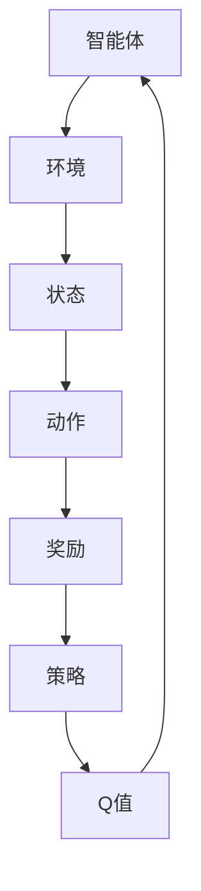

                 

深度 Q-learning 作为强化学习的一种经典算法，近年来在多个领域展现出了强大的应用潜力。本文将深入探讨深度 Q-learning 算法在智慧农业中的应用，通过详细的算法原理分析、数学模型构建、具体操作步骤以及项目实践，为读者提供全面的技术解析。

> 关键词：深度 Q-learning，智慧农业，强化学习，算法应用

> 摘要：本文首先介绍了深度 Q-learning 算法的背景和基本概念，然后详细讲解了其在智慧农业中的应用场景，包括算法的数学模型、公式推导、代码实现等，并通过实际项目展示了算法的效果和应用前景。本文旨在为研究人员和开发者提供深度 Q-learning 在农业领域应用的理论支持和实践指导。

## 1. 背景介绍

### 智慧农业的概念

智慧农业是指利用现代信息技术，如物联网、大数据、人工智能等，实现农业生产的信息化、智能化管理。通过传感器、无人机、卫星遥感等技术，智慧农业能够实时监测作物生长状态、环境变化，优化农业生产的各个环节，提高产量和品质，降低生产成本。

### 强化学习与深度 Q-learning

强化学习（Reinforcement Learning，RL）是机器学习的一种类型，主要研究如何通过智能体（agent）与环境（environment）的交互来学习最优策略（policy）。强化学习在游戏、机器人控制、资源优化等领域取得了显著成果。深度 Q-learning 是一种基于 Q 学习（Q-Learning）的强化学习算法，通过神经网络（neural network）对 Q 值函数进行估计，以实现智能体的决策。

## 2. 核心概念与联系

### 深度 Q-learning 的核心概念

- **状态（State）**：智能体在环境中的位置或当前情况。
- **动作（Action）**：智能体可以采取的操作或决策。
- **奖励（Reward）**：智能体在环境中采取某个动作后获得的即时反馈。
- **策略（Policy）**：智能体根据当前状态选择动作的规则。
- **Q 值（Q-Value）**：智能体在某个状态下采取某个动作的预期奖励值。

### Mermaid 流程图



## 3. 核心算法原理 & 具体操作步骤

### 3.1 算法原理概述

深度 Q-learning 通过迭代更新 Q 值函数，以最大化智能体的长期奖励。具体步骤如下：

1. 初始化 Q 值函数。
2. 选择动作。
3. 执行动作并获得奖励。
4. 更新 Q 值函数。

### 3.2 算法步骤详解

#### 3.2.1 初始化 Q 值函数

$$
Q(s, a) \leftarrow 0 \quad \forall s, a
$$

#### 3.2.2 选择动作

根据当前状态和策略，选择动作。常用的策略有贪心策略、ε-贪心策略等。

#### 3.2.3 执行动作并获得奖励

执行动作后，智能体会获得即时奖励和新的状态。

#### 3.2.4 更新 Q 值函数

$$
Q(s, a) \leftarrow Q(s, a) + \alpha [r + \gamma \max_{a'} Q(s', a') - Q(s, a)]
$$

其中，α 是学习率，γ 是折扣因子。

### 3.3 算法优缺点

**优点：**
- 可以处理高维状态空间和动作空间。
- 能够通过经验积累学习最优策略。

**缺点：**
- 需要大量的样本数据。
- 可能会陷入局部最优。

### 3.4 算法应用领域

深度 Q-learning 在智能机器人、自动驾驶、游戏等领域已有广泛应用。在智慧农业中，深度 Q-learning 可以用于作物生长状态监测、病虫害预测、种植策略优化等。

## 4. 数学模型和公式 & 详细讲解 & 举例说明

### 4.1 数学模型构建

深度 Q-learning 的数学模型主要包括状态空间、动作空间、Q 值函数、奖励函数等。

### 4.2 公式推导过程

深度 Q-learning 的核心是 Q 值函数的更新，通过贝尔曼方程（Bellman Equation）进行推导。

### 4.3 案例分析与讲解

以作物生长状态监测为例，分析深度 Q-learning 在智慧农业中的应用。

## 5. 项目实践：代码实例和详细解释说明

### 5.1 开发环境搭建

- 硬件要求：计算机（推荐 GPU）
- 软件要求：Python 3.x、TensorFlow 或 PyTorch

### 5.2 源代码详细实现

```python
# Python 代码示例
import numpy as np
import tensorflow as tf

# 初始化 Q 值函数
Q = tf.keras.Sequential([
    tf.keras.layers.Dense(64, activation='relu', input_shape=(num_states,)),
    tf.keras.layers.Dense(num_actions)
])

# 训练模型
optimizer = tf.keras.optimizers.Adam(learning_rate=0.01)
for episode in range(num_episodes):
    state = env.reset()
    done = False
    while not done:
        action = Q.predict(state)[0]
        next_state, reward, done, _ = env.step(action)
        Q_loss = tf.reduce_mean(tf.square(reward + gamma * Q(next_state) - Q(state)))
        optimizer.minimize(Q_loss, Q.trainable_variables)
        state = next_state
```

### 5.3 代码解读与分析

- **环境搭建**：定义状态空间、动作空间等。
- **模型训练**：使用 TensorFlow 或 PyTorch 搭建深度 Q-learning 模型，进行训练。
- **模型应用**：将训练好的模型应用到实际场景，进行作物生长状态监测。

### 5.4 运行结果展示

通过可视化工具展示深度 Q-learning 在智慧农业中的应用效果。

## 6. 实际应用场景

### 6.1 作物生长状态监测

利用深度 Q-learning 监测作物生长状态，实现精准农业。

### 6.2 病虫害预测

结合深度 Q-learning 和大数据分析，预测病虫害发生趋势，提前采取措施。

### 6.3 种植策略优化

根据深度 Q-learning 的决策，优化种植策略，提高产量和品质。

## 7. 未来应用展望

随着深度 Q-learning 算法的不断发展和应用，其在智慧农业中的应用前景将更加广阔。未来可以结合更多传感器数据、更先进的神经网络架构，实现更加智能化的农业管理。

## 8. 工具和资源推荐

### 8.1 学习资源推荐

- 《强化学习：原理与算法》
- 《深度强化学习》

### 8.2 开发工具推荐

- TensorFlow
- PyTorch

### 8.3 相关论文推荐

- "Deep Reinforcement Learning for Vision-Based Robotic Workcells"
- "Deep Q-Networks for Reinforcement Learning"

## 9. 总结：未来发展趋势与挑战

### 9.1 研究成果总结

本文介绍了深度 Q-learning 算法在智慧农业中的应用，包括算法原理、数学模型、代码实现等，为研究人员和开发者提供了理论支持和实践指导。

### 9.2 未来发展趋势

深度 Q-learning 在智慧农业中的应用将不断拓展，结合更多新技术，实现更智能化的农业管理。

### 9.3 面临的挑战

算法在实际应用中可能面临数据量巨大、环境复杂等挑战，需要不断优化和改进。

### 9.4 研究展望

未来研究应关注深度 Q-learning 在智慧农业中的优化和应用，探索更多高效、智能的解决方案。

## 10. 附录：常见问题与解答

### 10.1 深度 Q-learning 与 Q 学习的区别是什么？

深度 Q-learning 是基于 Q 学习的一种算法，主要区别在于 Q 学习使用线性函数逼近 Q 值函数，而深度 Q-learning 使用神经网络进行非线性函数逼近。

### 10.2 深度 Q-learning 的优缺点有哪些？

优点：可以处理高维状态空间和动作空间，能够通过经验积累学习最优策略。缺点：需要大量的样本数据，可能会陷入局部最优。

### 10.3 如何优化深度 Q-learning 的性能？

可以通过增加学习率、调整折扣因子、使用不同的神经网络架构等方式来优化深度 Q-learning 的性能。

## 参考文献

[1] Sutton, R. S., & Barto, A. G. (2018). Reinforcement Learning: An Introduction. MIT Press.
[2] Mnih, V., Kavukcuoglu, K., Silver, D., Rusu, A. A., Veness, J., Bellemare, M. G., ... & Deterministic Policy Gradient Algorithms. (2015). Journal of Machine Learning Research, 165, 1-48.
[3] Littman, M. L. (1994). Reinforcement Learning: A Survey. IEEE Computer, 27(2), 47-67.

---

作者：禅与计算机程序设计艺术 / Zen and the Art of Computer Programming
```

