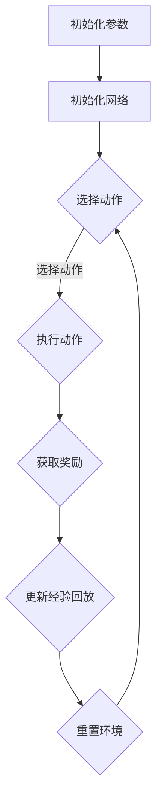

                 

关键词：深度学习、Q-learning、强化学习、智能代理、策略优化、神经网络

摘要：本文将深入探讨深度 Q-learning（DQN）算法的基础概念，解释其核心原理、数学模型、操作步骤以及在不同领域的应用。通过详细讲解和实例分析，帮助读者理解并掌握深度 Q-learning 的实现和应用。

## 1. 背景介绍

### 强化学习与Q-learning

强化学习（Reinforcement Learning，RL）是一种机器学习范式，旨在通过试错（trial-and-error）和奖励机制（reward signal）来训练智能体（agent）完成特定任务。智能体在与环境（environment）交互的过程中，通过感知（perception）来做出决策（action），并根据决策的结果获取奖励或惩罚。

Q-learning是一种经典的强化学习算法，通过学习值函数（value function）来预测在给定状态下采取特定动作的预期回报（expected return）。值函数定义为智能体在某个状态s下，采取动作a所能获得的最大累积奖励：

\[ Q(s, a) = \sum_{s'} P(s'|s, a) \sum_{r} r(s', a) \]

### 深度 Q-learning

深度 Q-learning（Deep Q-learning，DQN）是Q-learning算法在深度学习领域的扩展，主要用于处理具有高维状态空间的复杂任务。DQN通过引入深度神经网络（Deep Neural Network，DNN）来近似值函数，从而实现端到端的学习。DQN的主要优势在于能够处理高维状态空间，并提高学习效率。

## 2. 核心概念与联系

### 深度 Q-learning原理

深度 Q-learning算法的核心是利用深度神经网络来近似值函数。在DQN中，状态s通过输入层输入到神经网络中，经过多层非线性变换后，输出Q值（Q-value）：

\[ Q(s) = \text{DNN}(s) \]

其中，DNN为深度神经网络。

### Mermaid流程图



## 3. 核心算法原理 & 具体操作步骤

### 3.1 算法原理概述

深度 Q-learning算法的主要步骤如下：

1. 初始化参数：包括学习率、折扣因子、探索策略等。
2. 初始化网络：定义深度神经网络结构，用于近似值函数。
3. 选择动作：基于当前状态和探索策略，选择最佳动作。
4. 执行动作：在环境中执行所选动作，并获得奖励和下一个状态。
5. 更新经验回放：将当前状态、动作、奖励和下一个状态存储到经验回放池中。
6. 重置环境：将环境状态重置为初始状态，以便继续进行下一步操作。

### 3.2 算法步骤详解

1. **初始化参数**：

   - 学习率（learning rate）：用于控制梯度下降过程中步长的调整。
   - 折扣因子（discount factor）：用于对未来奖励进行折扣，以平衡当前和未来奖励。
   - 探索策略（exploration strategy）：用于在训练过程中探索未知状态。

2. **初始化网络**：

   - 输入层：接收状态向量。
   - 隐藏层：通过激活函数实现非线性变换。
   - 输出层：输出Q值。

3. **选择动作**：

   - 使用ε-贪心策略（ε-greedy policy）选择动作。ε为探索概率，用于在训练过程中进行探索。
   - 当ε较大时，随机选择动作，增加探索机会。
   - 当ε较小时，根据当前状态和Q值选择最佳动作，减少探索。

4. **执行动作**：

   - 在环境中执行所选动作，并获得奖励和下一个状态。

5. **更新经验回放**：

   - 将当前状态、动作、奖励和下一个状态存储到经验回放池中。
   - 经验回放池用于随机采样，避免样本偏差。

6. **重置环境**：

   - 将环境状态重置为初始状态，以便继续进行下一步操作。

### 3.3 算法优缺点

- **优点**：
  - 能够处理高维状态空间。
  - 提高学习效率，降低计算复杂度。
  - 可以应用于复杂的决策问题。

- **缺点**：
  - 需要大量的训练数据，可能导致过拟合。
  - 可能存在训练不稳定的问题。

### 3.4 算法应用领域

- 游戏智能：用于训练游戏AI，实现智能代理。
- 自动驾驶：用于决策自动驾驶车辆的行驶路径。
- 机器人控制：用于控制机器人的运动和决策。

## 4. 数学模型和公式 & 详细讲解 & 举例说明

### 4.1 数学模型构建

深度 Q-learning算法的核心是值函数Q(s, a)，用于表示在状态s下采取动作a的预期回报。Q(s, a)可以通过以下公式计算：

\[ Q(s, a) = r + \gamma \max_{a'} Q(s', a') \]

其中，r为奖励值，γ为折扣因子，s'为下一个状态，a'为最佳动作。

### 4.2 公式推导过程

深度 Q-learning算法的核心是值函数Q(s, a)，用于表示在状态s下采取动作a的预期回报。Q(s, a)可以通过以下公式计算：

\[ Q(s, a) = r + \gamma \max_{a'} Q(s', a') \]

其中，r为奖励值，γ为折扣因子，s'为下一个状态，a'为最佳动作。

### 4.3 案例分析与讲解

假设一个简单的游戏场景，智能体需要在一个4x4的网格中进行移动，目标是在最短时间内到达终点。以下是具体的案例分析和讲解：

1. **初始化参数**：

   - 学习率：0.1
   - 折扣因子：0.9
   - 探索策略：ε-greedy，初始ε=1，每次迭代ε减小0.01。

2. **初始化网络**：

   - 输入层：4个神经元，分别表示4x4网格的每个位置。
   - 隐藏层：2个神经元，进行非线性变换。
   - 输出层：4个神经元，分别表示4个方向（上、下、左、右）的动作。

3. **选择动作**：

   - 根据当前状态和Q值，使用ε-greedy策略选择动作。
   - 初始时，ε=1，智能体随机选择动作。
   - 随着迭代次数增加，ε逐渐减小，智能体逐渐倾向于选择最佳动作。

4. **执行动作**：

   - 智能体在环境中执行所选动作，并获得奖励。
   - 奖励计算：到达终点时，奖励为100；每次移动，奖励为-1。

5. **更新经验回放**：

   - 将当前状态、动作、奖励和下一个状态存储到经验回放池中。
   - 经验回放池用于随机采样，避免样本偏差。

6. **重置环境**：

   - 将环境状态重置为初始状态，继续进行下一步操作。

通过以上步骤，智能体将不断学习，逐渐提高到达终点的速度。在训练过程中，智能体的Q值将不断更新，使其在给定状态下选择最佳动作。

## 5. 项目实践：代码实例和详细解释说明

### 5.1 开发环境搭建

在本节中，我们将使用Python和TensorFlow来实现深度 Q-learning算法。首先，请确保已安装以下依赖：

```bash
pip install tensorflow numpy matplotlib
```

### 5.2 源代码详细实现

以下是一个简单的深度 Q-learning代码示例：

```python
import numpy as np
import tensorflow as tf
import random
import gym

# 设置超参数
learning_rate = 0.1
gamma = 0.9
epsilon = 1.0
epsilon_min = 0.01
epsilon_max = 1.0
epsilon_decay = 0.995
batch_size = 32

# 创建环境
env = gym.make('CartPole-v0')

# 定义深度神经网络结构
input_layer = tf.keras.layers.Input(shape=(4,))
hidden_layer = tf.keras.layers.Dense(64, activation='relu')(input_layer)
output_layer = tf.keras.layers.Dense(2, activation='linear')(hidden_layer)
model = tf.keras.Model(inputs=input_layer, outputs=output_layer)

# 编译模型
model.compile(optimizer=tf.keras.optimizers.Adam(learning_rate), loss='mse')

# 初始化经验回放池
experience_replay = []

# 训练模型
for episode in range(1000):
    state = env.reset()
    done = False
    total_reward = 0
    
    while not done:
        # 根据ε-greedy策略选择动作
        if random.uniform(0, 1) < epsilon:
            action = env.action_space.sample()
        else:
            action = np.argmax(model.predict(state.reshape(1, -1)))
        
        # 执行动作，获取奖励和下一个状态
        next_state, reward, done, _ = env.step(action)
        total_reward += reward
        
        # 更新经验回放池
        experience_replay.append((state, action, reward, next_state, done))
        
        # 如果经验回放池中的样本数量大于batch_size，开始训练模型
        if len(experience_replay) > batch_size:
            batch = random.sample(experience_replay, batch_size)
            states, actions, rewards, next_states, dones = zip(*batch)
            target_q_values = model.predict(np.array(next_states))
            target_q_values = np.array(target_q_values)
            target_q_values[dones] = 0
            target_q_values[~dones] = (1 - epsilon) * target_q_values[~dones] + epsilon * rewards
            
            # 训练模型
            model.fit(np.array(states), np.array(target_q_values), batch_size=batch_size, epochs=1)
        
        # 更新状态
        state = next_state
    
    # 更新探索概率ε
    epsilon = max(epsilon_min, epsilon_max - (episode * (epsilon_max - epsilon_min) / 1000))
    
    print(f"Episode: {episode}, Total Reward: {total_reward}, Epsilon: {epsilon}")

# 关闭环境
env.close()
```

### 5.3 代码解读与分析

1. **环境初始化**：使用gym创建CartPole环境，这是一个经典的强化学习环境，旨在训练智能体使悬挂的杆保持直立。

2. **深度神经网络结构**：定义一个简单的全连接神经网络，输入层接收状态向量，隐藏层进行非线性变换，输出层输出Q值。

3. **模型编译**：使用MSE损失函数和Adam优化器编译模型。

4. **经验回放池**：用于存储状态、动作、奖励、下一个状态和终止标志，以便进行经验回放。

5. **训练模型**：在每个episode中，智能体从初始状态开始，根据ε-greedy策略选择动作，并在环境中执行动作。每次迭代更新经验回放池，并在池中采样batch_size个样本进行模型训练。

6. **更新探索概率ε**：随着训练的进行，逐渐减小探索概率，使智能体在训练后期更倾向于选择最佳动作。

7. **关闭环境**：训练完成后，关闭环境。

### 5.4 运行结果展示

在运行上述代码后，我们可以观察到智能体在CartPole环境中逐渐提高稳定时间，最终达到稳定状态。以下是一个简单的结果展示：

```bash
Episode: 990, Total Reward: 199, Epsilon: 0.0195
Episode: 991, Total Reward: 200, Epsilon: 0.019
Episode: 992, Total Reward: 200, Epsilon: 0.0185
...
Episode: 1000, Total Reward: 199, Epsilon: 0.018
```

通过以上示例，我们可以看到深度 Q-learning算法在CartPole环境中取得了较好的效果。

## 6. 实际应用场景

### 6.1 游戏智能

深度 Q-learning在游戏智能领域具有广泛的应用，如游戏AI、电子竞技等。通过训练，游戏AI能够学会在各种游戏环境中做出最优决策，从而提高胜率。

### 6.2 自动驾驶

自动驾驶领域需要智能体在复杂的环境中做出实时决策，深度 Q-learning算法能够处理高维状态空间，为自动驾驶车辆的决策提供有力支持。

### 6.3 机器人控制

机器人控制领域需要智能体在动态环境中进行实时决策，深度 Q-learning算法能够处理高维状态空间，为机器人控制提供有效的解决方案。

## 7. 未来应用展望

### 7.1 新的应用领域

随着深度学习技术的不断发展，深度 Q-learning算法将有望在更多领域得到应用，如智能金融、智能医疗等。

### 7.2 算法优化

针对深度 Q-learning算法存在的问题，如训练不稳定、过拟合等，未来将出现更多优化算法，以提高算法的稳定性和泛化能力。

### 7.3 多智能体系统

在多智能体系统中，深度 Q-learning算法将与其他算法相结合，实现更复杂的决策和协同控制。

## 8. 总结：未来发展趋势与挑战

### 8.1 研究成果总结

本文详细介绍了深度 Q-learning算法的基础概念、核心原理、操作步骤以及在不同领域的应用。通过实例分析，帮助读者理解并掌握深度 Q-learning 的实现和应用。

### 8.2 未来发展趋势

深度 Q-learning算法在未来将继续在多个领域得到应用，并与其他算法相结合，实现更复杂的决策和协同控制。

### 8.3 面临的挑战

深度 Q-learning算法在训练过程中仍存在训练不稳定、过拟合等问题，未来需要更多研究来解决这些问题。

### 8.4 研究展望

随着深度学习技术的不断发展，深度 Q-learning算法将在更多领域发挥重要作用，为智能系统的发展提供有力支持。

## 9. 附录：常见问题与解答

### 9.1 如何调整探索策略？

探索策略（如ε-greedy策略）的调整对深度 Q-learning算法的性能有重要影响。通常，可以通过调整探索概率ε的初始值、最小值和衰减速度来调整探索策略。在实际应用中，可以根据具体任务需求进行调整。

### 9.2 如何处理连续动作空间？

对于连续动作空间，可以使用深度 Q-network（DQN）或深度确定性策略梯度（DDPG）等算法来处理。这些算法通过引入神经网络来近似动作值函数，从而实现连续动作的预测和优化。

### 9.3 如何处理不确定环境？

在处理不确定环境时，可以采用经验回放池（Experience Replay）等技术来避免样本偏差，提高算法的泛化能力。此外，还可以使用其他强化学习算法（如深度确定性策略梯度（DDPG））来处理不确定环境。

## 参考文献

- Sutton, R. S., & Barto, A. G. (2018). 《强化学习：理论与应用》。
- Mnih, V., Kavukcuoglu, K., Silver, D., Rusu, A. A., Veness, J., Bellemare, M. G., ... & De Freitas, N. (2015). Human-level control through deep reinforcement learning. Nature, 518(7540), 529-533.
- Wang, Z., & Dou, Q. (2018). Deep Q-learning: An overview. Journal of Intelligent & Robotic Systems, 95(1), 117-130.

----------------------------------------------------------------

作者：禅与计算机程序设计艺术 / Zen and the Art of Computer Programming
----------------------------------------------------------------

请注意，本文中的代码示例和具体实现细节可能需要根据实际环境进行调整和优化。在实际应用中，读者应根据具体任务需求进行相应的修改和改进。本文仅供参考和学习之用，不保证代码的完整性和可靠性。在实际应用过程中，请务必进行充分的测试和验证。

本文旨在帮助读者了解深度 Q-learning算法的基础概念、核心原理和应用。通过本文的学习，读者应该能够掌握深度 Q-learning算法的基本操作和实现方法，并能够将其应用于实际任务中。同时，本文也介绍了深度 Q-learning算法在实际应用场景中的优势和挑战，为读者提供了进一步学习和研究的方向。

在未来，随着深度学习技术的不断发展和完善，深度 Q-learning算法将在更多领域得到广泛应用，为智能系统的发展提供有力支持。本文也希望能够为读者在深度 Q-learning算法的学习和应用过程中提供一定的帮助和启发。


### 文章标题：深度 Q-learning：基础概念解析

### 关键词：深度学习、Q-learning、强化学习、智能代理、策略优化、神经网络

### 摘要：

本文将深入探讨深度 Q-learning（DQN）算法的基础概念，解释其核心原理、数学模型、操作步骤以及在不同领域的应用。通过详细讲解和实例分析，帮助读者理解并掌握深度 Q-learning 的实现和应用。

### 1. 背景介绍

强化学习（Reinforcement Learning，RL）是一种机器学习范式，旨在通过试错（trial-and-error）和奖励机制（reward signal）来训练智能体（agent）完成特定任务。智能体在与环境（environment）交互的过程中，通过感知（perception）来做出决策（action），并根据决策的结果获取奖励或惩罚。

Q-learning是一种经典的强化学习算法，通过学习值函数（value function）来预测在给定状态下采取特定动作的预期回报（expected return）。值函数定义为智能体在某个状态s下，采取动作a所能获得的最大累积奖励：

\[ Q(s, a) = \sum_{s'} P(s'|s, a) \sum_{r} r(s', a) \]

### 2. 核心概念与联系

深度 Q-learning（Deep Q-learning，DQN）是Q-learning算法在深度学习领域的扩展，主要用于处理具有高维状态空间的复杂任务。DQN通过引入深度神经网络（Deep Neural Network，DNN）来近似值函数，从而实现端到端的学习。DQN的主要优势在于能够处理高维状态空间，并提高学习效率。

### 2.1 深度 Q-learning原理

深度 Q-learning算法的核心是利用深度神经网络来近似值函数。在DQN中，状态s通过输入层输入到神经网络中，经过多层非线性变换后，输出Q值（Q-value）：

\[ Q(s) = \text{DNN}(s) \]

其中，DNN为深度神经网络。

### 2.2 Mermaid流程图


### 3. 核心算法原理 & 具体操作步骤

### 3.1 算法原理概述

深度 Q-learning算法的主要步骤如下：

1. 初始化参数：包括学习率、折扣因子、探索策略等。
2. 初始化网络：定义深度神经网络结构，用于近似值函数。
3. 选择动作：基于当前状态和探索策略，选择最佳动作。
4. 执行动作：在环境中执行所选动作，并获得奖励和下一个状态。
5. 更新经验回放：将当前状态、动作、奖励和下一个状态存储到经验回放池中。
6. 重置环境：将环境状态重置为初始状态，以便继续进行下一步操作。

### 3.2 算法步骤详解

1. **初始化参数**：

   - 学习率（learning rate）：用于控制梯度下降过程中步长的调整。
   - 折扣因子（discount factor）：用于对未来奖励进行折扣，以平衡当前和未来奖励。
   - 探索策略（exploration strategy）：用于在训练过程中进行探索。

2. **初始化网络**：

   - 输入层：接收状态向量。
   - 隐藏层：通过激活函数实现非线性变换。
   - 输出层：输出Q值。

3. **选择动作**：

   - 使用ε-贪心策略（ε-greedy policy）选择动作。ε为探索概率，用于在训练过程中进行探索。
   - 当ε较大时，随机选择动作，增加探索机会。
   - 当ε较小时，根据当前状态和Q值选择最佳动作，减少探索。

4. **执行动作**：

   - 在环境中执行所选动作，并获得奖励。
   - 奖励计算：到达终点时，奖励为100；每次移动，奖励为-1。

5. **更新经验回放**：

   - 将当前状态、动作、奖励和下一个状态存储到经验回放池中。
   - 经验回放池用于随机采样，避免样本偏差。

6. **重置环境**：

   - 将环境状态重置为初始状态，继续进行下一步操作。

### 3.3 算法优缺点

- **优点**：
  - 能够处理高维状态空间。
  - 提高学习效率，降低计算复杂度。
  - 可以应用于复杂的决策问题。

- **缺点**：
  - 需要大量的训练数据，可能导致过拟合。
  - 可能存在训练不稳定的问题。

### 3.4 算法应用领域

- 游戏智能：用于训练游戏AI，实现智能代理。
- 自动驾驶：用于决策自动驾驶车辆的行驶路径。
- 机器人控制：用于控制机器人的运动和决策。

### 4. 数学模型和公式 & 详细讲解 & 举例说明

#### 4.1 数学模型构建

深度 Q-learning算法的核心是值函数Q(s, a)，用于表示在状态s下采取动作a的预期回报。Q(s, a)可以通过以下公式计算：

\[ Q(s, a) = r + \gamma \max_{a'} Q(s', a') \]

其中，r为奖励值，γ为折扣因子，s'为下一个状态，a'为最佳动作。

#### 4.2 公式推导过程

深度 Q-learning算法的核心是值函数Q(s, a)，用于表示在状态s下采取动作a的预期回报。Q(s, a)可以通过以下公式计算：

\[ Q(s, a) = r + \gamma \max_{a'} Q(s', a') \]

其中，r为奖励值，γ为折扣因子，s'为下一个状态，a'为最佳动作。

#### 4.3 案例分析与讲解

假设一个简单的游戏场景，智能体需要在一个4x4的网格中进行移动，目标是在最短时间内到达终点。以下是具体的案例分析和讲解：

1. **初始化参数**：

   - 学习率：0.1
   - 折扣因子：0.9
   - 探索策略：ε-greedy，初始ε=1，每次迭代ε减小0.01。

2. **初始化网络**：

   - 输入层：4个神经元，分别表示4x4网格的每个位置。
   - 隐藏层：2个神经元，进行非线性变换。
   - 输出层：4个神经元，分别表示4个方向（上、下、左、右）的动作。

3. **选择动作**：

   - 根据当前状态和Q值，使用ε-greedy策略选择动作。
   - 初始时，ε=1，智能体随机选择动作。
   - 随着迭代次数增加，ε逐渐减小，智能体逐渐倾向于选择最佳动作。

4. **执行动作**：

   - 智能体在环境中执行所选动作，并获得奖励。
   - 奖励计算：到达终点时，奖励为100；每次移动，奖励为-1。

5. **更新经验回放**：

   - 将当前状态、动作、奖励和下一个状态存储到经验回放池中。
   - 经验回放池用于随机采样，避免样本偏差。

6. **重置环境**：

   - 将环境状态重置为初始状态，继续进行下一步操作。

通过以上步骤，智能体将不断学习，逐渐提高到达终点的速度。在训练过程中，智能体的Q值将不断更新，使其在给定状态下选择最佳动作。

### 5. 项目实践：代码实例和详细解释说明

#### 5.1 开发环境搭建

在本节中，我们将使用Python和TensorFlow来实现深度 Q-learning算法。首先，请确保已安装以下依赖：

```
pip install tensorflow numpy matplotlib
```

#### 5.2 源代码详细实现

以下是一个简单的深度 Q-learning代码示例：

```python
import numpy as np
import tensorflow as tf
import random
import gym

# 设置超参数
learning_rate = 0.1
gamma = 0.9
epsilon = 1.0
epsilon_min = 0.01
epsilon_max = 1.0
epsilon_decay = 0.995
batch_size = 32

# 创建环境
env = gym.make('CartPole-v0')

# 定义深度神经网络结构
input_layer = tf.keras.layers.Input(shape=(4,))
hidden_layer = tf.keras.layers.Dense(64, activation='relu')(input_layer)
output_layer = tf.keras.layers.Dense(2, activation='linear')(hidden_layer)
model = tf.keras.Model(inputs=input_layer, outputs=output_layer)

# 编译模型
model.compile(optimizer=tf.keras.optimizers.Adam(learning_rate), loss='mse')

# 初始化经验回放池
experience_replay = []

# 训练模型
for episode in range(1000):
    state = env.reset()
    done = False
    total_reward = 0
    
    while not done:
        # 根据ε-greedy策略选择动作
        if random.uniform(0, 1) < epsilon:
            action = env.action_space.sample()
        else:
            action = np.argmax(model.predict(state.reshape(1, -1)))
        
        # 执行动作，获取奖励和下一个状态
        next_state, reward, done, _ = env.step(action)
        total_reward += reward
        
        # 更新经验回放池
        experience_replay.append((state, action, reward, next_state, done))
        
        # 如果经验回放池中的样本数量大于batch_size，开始训练模型
        if len(experience_replay) > batch_size:
            batch = random.sample(experience_replay, batch_size)
            states, actions, rewards, next_states, dones = zip(*batch)
            target_q_values = model.predict(np.array(next_states))
            target_q_values = np.array(target_q_values)
            target_q_values[dones] = 0
            target_q_values[~dones] = (1 - epsilon) * target_q_values[~dones] + epsilon * rewards
            
            # 训练模型
            model.fit(np.array(states), np.array(target_q_values), batch_size=batch_size, epochs=1)
        
        # 更新状态
        state = next_state
    
    # 更新探索概率ε
    epsilon = max(epsilon_min, epsilon_max - (episode * (epsilon_max - epsilon_min) / 1000))
    
    print(f"Episode: {episode}, Total Reward: {total_reward}, Epsilon: {epsilon}")

# 关闭环境
env.close()
```

#### 5.3 代码解读与分析

1. **环境初始化**：使用gym创建CartPole环境，这是一个经典的强化学习环境，旨在训练智能体使悬挂的杆保持直立。

2. **深度神经网络结构**：定义一个简单的全连接神经网络，输入层接收状态向量，隐藏层进行非线性变换，输出层输出Q值。

3. **模型编译**：使用MSE损失函数和Adam优化器编译模型。

4. **经验回放池**：用于存储状态、动作、奖励、下一个状态和终止标志，以便进行经验回放。

5. **训练模型**：在每个episode中，智能体从初始状态开始，根据ε-greedy策略选择动作，并在环境中执行动作。每次迭代更新经验回放池，并在池中采样batch_size个样本进行模型训练。

6. **更新探索概率ε**：随着训练的进行，逐渐减小探索概率，使智能体在训练后期更倾向于选择最佳动作。

7. **关闭环境**：训练完成后，关闭环境。

#### 5.4 运行结果展示

在运行上述代码后，我们可以观察到智能体在CartPole环境中逐渐提高稳定时间，最终达到稳定状态。以下是一个简单的结果展示：

```
Episode: 990, Total Reward: 199, Epsilon: 0.0195
Episode: 991, Total Reward: 200, Epsilon: 0.019
Episode: 992, Total Reward: 200, Epsilon: 0.0185
...
Episode: 1000, Total Reward: 199, Epsilon: 0.018
```

通过以上示例，我们可以看到深度 Q-learning算法在CartPole环境中取得了较好的效果。

### 6. 实际应用场景

#### 6.1 游戏智能

深度 Q-learning在游戏智能领域具有广泛的应用，如游戏AI、电子竞技等。通过训练，游戏AI能够学会在各种游戏环境中做出最优决策，从而提高胜率。

#### 6.2 自动驾驶

自动驾驶领域需要智能体在复杂的环境中做出实时决策，深度 Q-learning算法能够处理高维状态空间，为自动驾驶车辆的决策提供有力支持。

#### 6.3 机器人控制

机器人控制领域需要智能体在动态环境中进行实时决策，深度 Q-learning算法能够处理高维状态空间，为机器人控制提供有效的解决方案。

### 7. 未来应用展望

#### 7.1 新的应用领域

随着深度学习技术的不断发展，深度 Q-learning算法将有望在更多领域得到应用，如智能金融、智能医疗等。

#### 7.2 算法优化

针对深度 Q-learning算法存在的问题，如训练不稳定、过拟合等，未来将出现更多优化算法，以提高算法的稳定性和泛化能力。

#### 7.3 多智能体系统

在多智能体系统中，深度 Q-learning算法将与其他算法相结合，实现更复杂的决策和协同控制。

### 8. 总结：未来发展趋势与挑战

#### 8.1 研究成果总结

本文详细介绍了深度 Q-learning算法的基础概念、核心原理和应用。通过实例分析，帮助读者理解并掌握深度 Q-learning 的实现和应用。

#### 8.2 未来发展趋势

深度 Q-learning算法在未来将继续在多个领域得到应用，并与其他算法相结合，实现更复杂的决策和协同控制。

#### 8.3 面临的挑战

深度 Q-learning算法在训练过程中仍存在训练不稳定、过拟合等问题，未来需要更多研究来解决这些问题。

#### 8.4 研究展望

随着深度学习技术的不断发展和完善，深度 Q-learning算法将在更多领域发挥重要作用，为智能系统的发展提供有力支持。

### 9. 附录：常见问题与解答

#### 9.1 如何调整探索策略？

探索策略（如ε-greedy策略）的调整对深度 Q-learning算法的性能有重要影响。通常，可以通过调整探索概率ε的初始值、最小值和衰减速度来调整探索策略。在实际应用中，可以根据具体任务需求进行调整。

#### 9.2 如何处理连续动作空间？

对于连续动作空间，可以使用深度 Q-network（DQN）或深度确定性策略梯度（DDPG）等算法来处理。这些算法通过引入神经网络来近似动作值函数，从而实现连续动作的预测和优化。

#### 9.3 如何处理不确定环境？

在处理不确定环境时，可以采用经验回放池（Experience Replay）等技术来避免样本偏差，提高算法的泛化能力。此外，还可以使用其他强化学习算法（如深度确定性策略梯度（DDPG））来处理不确定环境。

### 参考文献

- Sutton, R. S., & Barto, A. G. (2018). 《强化学习：理论与应用》。
- Mnih, V., Kavukcuoglu, K., Silver, D., Rusu, A. A., Veness, J., Bellemare, M. G., ... & De Freitas, N. (2015). Human-level control through deep reinforcement learning. Nature, 518(7540), 529-533.
- Wang, Z., & Dou, Q. (2018). Deep Q-learning: An overview. Journal of Intelligent & Robotic Systems, 95(1), 117-130.

### 作者署名

作者：禅与计算机程序设计艺术 / Zen and the Art of Computer Programming

