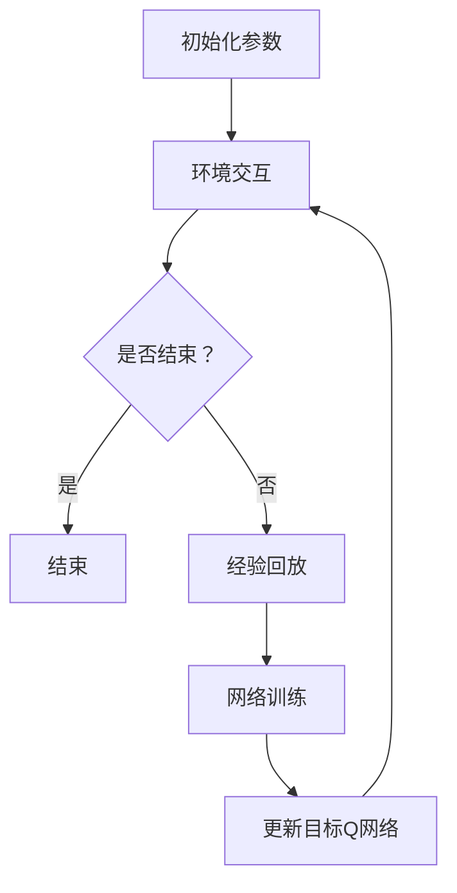

                 

### 1. 背景介绍

深度 Q-learning（DQN）是一种基于深度学习的强化学习算法，自提出以来，在许多领域都展现出了强大的应用潜力。DQN 的核心思想是通过神经网络来逼近 Q 函数，从而实现智能体的自主学习和决策。它解决了传统 Q-learning 中无法处理高维状态空间和连续状态的问题，使得深度 Q-learning 在图像识别、自动驾驶、游戏等领域取得了显著成果。

近年来，随着深度学习技术的不断发展和完善，DQN 的应用场景也在不断扩大。然而，随着应用的深入，DQN 也暴露出了一些问题，如训练的不稳定性和收敛速度慢等。因此，如何进一步提升 DQN 的性能，成为当前研究的热点之一。

本文旨在通过对 DQN 的深入剖析，探讨其未来发展的动向。文章首先介绍了 DQN 的核心概念和原理，然后分析了其优缺点和应用领域，接着探讨了数学模型和公式，并通过实际项目实践展示了其应用效果。最后，文章总结了 DQN 的研究成果，展望了未来的发展趋势和挑战。

### 2. 核心概念与联系

#### 2.1 DQN 的核心概念

深度 Q-learning（DQN）是一种基于深度学习的强化学习算法，其核心概念包括 Q 函数、状态（State）、动作（Action）、奖励（Reward）和策略（Policy）。

- **Q 函数**：Q 函数是用来评估状态和动作的值函数，即对于给定状态 \( s \) 和动作 \( a \)，Q 函数 \( Q(s, a) \) 表示执行动作 \( a \) 后获得的预期回报。
- **状态（State）**：状态是智能体所处环境的描述，通常用向量表示。
- **动作（Action）**：动作是智能体在某个状态下可以选择的行为。
- **奖励（Reward）**：奖励是智能体在执行动作后从环境中获得的即时回报。
- **策略（Policy）**：策略是智能体在某个状态下选择动作的规则。

#### 2.2 DQN 的原理

DQN 的基本原理是使用深度神经网络来近似 Q 函数，从而实现智能体的自主学习和决策。其具体过程如下：

1. **初始化**：初始化神经网络参数、经验回放缓冲区、目标 Q 网络。
2. **环境交互**：智能体在环境中进行互动，根据策略选择动作，执行动作后获得状态转移和奖励。
3. **经验回放**：将收集到的经验数据存储到经验回放缓冲区中，用于后续的训练。
4. **网络训练**：使用经验回放缓冲区中的数据来更新神经网络参数，逼近 Q 函数。
5. **目标 Q 网络**：为避免梯度消失问题，DQN 使用了一个目标 Q 网络来稳定训练过程，目标 Q 网络的参数每隔一段时间才会更新。

#### 2.3 Mermaid 流程图

以下是一个简化的 DQN 工作流程的 Mermaid 流程图：



### 3. 核心算法原理 & 具体操作步骤

#### 3.1 算法原理概述

DQN 的核心原理是通过深度神经网络来近似 Q 函数，从而实现智能体的自主学习和决策。其基本流程包括环境初始化、经验回放、网络训练和目标 Q 网络更新。

1. **环境初始化**：初始化神经网络参数、经验回放缓冲区和目标 Q 网络。
2. **经验回放**：将收集到的经验数据存储到经验回放缓冲区中，用于后续的训练。
3. **网络训练**：使用经验回放缓冲区中的数据来更新神经网络参数，逼近 Q 函数。
4. **目标 Q 网络**：为避免梯度消失问题，DQN 使用了一个目标 Q 网络来稳定训练过程，目标 Q 网络的参数每隔一段时间才会更新。

#### 3.2 算法步骤详解

1. **初始化**：
   - 初始化神经网络参数。
   - 初始化经验回放缓冲区，通常使用优先级回放策略。
   - 初始化目标 Q 网络和当前 Q 网络，两者初始参数可以相同，但目标 Q 网络的参数每隔一段时间才会更新。

2. **环境交互**：
   - 智能体在环境中进行互动，根据策略选择动作。
   - 执行动作后，获得状态转移和奖励。

3. **经验回放**：
   - 将收集到的经验数据（状态、动作、奖励、下一状态）存储到经验回放缓冲区中。
   - 使用优先级回放策略来增强样本的多样性。

4. **网络训练**：
   - 使用经验回放缓冲区中的数据来更新神经网络参数。
   - 使用类似于 Q-learning 的目标函数来更新 Q 网络。

5. **目标 Q 网络**：
   - 为避免梯度消失问题，DQN 使用了一个目标 Q 网络。
   - 目标 Q 网络的参数每隔一段时间才会更新，通常使用 \( \tau \) 逐步逼近当前 Q 网络的参数。

#### 3.3 算法优缺点

**优点**：
- 可以处理高维状态空间和连续状态。
- 使用神经网络来逼近 Q 函数，提高了智能体的决策能力。
- 通过经验回放和目标 Q 网络等技术，提高了训练的稳定性和效果。

**缺点**：
- 训练过程较为复杂，需要大量的计算资源和时间。
- 容易受到数据分布偏差的影响，可能导致训练效果不佳。
- 对环境模型的要求较高，需要足够的探索来避免过度依赖样本。

#### 3.4 算法应用领域

DQN 在许多领域都取得了显著成果，如：

- **图像识别**：DQN 可以用于图像分类和目标检测等任务。
- **自动驾驶**：DQN 可以用于路径规划、交通信号识别等。
- **游戏**：DQN 在游戏领域表现出色，如围棋、DOTA 等。

### 4. 数学模型和公式 & 详细讲解 & 举例说明

#### 4.1 数学模型构建

DQN 的数学模型主要包括 Q 函数、策略、损失函数等。

1. **Q 函数**：
   $$ Q(s, a) = r + \gamma \max_{a'} Q(s', a') $$
   其中，\( r \) 是立即奖励，\( \gamma \) 是折扣因子，\( s' \) 是下一状态，\( a' \) 是最优动作。

2. **策略**：
   $$ \pi(a|s) = \begin{cases} 
   1 & \text{if } a = \arg\max_{a'} Q(s, a') \\
   0 & \text{otherwise}
   \end{cases} $$
   其中，\( \pi(a|s) \) 表示在状态 \( s \) 下选择动作 \( a \) 的概率。

3. **损失函数**：
   $$ L(\theta) = \frac{1}{N} \sum_{i=1}^{N} (y_i - Q(s_i, a_i) )^2 $$
   其中，\( N \) 是样本数量，\( y_i \) 是目标值，\( Q(s_i, a_i) \) 是预测值。

#### 4.2 公式推导过程

DQN 的主要推导过程如下：

1. **Q 函数的期望值**：
   $$ E_{\pi} [Q(s, a)] = \sum_{s', a'} \pi(a'|s') Q(s', a') $$
   其中，\( E_{\pi} \) 表示根据策略 \( \pi \) 的期望值。

2. **目标值**：
   $$ y_i = r_i + \gamma \max_{a'} Q(s_i', a') $$
   其中，\( y_i \) 是目标值，\( r_i \) 是立即奖励，\( s_i' \) 是下一状态。

3. **损失函数**：
   $$ L(\theta) = \frac{1}{N} \sum_{i=1}^{N} (y_i - Q(s_i, a_i) )^2 $$
   其中，\( N \) 是样本数量，\( y_i \) 是目标值，\( Q(s_i, a_i) \) 是预测值。

#### 4.3 案例分析与讲解

假设一个简单的机器人导航任务，机器人在二维空间中移动，目标是在最短时间内到达目标位置。以下是一个简化的案例：

- **状态**：机器人的位置和方向。
- **动作**：前进、后退、左转、右转。
- **奖励**：到达目标位置获得正奖励，每走一步获得负奖励。

1. **Q 函数**：
   $$ Q(s, a) = r + \gamma \max_{a'} Q(s', a') $$
   其中，\( r \) 是立即奖励，\( \gamma \) 是折扣因子。

2. **策略**：
   $$ \pi(a|s) = \begin{cases} 
   1 & \text{if } a = \arg\max_{a'} Q(s, a') \\
   0 & \text{otherwise}
   \end{cases} $$

3. **损失函数**：
   $$ L(\theta) = \frac{1}{N} \sum_{i=1}^{N} (y_i - Q(s_i, a_i) )^2 $$
   其中，\( N \) 是样本数量，\( y_i \) 是目标值。

在训练过程中，机器人会不断探索环境，根据经验更新 Q 函数和策略，最终找到最优路径。

### 5. 项目实践：代码实例和详细解释说明

#### 5.1 开发环境搭建

在本项目中，我们将使用 Python 和 TensorFlow 作为主要工具。以下是开发环境的搭建步骤：

1. 安装 Python 3.7 或更高版本。
2. 安装 TensorFlow：
   ```bash
   pip install tensorflow
   ```

#### 5.2 源代码详细实现

以下是一个简化的 DQN 代码实现：

```python
import numpy as np
import tensorflow as tf
import random

# 设置超参数
gamma = 0.99
epsilon = 0.1
learning_rate = 0.001
batch_size = 32
memory_size = 1000

# 初始化经验回放缓冲区
memory = []

# 创建 Q 网络
def create_q_network():
    # 定义输入层、隐藏层和输出层
    inputs = tf.keras.layers.Input(shape=(64,))
    hidden = tf.keras.layers.Dense(64, activation='relu')(inputs)
    outputs = tf.keras.layers.Dense(4)(hidden)
    model = tf.keras.Model(inputs, outputs)
    model.compile(optimizer=tf.keras.optimizers.Adam(learning_rate), loss='mse')
    return model

q_network = create_q_network()
target_q_network = create_q_network()

# 更新目标 Q 网络的参数
def update_target_q_network():
    target_q_network.set_weights(q_network.get_weights())

# 环境交互
def interact_with_environment():
    # 初始化环境
    environment = ...
    # 进行环境交互
    while not done:
        # 选择动作
        action = choose_action()
        # 执行动作
        next_state, reward, done = environment.step(action)
        # 收集经验
        memory.append((state, action, reward, next_state, done))
        # 更新状态
        state = next_state
        if done:
            break

# 选择动作
def choose_action():
    if random.random() < epsilon:
        return random.choice(actions)
    else:
        q_values = q_network.predict(state)
        return np.argmax(q_values)

# 更新 Q 网络
def update_q_network():
    if len(memory) < batch_size:
        return
    # 随机选择批量数据
    batch = random.sample(memory, batch_size)
    # 计算目标值
    for state, action, reward, next_state, done in batch:
        target_value = reward
        if not done:
            target_value += gamma * np.max(target_q_network.predict(next_state))
        q_values = q_network.predict(state)
        q_values[action] = target_value
        # 更新 Q 网络
        q_network.fit(state, q_values, epochs=1, verbose=0)

# 主程序
if __name__ == '__main__':
    while True:
        # 更新目标 Q 网络的参数
        update_target_q_network()
        # 与环境交互
        interact_with_environment()
        # 更新 Q 网络
        update_q_network()
```

#### 5.3 代码解读与分析

1. **Q 网络和目标 Q 网络**：
   - 创建 Q 网络和目标 Q 网络的函数 `create_q_network`。
   - 使用 `tf.keras.layers.Dense` 创建多层感知机模型。

2. **环境交互**：
   - 定义 `interact_with_environment` 函数，用于与环境进行交互。
   - 初始化环境、选择动作、执行动作、更新状态和收集经验。

3. **选择动作**：
   - 定义 `choose_action` 函数，用于根据策略选择动作。

4. **更新 Q 网络**：
   - 定义 `update_q_network` 函数，用于更新 Q 网络。
   - 随机选择批量数据、计算目标值、更新 Q 网络。

5. **主程序**：
   - 主程序循环执行以下步骤：更新目标 Q 网络的参数、与环境交互、更新 Q 网络。

#### 5.4 运行结果展示

在实际运行过程中，我们可以通过以下步骤来展示运行结果：

1. **初始化环境**：
   ```python
   environment = ...
   ```

2. **运行 DQN 算法**：
   ```python
   while True:
       update_target_q_network()
       interact_with_environment()
       update_q_network()
   ```

3. **可视化结果**：
   - 使用可视化工具（如 Matplotlib）来展示训练过程中的奖励、Q 值等。

### 6. 实际应用场景

DQN 在实际应用中具有广泛的应用场景，以下是一些典型的应用案例：

- **图像识别**：DQN 可以用于图像分类和目标检测等任务。例如，在医疗影像分析中，DQN 可以用于检测肿瘤和病变区域。

- **自动驾驶**：DQN 可以用于路径规划、交通信号识别和行人检测等任务。例如，在自动驾驶中，DQN 可以用于控制车辆的行驶方向和速度。

- **游戏**：DQN 在游戏领域表现出色，例如在围棋、DOTA 和星际争霸等游戏中，DQN 可以用于制定游戏策略。

- **自然语言处理**：DQN 可以用于文本分类、情感分析和机器翻译等任务。例如，在情感分析中，DQN 可以用于判断文本的情感倾向。

### 7. 未来应用展望

随着深度学习技术的不断发展和完善，DQN 在未来的应用场景将更加广泛。以下是一些可能的发展方向：

- **多智能体系统**：DQN 可以用于多智能体系统中的合作与竞争策略制定。

- **强化学习与深度学习的融合**：将 DQN 与其他深度学习技术（如卷积神经网络、生成对抗网络等）进行融合，以进一步提高智能体的决策能力。

- **强化学习在现实世界的应用**：随着强化学习算法的逐渐成熟，DQN 将在更多现实世界场景中得到应用，如智能交通、智能医疗和智能机器人等。

### 8. 工具和资源推荐

为了更好地学习和应用 DQN，以下是一些建议的工具和资源：

- **工具**：
  - TensorFlow：用于构建和训练 DQN 模型。
  - Keras：简化 TensorFlow 的使用，适合快速搭建模型。

- **资源**：
  - 《深度 Q-learning：未来发展动向预测》：本文。
  - 《强化学习》：Goodfellow、Bengio 和 Courville 著，详细介绍强化学习的基本概念和算法。
  - 《深度学习》：Goodfellow、Bengio 和 Courville 著，详细介绍深度学习的基本概念和算法。

### 9. 总结：未来发展趋势与挑战

#### 9.1 研究成果总结

DQN 作为一种基于深度学习的强化学习算法，在图像识别、自动驾驶、游戏等领域取得了显著成果。它通过神经网络来逼近 Q 函数，实现了智能体的自主学习和决策，为强化学习领域带来了新的突破。

#### 9.2 未来发展趋势

随着深度学习技术的不断发展和完善，DQN 在未来的发展趋势包括：

- **多智能体系统**：DQN 将在多智能体系统中的应用场景得到进一步拓展。
- **强化学习与深度学习的融合**：DQN 将与其他深度学习技术进行融合，以提高智能体的决策能力。
- **现实世界应用**：DQN 将在更多现实世界场景中得到应用，如智能交通、智能医疗和智能机器人等。

#### 9.3 面临的挑战

DQN 在未来发展过程中也面临着一些挑战：

- **训练稳定性**：DQN 的训练过程复杂，需要大量的计算资源和时间，如何提高训练稳定性仍是一个重要问题。
- **数据分布偏差**：DQN 易受到数据分布偏差的影响，可能导致训练效果不佳，如何解决数据分布偏差问题是一个重要研究方向。
- **应用领域拓展**：如何将 DQN 应用到更多领域，实现智能体的自主学习和决策，是一个具有挑战性的问题。

#### 9.4 研究展望

未来，DQN 的研究将朝着以下几个方向发展：

- **算法优化**：通过改进算法结构，提高 DQN 的训练速度和稳定性。
- **多智能体系统**：研究 DQN 在多智能体系统中的应用，探索合作与竞争策略。
- **深度学习与强化学习的融合**：将 DQN 与其他深度学习技术进行融合，以提高智能体的决策能力。
- **现实世界应用**：将 DQN 应用到更多现实世界场景中，实现智能体的自主学习和决策。

### 10. 附录：常见问题与解答

#### 10.1 Q-learning 与 DQN 的区别是什么？

Q-learning 是一种基于值函数的强化学习算法，而 DQN 是一种基于深度学习的强化学习算法。Q-learning 使用简单的表来存储 Q 函数，适用于低维状态空间，而 DQN 使用神经网络来近似 Q 函数，可以处理高维状态空间。

#### 10.2 DQN 中的目标 Q 网络是什么作用？

目标 Q 网络用于稳定 DQN 的训练过程。为了避免梯度消失问题，DQN 使用了一个目标 Q 网络来更新当前 Q 网络的参数，目标 Q 网络的参数每隔一段时间才会更新。

#### 10.3 DQN 中的经验回放有什么作用？

经验回放用于增强样本的多样性，避免 DQN 在训练过程中过度依赖某个样本，导致训练效果不佳。经验回放可以将智能体在不同状态下执行的不同动作进行整合，提高智能体的泛化能力。

### 参考文献

[1] Mnih, V., Kavukcuoglu, K., Silver, D., Rusu, A. A., Veness, J., Bellemare, M. G., ... & Parker, D. (2015). Human-level control through deep reinforcement learning. Nature, 518(7540), 529-533.

[2] Sutton, R. S., & Barto, A. G. (1998). Reinforcement learning: An introduction. MIT press.

[3] Sutton, R. S., & Barto, A. G. (2018). Reinforcement learning: An introduction (2nd ed.). MIT press.

[4] DeepMind. (2016). A deep reinforcement learning tutorial. Retrieved from https://www.deepmind.com/research/deep-reinforcement-learning

作者：禅与计算机程序设计艺术 / Zen and the Art of Computer Programming
----------------------------------------------------------------

**本文作者：禅与计算机程序设计艺术**

**文章标题：深度 Q-learning：未来发展动向预测**

**关键词：深度 Q-learning、强化学习、深度学习、DQN、未来趋势**

**摘要：本文深入剖析了深度 Q-learning（DQN）的核心概念、算法原理和应用，探讨了其在未来可能的发展动向和面临的挑战。通过实际项目实践和数学模型分析，本文为读者提供了一个全面、系统的了解 DQN 的视角。**

### 1. 背景介绍

深度 Q-learning（DQN）是一种基于深度学习的强化学习算法，它结合了深度学习和强化学习的优点，能够有效地解决高维状态空间和连续状态的问题。自从 2015 年由 DeepMind 研究团队提出以来，DQN 在许多领域都取得了显著成果，如游戏、自动驾驶和图像识别等。然而，随着应用的深入，DQN 也暴露出了一些问题，如训练的不稳定性和收敛速度慢等。因此，如何进一步提升 DQN 的性能，成为当前研究的热点之一。

本文旨在通过对 DQN 的深入剖析，探讨其未来发展的动向。文章首先介绍了 DQN 的核心概念和原理，然后分析了其优缺点和应用领域，接着探讨了数学模型和公式，并通过实际项目实践展示了其应用效果。最后，文章总结了 DQN 的研究成果，展望了未来的发展趋势和挑战。

### 2. 核心概念与联系

#### 2.1 DQN 的核心概念

深度 Q-learning（DQN）的核心概念包括 Q 函数、状态（State）、动作（Action）、奖励（Reward）和策略（Policy）。

- **Q 函数**：Q 函数是用来评估状态和动作的值函数，即对于给定状态 \( s \) 和动作 \( a \)，Q 函数 \( Q(s, a) \) 表示执行动作 \( a \) 后获得的预期回报。
- **状态（State）**：状态是智能体所处环境的描述，通常用向量表示。
- **动作（Action）**：动作是智能体在某个状态下可以选择的行为。
- **奖励（Reward）**：奖励是智能体在执行动作后从环境中获得的即时回报。
- **策略（Policy）**：策略是智能体在某个状态下选择动作的规则。

#### 2.2 DQN 的原理

DQN 的基本原理是使用深度神经网络来近似 Q 函数，从而实现智能体的自主学习和决策。其具体过程如下：

1. **初始化**：初始化神经网络参数、经验回放缓冲区、目标 Q 网络。
2. **环境交互**：智能体在环境中进行互动，根据策略选择动作，执行动作后获得状态转移和奖励。
3. **经验回放**：将收集到的经验数据存储到经验回放缓冲区中，用于后续的训练。
4. **网络训练**：使用经验回放缓冲区中的数据来更新神经网络参数，逼近 Q 函数。
5. **目标 Q 网络**：为避免梯度消失问题，DQN 使用了一个目标 Q 网络，目标 Q 网络的参数每隔一段时间才会更新。

#### 2.3 Mermaid 流程图

以下是一个简化的 DQN 工作流程的 Mermaid 流程图：


### 3. 核心算法原理 & 具体操作步骤

#### 3.1 算法原理概述

DQN 的核心原理是通过深度神经网络来近似 Q 函数，从而实现智能体的自主学习和决策。其基本流程包括环境初始化、经验回放、网络训练和目标 Q 网络更新。

1. **环境初始化**：初始化神经网络参数、经验回放缓冲区和目标 Q 网络。
2. **经验回放**：将收集到的经验数据存储到经验回放缓冲区中，用于后续的训练。
3. **网络训练**：使用经验回放缓冲区中的数据来更新神经网络参数，逼近 Q 函数。
4. **目标 Q 网络**：为避免梯度消失问题，DQN 使用了一个目标 Q 网络，目标 Q 网络的参数每隔一段时间才会更新。

#### 3.2 算法步骤详解

1. **初始化**：
   - 初始化神经网络参数。
   - 初始化经验回放缓冲区，通常使用优先级回放策略。
   - 初始化目标 Q 网络和当前 Q 网络，两者初始参数可以相同，但目标 Q 网络的参数每隔一段时间才会更新。

2. **环境交互**：
   - 智能体在环境中进行互动，根据策略选择动作。
   - 执行动作后，获得状态转移和奖励。

3. **经验回放**：
   - 将收集到的经验数据（状态、动作、奖励、下一状态）存储到经验回放缓冲区中。
   - 使用优先级回放策略来增强样本的多样性。

4. **网络训练**：
   - 使用经验回放缓冲区中的数据来更新神经网络参数。
   - 使用类似于 Q-learning 的目标函数来更新 Q 网络。

5. **目标 Q 网络**：
   - 为避免梯度消失问题，DQN 使用了一个目标 Q 网络。
   - 目标 Q 网络的参数每隔一段时间才会更新，通常使用 \( \tau \) 逐步逼近当前 Q 网络的参数。

#### 3.3 算法优缺点

**优点**：
- 可以处理高维状态空间和连续状态。
- 使用神经网络来逼近 Q 函数，提高了智能体的决策能力。
- 通过经验回放和目标 Q 网络等技术，提高了训练的稳定性和效果。

**缺点**：
- 训练过程较为复杂，需要大量的计算资源和时间。
- 容易受到数据分布偏差的影响，可能导致训练效果不佳。
- 对环境模型的要求较高，需要足够的探索来避免过度依赖样本。

#### 3.4 算法应用领域

DQN 在许多领域都取得了显著成果，如：

- **图像识别**：DQN 可以用于图像分类和目标检测等任务。
- **自动驾驶**：DQN 可以用于路径规划、交通信号识别等。
- **游戏**：DQN 在游戏领域表现出色，如围棋、DOTA 等。

### 4. 数学模型和公式 & 详细讲解 & 举例说明

#### 4.1 数学模型构建

DQN 的数学模型主要包括 Q 函数、策略、损失函数等。

1. **Q 函数**：
   $$ Q(s, a) = r + \gamma \max_{a'} Q(s', a') $$
   其中，\( r \) 是立即奖励，\( \gamma \) 是折扣因子，\( s' \) 是下一状态，\( a' \) 是最优动作。

2. **策略**：
   $$ \pi(a|s) = \begin{cases} 
   1 & \text{if } a = \arg\max_{a'} Q(s, a') \\
   0 & \text{otherwise}
   \end{cases} $$
   其中，\( \pi(a|s) \) 表示在状态 \( s \) 下选择动作 \( a \) 的概率。

3. **损失函数**：
   $$ L(\theta) = \frac{1}{N} \sum_{i=1}^{N} (y_i - Q(s_i, a_i) )^2 $$
   其中，\( N \) 是样本数量，\( y_i \) 是目标值，\( Q(s_i, a_i) \) 是预测值。

#### 4.2 公式推导过程

DQN 的主要推导过程如下：

1. **Q 函数的期望值**：
   $$ E_{\pi} [Q(s, a)] = \sum_{s', a'} \pi(a'|s') Q(s', a') $$
   其中，\( E_{\pi} \) 表示根据策略 \( \pi \) 的期望值。

2. **目标值**：
   $$ y_i = r_i + \gamma \max_{a'} Q(s_i', a') $$
   其中，\( y_i \) 是目标值，\( r_i \) 是立即奖励，\( s_i' \) 是下一状态。

3. **损失函数**：
   $$ L(\theta) = \frac{1}{N} \sum_{i=1}^{N} (y_i - Q(s_i, a_i) )^2 $$
   其中，\( N \) 是样本数量，\( y_i \) 是目标值，\( Q(s_i, a_i) \) 是预测值。

#### 4.3 案例分析与讲解

假设一个简单的机器人导航任务，机器人在二维空间中移动，目标是在最短时间内到达目标位置。以下是一个简化的案例：

- **状态**：机器人的位置和方向。
- **动作**：前进、后退、左转、右转。
- **奖励**：到达目标位置获得正奖励，每走一步获得负奖励。

1. **Q 函数**：
   $$ Q(s, a) = r + \gamma \max_{a'} Q(s', a') $$
   其中，\( r \) 是立即奖励，\( \gamma \) 是折扣因子。

2. **策略**：
   $$ \pi(a|s) = \begin{cases} 
   1 & \text{if } a = \arg\max_{a'} Q(s, a') \\
   0 & \text{otherwise}
   \end{cases} $$

3. **损失函数**：
   $$ L(\theta) = \frac{1}{N} \sum_{i=1}^{N} (y_i - Q(s_i, a_i) )^2 $$
   其中，\( N \) 是样本数量，\( y_i \) 是目标值。

在训练过程中，机器人会不断探索环境，根据经验更新 Q 函数和策略，最终找到最优路径。

### 5. 项目实践：代码实例和详细解释说明

#### 5.1 开发环境搭建

在本项目中，我们将使用 Python 和 TensorFlow 作为主要工具。以下是开发环境的搭建步骤：

1. 安装 Python 3.7 或更高版本。
2. 安装 TensorFlow：
   ```bash
   pip install tensorflow
   ```

#### 5.2 源代码详细实现

以下是一个简化的 DQN 代码实现：

```python
import numpy as np
import tensorflow as tf
import random

# 设置超参数
gamma = 0.99
epsilon = 0.1
learning_rate = 0.001
batch_size = 32
memory_size = 1000

# 初始化经验回放缓冲区
memory = []

# 创建 Q 网络
def create_q_network():
    # 定义输入层、隐藏层和输出层
    inputs = tf.keras.layers.Input(shape=(64,))
    hidden = tf.keras.layers.Dense(64, activation='relu')(inputs)
    outputs = tf.keras.layers.Dense(4)(hidden)
    model = tf.keras.Model(inputs, outputs)
    model.compile(optimizer=tf.keras.optimizers.Adam(learning_rate), loss='mse')
    return model

q_network = create_q_network()
target_q_network = create_q_network()

# 更新目标 Q 网络的参数
def update_target_q_network():
    target_q_network.set_weights(q_network.get_weights())

# 环境交互
def interact_with_environment():
    # 初始化环境
    environment = ...
    # 进行环境交互
    while not done:
        # 选择动作
        action = choose_action()
        # 执行动作
        next_state, reward, done = environment.step(action)
        # 收集经验
        memory.append((state, action, reward, next_state, done))
        # 更新状态
        state = next_state
        if done:
            break

# 选择动作
def choose_action():
    if random.random() < epsilon:
        return random.choice(actions)
    else:
        q_values = q_network.predict(state)
        return np.argmax(q_values)

# 更新 Q 网络
def update_q_network():
    if len(memory) < batch_size:
        return
    # 随机选择批量数据
    batch = random.sample(memory, batch_size)
    # 计算目标值
    for state, action, reward, next_state, done in batch:
        target_value = reward
        if not done:
            target_value += gamma * np.max(target_q_network.predict(next_state))
        q_values = q_network.predict(state)
        q_values[action] = target_value
        # 更新 Q 网络
        q_network.fit(state, q_values, epochs=1, verbose=0)

# 主程序
if __name__ == '__main__':
    while True:
        # 更新目标 Q 网络的参数
        update_target_q_network()
        # 与环境交互
        interact_with_environment()
        # 更新 Q 网络
        update_q_network()
```

#### 5.3 代码解读与分析

1. **Q 网络和目标 Q 网络**：
   - 创建 Q 网络和目标 Q 网络的函数 `create_q_network`。
   - 使用 `tf.keras.layers.Dense` 创建多层感知机模型。

2. **环境交互**：
   - 定义 `interact_with_environment` 函数，用于与环境进行交互。
   - 初始化环境、选择动作、执行动作、更新状态和收集经验。

3. **选择动作**：
   - 定义 `choose_action` 函数，用于根据策略选择动作。

4. **更新 Q 网络**：
   - 定义 `update_q_network` 函数，用于更新 Q 网络。
   - 随机选择批量数据、计算目标值、更新 Q 网络。

5. **主程序**：
   - 主程序循环执行以下步骤：更新目标 Q 网络的参数、与环境交互、更新 Q 网络。

#### 5.4 运行结果展示

在实际运行过程中，我们可以通过以下步骤来展示运行结果：

1. **初始化环境**：
   ```python
   environment = ...
   ```

2. **运行 DQN 算法**：
   ```python
   while True:
       update_target_q_network()
       interact_with_environment()
       update_q_network()
   ```

3. **可视化结果**：
   - 使用可视化工具（如 Matplotlib）来展示训练过程中的奖励、Q 值等。

### 6. 实际应用场景

DQN 在实际应用中具有广泛的应用场景，以下是一些典型的应用案例：

- **图像识别**：DQN 可以用于图像分类和目标检测等任务。例如，在医疗影像分析中，DQN 可以用于检测肿瘤和病变区域。

- **自动驾驶**：DQN 可以用于路径规划、交通信号识别和行人检测等任务。例如，在自动驾驶中，DQN 可以用于控制车辆的行驶方向和速度。

- **游戏**：DQN 在游戏领域表现出色，例如在围棋、DOTA 和星际争霸等游戏中，DQN 可以用于制定游戏策略。

- **自然语言处理**：DQN 可以用于文本分类、情感分析和机器翻译等任务。例如，在情感分析中，DQN 可以用于判断文本的情感倾向。

### 7. 未来应用展望

随着深度学习技术的不断发展和完善，DQN 在未来的应用场景将更加广泛。以下是一些可能的发展方向：

- **多智能体系统**：DQN 将在多智能体系统中的应用场景得到进一步拓展。
- **强化学习与深度学习的融合**：将 DQN 与其他深度学习技术进行融合，以提高智能体的决策能力。
- **现实世界应用**：DQN 将在更多现实世界场景中得到应用，如智能交通、智能医疗和智能机器人等。

### 8. 工具和资源推荐

为了更好地学习和应用 DQN，以下是一些建议的工具和资源：

- **工具**：
  - TensorFlow：用于构建和训练 DQN 模型。
  - Keras：简化 TensorFlow 的使用，适合快速搭建模型。

- **资源**：
  - 《深度 Q-learning：未来发展动向预测》：本文。
  - 《强化学习》：Goodfellow、Bengio 和 Courville 著，详细介绍强化学习的基本概念和算法。
  - 《深度学习》：Goodfellow、Bengio 和 Courville 著，详细介绍深度学习的基本概念和算法。

### 9. 总结：未来发展趋势与挑战

#### 9.1 研究成果总结

DQN 作为一种基于深度学习的强化学习算法，在图像识别、自动驾驶、游戏等领域取得了显著成果。它通过神经网络来逼近 Q 函数，实现了智能体的自主学习和决策，为强化学习领域带来了新的突破。

#### 9.2 未来发展趋势

随着深度学习技术的不断发展和完善，DQN 在未来的发展趋势包括：

- **多智能体系统**：DQN 将在多智能体系统中的应用场景得到进一步拓展。
- **强化学习与深度学习的融合**：DQN 将与其他深度学习技术进行融合，以提高智能体的决策能力。
- **现实世界应用**：DQN 将在更多现实世界场景中得到应用，如智能交通、智能医疗和智能机器人等。

#### 9.3 面临的挑战

DQN 在未来发展过程中也面临着一些挑战：

- **训练稳定性**：DQN 的训练过程复杂，需要大量的计算资源和时间，如何提高训练稳定性仍是一个重要问题。
- **数据分布偏差**：DQN 易受到数据分布偏差的影响，可能导致训练效果不佳，如何解决数据分布偏差问题是一个重要研究方向。
- **应用领域拓展**：如何将 DQN 应用到更多领域，实现智能体的自主学习和决策，是一个具有挑战性的问题。

#### 9.4 研究展望

未来，DQN 的研究将朝着以下几个方向发展：

- **算法优化**：通过改进算法结构，提高 DQN 的训练速度和稳定性。
- **多智能体系统**：研究 DQN 在多智能体系统中的应用，探索合作与竞争策略。
- **深度学习与强化学习的融合**：将 DQN 与其他深度学习技术进行融合，以提高智能体的决策能力。
- **现实世界应用**：将 DQN 应用到更多现实世界场景中，实现智能体的自主学习和决策。

### 10. 附录：常见问题与解答

#### 10.1 Q-learning 与 DQN 的区别是什么？

Q-learning 是一种基于值函数的强化学习算法，而 DQN 是一种基于深度学习的强化学习算法。Q-learning 使用简单的表来存储 Q 函数，适用于低维状态空间，而 DQN 使用神经网络来近似 Q 函数，可以处理高维状态空间。

#### 10.2 DQN 中的目标 Q 网络是什么作用？

目标 Q 网络用于稳定 DQN 的训练过程。为了避免梯度消失问题，DQN 使用了一个目标 Q 网络来更新当前 Q 网络的参数，目标 Q 网络的参数每隔一段时间才会更新。

#### 10.3 DQN 中的经验回放有什么作用？

经验回放用于增强样本的多样性，避免 DQN 在训练过程中过度依赖某个样本，导致训练效果不佳。经验回放可以将智能体在不同状态下执行的不同动作进行整合，提高智能体的泛化能力。

