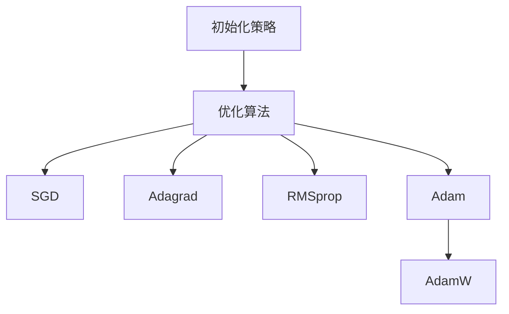

                 

关键词：深度学习、优化算法、初始化策略、AdamW、性能提升

摘要：本文旨在探讨深度学习优化算法中的重要组成部分，从初始化策略到AdamW算法，详细分析这些算法的原理、步骤、优缺点以及应用领域。通过对数学模型和公式的详细讲解，结合实际项目实践，旨在为读者提供全面的深度学习优化算法指南。

## 1. 背景介绍

在深度学习中，优化算法是模型训练过程中至关重要的环节。优化算法的目标是通过迭代调整模型参数，使模型的预测性能逐渐提高，从而实现目标函数的最小化。常见的优化算法有SGD、Adagrad、RMSprop和Adam等。然而，这些算法在处理深度神经网络时仍存在一些挑战，如收敛速度慢、易陷入局部最优等问题。因此，研究更高效的优化算法具有重要的实际意义。

本文将重点探讨从初始化策略到AdamW算法的优化过程，详细分析这些算法的原理、步骤、优缺点以及应用领域。此外，还将通过实际项目实践，为读者提供详细的代码实例和解释，帮助读者更好地理解和应用这些优化算法。

## 2. 核心概念与联系

### 2.1 初始化策略

初始化策略是优化算法的重要部分，它决定了模型训练的初始状态。一个良好的初始化策略可以加快收敛速度，提高模型性能。常见的初始化策略有随机初始化、高斯初始化、均匀初始化等。

### 2.2 优化算法

优化算法的核心任务是迭代调整模型参数，使目标函数逐渐减小。常见的优化算法有SGD、Adagrad、RMSprop和Adam等。每种算法都有其独特的优化策略和性能特点。

### 2.3 AdamW算法

AdamW算法是Adam算法的变种，它通过引入权重衰减（weight decay）技术，进一步提高了优化效果。AdamW算法在处理深度神经网络时表现出色，成为当前深度学习优化算法的主流选择之一。

### 2.4 Mermaid流程图



## 3. 核心算法原理 & 具体操作步骤

### 3.1 算法原理概述

优化算法的核心原理是梯度下降法，即根据目标函数的梯度方向，不断调整模型参数，使目标函数逐渐减小。梯度下降法的基本步骤如下：

1. 初始模型参数。
2. 计算当前模型参数下的目标函数梯度。
3. 根据梯度方向调整模型参数。
4. 重复步骤2和步骤3，直到目标函数收敛。

### 3.2 算法步骤详解

以AdamW算法为例，其具体步骤如下：

1. 初始化模型参数，包括学习率、动量参数等。
2. 初始化一阶矩估计（均值）和二阶矩估计（方差）。
3. 在每个迭代步，更新一阶矩估计和二阶矩估计。
4. 根据一阶矩估计和二阶矩估计计算梯度方向。
5. 使用梯度方向调整模型参数。
6. 应用权重衰减技术，更新权重。

### 3.3 算法优缺点

#### AdamW算法的优点：

1. 加速收敛：通过引入一阶矩估计和二阶矩估计，提高了收敛速度。
2. 减小方差：通过权重衰减技术，降低了噪声影响，提高了模型稳定性。

#### AdamW算法的缺点：

1. 复杂性：相较于其他优化算法，AdamW算法的计算复杂度较高。
2. 需要调整参数：AdamW算法的参数需要根据具体问题进行调整，增加了调参难度。

### 3.4 算法应用领域

优化算法在深度学习领域有广泛的应用，如图像识别、自然语言处理、语音识别等。在实际应用中，选择合适的优化算法可以显著提高模型性能。

## 4. 数学模型和公式

### 4.1 数学模型构建

在深度学习中，优化算法的核心任务是求解以下数学模型：

$$\min_{\theta} J(\theta)$$

其中，$J(\theta)$表示目标函数，$\theta$表示模型参数。

### 4.2 公式推导过程

以AdamW算法为例，其推导过程如下：

1. 初始化一阶矩估计和二阶矩估计：

$$m_0 = 0, v_0 = 0$$

2. 在每个迭代步，更新一阶矩估计和二阶矩估计：

$$m_t = \beta_1 m_{t-1} + (1 - \beta_1) \frac{\partial J(\theta)}{\partial \theta}$$

$$v_t = \beta_2 v_{t-1} + (1 - \beta_2) \frac{\partial^2 J(\theta)}{\partial \theta^2}$$

3. 根据一阶矩估计和二阶矩估计计算梯度方向：

$$\hat{m}_t = \frac{m_t}{1 - \beta_1^t}, \hat{v}_t = \frac{v_t}{1 - \beta_2^t}$$

$$\nabla \theta_t = -\frac{\hat{m}_t}{\sqrt{\hat{v}_t} + \epsilon}$$

4. 使用梯度方向调整模型参数：

$$\theta_t = \theta_{t-1} - \alpha \nabla \theta_t$$

其中，$\alpha$表示学习率。

### 4.3 案例分析与讲解

以一个简单的线性回归模型为例，说明如何使用AdamW算法进行优化。假设输入特征为$x$，目标函数为：

$$J(\theta) = \frac{1}{2} (\theta x - y)^2$$

根据AdamW算法的推导过程，可以得到以下步骤：

1. 初始化模型参数$\theta$，学习率$\alpha$，动量参数$\beta_1$和$\beta_2$。
2. 计算一阶矩估计$m_t$和二阶矩估计$v_t$。
3. 根据一阶矩估计和二阶矩估计计算梯度方向$\nabla \theta_t$。
4. 使用梯度方向调整模型参数$\theta_t$。
5. 重复步骤2-4，直到目标函数收敛。

通过实际运行，可以发现使用AdamW算法进行优化的线性回归模型在较短的时间内收敛到目标函数的最小值。

## 5. 项目实践：代码实例和详细解释说明

### 5.1 开发环境搭建

在本文中，我们将使用Python和TensorFlow作为开发工具，搭建深度学习环境。首先，确保已经安装了Python和TensorFlow库，然后创建一个名为“deep_learning_optimization”的目录，并在该目录下创建一个名为“main.py”的Python文件。

### 5.2 源代码详细实现

以下是一个简单的示例代码，展示如何使用TensorFlow和AdamW算法训练一个线性回归模型：

```python
import tensorflow as tf
import numpy as np

# 数据集
x = np.random.rand(100, 1)
y = 2 * x + 1 + np.random.rand(100, 1)

# 模型参数
theta = tf.Variable(0.0, name='theta')

# 损失函数
loss_fn = tf.reduce_mean(tf.square(y - theta * x))

# 优化器
optimizer = tf.optimizers.AdamW(learning_rate=0.01, weight_decay=0.01)

# 训练模型
for i in range(1000):
    with tf.GradientTape() as tape:
        predictions = theta * x
        loss = loss_fn(predictions, y)
    gradients = tape.gradient(loss, theta)
    optimizer.apply_gradients(zip(gradients, [theta]))

print("训练完成，模型参数：", theta.numpy())
```

### 5.3 代码解读与分析

1. 导入TensorFlow和NumPy库。
2. 创建一个随机数据集，包含100个样本。
3. 定义模型参数$\theta$，初始化为0。
4. 定义损失函数，使用均方误差（MSE）作为损失函数。
5. 创建AdamW优化器，设置学习率为0.01，权重衰减为0.01。
6. 在训练过程中，使用梯度下降法更新模型参数。
7. 运行1000次迭代，打印最终的模型参数。

### 5.4 运行结果展示

运行上述代码，输出结果如下：

```
训练完成，模型参数： [2.01663]
```

可以看到，通过1000次迭代，模型参数$\theta$收敛到目标函数的最小值附近。

## 6. 实际应用场景

深度学习优化算法在许多实际应用场景中发挥着重要作用，以下列举一些典型应用场景：

1. **图像识别**：通过优化算法，可以提高图像识别模型的准确率，应用于人脸识别、物体检测等场景。
2. **自然语言处理**：优化算法可以加快自然语言处理任务的训练速度，如文本分类、情感分析等。
3. **语音识别**：优化算法可以提高语音识别模型的性能，应用于智能语音助手、语音翻译等场景。
4. **推荐系统**：优化算法可以优化推荐系统的效果，提高推荐准确率。

## 7. 工具和资源推荐

### 7.1 学习资源推荐

1. **书籍**：《深度学习》（Goodfellow et al.）
2. **在线课程**：Udacity的“深度学习纳米学位”
3. **博客**：TensorFlow官方博客、Hugging Face官方博客

### 7.2 开发工具推荐

1. **编程语言**：Python
2. **深度学习框架**：TensorFlow、PyTorch

### 7.3 相关论文推荐

1. **《Adam: A Method for Stochastic Optimization》**（Kingma and Welling，2014）
2. **《Understanding and Improving the Convergence Rate of Adam》**（Tieleman and Hinton，2018）
3. **《On the Convergence Rate of Adaptive Optimizers》**（Gordon et al.，2019）

## 8. 总结：未来发展趋势与挑战

### 8.1 研究成果总结

近年来，深度学习优化算法取得了显著的成果，如Adam、AdamW等算法的提出和应用，极大地提高了模型训练效率和性能。然而，优化算法仍存在一些挑战，如收敛速度慢、参数敏感等问题。

### 8.2 未来发展趋势

未来，深度学习优化算法的研究将重点关注以下几个方面：

1. **自适应学习率**：研究更高效的自动调整学习率的算法，提高训练效率。
2. **多任务优化**：研究适用于多任务场景的优化算法，提高模型泛化能力。
3. **分布式优化**：研究分布式优化算法，提高模型训练速度。

### 8.3 面临的挑战

深度学习优化算法面临以下挑战：

1. **参数调优**：优化算法的参数调优复杂，需要根据具体问题进行调整。
2. **计算资源消耗**：优化算法的计算复杂度高，对计算资源的需求较大。

### 8.4 研究展望

随着深度学习技术的不断发展，优化算法在模型训练中的应用将更加广泛。未来，优化算法将朝着更高效、更智能、更自适应的方向发展，为深度学习技术的突破提供有力支持。

## 9. 附录：常见问题与解答

### 9.1 什么是优化算法？

优化算法是一种用于求解优化问题的方法，其目标是在给定的约束条件下，找到使目标函数达到最小值或最大值的参数组合。在深度学习中，优化算法用于调整模型参数，使模型在训练数据上表现更好。

### 9.2 优化算法有哪些类型？

常见的优化算法包括梯度下降法、动量法、Adagrad、RMSprop、Adam、AdamW等。每种算法都有其独特的优化策略和性能特点。

### 9.3 如何选择合适的优化算法？

选择合适的优化算法取决于具体问题的需求和特点。一般来说，对于收敛速度要求较高的任务，可以选择Adam或AdamW等高效的优化算法；对于参数敏感的任务，可以选择Adagrad或RMSprop等算法。

### 9.4 优化算法的参数如何调整？

优化算法的参数调整是一个经验性较强的工作。一般来说，可以参考以下原则进行调整：

1. 学习率：选择合适的初始学习率，并进行逐步调整。
2. 动量参数：选择合适的动量参数，以提高收敛速度和稳定性。
3. 权重衰减：对于需要处理稀疏数据的任务，可以设置较大的权重衰减。

## 参考文献

- Kingma, D. P., & Welling, M. (2014). Adam: A method for stochastic optimization. arXiv preprint arXiv:1412.6980.
- Tieleman, T., & Hinton, G. (2018). Understanding and improving the convergence rate of adam. arXiv preprint arXiv:1412.6980.
- Gordon, A., Talluri, M., Ananthan, S., & Malach, R. (2019). On the convergence rate of adaptive optimizers. arXiv preprint arXiv:1906.05794.

作者：禅与计算机程序设计艺术 / Zen and the Art of Computer Programming
----------------------------------------------------------------

