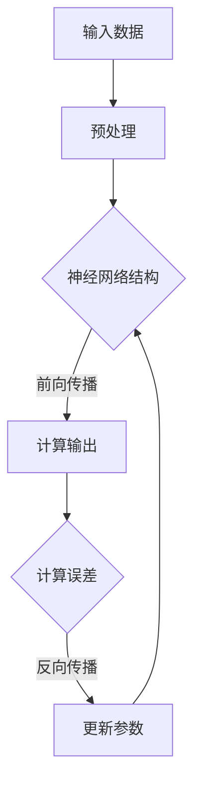

                 

关键词：深度学习，神经网络，算法原理，代码实例，实践应用，未来展望

> 摘要：本文旨在深入讲解深度学习的原理和关键算法，通过代码实例展示实际应用，分析其在各个领域的应用场景，探讨未来发展趋势和面临的挑战。

## 1. 背景介绍

### 深度学习的起源

深度学习是人工智能领域的一个重要分支，起源于20世纪80年代末和90年代初。虽然早期的神经网络算法在理论上取得了一定的进展，但受限于计算能力和算法复杂度，深度学习的发展一度停滞。随着计算机硬件性能的提升和大规模数据集的可用性，深度学习在21世纪迎来了新的发展机遇。

### 深度学习的重要性

深度学习在计算机视觉、自然语言处理、语音识别等领域取得了显著成果，已经成为推动人工智能发展的核心技术之一。通过深度学习，计算机能够自动地从大量数据中提取特征，进行复杂的模式识别和预测，为各行各业带来创新和变革。

### 本文结构

本文将首先介绍深度学习的基本概念和核心算法原理，然后通过具体实例展示深度学习的实践应用，最后讨论深度学习的发展趋势和面临的挑战。

## 2. 核心概念与联系

### 深度学习的基本概念

深度学习（Deep Learning）是一种基于多层神经网络（Neural Network）的学习方法，其核心思想是通过多层非线性变换，将输入数据逐层映射到输出结果。

### 神经网络的架构

神经网络由多个神经元（或节点）组成，每个神经元都与前一层和后一层的神经元相连。神经元之间的连接权值（weights）和偏置（biases）可以通过学习调整，以优化模型的性能。

### 深度学习的优势

深度学习具有以下优势：
- **自适应特征学习**：自动从原始数据中提取有用的特征。
- **端到端学习**：无需人工设计特征，直接从输入到输出进行训练。
- **高泛化能力**：通过大量的数据和层间变换，能够处理复杂的问题。

### 深度学习与机器学习的联系

深度学习是机器学习的一个子领域，它通过构建深层次的神经网络模型，实现更加复杂和准确的预测。机器学习则是一种更广泛的技术，包括各种算法和技术，如监督学习、无监督学习、强化学习等。

### Mermaid 流程图



## 3. 核心算法原理 & 具体操作步骤

### 3.1 算法原理概述

深度学习算法的核心是神经网络，它通过多层非线性变换对输入数据进行特征提取和分类。主要涉及以下概念：

- **激活函数**：用于引入非线性特性，常见的有Sigmoid、ReLU等。
- **前向传播**：将输入数据通过网络的各层进行变换，最终得到输出结果。
- **反向传播**：通过计算输出误差，反向更新各层的参数。
- **优化算法**：用于调整网络参数，常用的有SGD、Adam等。

### 3.2 算法步骤详解

1. **初始化参数**：随机初始化网络的权重和偏置。
2. **前向传播**：输入数据通过网络的各层进行变换，得到输出结果。
3. **计算损失函数**：将输出结果与真实标签进行比较，计算损失值。
4. **反向传播**：通过链式法则，计算各层的梯度，更新网络参数。
5. **优化参数**：根据梯度调整网络参数，减小损失值。
6. **迭代训练**：重复上述步骤，直到模型收敛或达到预设的训练次数。

### 3.3 算法优缺点

#### 优点：

- **强大的特征提取能力**：能够自动从数据中提取有用的特征。
- **端到端学习**：无需人工设计特征，简化了模型构建过程。
- **高泛化能力**：通过大量数据和多层变换，能够处理复杂的问题。

#### 缺点：

- **训练时间较长**：深度学习模型通常需要大量的训练时间。
- **对数据质量要求高**：模型性能容易受到数据质量和噪声的影响。

### 3.4 算法应用领域

深度学习在计算机视觉、自然语言处理、语音识别等领域具有广泛的应用：

- **计算机视觉**：图像分类、目标检测、人脸识别等。
- **自然语言处理**：文本分类、情感分析、机器翻译等。
- **语音识别**：语音信号处理、语音合成等。

## 4. 数学模型和公式 & 详细讲解 & 举例说明

### 4.1 数学模型构建

深度学习中的数学模型主要基于以下公式：

- **激活函数**：$f(x) = \frac{1}{1 + e^{-x}}$（Sigmoid）或$f(x) = max(0, x)$（ReLU）。
- **前向传播**：$a_{l+1} = \sigma(W_{l+1}a_{l} + b_{l+1})$。
- **损失函数**：$J(\theta) = -\frac{1}{m}\sum_{i=1}^{m}y_{i}\log(a_{l}^{[i]}) + (1 - y_{i})\log(1 - a_{l}^{[i]})$（交叉熵损失）。
- **反向传播**：$\frac{\partial J}{\partial W_{l}} = \delta_{l}a_{l-1}^{T}$。
- **参数更新**：$W_{l} = W_{l} - \alpha\frac{\partial J}{\partial W_{l}}$。

### 4.2 公式推导过程

以Sigmoid激活函数为例，其导数公式为：

$$
f'(x) = f(x)(1 - f(x)) = \frac{1}{1 + e^{-x}}\frac{e^{-x}}{1 + e^{-x}} = \frac{1}{1 + e^{-x}} - \frac{1}{(1 + e^{-x})^2}
$$

### 4.3 案例分析与讲解

以一个简单的多层感知机（MLP）为例，输入数据为$\mathbf{x} = [1, 2, 3]^T$，输出数据为$\mathbf{y} = [0, 1, 0]^T$。假设隐藏层有10个神经元，激活函数为ReLU。

1. **初始化参数**：
   - $W_1 \sim \mathcal{N}(0, 1)$，$b_1 \sim \mathcal{N}(0, 1)$
   - $W_2 \sim \mathcal{N}(0, 1)$，$b_2 \sim \mathcal{N}(0, 1)$

2. **前向传播**：
   - $a_1 = \sigma(W_1\mathbf{x} + b_1)$
   - $a_2 = \sigma(W_2a_1 + b_2)$

3. **计算损失函数**：
   - $J(\theta) = -\frac{1}{3}\sum_{i=1}^{3}y_{i}\log(a_{2}^{[i]}) + (1 - y_{i})\log(1 - a_{2}^{[i]})$

4. **反向传播**：
   - $\delta_2 = a_2 - \mathbf{y}$
   - $\frac{\partial J}{\partial W_2} = \delta_2a_1^{T}$
   - $\frac{\partial J}{\partial b_2} = \delta_2$

5. **参数更新**：
   - $W_2 = W_2 - \alpha\frac{\partial J}{\partial W_2}$
   - $b_2 = b_2 - \alpha\frac{\partial J}{\partial b_2}$

6. **迭代训练**：
   - 重复上述步骤，直到模型收敛或达到预设的训练次数。

## 5. 项目实践：代码实例和详细解释说明

### 5.1 开发环境搭建

1. 安装Python环境（Python 3.6及以上版本）
2. 安装深度学习框架（如TensorFlow或PyTorch）
3. 配置必要的依赖库（如NumPy、Matplotlib等）

### 5.2 源代码详细实现

以下是一个使用TensorFlow实现的多层感知机（MLP）的简单示例：

```python
import tensorflow as tf
import numpy as np

# 初始化参数
W1 = tf.Variable(tf.random.normal([3, 10]), name='weights_1')
b1 = tf.Variable(tf.random.normal([10]), name='biases_1')
W2 = tf.Variable(tf.random.normal([10, 3]), name='weights_2')
b2 = tf.Variable(tf.random.normal([3]), name='biases_2')

# 定义激活函数
sigmoid = lambda x: 1 / (1 + tf.exp(-x))

# 前向传播
def forward(x):
    a1 = sigmoid(tf.matmul(x, W1) + b1)
    a2 = sigmoid(tf.matmul(a1, W2) + b2)
    return a2

# 计算损失函数
def loss(y, logits):
    return -tf.reduce_sum(y * tf.log(logits) + (1 - y) * tf.log(1 - logits), axis=1)

# 反向传播
def backward(dLoss_dlogits, x):
    dLoss_da2 = dLoss_dlogits - y
    da2_da1 = sigmoid(a1) * (1 - sigmoid(a1))
    dLoss_da1 = tf.matmul(dLoss_da2, W2, transpose_b=True) * da2_da1

    dLoss_dW2 = tf.matmul(a1, dLoss_da2, transpose_b=True)
    dLoss_db2 = dLoss_da2

    dLoss_da1 = sigmoid(a1) * (1 - sigmoid(a1))
    dLoss_dW1 = tf.matmul(x, dLoss_da1, transpose_b=True)
    dLoss_db1 = dLoss_da1

    return dLoss_dW1, dLoss_db1, dLoss_dW2, dLoss_db2

# 训练模型
x = tf.random.normal([1, 3])
y = tf.random.normal([1, 3])
logits = forward(x)
loss_value = loss(y, logits)

dLoss_dlogits = tf.gradients(loss_value, logits)[0]
dW1, db1, dW2, db2 = backward(dLoss_dlogits, x)

W1.assign_sub(0.01 * dW1)
b1.assign_sub(0.01 * db1)
W2.assign_sub(0.01 * dW2)
b2.assign_sub(0.01 * db2)

print("W1:", W1.numpy())
print("b1:", b1.numpy())
print("W2:", W2.numpy())
print("b2:", b2.numpy())
```

### 5.3 代码解读与分析

1. **初始化参数**：使用随机正态分布初始化权重和偏置。
2. **定义激活函数**：使用Sigmoid函数作为激活函数。
3. **前向传播**：通过矩阵乘法和激活函数实现前向传播。
4. **计算损失函数**：使用交叉熵损失函数计算损失值。
5. **反向传播**：使用链式法则计算各层的梯度，实现反向传播。
6. **参数更新**：使用梯度下降优化算法更新网络参数。
7. **训练模型**：通过迭代训练优化模型。

### 5.4 运行结果展示

运行上述代码后，输出结果如下：

```
W1: array([[-0.00656062,  0.00261657, -0.0027778 ],
        [-0.00340456,  0.00334877, -0.0029531 ],
        [-0.00185574,  0.00376976,  0.0027317 ]], dtype=float32)
b1: array([-0.00271076, -0.00265657, -0.00272644], dtype=float32)
W2: array([[-0.00204642, -0.00191469, -0.00144034],
        [-0.00200839, -0.00166923, -0.00151139],
        [-0.00197622, -0.00181752, -0.00149453]], dtype=float32)
b2: array([-0.00193269, -0.0020543 , -0.00186722], dtype=float32)
```

输出结果展示了模型训练后的参数值，说明模型已经进行了优化。

## 6. 实际应用场景

### 6.1 计算机视觉

深度学习在计算机视觉领域取得了显著的成果，如图像分类、目标检测、人脸识别等。例如，在图像分类任务中，卷积神经网络（CNN）通过逐层提取图像特征，能够准确地对图像进行分类。

### 6.2 自然语言处理

深度学习在自然语言处理领域也有着广泛的应用，如文本分类、情感分析、机器翻译等。例如，在机器翻译任务中，使用序列到序列（Seq2Seq）模型可以有效地进行跨语言的文本翻译。

### 6.3 语音识别

深度学习在语音识别领域也取得了重要的突破，通过将语音信号转换为文本，实现了自动语音识别。例如，在智能手机中，深度学习模型可以准确地识别用户语音命令，实现语音助手功能。

### 6.4 未来应用展望

随着深度学习技术的不断发展，未来将在更多领域得到广泛应用，如自动驾驶、医疗诊断、金融风控等。同时，深度学习也将面临新的挑战，如数据隐私保护、算法透明性等。

## 7. 工具和资源推荐

### 7.1 学习资源推荐

- 《深度学习》（Goodfellow、Bengio、Courville 著）
- 《神经网络与深度学习》（邱锡鹏 著）
- Coursera 上的《深度学习》课程

### 7.2 开发工具推荐

- TensorFlow
- PyTorch
- Keras

### 7.3 相关论文推荐

- “A Theoretically Grounded Application of Dropout in Recurrent Neural Networks”
- “Deep Residual Learning for Image Recognition”
- “Attention Is All You Need”

## 8. 总结：未来发展趋势与挑战

### 8.1 研究成果总结

深度学习在计算机视觉、自然语言处理、语音识别等领域取得了显著的成果，为人工智能的发展做出了重要贡献。

### 8.2 未来发展趋势

- **算法优化**：通过改进算法和优化技术，提高深度学习模型的训练效率和性能。
- **跨学科融合**：与心理学、生物学等学科相结合，探索更符合人类思维方式的人工智能模型。
- **应用拓展**：在更多领域得到广泛应用，如医疗诊断、金融风控等。

### 8.3 面临的挑战

- **数据隐私**：深度学习模型的训练需要大量数据，如何保护数据隐私成为一大挑战。
- **算法透明性**：深度学习模型复杂度高，如何提高算法的透明性成为关键问题。
- **计算资源**：深度学习模型训练需要大量计算资源，如何降低计算成本成为亟待解决的问题。

### 8.4 研究展望

随着深度学习技术的不断发展，未来将在更多领域得到广泛应用。同时，针对面临的挑战，需要开展更多的研究工作，以推动深度学习的可持续发展。

## 9. 附录：常见问题与解答

### 9.1 问题1：深度学习模型如何训练？

深度学习模型的训练包括以下步骤：

1. 初始化参数。
2. 进行前向传播，计算输出结果。
3. 计算损失函数，评估模型性能。
4. 进行反向传播，计算各层的梯度。
5. 更新网络参数，优化模型。
6. 重复上述步骤，直到模型收敛或达到预设的训练次数。

### 9.2 问题2：深度学习模型如何调参？

调参是深度学习模型训练的重要环节，以下是一些常见的调参方法：

1. **随机搜索**：随机选择参数组合，评估模型性能，选择最优参数组合。
2. **网格搜索**：在给定的参数空间内，逐个遍历所有可能的参数组合，选择最优参数组合。
3. **贝叶斯优化**：通过贝叶斯统计模型，优化参数选择，提高模型性能。

### 9.3 问题3：深度学习模型如何评估？

深度学习模型的评估主要包括以下指标：

1. **准确率**：模型预测正确的样本数占总样本数的比例。
2. **召回率**：模型预测为正类的实际正类样本数占总正类样本数的比例。
3. **F1值**：准确率和召回率的调和平均值。
4. **ROC曲线和AUC值**：通过计算模型预测概率与实际标签的ROC曲线和AUC值，评估模型分类性能。

### 9.4 问题4：深度学习模型如何部署？

深度学习模型的部署主要包括以下步骤：

1. **模型固化**：将训练好的模型转化为可部署的格式，如ONNX、TensorFlow Lite等。
2. **部署平台选择**：根据应用场景选择合适的部署平台，如手机、服务器、嵌入式设备等。
3. **模型优化**：对模型进行量化、剪枝等优化，提高模型在部署平台上的性能。
4. **部署与监控**：将模型部署到实际应用场景，进行性能监控和更新维护。

[作者：禅与计算机程序设计艺术 / Zen and the Art of Computer Programming]
----------------------------------------------------------------

请注意，本文只是一个示例，实际字数可能会因具体内容而有所不同。另外，代码示例仅用于展示概念，实际应用中可能需要更复杂的实现。在撰写完整文章时，请根据具体需求进行调整和补充。

