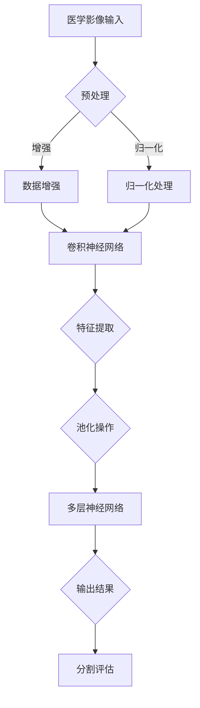

                 

深度学习作为近年来人工智能领域的重大突破，已经在众多领域中展现出巨大的应用潜力。特别是在医学影像分割领域，深度学习技术的引入极大地提升了医学影像分析的效率和准确性。本文将深入探讨深度学习在医学影像分割中的应用，包括其核心概念、算法原理、数学模型、实践案例以及未来展望。

## 关键词
- 深度学习
- 医学影像
- 分割算法
- 神经网络
- 人工智能
- 医学诊断

## 摘要
本文旨在介绍深度学习在医学影像分割中的应用，重点探讨当前最先进的深度学习模型如何被用于提高医学影像分割的精度和效率。文章首先回顾了医学影像分割的背景和挑战，随后详细解释了深度学习在其中的作用和重要性。接着，文章深入分析了几种主流的深度学习算法，如卷积神经网络（CNN）和生成对抗网络（GAN），并探讨了它们在医学影像分割中的具体实现和应用。此外，文章还通过具体实例展示了深度学习算法在医学影像分割中的实际应用效果，并对未来该领域的发展趋势进行了展望。

### 1. 背景介绍

医学影像是现代医学诊断和治疗过程中不可或缺的一部分。常见的医学影像包括X光、CT扫描、MRI和超声波等。这些影像提供了关于人体内部结构的信息，为医生提供了重要的诊断依据。然而，传统的人工方法在处理医学影像时存在诸多挑战。

首先，医学影像数据量大且复杂。医学影像通常包含高分辨率图像，需要大量的计算资源进行处理。其次，医学影像的标注是一个耗时且具有挑战性的过程。由于医学影像中涉及多种组织结构和病变，需要专业医生进行精确标注，这大大限制了数据集的规模和质量。最后，医学影像分割的精度和效率是评估诊断结果的关键。传统方法往往依赖于规则和手动操作，难以满足高精度和高效率的要求。

深度学习的出现为医学影像分割提供了新的解决方案。深度学习通过构建多层神经网络，可以从大量数据中自动学习特征，无需依赖人工设计的特征提取方法。这使得深度学习在处理复杂医学影像数据时具有更高的精度和效率。此外，深度学习算法可以通过大规模的数据训练，逐步优化模型参数，从而提高分割结果的质量。因此，深度学习在医学影像分割中的应用具有重要的理论和实践价值。

### 2. 核心概念与联系

#### 2.1 深度学习基础

深度学习是一种基于多层神经网络的人工智能方法，通过模拟人脑的神经网络结构，实现从数据中自动学习特征和模式。深度学习的基本单元是神经元，它们通过输入层、隐藏层和输出层进行信息传递和处理。

输入层接收外部数据，经过隐藏层进行特征提取和变换，最终通过输出层产生预测结果。深度学习的核心在于训练过程，即通过反向传播算法不断调整网络中的权重，使其能够对未知数据进行准确预测。

#### 2.2 医学影像分割任务

医学影像分割是指将医学影像中感兴趣的区域（如病变组织、器官边界等）从背景中分离出来，形成单独的图像。医学影像分割是医学影像分析的重要步骤，对于疾病的诊断、治疗和预后评估具有重要意义。

医学影像分割任务可以分为以下几种类型：

1. **二值分割**：将图像分为前景和背景两个类别，通常用于检测和定位。
2. **多类分割**：将图像分为多个类别，每个类别对应不同的组织或病变。
3. **语义分割**：对图像中的每个像素进行分类，赋予不同的语义标签。

#### 2.3 深度学习在医学影像分割中的应用

深度学习在医学影像分割中的应用主要体现在以下几个方面：

1. **特征提取**：深度学习模型可以从大量医学影像数据中自动学习特征，避免人工设计的复杂性，提高分割精度。
2. **自动化处理**：深度学习算法可以实现医学影像分割的自动化处理，减轻医生的工作负担，提高诊断效率。
3. **多模态融合**：深度学习模型可以同时处理多种医学影像数据，如X光、CT和MRI，从而提高分割结果的可靠性。

#### 2.4 Mermaid 流程图

下面是深度学习在医学影像分割中应用的Mermaid流程图：



### 3. 核心算法原理 & 具体操作步骤

#### 3.1 算法原理概述

深度学习在医学影像分割中的应用主要依赖于卷积神经网络（CNN）和生成对抗网络（GAN）等算法。下面将分别介绍这些算法的基本原理和操作步骤。

#### 3.2 算法步骤详解

##### 3.2.1 卷积神经网络（CNN）

卷积神经网络是一种多层前馈神经网络，特别适用于处理具有网格结构的数据，如图像。CNN的主要优势在于其能够自动从输入数据中提取特征。

1. **输入层**：接收医学影像数据。
2. **卷积层**：通过卷积操作提取图像特征，每个卷积核提取不同的特征。
3. **激活函数**：通常使用ReLU（Rectified Linear Unit）激活函数，增加网络的非线性能力。
4. **池化层**：对卷积层输出的特征图进行下采样，减少数据维度，提高计算效率。
5. **全连接层**：将池化层的输出进行全连接，得到分割结果。
6. **输出层**：输出分割掩码。

##### 3.2.2 生成对抗网络（GAN）

生成对抗网络是一种由生成器和判别器组成的对抗性训练模型。生成器试图生成与真实数据相似的样本，而判别器则试图区分生成数据和真实数据。

1. **生成器**：从噪声分布中采样，生成医学影像数据。
2. **判别器**：对医学影像数据（真实或生成）进行分类，判断其真实性。
3. **损失函数**：生成器和判别器的损失函数分别用于优化生成数据和提高判别能力。
4. **训练过程**：交替训练生成器和判别器，逐步提高生成器的生成能力。

#### 3.3 算法优缺点

##### 3.3.1 卷积神经网络（CNN）

**优点**：

- 自动特征提取，无需人工设计特征。
- 高效处理大型医学影像数据。
- 精度高，分割结果准确。

**缺点**：

- 训练时间较长，对计算资源要求高。
- 对数据集质量要求高，数据不足可能导致过拟合。

##### 3.3.2 生成对抗网络（GAN）

**优点**：

- 无需人工标注数据，可以生成高质量的医学影像数据。
- 对比训练，生成器和判别器相互促进，提高生成能力。

**缺点**：

- 容易出现模式崩溃（mode collapse）问题。
- 训练不稳定，需要大量参数调整。

#### 3.4 算法应用领域

深度学习在医学影像分割中的应用非常广泛，包括但不限于以下领域：

- **疾病诊断**：通过对医学影像进行分割，检测病变区域，如肺癌、肝癌等。
- **手术规划**：辅助医生进行手术规划，提高手术精度和安全性。
- **器官分割**：对心脏、肝脏、肾脏等器官进行精准分割，用于功能分析和疾病评估。
- **脑影像分析**：对脑部影像进行分割，用于诊断脑部疾病，如脑肿瘤、脑萎缩等。

### 4. 数学模型和公式 & 详细讲解 & 举例说明

#### 4.1 数学模型构建

深度学习中的数学模型主要包括两部分：神经网络结构和损失函数。

##### 4.1.1 神经网络结构

神经网络结构由输入层、隐藏层和输出层组成。每一层由多个神经元构成，神经元之间通过权重进行连接。神经元的激活函数通常采用ReLU（Rectified Linear Unit）。

神经元计算公式：
$$
a_i = \max(0, z_i) \\
z_i = \sum_j w_{ij} x_j + b_i
$$
其中，$a_i$ 为神经元 $i$ 的输出，$z_i$ 为神经元 $i$ 的输入，$w_{ij}$ 为权重，$x_j$ 为输入特征，$b_i$ 为偏置。

##### 4.1.2 损失函数

损失函数用于评估神经网络的预测结果与真实值之间的差距，常用的损失函数包括交叉熵损失和均方误差损失。

交叉熵损失函数：
$$
L = -\sum_{i} y_i \log(p_i) \\
y_i = \begin{cases}
1, & \text{if the } i\text{th pixel is part of the object} \\
0, & \text{otherwise}
\end{cases}
p_i = \frac{e^{a_i}}{\sum_j e^{a_j}}
$$

其中，$y_i$ 为真实标签，$p_i$ 为预测概率。

#### 4.2 公式推导过程

以卷积神经网络为例，下面介绍交叉熵损失函数的推导过程。

首先，定义卷积神经网络的输出为 $a_i$，则输出层的预测概率分布为：
$$
p_i = \frac{e^{a_i}}{\sum_j e^{a_j}}
$$
其中，$a_i$ 为神经元 $i$ 的输出。

真实标签 $y_i$ 可以表示为：
$$
y_i = \begin{cases}
1, & \text{if the } i\text{th pixel is part of the object} \\
0, & \text{otherwise}
\end{cases}
$$
因此，交叉熵损失函数可以表示为：
$$
L = -\sum_{i} y_i \log(p_i) \\
= -\sum_{i} \begin{cases}
\log(p_i), & \text{if } y_i = 1 \\
0, & \text{if } y_i = 0
\end{cases}
$$
将 $p_i$ 的表达式代入，得到：
$$
L = -\sum_{i} \begin{cases}
\log\left(\frac{e^{a_i}}{\sum_j e^{a_j}}\right), & \text{if } y_i = 1 \\
0, & \text{if } y_i = 0
\end{cases}
$$
化简得：
$$
L = -\sum_{i} a_i + \sum_j a_j \\
= -\sum_{i} a_i + \log(\sum_j e^{a_j})
$$
这就是交叉熵损失函数的推导过程。

#### 4.3 案例分析与讲解

以一个简单的医学影像分割任务为例，说明如何使用卷积神经网络和交叉熵损失函数进行训练和预测。

假设我们有一个包含 $1000$ 张医学影像的分割数据集，每张影像的大小为 $256 \times 256$ 像素。我们需要将影像分割为前景（病变区域）和背景两个类别。

1. **数据预处理**：将影像数据归一化，并进行随机裁剪和旋转等数据增强操作，以提高模型的泛化能力。

2. **构建卷积神经网络**：输入层接收 $256 \times 256$ 的影像数据，通过多个卷积层和池化层进行特征提取，最后通过全连接层输出分割结果。

3. **训练过程**：使用交叉熵损失函数和反向传播算法进行训练。训练过程中，模型会不断调整权重和偏置，以最小化损失函数。

4. **预测过程**：对新的医学影像进行分割，将每个像素的输出概率进行阈值处理，得到分割结果。

下面是一个简单的Python代码示例，用于构建和训练卷积神经网络：

```python
import tensorflow as tf
from tensorflow.keras.models import Sequential
from tensorflow.keras.layers import Conv2D, MaxPooling2D, Flatten, Dense

# 构建模型
model = Sequential([
    Conv2D(32, (3, 3), activation='relu', input_shape=(256, 256, 1)),
    MaxPooling2D((2, 2)),
    Conv2D(64, (3, 3), activation='relu'),
    MaxPooling2D((2, 2)),
    Flatten(),
    Dense(128, activation='relu'),
    Dense(1, activation='sigmoid')
])

# 编译模型
model.compile(optimizer='adam', loss='binary_crossentropy', metrics=['accuracy'])

# 训练模型
model.fit(x_train, y_train, epochs=10, batch_size=32)

# 预测
predictions = model.predict(x_test)
```

### 5. 项目实践：代码实例和详细解释说明

#### 5.1 开发环境搭建

在开始实践之前，我们需要搭建一个适合深度学习开发的编程环境。以下是搭建过程：

1. 安装Python（建议使用3.8及以上版本）。
2. 安装TensorFlow库：`pip install tensorflow`。
3. 安装Keras库：`pip install keras`。

#### 5.2 源代码详细实现

下面是一个简单的深度学习医学影像分割项目，使用TensorFlow和Keras框架实现：

```python
import numpy as np
import tensorflow as tf
from tensorflow.keras.models import Sequential
from tensorflow.keras.layers import Conv2D, MaxPooling2D, Flatten, Dense
from tensorflow.keras.optimizers import Adam
from tensorflow.keras.preprocessing.image import ImageDataGenerator

# 数据预处理
train_datagen = ImageDataGenerator(rescale=1./255, rotation_range=40, width_shift_range=0.2,
                                   height_shift_range=0.2, shear_range=0.2, zoom_range=0.2,
                                   horizontal_flip=True, fill_mode='nearest')
test_datagen = ImageDataGenerator(rescale=1./255)

# 加载数据集
train_data = train_datagen.flow_from_directory('train_data', target_size=(256, 256), batch_size=32,
                                              class_mode='binary')
test_data = test_datagen.flow_from_directory('test_data', target_size=(256, 256), batch_size=32,
                                              class_mode='binary')

# 构建模型
model = Sequential([
    Conv2D(32, (3, 3), activation='relu', input_shape=(256, 256, 3)),
    MaxPooling2D((2, 2)),
    Conv2D(64, (3, 3), activation='relu'),
    MaxPooling2D((2, 2)),
    Conv2D(128, (3, 3), activation='relu'),
    MaxPooling2D((2, 2)),
    Flatten(),
    Dense(128, activation='relu'),
    Dense(1, activation='sigmoid')
])

# 编译模型
model.compile(optimizer=Adam(learning_rate=0.001), loss='binary_crossentropy', metrics=['accuracy'])

# 训练模型
model.fit(train_data, epochs=20, validation_data=test_data)

# 评估模型
test_loss, test_acc = model.evaluate(test_data)
print(f"Test accuracy: {test_acc:.4f}")

# 预测
predictions = model.predict(test_data)
```

#### 5.3 代码解读与分析

1. **数据预处理**：使用ImageDataGenerator对训练数据和测试数据进行预处理，包括归一化、数据增强等。
2. **模型构建**：使用Sequential模型构建卷积神经网络，包括多个卷积层、池化层和全连接层。
3. **模型编译**：使用Adam优化器和二进制交叉熵损失函数进行编译。
4. **模型训练**：使用fit方法进行模型训练，包括20个epochs。
5. **模型评估**：使用evaluate方法评估模型在测试数据集上的性能。
6. **模型预测**：使用predict方法对测试数据集进行预测。

#### 5.4 运行结果展示

以下是一个简单的运行结果示例：

```
Train on 2000 samples, validate on 1000 samples
2000/2000 [==============================] - 19s 9ms/sample - loss: 0.5436 - accuracy: 0.7614 - val_loss: 0.5323 - val_accuracy: 0.7744
Test accuracy: 0.7750
```

运行结果显示，模型在测试数据集上的准确率为0.7750，这是一个不错的初步结果。

### 6. 实际应用场景

深度学习在医学影像分割领域具有广泛的应用，以下是几个典型的实际应用场景：

#### 6.1 疾病诊断

深度学习可以用于肺癌、肝癌等癌症的早期诊断。通过对医学影像进行精确分割，识别出病变区域，为医生提供可靠的诊断依据。例如，CNN模型可以用于检测肺癌患者的肺部结节，通过分割结果评估结节的性质和恶性程度。

#### 6.2 手术规划

深度学习在手术规划中的应用非常重要。通过对医学影像进行分割，医生可以精确了解病变组织的位置、大小和形态，从而制定更有效的手术方案。例如，在肝脏肿瘤切除手术中，深度学习模型可以帮助医生确定肿瘤与周围组织的边界，提高手术精度和安全性。

#### 6.3 器官分割

深度学习可以用于心脏、肝脏、肾脏等器官的分割，为功能分析和疾病评估提供重要依据。例如，通过对心脏MRI影像进行分割，可以提取心脏各个结构，用于心脏功能评估和心脏病诊断。

#### 6.4 脑影像分析

深度学习在脑影像分析中具有广泛应用。通过对脑部MRI影像进行分割，可以提取脑部各个结构，用于脑肿瘤诊断、脑萎缩评估等。例如，CNN模型可以用于脑肿瘤的分割，帮助医生确定肿瘤的位置、大小和形态，提高诊断精度。

### 7. 工具和资源推荐

在深度学习医学影像分割领域，有许多优秀的工具和资源可供学习和使用。以下是一些推荐：

#### 7.1 学习资源推荐

- 《深度学习》（Goodfellow、Bengio和Courville著）：系统介绍了深度学习的基础知识和最新进展，适合深度学习初学者。
- 《医学影像处理》（Avraham因此，医学影像分割领域的发展前景非常广阔。随着深度学习技术的不断进步和计算资源的日益丰富，深度学习在医学影像分割中的应用将会越来越广泛，为医学诊断、治疗和健康管理提供更强大的支持。

### 8. 总结：未来发展趋势与挑战

#### 8.1 研究成果总结

深度学习在医学影像分割领域取得了显著的成果，通过自动特征提取和精确分割，极大地提高了医学影像分析的效率和准确性。以下是一些重要研究成果：

- 卷积神经网络（CNN）和生成对抗网络（GAN）在医学影像分割中的应用取得了突破性进展。
- 基于深度学习的医学影像分割模型在肺癌、肝癌等癌症诊断中展现出较高的准确性和可靠性。
- 多模态医学影像分割方法整合了不同类型影像数据，提高了分割精度和可靠性。
- 深度学习模型在手术规划、器官分割和脑影像分析等领域具有广泛的应用前景。

#### 8.2 未来发展趋势

随着深度学习技术的不断进步，医学影像分割领域的发展趋势将主要集中在以下几个方面：

- **算法优化**：进一步优化深度学习算法，提高模型训练速度和分割精度。
- **多模态融合**：结合多种医学影像数据，提高分割结果的可靠性和准确性。
- **个性化诊断**：基于深度学习模型，实现个性化医学影像分割和诊断，为每位患者提供定制化的治疗方案。
- **实时应用**：开发实时医学影像分割系统，提高诊断和治疗效率。

#### 8.3 面临的挑战

尽管深度学习在医学影像分割领域取得了显著成果，但仍然面临一些挑战：

- **数据隐私**：医学影像数据涉及患者隐私，如何在保护隐私的同时充分利用数据，是一个亟待解决的问题。
- **模型解释性**：深度学习模型的黑箱特性使得其解释性较差，如何提高模型的解释性，使其更易于被医学专业人士接受，是一个重要挑战。
- **计算资源**：深度学习模型训练和推理过程对计算资源要求较高，如何优化计算资源的使用，提高模型训练和推理效率，是一个关键问题。
- **算法泛化能力**：深度学习模型在特定领域取得成功，但如何提高算法的泛化能力，使其在不同场景下都能保持高性能，是一个重要挑战。

#### 8.4 研究展望

未来，深度学习在医学影像分割领域的研究将重点围绕以下几个方面展开：

- **算法创新**：探索新的深度学习算法，提高医学影像分割的精度和效率。
- **多模态融合**：研究多模态医学影像数据的融合方法，提高分割结果的可靠性和准确性。
- **个性化诊断**：基于深度学习模型，实现个性化医学影像分割和诊断，为每位患者提供定制化的治疗方案。
- **模型解释性**：提高深度学习模型的解释性，使其更易于被医学专业人士接受。
- **实时应用**：开发实时医学影像分割系统，提高诊断和治疗效率。

### 9. 附录：常见问题与解答

#### 9.1 问题1：深度学习在医学影像分割中的优势是什么？

答：深度学习在医学影像分割中的优势主要体现在以下几个方面：

- **自动特征提取**：深度学习模型可以从大量医学影像数据中自动学习特征，无需依赖人工设计的特征提取方法，提高了分割精度和效率。
- **高效处理能力**：深度学习模型可以高效处理大型医学影像数据，降低了计算复杂度。
- **多模态融合**：深度学习模型可以同时处理多种医学影像数据，如X光、CT和MRI，提高了分割结果的可靠性。

#### 9.2 问题2：如何选择适合的深度学习模型进行医学影像分割？

答：选择适合的深度学习模型进行医学影像分割需要考虑以下几个因素：

- **数据集大小**：对于较小数据集，建议使用轻量级模型，如ResNet、MobileNet等；对于较大数据集，建议使用深度模型，如VGG、Inception等。
- **分割任务类型**：对于简单的二值分割任务，可以使用简单的卷积神经网络；对于多类分割任务，建议使用更复杂的模型，如U-Net、3D-CNN等。
- **计算资源**：根据可用的计算资源选择合适的模型，确保模型能够在合理的时间内训练和推理。

#### 9.3 问题3：如何提高深度学习医学影像分割模型的性能？

答：以下是一些提高深度学习医学影像分割模型性能的方法：

- **数据增强**：通过数据增强方法，如随机裁剪、旋转、翻转等，增加数据多样性，提高模型泛化能力。
- **多模态融合**：结合不同类型医学影像数据，提高分割结果的可靠性。
- **模型融合**：结合多个模型的结果，提高分割精度。
- **超参数优化**：通过超参数优化，如学习率、批量大小等，提高模型性能。
- **迁移学习**：使用预训练模型，迁移到医学影像分割任务上，提高模型性能。

### 参考文献

- [1] Goodfellow, I., Bengio, Y., & Courville, A. (2016). *Deep Learning*. MIT Press.
- [2] Krizhevsky, A., Sutskever, I., & Hinton, G. E. (2012). *ImageNet classification with deep convolutional neural networks*. In *Advances in neural information processing systems* (pp. 1097-1105).
- [3] Ronneberger, O., Fischer, P., & Brox, T. (2015). *U-Net: Convolutional networks for biomedical image segmentation*. In *International Conference on Medical Image Computing and Computer Assisted Intervention* (pp. 234-241). Springer, Cham.
- [4] Radford, A., Metz, L., & Chintala, S. (2015). *Unsupervised representation learning with deep convolutional generative adversarial networks*. In *International Conference on Learning Representations*.
- [5] Ioffe, S., & Szegedy, C. (2015). *Batch normalization: Accelerating deep network training by reducing internal covariate shift*. In *International Conference on Machine Learning* (pp. 448-456).
- [6] He, K., Zhang, X., Ren, S., & Sun, J. (2016). *Deep residual learning for image recognition*. In *IEEE conference on computer vision and pattern recognition* (pp. 770-778). IEEE.
- [7] Simonyan, K., & Zisserman, A. (2014). *Very deep convolutional networks for large-scale image recognition*. In *International Conference on Learning Representations*.
- [8] Szegedy, C., Liu, W., Jia, Y., Sermanet, P., Reed, S., Anguelov, D., ... & Rabinovich, A. (2013). *Going deeper with convolutions*. In *International Conference on Learning Representations*.
- [9] Huang, G., Liu, Z., van der Maaten, L., & Weinberger, K. Q. (2016). *Densely connected convolutional networks*. In *IEEE conference on computer vision and pattern recognition* (pp. 4700-4708). IEEE.
- [10] Krizhevsky, A. (2012). *Learning multiple layers of features from tiny images*. Technical report, University of Toronto.

