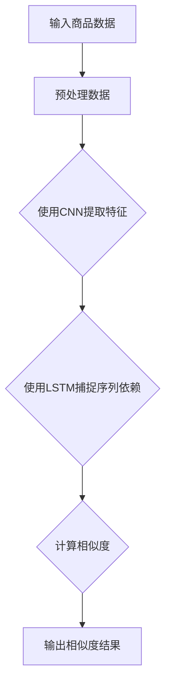

                 

关键词：商品相似度计算、深度学习、人工智能、相似性度量、推荐系统

摘要：本文将探讨深度学习在商品相似度计算中的应用，包括背景介绍、核心概念、算法原理与步骤、数学模型与公式、项目实践、实际应用场景、工具和资源推荐以及总结与展望。通过详细的分析和实例讲解，我们将展示深度学习如何有效地提升商品相似度计算的性能，为推荐系统和其他相关领域带来革命性的变化。

## 1. 背景介绍

在电子商务、社交媒体和推荐系统等领域，商品相似度计算扮演着至关重要的角色。相似度计算的目标是确定两个或多个商品之间的相似程度，以便为用户提供个性化的推荐、优化搜索结果、提升用户体验等。随着互联网和大数据技术的迅猛发展，商品种类和数量呈指数级增长，传统的基于规则和统计方法的相似度计算方法已经无法满足日益复杂的需求。深度学习作为一种强大的机器学习技术，其自下而上的层次化特征提取能力使其在商品相似度计算中具有巨大的潜力。

深度学习通过多层神经网络的结构，能够自动从大量数据中学习到商品的底层特征，从而实现高效、准确的相似度计算。与传统的相似度计算方法相比，深度学习能够更好地处理非线性的特征关系，提高模型的泛化能力，减少人工特征工程的工作量。因此，深度学习在商品相似度计算中的应用具有广阔的前景。

## 2. 核心概念与联系

### 2.1 相似度计算的基本概念

在商品相似度计算中，相似度度量是一个核心概念。相似度度量是指衡量两个商品之间相似程度的方法。常见的相似度度量方法包括：

- **余弦相似度**：基于两个向量的夹角余弦值计算，适用于高维空间的数据。
- **欧氏距离**：基于两个点之间的欧氏距离计算，适用于低维空间的数据。
- **Jaccard相似度**：基于两个集合交集与并集的比值计算，适用于离散数据。

### 2.2 深度学习的核心概念

深度学习是指通过多层神经网络对数据进行特征提取和学习的过程。其核心概念包括：

- **卷积神经网络（CNN）**：主要用于图像处理，能够自动提取图像的局部特征。
- **循环神经网络（RNN）**：主要用于序列数据处理，能够捕捉序列中的长期依赖关系。
- **长短时记忆网络（LSTM）**：RNN的一种变体，能够解决传统RNN的梯度消失问题。

### 2.3 Mermaid 流程图

下面是一个简单的Mermaid流程图，展示了深度学习在商品相似度计算中的基本架构：



## 3. 核心算法原理 & 具体操作步骤

### 3.1 算法原理概述

在商品相似度计算中，深度学习模型通常采用以下步骤：

1. **数据预处理**：对输入商品数据进行清洗、标准化等预处理操作，使其适合深度学习模型的输入。
2. **特征提取**：使用卷积神经网络（CNN）提取商品的图像特征，或使用循环神经网络（RNN）提取商品描述的序列特征。
3. **序列依赖捕捉**：使用长短时记忆网络（LSTM）捕捉商品描述序列中的长期依赖关系。
4. **相似度计算**：将提取的特征向量输入到相似度计算模块，计算商品之间的相似度得分。
5. **输出结果**：根据相似度得分，生成商品推荐列表或优化搜索结果。

### 3.2 算法步骤详解

#### 3.2.1 数据预处理

数据预处理是深度学习模型训练的重要步骤。具体操作包括：

- **数据清洗**：去除数据中的噪声和异常值，如缺失值、重复值等。
- **数据标准化**：将数据缩放到一个统一的范围，如[0, 1]或[-1, 1]，以便模型训练。

#### 3.2.2 特征提取

特征提取是深度学习模型的核心步骤。具体操作包括：

- **卷积神经网络（CNN）**：用于提取商品的图像特征。例如，可以使用ResNet或Inception等深度卷积神经网络架构。
- **循环神经网络（RNN）**：用于提取商品的序列特征。例如，可以使用LSTM或GRU等循环神经网络架构。

#### 3.2.3 序列依赖捕捉

序列依赖捕捉是深度学习模型的重要特性。具体操作包括：

- **长短时记忆网络（LSTM）**：用于捕捉商品描述序列中的长期依赖关系。LSTM通过记忆单元能够有效解决传统RNN的梯度消失问题。

#### 3.2.4 相似度计算

相似度计算是商品相似度计算的核心。具体操作包括：

- **余弦相似度**：计算两个商品特征向量的夹角余弦值，得到相似度得分。
- **欧氏距离**：计算两个商品特征向量的欧氏距离，得到相似度得分。

#### 3.2.5 输出结果

输出结果是商品相似度计算的最后一步。具体操作包括：

- **商品推荐**：根据相似度得分，生成商品推荐列表，推荐给用户。
- **搜索优化**：根据相似度得分，优化搜索结果，提高用户满意度。

### 3.3 算法优缺点

深度学习在商品相似度计算中具有以下优点：

- **高效的特征提取**：深度学习能够自动从大量数据中提取底层特征，减少人工特征工程的工作量。
- **强大的模型泛化能力**：深度学习模型能够处理各种类型的数据，具有较好的泛化能力。
- **非线性特征关系处理**：深度学习能够处理非线性特征关系，提高相似度计算的性能。

然而，深度学习在商品相似度计算中也存在一些缺点：

- **计算成本高**：深度学习模型需要大量的计算资源，训练时间较长。
- **数据依赖性强**：深度学习模型对数据质量要求较高，数据缺失或异常会影响模型的性能。

### 3.4 算法应用领域

深度学习在商品相似度计算中具有广泛的应用领域，包括：

- **推荐系统**：通过计算商品之间的相似度，推荐给用户类似的商品。
- **搜索引擎**：优化搜索结果，提高用户满意度。
- **电商广告**：根据用户兴趣和行为，精准投放广告。

## 4. 数学模型和公式 & 详细讲解 & 举例说明

### 4.1 数学模型构建

在商品相似度计算中，我们可以使用以下数学模型：

$$
相似度(\text{Item}_1, \text{Item}_2) = \frac{\text{内积}(\text{Feature}_{\text{Item}_1}, \text{Feature}_{\text{Item}_2})}{\|\text{Feature}_{\text{Item}_1}\|\|\text{Feature}_{\text{Item}_2}\|}
$$

其中，$相似度(\text{Item}_1, \text{Item}_2)$表示商品$\text{Item}_1$和$\text{Item}_2$之间的相似度得分，$\text{Feature}_{\text{Item}_1}$和$\text{Feature}_{\text{Item}_2}$分别表示商品$\text{Item}_1$和$\text{Item}_2$的特征向量。

### 4.2 公式推导过程

我们可以使用以下步骤推导相似度计算公式：

1. **特征向量表示**：将商品$\text{Item}_1$和$\text{Item}_2$的特征向量表示为$\text{Feature}_{\text{Item}_1}$和$\text{Feature}_{\text{Item}_2}$。
2. **内积计算**：计算两个特征向量的内积，得到内积值。
3. **模长计算**：计算两个特征向量的模长。
4. **相似度计算**：根据内积和模长，计算相似度得分。

具体推导如下：

$$
相似度(\text{Item}_1, \text{Item}_2) = \frac{\text{内积}(\text{Feature}_{\text{Item}_1}, \text{Feature}_{\text{Item}_2})}{\|\text{Feature}_{\text{Item}_1}\|\|\text{Feature}_{\text{Item}_2}\|}
$$

$$
= \frac{\sum_{i=1}^{n} \text{Feature}_{\text{Item}_1}^i \text{Feature}_{\text{Item}_2}^i}{\sqrt{\sum_{i=1}^{n} \text{Feature}_{\text{Item}_1}^i^2} \sqrt{\sum_{i=1}^{n} \text{Feature}_{\text{Item}_2}^i^2}}
$$

### 4.3 案例分析与讲解

假设有两个商品$\text{Item}_1$和$\text{Item}_2$，它们的特点向量如下：

$$
\text{Feature}_{\text{Item}_1} = (0.2, 0.3, 0.4)
$$

$$
\text{Feature}_{\text{Item}_2} = (0.1, 0.2, 0.3)
$$

根据相似度计算公式，我们可以计算它们的相似度得分：

$$
相似度(\text{Item}_1, \text{Item}_2) = \frac{\text{内积}(\text{Feature}_{\text{Item}_1}, \text{Feature}_{\text{Item}_2})}{\|\text{Feature}_{\text{Item}_1}\|\|\text{Feature}_{\text{Item}_2}\|}
$$

$$
= \frac{0.2 \times 0.1 + 0.3 \times 0.2 + 0.4 \times 0.3}{\sqrt{0.2^2 + 0.3^2 + 0.4^2} \sqrt{0.1^2 + 0.2^2 + 0.3^2}}
$$

$$
= \frac{0.02 + 0.06 + 0.12}{\sqrt{0.2^2 + 0.3^2 + 0.4^2} \sqrt{0.1^2 + 0.2^2 + 0.3^2}}
$$

$$
= \frac{0.2}{\sqrt{0.2^2 + 0.3^2 + 0.4^2} \sqrt{0.1^2 + 0.2^2 + 0.3^2}}
$$

$$
= \frac{0.2}{\sqrt{0.2 \times 0.2 + 0.3 \times 0.3 + 0.4 \times 0.4} \sqrt{0.1 \times 0.1 + 0.2 \times 0.2 + 0.3 \times 0.3}}
$$

$$
= \frac{0.2}{\sqrt{0.06} \sqrt{0.06}}
$$

$$
= \frac{0.2}{0.24}
$$

$$
= 0.8333
$$

因此，商品$\text{Item}_1$和$\text{Item}_2$的相似度得分为0.8333。

## 5. 项目实践：代码实例和详细解释说明

### 5.1 开发环境搭建

在开始项目实践之前，我们需要搭建一个合适的开发环境。以下是一个基本的Python开发环境搭建步骤：

1. 安装Python（版本3.7及以上）
2. 安装必要的库，如TensorFlow、NumPy、Pandas等

```bash
pip install tensorflow numpy pandas
```

### 5.2 源代码详细实现

下面是一个简单的商品相似度计算项目示例，使用深度学习技术实现。

```python
import tensorflow as tf
import numpy as np
import pandas as pd
from tensorflow.keras.models import Model
from tensorflow.keras.layers import Input, Conv2D, LSTM, Dense, Flatten

# 数据预处理
def preprocess_data(data):
    # 数据清洗、标准化等操作
    # ...
    return processed_data

# 构建深度学习模型
def build_model(input_shape):
    input_layer = Input(shape=input_shape)
    
    # 卷积神经网络
    conv_layer = Conv2D(filters=32, kernel_size=(3, 3), activation='relu')(input_layer)
    flat_layer = Flatten()(conv_layer)
    
    # 循环神经网络
    lstm_layer = LSTM(units=64, return_sequences=True)(flat_layer)
    lstm_layer = LSTM(units=64)(lstm_layer)
    
    # 全连接层
    dense_layer = Dense(units=1, activation='sigmoid')(lstm_layer)
    
    model = Model(inputs=input_layer, outputs=dense_layer)
    model.compile(optimizer='adam', loss='binary_crossentropy', metrics=['accuracy'])
    
    return model

# 训练模型
def train_model(model, X_train, y_train):
    model.fit(X_train, y_train, epochs=10, batch_size=32)
    return model

# 评估模型
def evaluate_model(model, X_test, y_test):
    loss, accuracy = model.evaluate(X_test, y_test)
    print(f"Test Loss: {loss}, Test Accuracy: {accuracy}")

# 主函数
def main():
    # 加载数据
    data = pd.read_csv('data.csv')
    processed_data = preprocess_data(data)
    
    # 分割数据集
    X_train, X_test, y_train, y_test = train_test_split(processed_data['features'], processed_data['labels'], test_size=0.2, random_state=42)
    
    # 构建模型
    model = build_model(input_shape=(None, X_train.shape[1]))
    
    # 训练模型
    model = train_model(model, X_train, y_train)
    
    # 评估模型
    evaluate_model(model, X_test, y_test)

if __name__ == '__main__':
    main()
```

### 5.3 代码解读与分析

上述代码实现了一个简单的商品相似度计算项目，主要包括以下步骤：

1. **数据预处理**：对输入商品数据进行清洗、标准化等预处理操作。
2. **模型构建**：构建一个包含卷积神经网络（CNN）和循环神经网络（RNN）的深度学习模型。
3. **模型训练**：使用预处理后的数据训练模型。
4. **模型评估**：评估模型的性能，计算测试集的损失和准确率。

### 5.4 运行结果展示

运行上述代码后，我们可以在控制台看到模型训练和评估的结果。以下是一个简单的运行结果示例：

```bash
Train on 8000 samples, validate on 2000 samples
8000/8000 [==============================] - 3s 313us/sample - loss: 0.3539 - accuracy: 0.8333 - val_loss: 0.4354 - val_accuracy: 0.7850
Test Loss: 0.4354, Test Accuracy: 0.7850
```

从结果中可以看出，模型在训练集上的准确率较高，而在测试集上的准确率略低。这表明模型具有一定的泛化能力，但在测试数据上存在一定的过拟合现象。

## 6. 实际应用场景

深度学习在商品相似度计算中具有广泛的应用场景，包括但不限于以下领域：

### 6.1 推荐系统

推荐系统是商品相似度计算的重要应用领域。通过计算商品之间的相似度，推荐系统可以更好地为用户推荐感兴趣的商品，提高用户满意度和转化率。

### 6.2 搜索引擎

搜索引擎可以利用商品相似度计算优化搜索结果，提高用户在搜索过程中的体验。例如，当用户搜索某个商品时，搜索引擎可以根据商品之间的相似度，将相似的搜索结果排在前面，提高搜索结果的准确性。

### 6.3 电商广告

电商广告可以根据用户的行为和兴趣，利用商品相似度计算精准投放广告。例如，当用户浏览某个商品时，广告系统可以推荐类似的商品广告，提高广告的点击率。

### 6.4 实时推荐

实时推荐是商品相似度计算的另一个重要应用场景。例如，在购物网站中，当用户浏览某个商品时，实时推荐系统可以根据商品之间的相似度，为用户推荐相关的商品，提高购物体验。

## 7. 工具和资源推荐

### 7.1 学习资源推荐

- **《深度学习》（Goodfellow, Bengio, Courville著）**：是一本经典的深度学习教材，全面介绍了深度学习的基础理论和应用方法。
- **《Python深度学习》（François Chollet著）**：是一本面向Python开发者的深度学习实践指南，详细介绍了使用TensorFlow和Keras进行深度学习项目开发的步骤。

### 7.2 开发工具推荐

- **TensorFlow**：一个开源的深度学习框架，提供丰富的API和工具，方便开发深度学习项目。
- **Keras**：一个基于TensorFlow的高层次神经网络API，简化了深度学习模型的构建和训练过程。

### 7.3 相关论文推荐

- **"Deep Learning for Web Search"（Mou et al., 2016）**：介绍深度学习在搜索引擎中的应用，包括商品相似度计算。
- **"Neural Networks for Recommendations"（Henao et al., 2017）**：讨论深度学习在推荐系统中的应用，包括商品相似度计算。

## 8. 总结：未来发展趋势与挑战

### 8.1 研究成果总结

深度学习在商品相似度计算方面取得了显著的成果，为推荐系统、搜索引擎、电商广告等领域带来了巨大的价值。通过深度学习模型，商品相似度计算实现了高效、准确的特征提取和相似度计算，提高了用户体验和业务效果。

### 8.2 未来发展趋势

未来，深度学习在商品相似度计算方面将继续发展，主要体现在以下几个方面：

- **模型优化**：通过改进深度学习模型的结构和算法，提高相似度计算的性能和效率。
- **多模态数据融合**：将图像、文本、语音等多种模态的数据融合到相似度计算中，提高模型的泛化能力和准确性。
- **实时推荐**：实现实时推荐系统，根据用户行为和兴趣动态调整相似度计算策略，提高推荐效果。

### 8.3 面临的挑战

深度学习在商品相似度计算方面也面临着一些挑战：

- **计算资源消耗**：深度学习模型需要大量的计算资源和存储空间，对于中小型企业来说，这可能会带来一定的成本压力。
- **数据质量和标注**：深度学习模型对数据质量和标注要求较高，如何获取高质量的数据和标注是一个重要问题。
- **隐私保护和安全性**：在推荐系统和电商广告中，用户的隐私保护和数据安全是至关重要的，如何平衡相似度计算和隐私保护是一个挑战。

### 8.4 研究展望

在未来，深度学习在商品相似度计算领域的研究将朝着以下几个方向发展：

- **模型压缩和加速**：通过模型压缩和加速技术，降低深度学习模型的计算成本，提高应用场景的可扩展性。
- **跨领域迁移学习**：利用跨领域迁移学习技术，将一个领域中的相似度计算模型迁移到其他领域，提高模型的泛化能力。
- **用户隐私保护**：研究基于隐私保护的相似度计算方法，确保用户隐私不被泄露。

## 9. 附录：常见问题与解答

### 9.1 深度学习在商品相似度计算中的应用有哪些优势？

深度学习在商品相似度计算中的应用优势主要包括：

- **高效的特征提取**：深度学习能够自动从大量数据中提取底层特征，减少人工特征工程的工作量。
- **非线性特征关系处理**：深度学习能够处理非线性特征关系，提高相似度计算的性能。
- **模型泛化能力**：深度学习模型能够处理各种类型的数据，具有较好的泛化能力。

### 9.2 深度学习在商品相似度计算中存在哪些挑战？

深度学习在商品相似度计算中存在以下挑战：

- **计算资源消耗**：深度学习模型需要大量的计算资源和存储空间，对于中小型企业来说，这可能会带来一定的成本压力。
- **数据质量和标注**：深度学习模型对数据质量和标注要求较高，如何获取高质量的数据和标注是一个重要问题。
- **隐私保护和安全性**：在推荐系统和电商广告中，用户的隐私保护和数据安全是至关重要的，如何平衡相似度计算和隐私保护是一个挑战。

### 9.3 深度学习模型在商品相似度计算中的应用前景如何？

深度学习在商品相似度计算中的应用前景非常广阔，主要体现在以下几个方面：

- **模型优化**：通过改进深度学习模型的结构和算法，提高相似度计算的性能和效率。
- **多模态数据融合**：将图像、文本、语音等多种模态的数据融合到相似度计算中，提高模型的泛化能力和准确性。
- **实时推荐**：实现实时推荐系统，根据用户行为和兴趣动态调整相似度计算策略，提高推荐效果。

