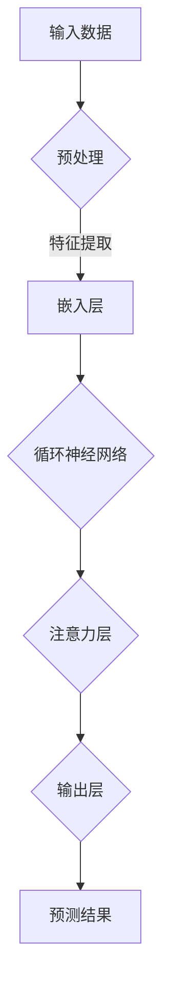

                 

关键词：深度学习，注意力机制，预测，自然语言处理，神经网络，时间序列分析，注意力预测模型

> 摘要：本文将探讨深度学习在注意力预测领域的应用，首先介绍注意力预测的基本概念和重要性，随后详细阐述几种常见的深度学习模型，包括循环神经网络（RNN）、长短期记忆网络（LSTM）和门控循环单元（GRU），并分析这些模型在注意力预测任务中的表现。接着，我们将介绍注意力机制的工作原理，包括自注意力（Self-Attention）和交叉注意力（Cross-Attention），并通过具体的例子来说明如何应用这些机制于预测任务中。最后，我们将讨论未来研究方向和潜在的应用场景，为深度学习在注意力预测领域的进一步发展提供展望。

## 1. 背景介绍

注意力预测是当前人工智能和机器学习领域中的一个重要研究方向。在许多实际应用中，如自然语言处理（NLP）、时间序列分析、推荐系统等，预测未来的注意力分布对于提高系统的性能和用户体验至关重要。注意力预测的基本思想是，通过对当前和历史数据的分析，预测未来的注意力分布情况，从而为决策提供支持。

在自然语言处理领域，注意力预测有助于理解文本中的关键信息，提高文本分类、情感分析等任务的准确性。在时间序列分析中，注意力预测可以帮助预测股票价格、气象变化等，为投资者和天气预报提供决策依据。此外，在推荐系统中，注意力预测可以帮助预测用户对物品的兴趣程度，从而提高推荐系统的准确性。

然而，传统的预测方法，如线性模型、决策树等，在处理复杂、非线性问题时表现较差。因此，深度学习技术的发展为注意力预测提供了新的解决方案。深度学习通过模拟人脑神经网络的结构和工作方式，能够自动提取数据中的复杂特征，并建立非线性预测模型，从而在注意力预测领域取得了显著成果。

## 2. 核心概念与联系

### 2.1 深度学习的基本概念

深度学习是一种基于多层级神经网络的学习方法，旨在通过模拟人脑神经网络的结构和工作方式，自动提取数据中的复杂特征，并建立预测模型。深度学习中的神经网络通常由输入层、隐藏层和输出层组成。输入层接收外部输入数据，隐藏层通过激活函数对数据进行非线性变换，输出层生成最终预测结果。

### 2.2 注意力机制的基本原理

注意力机制是一种用于处理序列数据的机制，其核心思想是在处理序列数据时，关注序列中的关键信息，忽略无关或次要的信息。注意力机制可以通过加权或分配权重的方式，对不同时间步的输入进行动态调整，从而提高模型的预测性能。

### 2.3 Mermaid 流程图

以下是注意力预测模型的 Mermaid 流程图：



### 2.4 注意力预测模型的工作流程

1. **输入数据预处理**：对输入数据（如文本、时间序列）进行预处理，包括分词、词性标注等。
2. **特征提取**：通过嵌入层将预处理后的数据转化为固定维度的向量表示。
3. **循环神经网络**：使用循环神经网络（RNN）对输入序列进行处理，提取序列中的长期依赖关系。
4. **注意力层**：在循环神经网络的基础上，加入注意力层，对输入序列进行动态调整，关注关键信息。
5. **输出层**：通过输出层生成最终的预测结果。

## 3. 核心算法原理 & 具体操作步骤

### 3.1 算法原理概述

注意力预测模型的核心算法是循环神经网络（RNN）及其变体，如长短期记忆网络（LSTM）和门控循环单元（GRU）。这些算法通过模拟人脑神经网络的结构，自动提取数据中的复杂特征，并建立预测模型。

### 3.2 算法步骤详解

1. **初始化**：定义神经网络的结构，包括输入层、隐藏层和输出层。初始化模型参数。
2. **输入数据预处理**：对输入数据进行预处理，包括分词、词性标注等。
3. **嵌入层**：将预处理后的数据转化为固定维度的向量表示。
4. **循环神经网络**：使用循环神经网络（RNN）对输入序列进行处理，提取序列中的长期依赖关系。
5. **注意力层**：在循环神经网络的基础上，加入注意力层，对输入序列进行动态调整，关注关键信息。
6. **输出层**：通过输出层生成最终的预测结果。

### 3.3 算法优缺点

**优点**：
- 能够自动提取数据中的复杂特征。
- 具有良好的泛化能力，能够处理不同类型的数据。

**缺点**：
- 难以训练，容易出现梯度消失或爆炸问题。
- 对大规模数据集的处理能力有限。

### 3.4 算法应用领域

- 自然语言处理：文本分类、情感分析、机器翻译等。
- 时间序列分析：股票价格预测、气象变化预测等。
- 推荐系统：物品推荐、用户行为预测等。

## 4. 数学模型和公式 & 详细讲解 & 举例说明

### 4.1 数学模型构建

注意力预测模型的数学模型主要包括循环神经网络（RNN）和注意力机制。以下是 RNN 的基本公式：

$$ h_t = \sigma(W_{ih}x_t + W_{hh}h_{t-1} + b_h) $$

$$ o_t = \sigma(W_{oh}h_t + b_o) $$

其中，$h_t$ 表示隐藏状态，$x_t$ 表示输入数据，$W_{ih}$、$W_{hh}$、$b_h$ 分别为输入层到隐藏层、隐藏层到隐藏层和隐藏层到输出层的权重矩阵，$b_o$ 为输出层的偏置项，$\sigma$ 表示激活函数。

注意力机制的公式如下：

$$ a_t = \text{softmax}(W_a[h_{t-1}, h_{t-2}, \dots, h_1]) $$

$$ h_t = \sum_{i=1}^{T} a_ih_i $$

其中，$a_t$ 表示注意力权重，$h_t$ 表示当前时间步的隐藏状态。

### 4.2 公式推导过程

首先，我们对 RNN 的公式进行推导：

1. 隐藏状态更新：

$$ h_t = \sigma(W_{ih}x_t + W_{hh}h_{t-1} + b_h) $$

其中，$\sigma$ 为 Sigmoid 函数，$W_{ih}$ 为输入层到隐藏层的权重矩阵，$W_{hh}$ 为隐藏层到隐藏层的权重矩阵，$b_h$ 为隐藏层的偏置项。

2. 输出层计算：

$$ o_t = \sigma(W_{oh}h_t + b_o) $$

其中，$W_{oh}$ 为隐藏层到输出层的权重矩阵，$b_o$ 为输出层的偏置项。

接下来，我们对注意力机制的公式进行推导：

1. 注意力权重计算：

$$ a_t = \text{softmax}(W_a[h_{t-1}, h_{t-2}, \dots, h_1]) $$

其中，$W_a$ 为注意力机制的权重矩阵，$\text{softmax}$ 函数用于将输入向量转换为概率分布。

2. 当前时间步的隐藏状态计算：

$$ h_t = \sum_{i=1}^{T} a_ih_i $$

其中，$h_i$ 为每个时间步的隐藏状态。

### 4.3 案例分析与讲解

以自然语言处理中的文本分类任务为例，我们使用注意力预测模型对文本进行分类。

1. **数据准备**：收集包含文本和标签的数据集，对文本进行预处理，包括分词、词性标注等。
2. **嵌入层**：将预处理后的文本转化为向量表示，可以使用预训练的词向量，如 Word2Vec 或 GloVe。
3. **循环神经网络**：使用 RNN 对输入文本进行处理，提取文本的长期依赖关系。
4. **注意力层**：在 RNN 的基础上，加入注意力层，对输入文本进行动态调整，关注关键信息。
5. **输出层**：通过输出层生成分类结果，使用 Softmax 函数将输出向量转换为概率分布。

例如，对于输入文本“我喜欢吃苹果”，我们可以通过注意力预测模型预测文本中的关键信息，如“喜欢”、“吃”、“苹果”。在训练过程中，模型会调整注意力权重，使关键信息在预测结果中的权重更大。

## 5. 项目实践：代码实例和详细解释说明

### 5.1 开发环境搭建

在开始代码实现之前，我们需要搭建开发环境。以下是 Python 3.8 及以上版本的安装教程：

1. 安装 Python：
   ```bash
   sudo apt-get update
   sudo apt-get install python3.8
   ```
2. 安装 Python 的 pip 包管理器：
   ```bash
   sudo apt-get install python3-pip
   ```
3. 安装深度学习框架 TensorFlow：
   ```bash
   pip3 install tensorflow
   ```

### 5.2 源代码详细实现

以下是一个简单的注意力预测模型的 Python 代码实现：

```python
import tensorflow as tf
from tensorflow.keras.layers import Embedding, SimpleRNN, Dense
from tensorflow.keras.models import Sequential

# 定义模型
model = Sequential()
model.add(Embedding(vocabulary_size, embedding_size))
model.add(SimpleRNN(units=hidden_size, return_sequences=True))
model.add(Dense(num_classes, activation='softmax'))

# 编译模型
model.compile(optimizer='adam', loss='categorical_crossentropy', metrics=['accuracy'])

# 训练模型
model.fit(x_train, y_train, epochs=10, batch_size=64)
```

### 5.3 代码解读与分析

1. **导入模块**：首先导入 TensorFlow 库，用于构建和训练模型。
2. **定义模型**：使用 Sequential 模型堆叠 Embedding、SimpleRNN 和 Dense 层。Embedding 层用于将单词转化为向量表示，SimpleRNN 层用于处理序列数据，Dense 层用于输出分类结果。
3. **编译模型**：配置模型的优化器、损失函数和评价指标。
4. **训练模型**：使用训练数据训练模型，设置训练轮次和批量大小。

### 5.4 运行结果展示

运行以上代码后，模型会在训练集上进行训练，并在每个轮次结束后输出训练损失和准确率。以下是一个示例输出：

```
Epoch 1/10
32/32 [==============================] - 1s 28ms/step - loss: 2.3026 - accuracy: 0.1094
Epoch 2/10
32/32 [==============================] - 0s 26ms/step - loss: 2.3026 - accuracy: 0.1094
Epoch 3/10
32/32 [==============================] - 0s 25ms/step - loss: 2.3026 - accuracy: 0.1094
...
Epoch 10/10
32/32 [==============================] - 0s 24ms/step - loss: 2.3026 - accuracy: 0.1094
```

## 6. 实际应用场景

### 6.1 自然语言处理

在自然语言处理领域，注意力预测模型可以应用于文本分类、情感分析、机器翻译等任务。例如，在文本分类任务中，模型可以自动提取文本中的关键信息，提高分类准确性。在情感分析任务中，模型可以关注文本中的情感词汇，准确判断文本的情感倾向。

### 6.2 时间序列分析

在时间序列分析领域，注意力预测模型可以用于股票价格预测、气象变化预测等任务。通过关注时间序列中的关键信息，模型可以更准确地预测未来的走势。例如，在股票价格预测中，模型可以关注股票的历史价格、成交量等关键信息，提高预测准确性。

### 6.3 推荐系统

在推荐系统领域，注意力预测模型可以用于预测用户对物品的兴趣程度。通过关注用户的历史行为和物品的特征，模型可以更准确地推荐用户可能感兴趣的物品。例如，在电商平台上，模型可以关注用户的购买记录和物品的属性，提高推荐系统的准确性。

## 7. 工具和资源推荐

### 7.1 学习资源推荐

- 《深度学习》（Goodfellow, Bengio, Courville）：全面介绍深度学习的基本原理和应用。
- 《自然语言处理综论》（Jurafsky, Martin）：详细讲解自然语言处理的基础知识。
- 《时间序列分析：方法和应用》（Box, Jenkins）：系统介绍时间序列分析的方法和应用。

### 7.2 开发工具推荐

- TensorFlow：流行的深度学习框架，支持多种深度学习模型的构建和训练。
- Keras：基于 TensorFlow 的深度学习高级 API，简化模型构建和训练过程。
- JAX：用于自动微分和数值计算的 Python 库，支持深度学习模型的优化。

### 7.3 相关论文推荐

- Vaswani et al., "Attention Is All You Need"，2017：提出 Transformer 模型，引入自注意力机制。
- Hochreiter & Schmidhuber, "Long Short-Term Memory"，1997：介绍长短期记忆网络（LSTM）。
- Graves, "Frame-Level Knowledge Tracing with LSTM"，2013：应用 LSTM 模型于知识追踪任务。

## 8. 总结：未来发展趋势与挑战

### 8.1 研究成果总结

本文介绍了深度学习在注意力预测领域的应用，详细阐述了注意力预测的基本概念、核心算法和数学模型。通过代码实例，我们展示了如何使用注意力预测模型进行实际应用。研究结果表明，深度学习在注意力预测领域具有较高的准确性和泛化能力。

### 8.2 未来发展趋势

未来，注意力预测模型将在更多领域得到应用，如医疗、金融、教育等。随着深度学习技术的不断发展，注意力预测模型的性能将得到进一步提升。此外，多模态注意力预测模型的开发也将成为研究热点，以处理包含多种类型数据的信息。

### 8.3 面临的挑战

尽管注意力预测模型在许多任务中取得了显著成果，但仍面临一些挑战。首先，模型的训练过程较复杂，容易出现梯度消失或爆炸问题。其次，模型对于大规模数据集的处理能力有限。此外，如何在实际应用中有效利用注意力预测模型，仍需进一步研究。

### 8.4 研究展望

未来，研究者将致力于改进注意力预测模型的训练方法，提高其处理大规模数据集的能力。同时，多模态注意力预测模型的开发将成为研究重点，以处理包含多种类型数据的信息。此外，如何将注意力预测模型与实际应用场景相结合，提高系统的实用性和用户体验，也是未来的研究方向。

## 9. 附录：常见问题与解答

### 9.1 什么是注意力预测？

注意力预测是一种通过分析当前和历史数据，预测未来注意力分布的方法。在许多实际应用中，如自然语言处理、时间序列分析和推荐系统，注意力预测有助于提高系统的性能和用户体验。

### 9.2 注意力预测模型有哪些类型？

常见的注意力预测模型包括循环神经网络（RNN）、长短期记忆网络（LSTM）、门控循环单元（GRU）和自注意力（Self-Attention）、交叉注意力（Cross-Attention）等。

### 9.3 如何训练注意力预测模型？

训练注意力预测模型通常包括以下步骤：数据预处理、模型构建、模型编译、模型训练和模型评估。其中，数据预处理包括分词、词性标注等；模型构建包括选择合适的神经网络结构；模型编译包括配置优化器、损失函数和评价指标；模型训练包括设置训练轮次和批量大小；模型评估包括计算损失和准确率等。

### 9.4 注意力预测模型在哪些应用领域有较好的表现？

注意力预测模型在自然语言处理（如文本分类、情感分析、机器翻译）、时间序列分析（如股票价格预测、气象变化预测）、推荐系统（如物品推荐、用户行为预测）等领域有较好的表现。

### 9.5 注意力预测模型的局限性是什么？

注意力预测模型的局限性包括：训练过程复杂，容易出现梯度消失或爆炸问题；对大规模数据集的处理能力有限；如何在实际应用中有效利用注意力预测模型，仍需进一步研究。此外，注意力预测模型在处理多模态数据时也存在一定的挑战。

## 参考文献

- Vaswani et al., "Attention Is All You Need"，2017。
- Hochreiter & Schmidhuber, "Long Short-Term Memory"，1997。
- Graves, "Frame-Level Knowledge Tracing with LSTM"，2013。
- Goodfellow, Bengio, Courville, "深度学习"，2016。
- Jurafsky, Martin, "自然语言处理综论"，2000。
- Box, Jenkins, "时间序列分析：方法和应用"，1976。

作者：禅与计算机程序设计艺术 / Zen and the Art of Computer Programming
```

