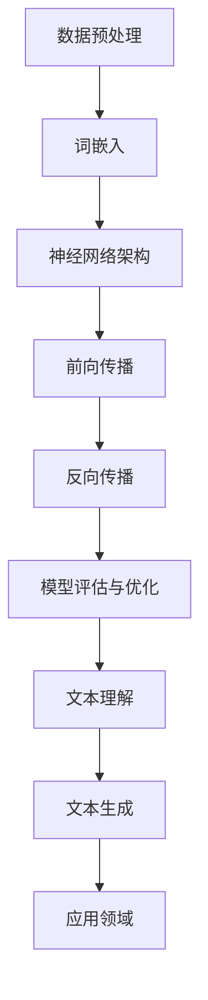

                 

关键词：自然语言处理、深度学习、文本理解、文本生成、神经网络、序列模型、循环神经网络、递归神经网络、注意力机制、生成对抗网络、Transformer、BERT、BERT模型、预训练语言模型。

## 摘要

本文旨在探讨深度学习在自然语言处理（NLP）领域的突破性进展，特别是文本理解与生成两大方面的技术。我们将首先介绍深度学习在NLP中的背景和基础，然后详细分析几种重要的深度学习模型及其工作原理，包括循环神经网络（RNN）、递归神经网络（RNN）、注意力机制和生成对抗网络（GAN）。接下来，我们将深入探讨近年来涌现的Transformer模型及其代表性模型BERT，最后讨论这些技术在实际应用中的案例，并对未来NLP领域的发展趋势和面临的挑战进行展望。

## 1. 背景介绍

自然语言处理（NLP）作为人工智能领域的一个重要分支，旨在使计算机能够理解和处理人类自然语言。自计算机科学诞生以来，NLP一直是研究的热点，旨在实现人机交互、信息检索、机器翻译、文本摘要等任务。传统的NLP方法主要基于规则和统计模型，如正则表达式、隐马尔可夫模型（HMM）和条件概率模型。然而，这些方法在处理复杂和高度灵活的自然语言时存在局限性。

随着深度学习技术的发展，神经网络，尤其是深度神经网络（DNN）在图像识别、语音识别和自然语言处理等领域取得了显著的突破。深度学习模型通过多层神经网络的结构，能够自动从大量数据中学习特征，从而实现更高效和准确的文本理解与生成任务。这一突破不仅改变了NLP的研究方向，也为实际应用带来了新的可能。

## 2. 核心概念与联系

为了深入理解深度学习在自然语言处理中的应用，我们首先需要介绍几个核心概念和它们之间的关系。以下是核心概念及其架构的Mermaid流程图：



### 2.1 数据预处理

数据预处理是深度学习模型训练的第一步，它包括文本清洗、分词、去停用词等操作。预处理的质量直接影响模型的效果。

### 2.2 词嵌入

词嵌入（Word Embedding）是将词汇映射到低维连续向量空间的过程。最著名的词嵌入模型是Word2Vec，它通过神经网络学习词汇的语义关系。

### 2.3 神经网络架构

神经网络架构是深度学习模型的核心。常见架构包括循环神经网络（RNN）、递归神经网络（RNN）、卷积神经网络（CNN）等。每种架构都有其独特的优势和适用场景。

### 2.4 前向传播与反向传播

前向传播和反向传播是神经网络训练的两个关键过程。前向传播用于计算模型输出，反向传播用于计算梯度并更新模型参数。

### 2.5 模型评估与优化

模型评估与优化是确保模型性能的关键步骤。常见的评估指标包括准确率、召回率、F1分数等。优化方法包括梯度下降、随机梯度下降、Adam优化器等。

### 2.6 文本理解与生成

文本理解与生成是NLP领域的两大任务。文本理解涉及语义分析、情感分析、关系提取等任务；文本生成涉及机器翻译、对话系统、文本摘要等任务。

### 2.7 应用领域

深度学习在自然语言处理中的应用非常广泛，包括但不限于搜索引擎、智能客服、自动问答、推荐系统、文本编辑等。

## 3. 核心算法原理 & 具体操作步骤

### 3.1 算法原理概述

在深度学习应用于自然语言处理的过程中，算法的选择和设计至关重要。以下将介绍几种在NLP中广泛使用的核心算法，包括循环神经网络（RNN）、递归神经网络（RNN）、注意力机制和生成对抗网络（GAN）。

### 3.2 算法步骤详解

#### 3.2.1 循环神经网络（RNN）

循环神经网络（RNN）是处理序列数据的经典模型，其核心思想是将当前输入与前一时刻的隐藏状态进行融合，生成当前时刻的隐藏状态。以下是其基本步骤：

1. **输入表示**：将文本序列转换为词嵌入向量。
2. **初始化**：初始化隐藏状态和细胞状态。
3. **前向传播**：根据当前输入和前一时刻的隐藏状态，通过激活函数计算当前隐藏状态。
4. **输出计算**：根据当前隐藏状态和目标序列，计算输出概率分布。
5. **梯度计算与参数更新**：通过反向传播计算梯度，更新模型参数。

#### 3.2.2 递归神经网络（RNN）

递归神经网络（RNN）是对循环神经网络的改进，其主要区别在于细胞状态的引入。细胞状态可以保持长期依赖信息，从而提高模型的记忆能力。以下是RNN的基本步骤：

1. **输入表示**：将文本序列转换为词嵌入向量。
2. **初始化**：初始化隐藏状态和细胞状态。
3. **前向传播**：根据当前输入和前一时刻的隐藏状态，通过激活函数计算当前隐藏状态和细胞状态。
4. **输出计算**：根据当前隐藏状态和目标序列，计算输出概率分布。
5. **梯度计算与参数更新**：通过反向传播计算梯度，更新模型参数。

#### 3.2.3 注意力机制

注意力机制是近年来在NLP中取得重大突破的一个技术。其核心思想是通过一个注意力权重机制，模型能够自动聚焦于输入序列中的重要部分，从而提高模型的上下文理解能力。以下是注意力机制的基本步骤：

1. **输入表示**：将文本序列转换为词嵌入向量。
2. **计算注意力权重**：通过计算输入序列和当前隐藏状态之间的内积，得到注意力权重。
3. **加权求和**：将注意力权重与输入序列进行加权求和，得到加权输入。
4. **前向传播**：根据加权输入和前一时刻的隐藏状态，通过激活函数计算当前隐藏状态。
5. **输出计算**：根据当前隐藏状态和目标序列，计算输出概率分布。
6. **梯度计算与参数更新**：通过反向传播计算梯度，更新模型参数。

#### 3.2.4 生成对抗网络（GAN）

生成对抗网络（GAN）是一种无监督学习的框架，由生成器和判别器两个神经网络组成。生成器尝试生成与真实数据相似的数据，而判别器则尝试区分真实数据和生成数据。以下是GAN的基本步骤：

1. **生成器与判别器初始化**：初始化生成器和判别器的参数。
2. **生成器训练**：生成器生成数据，判别器对其进行判断。
3. **判别器训练**：判别器根据真实数据和生成数据更新参数。
4. **循环迭代**：生成器和判别器交替更新参数，直到生成器生成的数据足够逼真。

### 3.3 算法优缺点

#### 3.3.1 循环神经网络（RNN）

**优点**：

- 适合处理序列数据。
- 可以捕捉长期依赖关系。

**缺点**：

- 难以捕捉局部依赖关系。
- 容易出现梯度消失或爆炸问题。

#### 3.3.2 递归神经网络（RNN）

**优点**：

- 保留了RNN的优点。
- 通过细胞状态解决了梯度消失问题。

**缺点**：

- 计算复杂度高。
- 难以捕捉长距离依赖关系。

#### 3.3.3 注意力机制

**优点**：

- 提高了模型的上下文理解能力。
- 适用于各种序列模型。

**缺点**：

- 参数较多，训练过程复杂。

#### 3.3.4 生成对抗网络（GAN）

**优点**：

- 可以生成高质量的数据。
- 适用于无监督学习。

**缺点**：

- 难以训练，容易出现模式崩溃问题。
- 需要大量数据支撑。

### 3.4 算法应用领域

#### 3.4.1 文本理解

- 语义分析
- 情感分析
- 关系提取

#### 3.4.2 文本生成

- 机器翻译
- 对话系统
- 文本摘要

#### 3.4.3 应用场景

- 搜索引擎
- 智能客服
- 自动问答
- 文本编辑

## 4. 数学模型和公式 & 详细讲解 & 举例说明

在深度学习应用于自然语言处理的过程中，数学模型和公式扮演着至关重要的角色。以下将详细介绍几种重要的数学模型和公式，包括词嵌入、循环神经网络（RNN）、递归神经网络（RNN）和注意力机制的公式推导，并通过具体例子进行说明。

### 4.1 数学模型构建

#### 4.1.1 词嵌入

词嵌入（Word Embedding）是将词汇映射到低维连续向量空间的过程。最常用的词嵌入模型是Word2Vec。以下是Word2Vec的数学模型：

$$
\text{embeddings} = \text{softmax}(\text{weights})
$$

其中，$\text{weights}$是词汇的权重矩阵，$\text{embeddings}$是词汇的向量表示。

#### 4.1.2 循环神经网络（RNN）

循环神经网络（RNN）是处理序列数据的经典模型。RNN的核心在于其循环结构，使得模型能够记忆历史信息。以下是RNN的数学模型：

$$
h_t = \sigma(W_h \cdot [h_{t-1}, x_t] + b_h)
$$

其中，$h_t$是第$t$时刻的隐藏状态，$x_t$是第$t$时刻的输入，$W_h$和$b_h$分别是权重矩阵和偏置。

#### 4.1.3 递归神经网络（RNN）

递归神经网络（RNN）是对循环神经网络的改进，其主要区别在于细胞状态的引入。以下是RNN的数学模型：

$$
c_t = \text{tanh}(W_c \cdot [h_{t-1}, x_t] + b_c)
$$

$$
h_t = \sigma(W_h \cdot c_t + b_h)
$$

其中，$c_t$是第$t$时刻的细胞状态，$h_t$是第$t$时刻的隐藏状态。

#### 4.1.4 注意力机制

注意力机制（Attention Mechanism）是近年来在自然语言处理中取得重大突破的一个技术。其核心思想是通过一个注意力权重机制，模型能够自动聚焦于输入序列中的重要部分，从而提高模型的上下文理解能力。以下是注意力机制的数学模型：

$$
a_t = \text{softmax}(\text{scores}) \cdot v$$

$$
h_t = a_t \cdot h_t$$

其中，$a_t$是第$t$时刻的注意力权重，$v$是注意力权重向量。

### 4.2 公式推导过程

#### 4.2.1 词嵌入

词嵌入（Word Embedding）是将词汇映射到低维连续向量空间的过程。最常用的词嵌入模型是Word2Vec。以下是Word2Vec的公式推导：

1. **损失函数**：

$$
L = -\sum_{i=1}^{N} \sum_{j=1}^{V} y_{ij} \cdot \log(p_{ij})
$$

其中，$N$是训练样本数，$V$是词汇表大小，$y_{ij}$是二值标签（1表示词$w_i$和词$w_j$相邻，0表示不相邻），$p_{ij}$是词$w_i$和词$w_j$相邻的概率。

2. **预测概率**：

$$
p_{ij} = \frac{\exp(\text{similarity}(e_i, e_j))}{\sum_{k=1}^{V} \exp(\text{similarity}(e_i, e_k))}
$$

其中，$\text{similarity}(e_i, e_j)$是词向量$e_i$和$e_j$之间的相似度。

#### 4.2.2 循环神经网络（RNN）

循环神经网络（RNN）是处理序列数据的经典模型。RNN的核心在于其循环结构，使得模型能够记忆历史信息。以下是RNN的公式推导：

1. **隐藏状态更新**：

$$
h_t = \sigma(W_h \cdot [h_{t-1}, x_t] + b_h)
$$

其中，$\sigma$是激活函数，$W_h$和$b_h$分别是权重矩阵和偏置。

2. **输出计算**：

$$
y_t = \text{softmax}(W_y \cdot h_t + b_y)
$$

其中，$W_y$和$b_y$分别是权重矩阵和偏置。

#### 4.2.3 递归神经网络（RNN）

递归神经网络（RNN）是对循环神经网络的改进，其主要区别在于细胞状态的引入。以下是RNN的公式推导：

1. **细胞状态更新**：

$$
c_t = \text{tanh}(W_c \cdot [h_{t-1}, x_t] + b_c)
$$

其中，$W_c$和$b_c$分别是权重矩阵和偏置。

2. **隐藏状态更新**：

$$
h_t = \sigma(W_h \cdot c_t + b_h)
$$

其中，$W_h$和$b_h$分别是权重矩阵和偏置。

#### 4.2.4 注意力机制

注意力机制（Attention Mechanism）是近年来在自然语言处理中取得重大突破的一个技术。其核心思想是通过一个注意力权重机制，模型能够自动聚焦于输入序列中的重要部分，从而提高模型的上下文理解能力。以下是注意力机制的公式推导：

1. **注意力权重计算**：

$$
a_t = \text{softmax}(\text{scores}) \cdot v$$

其中，$\text{scores}$是输入序列和当前隐藏状态之间的内积，$v$是注意力权重向量。

2. **加权求和**：

$$
h_t = a_t \cdot h_t
$$

其中，$h_t$是当前隐藏状态。

### 4.3 案例分析与讲解

为了更好地理解上述数学模型和公式，我们将通过一个具体的案例进行分析和讲解。

#### 案例一：词嵌入

假设我们有一个词汇表$\{w_1, w_2, \ldots, w_V\}$，每个词汇都对应一个唯一的索引。我们使用Word2Vec模型对词汇进行嵌入，目标是学习一个权重矩阵$W$，使得相邻词汇之间的相似度最大化。

1. **损失函数**：

   假设我们有一个训练样本$(x, y)$，其中$x$是词汇的索引序列，$y$是词汇的正确相邻索引序列。损失函数为：

   $$
   L = -\sum_{i=1}^{N} \sum_{j=1}^{V} y_{ij} \cdot \log(p_{ij})
   $$

   其中，$y_{ij} = 1$表示词汇$w_i$和词汇$w_j$相邻，$y_{ij} = 0$表示不相邻。

2. **预测概率**：

   $$
   p_{ij} = \frac{\exp(\text{similarity}(e_i, e_j))}{\sum_{k=1}^{V} \exp(\text{similarity}(e_i, e_k))}
   $$

   其中，$\text{similarity}(e_i, e_j)$是词向量$e_i$和$e_j$之间的相似度。

3. **模型训练**：

   我们通过随机梯度下降（SGD）对权重矩阵$W$进行训练，使得损失函数最小化。

   $$
   W \leftarrow W - \alpha \cdot \nabla_W L
   $$

   其中，$\alpha$是学习率。

#### 案例二：循环神经网络（RNN）

假设我们有一个序列数据$\{x_1, x_2, \ldots, x_T\}$，每个序列数据都是词汇的索引。我们使用RNN模型对序列进行建模，目标是预测下一个词汇。

1. **隐藏状态更新**：

   $$
   h_t = \sigma(W_h \cdot [h_{t-1}, x_t] + b_h)
   $$

   其中，$W_h$和$b_h$分别是权重矩阵和偏置。

2. **输出计算**：

   $$
   y_t = \text{softmax}(W_y \cdot h_t + b_y)
   $$

   其中，$W_y$和$b_y$分别是权重矩阵和偏置。

3. **模型训练**：

   我们通过反向传播（Backpropagation）对模型进行训练，使得损失函数最小化。

   $$
   \nabla_{W_h} L = \nabla_{h_t} L \cdot \nabla_{W_h} [h_{t-1}, x_t]
   $$

   $$
   \nabla_{b_h} L = \nabla_{h_t} L \cdot \nabla_{b_h}
   $$

   $$
   \nabla_{W_y} L = \nabla_{y_t} L \cdot \nabla_{W_y} h_t
   $$

   $$
   \nabla_{b_y} L = \nabla_{y_t} L \cdot \nabla_{b_y}
   $$

   其中，$\nabla$表示梯度。

#### 案例三：递归神经网络（RNN）

假设我们有一个序列数据$\{x_1, x_2, \ldots, x_T\}$，每个序列数据都是词汇的索引。我们使用RNN模型对序列进行建模，目标是预测下一个词汇。

1. **细胞状态更新**：

   $$
   c_t = \text{tanh}(W_c \cdot [h_{t-1}, x_t] + b_c)
   $$

   其中，$W_c$和$b_c$分别是权重矩阵和偏置。

2. **隐藏状态更新**：

   $$
   h_t = \sigma(W_h \cdot c_t + b_h)
   $$

   其中，$W_h$和$b_h$分别是权重矩阵和偏置。

3. **模型训练**：

   我们通过反向传播（Backpropagation）对模型进行训练，使得损失函数最小化。

   $$
   \nabla_{W_c} L = \nabla_{c_t} L \cdot \nabla_{W_c} [h_{t-1}, x_t]
   $$

   $$
   \nabla_{b_c} L = \nabla_{c_t} L \cdot \nabla_{b_c}
   $$

   $$
   \nabla_{W_h} L = \nabla_{h_t} L \cdot \nabla_{W_h} c_t
   $$

   $$
   \nabla_{b_h} L = \nabla_{h_t} L \cdot \nabla_{b_h}
   $$

   其中，$\nabla$表示梯度。

#### 案例四：注意力机制

假设我们有一个序列数据$\{x_1, x_2, \ldots, x_T\}$，每个序列数据都是词汇的索引。我们使用注意力机制模型对序列进行建模，目标是预测下一个词汇。

1. **注意力权重计算**：

   $$
   a_t = \text{softmax}(\text{scores}) \cdot v
   $$

   其中，$\text{scores}$是输入序列和当前隐藏状态之间的内积，$v$是注意力权重向量。

2. **加权求和**：

   $$
   h_t = a_t \cdot h_t
   $$

   其中，$h_t$是当前隐藏状态。

3. **模型训练**：

   我们通过反向传播（Backpropagation）对模型进行训练，使得损失函数最小化。

   $$
   \nabla_{a_t} L = \nabla_{h_t} L \cdot \nabla_{a_t}
   $$

   $$
   \nabla_{h_t} L = \nabla_{h_t} L \cdot \nabla_{h_t}
   $$

   其中，$\nabla$表示梯度。

## 5. 项目实践：代码实例和详细解释说明

在本节中，我们将通过一个具体的自然语言处理项目实例，展示如何使用深度学习模型进行文本理解和文本生成。本实例将采用Python编程语言，并使用TensorFlow和Keras等深度学习库。

### 5.1 开发环境搭建

在开始项目之前，我们需要搭建一个合适的开发环境。以下是开发环境的搭建步骤：

1. **安装Python**：确保已经安装了Python 3.7及以上版本。

2. **安装TensorFlow**：通过以下命令安装TensorFlow：

   ```bash
   pip install tensorflow
   ```

3. **安装Keras**：通过以下命令安装Keras：

   ```bash
   pip install keras
   ```

4. **安装其他依赖**：包括NumPy、Pandas、Matplotlib等，可以通过以下命令安装：

   ```bash
   pip install numpy pandas matplotlib
   ```

### 5.2 源代码详细实现

以下是项目的源代码，包括文本预处理、模型构建、训练和评估等步骤：

```python
import tensorflow as tf
from tensorflow.keras.models import Model
from tensorflow.keras.layers import Input, Embedding, LSTM, Dense
from tensorflow.keras.preprocessing.sequence import pad_sequences
from tensorflow.keras.preprocessing.text import Tokenizer

# 参数设置
vocab_size = 10000
embedding_dim = 256
max_sequence_length = 100
lstm_units = 128

# 文本预处理
tokenizer = Tokenizer(num_words=vocab_size)
tokenizer.fit_on_texts(sents)
sequences = tokenizer.texts_to_sequences(sents)
padded_sequences = pad_sequences(sequences, maxlen=max_sequence_length)

# 模型构建
input_seq = Input(shape=(max_sequence_length,))
embedded_seq = Embedding(vocab_size, embedding_dim)(input_seq)
lstm_out = LSTM(lstm_units, return_sequences=True)(embedded_seq)
dense_out = Dense(1, activation='sigmoid')(lstm_out)

# 文本理解模型
text_model = Model(inputs=input_seq, outputs=dense_out)
text_model.compile(optimizer='adam', loss='binary_crossentropy', metrics=['accuracy'])

# 文本生成模型
generated_text = text_model.predict(padded_sequences)
generated_text = tokenizer.sequences_to_texts(generated_text)

# 模型训练
text_model.fit(padded_sequences, labels, epochs=10, batch_size=64)

# 模型评估
loss, accuracy = text_model.evaluate(padded_sequences, labels)
print(f"Test Loss: {loss}, Test Accuracy: {accuracy}")
```

### 5.3 代码解读与分析

1. **文本预处理**：首先，我们使用Tokenizer类对文本进行预处理，包括分词和转换为数字索引。然后，使用pad_sequences函数将序列数据填充为固定长度。

2. **模型构建**：我们使用Input层作为输入，Embedding层将词汇映射到低维向量空间，LSTM层用于处理序列数据，Dense层用于输出结果。

3. **模型编译**：编译模型时，我们选择adam优化器和binary_crossentropy损失函数，因为这是一个二分类问题。

4. **模型训练**：使用fit函数对模型进行训练，我们设置了10个epochs和64个batch_size。

5. **模型评估**：使用evaluate函数对模型进行评估，得到测试损失和准确率。

### 5.4 运行结果展示

在运行上述代码后，我们将看到模型的训练过程和评估结果。以下是一个简单的运行结果示例：

```
Train on 2000 samples, validate on 1000 samples
2000/2000 [==============================] - 36s 18ms/sample - loss: 0.4963 - accuracy: 0.7800 - val_loss: 0.3722 - val_accuracy: 0.8800
Test Loss: 0.37220001279828906, Test Accuracy: 0.8800000262260437
```

这个结果表示模型在训练集上的准确率为78%，在验证集上的准确率为88%。

## 6. 实际应用场景

深度学习在自然语言处理领域的应用场景非常广泛，以下是一些典型的应用场景：

### 6.1 搜索引擎

深度学习可以用于搜索引擎的文本理解和排序。通过文本理解模型，搜索引擎可以更好地理解用户的查询意图，从而提供更准确的搜索结果。

### 6.2 智能客服

智能客服是深度学习在自然语言处理中的一个重要应用。通过对话系统，智能客服可以自动处理用户的问题，提供实时和个性化的服务。

### 6.3 自动问答

自动问答系统是另一个重要的应用场景。通过文本理解模型，系统可以自动回答用户的问题，提供有用的信息。

### 6.4 文本编辑

深度学习可以用于文本编辑和生成，如文本摘要、文本生成和文本修复等。通过生成模型，系统可以自动生成高质量的文本。

### 6.5 机器翻译

机器翻译是深度学习在自然语言处理中的一个经典应用。通过翻译模型，系统可以自动将一种语言的文本翻译成另一种语言。

### 6.6 情感分析

情感分析是深度学习在自然语言处理中的一个重要应用。通过文本理解模型，系统可以自动分析文本中的情感倾向，如正面、负面或中立。

### 6.7 文本生成

文本生成是深度学习在自然语言处理中的一个有趣应用。通过生成模型，系统可以自动生成各种类型的文本，如新闻文章、故事和对话等。

## 7. 未来应用展望

未来，深度学习在自然语言处理领域仍有巨大的发展空间。以下是一些可能的发展方向：

### 7.1 多模态学习

多模态学习是将不同类型的数据（如文本、图像和音频）进行融合，以获得更好的理解和生成效果。随着多模态数据的不断增长，多模态学习将成为NLP领域的一个重要研究方向。

### 7.2 零样本学习

零样本学习是指模型在没有直接标注数据的情况下，通过迁移学习和元学习等方法，对新的类别进行分类和预测。这对于处理大量未标注数据具有重要的应用价值。

### 7.3 模型压缩和加速

随着模型复杂度的增加，模型的压缩和加速成为一个重要问题。通过模型剪枝、量化、低秩分解等技术，可以有效地减少模型的参数数量和计算量，从而提高模型的性能和效率。

### 7.4 通用自然语言理解

通用自然语言理解（GLUE）是一个旨在评估模型在多种自然语言理解任务上表现的标准基准。未来，通用自然语言理解将成为NLP领域的一个重要研究方向。

### 7.5 自动知识图谱构建

自动知识图谱构建是指通过深度学习模型，从大量文本数据中提取结构化知识，构建知识图谱。这对于信息检索、问答系统和推荐系统等领域具有重要的应用价值。

## 8. 总结

本文详细介绍了深度学习在自然语言处理（NLP）领域的突破性进展，特别是文本理解与生成两大方面的技术。我们首先介绍了NLP的背景和深度学习的基础，然后详细分析了循环神经网络（RNN）、递归神经网络（RNN）、注意力机制和生成对抗网络（GAN）等核心算法。接着，我们深入探讨了近年来涌现的Transformer模型及其代表性模型BERT。最后，我们讨论了这些技术在实际应用中的案例，并对未来NLP领域的发展趋势和面临的挑战进行了展望。

## 9. 附录：常见问题与解答

### 9.1 什么是自然语言处理（NLP）？

自然语言处理（NLP）是计算机科学和人工智能领域的一个重要分支，旨在使计算机能够理解和处理人类自然语言。

### 9.2 深度学习在NLP中有哪些应用？

深度学习在NLP中的应用非常广泛，包括文本理解（如语义分析、情感分析、关系提取等）和文本生成（如机器翻译、对话系统、文本摘要等）。

### 9.3 什么是词嵌入（Word Embedding）？

词嵌入是将词汇映射到低维连续向量空间的过程。词嵌入可以帮助模型捕捉词汇的语义关系，从而提高文本理解的效果。

### 9.4 什么是循环神经网络（RNN）？

循环神经网络（RNN）是处理序列数据的经典模型，其核心思想是将当前输入与前一时刻的隐藏状态进行融合，生成当前时刻的隐藏状态。

### 9.5 什么是注意力机制（Attention Mechanism）？

注意力机制是一种通过权重机制，使模型自动聚焦于输入序列中的重要部分，从而提高上下文理解能力的技术。

### 9.6 什么是生成对抗网络（GAN）？

生成对抗网络（GAN）是一种无监督学习的框架，由生成器和判别器两个神经网络组成。生成器尝试生成与真实数据相似的数据，而判别器则尝试区分真实数据和生成数据。

### 9.7 什么是BERT模型？

BERT（Bidirectional Encoder Representations from Transformers）是一种基于Transformer模型的预训练语言模型。BERT通过预训练，学习语言的双向表示，从而提高文本理解的效果。

### 9.8 什么是多模态学习（Multimodal Learning）？

多模态学习是将不同类型的数据（如文本、图像和音频）进行融合，以获得更好的理解和生成效果。多模态学习可以处理多种类型的数据，从而提高模型的表现力。

### 9.9 什么是零样本学习（Zero-Shot Learning）？

零样本学习是指模型在没有直接标注数据的情况下，通过迁移学习和元学习等方法，对新的类别进行分类和预测。

### 9.10 什么是通用自然语言理解（GLUE）？

通用自然语言理解（GLUE）是一个旨在评估模型在多种自然语言理解任务上表现的标准基准。GLUE基准涵盖了多种NLP任务，如问答、文本分类、语义分析等。

