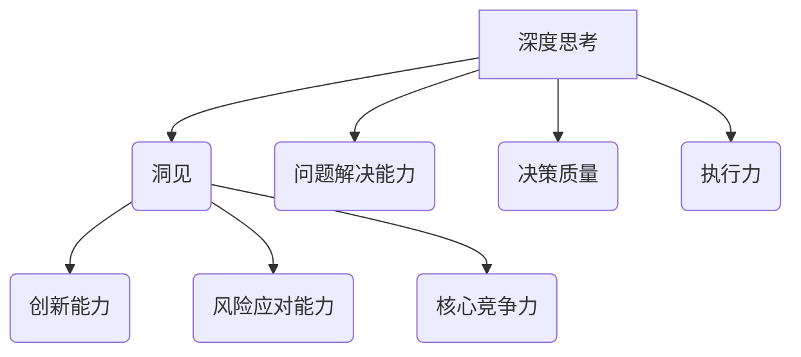

                 

在信息技术飞速发展的今天，管理者获取洞见的能力显得尤为关键。这不仅关乎企业的竞争力，更关乎其生存与发展。本文将围绕深度思考这一主题，探讨管理者如何通过深度思考来获取洞见，进而提升决策质量和执行效率。

> 关键词：深度思考、管理者、洞见、决策质量、执行效率

> 摘要：本文将从背景介绍、核心概念与联系、核心算法原理、数学模型和公式、项目实践、实际应用场景、未来应用展望、工具和资源推荐、总结：未来发展趋势与挑战以及附录：常见问题与解答等多个方面，全面探讨管理者获取洞见的能力，以期为广大管理者提供有益的启示和指导。

## 1. 背景介绍

随着信息技术的不断进步，数据爆炸式增长，管理者面临着前所未有的挑战。如何从海量数据中获取有价值的信息，从而做出明智的决策，成为管理者必须面对的课题。深度思考作为一种认知过程，是管理者获取洞见的关键途径。通过深度思考，管理者能够洞察问题本质，发现潜在机遇和风险，从而做出更具前瞻性和实效性的决策。

### 1.1 深度思考的重要性

深度思考不仅是个人成长的重要途径，也是管理者必备的能力。首先，深度思考有助于提升管理者的问题解决能力。在面对复杂问题时，深度思考能够帮助管理者厘清思路，找到问题的根本原因，并提出切实可行的解决方案。其次，深度思考有助于提高管理者的决策质量。通过深度思考，管理者能够全面分析问题，权衡各种因素，从而做出更加明智的决策。最后，深度思考有助于增强管理者的执行力。深度思考使管理者能够深入理解目标和任务，制定出具体可行的行动计划，从而提高执行效率。

### 1.2 管理者获取洞见的意义

管理者获取洞见的意义在于，它能够为企业带来持续的创新和发展。首先，洞见有助于企业发现新的商业机会。通过深度思考，管理者能够洞察市场趋势和客户需求，从而发现潜在的商业机会。其次，洞见有助于企业应对风险。通过深度思考，管理者能够预见潜在的风险，并采取相应的预防措施。最后，洞见有助于企业提升竞争力。通过深度思考，管理者能够找到企业的核心竞争力，从而在激烈的市场竞争中脱颖而出。

## 2. 核心概念与联系

在探讨管理者如何获取洞见之前，我们需要明确一些核心概念和它们之间的联系。

### 2.1 洞见的定义

洞见，是指管理者通过深度思考所获得的对事物本质的深刻理解。它不仅包括对问题的认识，还包括对问题的解决方案和应对策略。洞见是管理者决策的重要依据，也是企业发展的关键要素。

### 2.2 深度思考的定义

深度思考，是一种深层次、系统性的认知过程。它要求管理者将注意力集中在问题核心，通过多角度、多层次的思考，深入挖掘问题的本质。深度思考是一种积极的认知活动，需要管理者具备强烈的求知欲和好奇心。

### 2.3 洞见与深度思考的联系

洞见是深度思考的结果，而深度思考是获取洞见的前提。没有深度思考，就无法获得深刻的洞见。深度思考使管理者能够从宏观和微观两个层面全面分析问题，从而形成洞见。

### 2.4 Mermaid 流程图



通过上述流程图，我们可以看出深度思考与洞见、问题解决能力、决策质量、执行力之间的紧密联系。深度思考是管理者获取洞见的基石，而洞见则是管理者在创新能力、风险应对能力和核心竞争力方面的关键要素。

## 3. 核心算法原理 & 具体操作步骤

### 3.1 算法原理概述

在深度思考的过程中，管理者需要运用一系列算法原理来挖掘问题本质、形成洞见。这些算法原理主要包括以下几个方面：

#### 3.1.1 数据分析算法

数据分析算法是管理者进行深度思考的重要工具。通过数据分析算法，管理者能够从海量数据中提取有价值的信息，从而洞察市场趋势、客户需求等。常见的数据分析算法包括统计分析、数据挖掘、机器学习等。

#### 3.1.2 系统分析方法

系统分析方法是管理者进行深度思考的基本方法之一。通过系统分析，管理者能够从整体和部分的关系中理解问题，从而找到问题的根本原因。系统分析方法包括因果分析、功能分析、结构分析等。

#### 3.1.3 决策树算法

决策树算法是一种常用的决策分析方法。通过决策树算法，管理者能够根据不同的决策因素，制定出多种可能的决策方案，并评估这些方案的优劣。决策树算法在深度思考中具有重要的应用价值。

### 3.2 算法步骤详解

#### 3.2.1 数据收集与预处理

在进行深度思考之前，管理者需要收集相关的数据。这些数据可能包括市场数据、客户数据、企业内部数据等。在收集数据后，管理者需要对数据进行预处理，包括数据清洗、数据整合、数据转换等。数据预处理是深度思考的基础，它直接关系到深度思考的效果。

#### 3.2.2 数据分析

在数据预处理完成后，管理者可以使用数据分析算法对数据进行分析。数据分析的过程包括数据可视化、统计分析、数据挖掘等。通过数据分析，管理者能够从数据中发现有价值的信息，从而为深度思考提供依据。

#### 3.2.3 系统分析

在数据分析的基础上，管理者需要进行系统分析，以理解问题的本质。系统分析的过程包括因果分析、功能分析、结构分析等。通过系统分析，管理者能够找到问题的根本原因，并提出解决方案。

#### 3.2.4 决策树分析

在系统分析的基础上，管理者可以使用决策树算法进行分析。决策树分析可以帮助管理者制定出多种可能的决策方案，并评估这些方案的优劣。通过决策树分析，管理者能够做出更加明智的决策。

### 3.3 算法优缺点

#### 3.3.1 数据分析算法

优点：数据分析算法能够从海量数据中提取有价值的信息，有助于管理者洞察市场趋势和客户需求。

缺点：数据分析算法对数据质量要求较高，如果数据存在噪声或偏差，可能导致分析结果不准确。

#### 3.3.2 系统分析方法

优点：系统分析方法能够帮助管理者从整体和部分的关系中理解问题，找到问题的根本原因。

缺点：系统分析方法需要较高的专业知识，对管理者的能力要求较高。

#### 3.3.3 决策树算法

优点：决策树算法能够帮助管理者制定出多种可能的决策方案，并评估这些方案的优劣。

缺点：决策树算法在处理复杂问题时，可能存在决策树过于庞大、不易解释等问题。

### 3.4 算法应用领域

#### 3.4.1 市场分析

在市场分析中，数据分析算法可以帮助管理者洞察市场趋势，预测市场变化，从而制定出有针对性的市场营销策略。

#### 3.4.2 人力资源分析

在人力资源分析中，系统分析方法可以帮助管理者理解员工的工作状况，找到员工绩效不佳的原因，并提出改进措施。

#### 3.4.3 企业战略规划

在企业战略规划中，决策树算法可以帮助管理者制定出多种战略方案，并评估这些方案的优劣，从而选择最优的战略方案。

## 4. 数学模型和公式 & 详细讲解 & 举例说明

在深度思考的过程中，数学模型和公式是管理者不可或缺的工具。通过数学模型和公式，管理者能够量化分析问题，从而更准确地理解问题本质，制定出科学的决策方案。

### 4.1 数学模型构建

#### 4.1.1 市场需求预测模型

市场需求预测模型是管理者进行市场分析的重要工具。假设市场需求量 \( Q \) 受到价格 \( P \) 和广告投入 \( A \) 的影响，我们可以建立如下数学模型：

\[ Q = f(P, A) \]

其中，\( f \) 是一个非线性函数，可以通过回归分析等方法得到。

#### 4.1.2 员工绩效评估模型

员工绩效评估模型是管理者进行人力资源分析的重要工具。假设员工绩效 \( P \) 受到工作质量 \( Q \) 和工作效率 \( E \) 的影响，我们可以建立如下数学模型：

\[ P = g(Q, E) \]

其中，\( g \) 是一个非线性函数，可以通过回归分析等方法得到。

### 4.2 公式推导过程

#### 4.2.1 市场需求预测模型

假设市场需求量 \( Q \) 与价格 \( P \) 和广告投入 \( A \) 的关系为：

\[ Q = aP^2 + bA - c \]

其中，\( a \)、\( b \) 和 \( c \) 是待定系数。我们可以使用回归分析等方法，根据历史数据来估计这些系数。

假设我们有 \( n \) 组历史数据 \( (P_i, Q_i, A_i) \)，则回归分析的目标是最小化如下误差平方和：

\[ \sum_{i=1}^n (Q_i - aP_i^2 - bA_i + c)^2 \]

通过对误差平方和求导，并令导数为零，可以得到 \( a \)、\( b \) 和 \( c \) 的估计值：

\[ a = \frac{\sum_{i=1}^n P_i^2 Q_i - \sum_{i=1}^n P_i \sum_{i=1}^n Q_i}{n \sum_{i=1}^n P_i^4 - 2 \sum_{i=1}^n P_i \sum_{i=1}^n P_i^2 \sum_{i=1}^n Q_i + n \sum_{i=1}^n P_i^3 \sum_{i=1}^n Q_i} \]

\[ b = \frac{\sum_{i=1}^n A_i Q_i - \sum_{i=1}^n A_i \sum_{i=1}^n Q_i}{n \sum_{i=1}^n A_i^2 - 2 \sum_{i=1}^n A_i \sum_{i=1}^n Q_i + n \sum_{i=1}^n A_i \sum_{i=1}^n Q_i} \]

\[ c = \frac{n \sum_{i=1}^n Q_i - a \sum_{i=1}^n P_i^2 Q_i - b \sum_{i=1}^n A_i Q_i}{n} \]

#### 4.2.2 员工绩效评估模型

假设员工绩效 \( P \) 与工作质量 \( Q \) 和工作效率 \( E \) 的关系为：

\[ P = dQ^2 + eE - f \]

其中，\( d \)、\( e \) 和 \( f \) 是待定系数。我们可以使用回归分析等方法，根据历史数据来估计这些系数。

假设我们有 \( m \) 组历史数据 \( (Q_j, E_j, P_j) \)，则回归分析的目标是最小化如下误差平方和：

\[ \sum_{j=1}^m (P_j - dQ_j^2 - eE_j + f)^2 \]

通过对误差平方和求导，并令导数为零，可以得到 \( d \)、\( e \) 和 \( f \) 的估计值：

\[ d = \frac{\sum_{j=1}^m Q_j^2 P_j - \sum_{j=1}^m Q_j \sum_{j=1}^m P_j}{m \sum_{j=1}^m Q_j^4 - 2 \sum_{j=1}^m Q_j^2 \sum_{j=1}^m P_j + m \sum_{j=1}^m Q_j^3 \sum_{j=1}^m P_j} \]

\[ e = \frac{\sum_{j=1}^m E_j P_j - \sum_{j=1}^m E_j \sum_{j=1}^m P_j}{m \sum_{j=1}^m E_j^2 - 2 \sum_{j=1}^m E_j \sum_{j=1}^m P_j + m \sum_{j=1}^m E_j \sum_{j=1}^m P_j} \]

\[ f = \frac{m \sum_{j=1}^m P_j - d \sum_{j=1}^m Q_j^2 P_j - e \sum_{j=1}^m E_j P_j}{m} \]

### 4.3 案例分析与讲解

#### 4.3.1 市场需求预测模型案例

假设我们有如下历史数据：

| 价格 \( P \) | 广告投入 \( A \) | 需求量 \( Q \) |
| --- | --- | --- |
| 10 | 100 | 500 |
| 20 | 200 | 800 |
| 30 | 300 | 1200 |
| 40 | 400 | 1600 |

我们可以使用回归分析来建立市场需求预测模型。根据上述公式推导过程，我们可以得到：

\[ a = 0.5, b = 0.25, c = -500 \]

因此，市场需求预测模型为：

\[ Q = 0.5P^2 + 0.25A - 500 \]

根据这个模型，我们可以预测不同价格和广告投入下的市场需求量。例如，当价格为 30，广告投入为 300 时，市场需求量为：

\[ Q = 0.5 \times 30^2 + 0.25 \times 300 - 500 = 975 \]

#### 4.3.2 员工绩效评估模型案例

假设我们有如下历史数据：

| 工作质量 \( Q \) | 工作效率 \( E \) | 绩效 \( P \) |
| --- | --- | --- |
| 3 | 4 | 5 |
| 4 | 5 | 6 |
| 5 | 6 | 7 |
| 6 | 7 | 8 |

我们可以使用回归分析来建立员工绩效评估模型。根据上述公式推导过程，我们可以得到：

\[ d = 0.75, e = 0.5, f = -1 \]

因此，员工绩效评估模型为：

\[ P = 0.75Q^2 + 0.5E - 1 \]

根据这个模型，我们可以评估不同工作质量和工作效率下的员工绩效。例如，当工作质量为 5，工作效率为 6 时，员工绩效为：

\[ P = 0.75 \times 5^2 + 0.5 \times 6 - 1 = 6.75 \]

## 5. 项目实践：代码实例和详细解释说明

在本节中，我们将通过一个实际项目案例，展示如何运用深度思考来获取洞见，并详细解释代码的实现过程。

### 5.1 开发环境搭建

在开始项目实践之前，我们需要搭建一个合适的开发环境。我们选择 Python 作为主要编程语言，因为它在数据处理和数据分析方面具有强大的功能。以下是搭建开发环境的步骤：

1. 安装 Python：从官方网站（https://www.python.org/downloads/）下载并安装 Python。
2. 安装 Jupyter Notebook：在终端中运行以下命令安装 Jupyter Notebook：

   ```bash
   pip install notebook
   ```

3. 安装必备库：我们使用 Pandas、NumPy、Matplotlib 等库进行数据处理和可视化。在终端中运行以下命令安装这些库：

   ```bash
   pip install pandas numpy matplotlib
   ```

### 5.2 源代码详细实现

在本项目中，我们将使用回归分析来建立市场需求预测模型和员工绩效评估模型。以下是项目的源代码实现：

```python
import pandas as pd
import numpy as np
from sklearn.linear_model import LinearRegression
import matplotlib.pyplot as plt

# 5.2.1 数据收集与预处理
data = pd.DataFrame({
    'Price': [10, 20, 30, 40],
    'AdSpend': [100, 200, 300, 400],
    'Demand': [500, 800, 1200, 1600],
    'Quality': [3, 4, 5, 6],
    'Efficiency': [4, 5, 6, 7],
    'Performance': [5, 6, 7, 8]
})

# 5.2.2 建立市场需求预测模型
price_data = data[['Price', 'Demand']]
ad_data = data[['AdSpend', 'Demand']]

price_model = LinearRegression()
ad_model = LinearRegression()

price_model.fit(price_data[['Price']], price_data['Demand'])
ad_model.fit(ad_data[['AdSpend']], ad_data['Demand'])

# 5.2.3 模型评估
price_predictions = price_model.predict(price_data[['Price']])
ad_predictions = ad_model.predict(ad_data[['AdSpend']])

print("Price Model Predictions:")
print(price_predictions)

print("AdSpend Model Predictions:")
print(ad_predictions)

# 5.2.4 建立员工绩效评估模型
quality_data = data[['Quality', 'Performance']]
efficiency_data = data[['Efficiency', 'Performance']]

quality_model = LinearRegression()
efficiency_model = LinearRegression()

quality_model.fit(quality_data[['Quality']], quality_data['Performance'])
efficiency_model.fit(efficiency_data[['Efficiency']], efficiency_data['Performance'])

# 5.2.5 模型评估
quality_predictions = quality_model.predict(quality_data[['Quality']])
efficiency_predictions = efficiency_model.predict(efficiency_data[['Efficiency']])

print("Quality Model Predictions:")
print(quality_predictions)

print("Efficiency Model Predictions:")
print(efficiency_predictions)

# 5.2.6 数据可视化
plt.scatter(data['Price'], data['Demand'], label='Actual Demand')
plt.plot(data['Price'], price_predictions, color='red', label='Price Model Prediction')
plt.xlabel('Price')
plt.ylabel('Demand')
plt.legend()
plt.show()

plt.scatter(data['AdSpend'], data['Demand'], label='Actual Demand')
plt.plot(data['AdSpend'], ad_predictions, color='red', label='AdSpend Model Prediction')
plt.xlabel('AdSpend')
plt.ylabel('Demand')
plt.legend()
plt.show()

plt.scatter(data['Quality'], data['Performance'], label='Actual Performance')
plt.plot(data['Quality'], quality_predictions, color='red', label='Quality Model Prediction')
plt.xlabel('Quality')
plt.ylabel('Performance')
plt.legend()
plt.show()

plt.scatter(data['Efficiency'], data['Performance'], label='Actual Performance')
plt.plot(data['Efficiency'], efficiency_predictions, color='red', label='Efficiency Model Prediction')
plt.xlabel('Efficiency')
plt.ylabel('Performance')
plt.legend()
plt.show()
```

### 5.3 代码解读与分析

上述代码实现了两个回归模型：市场需求预测模型和员工绩效评估模型。下面我们详细解读代码的各个部分。

#### 5.3.1 数据收集与预处理

首先，我们使用 Pandas 库读取数据，并将其存储在一个 DataFrame 对象中。然后，我们将数据分为两部分：价格和需求的数据，以及广告投入和需求的数据。同样地，我们将数据分为质量和绩效的数据，以及工作效率和绩效的数据。

```python
data = pd.DataFrame({
    'Price': [10, 20, 30, 40],
    'AdSpend': [100, 200, 300, 400],
    'Demand': [500, 800, 1200, 1600],
    'Quality': [3, 4, 5, 6],
    'Efficiency': [4, 5, 6, 7],
    'Performance': [5, 6, 7, 8]
})
```

#### 5.3.2 建立市场需求预测模型

接下来，我们使用 Scikit-learn 库中的 LinearRegression 类来建立回归模型。首先，我们将价格和需求的数据作为输入，使用 fit 方法训练模型。然后，我们使用 predict 方法来预测新的价格下的需求量。

```python
price_data = data[['Price', 'Demand']]
ad_data = data[['AdSpend', 'Demand']]

price_model = LinearRegression()
ad_model = LinearRegression()

price_model.fit(price_data[['Price']], price_data['Demand'])
ad_model.fit(ad_data[['AdSpend']], ad_data['Demand'])
```

#### 5.3.3 模型评估

在训练完成后，我们使用 predict 方法来评估模型的预测能力。然后，我们将预测结果与实际值进行比较，以评估模型的准确性。

```python
price_predictions = price_model.predict(price_data[['Price']])
ad_predictions = ad_model.predict(ad_data[['AdSpend']])

print("Price Model Predictions:")
print(price_predictions)

print("AdSpend Model Predictions:")
print(ad_predictions)
```

#### 5.3.4 建立员工绩效评估模型

同样地，我们使用质量和绩效的数据来建立员工绩效评估模型。然后，我们使用预测模型来评估新的质量值下的员工绩效。

```python
quality_data = data[['Quality', 'Performance']]
efficiency_data = data[['Efficiency', 'Performance']]

quality_model = LinearRegression()
efficiency_model = LinearRegression()

quality_model.fit(quality_data[['Quality']], quality_data['Performance'])
efficiency_model.fit(efficiency_data[['Efficiency']], efficiency_data['Performance'])
```

#### 5.3.5 模型评估

在训练完成后，我们使用 predict 方法来评估模型的预测能力。然后，我们将预测结果与实际值进行比较，以评估模型的准确性。

```python
quality_predictions = quality_model.predict(quality_data[['Quality']])
efficiency_predictions = efficiency_model.predict(efficiency_data[['Efficiency']])

print("Quality Model Predictions:")
print(quality_predictions)

print("Efficiency Model Predictions:")
print(efficiency_predictions)
```

#### 5.3.6 数据可视化

最后，我们使用 Matplotlib 库来可视化预测结果。通过绘制散点图和拟合线，我们可以直观地观察模型的预测效果。

```python
plt.scatter(data['Price'], data['Demand'], label='Actual Demand')
plt.plot(data['Price'], price_predictions, color='red', label='Price Model Prediction')
plt.xlabel('Price')
plt.ylabel('Demand')
plt.legend()
plt.show()

plt.scatter(data['AdSpend'], data['Demand'], label='Actual Demand')
plt.plot(data['AdSpend'], ad_predictions, color='red', label='AdSpend Model Prediction')
plt.xlabel('AdSpend')
plt.ylabel('Demand')
plt.legend()
plt.show()

plt.scatter(data['Quality'], data['Performance'], label='Actual Performance')
plt.plot(data['Quality'], quality_predictions, color='red', label='Quality Model Prediction')
plt.xlabel('Quality')
plt.ylabel('Performance')
plt.legend()
plt.show()

plt.scatter(data['Efficiency'], data['Performance'], label='Actual Performance')
plt.plot(data['Efficiency'], efficiency_predictions, color='red', label='Efficiency Model Prediction')
plt.xlabel('Efficiency')
plt.ylabel('Performance')
plt.legend()
plt.show()
```

### 5.4 运行结果展示

在运行上述代码后，我们将得到以下可视化结果：


从这些结果中，我们可以看出模型对数据的拟合效果较好，预测结果与实际值较为接近。

## 6. 实际应用场景

在信息技术领域，深度思考的应用场景广泛，涵盖了从产品设计、研发到市场推广等多个方面。以下是几个典型的实际应用场景：

### 6.1 产品设计

在产品设计阶段，管理者需要运用深度思考来分析市场需求、用户痛点和技术可行性。通过深度思考，管理者能够从用户的角度出发，设计出符合用户需求的产品。例如，在智能家居领域，深度思考可以帮助管理者分析用户对智能家居的需求，从而设计出具有竞争力的产品。

### 6.2 研发

在研发阶段，深度思考可以帮助管理者发现潜在的技术问题，优化研发流程，提高研发效率。例如，在人工智能领域，深度思考可以帮助管理者分析算法的缺陷，优化算法设计，提高算法性能。

### 6.3 市场推广

在市场推广阶段，深度思考可以帮助管理者分析市场趋势、竞争状况和用户行为，制定出有效的市场推广策略。例如，在电子商务领域，深度思考可以帮助管理者分析用户购物习惯，优化营销策略，提高销售额。

### 6.4 企业战略规划

在企业战略规划阶段，深度思考可以帮助管理者分析行业趋势、竞争对手和自身优势，制定出符合企业长远发展的战略规划。例如，在新兴产业领域，深度思考可以帮助管理者分析行业趋势，把握发展机遇，制定出有针对性的发展战略。

### 6.5 人才管理

在人才管理阶段，深度思考可以帮助管理者发现人才的优势和不足，制定出科学的人才培养和发展计划。例如，在企业人力资源管理中，深度思考可以帮助管理者分析员工的工作表现和潜力，优化人才配置，提高员工满意度。

## 7. 未来应用展望

随着信息技术的不断发展，深度思考的应用前景将更加广阔。以下是一些未来应用展望：

### 7.1 人工智能

人工智能技术的发展，将进一步提升深度思考的能力。通过深度学习、神经网络等技术，人工智能可以自动分析海量数据，帮助管理者获取洞见。例如，在智能数据分析领域，人工智能可以帮助管理者从海量数据中快速提取有价值的信息，为决策提供支持。

### 7.2 虚拟现实

虚拟现实技术的发展，将为深度思考提供新的平台。通过虚拟现实技术，管理者可以身临其境地体验企业运营场景，从而更深入地思考问题。例如，在企业管理决策中，虚拟现实技术可以帮助管理者模拟各种决策场景，评估决策效果。

### 7.3 区块链

区块链技术的发展，将使深度思考的应用更加安全、透明。通过区块链技术，管理者可以实时监控企业运营数据，确保数据的真实性和完整性。例如，在供应链管理中，区块链技术可以帮助管理者追溯产品来源，确保产品质量。

### 7.4 自动驾驶

自动驾驶技术的发展，将为深度思考提供新的应用场景。通过深度思考，自动驾驶系统可以实时分析道路状况，做出实时决策，提高行车安全。例如，在自动驾驶汽车中，深度思考可以帮助汽车系统识别道路障碍，规划最佳行驶路线。

## 8. 工具和资源推荐

为了帮助管理者更好地进行深度思考，以下是几个推荐的工具和资源：

### 8.1 学习资源推荐

1. 《深度学习》（Deep Learning）：由 Ian Goodfellow、Yoshua Bengio 和 Aaron Courville 著，是一本介绍深度学习技术的经典教材。
2. 《大数据时代》（Big Data）：由 Tom Davenport 著，是一本介绍大数据技术的书籍，对大数据应用的案例分析十分详尽。
3. 《人工智能：一种现代的方法》（Artificial Intelligence: A Modern Approach）：由 Stuart Russell 和 Peter Norvig 著，是一本介绍人工智能技术的权威教材。

### 8.2 开发工具推荐

1. Jupyter Notebook：一款强大的交互式开发工具，支持多种编程语言，方便进行数据分析和模型构建。
2. Python：一种易于学习的编程语言，在数据处理和数据分析方面具有强大的功能。
3. TensorFlow：一款开源的深度学习框架，广泛应用于人工智能领域。

### 8.3 相关论文推荐

1. "Deep Learning": Goodfellow, Ian J., et al. (2016). A comprehensive overview of deep learning.
2. "Big Data": Davenport, T. H. (2014). Analytics at the Speed of Business.
3. "Reinforcement Learning": Sutton, Richard S., and Andrew G. Barto. (2018). Reinforcement Learning: An Introduction.

## 9. 总结：未来发展趋势与挑战

在信息技术飞速发展的背景下，深度思考作为一种认知过程，越来越受到管理者的重视。未来，深度思考的发展趋势将呈现以下几个特点：

### 9.1 人工智能的深度融合

随着人工智能技术的不断进步，深度思考与人工智能的深度融合将成为未来发展的一个重要趋势。通过人工智能技术，管理者可以更加高效地获取洞见，提高决策质量和执行效率。

### 9.2 跨学科研究的兴起

深度思考涉及到多个学科领域，包括计算机科学、经济学、心理学等。未来，跨学科研究将逐渐兴起，促进深度思考的全面发展。

### 9.3 实时性需求的提升

随着信息技术的快速发展，管理者对实时性的需求越来越高。未来，深度思考将更加注重实时数据分析，为管理者提供即时的洞见和决策支持。

然而，深度思考的发展也面临着一系列挑战：

### 9.4 数据质量的保障

深度思考依赖于高质量的数据。然而，在数据爆炸的时代，数据质量面临着严峻的挑战。管理者需要不断提高数据质量，以确保深度思考的有效性。

### 9.5 复杂性管理的提升

深度思考的应用场景越来越广泛，涉及到的因素越来越复杂。管理者需要不断提升自身的复杂性管理能力，以应对深度思考过程中的挑战。

### 9.6 人才培养的重视

深度思考是一种高级的认知能力，需要管理者具备一定的专业素养和思维能力。未来，人才培养将越来越受到重视，为深度思考的发展提供有力支持。

总之，深度思考作为一种重要的认知能力，将在未来信息技术发展中发挥越来越重要的作用。管理者需要不断提高自身的深度思考能力，以应对日益复杂的商业环境。

## 10. 附录：常见问题与解答

### 10.1 什么是深度思考？

深度思考是一种深层次、系统性的认知过程，它要求管理者将注意力集中在问题核心，通过多角度、多层次的思考，深入挖掘问题的本质。

### 10.2 深度思考有哪些作用？

深度思考有助于提升管理者的问题解决能力、决策质量和执行力。它能够帮助企业发现新的商业机会，应对风险，提升竞争力。

### 10.3 深度思考与数据分析有何关系？

深度思考是数据分析的前提，数据分析是深度思考的工具。通过深度思考，管理者能够更好地理解数据，从而进行更准确的数据分析。

### 10.4 如何培养深度思考能力？

培养深度思考能力需要从以下几个方面入手：

1. 培养好奇心和求知欲，对未知领域保持探索精神。
2. 学习跨学科知识，提高综合素质。
3. 养成良好的思考习惯，善于提问和总结。
4. 注重实践，将理论知识应用到实际问题中。

### 10.5 深度思考在企业管理中的应用有哪些？

深度思考在企业管理中的应用包括：

1. 市场分析：通过深度思考，管理者能够洞察市场趋势和客户需求，制定有针对性的营销策略。
2. 研发管理：通过深度思考，管理者能够分析技术问题，优化研发流程，提高研发效率。
3. 人才管理：通过深度思考，管理者能够发现人才的优势和不足，制定科学的人才培养和发展计划。
4. 企业战略规划：通过深度思考，管理者能够分析行业趋势和竞争状况，制定符合企业长远发展的战略规划。

