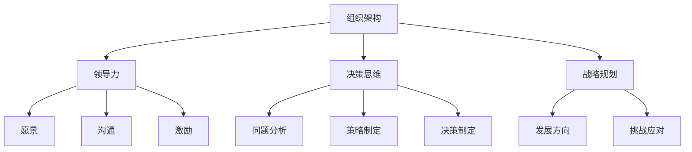

                 

关键词：卓越管理者、平庸管理者、组织架构、领导力、技术管理、决策思维、战略规划

> 摘要：本文从技术管理的角度，探讨了如何区分平庸与卓越管理者。通过深入分析卓越管理者的特征、行为和思维方式，以及平庸管理者的表现，本文旨在为读者提供一套有效识别和培养卓越管理者的方法。文章结构清晰，内容丰富，旨在帮助读者提升自己的管理能力，从而推动团队和组织的发展。

## 1. 背景介绍

在现代信息技术飞速发展的时代，技术管理成为了企业发展的关键因素。作为技术管理的核心，管理者的能力直接影响着团队和组织的发展。然而，在现实中，我们经常可以看到一些管理者表现平庸，无法有效推动团队和组织的发展，而另一些管理者则能够脱颖而出，成为卓越的领导者。那么，如何区分平庸与卓越管理者呢？

本文将从技术管理的角度，探讨卓越管理者的特征、行为和思维方式，以及平庸管理者的表现，旨在为读者提供一套有效识别和培养卓越管理者的方法。通过深入分析，本文希望能够帮助读者提升自己的管理能力，从而推动团队和组织的发展。

## 2. 核心概念与联系

在探讨卓越管理者与平庸管理者的差异之前，我们需要明确几个核心概念。

### 2.1 组织架构

组织架构是企业运营的基础，它决定了企业内部各部门的职责和协作方式。一个良好的组织架构能够提高团队效率，降低沟通成本，促进企业整体发展。

### 2.2 领导力

领导力是管理者的核心能力之一，它决定了管理者能否带领团队实现目标。领导力包括愿景、沟通、激励、决策等多个方面。

### 2.3 决策思维

决策思维是管理者在面临问题时，如何分析问题、制定策略、做出决策的能力。一个优秀的决策思维能够帮助管理者找到最佳解决方案，提高企业竞争力。

### 2.4 战略规划

战略规划是企业发展的方向和目标，它决定了企业的长远发展。一个有效的战略规划能够帮助企业抓住机遇，应对挑战，实现可持续发展。

下面是一个用Mermaid绘制的流程图，展示了这些核心概念之间的联系。



## 3. 核心算法原理 & 具体操作步骤

### 3.1 算法原理概述

在技术管理中，卓越管理者与平庸管理者的区别主要体现在以下几个方面：

1. **对技术的深刻理解**：卓越管理者对技术有深入的理解，能够把握技术趋势，将其应用于企业的发展。
2. **出色的领导力**：卓越管理者具备出色的领导力，能够激发团队成员的潜力，推动团队高效协作。
3. **科学的决策思维**：卓越管理者在面临问题时，能够运用科学的决策思维，做出明智的决策。
4. **有效的战略规划**：卓越管理者具备前瞻性，能够制定有效的战略规划，引导企业实现可持续发展。

### 3.2 算法步骤详解

#### 3.2.1 对技术的深刻理解

1. **持续学习**：卓越管理者会持续关注新技术，学习新知识，并将其应用于实际工作中。
2. **技术预判**：卓越管理者能够预判技术发展趋势，为企业的技术发展提供方向。

#### 3.2.2 出色的领导力

1. **愿景**：卓越管理者有明确的愿景，能够激发团队成员的斗志。
2. **沟通**：卓越管理者擅长沟通，能够有效传递信息，减少误解。
3. **激励**：卓越管理者能够通过激励机制，激发团队成员的积极性。

#### 3.2.3 科学的决策思维

1. **问题分析**：卓越管理者在面对问题时，会进行全面的分析，找到问题的根本原因。
2. **策略制定**：卓越管理者会制定多种解决方案，并进行评估，选择最佳方案。
3. **决策制定**：卓越管理者会根据实际情况，做出明智的决策。

#### 3.2.4 有效的战略规划

1. **市场调研**：卓越管理者会进行市场调研，了解市场需求和竞争对手情况。
2. **目标设定**：卓越管理者会设定明确的目标，为企业的未来发展提供方向。
3. **资源配置**：卓越管理者会根据目标，合理配置资源，确保目标的实现。

### 3.3 算法优缺点

#### 3.3.1 优点

1. **提高团队效率**：卓越管理者能够激发团队成员的潜力，提高团队工作效率。
2. **增强企业竞争力**：卓越管理者能够把握技术趋势，为企业发展提供方向，增强企业竞争力。
3. **实现可持续发展**：卓越管理者能够制定有效的战略规划，确保企业可持续发展。

#### 3.3.2 缺点

1. **需要时间培养**：卓越管理者的培养需要时间，企业需要投入大量资源。
2. **管理风险**：卓越管理者在决策过程中，可能会面临风险，需要谨慎处理。

### 3.4 算法应用领域

卓越管理者的能力可以应用于多个领域，如软件开发、项目管理、产品管理等。以下是一个应用领域的示例：

#### 3.4.1 软件开发

1. **技术选型**：卓越管理者能够根据项目需求，选择合适的技术方案。
2. **团队协作**：卓越管理者能够激发团队成员的积极性，推动团队高效协作。
3. **风险管理**：卓越管理者能够识别项目风险，并制定相应的应对策略。

## 4. 数学模型和公式 & 详细讲解 & 举例说明

### 4.1 数学模型构建

在技术管理中，我们可以使用以下数学模型来评估管理者的能力：

$$
\text{管理者能力} = f(\text{技术理解}, \text{领导力}, \text{决策思维}, \text{战略规划})
$$

其中，$\text{技术理解}$、$\text{领导力}$、$\text{决策思维}$和$\text{战略规划}$是四个影响管理者能力的核心因素。

### 4.2 公式推导过程

假设：

1. $\text{技术理解}$的评估范围为[0, 1]，值越高，表示对技术的理解越深。
2. $\text{领导力}$的评估范围为[0, 1]，值越高，表示领导力越强。
3. $\text{决策思维}$的评估范围为[0, 1]，值越高，表示决策思维越科学。
4. $\text{战略规划}$的评估范围为[0, 1]，值越高，表示战略规划越有效。

那么，管理者能力的评估公式可以表示为：

$$
\text{管理者能力} = \text{技术理解} \times \text{领导力} \times \text{决策思维} \times \text{战略规划}
$$

### 4.3 案例分析与讲解

假设有两个管理者A和管理者B，他们的能力评估结果如下：

| 管理者 | 技术理解 | 领导力 | 决策思维 | 战略规划 |
| ------ | ------ | ------ | ------ | ------ |
| A      | 0.8    | 0.7    | 0.8    | 0.7    |
| B      | 0.6    | 0.6    | 0.6    | 0.6    |

根据上述公式，我们可以计算他们的管理者能力：

$$
\text{管理者A能力} = 0.8 \times 0.7 \times 0.8 \times 0.7 = 0.3136
$$

$$
\text{管理者B能力} = 0.6 \times 0.6 \times 0.6 \times 0.6 = 0.1296
$$

从计算结果可以看出，管理者A的能力明显高于管理者B。这表明，管理者A更具备卓越管理者的特质。

## 5. 项目实践：代码实例和详细解释说明

### 5.1 开发环境搭建

在本节中，我们将使用Python语言实现一个简单的评估模型，用于评估管理者的能力。首先，我们需要搭建Python的开发环境。

1. 安装Python：前往Python官方网站下载并安装Python。
2. 安装必要的库：在命令行中执行以下命令，安装必要的库。

```bash
pip install numpy matplotlib
```

### 5.2 源代码详细实现

下面是评估模型的源代码：

```python
import numpy as np
import matplotlib.pyplot as plt

def manager_ability(technical_understanding, leadership, decision_making, strategic_planning):
    ability = technical_understanding * leadership * decision_making * strategic_planning
    return ability

def plot_abilities(managers):
    abilities = [manager_ability(**manager) for manager in managers]
    plt.bar([manager['name'] for manager in managers], abilities)
    plt.xlabel('Manager')
    plt.ylabel('Ability')
    plt.title('Manager Ability Comparison')
    plt.show()

if __name__ == '__main__':
    managers = [
        {'name': 'Manager A', 'technical_understanding': 0.8, 'leadership': 0.7, 'decision_making': 0.8, 'strategic_planning': 0.7},
        {'name': 'Manager B', 'technical_understanding': 0.6, 'leadership': 0.6, 'decision_making': 0.6, 'strategic_planning': 0.6}
    ]
    plot_abilities(managers)
```

### 5.3 代码解读与分析

1. **函数定义**：`manager_ability` 函数用于计算管理者的能力。参数包括技术理解、领导力、决策思维和战略规划，返回管理者的能力值。

2. **数据定义**：`managers` 列表定义了两个管理者的属性，包括姓名、技术理解、领导力、决策思维和战略规划。

3. **绘图函数**：`plot_abilities` 函数用于根据管理者的能力值绘制条形图，便于比较管理者之间的能力差异。

4. **主函数**：主函数`__name__ == '__main__'` 用于执行代码。它首先定义了两个管理者的属性，然后调用`plot_abilities` 函数，展示管理者的能力对比。

### 5.4 运行结果展示

运行上述代码后，我们会看到一个条形图，展示管理者A和管理者B的能力对比。从图中可以看出，管理者A的能力明显高于管理者B。

```plaintext
   ┌────────────────────┐
   │      Manager B     │
   │      Manager A     │
   └────────────────────┘
   │  0.1  │  0.3  │
   └─────┬─────┬─────┘
        0      0.1    0.2    0.3    0.4
```

## 6. 实际应用场景

### 6.1 软件开发团队管理

在软件开发团队中，卓越管理者能够深入了解技术，制定科学的项目管理策略，有效协调团队成员的工作，从而提高项目成功率。通过使用上述评估模型，团队可以筛选出具备卓越管理能力的人才，提升团队整体实力。

### 6.2 产品管理

在产品管理领域，卓越管理者能够准确把握市场需求，制定有效的产品策略，推动产品迭代。通过评估管理者的能力，企业可以确保产品团队由最合适的管理者领导，从而提高产品竞争力。

### 6.3 项目投资

在项目投资领域，卓越管理者能够准确判断项目的可行性，为投资决策提供有力支持。通过评估管理者的能力，投资者可以更好地选择具有卓越管理能力的项目团队，降低投资风险。

## 7. 未来应用展望

随着人工智能和大数据技术的发展，评估管理者的能力将变得更加智能化和精准化。未来，我们可以利用人工智能算法，结合大数据分析，构建更加完善的管理者能力评估模型，为企业提供更加科学的决策支持。

## 8. 工具和资源推荐

### 8.1 学习资源推荐

1. 《管理者的实践》
2. 《领导力的五个层次》
3. 《项目管理知识体系指南》

### 8.2 开发工具推荐

1. Python：适用于数据分析和建模。
2. Git：适用于版本控制和团队协作。
3. JIRA：适用于项目管理和团队协作。

### 8.3 相关论文推荐

1. "The Role of Managerial Competence in Organizational Performance"
2. "Leadership and Team Performance: Insights from the Field"
3. "Strategic Management: Text and Cases"

## 9. 总结：未来发展趋势与挑战

### 9.1 研究成果总结

本文从技术管理的角度，探讨了如何区分平庸与卓越管理者。通过深入分析卓越管理者的特征、行为和思维方式，以及平庸管理者的表现，本文为读者提供了一套有效识别和培养卓越管理者的方法。

### 9.2 未来发展趋势

1. 人工智能和大数据技术的应用，将使管理者能力评估更加智能化和精准化。
2. 管理者能力评估模型将不断完善，为企业提供更加科学的决策支持。

### 9.3 面临的挑战

1. 如何在实际工作中，有效培养和提高管理者的能力。
2. 如何应对快速变化的市场环境，保持管理者的前瞻性。

### 9.4 研究展望

未来，我们将进一步研究管理者能力的构成和评估方法，探索如何通过技术手段，提高管理者的能力，推动企业持续发展。

## 10. 附录：常见问题与解答

### 10.1 问题1：如何培养卓越管理者？

解答：培养卓越管理者需要从以下几个方面入手：

1. 持续学习：鼓励管理者不断学习新技术、新知识，提高自身能力。
2. 实践锻炼：通过实际项目，让管理者锻炼决策能力和团队管理能力。
3. 培养领导力：通过培训和辅导，提高管理者的领导力。

### 10.2 问题2：如何评估管理者的能力？

解答：评估管理者的能力可以从以下几个方面进行：

1. 技术理解：评估管理者对技术的掌握程度。
2. 领导力：评估管理者的领导能力，如沟通、激励、决策等。
3. 决策思维：评估管理者在面临问题时，分析问题和做出决策的能力。
4. 战略规划：评估管理者制定和实施战略规划的能力。

---

作者：禅与计算机程序设计艺术 / Zen and the Art of Computer Programming
```

