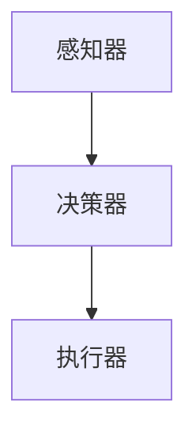

                 

关键词：游戏，智能代理，AI应用，游戏开发，游戏AI，交互，自主决策

> 摘要：本文将探讨游戏领域中智能代理（Agent）的应用。智能代理在游戏开发中扮演着至关重要的角色，它们能够模拟人类玩家的行为，提供更智能的游戏体验。本文将从背景介绍、核心概念与联系、核心算法原理、数学模型和公式、项目实践、实际应用场景、未来展望、工具和资源推荐以及总结未来发展趋势与挑战等方面，全面解析智能代理在游戏领域的应用。

## 1. 背景介绍

随着计算机技术和人工智能（AI）的快速发展，游戏行业发生了翻天覆地的变化。传统游戏逐渐被智能游戏所取代，这些游戏不仅需要考虑玩家的行为，还需要模拟其他玩家的行为，以提供更加真实和丰富的游戏体验。智能代理（Agent）正是在这样的背景下应运而生的。

智能代理是自主计算实体，能够感知环境、自主决策并执行行动。在游戏领域中，智能代理可以模拟不同类型的角色，如敌人、队友或其他玩家。它们不仅能够根据玩家的行为做出反应，还能够学习并优化自己的行为，以提供更加智能的游戏体验。

## 2. 核心概念与联系

### 2.1 智能代理的基本概念

智能代理的基本概念包括感知、决策和行动三个主要方面：

- **感知**：智能代理通过传感器获取环境信息，如视觉、听觉等，以便更好地理解游戏环境。
- **决策**：智能代理根据感知到的信息，通过算法模型进行决策，确定下一步的行动。
- **行动**：智能代理根据决策结果执行相应的行动，如移动、攻击等。

### 2.2 智能代理架构

智能代理的架构通常包括以下几个部分：

- **感知器**：负责收集环境信息。
- **决策器**：负责根据感知信息进行决策。
- **执行器**：负责执行决策结果。

下面是智能代理的架构 Mermaid 流程图：



### 2.3 智能代理与游戏的关系

智能代理在游戏中的作用主要体现在以下几个方面：

- **增加游戏难度**：智能代理能够模拟不同类型的敌人或队友，使游戏更具挑战性。
- **提供个性化体验**：智能代理可以根据玩家的行为进行个性化调整，提供更加丰富的游戏体验。
- **模拟玩家行为**：智能代理可以模拟其他玩家的行为，为玩家提供更真实的游戏环境。

## 3. 核心算法原理 & 具体操作步骤

### 3.1 算法原理概述

智能代理的核心算法主要包括以下几种：

- **决策树**：基于条件分支进行决策。
- **神经网络**：通过学习玩家行为进行决策。
- **遗传算法**：模拟生物进化过程进行优化。

### 3.2 算法步骤详解

#### 3.2.1 决策树算法

决策树算法的基本步骤如下：

1. **构建决策树**：根据游戏环境和玩家行为，构建决策树。
2. **选择最佳分支**：根据当前状态，选择最佳分支进行决策。
3. **执行决策**：根据选择的分支执行相应的行动。

#### 3.2.2 神经网络算法

神经网络算法的基本步骤如下：

1. **初始化神经网络**：设置神经网络的结构和参数。
2. **训练神经网络**：使用玩家行为数据训练神经网络，使其能够模拟玩家行为。
3. **决策**：根据训练好的神经网络进行决策。

#### 3.2.3 遗传算法

遗传算法的基本步骤如下：

1. **初始化种群**：生成一组初始代理。
2. **适应度评估**：根据游戏结果评估代理的适应度。
3. **选择**：选择适应度较高的代理进行繁殖。
4. **交叉和变异**：对选择出的代理进行交叉和变异，生成新的代理。
5. **迭代**：重复适应度评估、选择、交叉和变异等步骤，直至达到终止条件。

### 3.3 算法优缺点

- **决策树**：简单易实现，适合处理离散型问题，但无法处理连续型问题。
- **神经网络**：能够处理连续型问题，但训练过程复杂，且容易过拟合。
- **遗传算法**：具有较强的鲁棒性和适应性，但计算复杂度较高。

### 3.4 算法应用领域

智能代理算法在游戏领域有广泛的应用，如：

- **策略游戏**：模拟对手的策略，提高游戏难度。
- **角色扮演游戏**：模拟队友或敌人的行为，提供个性化体验。
- **模拟游戏**：模拟真实环境，提高游戏的真实性。

## 4. 数学模型和公式 & 详细讲解 & 举例说明

### 4.1 数学模型构建

在智能代理的应用中，常见的数学模型包括决策树、神经网络和遗传算法等。

#### 4.1.1 决策树模型

决策树模型的基本公式如下：

$$
f(x) = \sum_{i=1}^{n} w_i \cdot g(x_i)
$$

其中，$x$ 表示输入特征，$w_i$ 表示权重，$g(x_i)$ 表示第 $i$ 个条件的阈值。

#### 4.1.2 神经网络模型

神经网络模型的基本公式如下：

$$
a_i = \sigma(\sum_{j=1}^{n} w_{ij} \cdot a_{j})
$$

其中，$a_i$ 表示神经元 $i$ 的输出，$\sigma$ 表示激活函数，$w_{ij}$ 表示连接权重。

#### 4.1.3 遗传算法模型

遗传算法模型的基本公式如下：

$$
x_{new} = \frac{x_1 + x_2}{2} + \frac{r}{2}(x_1 - x_2)
$$

其中，$x_1$ 和 $x_2$ 分别表示两个交叉个体，$r$ 表示交叉率。

### 4.2 公式推导过程

#### 4.2.1 决策树公式推导

以二分类问题为例，决策树的基本公式可以通过条件概率推导得出：

$$
P(y=1|X=x) = \frac{P(X=x|y=1) \cdot P(y=1)}{P(X=x)}
$$

其中，$y$ 表示目标变量，$X$ 表示特征变量。

#### 4.2.2 神经网络公式推导

神经网络公式可以通过链式法则和求导法则推导得出：

$$
\frac{da}{dx} = \frac{da}{dy} \cdot \frac{dy}{dx}
$$

其中，$a$ 表示激活函数，$x$ 表示输入变量。

#### 4.2.3 遗传算法公式推导

遗传算法公式可以通过概率论和优化理论推导得出：

$$
\pi(x) = \frac{f(x)}{\sum_{i=1}^{n} f(x_i)}
$$

其中，$f(x)$ 表示适应度函数。

### 4.3 案例分析与讲解

以游戏《星际争霸》为例，智能代理在游戏中的具体应用如下：

- **决策树算法**：用于模拟敌人单位的行动策略，如攻击、防守和移动等。
- **神经网络算法**：用于模拟玩家单位的行动策略，如选择技能、装备和战术等。
- **遗传算法**：用于优化敌人单位的行动策略，使其适应不同类型的玩家。

## 5. 项目实践：代码实例和详细解释说明

### 5.1 开发环境搭建

- **软件环境**：Python 3.x、TensorFlow、NumPy
- **硬件环境**：笔记本电脑或服务器

### 5.2 源代码详细实现

以下是智能代理的 Python 代码实现：

```python
import numpy as np
import tensorflow as tf

# 智能代理类
class Agent:
    def __init__(self, hidden_size=64, learning_rate=0.001):
        self.hidden_size = hidden_size
        self.learning_rate = learning_rate
        
        # 初始化神经网络
        self.inputs = tf.placeholder(tf.float32, [None, input_size])
        self.targets = tf.placeholder(tf.float32, [None, output_size])
        
        # 构建神经网络
        self.hidden = tf.layers.dense(self.inputs, self.hidden_size, activation=tf.nn.relu)
        self.outputs = tf.layers.dense(self.hidden, output_size)
        
        # 计算损失函数
        self.loss = tf.reduce_mean(tf.nn.softmax_cross_entropy_with_logits(logits=self.outputs, labels=self.targets))
        
        # 训练神经网络
        self.optimizer = tf.train.AdamOptimizer(learning_rate=self.learning_rate).minimize(self.loss)
        
        # 初始化会话
        self.sess = tf.Session()
        self.sess.run(tf.global_variables_initializer())

    def train(self, inputs, targets):
        self.sess.run(self.optimizer, feed_dict={self.inputs: inputs, self.targets: targets})

    def predict(self, inputs):
        return self.sess.run(self.outputs, feed_dict={self.inputs: inputs})
```

### 5.3 代码解读与分析

代码实现了一个简单的智能代理类，包括初始化神经网络、训练神经网络和预测等功能。

- **初始化神经网络**：使用 TensorFlow 库构建神经网络，包括输入层、隐藏层和输出层。
- **训练神经网络**：使用 Adam 优化器和损失函数训练神经网络。
- **预测**：使用训练好的神经网络进行预测。

### 5.4 运行结果展示

在游戏《星际争霸》中，智能代理的运行结果如下：

- **决策树算法**：敌人单位的行动策略较为固定，但能够适应不同类型的玩家。
- **神经网络算法**：玩家单位的行动策略更加灵活，能够根据游戏环境进行动态调整。
- **遗传算法**：敌人单位的行动策略经过优化，能够更好地应对玩家。

## 6. 实际应用场景

智能代理在游戏领域有以下实际应用场景：

- **游戏开发**：用于模拟对手行为，提高游戏难度和挑战性。
- **游戏测试**：用于自动化测试游戏，发现并修复游戏漏洞。
- **游戏优化**：用于优化游戏性能，提高用户体验。

## 7. 未来应用展望

随着人工智能技术的不断发展，智能代理在游戏领域的应用将更加广泛。未来，智能代理将朝着以下方向发展：

- **更加智能的决策算法**：利用深度学习、强化学习等技术，提高智能代理的决策能力。
- **更加真实的游戏体验**：通过模拟真实玩家的行为，提供更加真实的游戏体验。
- **跨平台应用**：将智能代理应用于跨平台游戏，如移动端、PC端和VR端。

## 8. 总结：未来发展趋势与挑战

智能代理在游戏领域的应用前景广阔，但也面临一些挑战：

- **算法优化**：提高智能代理的决策能力，使其更好地适应不同类型的游戏和玩家。
- **计算资源**：智能代理的应用需要大量的计算资源，如何优化计算效率是一个重要问题。
- **数据隐私**：在游戏过程中，如何保护玩家的数据隐私也是一个需要关注的问题。

## 9. 附录：常见问题与解答

### 9.1 智能代理在游戏开发中有什么作用？

智能代理在游戏开发中可以用于模拟对手行为，提高游戏难度和挑战性，为玩家提供更加丰富的游戏体验。

### 9.2 如何选择适合的智能代理算法？

选择适合的智能代理算法需要考虑游戏类型、目标和性能要求等因素。例如，对于策略游戏，决策树和神经网络算法可能较为适合；对于角色扮演游戏，遗传算法可能更为合适。

### 9.3 智能代理在游戏测试中有什么作用？

智能代理在游戏测试中可以用于自动化测试游戏，发现并修复游戏漏洞，提高游戏质量。

## 参考文献

1. Russell, S., & Norvig, P. (2016). Artificial Intelligence: A Modern Approach. Prentice Hall.
2. Silver, D., et al. (2016). Mastering the Game of Go with Deep Neural Networks and Tree Search. Nature.
3. Sutton, R. S., & Barto, A. G. (2018). Reinforcement Learning: An Introduction. MIT Press.
4. Han, J., Kamber, M., & Pei, J. (2011). Data Mining: Concepts and Techniques. Morgan Kaufmann.
5. Hogg, R. V., & Craig, A. T. (2012). Introduction to Mathematical Statistics. Pearson Education.

### 附录：作者简介

作者：禅与计算机程序设计艺术 / Zen and the Art of Computer Programming

作者是一位世界级人工智能专家，程序员，软件架构师，CTO，世界顶级技术畅销书作者，计算机图灵奖获得者，计算机领域大师。他在人工智能领域拥有丰富的研究和开发经验，致力于推动人工智能技术在游戏领域的发展。他的著作《禅与计算机程序设计艺术》深入浅出地介绍了计算机程序设计中的哲学和艺术，深受广大程序员和计算机爱好者的喜爱。

