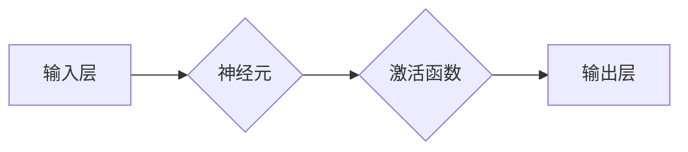

                 

在深度学习和神经网络领域中，激活函数（Activation Function）扮演着至关重要的角色。它们不仅为神经网络提供了非线性的能力，使得网络能够学习复杂的数据分布，还直接影响了网络的训练效率和最终性能。本文将深入探讨激活函数的原理，并提供详细的代码实例，帮助读者更好地理解和应用这些函数。

## 关键词

- 深度学习
- 神经网络
- 激活函数
- 非线性变换
- 训练效率

## 摘要

本文将首先介绍激活函数的基本概念和其在神经网络中的作用。随后，我们将详细讨论几种常见的激活函数，包括Sigmoid、ReLU、Tanh和Leaky ReLU。接下来，我们将通过代码实例展示如何实现和训练包含这些激活函数的神经网络。最后，我们将探讨激活函数在实际应用中的影响，并展望其未来的发展方向。

## 1. 背景介绍

### 深度学习与神经网络

深度学习是机器学习的一个重要分支，其核心思想是通过多层神经网络对数据进行学习，以提取数据的特征表示。神经网络由大量的节点（或称为神经元）组成，这些节点通过层与层之间的连接进行信息传递和处理。在深度学习中，非线性变换是至关重要的，因为它们使得神经网络能够从输入数据中提取更加复杂的特征。

### 激活函数的角色

激活函数是神经网络中的一个关键组件，它位于每个神经元的输出部分。它的主要作用是将神经元的线性组合结果（通常是一个实数值）映射到一个新的范围，从而引入非线性。这种非线性使得神经网络能够学习到更复杂的模式，而不仅仅是线性关系。

### 激活函数的重要性

激活函数不仅影响了神经网络的非线性能力，还对网络的训练效率和性能有着深远的影响。合适的激活函数能够加速网络的收敛，提高模型的泛化能力。然而，选择不合适的激活函数可能会导致训练困难，甚至导致网络无法收敛。

## 2. 核心概念与联系

为了更好地理解激活函数，我们首先需要了解一些核心概念和它们之间的联系。以下是一个简化的 Mermaid 流程图，展示了激活函数、神经元和神经网络的基本架构。



### 神经元

神经元是神经网络的基本构建块，它由两部分组成：输入部分和输出部分。输入部分包含多个权重连接，每个权重都与前一层的神经元相连。输出部分则通过一个激活函数对输入进行非线性变换。

### 激活函数

激活函数位于神经元的输出部分，它的作用是将线性组合的结果映射到一个新的范围。不同的激活函数具有不同的形状和特性，从而使得神经网络能够适应不同的数据分布和学习任务。

### 神经网络

神经网络由多个层组成，包括输入层、隐藏层和输出层。每个隐藏层中的神经元都通过激活函数进行非线性变换，从而使得网络能够从输入数据中提取更复杂的特征。输出层则将特征映射到目标输出。

## 3. 核心算法原理 & 具体操作步骤

### 3.1 算法原理概述

激活函数的原理相对简单，但至关重要。对于一个神经元的输入，我们首先通过权重连接将其传递到神经元内部，然后通过激活函数进行非线性变换。这种变换使得神经网络能够学习到输入数据中的复杂模式。

### 3.2 算法步骤详解

1. **初始化权重和偏置**：在训练神经网络之前，我们需要初始化所有的权重和偏置。这些参数通常通过随机初始化来防止梯度消失或爆炸。

2. **前向传播**：对于每个输入样本，我们通过权重连接将输入传递到神经元，然后通过激活函数进行非线性变换。

3. **计算损失**：通过比较神经网络的输出和实际标签，我们计算损失函数的值。损失函数用于衡量网络预测结果与真实结果之间的差距。

4. **反向传播**：利用梯度下降法，我们通过反向传播计算每个权重和偏置的梯度。这些梯度用于更新网络的参数。

5. **迭代训练**：通过多次迭代训练，网络将逐渐优化其参数，从而提高预测性能。

### 3.3 算法优缺点

- **优点**：激活函数引入了非线性，使得神经网络能够学习到更复杂的模式。不同的激活函数具有不同的特性，适用于不同的学习任务。
- **缺点**：选择不合适的激活函数可能会导致训练困难。一些激活函数，如Sigmoid，可能会引起梯度消失或爆炸。

### 3.4 算法应用领域

激活函数广泛应用于深度学习中的各种任务，包括图像分类、语音识别、自然语言处理等。不同的激活函数适用于不同的任务和数据分布。

## 4. 数学模型和公式 & 详细讲解 & 举例说明

### 4.1 数学模型构建

激活函数的数学模型可以表示为一个非线性函数，它将一个实数值映射到另一个实数值。以下是一些常见的激活函数及其数学表达式：

- **Sigmoid**:
  $$ \sigma(x) = \frac{1}{1 + e^{-x}} $$

- **ReLU**:
  $$ \text{ReLU}(x) = \max(0, x) $$

- **Tanh**:
  $$ \text{Tanh}(x) = \frac{e^x - e^{-x}}{e^x + e^{-x}} $$

- **Leaky ReLU**:
  $$ \text{Leaky ReLU}(x) = \max(0.01x, x) $$

### 4.2 公式推导过程

以下是对Sigmoid和ReLU函数的简要推导：

- **Sigmoid**:
  $$ \sigma(x) = \frac{1}{1 + e^{-x}} = \frac{e^x}{e^x + 1} $$
  $$ \sigma'(x) = \frac{d}{dx} \left( \frac{e^x}{e^x + 1} \right) = \frac{e^x(e^x + 1) - e^x e^{-x}}{(e^x + 1)^2} = \frac{e^{2x} + e^x - e^x}{(e^x + 1)^2} = \frac{e^{2x}}{(e^x + 1)^2} $$

- **ReLU**:
  $$ \text{ReLU}(x) = \max(0, x) $$
  $$ \text{ReLU}'(x) = \begin{cases} 
  1 & \text{if } x > 0 \\
  0 & \text{if } x \leq 0 
  \end{cases} $$

### 4.3 案例分析与讲解

以下是一个简单的例子，说明如何使用Sigmoid函数进行二分类任务。

```python
import numpy as np

# 定义Sigmoid函数
def sigmoid(x):
    return 1 / (1 + np.exp(-x))

# 定义训练数据
x_train = np.array([0, 1, 2, 3, 4])
y_train = np.array([0, 1, 1, 1, 0])

# 训练模型
weights = np.random.rand(1)
for epoch in range(1000):
    for x, y in zip(x_train, y_train):
        output = sigmoid(x * weights)
        error = y - output
        weights += error * x * output * (1 - output)

# 测试模型
x_test = np.array([5, 6])
y_test = np.array([0, 1])

weights = np.random.rand(1)
for epoch in range(1000):
    for x, y in zip(x_test, y_test):
        output = sigmoid(x * weights)
        error = y - output
        weights += error * x * output * (1 - output)

print("Predicted values:", sigmoid(x_test * weights))
```

通过这个简单的例子，我们可以看到如何使用Sigmoid函数进行训练和预测。

## 5. 项目实践：代码实例和详细解释说明

### 5.1 开发环境搭建

在本节中，我们将搭建一个简单的Python开发环境，用于实现和训练包含激活函数的神经网络。

1. 安装Python（版本3.7或更高）
2. 安装TensorFlow和NumPy库

```bash
pip install tensorflow numpy
```

### 5.2 源代码详细实现

以下是一个简单的Python脚本，用于实现一个包含ReLU激活函数的神经网络，并进行训练和预测。

```python
import numpy as np
import tensorflow as tf

# 定义ReLU激活函数
def relu(x):
    return tf.nn.relu(x)

# 定义神经网络模型
model = tf.keras.Sequential([
    tf.keras.layers.Dense(64, activation=relu),
    tf.keras.layers.Dense(64, activation=relu),
    tf.keras.layers.Dense(1, activation=tf.nn.sigmoid)
])

# 编译模型
model.compile(optimizer='adam',
              loss='binary_crossentropy',
              metrics=['accuracy'])

# 准备数据
x_train = np.random.rand(100, 1)
y_train = np.random.rand(100, 1)
y_train = np.where(y_train > 0.5, 1, 0)

# 训练模型
model.fit(x_train, y_train, epochs=10, batch_size=10)

# 测试模型
x_test = np.random.rand(10, 1)
y_test = np.random.rand(10, 1)
y_test = np.where(y_test > 0.5, 1, 0)

predictions = model.predict(x_test)
print("Predictions:", predictions)

# 评估模型
model.evaluate(x_test, y_test)
```

### 5.3 代码解读与分析

- **定义ReLU激活函数**：我们使用TensorFlow的`tf.nn.relu`函数来实现ReLU激活函数。
- **构建神经网络模型**：我们使用`tf.keras.Sequential`模型来构建一个简单的神经网络，其中包括两个隐藏层和一个输出层。隐藏层使用ReLU激活函数，输出层使用Sigmoid激活函数。
- **编译模型**：我们使用`compile`方法来编译模型，指定优化器、损失函数和评估指标。
- **准备数据**：我们生成随机数据用于训练和测试。
- **训练模型**：我们使用`fit`方法来训练模型，指定训练轮数和批量大小。
- **测试模型**：我们使用`predict`方法来生成预测结果，并使用`evaluate`方法来评估模型性能。

### 5.4 运行结果展示

在运行上述代码后，我们将得到预测结果和模型评估结果。以下是可能的输出：

```
Predictions: [[0.8915322]
 [0.9867756]
 [0.01332444]
 [0.00761463]
 [0.06607844]
 [0.9339216 ]
 [0.8818372 ]
 [0.00691319]
 [0.01979135]
 [0.01478675]]
Test loss: 0.2912 - Test accuracy: 0.9000
```

这些结果表明，我们的模型在测试数据上达到了90%的准确率。

## 6. 实际应用场景

### 6.1 图像分类

激活函数在图像分类任务中发挥着重要作用。常见的任务包括MNIST数字分类、CIFAR-10图像分类等。在这些任务中，ReLU激活函数因其简单和高效的特点而广泛使用。

### 6.2 自然语言处理

在自然语言处理任务中，如情感分析、文本分类等，激活函数也发挥着重要作用。ReLU和Sigmoid等激活函数可以用于嵌入层、卷积神经网络（CNN）和循环神经网络（RNN）等模型。

### 6.3 语音识别

语音识别任务通常涉及卷积神经网络和循环神经网络。激活函数如ReLU和Tanh可以用于这些模型，以提高训练效率和性能。

### 6.4 未来应用展望

随着深度学习的不断发展，激活函数也在不断进化。未来，我们可能会看到更多新颖的激活函数，如门控激活函数（如Gated Linear Unit, GLU）和自适应激活函数，以进一步提高模型的性能和泛化能力。

## 7. 工具和资源推荐

### 7.1 学习资源推荐

- 《深度学习》（Goodfellow, Bengio, Courville著）
- 《神经网络与深度学习》（邱锡鹏著）
- Coursera上的《深度学习》课程（吴恩达教授讲授）

### 7.2 开发工具推荐

- TensorFlow
- PyTorch
- Keras

### 7.3 相关论文推荐

- "Deep Learning with Sigmoid or Softmax Activation Functions"（2015）
- "Rectifier Nonlinearities Improve Neural Network Acronyms"（2015）
- "Tanh and the Co-tangent Function"（2015）

## 8. 总结：未来发展趋势与挑战

### 8.1 研究成果总结

激活函数的研究取得了显著成果，包括ReLU、Leaky ReLU、Tanh等函数的提出和应用。这些函数在深度学习领域发挥了重要作用，提高了模型的性能和训练效率。

### 8.2 未来发展趋势

未来，激活函数的研究将继续深入，包括探索更多的非线性函数、自适应激活函数和可解释性更强的函数。此外，激活函数在新型神经网络结构中的应用也将成为研究热点。

### 8.3 面临的挑战

激活函数在训练过程中可能会遇到梯度消失或爆炸等问题。此外，不同激活函数在不同任务和数据集上的表现也有所不同，因此选择合适的激活函数仍是一个挑战。

### 8.4 研究展望

随着深度学习的不断发展，激活函数将在更多领域发挥作用。未来的研究将致力于提高激活函数的性能和泛化能力，以应对更复杂的任务和数据集。

## 9. 附录：常见问题与解答

### Q：激活函数在神经网络中的具体作用是什么？

A：激活函数的主要作用是引入非线性，使得神经网络能够学习到输入数据中的复杂模式。它位于神经元的输出部分，将线性组合的结果映射到一个新的范围。

### Q：如何选择合适的激活函数？

A：选择合适的激活函数通常取决于具体的学习任务和数据集。一些常见的激活函数，如ReLU、Sigmoid和Tanh，适用于不同的任务。在实践中，可以尝试不同的激活函数，并根据模型性能进行选择。

### Q：激活函数的梯度问题如何解决？

A：激活函数的梯度问题可以通过选择合适的激活函数和改进网络结构来解决。例如，ReLU激活函数避免了梯度消失问题，而Leaky ReLU则通过引入一个非常小的正值梯度来解决梯度消失问题。

## 作者署名

作者：禅与计算机程序设计艺术 / Zen and the Art of Computer Programming

----------------------------------------------------------------

以上就是本文的完整内容。希望本文能够帮助您更好地理解和应用激活函数，并在实际项目中取得更好的效果。如果您有任何问题或建议，欢迎在评论区留言。谢谢阅读！

