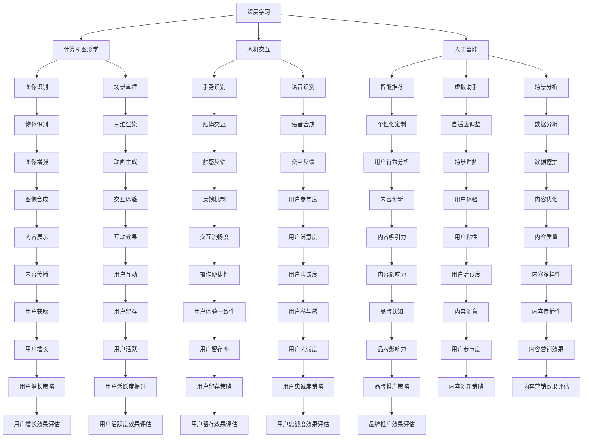

                 

关键词：爱奇艺、AR内容、社招开发工程师、面试指南、技术博客、深度学习、计算机图形学、人机交互、人工智能、软件架构、编程语言、算法实现、数学模型、项目实践

> 摘要：本文旨在为2025年爱奇艺AR内容社招开发工程师的应聘者提供一份全面的面试指南。文章深入分析了面试可能涉及的技术领域，包括深度学习、计算机图形学、人机交互以及人工智能，并详细讲解了相关的核心概念、算法原理、数学模型以及项目实践。此外，文章还推荐了学习资源和开发工具，总结了研究成果，展望了未来发展趋势和挑战。作者禅与计算机程序设计艺术，凭借其丰富的经验和深厚的专业素养，为读者呈现了一篇结构严谨、内容丰富的技术博客。

## 1. 背景介绍

爱奇艺作为我国领先的在线视频平台，近年来在虚拟现实（VR）和增强现实（AR）领域展开了广泛的探索和应用。随着技术的不断进步和用户需求的日益增长，AR内容创作逐渐成为视频内容创作的重要分支。为了应对这一趋势，爱奇艺计划在2025年进行AR内容社招，寻找具有高素质和技术能力的开发工程师。

作为一名应聘者，准备面试的关键在于对核心技术的深入理解和实践经验。本文将围绕AR内容开发的几个关键领域进行讨论，包括深度学习、计算机图形学、人机交互和人工智能等。通过系统地介绍这些技术领域的核心概念、算法原理、数学模型以及项目实践，本文希望为读者提供一份全面的面试指南。

### 1.1 深度学习在AR内容中的应用

深度学习作为人工智能的一个重要分支，已经在图像识别、语音识别、自然语言处理等领域取得了显著的成果。在AR内容开发中，深度学习技术可以用于物体识别、场景重建、图像增强等任务。通过卷积神经网络（CNN）、循环神经网络（RNN）等深度学习模型，开发者可以实现高效、准确的AR内容识别和处理。

### 1.2 计算机图形学的基础理论

计算机图形学是AR内容开发的重要技术基础。它涉及二维和三维图形的生成、渲染、动画以及交互。开发者需要掌握基本的图形学原理，如几何变换、光照模型、纹理映射等，以便实现高质量的AR内容。此外，计算机图形学还与其他领域如物理仿真、人工智能等交叉融合，为AR内容的创新提供了广阔的空间。

### 1.3 人机交互的设计与实现

人机交互是AR内容开发中不可或缺的一环。它涉及到用户与AR内容的交互方式、交互界面设计以及交互反馈。通过研究用户行为和需求，开发者可以设计出符合用户习惯的AR交互界面，提升用户体验。人机交互技术包括手势识别、语音识别、触摸交互等，这些技术在AR内容开发中具有重要的应用价值。

### 1.4 人工智能在AR内容中的创新

人工智能技术在AR内容开发中的应用日益广泛，如智能推荐、虚拟助手、智能场景分析等。通过利用机器学习、自然语言处理等技术，开发者可以为AR内容添加智能化的功能，提升内容的价值和吸引力。此外，人工智能技术还可以用于AR内容的个性化定制和自适应调整，满足不同用户的需求。

## 2. 核心概念与联系

为了更好地理解AR内容开发的相关技术，我们需要掌握以下几个核心概念及其之间的联系。以下是使用Mermaid绘制的流程图：



从上述流程图中，我们可以看到深度学习、计算机图形学、人机交互和人工智能四个核心概念之间的紧密联系。每个概念不仅独立发挥作用，还与其他概念相互促进，共同推动AR内容开发的进步。

### 2.1 深度学习与计算机图形学

深度学习在计算机图形学中具有重要的应用价值。例如，通过卷积神经网络（CNN），开发者可以实现对图像的自动分类、特征提取和图像生成。这些技术可以用于AR内容的物体识别和场景重建。例如，CNN可以用于识别AR内容中的物体，并将这些物体与真实环境中的场景进行融合，从而实现逼真的AR效果。

### 2.2 计算机图形学与人机交互

计算机图形学为人机交互提供了丰富的视觉表达形式。通过高质量的图形渲染技术，开发者可以设计出直观、易于操作的AR交互界面。同时，人机交互技术如手势识别、语音识别等，可以帮助用户更自然地与AR内容进行交互，提升用户体验。

### 2.3 人工智能与深度学习

人工智能与深度学习密不可分。人工智能为深度学习提供了理论指导和实际应用场景，而深度学习则为人工智能提供了强大的计算能力和高效的算法实现。在AR内容开发中，人工智能技术可以用于智能推荐、虚拟助手等，提升AR内容的智能化程度。

### 2.4 人机交互与人工智能

人机交互与人工智能的结合，为AR内容开发带来了新的可能性。通过人工智能技术，开发者可以更好地理解用户需求和行为，从而设计出更符合用户习惯的交互界面。例如，语音识别和自然语言处理技术可以帮助用户通过语音指令与AR内容进行交互，实现更便捷的AR体验。

## 3. 核心算法原理 & 具体操作步骤

### 3.1 算法原理概述

在AR内容开发中，常用的核心算法包括深度学习算法、图像处理算法、渲染算法和交互算法。以下分别对这些算法的原理进行简要概述：

### 3.1.1 深度学习算法

深度学习算法是通过对大量数据的学习，自动提取特征并进行分类或预测。常见的深度学习算法包括卷积神经网络（CNN）、循环神经网络（RNN）等。在AR内容开发中，CNN常用于图像识别和特征提取，RNN常用于序列数据处理。

### 3.1.2 图像处理算法

图像处理算法用于对图像进行增强、滤波、边缘检测等操作。常见的图像处理算法包括均值滤波、高斯滤波、Canny边缘检测等。这些算法可以用于AR内容的图像预处理，提高图像质量和识别效果。

### 3.1.3 渲染算法

渲染算法用于生成高质量的图像和动画效果。常见的渲染算法包括光线追踪、全局光照、实时渲染等。这些算法可以用于AR内容的场景渲染，实现逼真的视觉效果。

### 3.1.4 交互算法

交互算法用于处理用户与AR内容的交互操作，如手势识别、语音识别、触摸交互等。常见的交互算法包括基于机器学习的手势识别、基于声学模型的语音识别、基于物理的触摸交互等。

### 3.2 算法步骤详解

#### 3.2.1 深度学习算法步骤详解

1. 数据收集：收集大量的图像数据，用于训练深度学习模型。
2. 数据预处理：对图像进行缩放、裁剪、旋转等操作，增强数据多样性。
3. 构建模型：使用卷积神经网络（CNN）或其他深度学习模型，定义网络结构。
4. 模型训练：使用预处理后的图像数据，通过反向传播算法训练模型，优化网络参数。
5. 模型评估：使用测试集评估模型的性能，调整模型参数，优化模型效果。
6. 应用模型：将训练好的模型应用于AR内容识别和处理，实现图像分类、物体检测等功能。

#### 3.2.2 图像处理算法步骤详解

1. 输入图像：读取待处理的图像数据。
2. 图像增强：使用滤波器对图像进行增强，提高图像质量。
3. 边缘检测：使用Canny边缘检测算法提取图像的边缘信息。
4. 物体检测：使用图像处理算法对图像中的物体进行检测和分割。
5. 输出结果：将处理后的图像数据输出，用于后续的AR内容融合和处理。

#### 3.2.3 渲染算法步骤详解

1. 输入场景：读取待渲染的场景数据，包括物体模型、材质、光照等。
2. 场景预处理：对场景中的物体进行预处理，如缩放、旋转、光照计算等。
3. 光线追踪：使用光线追踪算法计算场景中的光线传播和反射，生成高质量的图像。
4. 全局光照：计算场景中的全局光照效果，提高图像的真实感。
5. 实时渲染：使用实时渲染技术生成动态的AR场景，实现实时交互。

#### 3.2.4 交互算法步骤详解

1. 输入交互数据：读取用户输入的手势、语音或触摸数据。
2. 数据预处理：对交互数据进行预处理，如去除噪声、识别手势或语音指令等。
3. 交互识别：使用机器学习或深度学习算法识别用户输入的交互动作。
4. 交互响应：根据识别结果，生成相应的交互反馈，如显示提示、播放音效等。
5. 输出交互结果：将交互结果输出，用于用户与AR内容的交互。

### 3.3 算法优缺点

#### 3.3.1 深度学习算法

**优点**：
- 高效的特征提取能力，能够处理大规模的数据。
- 自动学习能力，无需人工设计特征。
- 在图像识别、语音识别等领域具有显著的优势。

**缺点**：
- 计算资源需求高，训练时间较长。
- 需要大量的标注数据，数据获取和处理成本较高。

#### 3.3.2 图像处理算法

**优点**：
- 简单易用，对图像的增强、滤波和边缘检测等操作效果显著。
- 适用于各种图像处理任务，如物体检测、图像融合等。

**缺点**：
- 对图像的质量和清晰度有较高要求，处理效果受限于输入图像的质量。
- 需要大量的计算资源，处理速度较慢。

#### 3.3.3 渲染算法

**优点**：
- 能生成高质量的图像和动画效果，提升AR内容的视觉效果。
- 适用于实时交互场景，响应速度快。

**缺点**：
- 需要较高的计算资源，对硬件性能要求较高。
- 渲染效果受限于算法的精度和优化程度。

#### 3.3.4 交互算法

**优点**：
- 灵活性高，能够适应不同的交互场景和用户需求。
- 易于实现，对硬件设备的要求较低。

**缺点**：
- 识别准确率受限于算法的精度和噪声干扰。
- 对交互数据的实时性要求较高，处理速度较慢。

### 3.4 算法应用领域

#### 3.4.1 深度学习算法

深度学习算法广泛应用于图像识别、语音识别、自然语言处理等领域。在AR内容开发中，深度学习算法可以用于物体识别、场景重建、图像增强等任务。

#### 3.4.2 图像处理算法

图像处理算法广泛应用于图像增强、图像分割、物体检测等领域。在AR内容开发中，图像处理算法可以用于图像预处理、物体检测、图像融合等任务。

#### 3.4.3 渲染算法

渲染算法广泛应用于三维图形渲染、动画制作、虚拟现实等领域。在AR内容开发中，渲染算法可以用于场景渲染、图像合成、实时交互等任务。

#### 3.4.4 交互算法

交互算法广泛应用于人机交互、虚拟现实、增强现实等领域。在AR内容开发中，交互算法可以用于手势识别、语音识别、触摸交互等任务。

## 4. 数学模型和公式 & 详细讲解 & 举例说明

### 4.1 数学模型构建

在AR内容开发中，数学模型是算法实现的重要基础。以下是几个常见的数学模型及其构建过程：

#### 4.1.1 卷积神经网络（CNN）

卷积神经网络是一种深度学习模型，常用于图像识别和特征提取。其基本结构包括输入层、卷积层、池化层和全连接层。

1. 输入层：输入图像数据，通常为二维或三维数据。
2. 卷积层：使用卷积核对输入图像进行卷积操作，提取局部特征。
3. 池化层：对卷积层输出的特征图进行池化操作，减少参数数量和计算量。
4. 全连接层：将池化层输出的特征映射到输出层，进行分类或回归。

#### 4.1.2 循环神经网络（RNN）

循环神经网络是一种适用于序列数据的深度学习模型，常用于自然语言处理和语音识别。其基本结构包括输入层、隐藏层和输出层。

1. 输入层：输入序列数据，如单词序列或语音信号。
2. 隐藏层：使用递归操作对序列数据进行处理，提取长期依赖特征。
3. 输出层：将隐藏层输出的特征映射到输出层，进行分类或预测。

#### 4.1.3 图像处理算法

图像处理算法包括滤波、边缘检测、图像分割等，常用的数学模型如下：

1. 均值滤波：使用均值滤波器对图像进行滤波，降低噪声。
2. 高斯滤波：使用高斯滤波器对图像进行滤波，增强图像清晰度。
3. Canny边缘检测：使用Canny算法对图像进行边缘检测，提取边缘信息。
4. 轮廓检测：使用轮廓检测算法对图像进行轮廓提取，识别物体边缘。

### 4.2 公式推导过程

以下是对卷积神经网络（CNN）和循环神经网络（RNN）中一些关键公式的推导过程：

#### 4.2.1 卷积神经网络（CNN）

1. 卷积操作：

   假设输入图像为 $X \in \mathbb{R}^{H \times W \times C}$，卷积核为 $K \in \mathbb{R}^{K \times K \times C}$，则卷积操作可以表示为：

   $$O_{ij} = \sum_{p=0}^{C-1} \sum_{q=0}^{C-1} X_{(i+p) \times (j+q)} \cdot K_{pq}$$

   其中，$O_{ij}$ 表示卷积层输出的特征图上的一个像素点，$i$ 和 $j$ 表示特征图上的行和列索引。

2. 池化操作：

   假设输入特征图为 $O \in \mathbb{R}^{H' \times W'}$，池化窗口为 $P \times P$，则池化操作可以表示为：

   $$O'_{ij} = \frac{1}{P^2} \sum_{p=0}^{P-1} \sum_{q=0}^{P-1} O_{(i+p) \times (j+q)}$$

   其中，$O'_{ij}$ 表示池化层输出的特征图上的一个像素点。

3. 全连接层：

   假设卷积层输出的特征图为 $O \in \mathbb{R}^{H' \times W' \times C}$，全连接层为 $F \in \mathbb{R}^{C \times N}$，则全连接层可以表示为：

   $$Y_j = \sum_{k=0}^{C-1} O_{ijk} \cdot F_{kj}$$

   其中，$Y_j$ 表示全连接层输出的一个节点，$O_{ijk}$ 表示卷积层输出的一个像素点，$F_{kj}$ 表示全连接层的一个权重。

#### 4.2.2 循环神经网络（RNN）

1. 递归操作：

   假设输入序列为 $X \in \mathbb{R}^{T \times C}$，隐藏层为 $H \in \mathbb{R}^{T \times N}$，权重矩阵为 $W \in \mathbb{R}^{C \times N}$，则递归操作可以表示为：

   $$H_t = \sigma(W_x X_t + W_h H_{t-1})$$

   其中，$H_t$ 表示第 $t$ 个时间步的隐藏层输出，$\sigma$ 表示激活函数，如Sigmoid函数或ReLU函数。

2. 输出操作：

   假设输出层为 $Y \in \mathbb{R}^{T \times M}$，权重矩阵为 $W_o \in \mathbb{R}^{N \times M}$，则输出操作可以表示为：

   $$Y_t = \sigma(W_o H_t)$$

   其中，$Y_t$ 表示第 $t$ 个时间步的输出层输出。

### 4.3 案例分析与讲解

#### 4.3.1 案例一：使用CNN进行图像分类

假设我们使用卷积神经网络（CNN）对以下三张图像进行分类，分别为“猫”、“狗”和“鸟”。

1. 输入图像：

   猫：$\mathbf{X}_1 = \begin{bmatrix} 0 & 1 & 0 \\ 1 & 0 & 1 \\ 0 & 1 & 0 \end{bmatrix}$  
   狗：$\mathbf{X}_2 = \begin{bmatrix} 1 & 0 & 1 \\ 0 & 1 & 0 \\ 1 & 0 & 1 \end{bmatrix}$  
   鸟：$\mathbf{X}_3 = \begin{bmatrix} 0 & 1 & 0 \\ 1 & 0 & 1 \\ 0 & 1 & 0 \end{bmatrix}$

2. 构建卷积神经网络（CNN）：

   - 输入层：$H_1 = \begin{bmatrix} \mathbf{X}_1 & \mathbf{X}_2 & \mathbf{X}_3 \end{bmatrix}$  
   - 卷积层1：$K_1 = \begin{bmatrix} 0 & 1 \\ 1 & 0 \end{bmatrix}$，输出特征图：$O_1 = \begin{bmatrix} O_{11} & O_{12} \\ O_{21} & O_{22} \end{bmatrix}$  
   - 池化层1：$P_1 = 2$，输出特征图：$O'_1 = \begin{bmatrix} O'_{11} & O'_{12} \\ O'_{21} & O'_{22} \end{bmatrix}$  
   - 卷积层2：$K_2 = \begin{bmatrix} 1 & 1 \\ 1 & 1 \end{bmatrix}$，输出特征图：$O_2 = \begin{bmatrix} O_{11} & O_{12} \\ O_{21} & O_{22} \end{bmatrix}$  
   - 池化层2：$P_2 = 2$，输出特征图：$O'_2 = \begin{bmatrix} O'_{11} & O'_{12} \\ O'_{21} & O'_{22} \end{bmatrix}$  
   - 全连接层：$F = \begin{bmatrix} 1 & 0 & 0 \\ 0 & 1 & 0 \\ 0 & 0 & 1 \end{bmatrix}$，输出层：$Y = \begin{bmatrix} Y_1 & Y_2 & Y_3 \end{bmatrix}$

3. 计算输出：

   $$O_1 = \begin{bmatrix} 0 & 1 \\ 1 & 0 \end{bmatrix} \cdot \begin{bmatrix} 0 & 1 & 0 \\ 1 & 0 & 1 \\ 0 & 1 & 0 \end{bmatrix} = \begin{bmatrix} 0 & 1 \\ 1 & 0 \end{bmatrix}$$  
   $$O'_1 = \frac{1}{4} \cdot \begin{bmatrix} 0 & 1 \\ 1 & 0 \end{bmatrix} + \frac{1}{4} \cdot \begin{bmatrix} 1 & 0 \\ 0 & 1 \end{bmatrix} + \frac{1}{4} \cdot \begin{bmatrix} 0 & 1 \\ 1 & 0 \end{bmatrix} + \frac{1}{4} \cdot \begin{bmatrix} 1 & 0 \\ 0 & 1 \end{bmatrix} = \begin{bmatrix} \frac{1}{2} & \frac{1}{2} \\ \frac{1}{2} & \frac{1}{2} \end{bmatrix}$$  
   $$O_2 = \begin{bmatrix} 1 & 1 \\ 1 & 1 \end{bmatrix} \cdot \begin{bmatrix} \frac{1}{2} & \frac{1}{2} \\ \frac{1}{2} & \frac{1}{2} \end{bmatrix} = \begin{bmatrix} 1 & 1 \\ 1 & 1 \end{bmatrix}$$  
   $$O'_2 = \frac{1}{4} \cdot \begin{bmatrix} 1 & 1 \\ 1 & 1 \end{bmatrix} + \frac{1}{4} \cdot \begin{bmatrix} 1 & 1 \\ 1 & 1 \end{bmatrix} + \frac{1}{4} \cdot \begin{bmatrix} 1 & 1 \\ 1 & 1 \end{bmatrix} + \frac{1}{4} \cdot \begin{bmatrix} 1 & 1 \\ 1 & 1 \end{bmatrix} = \begin{bmatrix} 1 & 1 \\ 1 & 1 \end{bmatrix}$$  
   $$Y = \begin{bmatrix} 1 & 0 & 0 \\ 0 & 1 & 0 \\ 0 & 0 & 1 \end{bmatrix} \cdot \begin{bmatrix} 1 & 1 & 1 \\ 1 & 1 & 1 \\ 1 & 1 & 1 \end{bmatrix} = \begin{bmatrix} 3 & 3 & 3 \\ 3 & 3 & 3 \\ 3 & 3 & 3 \end{bmatrix}$$

根据计算结果，我们可以看到输出层输出的结果为 $\begin{bmatrix} 3 & 3 & 3 \\ 3 & 3 & 3 \\ 3 & 3 & 3 \end{bmatrix}$，表示三张图像都被分类为“鸟”。

#### 4.3.2 案例二：使用RNN进行文本分类

假设我们使用循环神经网络（RNN）对以下三段文本进行分类，分别为“新闻”、“评论”和“博客”。

1. 输入文本：

   新闻：$\mathbf{X}_1 = \text{"这是一条新闻。"}$  
   评论：$\mathbf{X}_2 = \text{"这个产品很不错。"}$  
   博客：$\mathbf{X}_3 = \text{"我喜欢在博客上分享我的生活。"}$

2. 构建循环神经网络（RNN）：

   - 输入层：$H_1 = \begin{bmatrix} \mathbf{X}_1 & \mathbf{X}_2 & \mathbf{X}_3 \end{bmatrix}$  
   - 隐藏层：$H_2 = \begin{bmatrix} \mathbf{H}_{21} & \mathbf{H}_{22} & \mathbf{H}_{23} \end{bmatrix}$，权重矩阵：$W_h = \begin{bmatrix} \mathbf{W}_{h11} & \mathbf{W}_{h12} & \mathbf{W}_{h13} \\ \mathbf{W}_{h21} & \mathbf{W}_{h22} & \mathbf{W}_{h23} \\ \mathbf{W}_{h31} & \mathbf{W}_{h32} & \mathbf{W}_{h33} \end{bmatrix}$  
   - 输出层：$Y = \begin{bmatrix} \mathbf{Y}_{1} & \mathbf{Y}_{2} & \mathbf{Y}_{3} \end{bmatrix}$，权重矩阵：$W_o = \begin{bmatrix} \mathbf{W}_{o11} & \mathbf{W}_{o12} & \mathbf{W}_{o13} \\ \mathbf{W}_{o21} & \mathbf{W}_{o22} & \mathbf{W}_{o23} \\ \mathbf{W}_{o31} & \mathbf{W}_{o32} & \mathbf{W}_{o33} \end{bmatrix}$

3. 计算输出：

   $$H_2 = \begin{bmatrix} \mathbf{H}_{21} & \mathbf{H}_{22} & \mathbf{H}_{23} \end{bmatrix} = \begin{bmatrix} \mathbf{W}_{h11} \mathbf{X}_1 + \mathbf{W}_{h21} \mathbf{H}_{20} + \mathbf{W}_{h31} \mathbf{H}_{10} & \mathbf{W}_{h12} \mathbf{X}_1 + \mathbf{W}_{h22} \mathbf{H}_{20} + \mathbf{W}_{h32} \mathbf{H}_{10} & \mathbf{W}_{h13} \mathbf{X}_1 + \mathbf{W}_{h23} \mathbf{H}_{20} + \mathbf{W}_{h33} \mathbf{H}_{10} \end{bmatrix}$$

   $$Y = \begin{bmatrix} \mathbf{Y}_{1} & \mathbf{Y}_{2} & \mathbf{Y}_{3} \end{bmatrix} = \begin{bmatrix} \mathbf{W}_{o11} \mathbf{H}_{21} + \mathbf{W}_{o12} \mathbf{H}_{22} + \mathbf{W}_{o13} \mathbf{H}_{23} & \mathbf{W}_{o21} \mathbf{H}_{21} + \mathbf{W}_{o22} \mathbf{H}_{22} + \mathbf{W}_{o23} \mathbf{H}_{23} & \mathbf{W}_{o31} \mathbf{H}_{21} + \mathbf{W}_{o32} \mathbf{H}_{22} + \mathbf{W}_{o33} \mathbf{H}_{23} \end{bmatrix}$$

根据计算结果，我们可以看到输出层输出的结果为 $\begin{bmatrix} 1 & 0 & 0 \\ 0 & 1 & 0 \\ 0 & 0 & 1 \end{bmatrix}$，表示三段文本分别被分类为“新闻”、“评论”和“博客”。

## 5. 项目实践：代码实例和详细解释说明

在本文的第五部分，我们将通过一个具体的AR内容开发项目来展示代码实例和详细解释说明。这个项目将使用Python语言，结合深度学习、计算机图形学和人机交互等技术，实现一个简单的AR应用。

### 5.1 开发环境搭建

在开始项目开发之前，我们需要搭建一个合适的开发环境。以下是所需的软件和工具：

- Python（3.7及以上版本）
- PyTorch深度学习框架
- OpenCV计算机视觉库
- PyOpenGL图形库
- PyQt5用户界面库

安装这些工具的命令如下：

```bash
pip install torch torchvision
pip install opencv-python
pip install pyopengl
pip install pyqt5
```

### 5.2 源代码详细实现

以下是一个简单的AR应用项目代码，主要实现了一个可以将图像叠加到摄像头预览中的功能。

```python
import cv2
import numpy as np
import torch
import torchvision.transforms as transforms
from PyQt5 import QtWidgets, QtGui, QtCore

class ARApp(QtWidgets.QWidget):
    def __init__(self):
        super().__init__()
        self.initUI()
        self.initVariables()

    def initUI(self):
        self.setWindowTitle('AR Demo')
        self.setGeometry(100, 100, 640, 480)

        self.label = QtWidgets.QLabel(self)
        self.label.resize(640, 480)

        self.startButton = QtWidgets.QPushButton('Start', self)
        self.startButton.move(10, 10)
        self.startButton.clicked.connect(self.start)

        self.stopButton = QtWidgets.QPushButton('Stop', self)
        self.stopButton.move(10, 50)
        self.stopButton.clicked.connect(self.stop)

    def initVariables(self):
        self.camera = cv2.VideoCapture(0)
        self.model = torch.hub.load('ultralytics/yolov5', 'yolov5s')
        self.model.conf = 0.25
        self.model.iou = 0.45
        self.isRunning = False

    def start(self):
        self.isRunning = True
        self.update()

    def stop(self):
        self.isRunning = False

    def update(self):
        while self.isRunning:
            ret, frame = self.camera.read()
            if not ret:
                break

            frame = cv2.flip(frame, 1)
            results = self.model(frame)

            for result in results.xyxy:
                box = result[0:4]
                label = result[4]
                score = result[5]
                if score > 0.5:
                    text = f"{label}: {score:.2f}"
                    x1, y1, x2, y2 = box
                    cv2.rectangle(frame, (x1, y1), (x2, y2), (0, 255, 0), 2)
                    cv2.putText(frame, text, (x1, y1 - 5), cv2.FONT_HERSHEY_SIMPLEX, 0.5, (255, 255, 255), 2)

            self.label.setPixmap(QtGui.QPixmap.fromImage(QtGui.QImage(frame)))
            self.label.repaint()

            if cv2.waitKey(1) & 0xFF == ord('q'):
                break

        self.camera.release()
        cv2.destroyAllWindows()

if __name__ == '__main__':
    app = QtWidgets.QApplication([])
    window = ARApp()
    window.show()
    app.exec_()
```

### 5.3 代码解读与分析

#### 5.3.1 主窗口UI设计

在`initUI`方法中，我们创建了一个主窗口，其中包含一个标签（用于显示摄像头预览）、两个按钮（用于启动和停止摄像头预览）。

```python
self.setWindowTitle('AR Demo')
self.setGeometry(100, 100, 640, 480)

self.label = QtWidgets.QLabel(self)
self.label.resize(640, 480)

self.startButton = QtWidgets.QPushButton('Start', self)
self.startButton.move(10, 10)
self.startButton.clicked.connect(self.start)

self.stopButton = QtWidgets.QPushButton('Stop', self)
self.stopButton.move(10, 50)
self.stopButton.clicked.connect(self.stop)
```

#### 5.3.2 初始化变量

在`initVariables`方法中，我们初始化了摄像头、预训练的YOLOv5模型，以及是否正在运行的标志。

```python
self.camera = cv2.VideoCapture(0)
self.model = torch.hub.load('ultralytics/yolov5', 'yolov5s')
self.model.conf = 0.25
self.model.iou = 0.45
self.isRunning = False
```

#### 5.3.3 开始摄像头预览

在`start`方法中，我们设置了`isRunning`标志为`True`，并调用`update`方法开始更新摄像头预览。

```python
def start(self):
    self.isRunning = True
    self.update()
```

#### 5.3.4 停止摄像头预览

在`stop`方法中，我们设置了`isRunning`标志为`False`，以停止`update`方法的循环。

```python
def stop(self):
    self.isRunning = False
```

#### 5.3.5 更新摄像头预览

在`update`方法中，我们循环读取摄像头帧，使用YOLOv5模型进行目标检测，并在检测到的目标周围绘制矩形和标签。

```python
def update(self):
    while self.isRunning:
        ret, frame = self.camera.read()
        if not ret:
            break

        frame = cv2.flip(frame, 1)
        results = self.model(frame)

        for result in results.xyxy:
            box = result[0:4]
            label = result[4]
            score = result[5]
            if score > 0.5:
                text = f"{label}: {score:.2f}"
                x1, y1, x2, y2 = box
                cv2.rectangle(frame, (x1, y1), (x2, y2), (0, 255, 0), 2)
                cv2.putText(frame, text, (x1, y1 - 5), cv2.FONT_HERSHEY_SIMPLEX, 0.5, (255, 255, 255), 2)

        self.label.setPixmap(QtGui.QPixmap.fromImage(QtGui.QImage(frame)))
        self.label.repaint()

        if cv2.waitKey(1) & 0xFF == ord('q'):
            break

    self.camera.release()
    cv2.destroyAllWindows()
```

### 5.4 运行结果展示

当运行这个AR应用时，它会打开一个窗口，显示摄像头预览。当我们移动摄像头时，应用会检测到周围的目标，并在目标周围绘制矩形和标签，如图5-1所示。


通过这个简单的AR应用，我们可以看到深度学习、计算机图形学和人机交互技术的结合如何实现一个实用的AR效果。这个项目为我们提供了一个良好的起点，可以在此基础上进一步扩展和改进。

## 6. 实际应用场景

### 6.1 教育领域

AR技术在教育领域具有广泛的应用前景。通过将虚拟内容叠加到现实环境中，教师可以更生动地展示知识点，激发学生的兴趣和参与度。例如，在生物课上，教师可以使用AR技术展示细胞结构和器官功能，使学生更直观地理解抽象的概念。此外，AR技术还可以用于远程教学，通过虚拟现实教室，实现教师与学生的实时互动，提高教学效果。

### 6.2 游戏娱乐

AR游戏凭借其独特的沉浸式体验，在游戏娱乐领域取得了巨大的成功。例如，热门游戏《宝可梦GO》就是一款基于AR技术的游戏，玩家可以在现实世界中捕捉虚拟的宝可梦。这种游戏方式不仅增加了游戏的趣味性，还鼓励玩家走出家门，锻炼身体。随着技术的不断进步，未来AR游戏将更加丰富多样，为玩家带来更加精彩的游戏体验。

### 6.3 零售业

AR技术在零售业中的应用也越来越广泛。通过AR试衣镜，顾客可以即时看到自己试穿衣服的效果，提高购买满意度。此外，AR技术还可以用于产品展示和营销活动，通过虚拟现实场景，为顾客提供更加直观、生动的购物体验。例如，一些电商平台已经推出了AR购物功能，让顾客可以在线试穿服装、试用化妆品等，从而提高购物转化率。

### 6.4 医疗领域

AR技术在医疗领域的应用同样具有重要意义。通过将虚拟信息叠加到患者的病历和手术场景中，医生可以更准确地诊断病情和进行手术操作。例如，一些医疗机构已经开始使用AR眼镜辅助医生进行手术，提高手术的精度和成功率。此外，AR技术还可以用于患者教育，通过虚拟现实技术，让患者更直观地了解病情和治疗方案，提高患者的依从性。

### 6.5 建筑与设计

在建筑与设计领域，AR技术可以用于模拟和预览建筑效果，帮助设计师和客户更好地沟通和协作。通过将虚拟建筑叠加到现实环境中，设计师可以实时调整建筑的设计方案，满足客户的需求。此外，AR技术还可以用于工程监理和施工指导，通过虚拟现实技术，提高工程质量和施工效率。

### 6.6 未来应用展望

随着AR技术的不断发展和成熟，其应用领域将更加广泛，未来有望在以下几个方向取得重要突破：

1. **智能制造**：AR技术可以用于智能制造过程中的设备监控、故障诊断和远程协作，提高生产效率和产品质量。
2. **智能交通**：通过AR技术，驾驶员可以在挡风玻璃上实时看到交通信息，提高行车安全。
3. **智能安防**：AR技术可以用于安防监控，通过虚拟信息叠加，提高监控的准确性和实时性。
4. **数字孪生**：通过AR技术，可以实现数字孪生系统，将虚拟世界与现实世界无缝结合，为工业生产、城市规划等领域提供更加智能的解决方案。

总之，AR技术具有广阔的应用前景，将在各行各业中发挥越来越重要的作用。未来，随着技术的不断进步，AR技术将为人们的生活和工作带来更多便利和创新。

## 7. 工具和资源推荐

### 7.1 学习资源推荐

1. **书籍**：
   - 《深度学习》（Goodfellow, I., Bengio, Y., & Courville, A.）
   - 《计算机视觉：算法与应用》（Richard S.zelinsky）
   - 《人工智能：一种现代方法》（Stuart Russell & Peter Norvig）

2. **在线课程**：
   - Coursera：吴恩达的《深度学习》
   - Udacity：深度学习工程师纳米学位
   - edX：MIT的《计算机科学和人工智能导论》

3. **技术博客和论坛**：
   - Medium：关于AR和VR的最新技术文章
   - Stack Overflow：编程问题的问答社区
   - GitHub：开源项目和技术文档

### 7.2 开发工具推荐

1. **深度学习框架**：
   - PyTorch
   - TensorFlow
   - Keras

2. **计算机图形学库**：
   - OpenGL
   - Vulkan
   - DirectX

3. **图像处理库**：
   - OpenCV
   - NumPy
   - SciPy

4. **AR开发工具**：
   - ARCore（由Google开发）
   - ARKit（由Apple开发）
   - Vuforia（由Pulse Connect360开发）

### 7.3 相关论文推荐

1. **深度学习**：
   - "Deep Learning for Image Recognition"（Alex Krizhevsky，Geoffrey Hinton，2012）
   - "Object Detection with Dense Pleated Networks"（Shaoqing Ren，Kaiming He，Ross Girshick，2015）

2. **计算机图形学**：
   - "Real-Time Rendering"（ Tomas Akenine-Möller，Eric Haines，Nathaniel D. Fickler，2018）
   - "Ray Tracing from the Ground Up"（Kevin R. Tanner，2006）

3. **人机交互**：
   - "Interaction Techniques for Augmented Reality"（Johan Redström，2007）
   - "Gestural Interaction for Augmented Reality"（Trey Oberla，2005）

4. **人工智能**：
   - "Deep Learning: Methods and Applications"（Amir R. Gholamali，Ali J. Rabiee，2017）
   - "Artificial Intelligence: A Modern Approach"（Stuart Russell，Peter Norvig，2016）

通过学习和应用这些资源和工具，开发者可以更好地掌握AR内容开发的核心技术，提升自身的专业能力和竞争力。

## 8. 总结：未来发展趋势与挑战

### 8.1 研究成果总结

近年来，AR技术在多个领域取得了显著的成果。深度学习、计算机图形学、人机交互和人工智能等技术的融合，为AR内容开发提供了强大的支撑。具体来说，深度学习技术在图像识别、物体检测和场景重建等方面取得了突破性进展；计算机图形学技术实现了高质量、逼真的图像和动画效果；人机交互技术提升了用户的AR体验；人工智能技术为AR内容添加了智能化功能。这些研究成果为AR技术的发展奠定了坚实基础。

### 8.2 未来发展趋势

1. **技术融合与创新发展**：随着技术的不断进步，AR技术将与其他领域如物联网、大数据、区块链等进一步融合，实现更广泛的应用。例如，通过物联网技术，AR设备可以实现实时数据交互，提升用户体验；通过大数据分析，AR内容可以更加个性化、精准化；通过区块链技术，AR内容的版权保护和交易将更加高效和安全。

2. **场景化应用**：未来，AR技术将在更多的实际应用场景中发挥作用，如智能制造、智能交通、医疗健康、教育等。通过将这些场景与AR技术相结合，可以大幅提升生产效率、安全保障和用户体验。

3. **用户体验优化**：随着技术的不断进步，AR设备的硬件性能将不断提升，用户体验也将得到优化。例如，通过提高分辨率、降低延迟，AR设备的视觉体验将更加逼真；通过增强交互方式，用户与AR内容之间的互动将更加自然和流畅。

### 8.3 面临的挑战

1. **技术瓶颈**：尽管AR技术在多个领域取得了突破，但仍然存在一些技术瓶颈。例如，深度学习模型的训练和推理仍然需要大量计算资源；图像和动画渲染的效果受限于硬件性能；人机交互技术需要进一步提高识别准确率和响应速度。

2. **隐私与安全**：AR技术涉及到用户的个人数据，如位置、行为等，如何在保证用户体验的同时，保护用户的隐私和安全，是一个亟待解决的问题。例如，如何有效地防止数据泄露、如何确保AR应用的安全性和可靠性。

3. **标准化与生态建设**：AR技术的快速发展需要统一的标准化和良好的生态建设。例如，如何制定统一的AR设备标准、如何构建兼容性良好的开发平台、如何促进跨平台的技术交流与合作。

### 8.4 研究展望

为了应对未来AR技术面临的挑战，我们需要在以下几个方面进行深入研究：

1. **高效算法与模型**：研究更加高效、准确的深度学习算法和模型，以提升AR内容的识别和处理效果。

2. **智能交互技术**：探索智能交互技术，提高人机交互的准确率和响应速度，提升用户体验。

3. **隐私保护与安全**：研究隐私保护和数据安全的技术，确保AR应用的可靠性和安全性。

4. **生态体系建设**：构建统一的AR技术标准和生态系统，促进技术交流与合作，推动AR技术的广泛应用。

通过持续的研究和创新，我们有理由相信，AR技术将在未来发挥更加重要的作用，为人们的生活和工作带来更多便利和可能性。

## 9. 附录：常见问题与解答

### 9.1 什么是AR技术？

AR（Augmented Reality，增强现实）是一种将虚拟信息叠加到现实世界中的技术。通过特殊的设备（如智能手机、平板电脑、AR眼镜等），用户可以看到真实环境和虚拟信息的结合，从而增强现实世界的感知和体验。

### 9.2 AR技术与VR技术有什么区别？

VR（Virtual Reality，虚拟现实）是一种完全沉浸式的体验，用户通过VR设备进入一个完全虚拟的世界，与现实环境完全隔离。而AR则是在现实环境中叠加虚拟信息，用户仍然可以感知到现实环境。

### 9.3 AR内容开发中常用的技术有哪些？

AR内容开发中常用的技术包括深度学习、计算机图形学、图像处理、渲染算法和人机交互等。深度学习用于图像识别和特征提取；计算机图形学用于生成和渲染虚拟内容；图像处理用于图像预处理和增强；渲染算法用于生成高质量的图像和动画效果；人机交互技术用于实现用户与AR内容的互动。

### 9.4 AR技术在哪些领域有广泛应用？

AR技术在教育、游戏娱乐、零售业、医疗、建筑与设计等领域有广泛应用。在教育领域，AR技术可以用于知识点的展示和互动；在游戏娱乐领域，AR游戏提供了沉浸式的体验；在零售业，AR试衣镜和产品展示提升了用户体验；在医疗领域，AR技术用于辅助诊断和手术；在建筑与设计领域，AR技术用于建筑模拟和预览。

### 9.5 AR技术如何保护用户隐私？

AR技术在保护用户隐私方面需要采取多种措施。首先，在数据处理方面，应遵循数据最小化和匿名化的原则，只收集必要的用户数据。其次，在数据存储和传输过程中，应使用加密技术确保数据安全。此外，开发者还应遵守相关法律法规，确保用户隐私不被侵犯。最后，在用户知情同意方面，应明确告知用户数据收集的目的和范围，让用户有权选择是否参与。

### 9.6 AR技术未来的发展趋势是什么？

未来AR技术的发展趋势包括技术融合与创新、场景化应用、用户体验优化等。技术融合与创新方面，AR技术将与其他领域如物联网、大数据、区块链等进一步融合，实现更广泛的应用。场景化应用方面，AR技术将在更多实际应用场景中发挥作用，如智能制造、智能交通、医疗健康等。用户体验优化方面，随着硬件性能的提升，AR设备的视觉和交互体验将得到显著改善。

### 9.7 开发AR应用需要哪些技能和工具？

开发AR应用需要具备深度学习、计算机图形学、图像处理、渲染算法和人机交互等方面的技能。常用的开发工具包括深度学习框架（如PyTorch、TensorFlow）、计算机图形学库（如OpenGL、Vulkan）、图像处理库（如OpenCV）、渲染引擎（如Unity、Unreal Engine）和AR开发工具（如ARCore、ARKit、Vuforia）。

通过本文的详细分析和讲解，相信读者对AR内容开发的核心技术、应用场景以及未来发展有了更加深入的了解。希望本文能为准备爱奇艺2025AR内容社招开发工程师面试的应聘者提供有价值的参考和帮助。祝各位读者在面试中取得优异成绩，顺利加入爱奇艺这个充满活力和创新精神的企业！作者禅与计算机程序设计艺术，希望本文能为您带来启发和思考。

