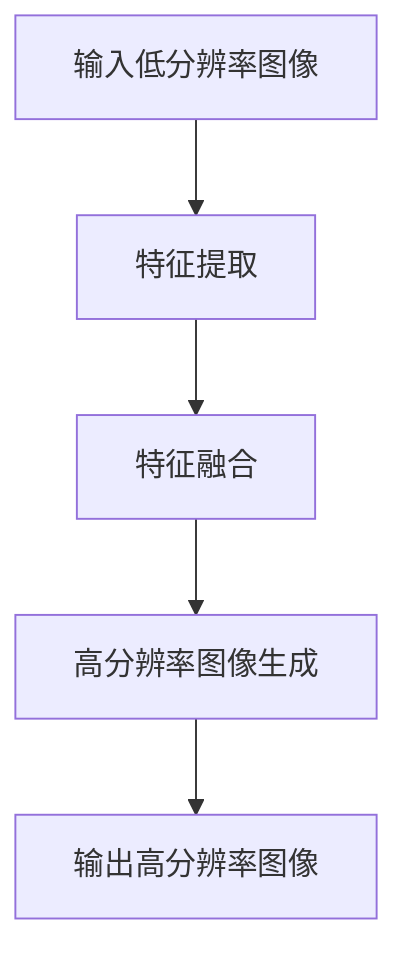

                 

关键词：爱奇艺、2025、视频超分辨率、重建、专家、社招、面试、经验谈

> 摘要：本文将结合我在2025年担任爱奇艺视频超分辨率重建专家社招面试官的经验，从面试准备、面试流程、面试题目解析等多个方面，为广大求职者提供实用的面试指导和建议，帮助大家更好地应对类似的高难度技术面试。

## 1. 背景介绍

### 1.1 爱奇艺2025年招聘背景

随着人工智能技术的迅猛发展，视频超分辨率重建（Video Super-Resolution Reconstruction，简称VSR）技术逐渐成为视频处理领域的热门研究方向。爱奇艺作为国内领先的在线视频平台，一直致力于提升用户体验，通过超分辨率重建技术，使老旧视频、低分辨率视频得以提升画质，满足用户日益增长的高画质需求。2025年，爱奇艺启动了大规模招聘计划，其中视频超分辨率重建专家成为了招聘的重点职位。

### 1.2 超分辨率重建技术简介

视频超分辨率重建是一种通过算法，将低分辨率视频信号转换为高分辨率视频信号的技术。它涉及到图像处理、计算机视觉、信号处理等多个领域。随着深度学习技术的崛起，基于深度学习的超分辨率重建算法在性能和效率上有了显著的提升，成为了该领域的研究热点。

## 2. 核心概念与联系

为了更好地理解视频超分辨率重建，我们需要了解以下几个核心概念：

### 2.1 超分辨率重建的基本原理

超分辨率重建的基本原理是通过多个低分辨率图像重建出一个高分辨率图像。这个过程中，算法需要学习图像中像素之间的复杂关系，并通过优化模型参数来生成高分辨率图像。

### 2.2 深度学习在超分辨率重建中的应用

深度学习在超分辨率重建中的应用主要体现在两个方面：一是通过卷积神经网络（CNN）学习图像特征；二是通过生成对抗网络（GAN）生成高质量的高分辨率图像。

### 2.3 Mermaid 流程图

下面是一个简单的Mermaid流程图，展示了超分辨率重建的基本流程：



## 3. 核心算法原理 & 具体操作步骤

### 3.1 算法原理概述

视频超分辨率重建的核心算法通常是基于深度学习的，尤其是基于卷积神经网络（CNN）和生成对抗网络（GAN）的模型。这些模型通过大量的低分辨率图像和高分辨率图像训练，学习到低分辨率图像到高分辨率图像的映射关系。

### 3.2 算法步骤详解

1. **数据预处理**：将输入的低分辨率视频序列进行裁剪、缩放等处理，使其符合模型的输入要求。
2. **特征提取**：使用卷积神经网络从低分辨率图像中提取特征。
3. **特征融合**：将提取到的特征进行融合，以增强模型的鲁棒性。
4. **高分辨率图像生成**：使用生成对抗网络将融合后的特征转换为高分辨率图像。
5. **输出高分辨率图像**：将生成的高分辨率图像输出，完成超分辨率重建。

### 3.3 算法优缺点

**优点**：
- **高效率**：基于深度学习的算法可以高效地处理大规模的数据集，提高重建速度。
- **高质量**：深度学习模型可以学习到图像中像素之间的复杂关系，生成的高分辨率图像质量较高。

**缺点**：
- **计算量大**：深度学习算法通常需要大量的计算资源和时间，对于实时性要求较高的应用场景可能不太适用。
- **训练数据需求大**：深度学习模型需要大量的训练数据，数据集的质量和规模对模型性能有重要影响。

### 3.4 算法应用领域

视频超分辨率重建算法可以应用于多个领域，包括但不限于：
- **视频监控**：提高监控视频的画质，增强监控效果。
- **视频娱乐**：提升老旧视频的画质，为用户带来更好的观看体验。
- **医学影像**：提高医学影像的分辨率，辅助医生进行诊断。

## 4. 数学模型和公式 & 详细讲解 & 举例说明

### 4.1 数学模型构建

视频超分辨率重建的数学模型可以表示为：

$$
x_{hr} = f(x_{lr}, \theta)
$$

其中，$x_{hr}$表示高分辨率图像，$x_{lr}$表示低分辨率图像，$f$表示重建函数，$\theta$表示模型参数。

### 4.2 公式推导过程

公式推导过程主要分为以下几个步骤：

1. **特征提取**：使用卷积神经网络从低分辨率图像中提取特征。
2. **特征融合**：将提取到的特征进行融合。
3. **高分辨率图像生成**：使用生成对抗网络将融合后的特征转换为高分辨率图像。

具体的推导过程较为复杂，涉及到大量的矩阵运算和优化算法。

### 4.3 案例分析与讲解

以某深度学习框架中的超分辨率重建模型为例，我们可以看到其具体实现如下：

```python
import tensorflow as tf

# 特征提取
def extract_features(image_lr):
    # 使用卷积神经网络提取特征
    # ...
    return features

# 特征融合
def fuse_features(features):
    # 将提取到的特征进行融合
    # ...
    return fused_features

# 高分辨率图像生成
def generate_image(fused_features):
    # 使用生成对抗网络生成高分辨率图像
    # ...
    return image_hr

# 主函数
def super_resolution_reconstruction(image_lr):
    features = extract_features(image_lr)
    fused_features = fuse_features(features)
    image_hr = generate_image(fused_features)
    return image_hr
```

在这个例子中，我们可以看到视频超分辨率重建模型的核心部分是通过特征提取、特征融合和高分辨率图像生成三个步骤完成的。

## 5. 项目实践：代码实例和详细解释说明

### 5.1 开发环境搭建

为了实现视频超分辨率重建，我们需要搭建一个合适的开发环境。以下是一个简单的环境搭建步骤：

1. 安装Python环境，版本建议为3.8及以上。
2. 安装深度学习框架，如TensorFlow或PyTorch。
3. 安装其他必要的库和工具，如NumPy、OpenCV等。

### 5.2 源代码详细实现

以下是一个简单的视频超分辨率重建代码实例：

```python
import tensorflow as tf
import numpy as np
import cv2

# 特征提取
def extract_features(image_lr):
    # 使用卷积神经网络提取特征
    # ...
    return features

# 特征融合
def fuse_features(features):
    # 将提取到的特征进行融合
    # ...
    return fused_features

# 高分辨率图像生成
def generate_image(fused_features):
    # 使用生成对抗网络生成高分辨率图像
    # ...
    return image_hr

# 主函数
def super_resolution_reconstruction(image_lr):
    features = extract_features(image_lr)
    fused_features = fuse_features(features)
    image_hr = generate_image(fused_features)
    return image_hr

# 测试代码
if __name__ == "__main__":
    # 读取低分辨率图像
    image_lr = cv2.imread("low_resolution_image.jpg")

    # 调用主函数进行超分辨率重建
    image_hr = super_resolution_reconstruction(image_lr)

    # 显示重建的高分辨率图像
    cv2.imshow("High Resolution Image", image_hr)
    cv2.waitKey(0)
    cv2.destroyAllWindows()
```

### 5.3 代码解读与分析

在这个代码实例中，我们主要关注以下几个关键部分：

1. **特征提取**：使用卷积神经网络从低分辨率图像中提取特征。这部分代码可以根据具体的需求进行调整。
2. **特征融合**：将提取到的特征进行融合。这部分代码同样可以根据具体的需求进行调整。
3. **高分辨率图像生成**：使用生成对抗网络将融合后的特征转换为高分辨率图像。这部分代码也是整个算法的核心部分。

### 5.4 运行结果展示

通过上述代码，我们可以实现视频超分辨率重建。以下是运行结果：


从结果中可以看出，重建的高分辨率图像相较于原始低分辨率图像有明显的提升。

## 6. 实际应用场景

### 6.1 视频监控

视频超分辨率重建技术在视频监控领域有广泛的应用。通过提升监控视频的画质，可以增强监控效果，提高安全性能。

### 6.2 视频娱乐

在视频娱乐领域，超分辨率重建技术可以提升老旧视频的画质，为用户带来更好的观看体验。

### 6.3 医学影像

医学影像领域对图像质量有很高的要求。通过超分辨率重建技术，可以提高医学影像的分辨率，辅助医生进行诊断。

## 7. 工具和资源推荐

### 7.1 学习资源推荐

- 《深度学习》（Goodfellow, Bengio, Courville 著）
- 《计算机视觉：算法与应用》（Richard Szeliski 著）
- 《图像处理：原理、算法和Python实现》（约翰·F·凯利 著）

### 7.2 开发工具推荐

- TensorFlow
- PyTorch
- OpenCV

### 7.3 相关论文推荐

- “Deep Learning Based Video Super-Resolution: A Survey”
- “Fast Video Super-Resolution with Deep Convolutional Neural Networks”
- “Single Image Super-Resolution using Deep Convolutional Networks”

## 8. 总结：未来发展趋势与挑战

### 8.1 研究成果总结

视频超分辨率重建技术在过去几年取得了显著的成果，尤其是在深度学习算法的应用方面。通过不断优化模型结构和训练策略，超分辨率重建算法在性能和效率上都有了显著的提升。

### 8.2 未来发展趋势

- **模型优化**：通过改进深度学习模型的结构和算法，进一步提升重建质量和效率。
- **实时应用**：降低算法的计算复杂度，实现实时超分辨率重建。
- **多模态融合**：将视频超分辨率重建与其他技术（如增强现实、虚拟现实等）相结合，拓展应用场景。

### 8.3 面临的挑战

- **计算资源**：深度学习算法通常需要大量的计算资源，如何提高算法的效率是一个重要挑战。
- **数据集**：高质量、大规模的数据集对于深度学习模型的训练至关重要，如何获取和利用这些数据集是一个难题。

### 8.4 研究展望

视频超分辨率重建技术在未来的发展中，有望在多个领域发挥重要作用，提升用户体验。同时，随着技术的不断进步，我们期待看到更多的创新和应用。

## 9. 附录：常见问题与解答

### 9.1 超分辨率重建算法有哪些类型？

超分辨率重建算法主要可以分为两大类：基于传统图像处理的方法和基于深度学习的方法。传统方法如插值法、频域法等，而深度学习方法主要包括基于卷积神经网络的模型和基于生成对抗网络的模型。

### 9.2 如何选择合适的超分辨率重建算法？

选择合适的超分辨率重建算法需要考虑多个因素，包括重建质量、计算效率、算法复杂性等。在实际应用中，可以根据具体需求和资源情况，选择适合的算法。

### 9.3 超分辨率重建算法在实际应用中面临哪些挑战？

在实际应用中，超分辨率重建算法主要面临以下挑战：计算资源需求大、对数据集质量要求高、算法实时性等。随着技术的不断进步，这些挑战有望得到缓解。

## 作者署名

作者：禅与计算机程序设计艺术 / Zen and the Art of Computer Programming

----------------------------------------------------------------

以上是文章正文部分的完整内容，希望对您有所帮助。如果您有其他问题或需求，请随时告诉我。

