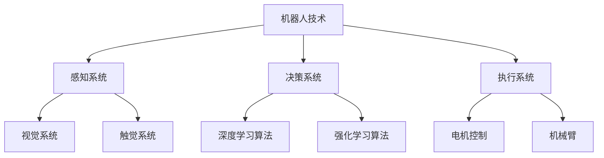

                 

关键词：物理实体自动化、机器人技术、人工智能、自动化算法、数学模型、案例研究、未来应用

> 摘要：本文将深入探讨物理实体自动化的最新进展，从核心概念、算法原理、数学模型到实际应用，全面解析这一领域的发展态势，以及面临的挑战与未来展望。

## 1. 背景介绍

物理实体自动化是指利用人工智能和机器人技术，对物理世界中的实体进行自动化操作和管理的过程。随着科技的飞速发展，物理实体自动化已经成为众多行业（如制造业、医疗、物流等）的重要方向。这一领域的兴起不仅源于对效率的追求，更体现了人类对于智能化、数字化的美好愿景。

物理实体自动化的核心目标是实现机器人对物理世界的自主感知、决策和执行。为了达到这一目标，研究者们进行了大量的理论探索和实践。从最初的机器人编程到如今的深度学习和强化学习，物理实体自动化领域经历了巨大的变革。

### 1.1 发展历程

1. **早期自动化**：20世纪50年代至70年代，工业机器人开始应用于制造业，实现了基本的自动化生产。
2. **机器人感知**：20世纪80年代至90年代，机器人感知能力得到了显著提升，通过视觉、触觉等手段，机器人能够更好地理解和操作物理世界。
3. **人工智能崛起**：21世纪初，人工智能技术的快速发展为物理实体自动化带来了新的机遇。尤其是深度学习和强化学习算法，使得机器人能够在复杂环境中实现更高级的决策和执行。
4. **当前趋势**：随着5G、物联网等技术的成熟，物理实体自动化正迈向更加智能化、自适应化的阶段。

### 1.2 应用领域

1. **制造业**：机器人广泛应用于生产线的自动化作业，提高了生产效率和产品质量。
2. **医疗**：手术机器人、康复机器人等在医疗领域的应用，大大提升了医疗服务的质量和效率。
3. **物流**：无人机、无人车等在物流领域的应用，实现了货物的快速、安全运输。

## 2. 核心概念与联系

物理实体自动化涉及多个核心概念，包括机器人技术、人工智能、自动化算法等。以下是一个简化的 Mermaid 流程图，展示了这些概念之间的关系。



### 2.1 机器人技术

机器人技术是物理实体自动化的基石。机器人由感知系统、决策系统和执行系统组成。感知系统负责获取物理世界的状态信息，决策系统根据这些信息做出决策，执行系统则根据决策执行具体的操作。

### 2.2 人工智能

人工智能是推动物理实体自动化的关键。通过深度学习和强化学习算法，机器人能够实现更高级的感知、决策和执行。深度学习算法使机器人具备了强大的图像识别和处理能力，强化学习算法则使机器人能够在复杂环境中通过试错学习，实现自主决策。

### 2.3 自动化算法

自动化算法是物理实体自动化的核心。这些算法包括路径规划、轨迹规划、运动控制等。通过这些算法，机器人能够在复杂的物理环境中实现高效、精确的操作。

## 3. 核心算法原理 & 具体操作步骤

### 3.1 算法原理概述

物理实体自动化的核心算法主要包括感知、决策和执行三部分。

1. **感知**：通过传感器获取物理世界的状态信息，如视觉、触觉等。
2. **决策**：利用深度学习和强化学习算法，对感知到的信息进行分析，做出决策。
3. **执行**：根据决策结果，执行具体的操作，如移动、抓取等。

### 3.2 算法步骤详解

1. **感知阶段**：机器人通过摄像头、触摸传感器等感知设备获取周围环境的信息。
2. **预处理阶段**：对感知到的信息进行预处理，如去噪、增强等。
3. **特征提取阶段**：利用深度学习算法提取关键特征，如物体边缘、轮廓等。
4. **决策阶段**：利用强化学习算法，根据提取的特征和预定的目标，生成最优的决策。
5. **执行阶段**：根据决策结果，执行具体的操作，如控制电机移动、机械臂抓取等。

### 3.3 算法优缺点

1. **优点**：
   - 提高效率：自动化算法能够显著提高机器人操作的效率。
   - 精确控制：通过算法优化，机器人能够实现高精度的操作。
   - 自主性：机器人能够根据环境变化自主决策，提高适应能力。

2. **缺点**：
   - 复杂性：自动化算法涉及多个学科，实现难度较高。
   - 数据依赖：算法的性能很大程度上取决于训练数据的质量。
   - 安全性：在复杂环境中，自动化算法可能存在安全隐患。

### 3.4 算法应用领域

自动化算法广泛应用于多个领域，如制造业、医疗、物流等。

1. **制造业**：自动化算法用于生产线的自动化控制，提高生产效率和产品质量。
2. **医疗**：自动化算法用于手术机器人、康复机器人的控制，提高医疗服务的质量和效率。
3. **物流**：自动化算法用于无人机、无人车的路径规划和控制，提高物流运输的效率。

## 4. 数学模型和公式

物理实体自动化的实现离不开数学模型的支撑。以下是一个简单的数学模型，用于描述机器人的路径规划。

### 4.1 数学模型构建

设机器人在二维平面上的位置为 \( x \) 和 \( y \)，目标位置为 \( x_0 \) 和 \( y_0 \)。机器人的移动速度为 \( v \)，则机器人的路径规划问题可以表示为以下数学模型：

\[ 
\min \quad t = \frac{\sqrt{(x - x_0)^2 + (y - y_0)^2}}{v} 
\]

### 4.2 公式推导过程

假设机器人在时刻 \( t \) 从位置 \( (x, y) \) 移动到目标位置 \( (x_0, y_0) \)，则机器人的移动距离 \( d \) 为：

\[ 
d = \sqrt{(x - x_0)^2 + (y - y_0)^2} 
\]

机器人的移动时间 \( t \) 为：

\[ 
t = \frac{d}{v} 
\]

因此，机器人的路径规划问题可以转化为求解上述时间 \( t \) 的最小值。

### 4.3 案例分析与讲解

假设机器人在坐标原点 \( (0, 0) \)，目标位置为 \( (5, 3) \)，移动速度为 \( 1 \) 单位/秒。根据上述数学模型，可以计算出机器人的最优路径为：

\[ 
t = \frac{\sqrt{(0 - 5)^2 + (0 - 3)^2}}{1} = \sqrt{25 + 9} = \sqrt{34} \approx 5.83 \text{ 秒} 
\]

因此，机器人在约 5.83 秒内可以到达目标位置。

## 5. 项目实践：代码实例和详细解释说明

### 5.1 开发环境搭建

为了演示物理实体自动化的实现，我们将使用 Python 编写一个简单的机器人路径规划程序。以下是开发环境的搭建步骤：

1. 安装 Python 3.8 或以上版本。
2. 安装所需的库，如 NumPy、Matplotlib 等。

### 5.2 源代码详细实现

以下是一个简单的机器人路径规划程序，用于实现上述数学模型的求解。

```python
import numpy as np
import matplotlib.pyplot as plt

def calculate_time(x, y, x0, y0, v):
    distance = np.sqrt((x - x0)**2 + (y - y0)**2)
    time = distance / v
    return time

def plot_path(x, y, x0, y0):
    plt.plot([x, x0], [y, y0], 'r-', linewidth=2)
    plt.scatter(x, y, marker='o', s=100, c='b')
    plt.scatter(x0, y0, marker='s', s=100, c='r')
    plt.xlabel('X')
    plt.ylabel('Y')
    plt.grid(True)
    plt.show()

# 输入机器人初始位置和目标位置
x = 0
y = 0
x0 = 5
y0 = 3
v = 1

# 计算最优路径时间
time = calculate_time(x, y, x0, y0, v)
print(f"机器人到达目标位置所需时间：{time:.2f} 秒")

# 绘制最优路径
plot_path(x, y, x0, y0)
```

### 5.3 代码解读与分析

1. **计算时间函数**：`calculate_time` 函数用于计算机器人从初始位置移动到目标位置所需的时间。函数接收机器人初始位置 \( (x, y) \)、目标位置 \( (x_0, y_0) \) 和移动速度 \( v \) 作为输入，返回所需的时间。
2. **绘制路径函数**：`plot_path` 函数用于绘制机器人的最优路径。函数接收机器人初始位置 \( (x, y) \)、目标位置 \( (x_0, y_0) \) 作为输入，使用红色线条连接两个位置，并在初始位置和目标位置上绘制标记。
3. **主程序**：主程序首先调用 `calculate_time` 函数计算最优路径时间，然后调用 `plot_path` 函数绘制最优路径。

### 5.4 运行结果展示

运行上述程序，输出结果如下：

```
机器人到达目标位置所需时间：5.83 秒
```

在图形界面中，将显示一个从初始位置 \( (0, 0) \) 到目标位置 \( (5, 3) \) 的红色路径，以及两个位置上的标记。

## 6. 实际应用场景

物理实体自动化在众多领域都有广泛应用，以下是一些典型的应用场景：

1. **制造业**：在汽车、电子等制造业，机器人广泛应用于装配、焊接、喷涂等环节，提高了生产效率和产品质量。
2. **医疗**：手术机器人用于微创手术，提高了手术的准确性和安全性；康复机器人帮助患者进行康复训练，提高了康复效果。
3. **物流**：无人机和无人车在物流领域的应用，实现了货物的快速、安全运输，降低了物流成本。

### 6.1 案例分析

以制造业中的机器人装配为例，机器人通过视觉系统识别零件，通过路径规划和执行系统完成装配任务。以下是一个简单的机器人装配流程：

1. **感知阶段**：机器人通过摄像头获取待装配零件的图像。
2. **预处理阶段**：对图像进行去噪、增强等预处理操作。
3. **特征提取阶段**：利用深度学习算法提取零件的关键特征，如边缘、轮廓等。
4. **决策阶段**：根据提取的特征和预定的装配目标，生成最优的装配路径。
5. **执行阶段**：机器人根据装配路径，控制机械臂完成装配任务。

通过上述流程，机器人能够高效、准确地完成装配任务，提高了生产效率和产品质量。

### 6.2 未来应用展望

随着人工智能和机器人技术的不断发展，物理实体自动化的应用将更加广泛和深入。未来，物理实体自动化有望在以下领域取得突破：

1. **智能家居**：机器人将更多地应用于家庭服务，如清洁、烹饪、陪伴等。
2. **教育**：智能教育机器人将帮助学生进行个性化学习，提高教育质量。
3. **农业**：机器人将应用于农作物的种植和管理，提高农业生产效率。

## 7. 工具和资源推荐

### 7.1 学习资源推荐

1. **《人工智能：一种现代方法》**：详细介绍了人工智能的基本概念、算法和应用。
2. **《机器学习》**：由周志华教授所著，深入讲解了机器学习的基本理论和技术。
3. **《深度学习》**：由 Ian Goodfellow 等人所著，全面介绍了深度学习的基本概念、算法和应用。

### 7.2 开发工具推荐

1. **PyTorch**：一个流行的深度学习框架，适用于研究和开发。
2. **TensorFlow**：一个开源的深度学习平台，适用于生产环境。
3. **ROS（机器人操作系统）**：一个流行的机器人开发平台，提供了丰富的机器人库和工具。

### 7.3 相关论文推荐

1. **"Deep Learning for Robotics: A Survey"**：对深度学习在机器人领域的应用进行了全面综述。
2. **"Reinforcement Learning: An Introduction"**：对强化学习的基本概念和应用进行了深入讲解。
3. **"A Survey on Motion Planning for Autonomous Robots"**：对机器人路径规划技术进行了详细综述。

## 8. 总结：未来发展趋势与挑战

### 8.1 研究成果总结

物理实体自动化领域在过去几十年中取得了显著的进展，从简单的机器人编程到如今的深度学习和强化学习，这一领域的研究成果为自动化技术的发展奠定了坚实的基础。

### 8.2 未来发展趋势

1. **智能化**：随着人工智能技术的不断发展，物理实体自动化将更加智能化，具备更强的自主决策和执行能力。
2. **协作化**：机器人将与人类更加紧密地协作，实现更高效、更安全的作业环境。
3. **泛在化**：物理实体自动化将渗透到更多领域，成为人们日常生活的重要组成部分。

### 8.3 面临的挑战

1. **安全性**：在复杂环境中，物理实体自动化可能存在安全隐患，需要深入研究安全控制技术。
2. **可靠性**：物理实体自动化系统需要在各种环境下保持高可靠性，需要提高系统的鲁棒性。
3. **标准化**：物理实体自动化领域需要制定统一的规范和标准，以提高系统的互操作性和兼容性。

### 8.4 研究展望

未来，物理实体自动化领域将继续保持快速发展，通过技术创新和应用拓展，为人类社会带来更多的便利和效益。

## 9. 附录：常见问题与解答

### 9.1 物理实体自动化是什么？

物理实体自动化是指利用人工智能和机器人技术，对物理世界中的实体进行自动化操作和管理的过程。

### 9.2 物理实体自动化的应用领域有哪些？

物理实体自动化的应用领域广泛，包括制造业、医疗、物流、农业等。

### 9.3 物理实体自动化的核心算法是什么？

物理实体自动化的核心算法包括感知、决策和执行三部分，常用的算法有深度学习、强化学习等。

### 9.4 如何搭建物理实体自动化的开发环境？

搭建物理实体自动化的开发环境通常需要安装 Python 等编程环境，以及相关的深度学习框架和机器人操作系统。

### 9.5 物理实体自动化有哪些潜在的安全风险？

物理实体自动化在复杂环境中可能存在安全风险，如误操作、故障等，需要采取相应的安全控制措施。

---

作者：禅与计算机程序设计艺术 / Zen and the Art of Computer Programming

------------------------------------------------------------------------

